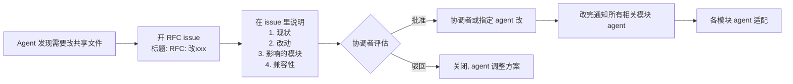
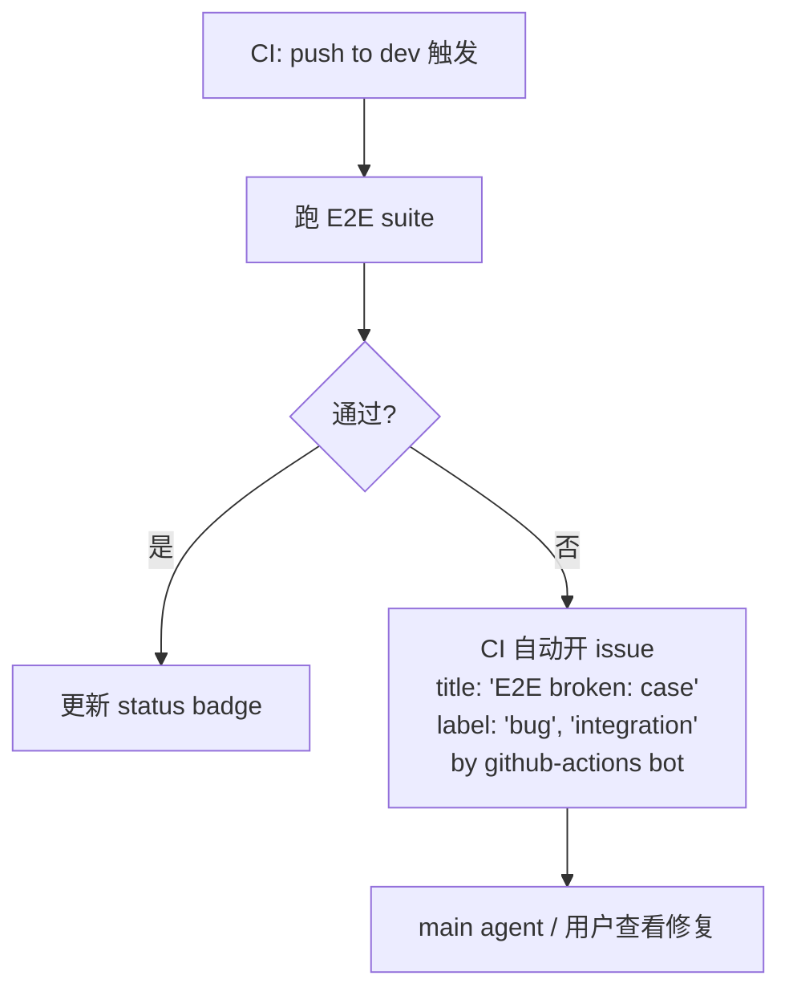

# Agent 协作协议

> 多个 AI Agent 并行开发本项目时必须共同遵守的协议。每个 agent 启动时**必须先读本文**和模块级 `CLAUDE.md`。
>
> **2026-05-17 update**:本协议初稿假设 N 个 persistent agent + 集成 agent + review agent 并行。实际执行模型为 **单 main agent + ephemeral subagents**(见 §0a)。**§0a 是 operative,§1-§12 是 aspirational reference design**。当文字与 §0a 冲突时以 §0a 为准。

---

## 0. 角色定义

| 角色 | 设计数量 | 设计职责 | 实际承担(2026-05) |
|---|---|---|---|
| **协调者**(Coordinator) | 1(人或高级 agent) | 拍板架构、分发任务包、处理 RFC、最终 merge | 用户(via chat) |
| **模块 Agent**(Module Agent) | N(推荐 4-6 个并行) | 在分配的**单一模块**内执行任务包、提 PR | **Main agent(1)** + ephemeral subagents |
| **集成 Agent**(Integration Agent) | 1 | 跑 E2E、契约校验、merge 健康度监控、开 issue 指责任模块 | **CI auto post-merge E2E**(无 persistent 监听) |
| **Review Agent**(可选) | 0-1 | 代替人做初步 PR review,最终 merge 仍需协调者拍板 | self-review + 用户最终审;高风险 PR 可派 ephemeral subagent 深审 |

**关键原则**:任务或 subagent 严格绑定**单一模块**,跨模块改动必须经协调者批准。

---

## 0a. 单 agent 执行模型(operative)

> **本节描述当前实际工作模型**。§1-§12 的多 agent 表述,在本节框架下重新解读。

### 0a.1 Main agent + ephemeral subagents

- **Main agent** = Claude Code 本身,顺序执行所有模块工作,可跨模块切换 hat(但单任务期间仍绑定单模块)
- **Ephemeral subagent** = main agent 派生的子任务执行者,完成后退出,无持久状态
- 用户(协调者)通过 chat 派任务、批准 RFC、审 PR

### 0a.2 Subagent 派生条件(同时满足才派生)

1. 子任务**互不依赖**(无 shared 分支冲突)
2. 子任务的 **Allowed Paths 互不重叠**
3. 子任务能**完整在一个 subagent session 内**完成(不需跨次回忆 main agent 上下文)
4. 派生有真实并行收益(≥ 30% wall-clock 节省;否则 main agent 顺序做)

不满足任一条 → main agent 顺序执行。

### 0a.3 Subagent 角色绑定

- 每个 subagent **绑定单一模块**(继承"Module Agent"模块约束)
- subagent **不能再派生 subagent**(避免协调失控)
- **共享契约文件**(`docs/api-contract.yaml` / `configs/mock-data/schema.json` / `operators/pool-operator/api/v1alpha1/*.go`)**永不**由 subagent 修改,只由 main agent 串行修改

### 0a.4 Subagent 失败处理

- subagent 异常退出 → main agent 接管,**不自动重试**(分析失败原因)
- 子任务部分完成 → main agent 验证已完成部分 + 继续剩余
- 跨 subagent 冲突(理论不应发生)→ main agent 介入,回滚有问题的改动

### 0a.5 RFC 简化:chat + ADR

设计(§4):GitHub issue "RFC: xxx" → 协调者评估 → 实施 → 通知。

实际(operative):
1. Main agent 在 chat 提议契约变更
2. 用户在 chat 批准 / 反驳
3. Main agent 写 `docs/adr/NNNN-<title>.md` 作为审计追踪
4. 后续任务包引用 ADR 编号

GitHub RFC issue 仪式**省略**;ADR 是 single source of truth。

### 0a.6 集成 Agent → CI auto E2E

设计(§8):persistent Integration Agent 监听 dev 分支,每次 merge 后跑 E2E。

实际(operative):
1. CI 触发条件 `push to dev` 自动跑 E2E
2. 失败 → CI annotation + 自动开 GitHub issue(by `github-actions[bot]`)
3. main agent / 用户查看后修复

无 persistent 监听;事件驱动。

### 0a.7 PR approval

设计:每个 PR 1 个 approval(人或 Review Agent)。

实际:
- 用户是 final approver
- Main agent 可自审(走 §5.3 模板 checklist)
- 高风险 PR(改共享契约 / 跨模块影响)派 ephemeral review subagent 深审
- subagent 派生 PR 后,subagent **不审自己的 PR**

### 0a.8 GitHub Projects 看板 → 跳过

设计(§11):看板维护任务状态。
实际:任务状态由 PR / branch / CI 状态承载,不再维护并行看板。

### 0a.9 并发 subagent 隔离:git worktree(W1 复盘补丁,2026-05-17)

**背景**:W1 派 4 个 subagent 并发,**全部**在主 working tree 上 git checkout/branch/cherry-pick → 互踩(T009 commit 落到 T007 分支、T008 用 `git branch -f` + `git reset --hard` 自救)。Main agent 事后 cherry-pick 清理。

**operative rule**:**派 ≥ 2 个 subagent 并发时,main agent 必须为每个 subagent 创建独立 git worktree**。1 个 subagent 可在主 working tree 跑。

#### 0a.9.1 Worktree 命名

```
D:/code/ai-edge/         主 working tree (main agent 用)
D:/code/ai-edge-wt/      worktree 父目录 (sibling, 主仓库外, 不被 git tracked)
   ├── p1-t-XXX/         一个 subagent 一个 worktree
   └── p1-t-YYY/
```

worktree 父目录在主仓库**外**,无需 `.gitignore`。

#### 0a.9.2 Main agent 派 subagent 流程

```bash
# 1. 准备 worktree + branch
cd /d/code/ai-edge
git worktree add ../ai-edge-wt/p1-t-XXX -b feat/p1-t-XXX-<short> dev

# 2. 派 subagent,在 prompt 里指定:
#    "工作目录: /d/code/ai-edge-wt/p1-t-XXX"
#    "分支 feat/p1-t-XXX-<short> 已由 main agent 创建,不要切分支"
#    "只 git add <Allowed Paths 内文件> + git commit"

# 3. subagent 完成 commit 后,main agent 在主 working tree 操作:
cd /d/code/ai-edge
git checkout dev
git merge --squash feat/p1-t-XXX-<short>
git commit -m "..."

# 4. 清理
git worktree remove ../ai-edge-wt/p1-t-XXX
git branch -D feat/p1-t-XXX-<short>
```

#### 0a.9.3 Subagent 在 worktree 里的纪律

- 工作路径固定:`cd /d/code/ai-edge-wt/<task-id>`
- **禁止**:`git checkout` / `git branch -f` / `git fetch` / `git push` / 跨 worktree 操作
- 允许:`git status`, `git diff`, `git add <files>`, `git commit`, `git log`
- 完成后报告:branch 名 + commit hash + AC 结果

#### 0a.9.4 单 subagent 例外

派 **1 个** subagent 时,main agent 与 subagent 串行(不并发)→ 主 working tree 上跑即可,worktree 是额外开销。

#### 0a.9.5 Cleanup 不可省

worktree 失败 / 中断 → main agent 必须 `git worktree remove --force` + 删 stale branch,否则 `git worktree list` 累积垃圾。

### 0a.10 Plan-session vs execute-session 严格分开(Phase 4 起,2026-05-19)

**规则**:写 `docs/phase{N}-plan.md` 的 plan-style session 与实际跑 `T{N}XX` 代码改动的 execute-style session **必须分两个不同的 chat session**。

**Why**:通过 session 边界把"规划"与"执行"的 context 隔离。执行 session 启动时 fresh context 读 plan + 任务包,避免 plan session 里的探索性 reasoning(读了多少参考文档 / 考虑了多少候选 / 为什么选这个 task 划分)挤占执行决策空间。也避免 plan 收尾后"顺便起一个 T001 吧"的滑坡。

**Plan-style session 收尾 = 4 步**:
1. plan 文件写好(`docs/phase{N}-plan.md` + 必要的 ADR 占位)
2. `git commit -m "docs: Phase N plan ..."`
3. 报告 commit hash + task 清单 + 推荐起手 task
4. **停** — 不主动起 task · 不 push remote · 不 schedule · 不做任何后续 follow-up

用户用 `/clear` 或新 chat 启动 execute session;那时 fresh context 读 plan + 启动 `T{N}XX`。

**与 §0a.11 strict-per-task 的关系**:§0a.11 是 task 内纪律(每 task verify + commit + 停);本节是 phase 级别 plan / execute 跨 session 隔离。**两条互补,不冲突**。

**Plan session 留 uncommitted 工作树是允许的**:若 plan session 在调研中顺手 sketch 了 ADR 或 cross-ref 文档草稿,且这些草稿天然属于 execute session 的某个 T001/T002 task,**留 uncommitted 等 execute session 拿** 是合理的(不强制 git stash / git restore)。**仅 commit plan 主文件**,uncommitted 草稿是给下一 session 的隐式 baton。

**典型反例(2026-05-19 前的旧节奏 → 已 deprecated)**:
- Phase 2 / 早 Phase 3:plan 写完顺手 "起 T001 一气呵成" → execute 决策被 plan 探索阶段的 context 干扰
- Phase 3 batch 1-3:plan 与 execute 同 session + batch 派 3 subagent 并发 → batch 4 起改 strict-per-task,Phase 4 起再收紧为 plan/execute 跨 session 分离

### 0a.11 Strict per-task verify(Phase 3 batch 4 起,2026-05-19)

**规则**:Phase 3+ 任务执行模式 = **单 task 串行 + main agent 严格 verify**。不再 batch 派 3 subagent + 末尾 coexistence verify。

**每 task 闭环 = 5 步**:
1. main agent 派 1 个 subagent(或自己做,见下方"例外")· 给 worktree + Allowed Paths + 严格 spec
2. subagent 完工 commit + 报告 stdout
3. **main agent 独立 strict verify**(不只信 subagent 自报):
   - 编译:`go build` / `go vet`
   - 测试:`go test` / envtest 真跑(in dev tree 共存,不仅 subagent worktree)
   - functional:对 binary / endpoint 真发请求(curl `/metrics` / kubectl apply --dry-run / helm lint / helm template / 等)
   - 文件结构:`git diff --stat` 看实际改动是否匹配 Allowed Paths
   - 跨引用:workflow 提到的 file path 必须实际存在 等
4. verify 全过 → 单独 `git merge --squash` + commit + cleanup worktree
5. **停 — 等用户指明下一 task** · 不主动连下一批

**例外**:
- **pure docs / 1-file collation 类**(如 main agent 改 cmd/main.go 注册 collector · 写 ADR · 改 README current-phase line)可由 main agent 直接做,不派 subagent;但仍要 strict verify。
- 用户显式说"批量"/"一起" 才回到 batch 模式。

**为什么改这个**:Phase 3 batch 2(T002/T003 并发)曾因 dup symbol 在 squash 后才暴露,临时 fix 走 da6f416 commit。Batch 4 起改 strict-per-task,batch 4 完成后无 dup fix 需要(anti-dup 在 spec 阶段被预防,verify 在每 task 边界被捕捉)。

**典型 verify 输出示例**(T103 commit message 内嵌):
```
helm lint --strict          -> 1 chart(s) linted, 0 chart(s) failed
helm template (default)     -> 4 kinds rendered
YAML syntax (chart files)   -> all parse via python yaml.safe_load
community chart dir gone    -> test ! -d ... = OK
known-issues #7 + #9        -> grep matches with resolution notes
```

每条 verify 必带 stdout 实证,**不只"看起来对"就 squash**。

### 0a.12 Push / GitHub creds 协议(2026-05-19)

**Remote**:`origin = https://github.com/tech88-art/O-Cloud.git`(public · master + dev + 7 tags as of phase-3-complete)

**认证**:long-term fine-grained PAT(`Contents=RW` + `Workflows=RW` · only `tech88-art/O-Cloud`)已通过 `git credential approve` 写入 **Windows Git Credential Manager**。非交互 Claude bash shell `git push --dry-run origin dev` 实测 → `Everything up-to-date`(无 `/dev/tty` 提示)。

**使用方式**:
- ✅ 任意 session 直接 `git push origin <branch>` 即可,无需任何 token 操作
- ✅ Git 走 `manager` helper → Windows Credential Store 回放 PAT

**Anti-pattern · 不要做**:
- ❌ **不要** `git remote set-url origin "https://x-access-token:<token>@github.com/..."` embed token 到 URL · cmgr 已经 handle,embed 是 2026-05-19 早期 push 失败时的临时 hack,token 现已 long-term cached
- ❌ **不要**把 token 值写进 docs / commit message / chat output / memory 文件 · token 仅在 cmgr,memory `reference_github_creds.md` 只记 "在 cmgr 里"
- ❌ 用户**不要**再贴 token 给 Claude(已 cached,无需重新提供)

**Repo-local git config**(`.git/config` 已设,留着不动):
```
http.version = HTTP/1.1       # schannel + 代理 HTTP/2 handshake 抖动 workaround
http.proxy   = http://127.0.0.1:7897   # 用户 proxy(clash/shadowsocks 类)
https.proxy  = http://127.0.0.1:7897
```

若用户 proxy 变了 → main agent 帮 unset(`git config --unset http.proxy ...`)。

**故障恢复**(若 cmgr 丢缓存 / 系统重装):
1. 用户去 https://github.com/settings/tokens 找到现有 fine-grained PAT(应名称 "O-Cloud" 同类)· 复制 token
2. 若已 expired / 不见 → 重新生成,scope 必须含 `Contents=RW` + **`Workflows=RW`**(漏 Workflows 会被拒,2026-05-19 第一次 push 失败教训)
3. Claude bash:
   ```
   printf "protocol=https\nhost=github.com\nusername=x-access-token\npassword=<TOKEN>\n\n" | git credential approve
   ```
4. 验证:`git push --dry-run origin dev` → `Everything up-to-date` 即成功

---

## 1. 任务包格式(Task Package)

所有任务包按此模板创建,存放于 `docs/tasks/P1-T-XXX.md` 或 issue 里。Agent 接到任务包即开工,**无需向其他 agent 询问上下文**。

```markdown
# P1-T-XXX: <简短标题>

## Meta
- **Module**: backend | frontend | operators | configs | deploy
- **Priority**: P0 | P1 | P2
- **Estimated**: <人时单位,0.5 / 1 / 2 / 4>
- **Depends on**: P1-T-YYY, P1-T-ZZZ(必须先完成)
- **Blocks**: P1-T-AAA(被本任务阻塞)
- **Assignee**: <agent-id 或 unassigned>

## Context
<完整背景,不假设 agent 看过其他任务。引用契约/规范文件用绝对路径。>

## Inputs
- 契约:`docs/api-contract.yaml` §<...>
- 依赖:P1-T-YYY 的产物 `<path>`
- 设计参考:`docs/architecture.md` §<...>

## Allowed Paths(白名单,agent 只能改这些)
- `backend/pkg/api/cluster.go`(新建)
- `backend/pkg/api/cluster_test.go`(新建)

## Forbidden Paths(明确禁改)
- `docs/api-contract.yaml`(契约由 P1-T-002 维护,要改走 RFC)
- 其他模块的任何路径

## Acceptance Criteria(机器可验证)
- [ ] `go test ./backend/pkg/api/... -run TestCluster` 通过
- [ ] `golangci-lint run ./backend/...` 无错误
- [ ] 与 `docs/api-contract.yaml` 对齐(CI 自动检查)
- [ ] `make build` 通过
- [ ] PR description 含变更摘要

## Definition of Done
- [ ] 所有 Acceptance Criteria 打勾
- [ ] PR 已开(Conventional Commits 格式标题)
- [ ] 自测截图/日志附在 PR description

## Notes
<可选:风险、已知坑、后续工作>
```

**示例**:见 `docs/tasks/P1-T-101-backend-cluster-api.md`(Phase 1 任务包正式创建时)。

---

## 2. 模块边界与路径所有权

每个模块有**严格的路径所有权**。表外的路径需走 RFC:

| 模块 | 路径前缀(OWN) | 任务包前缀 |
|---|---|---|
| **backend** | `backend/**`, `docs/api-contract.yaml`(仅 P1-T-002 维护) | P1-T-1xx, P1-T-2xx(后端部分), P1-T-3xx(后端部分) |
| **frontend** | `frontend/**` | P1-T-1xx(前端部分), P1-T-2xx(前端部分), P1-T-3xx(前端部分) |
| **operators** | `operators/**` | P1-T-003, P1-T-2xx(CRD相关) |
| **configs** | `configs/**`, Mock 数据生成器 | P1-T-004, P1-T-109, 等 |
| **deploy** | `deploy/**`, `.github/workflows/**`, `scripts/install*.sh`, `hack/**` | P1-T-007, P1-T-008, P1-T-209, P1-T-304 |
| **docs** | `docs/**`(除契约外), `README.md`, `CLAUDE.md` | P1-T-306, 各 RFC |

**共享文件**(任何模块都可以读、修改需 RFC — 实际走 §0a.5 chat+ADR):
- `docs/api-contract.yaml`
- `docs/architecture.md`
- `operators/pool-operator/api/v1alpha1/*.go`(CRD 类型)
- `configs/mock-data/schema.json`
- 根 `Makefile`、根 `CLAUDE.md`、根 `README.md`

**自由文件**(任何模块都可以无需协调修改):
- 自己模块下的所有文件(OWN 路径内)

---

## 3. 同步契约(Synchronization Primitives)

下列文件是 agent 之间的**协议**,**W1 D1-D2 sealed-for-review**(可经 RFC 修订,非绝对冻结):

### 3.1 OpenAPI 契约 `docs/api-contract.yaml`

- 后端 handler 实现必须与契约一致
- 前端 API 客户端代码必须根据契约生成(建议用 `openapi-typescript`)
- CI 强制校验:后端 handler 注解 vs 契约、前端调用类型 vs 契约

### 3.2 Mock 数据 Schema `configs/mock-data/schema.json`

- Mock 数据生成器产出必须符合 schema
- 后端 mock datasource 读取时按 schema 解析

### 3.3 CRD 类型 `operators/pool-operator/api/v1alpha1/*.go`

- 字段变更走 RFC(实际 §0a.5)
- `make generate` 与 `make manifests` 必须随之更新

---

## 4. RFC 流程(修改共享文件唯一通道,设计版本)

> **当前 operative 流程见 §0a.5**(chat + ADR,无 issue 仪式)。下述 mermaid 是 N-agent 设计参考。



**RFC issue 标题前缀**:`RFC:`
**RFC issue label**:`rfc`, 影响的模块(如 `mod:backend`, `mod:frontend`)

---

## 5. 分支与 PR

### 5.1 分支命名

```
<type>/p1-t-<task-id>-<short-desc>

type: feat | fix | docs | refactor | test | chore | rfc
```

例如:
- `feat/p1-t-101-backend-cluster-api`
- `rfc/p1-r-001-add-trace-id-to-api`

### 5.2 Commit Message

[Conventional Commits](https://www.conventionalcommits.org/):

```
<type>(<scope>): <subject>

<body>

<footer with task ref>
```

示例:
```
feat(backend): implement cluster topology API

- Add GET /api/v1/clusters/:id/topology handler
- Aggregate nodes + NPUs + slices from mock datasource
- Add unit tests covering 3 scenarios

Refs: P1-T-102
```

### 5.3 PR 模板

PR description 强制包含:

```markdown
## Task
P1-T-XXX

## Summary
<一句话>

## Changes
- <bullet 1>
- <bullet 2>

## Allowed Paths Check
- [x] 仅修改了任务包 Allowed Paths 范围内的文件

## Acceptance Criteria
- [x] <criterion 1>
- [x] <criterion 2>
...

## Testing
<贴本地测试输出或截图>

## Related
- 依赖任务:<list>
- 后续任务:<list>
```

### 5.4 Merge 规则

- 目标分支:`dev`(Phase 内)
- **必须**:CI 全绿
- **必须**:至少 1 个 approval(实际见 §0a.7,用户 final approver)
- **必须**:Allowed Paths 检查通过(CI 自动)
- **禁止**:直接 push 到 `dev` 或 `main`
- **禁止**:force push 到任何共享分支
- **禁止**:`--no-verify` 跳过 hook
- Merge 方式:**squash merge**

---

## 6. 冲突规避规则

### 6.1 文件级冲突

- 多个 agent / subagent 不能同时持有改同一文件的任务包(协调者 / main agent 分发时检查)
- 例外:纯新增文件(如各自加自己的测试文件)

### 6.2 契约冲突

- 后端先于前端 1-2 天落地新 API(前端任务包 depends on 后端任务包)
- 契约变更走 RFC(实际 §0a.5),CI 阻止"契约改了但实现没跟上"

### 6.3 时序冲突

- 任务包的 `Depends on` 必须显式
- 协调者 / main agent 按拓扑序分发任务包
- 一个任务包未完成(PR 未 merge),其阻塞的任务包**不投放**

---

## 7. CI 强制项

`.github/workflows/ci.yml` 必须包含:

| 检查项 | 范围 | 失败动作 |
|---|---|---|
| Lint | 全仓库 | 阻止 merge |
| Unit Test | 各模块 | 阻止 merge |
| OpenAPI 契约一致性 | backend 调用 vs `api-contract.yaml` | 阻止 merge |
| Mock 数据 schema 合法性 | `configs/mock-data/**` vs schema | 阻止 merge |
| Allowed Paths 校验 | PR diff 路径 vs 任务包 Allowed Paths | 阻止 merge |
| Build | 各模块 | 阻止 merge |
| E2E(W2 起) | Playwright 主流程 | warning(不阻止 merge,开 issue 指责) |

**Allowed Paths CI 校验**:从 PR description 解析 `Refs: P1-T-XXX`,查 `docs/tasks/P1-T-XXX.md`,对比实际 diff 路径是否在白名单内。超出 → 失败。

---

## 8. 集成测试自动化(实际:CI 自动 E2E,非 persistent agent)

> 见 §0a.6。下述 mermaid 是 N-agent 设计参考。



无 persistent 监听;事件驱动。

---

## 9. Agent 启动 Checklist

每个 Module Agent / subagent 启动新会话时**必须**:

```
1. 读取根 CLAUDE.md
2. 读取自己模块的 <module>/CLAUDE.md
3. 读取本文件 docs/agent-coordination.md(尤其 §0a)
4. 读取当前任务包 docs/tasks/P1-T-XXX.md
5. 跑 git fetch && git status,确认基线
6. 检查任务包 Depends on 列表里的任务是否已 merge 到 dev
7. 从 dev 拉特性分支:git checkout -b <branch-name>
8. 开干
```

**禁止**:跳过任何一步直接开始编码。

---

## 10. 异常处理

| 情况 | 处理 |
|---|---|
| Agent 发现任务包描述不清晰 | 不要猜,在 chat 问用户(协调者) |
| Agent 完成任务后发现需要改禁改路径 | 不要改,走 §0a.5 chat + ADR |
| 两个 subagent PR 冲突(应不发生) | 后提的负责 rebase;如冲突在共享文件 → main agent 介入 + §0a.5 |
| Agent 跑测试发现非自己模块的 bug | 开 issue,**不**修复(指给对应模块的 Agent / 下个任务) |
| CI 失败原因不明 | 先看 CI 日志,再 chat 问用户,不要无脑重跑 |
| 任务包估时不准 | 完成后在 PR 里反馈实际耗时,协调者修正后续估时 |

---

## 11. 状态板(设计 optional,实际跳过)

> 见 §0a.8。任务状态由 PR / branch / CI 状态承载,不维护并行看板。

设计原意(若启用 GitHub Projects):

| 列 | 含义 |
|---|---|
| Backlog | 已定义但未分配的任务包 |
| Assigned | 已派给某 agent |
| In Progress | agent 开 PR 中 |
| Review | PR 等审核 |
| Done | 已 merge 到 dev |

---

## 12. 终态:何时退役 Agent 协作协议?

- Phase 1-2 严格执行
- Phase 3+ 可视情况放松(如果 PR 流程证明稳定)
- Phase 9 之后如果项目转人类维护,本协议归档

---

**本文件由协调者维护。Agent 不得修改本文件,发现问题在 chat 提议。**
