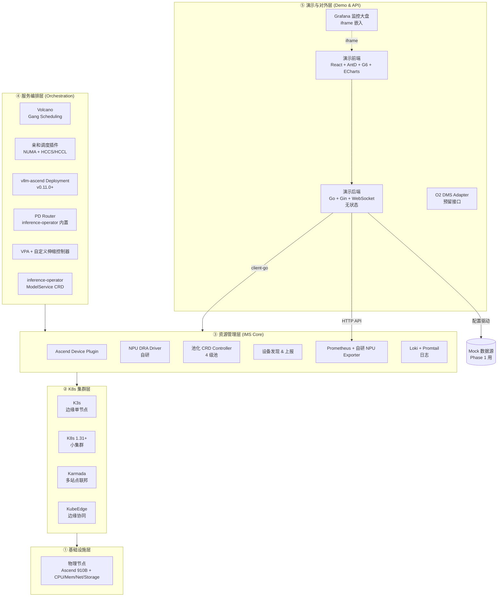
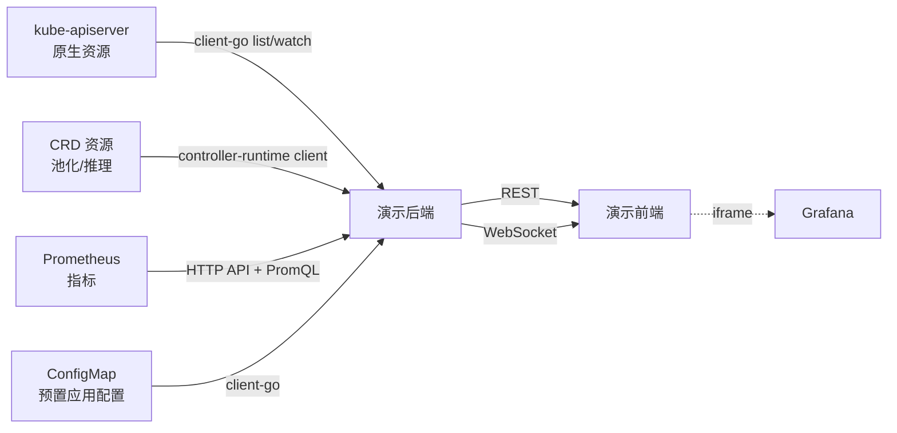
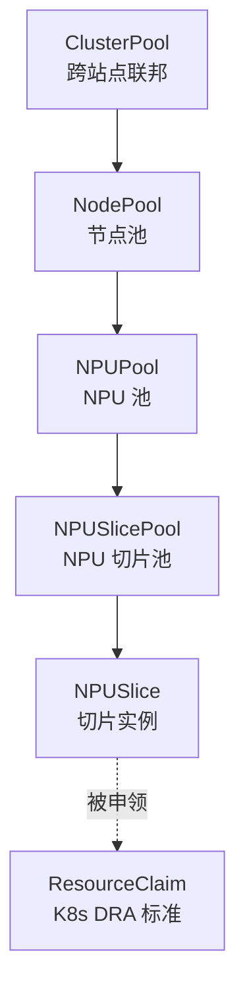

# O-Cloud 边缘云平台样机 — Phase 0 架构设计

> **版本**：v0.1 (Phase 0 baseline)
> **目标读者**：项目全体成员（5-6 人团队）
> **状态**：评审中，评审通过后冻结为 Phase 1 启动基线

---

## 1. 项目背景与目标

### 1.1 一句话定位

构建一套基于 O-Cloud 形态的**边缘云平台样机**，具备**异构算力（昇腾 910B）基础设施管理**与**AI 推理服务编排部署**两大能力，最终演进为可工程部署的产品原型。

### 1.2 两大能力底座

**能力 1 — 基础设施管理（IMS）**
- 算力管理：集群 / 节点 / NPU 设备的统一管理
- 算力池化：基于 K8s CRD 的四级池化模型（集群池 → 节点池 → NPU 池 → NPU 切片池），呈现逻辑拓扑
- 算力发现：NPU、节点级别自动发现并上报
- 基础设施服务：日志、监控告警、资源准备、软件管理、性能分析、生命周期、资源清单
- 异构能力：K8s NPU DRA 集成
- 演示能力：自研前端 + Prometheus + Grafana 嵌入

**能力 2 — 服务编排部署**
- NPU 动态切分：突破昇腾硬切分模板限制
- O-Cloud AAL 接口对接
- AI 任务亲和部署：NUMA + HCCS/HCCL 拓扑感知
- 隔离性：容器 + 虚拟机
- AI 运行时：CANN + MindIE
- 开箱即用模型：Pi 3B / Qwen 8B PD分离 / DeepSeek 20B / Qwen 14B
- 对外开放：O2 DMS 接口（K8s Profile 形式）

### 1.3 Phase 路线图（来自前期对齐）

| 里程碑 | Phase | 内容 |
|---|---|---|
| **M1 可演示原型** | Phase 0 | 架构设计 + 项目骨架（本文档） |
|  | Phase 1 | 前端 + 后端 + Mock 数据源（4 周） |
|  | Phase 2 | 对接真实 K8s + Prometheus + ConfigMap |
| **M2 池化与发现** | Phase 3 | 四级池化 CRD + Controller |
|  | Phase 4 | NPU 设备发现 + K8s DRA 集成 |
| **M3 服务编排** | Phase 5 | 预置模型真实部署（含 Qwen 8B PD 分离） |
|  | Phase 6 | NUMA + HCCS/HCCL 亲和调度插件 |
|  | Phase 7 | NPU 动态切分（突破硬模板） |
|  | Phase 8 | 忙闲时垂直伸缩 |
| **M4 工程化对外** | Phase 9 | O2 DMS 接口 |
|  | Phase 10 | 真实硬件对接 + 演示打磨 |

### 1.4 Phase 0 交付物

1. 《架构设计》（本文档）
2. 《Phase 1 详细计划》（`phase1-plan.md`）
3. 《Claude Code 协作指南》（`CLAUDE.md` 模板）
4. 仓库骨架（目录结构 + 核心 README）

---

## 2. 总体架构

### 2.1 五层架构



### 2.2 各层职责

| 层 | 职责 | 关键组件 |
|---|---|---|
| ① 基础设施层 | 物理资源 | 节点、910B NPU、网络、存储 |
| ② K8s 集群层 | 容器编排底座 | K3s (边缘) / K8s 1.31+ (小集群) / Karmada (多站点) / KubeEdge (边缘协同) |
| ③ 资源管理层 | IMS 核心，算力池化、发现、监控 | Ascend Device Plugin、NPU DRA Driver、池化 Operator、Prometheus 栈、Loki |
| ④ 服务编排层 | AI 工作负载调度与编排 | Volcano、亲和调度 Plugin、vllm-ascend、VPA、inference-operator（含 PD Router） |
| ⑤ 演示与对外层 | 演示交互、对外 API | 演示前端、演示后端、Grafana 嵌入、O2 DMS Adapter |

> ⚠️ **Layer 5 边界澄清(2026-05-17 评审追加)**:Layer 5 实际包含两个独立子关注:
> - **演示子层**(transient, Phase 1-2):演示前端 + 演示后端 + Grafana iframe — 是 demonstration shell,非生产组件
> - **对外子层**(Phase 9+):O2 DMS Adapter — 是 production 契约
>
> 二者**生命周期不同**,部署时通过不同 deployment / namespace 隔离。详见 `docs/phase0-review.md` MUST-FIX(已在 ACCEPT 列表) §2 备注。

### 2.3 数据流（核心原则）

**演示后端无状态**：不存数据，只做查询聚合和短期内存缓存。所有真实数据从四个源头流向后端：



**关键约束**：
- 后端不引入数据库（Phase 1-2）。短期缓存用进程内 LRU 或 Redis（可选）
- 所有数据源通过**统一的 DataSource 接口抽象**，配置文件驱动可切换 Mock / 真实源
- 前端通过 REST 拉取静态数据，通过 WebSocket 订阅实时更新

### 2.4 演示前端 vs Grafana 的边界（混合方案）

| 内容 | 实现方式 | 理由 |
|---|---|---|
| 集群拓扑（节点、NPU、切片） | **自研 React + G6** | Grafana 做不了交互式拓扑 |
| 工作负载列表与详情 | **自研 React + AntD Table** | 需要部署、删除、扩缩容交互 |
| 应用部署向导（含拖拽到资源） | **自研 React** | Grafana 完全不支持 |
| 指标大盘（CPU / NPU / 内存 / 网络） | **Grafana iframe 嵌入** | 节省 70% 图表开发 |
| 业务性能（TTFT / ITL / 吞吐） | **Grafana iframe 嵌入** | Prometheus 数据直出 |
| 日志查看 | **自研壳 + Loki 查询** 或 **Grafana Loki Panel 嵌入** | 二选一，倾向后者 |

---

## 3. 技术选型（锁定版）

### 3.1 后端

| 类别 | 选型 | 版本 | 备注 |
|---|---|---|---|
| 语言 | Go | 1.22+ | K8s 生态一等公民 |
| Web 框架 | Gin | v1.10+ | 性能好，社区成熟 |
| WebSocket | gorilla/websocket | latest | |
| K8s 客户端 | client-go + controller-runtime | 与 K8s 版本匹配 | |
| 配置 | Viper + spf13/cobra | | |
| 日志 | zap | | |
| 测试 | testify + httptest | | |
| OpenAPI | go-swagger 或手写 | | 前后端契约工具 |

### 3.2 前端

| 类别 | 选型 | 版本 | 备注 |
|---|---|---|---|
| 框架 | React | 18 | |
| 语言 | TypeScript | 5+ | |
| 构建工具 | Vite | 5+ | |
| UI 组件 | Ant Design | 5 | |
| 拓扑图 | AntV G6 | 5 | 复杂关系图 |
| 业务图表 | ECharts | 5 | 备用，Grafana 已覆盖大部分 |
| 状态管理 | Zustand | | 比 Redux 轻量 |
| HTTP 客户端 | axios + react-query | | 缓存与重试 |
| 路由 | React Router | 6 | |
| 国际化 | react-i18next | | 中英双语 |

### 3.3 K8s 生态

| 能力 | 选型 | 替代方案 | 选定理由 |
|---|---|---|---|
| 边缘 K8s | **KubeEdge** + **K3s** | OpenYurt / SuperEdge | KubeEdge 华为系，与昇腾天然兼容；K3s 单节点最轻 |
| 多站点 | **Karmada** | OCM / KubeFed | API 兼容性最好，社区活跃 |
| 调度框架 | **Volcano** | Kueue | AI/HPC 场景成熟，Gang Scheduling 必备 |
| 调度插件 | **scheduler-plugins** 二次开发 | 完全自研 | NUMA 插件可直接用，HCCS 自研 |
| CRD 框架 | **Kubebuilder** | operator-sdk | 标准选择 |
| GitOps | **Argo CD**（可选） | Flux | Phase 9+ 引入 |

> ⚠️ **TODO(Phase 6 启动前)**:Volcano vs Kueue 2026 复审。Kueue 已成熟,Phase 6 HCCS scheduling 可能暴露 Volcano 限制。P1-T-012 加子任务调研。见 `docs/phase0-review.md` SHOULD-FIX #5。
>
> ⚠️ **TODO(Phase 2 启动前)**:KubeEdge + K3s 部署拓扑明确(二者职责重叠 — K3s 是 K8s 发行版,KubeEdge 是边缘-云协同框架)。架构 §9.1 加部署拓扑图,显示 cloudcore / edgecore / K3s server / agent 关系。见 `docs/phase0-review.md` SHOULD-FIX #7。

### 3.4 NPU / AI 运行时

| 能力 | 选型 | 替代方案 | 选定理由 |
|---|---|---|---|
| NPU 设备插件 | **Ascend Device Plugin**（官方） | 自研 | 先用官方，DRA 阶段补齐自研 |
| 动态切分 | **自研 NPU DRA Driver** | MindCluster | MindCluster 绑定太死，自研 |
| 推理框架（通用） | **vllm-ascend (v0.11.0+) Deployment** | MindIE Service 单栈 | 符合 spec「不用 KServe」要求；vllm-ascend 原生 910B 支持；可经 MindIE Turbo 加速；见 ADR-0002 |
| 推理框架（PD 分离） | **vllm-ascend disaggregated_prefill_v1** + Mooncake/LLMDataDist | 单实例 colocated | Ascend 原生 PD：HCCS 节点内 / Mooncake 节点间；见 `docs/research/vllm-pd-disaggregation.md` §8 |
| 训练框架 | （Phase 5 不重点） | | |
| 容器运行时 | containerd + Ascend Container Toolkit | | |
| **CANN 运行时底座** | **CANN 8.1** | (与 Ascend driver ≥ 24.x 配套;vllm-ascend v0.11.0+ 要求) | RFC-003 (2026-05-18) 锁定;spec "AI运行时:CANN+MindIE 底座" · **版本兼容矩阵详见 `docs/cann-driver-matrix.md`**(P4-T-002 落地 2026-05-19) |
| 虚拟机运行时（隔离性） | KubeVirt | | Phase 5 可选引入 |

> ⚠️ **修订 v2(2026-05-17, P1-T-012 驳正)**:**DRA 已 GA in K8s 1.34(2025-09-01)**;K8s 1.36 是 2026-05 当前最新。Phase 4 主路径 = Ascend Device Plugin v1 — 真实理由不再是"DRA 未 GA",而是 **KubeEdge v1.22 无 DRA 支持**(边缘路径无选)+ **无官方 Ascend DRA driver**。standard K8s 小集群可 DRA spike;Phase 7 动态切分等 Partitionable Devices GA(估 K8s 1.37)。详见 ADR-0001 §5 v2 与 `docs/research/k8s-dra.md`。
>
> 🔁 **修订 v3(2026-05-19, P4-T-001 · Phase 4 入口)**:参见 **ADR-0001 v3 §5(双轨路径)** — Edge 路径(KubeEdge)stay Device Plugin v1;Standard-K8s small-cluster 路径可选 DRA spike based on **Phase 4 npu-dra-driver scaffold**(P4-T-003+)。CANN 8.1 / Ascend driver ≥ 24.x 兼容矩阵详见 `docs/cann-driver-matrix.md`(P4-T-002 落地)。
>
> 🎯 **npu-dra-driver design(2026-05-19, P4-T-105)**:slice ↔ ResourceClaim 语义映射表 + KubeEdge gap + Partitionable Devices(Phase 7)forward note + Phase 5 实施要点详见 **ADR-0009 npu-dra-driver design**。
>
> 🆕 **Phase 7 动态切分(2026-05-20, P7-T-001)**:NPUSliceTemplate CRD(composition + fallbackStrategy)+ template engine(Validate + Decompose)+ allocator extension + Source 接口抽象(MockJSONSource preserve Phase 4-6 / RealAscendSource stub W1 / lab-conditional T101 真实现)+ lab gating 政策详见 **ADR-0011** · `docs/adr/0011-npu-dynamic-slicing-and-source-interface.md`。Pod opt-in via label `npu.huawei.com/slice-template=<name>`,不带 label 走 Phase 5 既有 whole-NPU 路径(零回归)。
>
> 🆕 **Phase 8 忙闲时垂直伸缩(2026-05-21, P8-T-001)**:NPUVerticalScaler CRD(inference.ocloud.edge.example.com/v1alpha1 · namespace-scoped · co-located with inference-operator binary)+ "重启切片" pattern(controller patch ModelService.spec.template.sliceTemplate ref → inference-operator rolling restart → claim_controller AllocateBundle wiring)+ NPUUtilization built-in metric(window-averaged threshold + cooldown)+ GitOps 协调 annotation 提示约定详见 **ADR-0012** · `docs/adr/0012-busy-idle-vertical-scaler.md`。**消费 Phase 7 NPUSliceTemplate substrate**(ADR-0011 §1/§4) · 无新 CRD 重复;HPA(replica count)+ NPUVerticalScaler(template ref)字段解耦可共存。**Phase 8 不引入** live re-partition / KV cache migration / HCCL rank migration — 这些 CNI / vllm engine 层 gap 由"重启切片"绕开,Phase 11+ 评估升级路径。

### 3.5 监控与日志

| 能力 | 选型 | 备注 |
|---|---|---|
| 指标采集 | Prometheus + node-exporter + **Ascend NPU Exporter（自研）** | 现有开源 npu-exporter 字段不够，需补 |
| 指标可视化 | Grafana | 内嵌前端 |
| 告警 | Alertmanager | |
| 日志收集 | Loki + Promtail | 比 EFK 边缘轻 |
| 链路追踪 | Jaeger 或 OpenTelemetry | Phase 5+ 引入 |
| **demo-backend 自指标**(Phase 4 T007/T008) | **`/metrics` 端点**(gin engine root, 外 `/api/v1` 组) | 3 个 Ocloud 计数器:`ocloud_backend_cache_eviction_total{resource}` / `ocloud_backend_cache_hits_total{resource}` / `ocloud_backend_dispatch_calls_total{datasource,endpoint}` + Go runtime/process 默认采集器。Phase 9 RBAC 不覆盖。Prometheus 配 `prometheus.io/scrape: "true"` annotation 在 Service 上;详 `backend/README.md §Observability` + ADR-0001 v3 |

### 3.6 关键拍板决策记录

- ✅ **不引入 MindCluster / MindX DL**：保留自研动态切分与 DRA 的空间
- ✅ **混合前端方案**：自研 React 主壳 + Grafana iframe 嵌入指标页
- ✅ **多形态部署**：边缘单节点 K3s+KubeEdge；小集群标准 K8s；多站点 Karmada
- ✅ **演示后端无状态**：不引入数据库；Mock 数据源走 ConfigMap 或本地 JSON
- ✅ **不引入 KServe**（spec 第 47-48 行甲方明确要求，见 ADR-0002）：推理服务全用 vllm-ascend Deployment + 自研 inference-operator（含 PD Router），简化技术栈

---

## 4. 开源底座清单

### 4.1 直接复用（Day 1 就装）

| 组件 | 用途 | 接入方式 |
|---|---|---|
| K3s / K8s | 容器编排底座 | 直接部署 |
| KubeEdge | 边缘节点接入 | 单独安装 |
| Karmada | 多站点联邦 | 单独部署 |
| Volcano | AI 调度 | Helm |
| Ascend Device Plugin | NPU 设备暴露 | DaemonSet |
| Prometheus / Grafana / Alertmanager | 监控 | kube-prometheus-stack |
| Loki / Promtail | 日志 | Helm |
| Ant Design / G6 / ECharts | 前端组件 | npm |
| Gin / client-go / controller-runtime | 后端库 | go mod |
| Kubebuilder | CRD 脚手架 | CLI 工具 |

### 4.2 二次开发（需要改）

| 组件 | 改造内容 | 工作量预估 |
|---|---|---|
| scheduler-plugins | 增加 HCCS/HCCL 拓扑感知插件 | Phase 6, 2-3 周 |
| VPA | 接入自定义指标，支持 NPU 显存维度伸缩 | Phase 8, 2 周 |
| dra-example-driver | 改造为 Ascend NPU DRA Driver | Phase 4-7, 4-6 周 |
| ascend-npu-exporter（社区版） | 补全切片粒度、HCCS 拓扑、显存带宽等指标 | Phase 2-4, 持续迭代 |

### 4.3 完全自研

| 组件 | 内容 | Phase |
|---|---|---|
| 演示后端 (demo-backend) | API、聚合、Mock | Phase 1 |
| 演示前端 (demo-frontend) | UI、拓扑、交互 | Phase 1 |
| 池化 Operator (pool-operator) | 4 级 CRD 与 Controller | Phase 3 |
| 推理服务 Operator (inference-operator) | 管理 vllm-ascend Deployment + 内置 PD Router + 调度策略 + ModelService CRD | Phase 5-6 |
| NPU 动态切分模块 | 突破硬模板 | Phase 7 |
| O2 DMS Adapter | 对外 K8s Profile 接口 | Phase 9 |

---

## 5. 模块划分

### 5.1 演示后端 `demo-backend`

```
backend/
├── cmd/demo-backend/main.go        # 入口
├── pkg/
│   ├── api/                        # HTTP / WS handler
│   │   ├── cluster.go              # 集群与拓扑
│   │   ├── workload.go             # 工作负载
│   │   ├── deploy.go               # 应用部署
│   │   ├── metrics.go              # 指标代理
│   │   ├── logs.go                 # 日志代理
│   │   └── ws.go                   # WebSocket 推送
│   ├── datasource/                 # 数据源抽象
│   │   ├── source.go               # 接口定义
│   │   ├── k8s/                    # K8s apiserver
│   │   ├── crd/                    # 自定义资源
│   │   ├── prometheus/             # PromQL 客户端
│   │   ├── configmap/              # 预置应用
│   │   └── mock/                   # Mock 实现（Phase 1）
│   ├── aggregator/                 # 跨源聚合（拓扑、应用详情）
│   ├── config/                     # 配置加载
│   ├── cache/                      # 内存 LRU
│   └── model/                      # DTO/VO 定义
├── configs/
│   ├── config.example.yaml         # 数据源映射配置
│   └── mock-data/                  # Phase 1 Mock 数据
├── go.mod
└── Dockerfile
```

**核心抽象**：`datasource.Source` 接口
```go
type Source interface {
    Name() string
    ListNodes(ctx) ([]Node, error)
    ListNPUs(ctx, nodeName string) ([]NPU, error)
    QueryMetric(ctx, query string, ...) ([]MetricSample, error)
    // ... 等等
}
```
Phase 1 用 `mock.Source`，Phase 2 切到 `k8s.Source` + `prometheus.Source`，对前端零感知。

### 5.2 演示前端 `demo-frontend`

```
frontend/
├── src/
│   ├── pages/
│   │   ├── Overview/               # 概览拓扑
│   │   ├── Workloads/              # 工作负载
│   │   ├── Deploy/                 # 应用部署
│   │   ├── Metrics/                # 指标（含 Grafana 嵌入）
│   │   └── Logs/                   # 日志
│   ├── components/
│   │   ├── TopologyGraph/          # G6 拓扑组件
│   │   ├── ResourceCard/
│   │   ├── MetricChart/            # ECharts 兜底
│   │   ├── GrafanaPanel/           # iframe 嵌入
│   │   └── DeployWizard/           # 部署向导
│   ├── services/                   # API 客户端
│   ├── store/                      # Zustand store
│   ├── config/                     # 运行时配置
│   └── i18n/                       # 中英文
├── public/
├── vite.config.ts
└── package.json
```

### 5.3 池化 Operator `pool-operator`（Phase 3）

```
operators/pool-operator/
├── api/v1alpha1/
│   ├── clusterpool_types.go
│   ├── nodepool_types.go
│   ├── npupool_types.go
│   └── npuslicepool_types.go
├── controllers/
│   ├── clusterpool_controller.go
│   ├── nodepool_controller.go
│   ├── npupool_controller.go
│   └── npuslicepool_controller.go
├── config/                         # Kubebuilder 标准目录
└── main.go
```

### 5.4 推理服务 Operator `inference-operator`（Phase 5）

管理 vllm-ascend Deployment 生命周期（含单实例与 PD 双实例两种拓扑），内置 PD Router（基于 vllm-ascend `disaggregated_prefill_v1/proxy_server.py` 改造为 K8s Service + Controller），集成 NUMA / HCCS 亲和调度与自动伸缩，对上提供 `ModelService` 高阶 CRD（替代原 KServe `InferenceService` 抽象）。详见 ADR-0002。

### 5.5 NPU DRA Driver `npu-dra-driver`（Phase 4-7）

基于 `kubernetes-sigs/dra-example-driver` 改造：
- kubelet plugin：节点上的 NPU 准备
- controller plugin：集群级别的 ResourceClaim 处理
- 与池化 Operator 协同：从 `NPUSlicePool` 中分配切片

### 5.6 调度器插件 `scheduler-plugin`（Phase 6）

- `NumaAffinityPlugin`：复用社区（上游 `sigs.k8s.io/scheduler-plugins/pkg/noderesourcetopology` wrap，不 fork）
- `HCCSTopologyPlugin`：自研，读取 ResourceSlice `npu.huawei.com/hccs_ring` 属性 + NPUSliceAllocation 反查兄弟 Pod，做 HCCL 通信亲和 Filter+Score
- `BinpackPlugin`：紧凑装箱（自研 ~50 LOC 内部实现 · 默认 opt-in via Args.Enabled=false）

详细设计契约 + CNI 选型 + Phase 7 forward notes 见 **ADR-0010**(`docs/adr/0010-scheduler-plugin.md`)。

### 5.7 指标采集器 `ascend-npu-exporter-plus`（Phase 2+）

在社区 `ascend-npu-exporter` 基础上补：
- 切片粒度的 AI Core 利用率
- HCCS 链路状态与带宽
- 显存带宽利用率
- MindIE 业务指标桥接（TTFT / ITL / Throughput）

---

## 6. CRD Schema 设计（草案）

### 6.1 层级关系



### 6.2 NPUSlicePool（最核心）

```go
type NPUSlicePoolSpec struct {
    // 关联的父 NPU 池
    NPUPoolRef LocalObjectReference `json:"npuPoolRef"`

    // 切分策略：静态模板 or 动态
    Strategy SliceStrategy `json:"strategy"` // "FixedTemplate" | "Dynamic"

    // 静态模板（StarlingX 风格）
    FixedTemplates []SliceTemplate `json:"fixedTemplates,omitempty"`

    // 动态切分参数（突破硬切分）
    DynamicSlicing *DynamicSlicingSpec `json:"dynamicSlicing,omitempty"`
}

type SliceTemplate struct {
    Name        string `json:"name"`         // 如 "vir04"
    AICoreCount int    `json:"aiCoreCount"`  // AI Core 数
    MemoryMiB   int    `json:"memoryMiB"`    // 显存 MiB
}

type DynamicSlicingSpec struct {
    // 最小 / 最大 AI Core 数
    MinAICore int `json:"minAICore"`
    MaxAICore int `json:"maxAICore"`
    // 显存粒度
    MemoryGranularityMiB int `json:"memoryGranularityMiB"`
    // 是否允许跨 NPU 聚合（Phase 7+）
    AllowAggregation bool `json:"allowAggregation,omitempty"`
}

type NPUSlicePoolStatus struct {
    TotalSlices     int                `json:"totalSlices"`
    AllocatedSlices int                `json:"allocatedSlices"`
    AvailableSlices int                `json:"availableSlices"`
    Slices          []SliceStatusEntry `json:"slices,omitempty"`
    Conditions      []metav1.Condition `json:"conditions,omitempty"`
}
```

### 6.3 NPUPool

```go
type NPUPoolSpec struct {
    NodePoolRef    LocalObjectReference `json:"nodePoolRef"`
    NPUModel       string               `json:"npuModel"`       // "Ascend910B"
    Selector       *metav1.LabelSelector `json:"selector,omitempty"`
    SliceStrategy  string               `json:"sliceStrategy"`  // 引用 NPUSlicePool
}

type NPUPoolStatus struct {
    TotalNPUs     int `json:"totalNPUs"`
    HealthyNPUs   int `json:"healthyNPUs"`
    AllocatedNPUs int `json:"allocatedNPUs"`
    HCCSTopology  *HCCSTopologyInfo `json:"hccsTopology,omitempty"`
}
```

### 6.4 NodePool

```go
type NodePoolSpec struct {
    ClusterPoolRef LocalObjectReference  `json:"clusterPoolRef,omitempty"`
    Selector       *metav1.LabelSelector `json:"selector"`
    Role           string                `json:"role"` // "edge" | "core"
    Location       string                `json:"location,omitempty"` // 物理位置标签
}

type NodePoolStatus struct {
    Nodes        []string  `json:"nodes"`
    TotalCPU     resource.Quantity `json:"totalCPU"`
    TotalMemory  resource.Quantity `json:"totalMemory"`
}
```

### 6.5 ClusterPool

```go
type ClusterPoolSpec struct {
    Clusters    []ClusterRef `json:"clusters"`     // 由 Karmada 管理
    SyncPolicy  string       `json:"syncPolicy"`   // "Push" | "Pull"
}

type ClusterPoolStatus struct {
    HealthyClusters []string `json:"healthyClusters"`
    UnhealthyClusters []string `json:"unhealthyClusters"`
}
```

### 6.6 Reconcile 简述

- **由上至下**：ClusterPool → NodePool → NPUPool → NPUSlicePool
- 父池 spec 变更时，由 Controller 校验并下发到子池
- 子池 status 实时上卷到父池（aggregation）
- 与 K8s DRA 集成点在 **NPUSlicePool → ResourceSlice**（DRA 标准对象）的映射

> ⚠️ **TODO(Phase 4 启动前)**:DRA 映射详表(`NPUSlicePool` 字段 ↔ `ResourceSlice` / `ResourceClaim` / `DeviceClass` 字段)需在本节展开。当前仅一行,Phase 4 实施会产生 integration chaos。见 `docs/phase0-review.md` SHOULD-FIX #4。

### 6.7 Multi-tenancy 与 scope 警告(2026-05-17 评审追加)

**已知设计 gap**:
- `NPUSlicePool` 是 `scope: Namespaced`,而父池(`ClusterPool` / `NodePool` / `NPUPool`)是 `scope: Cluster`
- 后果:多 namespace 可对同一物理 NPU 定义切片,无 RBAC / Admission 强制隔离

**Phase 1-2 缓解**:任务包 + 部署模板硬约束所有 `NPUSlicePool` 落在 `ocloud-system` 命名空间。**by convention only**。

**Phase 3 修复**:✅ skeleton landed(P3-T-005 · `operators/pool-operator/config/admission/{validating-admission-policy,validating-admission-policy-binding,kustomization}.yaml` + e2e 测试在 `operators/pool-operator/test/e2e/admission/` · CEL expression `metadata.namespace == 'ocloud-system' || labels['npu.huawei.com/multi-tenancy-bypass'] == 'true'` · `failurePolicy: Fail`)。

**Phase 9 完整**:multi-tenancy + Karmada RBAC 联动。

### 6.8 Allocation / Quota 模型占位(TODO Phase 5 启动前)

> **TODO**:当前 CRD hierarchy 缺 Pool ↔ Pod 之间的 `NPUSliceAllocation` / `Quota` 对象。Phase 5 inference-operator 需要这层抽象表达"谁占用了哪个切片"和"namespace 配额"。Phase 5 启动前补完本节。见 `docs/phase0-review.md` SHOULD-FIX #3。

---

## 7. API 契约草案

### 7.1 REST 端点（v1）

| 路径 | 方法 | 说明 |
|---|---|---|
| `/api/v1/clusters` | GET | 集群列表 |
| `/api/v1/clusters/:id/topology` | GET | 集群拓扑（节点 + NPU + 切片） |
| `/api/v1/nodes` | GET | 节点列表 |
| `/api/v1/nodes/:name` | GET | 节点详情（CPU/内存/存储/NPU） |
| `/api/v1/nodes/:name/npus` | GET | 节点上 NPU 列表与切分状态 |
| `/api/v1/pools/npu-slice` | GET | NPU 切片池列表 |
| `/api/v1/workloads` | GET | 工作负载列表 |
| `/api/v1/workloads/:ns/:name` | GET | 工作负载详情 |
| `/api/v1/workloads/:ns/:name/logs` | GET | 日志（流式或分页） |
| `/api/v1/workloads/:ns/:name/metrics` | GET | 业务指标（TTFT 等） |
| `/api/v1/presets` | GET | 预置应用列表（来自 ConfigMap） |
| `/api/v1/deploy` | POST | 部署应用（含 affinity 指定） |
| `/api/v1/deploy/:id` | DELETE | 删除应用 |
| `/api/v1/metrics/query` | POST | 透传 PromQL（白名单） |
| `/api/v1/grafana/url` | GET | 返回带 token 的 Grafana 嵌入 URL |

### 7.2 WebSocket 通道

- `/ws/topology` — 拓扑实时更新
- `/ws/workloads` — 工作负载状态变更
- `/ws/logs/:ns/:name` — 日志流
- `/ws/metrics` — 关键指标定时推送

### 7.3 数据源配置 Schema（运维需求）

```yaml
# configs/config.yaml
server:
  port: 8080
  
datasources:
  k8s:
    enabled: true
    kubeconfig: ""        # 空表示 in-cluster
    namespace: ""         # 空表示所有
  
  prometheus:
    enabled: true
    url: "http://prometheus:9090"
    timeout: 30s
  
  configmap:
    enabled: true
    namespace: "ocloud-system"
    name: "preset-applications"
  
  mock:
    enabled: false          # Phase 1 设为 true
    path: "./configs/mock-data"

# 前端资源/指标 → 后端数据源 字段映射
mapping:
  topology:
    source: k8s
    extra: [crd]
  workloads:
    source: k8s
  metrics:
    cpu_usage:
      source: prometheus
      query: "node_cpu_seconds_total{...}"
    npu_usage:
      source: prometheus
      query: "ascend_npu_utilization{...}"
    # ...
  presets:
    source: configmap

# Grafana 嵌入
grafana:
  base_url: "http://grafana:3000"
  dashboards:
    cluster_overview: "/d/cluster-overview/cluster-overview"
    workload_metrics: "/d/workload-metrics/workload-metrics"
```

---

## 8. 前端页面设计

### 8.1 五个核心页面

| 页面 | 路径 | 核心组件 | Phase 1 范围 |
|---|---|---|---|
| 概览拓扑 | `/overview` | TopologyGraph (G6) + ResourceSummary | ✅ 全 |
| 工作负载 | `/workloads` | WorkloadTable + WorkloadDetail Drawer | ✅ 全 |
| 应用部署 | `/deploy` | PresetList + DeployWizard + ResourceDragDrop | ✅ 基础（拖拽 Phase 1 后期） |
| 指标 | `/metrics` | GrafanaPanel (iframe) + 选择器 | ✅ 通过 Grafana |
| 日志 | `/logs` | LogViewer (stream) | ✅ 基础 |

### 8.2 概览拓扑（核心页）

**布局**：
- 左侧：集群/池/节点树
- 中间：G6 力导向 / 分层拓扑图
- 右侧：选中节点详情卡片

**节点类型**：
- 集群（cluster）
- 节点池（nodepool）
- 节点（node）
- NPU 设备（npu）
- NPU 切片（slice）
- 网络（network，可选）

**交互**：
- 点击节点 → 右侧显示详情、关联指标
- 双击 NPU → 展开切片视图
- 切片节点颜色 = 使用状态（空闲 / 已分配 / 异常）

### 8.3 应用部署（关键交互）

**预置应用列表**（来自 ConfigMap）：
- Pi 3B (Inference)
- Qwen 8B (PD Disaggregated)
- DeepSeek 20B (Inference)
- Qwen 14B (Inference)
- Benchmark Tool

**部署模式**：
- **自动调度**：选模型 → 选副本数 → 提交
- **手动指定**：选模型 → 拖到拓扑图上的目标节点/NPU → 提交
- **PD 分离专属**：选 Prefill 节点 + Decode 节点 → 提交

### 8.4 指标页（Grafana 嵌入）

- 集群级别仪表盘
- 节点级别（选节点）
- 工作负载级别（选 workload）
- 业务指标（TTFT / ITL / E2E / Throughput）

Grafana dashboard 在 deploy 目录提前 provisioned，前端只是 iframe 切换 URL。

### 8.5 日志页

简单实现：调用 `/ws/logs/:ns/:name`，前端做按级别过滤、关键字搜索。或直接嵌入 Grafana Loki Panel（推荐，省事）。

---

## 9. 部署形态

### 9.1 边缘单节点（最小演示）

```
┌─────────────────────────────────┐
│ 单台带 Ascend 910B 的物理机     │
│ ┌─────────────────────────────┐ │
│ │ K3s (单节点)                 │ │
│ │ ├ KubeEdge edgecore         │ │
│ │ ├ Ascend Device Plugin       │ │
│ │ ├ Prometheus + Grafana       │ │
│ │ ├ Volcano                    │ │
│ │ ├ vllm-ascend (含 PD + Mooncake/LLMDataDist) │ │
│ │ ├ Pool Operator              │ │
│ │ ├ Demo Backend               │ │
│ │ └ Demo Frontend              │ │
│ └─────────────────────────────┘ │
└─────────────────────────────────┘
```

部署方式：单条 install.sh 脚本 + Helm chart

### 9.2 小集群（3-5 节点，标准 K8s）

- 1 个 master，2-4 个 worker
- 全套同上，按角色分布
- 演示后端 + 前端走 Service + Ingress

### 9.3 多站点（Phase 9-10）

- 1 个 Karmada 控制面（中心）
- 多个成员集群（每个站点 1 套）
- 演示后端连接 Karmada API + 各成员集群

---

## 10. Phase 1 详细计划

见 `phase1-plan.md`。摘要：

- **5-6 人 / 4 周**
- **目标**：演示前端 + 后端 + Mock 数据源端到端可运行，五个页面均可演示
- **不做**：真实 K8s、真实 NPU、真实推理服务

---

## 11. 仓库结构（Monorepo）

```
ocloud-edge-platform/
├── README.md
├── CLAUDE.md                       # Claude Code 协作指南
├── Makefile
├── docs/
│   ├── architecture.md             # 本文档
│   ├── phase1-plan.md
│   ├── api-contract.yaml           # OpenAPI 规范
│   └── adr/                        # Architecture Decision Records
├── backend/                        # 演示后端（Go）
├── frontend/                       # 演示前端（React+TS）
├── operators/
│   ├── pool-operator/
│   └── inference-operator/
├── npu-dra-driver/                 # Phase 4 启动
├── scheduler-plugin/               # Phase 6 启动
├── exporters/
│   └── ascend-npu-exporter-plus/   # Phase 2+
├── deploy/
│   ├── single-node/                # K3s + KubeEdge
│   ├── small-cluster/
│   ├── multi-site/                 # Karmada
│   ├── grafana-dashboards/         # JSON dashboards
│   └── helm-charts/
├── configs/                        # 配置示例
│   ├── config.example.yaml
│   └── mock-data/
├── hack/                           # 开发脚本
├── scripts/                        # 部署脚本
├── tests/
│   ├── e2e/
│   └── integration/
└── .github/
    └── workflows/                  # CI
```

**分支策略**：
- `main` — 稳定，每个 Phase 结束打 tag
- `dev` — 集成分支
- `feature/<phase>-<module>-<desc>` — 特性分支
- PR 必须经过 Code Review + CI 通过

---

## 12. Claude Code 协作指南

见 `CLAUDE.md`。要点：
- 每个子模块都有自己的 README + 模块级 CLAUDE.md
- 统一 prompt 模板（"开发新接口"、"修改 CRD"、"添加前端页"）
- PR 模板与 review checklist

---

## 13. 后续阶段展望

| Phase | 关键技术风险 | 缓解策略 |
|---|---|---|
| Phase 4 (DRA) | K8s DRA 1.31+ 文档少，案例少 | 直接 clone dra-example-driver 改 |
| Phase 5 (PD分离) | vLLM PD 分离仍在快速迭代 | 锁定一个稳定 commit；准备 llm-d 作为备选 |
| Phase 6 (HCCS 调度) | HCCS 拓扑获取接口可能要走 Huawei SDK | 调研 npu-smi / DCMI 接口 |
| Phase 7 (动态切分) | 突破硬模板需要驱动层能力 | 与昇腾团队交互；准备 fallback：多模板组合（**Phase 7 P7-T-001 落 ADR-0011 提交 fallback 作为 deliverable + Source 接口抽象 + lab gating 政策**） |
| Phase 8 (垂直伸缩) | NPU 在线缩容是否支持 | **landed phase-8-complete (2026-05-21)** — P8-T-001 → ADR-0012 + 13 task chain(9b89ff9..T107)· "重启切片" pattern 为 Phase 8 deliverable · NPUVerticalScaler CRD(inference.ocloud.edge.example.com/v1alpha1)+ 8-step Reconcile + PrometheusIngestor + AllocateBundle 控制器 wiring(T008 = T105-v2 · Phase 7 deferred body)。**Mutation model adaptation**(annotation vs spec.template.sliceTemplate):NPUVerticalScaler patches `ModelService.metadata.annotations[npu.huawei.com/slice-template]` + AnnotationManagedBy hint(ADR-0012 §5)· claim_controller bundle path dispatches via same annotation。**User stay K8s 1.32 决策**(chat 2026-05-21)blocks T003(NumaAffinity wrap upgrade)/ T101+T102(Partitionable Devices Beta)/ T004(ProxyImage chart flip)— 3 items 顺延 Phase 9-10 per plan §6 fallback + upstream sched-plugins v0.35+/v0.36+ 未发布 + kindest/node v1.36 不存在双重 lag。Lab-gating outcome:T105 deferred Phase 10 per ADR-0011 §3 default(no lab signal)· T104-v2 hard-fail upgrade via synthetic ring fixture + claim_controller stamped `preferred-hccs-ring` annotation。Phase 9 候选workstreams详 `docs/checkpoint-phase8.md` §6 + Volcano spike(P8-T-106 · `docs/research/volcano-gang-scheduling-spike.md` · 推荐 Phase 9 W1 entry 路径 A)|
| Phase 9 (O2 DMS) | O-RAN O2 规范持续演进 | 锁定一个版本（如 O2 IMS R1） · **训练大批量 job 场景** Phase 8 P8-T-106 spike landed(`docs/research/volcano-gang-scheduling-spike.md`):推荐 Phase 9 W1 entry 引入 Volcano binary(独立 helm · 1-2d 工作量)· 训练 Pod opt-in via `schedulerName=volcano` + PodGroup atomicity · npu-scheduler 继续 own NPU device 级 Filter+Score · 解耦清晰 |

**2026-05-17 评审追加(flag-to-phase, baseline 不修, 各 Phase 入口检查)**:

| Phase | 评审 flag | 检查动作 |
|---|---|---|
| Phase 4 | DRA mapping 详表(§6.6→§6.7)需展开 | Phase 4 启动前补 `NPUSlicePool ↔ ResourceSlice/ResourceClaim/DeviceClass` 字段映射表 · 2026-05-19 P4-T-001 落地 **ADR-0001 v3**(双轨路径) + P4-T-105 落地 ADR-0009(详表) |
| Phase 5 | `NPUSliceAllocation` / `Quota` 对象设计(§6.8) | **landed** (2026-05-19 · P5-T-004 / 8173e83) — CRD types + scheme + 3 round-trip tests; controller + audit lifecycle landed at P5-T-005 / c283e94. Phase 9 quota controller reads this CRD as substrate. |
| Phase 5 | npu-dra-driver allocation logic + DeviceClass 注册 per ADR-0009 | **landed** (2026-05-19 · P5-T-001 / 41cd04e DeviceClass helm template + P5-T-002 / a423dd9 real allocator greedy first-fit + P5-T-003 / 6ef715d allocator tests + BestFit) — claim controller writes status.allocation + status.devices[Ready=True]; Phase 4 annotation path DEPRECATED |
| Phase 5 | PD Router webhook impl per ADR-0008(`npu.huawei.com/slice-bindings` annotation 写入路径,mutating webhook · failurePolicy=Fail · cert-manager 依赖) | **landed** (2026-05-19 · P5-T-101 c3452d3 cert-manager + P5-T-102 94c7c99 webhook scaffold + P5-T-103 ca81ead mutating logic + P5-T-104 1300f30 envtest) — same binary as inference-operator (ADR-0008 design choice) |
| Phase 7 | 动态切分若 fallback "多模板组合" 削弱设计目标 | **landed phase-7-complete (2026-05-20)** — P7-T-001 → ADR-0011 + 14 task chain(bd6f223..bf0c03c)· 多模板组合 fallback 实际 deliverable: NPUSliceTemplate CRD (T006) + template engine + reconciler (T007) + allocator AllocateBundle (T105 · controller wiring deferred Phase 10) + Source 接口 (T004) + npu-smi parser scaffold (T005) + HCCS 8-card adjacency chart 默认 (T008) + schedulerName auto-stamp (T003 · closes #11) + kind smoke ext + multi-ring fixture (T103+T104) + Partitionable Devices spike (T106 · `docs/research/k8s-partitionable-devices-spike.md` · KEP-4815 Beta confirmed · GA timing unconfirmed)。Lab-gating: T101 RealAscend body deferred Phase 10 per ADR-0011 §3 default · NumaAffinity wrap re-deferred per known-issues #12 (Phase 8 baseline bump candidate) · ProxyImage chart default 仍 empty per T102 doc-only refresh |
| Phase 9 | 多站点 demo backend 缓存重构(LRU 进程内 → Redis/singleton/stateless) | Phase 9 启动前 ADR + 重构路径 |
| Phase 9 | 安全模型(authn/z + multi-tenancy RBAC + NPUSlicePool admission policy) | Phase 9 启动前完整安全设计 + Karmada RBAC 联动 |
| Phase 5+ | NPU pod 网络考量(CNI + HCCL RDMA / RoCE / IPoIB 兼容) | research doc landed (P5-T-105 · `docs/cni-hccl-research.md`); **selection landed Phase 6 ADR-0010** — Cilium + Multus + SR-IOV 推荐 / Calico + Multus + SR-IOV fallback;scheduler-plugin CNI-portable(不依赖任何 CNI 特有 API) |
| Phase 6 | scheduler-plugin(HCCS / NUMA / Binpack)+ HCCS 拓扑接口(npu-smi / DCMI 调研) | **landed phase-6-complete (2026-05-20)** — ADR-0010 (P6-T-001 / cfa6260) 设计冻结 · scheduler-plugin scaffold + HCCS Filter+Score + Binpack ScorePlugin + 集成 composition tests (P6-T-002..T008) · NumaAffinity placeholder ⏳ upstream wrap deferred to sched-plugins v0.32.x · pool-operator NPUPool.status.hccsTopology 聚合 (T003) · Helm chart (T101) · inference-operator metrics 3 collectors (T104) · vllm-ascend PD proxy_server schema substrate (T105) · kind smoke 扩展 (T106) · npu-smi 真硬件接口 deferred Phase 7 · 13/15 tasks done · 2 deferred (T102/T103 workloads sliceBindings 待 RFC) |

**2026-05-18 RFC-003(spec 对齐补)追加**:

| Phase | 评审 flag | 检查动作 | ADR |
|---|---|---|---|
| Phase 1 W1 补 | Topology schema 扩展(switch / network-link / workload / pod 节点+边) | T013 schema RFC + mock generator 扩展(set-a-small 加 fabric + workload 绑定) | ADR-0004 + ADR-0005 |
| Phase 1 W3 | Topology API + 前端 toggle `includeFabric` / `includeWorkloads` | T211/T212(fabric)+ T213/T214(workload) | ADR-0004 + ADR-0005 |
| Phase 2 | 真实 fabric discovery(LLDP / SNMP / SONiC API 选型) | Phase 2 启动前调研 + ADR | ADR-0004 |
| Phase 2 | 真实 Pod→slice binding(K8s scheduler annotation) | Phase 2 启动前 | ADR-0005 |
| Phase 9 | **IMS 7 服务剩 3 项**(资源准备 / 软件管理 / 生命周期)— Option A 拍板(2026-05-18 v2) | Phase 9 起草时落 P9-T-IMS-{1,2,3}:node-lifecycle-operator / software-mgmt / bare-metal-provisioning(参考 StarlingX);Phase 1 不做占位 UI | ADR-0003 v2 Accepted |
| Phase 4 | CANN 8.1 锁定 + Ascend driver ≥ 24.x 配套验证 | 2026-05-19 P4-T-002 **matrix doc landed**(`docs/cann-driver-matrix.md` · 7 列 5 行 · baseline/floor/known-bad/warn 全覆盖);**real-hw verification deferred Phase 7** | architecture §3.4 + `docs/cann-driver-matrix.md` |

---

## 14. 风险与未决问题

### 14.1 技术风险

| 风险 | 影响 | 缓解 |
|---|---|---|
| 昇腾 910B 真机访问受限 | Phase 5+ 卡住 | Phase 1-4 全部基于 Mock + 仿真，硬件就位再切 |
| K8s 1.31 DRA 在生产环境不稳 | Phase 4 不稳 | Phase 4 先做出原型，生产部署考虑 fallback 到 Device Plugin |
| MindIE 不开源 | 通过 vllm-ascend MindIE Turbo 间接加速，黑盒影响降低 | 优先 vllm-ascend 原生 backend；MindIE Turbo 仅作为可选加速路径 |
| vLLM PD 分离与 MindIE 后端不兼容 | Qwen 8B PD 演示失败 | 准备两条路径：vLLM(GPU仿真) + MindIE(标准非 PD) |

### 14.2 未决问题（Phase 0 评审时讨论）

- [ ] **真机硬件信息**：910B 是 8 卡服务器吗？HCCS 拓扑结构（全互联 vs 环形）？
- [ ] **是否需要支持 ARM 节点**：边缘场景可能有 KunPeng（鲲鹏）
- [ ] **演示前端是否需要 RBAC / 多租户**：Phase 1 暂不做
- [ ] **CICD 环境**：GitHub Actions？自建 Jenkins？
- [ ] **镜像仓库**：Harbor 自建？还是用云厂商？
- [ ] **演示后端是否需要持久化日志/审计**：暂不做

### 14.3 评审清单（项目负责人 + 5-6 人评审时逐项打勾）

- [ ] 五层架构是否合理
- [ ] 技术选型是否接受
- [ ] CRD 层级模型是否覆盖未来需求
- [ ] API 契约是否能支撑五个页面
- [ ] 模块划分是否清晰、人员能否对应
- [ ] Phase 1 任务粒度是否合适（具体看 `phase1-plan.md`）
- [ ] 未决问题是否有遗漏

---

## 附录 A — 名词对照

| 缩写 | 全称 | 说明 |
|---|---|---|
| O-Cloud | O-RAN Cloud | O-RAN 联盟定义的云基础设施 |
| IMS | Infrastructure Management Services | 基础设施管理服务 |
| AAL | Acceleration Abstraction Layer | 加速器抽象层 |
| DMS | Deployment Management Services | 部署管理服务 |
| O2 | O-RAN O2 接口 | IMS / DMS 暴露接口 |
| DRA | Dynamic Resource Allocation | K8s 1.26+ 引入的动态资源分配 |
| HCCS | Huawei Cache Coherence System | 昇腾 NPU 间高速互联 |
| HCCL | Huawei Collective Communication Library | 集合通信库 |
| CANN | Compute Architecture for Neural Networks | 昇腾计算架构 |
| MindIE | Mind Inference Engine | 昇腾推理引擎 |
| PD 分离 | Prefill-Decode Disaggregation | LLM 推理分阶段部署 |
| TTFT | Time To First Token | 首 Token 时延 |
| ITL | Inter-Token Latency | Token 间时延 |

## 附录 B — 参考开源项目

- StarlingX: https://www.starlingx.io
- KubeEdge: https://kubeedge.io
- Karmada: https://karmada.io
- Volcano: https://volcano.sh
- vLLM: https://github.com/vllm-project/vllm
- vllm-ascend: https://github.com/vllm-project/vllm-ascend
- llm-d: https://github.com/llm-d/llm-d（已拒，不支持 Ascend，仅作参考）
- Kubebuilder: https://book.kubebuilder.io
- DRA Example Driver: https://github.com/kubernetes-sigs/dra-example-driver
- Ascend Device Plugin: https://gitee.com/ascend/ascend-device-plugin
- scheduler-plugins (sig-scheduling): https://github.com/kubernetes-sigs/scheduler-plugins

---

**END of Phase 0 Architecture Design v0.1**
