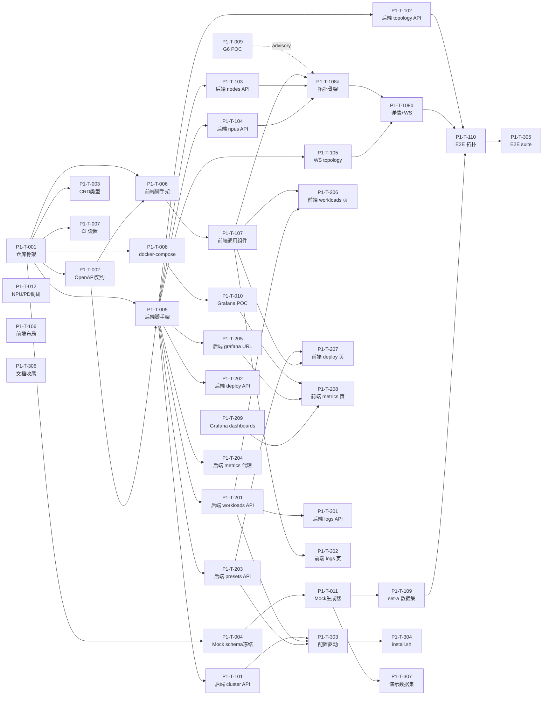

# Phase 1 详细计划 — 任务包驱动（AI Agent 并行版）

> **周期**：4 周（W1-W4）
> **执行模式**：协调者 + N 个并行 Module Agent + 1 个集成 Agent
> **推荐并行规模**：W1 起 2-3 个 agent，W2-W3 峰值 4-6 个
> **配套文档**：必读 `docs/agent-coordination.md`、模块级 `<module>/CLAUDE.md`

---

## 1. 任务包总览（共 31 个）



---

## 2. W1 任务包（Foundation，12 个）

### P1-T-001 仓库骨架与基础文件

| Meta | |
|---|---|
| Module | deploy |
| Priority | P0 |
| Depends on | — |
| Estimated | 0.5d |

**Allowed Paths**:
- `README.md`, `CLAUDE.md`, `Makefile`, `.gitignore`, `LICENSE`
- `.github/workflows/ci.yml`(框架)

**Acceptance**(2026-05-17 added LICENSE AC):
- [ ] 目录结构与架构文档 §11 一致
- [ ] 根 Makefile 提供 `make help`、`make ci`
- [ ] CI 框架文件存在(job 由 T007 填)
- [ ] **`LICENSE` 文件存在,内容为 Apache 2.0**(K8s 生态主流,选定理由见 ADR-0001 修订附录)
- [ ] `.gitignore` 含常见 Go / Node / IDE 排除项

---

### P1-T-002 OpenAPI 契约 sealed-for-review

| Meta | |
|---|---|
| Module | backend(契约维护者) |
| Priority | P0 |
| Depends on | P1-T-001 |
| Estimated | 1d |

**Allowed Paths**:`docs/api-contract.yaml`

**Acceptance**(2026-05-17 hardened):
- [ ] `swagger-cli validate docs/api-contract.yaml` 通过
- [ ] `redoc-cli build docs/api-contract.yaml` 生成 HTML 无 warning
- [ ] 覆盖架构文档 §7.1 全部 endpoint(15 REST + 4 WS)
- [ ] **每个 endpoint 必须含 2xx + 4xx + 500 响应示例**(machine-verifiable: 解析 yaml 检查 responses keys)
- [ ] 所有 schema 在 `components.schemas` 下定义,无 inline
- [ ] **预对齐 T103/T104 字段**:Node / NPU 关键字段在本契约里至少占位(可后续 RFC 细化)
- [ ] 用户(协调者) approval in chat → 标 sealed-for-review

**Notes**:**sealed-for-review 而非冻结**:草案 sealed 后,任何变更走 §0a.5 chat + ADR;不阻塞 W2 实施。起草版本已在 `docs/api-contract.yaml`,本任务做 polish + 评审 + 对齐预演。

---

### P1-T-003 CRD Go 类型定义

| Meta | |
|---|---|
| Module | operators |
| Priority | P0 |
| Depends on | P1-T-001 |
| Estimated | 1d |

**Allowed Paths**：`operators/pool-operator/**`

**Acceptance**：
- [ ] 4 个 CRD 类型完整
- [ ] `make generate`, `make manifests` 通过
- [ ] `kubectl apply --dry-run=server -f config/crd/bases/` 通过
- [ ] `config/samples/` 下每个 CRD 都有示例

---

### P1-T-004 Mock 数据 Schema sealed-for-review

| Meta | |
|---|---|
| Module | configs |
| Priority | P0 |
| Depends on | P1-T-001 |
| Estimated | 0.5d |

**Allowed Paths**:`configs/mock-data/schema.json`, `configs/mock-data/README.md`

**Acceptance**(2026-05-17 hardened):
- [ ] `ajv compile -s configs/mock-data/schema.json` 成功
- [ ] 字段与 OpenAPI(`docs/api-contract.yaml` components.schemas)+ CRD 类型(`operators/pool-operator/api/v1alpha1/*`)字段名 1:1 对齐
- [ ] **样例数据通过 validation**:`echo '{"clusters":[...]}' | ajv validate -s schema.json -d /dev/stdin` 成功(至少 1 个 happy-path 样例)
- [ ] 用户(协调者) approval in chat → 标 sealed-for-review

**Notes**:**sealed-for-review 非绝对冻结**,变更走 §0a.5 chat + ADR。

---

### P1-T-005 后端脚手架

| Meta | |
|---|---|
| Module | backend |
| Priority | P0 |
| Depends on | P1-T-001, P1-T-002 |
| Estimated | 1d |

**Allowed Paths**：`backend/**`

**Acceptance**：
- [ ] 目录结构与 `backend/CLAUDE.md §3` 一致
- [ ] `go.mod` 含 Gin / zap / viper / cobra / client-go
- [ ] `cmd/demo-backend/main.go` 可启动
- [ ] `pkg/datasource/source.go` 完整接口
- [ ] `/api/v1/healthz`、`/api/v1/version` 实现
- [ ] `make build/test/lint` 全过
- [ ] 多阶段 Dockerfile

---

### P1-T-006 前端脚手架

| Meta | |
|---|---|
| Module | frontend |
| Priority | P0 |
| Depends on | P1-T-001, P1-T-002 |
| Estimated | 1d |

**Allowed Paths**：`frontend/**`

**Acceptance**：
- [ ] Vite + React 18 + TS 5 + AntD 5 安装
- [ ] 5 个页面占位 + 路由
- [ ] `pnpm run gen:types` 生成 `src/services/types.ts`
- [ ] axios + react-query + Zustand 接好
- [ ] i18n（zh-CN / en-US）
- [ ] `pnpm lint/typecheck/build` 全过

---

### P1-T-007 GitHub Actions CI

| Meta | |
|---|---|
| Module | deploy |
| Priority | P0 |
| Depends on | P1-T-005, P1-T-006 |
| Estimated | 1d |

**Allowed Paths**：`.github/workflows/**`, `scripts/ci/**`

**Acceptance**：
- [ ] 含 `deploy/CLAUDE.md §3.1` 所有 job
- [ ] check-allowed-paths job 实现
- [ ] 测试 PR 验证通过

---

### P1-T-008 docker-compose 开发栈

| Meta | |
|---|---|
| Module | deploy |
| Priority | P1 |
| Depends on | P1-T-005, P1-T-006 |
| Estimated | 1d |

**Allowed Paths**：`deploy/dev/**`

**Acceptance**：
- [ ] 一条命令拉起 backend + frontend + grafana + mock-prometheus
- [ ] 后端代码热加载
- [ ] README 含端口与初始凭据

---

### P1-T-009 G6 vs ReactFlow POC

| Meta | |
|---|---|
| Module | frontend |
| Priority | P1 |
| Depends on | P1-T-006 |
| Estimated | 1d |

**Allowed Paths**:`frontend/src/components/TopologyGraph/**`, `hack/poc/`

**Acceptance**(2026-05-17 hardened):
- [ ] G6 / ReactFlow 各实现最小拓扑(10 节点 + 边 + 点击 + 缩放)
- [ ] **PR 描述含 side-by-side 对比表**,至少覆盖维度:节点上限测试(到 1000 节点 FPS)/ 内存占用 / 事件性能 / 自定义渲染能力 / TypeScript 支持 / 文档质量,每项 G6 vs ReactFlow 给评分(1-5)
- [ ] 用户(协调者) chat approval → 标拍板结果

**Notes**:T108 不再 hard-block 此 POC — 可用 ReactFlow stub 并行实施 T108a 的 G6 拓扑骨架,POC 拍板后再统一。

---

### P1-T-010 Grafana iframe POC

| Meta | |
|---|---|
| Module | frontend |
| Priority | P1 |
| Depends on | P1-T-006, P1-T-008 |
| Estimated | 0.5d |

**Allowed Paths**：`frontend/src/components/GrafanaPanel/**`, `deploy/dev/grafana/**`

**Acceptance**：iframe 嵌入 dashboard 渲染成功 + 跨域 / 鉴权方案 PR 中说明

---

### P1-T-011 Mock 生成器（set-a-small）

| Meta | |
|---|---|
| Module | configs |
| Priority | P0 |
| Depends on | P1-T-004 |
| Estimated | 1.5d |

**Allowed Paths**：`configs/mock-data/generator/**`, `configs/mock-data/set-a-small/**`

**Acceptance**：
- [ ] 生成器可参数化
- [ ] set-a-small 全字段通过 ajv 校验
- [ ] 数据真实度符合 `configs/CLAUDE.md §3.3`
- [ ] events.json ≥ 20 条

---

### P1-T-012 NPU + PD 分离调研

| Meta | |
|---|---|
| Module | docs |
| Priority | P2 |
| Depends on | P1-T-001 |
| Estimated | 1d |

**Allowed Paths**：`docs/research/**`

**Acceptance**：3 份调研文档（Ascend Device Plugin / DRA / vLLM PD），每份 ≤ 5 页

---

## 3. W2 任务包（Topology End-to-End，10 个）

### P1-T-101 后端 Cluster API

| Meta | |
|---|---|
| Module | backend |
| Priority | P0 |
| Depends on | P1-T-005, P1-T-011 |
| Estimated | 0.5d |

**Allowed Paths**：
- `backend/pkg/api/cluster.go` (新建)
- `backend/pkg/api/cluster_test.go`
- `backend/pkg/datasource/mock/cluster.go`
- `backend/pkg/model/cluster.go`

**Acceptance**：`GET /clusters`, `GET /clusters/:id` 实现 + 单测覆盖 happy / 404 / 500

---

### P1-T-102 后端 Topology API

| Meta | |
|---|---|
| Module | backend |
| Priority | P0 |
| Depends on | P1-T-101, P1-T-103, P1-T-104 |
| Estimated | 1d |

**Allowed Paths**：
- `backend/pkg/api/cluster.go` (扩展)
- `backend/pkg/aggregator/topology.go`
- `backend/pkg/datasource/mock/topology.go`

**Acceptance**：`/clusters/:id/topology?depth=slice` 返回 G6 兼容图 + 单测

---

### P1-T-103 后端 Nodes API

| Meta | |
|---|---|
| Module | backend |
| Priority | P0 |
| Depends on | P1-T-005 |
| Estimated | 0.5d |

**Allowed Paths**：`backend/pkg/api/node*.go`, `backend/pkg/datasource/mock/node.go`, `backend/pkg/model/node.go`

**Acceptance**：`/nodes`, `/nodes/:name` + 单测

---

### P1-T-104 后端 NPUs API

| Meta | |
|---|---|
| Module | backend |
| Priority | P0 |
| Depends on | P1-T-005, P1-T-103 |
| Estimated | 0.5d |

**Allowed Paths**：`backend/pkg/api/npu*.go`, `backend/pkg/datasource/mock/npu.go`, `backend/pkg/model/npu.go`

**Acceptance**：`/nodes/:name/npus` 含切片状态

---

### P1-T-105 WebSocket Topology

| Meta | |
|---|---|
| Module | backend |
| Priority | P0 |
| Depends on | P1-T-102 |
| Estimated | 1d |

**Allowed Paths**：`backend/pkg/api/ws.go`, `backend/pkg/datasource/mock/events.go`

**Acceptance**：`ws://.../ws/topology` + 按 events.json 时间表回放

---

### P1-T-106 前端布局与导航

| Meta | |
|---|---|
| Module | frontend |
| Priority | P0 |
| Depends on | P1-T-006 |
| Estimated | 1d |

**Allowed Paths**：`frontend/src/App.tsx`, `frontend/src/components/Layout/**`, `frontend/src/i18n/**`

**Acceptance**：Header + Sider + Content + 中英切换 + 5 页菜单

---

### P1-T-107 前端通用组件库

| Meta | |
|---|---|
| Module | frontend |
| Priority | P0 |
| Depends on | P1-T-006 |
| Estimated | 1d |

**Allowed Paths**：`frontend/src/components/{ResourceCard,StatusTag,MetricChip,EmptyState,ErrorState}/**`

**Acceptance**：5 个组件 + 单测 + 使用示例

---

### P1-T-108a 前端 Overview 拓扑骨架(G6 + 左树)

| Meta | |
|---|---|
| Module | frontend |
| Priority | P0 |
| Depends on | P1-T-107, P1-T-102, P1-T-103, P1-T-104(T009 advisory,不阻塞) |
| Estimated | 1d |

**Allowed Paths**:`frontend/src/pages/Overview/{index.tsx,TopologyView.tsx}`, `frontend/src/components/TopologyGraph/**`, `frontend/src/services/cluster.ts`

**Acceptance**(2026-05-17 hardened, machine-verifiable):
- [ ] `/overview` 路由可达,渲染左侧资源树 + 中间 G6 拓扑
- [ ] 拓扑数据从 `/api/v1/clusters/:id/topology` 拉取(react-query)
- [ ] **点击树节点 → 拓扑图对应节点高亮**(Vitest with @testing-library/react user-event 验证)
- [ ] **G6 节点支持双击事件**(预留切片展开 hook,本任务不实现展开本体)
- [ ] loading / error / empty 三种状态完整
- [ ] Vitest 单测覆盖:树渲染 / 节点点击 / 数据 hook
- [ ] `pnpm lint typecheck test build` 全过

**Notes**:T009 G6 vs ReactFlow POC 改为 advisory(可用 G6 起步,POC 结果若选 RF 再迁)。

---

### P1-T-108b 前端 Overview 详情面板 + WS 实时同步

| Meta | |
|---|---|
| Module | frontend |
| Priority | P0 |
| Depends on | P1-T-108a, P1-T-105 |
| Estimated | 1d |

**Allowed Paths**:`frontend/src/pages/Overview/DetailPanel.tsx`, `frontend/src/hooks/useTopologyWS.ts`, `frontend/src/store/topologyStore.ts`

**Acceptance**(2026-05-17 hardened, machine-verifiable):
- [ ] 选中 G6 节点 → 右侧 DetailPanel 显示节点详情(用 `/api/v1/nodes/:name` + `/nodes/:name/npus`)
- [ ] **双击 NPU 节点 → 展开切片视图**(切片节点颜色按 idle / allocated / error 分色)
- [ ] **WebSocket `/ws/topology` 订阅 → 节点状态变更实时反映在图上**(Vitest:mock WS server 推 events,断言节点 class 变化)
- [ ] WS 断线 ≤ 3s 自动重连(`useTopologyWS` hook 内置)
- [ ] Vitest 单测覆盖:DetailPanel 渲染 / WS hook 重连 / store 更新
- [ ] 端到端手测:开 demo backend mock,启动前端,5 秒内见到 `events.json` 的状态变化

**Notes**:T108 原 2d 估时拆分 = T108a(1d) + T108b(1d)。T110 E2E 依赖 T108b 完成。

---

### P1-T-109 Mock 数据集 set-a-small 完善

| Meta | |
|---|---|
| Module | configs |
| Priority | P1 |
| Depends on | P1-T-011 |
| Estimated | 0.5d |

**Allowed Paths**：`configs/mock-data/set-a-small/**`

**Acceptance**：支撑 5 页演示 + 故事性强的 events 流

---

### P1-T-110 E2E 拓扑测试

| Meta | |
|---|---|
| Module | deploy(集成 Agent;实际由 main agent / CI 执行,见 agent-coordination §0a.6) |
| Priority | P1 |
| Depends on | P1-T-108b |
| Estimated | 0.5d |

**Allowed Paths**:`tests/e2e/topology.spec.ts`

**Acceptance**:Playwright 主流程通过(打开 overview 页 → 左树点击 → 拓扑高亮 → 双击 NPU 见切片 → WS 事件触发后状态变更)

---

## 4. W3 任务包（Workload + Deploy + Metrics，9 个）

### P1-T-201 后端 Workloads API
| | |
|---|---|
| Module | backend |
| Priority | P0 |
| Depends on | P1-T-005 |
| Estimated | 1d |

Allowed: `backend/pkg/api/workload*.go`, `mock/workload.go`, `model/workload.go`
Acceptance: list + detail + filter + 单测

### P1-T-202 后端 Deploy POST/DELETE
| | |
|---|---|
| Module | backend |
| Priority | P0 |
| Depends on | P1-T-201, P1-T-203 |
| Estimated | 1d |

Allowed: `backend/pkg/api/deploy.go`, `mock/deploy.go`
Acceptance: 接受请求 → 更新 mock workloads；manual 模式 409 冲突

### P1-T-203 后端 Presets API
| | |
|---|---|
| Module | backend |
| Priority | P0 |
| Depends on | P1-T-005 |
| Estimated | 0.5d |

Allowed: `backend/pkg/api/preset.go`, `mock/preset.go`
Acceptance: 4 个内置 preset（Pi 3B / Qwen 8B PD / DeepSeek 20B / Benchmark）

### P1-T-204 后端 Metrics 代理
| | |
|---|---|
| Module | backend |
| Priority | P1 |
| Depends on | P1-T-005 |
| Estimated | 1d |

Allowed: `backend/pkg/api/metrics.go`, `mock/metrics.go`
Acceptance(2026-05-18 RFC-003 hardened per spec F4a "最细切分粒度"):
- [ ] 白名单 PromQL 模板查询 + mock 时序数据
- [ ] **PromQL templates 支持 `var-slice=<sliceId>` 维度**(spec F4a "最细切分粒度的信息")— 切片级 AI Core / VRAM / 带宽利用率均可分维度查询
- [ ] mock metrics 数据按 NPU 切片粒度生成,验证 `?templateId=npu_aicore_util&var-slice=worker-site-a-01-npu-3-slice-0` 返回该切片时序

### P1-T-205 后端 Grafana URL
| | |
|---|---|
| Module | backend |
| Priority | P0 |
| Depends on | P1-T-005 |
| Estimated | 0.5d |

Allowed: `backend/pkg/api/grafana.go`
Acceptance: 签发 URL + 白名单 dashboard key

### P1-T-206 前端 Workloads 页
| | |
|---|---|
| Module | frontend |
| Priority | P0 |
| Depends on | P1-T-107, P1-T-201 |
| Estimated | 1.5d |

Allowed: `frontend/src/pages/Workloads/**`, `services/workload.ts`
Acceptance: 表格 + Filter + 详情 Drawer

### P1-T-207 前端 Deploy 页
| | |
|---|---|
| Module | frontend |
| Priority | P0 |
| Depends on | P1-T-107, P1-T-203 |
| Estimated | 1.5d |

Allowed: `frontend/src/pages/Deploy/**`, `components/DeployWizard/**`
Acceptance: 预置应用卡片 + 部署向导 + auto/manual 模式

### P1-T-208 前端 Metrics 页
| | |
|---|---|
| Module | frontend |
| Priority | P0 |
| Depends on | P1-T-010, P1-T-205, P1-T-209 |
| Estimated | 1d |

Allowed: `frontend/src/pages/Metrics/**`
Acceptance: 选择器 + GrafanaPanel iframe + 联动

### P1-T-209 Grafana Dashboards
| | |
|---|---|
| Module | deploy |
| Priority | P0 |
| Depends on | P1-T-008 |
| Estimated | 1.5d |

Allowed: `deploy/grafana-dashboards/**`, `deploy/dev/grafana/provisioning/**`
Acceptance: 5 个 dashboard JSON + provisioning 自动加载

---

## 4a. RFC-003 spec 对齐补充任务(2026-05-18)

详见 ADR-0004(inter-node fabric)+ ADR-0005(POD 融合主 Topology)。

### P1-T-013 Mock schema + generator 扩展(fabric + workload)
| | |
|---|---|
| Module | configs |
| Priority | P1 |
| Depends on | P1-T-004, P1-T-011 |
| Estimated | 0.5d |

Allowed: `configs/mock-data/schema.json`(RFC 改),`configs/mock-data/generator/**`,`configs/mock-data/set-a-small/**`

Acceptance:
- [ ] schema 加 `NetworkSwitch / NetworkLink` $defs(ADR-0004 §Schema)
- [ ] schema `Pod.bindings` 字段(pod ↔ slice 绑定;ADR-0005)
- [ ] generator 在 set-a-small 生成 1 ToR switch + 3 link + 10 pod-slice binding
- [ ] ajv compile + validate set-a-small 全过

### P1-T-211 Backend Topology fabric 扩展
| | |
|---|---|
| Module | backend |
| Priority | P1 |
| Depends on | P1-T-013, P1-T-102 |
| Estimated | 0.5d |

Allowed: `backend/pkg/aggregator/topology.go`, `backend/pkg/datasource/mock/topology.go`

Acceptance:
- [ ] `/topology?includeFabric=true` 含 switch 节点 + node↔switch fabric-link 边
- [ ] aggregator 处理 fabric;默认 false 保持兼容
- [ ] 3+ aggregator 测试覆盖 fabric branch

### P1-T-212 Frontend TopologyGraph fabric 渲染
| | |
|---|---|
| Module | frontend |
| Priority | P1 |
| Depends on | P1-T-108a, P1-T-211 |
| Estimated | 0.5d |

Allowed: `frontend/src/components/TopologyGraph/TopologyGraph.tsx`, `frontend/src/pages/Overview/index.tsx`(toggle)

Acceptance:
- [ ] switch 节点类型支持(颜色 up/degraded/down)
- [ ] Overview 加 "Include Fabric" toggle(默认关)
- [ ] Vitest 覆盖 fabric 节点渲染

### P1-T-213 Backend Topology workload 扩展
| | |
|---|---|
| Module | backend |
| Priority | P1 |
| Depends on | P1-T-013, P1-T-102, P1-T-201 |
| Estimated | 0.5d |

Allowed: `backend/pkg/aggregator/topology.go`, `backend/pkg/datasource/mock/topology.go`

Acceptance:
- [ ] `/topology?includeWorkloads=true` 含 workload + pod 节点
- [ ] pd-pair 边(WorkloadDetail.relations 移至 TopologyEdge.type)
- [ ] pod→slice `binds-to` 边

### P1-T-214 Frontend Workload 融合 + Overview toggle
| | |
|---|---|
| Module | frontend |
| Priority | P1 |
| Depends on | P1-T-212, P1-T-213 |
| Estimated | 1d |

Allowed: `frontend/src/components/TopologyGraph/TopologyGraph.tsx`, `frontend/src/pages/Overview/index.tsx`

Acceptance:
- [ ] workload / pod 节点 + pd-pair 虚线箭头渲染
- [ ] Overview 加 "Include Workloads" toggle(默认关)
- [ ] 实测 set-c-stress(800 NPU + N workload)FPS ≥ 15(否则触发 ADR-0005 推翻条件)

---

## 5. W4 任务包（Logs + Polish，7 个）

### P1-T-301 后端 Logs API + WS
| | |
|---|---|
| Module | backend |
| Priority | P0 |
| Depends on | P1-T-201 |
| Estimated | 1d |

Allowed: `backend/pkg/api/logs.go`
Acceptance: REST 分页 + WS 流式

### P1-T-302 前端 Logs 页
| | |
|---|---|
| Module | frontend |
| Priority | P0 |
| Depends on | P1-T-107 |
| Estimated | 1d |

Allowed: `frontend/src/pages/Logs/**`, `components/LogViewer/**`
Acceptance: 选 workload → 查日志 + 过滤 + 流式滚动

### P1-T-303 配置驱动数据源切换
| | |
|---|---|
| Module | backend |
| Priority | P0 |
| Depends on | P1-T-101, P1-T-201, P1-T-203 |
| Estimated | 0.5d |

Allowed: `backend/pkg/datasource/factory.go`, `backend/configs/config.example.yaml`, `configs/config.example.yaml`
Acceptance: 改 mapping 不重编译；准备 set-b 验证

### P1-T-304 install.sh 一键脚本
| | |
|---|---|
| Module | deploy |
| Priority | P0 |
| Depends on | P1-T-303 |
| Estimated | 1d |

Allowed: `scripts/install.sh`, `deploy/single-node/**`
Acceptance: 干净 Ubuntu 22.04 → 30 分钟跑起来全栈

### P1-T-305 E2E 测试套件
| | |
|---|---|
| Module | deploy |
| Priority | P1 |
| Depends on | P1-T-110 |
| Estimated | 1d |

Allowed: `tests/e2e/**`
Acceptance: 5 页主流程覆盖 + CI 跑通

### P1-T-306 文档收尾
| | |
|---|---|
| Module | docs |
| Priority | P0 |
| Depends on | 所有 W1-W3 done |
| Estimated | 1d |

Allowed: `docs/**`, `README.md`
Acceptance: README 快速开始 / 部署文档 / demo.md / known-issues.md

### P1-T-307 演示数据集
| | |
|---|---|
| Module | configs |
| Priority | P0 |
| Depends on | P1-T-011 |
| Estimated | 0.5d |

Allowed: `configs/mock-data/set-{a,b}*/**`
Acceptance(2026-05-18 RFC-003 加 D6 亲和对比):
- [ ] set-a-small 故事性 + 与 demo.md 一致
- [ ] **新增 set-a-affinity-comparison(或 set-a-small 的 events 后段)演示 spec D6**:**亲和 vs 非亲和 Qwen 8B PD 部署对比**
  - 2 个 Qwen 8B PD workload(一个亲和 NUMA+HCCS,一个跨 NUMA / 非 HCCS)
  - events.json 后 60s 展示 TTFT / ITL / Throughput 差异
  - Metrics 页 dashboard 加 "affinity vs non-affinity" panel(P1-T-209 配套)

---

## 6. W1 启动顺序（关键路径）

```
Day 1:
  T001 → 仓库骨架
↓
Day 1-2 (3 个并行):
  T002 OpenAPI契约
  T003 CRD 类型
  T004 Mock schema
↓
Day 2-4 (4 个并行):
  T005 后端脚手架
  T006 前端脚手架
  T011 Mock 生成器
  T012 调研
↓
Day 4-5 (4 个并行):
  T007 CI
  T008 docker-compose
  T009 G6 POC
  T010 Grafana POC
↓
Day 5 W1 评审：T001-T012 全部 PR merge 到 dev
```

---

## 7. 任务包分发原则（协调者执行）

每次派发新任务前检查：
1. **依赖就绪**：`Depends on` 列表的任务已 merge 到 `dev`
2. **路径不冲突**：所有 in-progress 任务的 Allowed Paths 与待派任务**无交集**
3. **优先级**：P0 > P1 > P2
4. **关键路径**：依赖图主干优先
5. **容量**：每个 Agent 一次只持一个任务包

---

## 8. CI 阈值与门禁

| 阶段 | 阈值 |
|---|---|
| W1 末 | T001-T008 全 merge；lint/build CI 通过 |
| W2 末 | 拓扑页可演示；E2E 拓扑测试通过 |
| W3 末 | 五页联通；E2E 主流程通过 |
| W4 末 | install.sh 干净机器跑通；演示视频完成 |

任何阶段 CI 失败超过 24 小时 → 协调者介入。

---

## 9. Phase 1 完成定义（DoD）

**Must Have**：
- [ ] 五个核心页面全部可演示
- [ ] 数据源切换只改配置（验证：set-a ↔ set-b）
- [ ] install.sh 一键部署
- [ ] OpenAPI 契约（v1.0）
- [ ] E2E 主流程测试通过
- [ ] **演示物料**:Agent 产 `demo-script.md`(脚本) + 关键路径 `screenshots/`(截图);**视频录制由用户负责**(AI agent 无屏幕录制能力)。原"演示视频"调整见 `docs/phase0-review.md` MUST-FIX #3
- [ ] CI 全绿

**Should Have**：
- [ ] manual 部署支持拖拽到拓扑
- [ ] 中英双语完整
- [ ] 暗色主题

**Could Have**：
- [ ] 用户自定义 Grafana panel
- [ ] 拓扑布局算法切换

---

## 10. Phase 2 衔接预告

Phase 1 末，协调者发布 Phase 2 任务包（约 2 周）：
- 将 mock datasource 替换为真实 K8s / Prometheus / ConfigMap / CRD source
- 前端基本不动，验证零感知切换
- 引入真实 informer + watch 机制
- Prometheus 真实采集（暂用 node-exporter，NPU 指标用社区版 ascend-npu-exporter）

---

## 11. 估时参考

| 任务规模 | Agent 估时 |
|---|---|
| 脚手架类 | 0.5-1d |
| API endpoint（单资源） | 0.5-1d |
| 前端页面（完整） | 1-2d |
| CRD 类型定义 | 0.5d |
| 调研文档 | 0.5d |
| E2E 场景 | 0.5d |

AI Agent 实际速度可能远快于人类，瓶颈通常在 PR review 周期。协调者按 PR 周期控制节奏。

---

**END of Phase 1 Plan v0.2 (Agent 版)**
