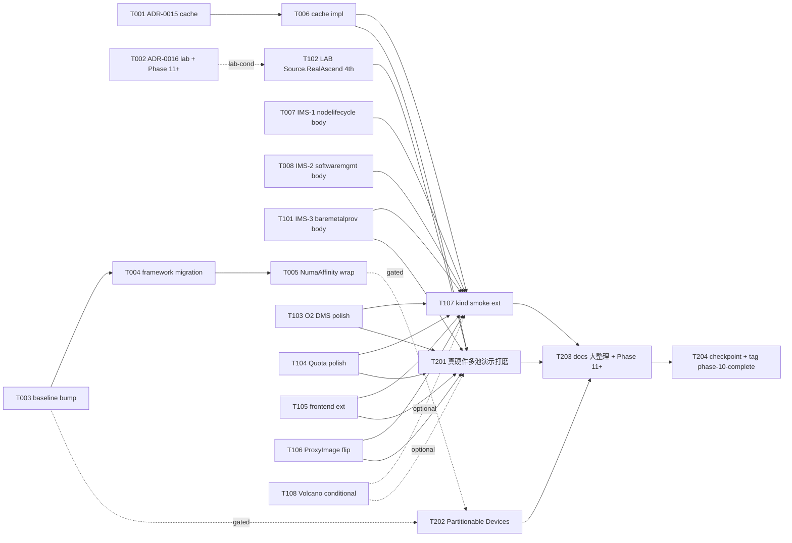

# Phase 10 Plan — M4 工程化对外 closer · 真实硬件对接 + 演示打磨 + IMS 3 项 controller body + Phase 9 carry-forward 全部 close

> **Goal**: Phase 10 closes the **M4 工程化对外** milestone (arch §1.3
> final phase of the project roadmap) along three co-equal主线 +
> 三条子线: **主线 1 = 完整 IMS 7 服务**(P9-T-105 scaffold-only 3
> 模块 → controller body + reconcile loops + helm chart land via
> T007/T008/T101); **主线 2 = 真实硬件对接**(P7-T-101 + P8-T-105 +
> P9-T-106 lab-gating 4th attempt via T102 · synthetic ring fixture →
> real npu-smi binary + ResourceSlice attribute populate + PD-pair real
> placement hard-assertion); **主线 3 = 完整演示打磨**(per arch §1.3
> Phase 10 row · multi-pool / multi-tenant master demo flow via T201 ·
> 涵盖 multiple modelservice + multi-pool + Quota enforcement + busy-idle
> scale + cache singleton + O2 DMS NB endpoint 端到端演示)。子线 1 =
> Phase 9 carry-forward 全部 close(K8s baseline bump 三件套 via
> T003+T004+T005 closes known-issues #12 · cache impl via T006 per
> ADR-0015 · ProxyImage chart flip via T106 closes known-issues #13 ·
> Volcano via T108 conditional · Source.RealAscend via T102
> conditional)· 子线 2 = ADR-0013 / ADR-0014 forward notes 全部 land
> via T103 + T104(O2 DMS authn/z + Karmada propagation · Quota
> cluster-scope + token-bucket)· 子线 3 = docs 大整理 + Phase 11+
> 前瞻 via T203(arch §13 review-table promote 全部 Phase 9-10 rows
> from "in flight" → "landed" · M4 milestone complete narrative ·
> Phase 11+ candidate streams enumeration)。Frontend Workload page
> extensions(T105)bridges 子线 2 surface 到 demo UX。kind smoke
> Phase 10 extension(T107)validates 全链 end-to-end。
>
> **Duration**: ~5-6 weeks calendar(W1 foundation 8 tasks: 2 ADRs +
> 三件套 K8s baseline bump (3 tasks) + cache impl + IMS-1 + IMS-2;
> W2 polish + lab-conditional + decision-gated + frontend + ProxyImage
> + kind smoke 8 tasks: IMS-3 + LAB Source.RealAscend + O2 DMS polish +
> Quota polish + Frontend extension + ProxyImage flip + kind smoke ext +
> Volcano conditional; W3 closer + milestone-closer 4 tasks: 真硬件
> multi-pool 演示打磨 + Partitionable Devices conditional + docs 大整理 +
> checkpoint+tag)。
>
> **Phase 10 uncertainty profile**: highest of any phase so far —
> multi-spine scope(3 主线 + 3 子线 · 4 ADR forward note 落地 + 3
> IMS controller body + 1 真硬件 lab + 1 multi-pool 演示打磨)+
> 3 decision/lab-gated tracks(T102 LAB 4th attempt · T108 Volcano
> 2nd defer · T202 Partitionable Devices conditional)+ K8s baseline
> bump 三件套 framework migration risk(P9-T-003 attempted bump 1.34
> 失败 reason: K8s 1.34 scheduler framework restructuring NodeInfo +
> CycleState struct→interface · 9 files affected · 三件套 拆 T003 baseline
> + T004 framework migration + T005 NumaAffinity wrap upgrade 缓解)+
> O2 IMS R1 spec drift(per Phase 9 §risk #1 carry · v04.00 → v05.00
> 评估 at T103 entry)。Lab access remains 4th carry candidate per
> ADR-0011 §3 default policy(若 W2 entry 仍无 signal → 5th carry
> Phase 11+);Partitionable Devices Beta GA timing 仍未确认 per P8-T-101
> spike(若 T003 bumped 1.36 + KEP-4815 GA per re-WebFetch → T202
> lights up · 否则 carry Phase 11+)。
>
> **Prereq**: Phase 9 tag `phase-9-complete` (HEAD of dev post-CI gate ·
> last commit of any P9-fix-NNN series per memory `feedback_post_tag_ci_gate.md`).
> ADR-0011 (NPU 动态切分 + Source 接口 + lab gating policy · 3rd carry
> count + 4th attempt at T102), ADR-0012 (busy-idle 垂直伸缩 ·
> NPUVerticalScaler + ADR-0014 § cross-ref), ADR-0013 (O2 DMS Adapter
> design freeze · §6 forward notes drive T103), ADR-0014 (Multi-tenant
> Quota · §7 forward notes drive T104), ADR-0003 v2 (IMS 7 services
> phasing · 3 项 scaffold → controller body 来源 of T007/T008/T101),
> `docs/checkpoint-phase9.md` §6 Phase 10 handoff brief (10 candidate
> workstreams · most-actionable 排序 = Phase 10 task chain primary
> reference), `docs/research/demo-backend-cache-spike.md` §6 ADR-0015
> draft outline (T001 起草 ADR-0015 直接 pick up), `docs/research/k8s-partitionable-devices-spike.md`
> (KEP-4815 status · Phase 10 W3 T202 entry re-WebFetch),
> `docs/research/volcano-gang-scheduling-spike.md` (路径 A · T108 W2
> entry decision input), arch §1.3 Phase 路线图 (M4 工程化对外 =
> Phase 9 O2 DMS + Phase 10 真实硬件对接 + 演示打磨 = M4 closer),
> arch §13 review-table (Phase 9 rows + Phase 10 row promote at T204
> 入 landed status). Root CLAUDE.md §14 (devlog + module DESIGN.md)
> applies; `docs/agent-coordination.md` §0a.10-12 (plan/execute split +
> strict-per-task verify + push protocol) applies to every Phase 10
> task. Per memory `feedback_plan_vs_execute_session_split.md`, this
> plan commits + stops; T001 execution is a separate session.

---

## 1. Scope summary

Phase 10 closes all 10 Phase 9 checkpoint §6 candidate workstreams (per
most-actionable 排序) + opens 3 net-new milestone-closer streams
(docs 大整理 + multi-pool 真硬件演示打磨 + Phase 11+ 前瞻); 2 stay
deferred to Phase 11+ per arch §13 carry-forward conditions.

| Stream                                                              | Phase 9 state                                                                                                                                              | Phase 10 delivery                                                                                                                                                                                                                                                                              |
|---------------------------------------------------------------------|------------------------------------------------------------------------------------------------------------------------------------------------------------|------------------------------------------------------------------------------------------------------------------------------------------------------------------------------------------------------------------------------------------------------------------------------------------------|
| **真实硬件对接 + 完整 multi-pool / multi-tenant 演示打磨**(arch §1.3 Phase 10 row · M4 closer 主线 3)| synthetic ring fixture 仍 cover CI · 3 prior lab-gating carries(P7+P8+P9)· 多池场景未演示                                                              | T102 [LAB-CONDITIONAL · 4th attempt] Source.RealAscend body(npu-smi real call · ResourceSlice attribute · PD-pair real placement · cann-driver-matrix verification stamp · ADR-0011 §3 carry tally 4th)+ T201 真硬件 multi-pool 演示打磨(master demo script + multi-modelservice + Quota + scale + cache · arch §1.3 Phase 10 row 实质 deliverable)          |
| **IMS 7 服务剩 3 项 controller body**(P9-T-105 scaffold carry · 主线 1)| 3 modules api/v1alpha1 types only(P9-T-105 landed · 9 round-trip tests · controller body deferred per CLAUDE.md §14.2)                                  | T007 node-lifecycle-operator controller body + reconcile loops + helm chart(8 state machine transitions + Conditions controller · per ADR-0003 v2 + arch §5.9)· T008 software-mgmt-operator controller body + reconcile loops + helm chart(3 rollout strategy + per-node application · arch §5.10)· T101 bare-metal-provisioning-operator controller body + reconcile loops + helm chart(7 state enum + 与 Phase 10 真机对接同期 · arch §5.11) |
| **K8s baseline bump + scheduler framework migration + NumaAffinity wrap 三件套**(P9-T-003 doc-only refresh + P9-T-102 auto-deferred carry)| K8s 1.32 baseline 仍 in place · bump 1.34 attempted P9 但 K8s 1.34 scheduler framework restructuring(NodeInfo + CycleState struct→interface · 9 files affected)exceeded T003 Forbidden Paths · reverted | T003 三件套 part 1: coordinated baseline bump 1.32 → 1.34/1.35(go.mod + kindest/node + chart kubeVersion all in lockstep · 同 P8-T-002 + P9-T-003 plan §3 模式)· T004 三件套 part 2: scheduler framework migration(NodeInfo + CycleState struct→interface · 9 files migration · 独立 task · Forbidden Paths 不再阻断)· T005 三件套 part 3: NumaAffinity wrap upgrade body(sched-plugins v0.3X.x + closes known-issues #12)|
| **demo-backend cache implementation per ADR-0015**(P9-T-107 spike outcome · 子线 1)| LRU 进程内 cache · single-instance stateful · P9-T-107 spike landed `docs/research/demo-backend-cache-spike.md` + ADR-0015 draft outline §6 推荐 §3.3 singleton with active-active failover | T001 ADR-0015 起草 + Accept · T006 demo-backend cache impl per ADR-0015 §3.3 singleton(K8s Lease leader-elect + chart values.replicas 升 2-3 + Lease health probe + degraded read-only mode + monitoring · 0 new external dependency)|
| **O2 DMS Phase 10 polish**(ADR-0013 §6 forward notes · 子线 2)| Phase 9 ships read + lifecycle + K8s Profile only · authn placeholder Bearer-token env-var · single-cluster only · subscription/alarmEvent endpoints 未实现                            | T103 polish W1 wave: authn/z full(OIDC + K8s SA + TokenReview)+ Karmada multi-cluster propagation 第一波(PropagationPolicy + cross-cluster informer aggregation · arch §9.3)+ subscription endpoint scaffold + alarmEvent endpoint scaffold + R005-v0X 评估(W2 entry re-WebFetch · 同 P9-T-001 v04.00 lock 模式)+ frontend Workload page indicator (per T105)               |
| **Quota Phase 10 polish**(ADR-0014 §7 forward notes · 子线 2)| Phase 9 ships namespace-scope only · sliding-window count · single-cluster only · no frontend visualisation                                                  | T104 polish W1 wave: cluster-scope ClusterQuota CRD(`inference.ocloud.edge.example.com/v1alpha1/ClusterQuota` per ADR-0014 §7 (b))+ Karmada cross-cluster Quota propagation(aggregated usage view · per ADR-0014 §7 (c))+ token-bucket algorithm option for spec.enforcement.rateAlgorithm enum (sliding-window remains default per ADR-0014 §3 backwards compat) + frontend visualisation (per T105) |
| **Frontend Workload page extension**(per Phase 6 T102/T103 chat+ADR self-RFC pattern · 子线 2 surface)| Phase 9 backend ships O2 DMS substrate + Quota substrate + scaleHistory data feed · 但 frontend 仍只 surface NPUSlicePool + ModelService     | T105 [chat+ADR self-RFC] O2 DMS endpoint indicator(Workload row 加 "O2 DMS exposed" badge if ms 来自 O2 NB)+ Quota usage visualisation(per-namespace Quota cap + Used + scale events 进度条)+ NPUVerticalScaler scaleHistory display(timeline chart · 复用 Phase 6 ECharts)· `docs/api-contract.yaml` 加 3 fields(GET endpoints only · 不影响 mock-data schema)· chat+ADR self-RFC self-record per Phase 6 T102/T103 模式 |
| **vllm-ascend ProxyImage chart default flip**(known-issues #13 closer · 子线 1)| Phase 7 P7-T-102 doc-only refresh · Phase 8 P8-T-004 conservative posture · Phase 9 carry · upstream stable line activity 未 verify                  | T106 ADD chart `defaults.proxyImage` value field + template wiring(if value set → effective; if empty → no-op preserve Phase 7-8 behavior)+ docker pull verify on GHA(image-pull cache mount · CI 时间 < 30s overhead)+ 1 effectiveProxyImage 单元测试 · closes known-issues #13                                                                              |
| **kind smoke E2E Phase 10 extension**(子线 3 validates 全链)| Phase 9 covers Quota + O2 DMS + PromQL + propagation + IMS scaffold informational + 3 SKIPPED conditional                                                  | T107 install + assert.sh 加 10+ assertions covering:(a)cache singleton K8s Lease leader-elect(b)IMS 3 controller smoke(c)O2 DMS authn OIDC(d)Quota cluster-scope ClusterQuota(e)Karmada propagation chains(f)ProxyImage chart default smoke(g)真硬件演示 fallback path validation(h)Volcano conditional(i)Partitionable Devices conditional · 同 Phase 9 phase9/ folder 模式                       |
| **Volcano gang-scheduling**(P9-T-101 deferred carry · 子线 1 conditional)| P9-T-101 doc-only deferred per default policy(no training-job demo signal · spike `docs/research/volcano-gang-scheduling-spike.md` §4 路径 A 推荐)    | T108 [DECISION-GATED · 2nd defer or land]: 若 W2 entry user signal "Phase 10 training-job demo 需要 gang" → install Volcano v1.10.x+ via独立 helm + 训练 Pod opt-in via `schedulerName=volcano` + PodGroup atomicity + ADR-0010 §7 status flip(landed at SHA)· 否则 default = 2nd defer Phase 11+(no further re-eval unless ad-hoc signal)                          |
| **Partitionable Devices Beta + partition-aware allocator**(P8-T-101/T102 carry · 子线 1 conditional)| P8-T-101 spike landed · P8-T-102 conservative posture · P9-T-003 baseline bump deferred → P8-T-101/T102 deferred · KEP-4815 GA timing 未确认            | T202 [DECISION-GATED · land or defer Phase 11+]: 若 T003 bumped 1.36 + KEP-4815 GA per re-WebFetch at W3 entry → partition-aware allocator + npu-dra-driver §4 path A migration + 1-2 sanity tests · 否则 defer Phase 11+(no further re-eval unless KEP-4815 GA confirmed · 与 K8s 1.36 baseline 同期)                                                                  |
| **项目级 docs 大整理 + Phase 11+ 前瞻**(M4 closer 子线 3 · NEW Phase 10)| docs sprawl 11 ADR + 16 phase docs + 9 module DESIGN.md · arch §13 review-table 多 rows "in flight" status                                                  | T203 docs 大整理: arch §13 promote 全部 Phase 9-10 rows "in flight" → "landed" + Phase 11+ candidate streams enumeration + README current-phase pointer M4 milestone complete narrative + ADR cross-ref audit(11 ADR all status verified)+ devlog index update + Phase 1-10 timeline narrative · 不写新 ADR · 只更新 cross-ref + status + narrative              |

**Out of scope (Phase 11+)**:
- **Live migration of HCCL ranks / per-Pod RDMA bandwidth quota** — CNI-level gaps per `docs/cni-hccl-research.md` §5 · Phase 8 重启切片 sidesteps · Phase 11+ if at all
- **Fabric discovery via LLDP / SONiC API** — defer per ADR-0007 + ADR-0010 §229 · 真硬件 switch SDK 是 Phase 11+ track
- **Authn/z OIDC provider 完整集成**(Keycloak / Dex)— Phase 10 ships OIDC client + K8s SA + TokenReview · 完整 IdP 部署 Phase 11+
- **Karmada control-plane HA deployment + multi-cluster scheduling policy controller** — Phase 10 ships PropagationPolicy + cross-cluster informer · 完整 Karmada control HA Phase 11+
- **Production-grade O2 IMS R1 v05.00+ spec migration** — Phase 10 评估 at T103 W1 entry · v05.00 if released + non-breaking → land · v05.00 if breaking → defer Phase 11+ · ADR-0013 §5 Open question (a) carry
- **vLLM PD 分离 production-grade SLA**(latency P99 + multi-tenant isolation guarantees)— Phase 10 ships demo-grade per Phase 5 baseline · Phase 11+ if production deployment signal
- **真实 multi-site 多机房 deployment**(2+ Karmada members)— Phase 10 ships single-cluster + Karmada propagation 第一波(可在 single-cluster 验证)· 真实 multi-site Phase 11+
- **Real fabric switch integration**(SONiC / Cumulus / Arista API call · 真 spine-leaf hops)— Phase 11+ on real switching gear · ADR-0007 fabric discovery 已 defer

---

## 2. Task package overview (20 tasks)

```
W1 Foundation (8 tasks · 2 ADRs + 三件套 K8s baseline bump + cache impl + IMS-1 + IMS-2)
├── P10-T-001  ADR-0015 — demo-backend cache strategy(per P9-T-107 spike §6 outline · §3.3 singleton recommended · K8s Lease leader-elect · 0 new external dependency)
├── P10-T-002  ADR-0016 — lab onboarding / 真硬件对接 4th attempt + Phase 11+ 前瞻(per ADR-0011 §3 4th carry · 演示 fallback path if lab 仍未 available · Phase 11+ multi-site track outline)
├── P10-T-003  K8s baseline bump 三件套 part 1: coordinated baseline bump 1.32 → 1.34/1.35(go.mod + kindest/node + chart kubeVersion + Phase 5-9 kind smoke re-run · P9-T-003 attempted but reverted · 三件套 拆 mitigation)
├── P10-T-004  K8s baseline bump 三件套 part 2: scheduler framework migration(NodeInfo + CycleState struct→interface · 9 files affected · 独立 task · 上游 sched-plugins v0.3X.x adoption)
├── P10-T-005  K8s baseline bump 三件套 part 3: NumaAffinity wrap upgrade body(sched-plugins v0.3X.x post-T004 framework migration · 4 sanity tests + chart toggle default flip + closes known-issues #12 · P9-T-102 auto-deferred carry)
├── P10-T-006  demo-backend cache impl per ADR-0015 §3.3 singleton(K8s Lease leader-elect + chart values.replicas 升 2-3 + Lease health probe + degraded read-only mode + monitoring)
├── P10-T-007  IMS-1 node-lifecycle-operator controller body + reconcile loops + helm chart(P9-T-105 scaffold carry · 8 state machine transitions + Conditions controller · arch §5.9)
└── P10-T-008  IMS-2 software-mgmt-operator controller body + reconcile loops + helm chart(P9-T-105 scaffold carry · 3 rollout strategy + per-node application · arch §5.10)

W2 Polish + lab-conditional + decision-gated + frontend + ProxyImage + kind smoke (8 tasks)
├── P10-T-101  IMS-3 bare-metal-provisioning-operator controller body + reconcile loops + helm chart(P9-T-105 scaffold carry · 7 state enum + 与 真机对接同期 · arch §5.11)
├── P10-T-102  [LAB-CONDITIONAL · 4th attempt] Source.RealAscend body(P7+P8+P9 carry · npu-smi real-binary call + ResourceSlice attribute populate + PD-pair real placement + cann-driver-matrix verification stamp · ADR-0011 §3 lab gating)
├── P10-T-103  O2 DMS Phase 10 polish wave 1(authn/z full OIDC + K8s SA + TokenReview · Karmada propagation 第一波 · subscription/alarmEvent endpoint scaffold · per ADR-0013 §6 forward notes)
├── P10-T-104  Quota Phase 10 polish wave 1(cluster-scope ClusterQuota CRD · Karmada cross-cluster Quota propagation · token-bucket algorithm option · per ADR-0014 §7 forward notes)
├── P10-T-105  [chat+ADR self-RFC] Frontend Workload page extension(O2 DMS endpoint indicator + Quota usage visualisation + NPUVerticalScaler scaleHistory display · `docs/api-contract.yaml` 加 3 fields · per Phase 6 T102/T103 pattern)
├── P10-T-106  vllm-ascend ProxyImage chart default flip(known-issues #13 closer · ADD chart `defaults.proxyImage` value field + template wiring + docker pull verify GHA + 1 effectiveProxyImage unit test)
├── P10-T-107  kind smoke E2E Phase 10 extension(10+ new assertions covering cache singleton + IMS 3 controller + O2 DMS authn + Quota cluster-scope + Karmada propagation + ProxyImage chart smoke + 真硬件 fallback + Volcano conditional + Partitionable Devices conditional)
└── P10-T-108  [DECISION-GATED] Volcano gang-scheduling install body(P9-T-101 carry · install Volcano v1.10.x+ helm + 训练 Pod opt-in PodGroup atomicity · gated on W2 entry training-job demo signal · default = 2nd defer Phase 11+)

W3 Closer + Milestone Closer (4 tasks)
├── P10-T-201  真实硬件 multi-pool / multi-tenant 演示打磨(arch §1.3 Phase 10 row 实质 deliverable · master demo script + multi-modelservice + multi-pool + Quota + scale + cache + O2 DMS 端到端演示 · recording fixture for offline replay)
├── P10-T-202  [DECISION-GATED] Partitionable Devices Beta + partition-aware allocator(P8-T-101/T102 carry · if T003 bumped 1.36 AND KEP-4815 GA per re-WebFetch at W3 entry · npu-dra-driver §4 path A migration · ADR-0009 §4 + arch §13 Phase 10 row carry)
├── P10-T-203  项目级 docs 大整理 + Phase 11+ 前瞻(arch §13 promote 全部 Phase 9-10 rows "in flight" → "landed" · README current-phase M4 milestone complete narrative · ADR cross-ref audit 11 ADR all status · devlog index update · Phase 1-10 timeline · Phase 11+ candidate streams enumeration)
└── P10-T-204  Phase 10 checkpoint + tag phase-10-complete + M4 milestone complete announcement
```

Mermaid:



**Subagent parallelisation candidates** (per §0a.11 strict-verify — ONE
subagent at a time, main agent verifies before next is dispatched;
parallelisation is OPPORTUNISTIC across natural module boundaries
when user gives explicit "batch" cue):
- T001 + T002 (docs-only ADRs) standalone — no code dependency · 不同
  文档可 parallel if user 显式 batch
- T003 → T004 → T005 三件套 strictly serial within main agent(K8s
  baseline change · framework migration · NumaAffinity wrap upgrade
  必须 lockstep · 共享 go.mod + scheduler-plugin package · cross-module
  share spirit per §0a.11)
- T006 (demo-backend cache impl · backend module) parallel-eligible with
  T007 / T008 / T101 (operators 各模块) — different modules · 不交叉
- T007 / T008 / T101 (3 IMS controller body · 3 不同 module) — 同模块
  类型 but 各自 module 独立 · 可 parallel if user 显式 batch · default
  serial main agent verify per §0a.11
- T102 (LAB-CONDITIONAL) MUST main-agent serial(lab signal 涉及 user
  chat + ADR-0011 §3 carry tally update · 不能 subagent)
- T103 / T104 / T105 / T106 各模块独立 · 可 parallel · default serial
- T107 (kind smoke ext) MUST 在 T101 + T103-T106 都 land 后 run(全
  assertions 来源都得到 · serial)
- T108 (DECISION-GATED Volcano) standalone 模块 · 但同 T102 lab-cond
  spirit · main agent serial
- T201 (真硬件多池演示打磨) MUST 在 T101 + T103-T106 + T102 (if landed)
  都 ready 后 run · cross-module integration · serial main agent
- T202 (DECISION-GATED Partitionable Devices) gated on T003 outcome ·
  cross-module if landed · serial main agent
- T203 / T204 docs-only · serial main agent

**Decision-gated tracks**:

- **T108 Volcano gang-scheduling** (W2 entry decision · user signal):
  - User signal "Phase 10 training-job demo 需要 gang" → install Volcano
    binary 路径 A · 1-2d 工作量
  - User signal "Phase 10 仍 只 inference 演进 · 不引入训练" → 2nd
    defer Phase 11+ · 路径 C · 0d 工作量
  - 无明确信号 (default) → 2nd defer Phase 11+ · 同 Phase 9 default
    policy
  - T108 deferred → T107 kind smoke Volcano section skipped · 无下游
    cascade

- **T202 Partitionable Devices Beta** (W3 entry decision · T003 outcome
  cascade):
  - T003 baseline bumped 1.36 AND KEP-4815 GA per re-WebFetch → land
    partition-aware allocator + npu-dra-driver §4 path A migration + 2
    sanity tests
  - T003 bumped 1.34/1.35 only OR KEP-4815 still Beta per re-WebFetch
    → defer Phase 11+ · doc-only refresh

**LAB-conditional track (T102 · 4th attempt)**:
- Triggered ONLY when user signals "lab access available" mid-W2 in
  chat — same gating as P7-T-101 + P8-T-105 + P9-T-106 per ADR-0011 §3
  default policy(4th attempt · 4th carry tally update)
- Phase 10 ships without this if lab not available → T102 moves to
  Phase 11+ backlog(5th carry · ADR-0011 §3 carry tally update + 显
  著 forward note in checkpoint-phase10.md indicating lab-gating policy
  consideration for Phase 11+ posture)
- T102 deferred → T201 真硬件演示打磨 fallback path:synthetic ring
  fixture 继续演示 multi-pool / multi-tenant flow · 但不挂"真硬件"
  标签 · arch §1.3 Phase 10 row 实质 deliverable 80% landed(20%
  缺真硬件 stamp)

**§0a.5 chat+ADR self-RFC pattern continues** — Phase 10 introduces
2 ADR additions (ADR-0015 cache strategy · ADR-0016 lab + Phase 11+) +
several existing-ADR small edits (ADR-0011 §3 lab gating count
update via T102 devlog · ADR-0013 §6 polish status flip via T103 ·
ADR-0014 §7 polish status flip via T104 · ADR-0003 v2 IMS controller
body status flips via T007/T008/T101 · ADR-0009 §4 partition-aware
allocator status via T202 · ADR-0010 §3 NumaAffinity status flip via
T005 · ADR-0010 §7 Volcano status flip via T108 if landed). T105
frontend extension follows Phase 6 T102/T103 chat+ADR self-RFC pattern
per §0a.5(`docs/api-contract.yaml` 加 3 GET fields · self-record in
T105 commit message).

---

## 3. W1 task packages

### P10-T-001 ADR-0015 — demo-backend cache strategy

Owner: docs (no code).

**Allowed Paths**:
- `docs/adr/0015-demo-backend-cache-strategy.md` (new — per P9-T-107
  spike `docs/research/demo-backend-cache-spike.md` §6 outline · §1
  Context (Phase 4-8 LRU 进程内 cache 现状 + multi-site Phase 10 演示
  约束 + 3 路径 evaluation findings cross-ref) · §2 Decision
  (default = §3.3 Singleton with active-active failover · K8s Lease
  leader-elect · 0 new external dependency · Alternative §3.1
  Redis-backed Phase 11+ if production-grade HA signal · Reject §3.2
  stateless K8s API server load risk) · §3 Consequences (Phase 10
  W1 land · Phase 10 polish monitoring · Phase 11+ Redis-backed
  rewrite path) · §4 Open questions (Karmada control-plane 部署位置 +
  failover SLA threshold + cache size tuning per resource type) · §5
  引用 (spike doc + arch §13 Phase 9 row + ADR-0001 §10 + ADR-0013
  §6 + ADR-0014 §7 cross-ref))
- `docs/architecture.md` (small edit — §13 review-table Phase 9
  "Phase 9 多站点 demo backend 缓存重构" row promoted from "spike
  landed via P9-T-107" → "in flight via ADR-0015 + T006"; §1.3 phase
  roadmap unchanged; §5.1 演示后端 §3.2 数据源抽象 cross-ref ADR-0015)
- `docs/adr/0001-phase0-key-decisions.md` (small edit — §10 数据源
  抽象 row cross-ref ADR-0015)
- `docs/devlog/phase-10-t001.md`

Acceptance:
- ADR §1 Context: cites P9-T-107 spike + arch §13 Phase 9 cache row +
  arch §1.3 Phase 10 multi-site 演示约束 + Phase 4 LRU 进程内 cache
  impl baseline
- §2 Decision A: default = §3.3 Singleton with active-active failover
- §2 Decision B: K8s Lease leader-elect via
  `sigs.k8s.io/controller-runtime/pkg/leaderelection` (重用 inference-
  operator pattern) · Lease namespace `ocloud-system` · LeaseDuration
  15s · RenewDeadline 10s · RetryPeriod 2s (per controller-runtime
  defaults)
- §2 Decision C: chart values.replicas 升 2-3 (default 2 · acceptable
  cold-cache failover 5-30s demo SLA) · degraded read-only mode on
  Lease error (graceful — return cached data with `X-Cache-Status:
  stale` header)
- §2 Decision D: monitoring — Prometheus metrics
  `demo_backend_lease_holder` (1 if leader · 0 otherwise) +
  `demo_backend_lease_renewals_total` (counter) +
  `demo_backend_cache_hit_ratio` (gauge)
- §3 Consequences: Phase 10 ships impl per T006 · 0 new external
  dependency · Phase 11+ Redis-backed additive rewrite path retained
  as escape hatch
- §4 Open questions: (a) Karmada control-plane 部署位置 (同 Karmada
  control vs 独立 site) · (b) failover SLA acceptable threshold (5s?
  30s?) · (c) cache size tuning per resource type (Phase 4 default
  is `pool=100/ms=200/scaler=50`; multi-site Phase 11+ revisit) · (d)
  cross-cluster cache coherence Karmada path (Phase 10 single member ·
  Phase 11+ multi-member)
- §5 引用: spike doc + arch §13 Phase 9 row + ADR-0001 §10 + ADR-0013
  §6 + ADR-0014 §7 (cache singleton 影响 frontend O2 DMS / Quota
  visualisation 一致性 via T105)
- arch §13 + ADR-0001 cross-ref status flip

Dependencies: none beyond `phase-9-complete`.

Estimated effort: 0.5d.

---

### P10-T-002 ADR-0016 — lab onboarding / 真硬件对接 4th attempt + Phase 11+ 前瞻

Owner: docs (no code).

**Allowed Paths**:
- `docs/adr/0016-lab-onboarding-and-phase-11-outlook.md` (new — §1
  Context (Phase 7-9 lab gating policy carry tally · ADR-0011 §3
  default policy 3 prior defers + 1 attempt at T102 · arch §1.3 Phase
  10 真实硬件对接 实质 deliverable · synthetic ring fallback path
  for T201 演示打磨)· §2 Decision A: 4th attempt at T102 follows same
  ADR-0011 §3 gating policy + same Allowed Paths as P9-T-106 ·
  cann-driver-matrix verification stamp + npu-smi real-binary call +
  ResourceSlice attribute populate + PD-pair real placement
  hard-assertion · §2 Decision B: 5th carry to Phase 11+ rationale +
  lab gating policy posture re-evaluation triggers (if T102 5th carry ·
  Phase 11+ entry meeting reconsider whether to keep gating-default OR
  reverse to opt-out-default) · §2 Decision C: T201 真硬件 multi-pool
  演示打磨 fallback path if T102 deferred — synthetic ring fixture
  continues to cover multi-pool/multi-tenant flow · arch §1.3 Phase 10
  row 实质 deliverable 80% landed · checkpoint § Phase 10 row 标
  "with synthetic ring fallback" 而非 "with real Ascend hardware" ·
  §3 Phase 11+ candidate streams enumeration: real multi-site
  deployment + live migration + fabric switch integration + production-
  grade SLA + OIDC IdP 完整集成 + KEP-4815 GA wait (if T202 deferred)
  + Volcano gang-scheduling (if T108 2nd defer) + O2 IMS R1 v05.00+
  spec migration (if breaking · T103 defer carry) · §4 Open questions:
  (a) lab access posture re-evaluation timing · (b) Phase 11+ scope
  primary spine · (c) milestone naming Phase 11+ (M5? 真生产化?))
- `docs/adr/0011-npu-dynamic-slicing-and-source-interface.md` (small
  edit — §3 lab gating policy carry tally 加 P10-T-102 4th attempt
  entry · "若 T102 5th carry · Phase 11+ posture re-eval per ADR-0016
  §2 Decision B" cross-ref)
- `docs/architecture.md` (small edit — §13 review-table Phase 10 row
  "真实硬件对接 + 演示打磨" promote 加 "in flight via T102+T201 +
  ADR-0016 fallback path"; §14.1 风险表 第 1 行 "910B 真机访问受限"
  cross-ref ADR-0016)
- `docs/devlog/phase-10-t002.md`

Acceptance:
- ADR §1 Context: cites P7-T-101 + P8-T-105 + P9-T-106 carry tally +
  ADR-0011 §3 default policy + arch §1.3 Phase 10 row + arch §14.1
  风险表 row 1
- §2 Decision A: 4th attempt at T102 detailed gating policy +
  Allowed Paths reference (per P9-T-106 + ADR-0011 §3)
- §2 Decision B: 5th carry to Phase 11+ rationale + posture re-eval
  triggers (3 distinct triggers: (1) Phase 11+ entry chat · (2)
  ad-hoc lab signal · (3) milestone reset opportunity per M5+
  planning)
- §2 Decision C: T201 fallback path detail · synthetic ring fixture
  continues · arch §1.3 Phase 10 row 实质 deliverable accounting
- §3 Phase 11+ candidate streams: 8 streams enumerated (per checkpoint-
  phase9.md §6 carry-forward + arch §13 Phase 11+ row + this Phase 10
  Out-of-scope list)
- §4 Open questions: 3 open
- ADR-0011 §3 cross-ref status flip + arch §13 + §14.1 row 1 cross-ref

Dependencies: none beyond `phase-9-complete`. T002 can run in parallel
with T001 per §0a.11 (docs-only · main agent verifies separately).

Estimated effort: 0.5d.

---

### P10-T-003 K8s baseline bump 三件套 part 1: coordinated baseline bump 1.32 → 1.34/1.35

Owner: operators + deploy + backend (cross-module · main-agent 串行
per §0a.11).

**Decision needed at task entry (T003 start)**:
- Re-WebFetch upstream condition table (same checks as P9-T-003 entry ·
  + Phase 10 三件套 拆 mitigation):
  - `kindest/node` releases — check v1.34+/v1.35+/v1.36+ image tags
    stable
  - `scheduler-plugins`: check v0.34.x / v0.35.x / v0.36.x GA tags
  - `apimachinery` v0.34.x+/v0.35.x+/v0.36.x+ — check `pkg/api/{safe,
    operation,validate}` package availability
  - K8s scheduler framework drift surface (NodeInfo + CycleState
    struct→interface) — P9-T-003 devlog identified 9 files affected ·
    T003 part 1 ships bump baseline ONLY (Forbidden Paths exclude
    scheduler-plugin source · T004 part 2 owns framework migration)
- Decision branches (per P9-T-003 W1 entry decision branches · 1.34
  default if conditions clean):
  - **Bump 1.34** (recommended baseline · sched-plugins v0.34.x GA +
    kindest/node v1.34 stable confirmed) · 三件套 default
  - **Bump 1.35** (only if v1.35 released cleanly + sched-plugins
    v0.35.x GA · re-WebFetch confirms)
  - **Bump 1.36** (only if v1.36 + sched-plugins v0.36.x GA +
    Partitionable Devices Beta still stable per re-WebFetch · enables
    T202 conditional land Phase 10 W3)
  - **Defer Phase 11+ baseline bump** (only if 1.34 also blocked by
    upstream gap · escalate to user)

**Allowed Paths**:
- `go.mod` + `go.sum` (root or per-module — repo layout decides)
- `operators/npu-dra-driver/go.mod` + `go.sum`
- `operators/inference-operator/go.mod` + `go.sum`
- `operators/pool-operator/go.mod` + `go.sum`
- `operators/o2-dms-adapter/go.mod` + `go.sum`
- `operators/node-lifecycle-operator/go.mod` + `go.sum`
- `operators/software-mgmt-operator/go.mod` + `go.sum`
- `operators/bare-metal-provisioning-operator/go.mod` + `go.sum`
- `exporters/ascend-npu-exporter-plus/go.mod` + `go.sum`
- `backend/go.mod` + `go.sum`
- `tests/e2e/kind/kind-config.yaml` (kindest/node image bump)
- `tests/e2e/kind/phase{5,6,7,8,9}/install.sh` (kubectl version pin if any)
- `deploy/helm-charts/*/Chart.yaml` (kubeVersion range bump)
- `.github/workflows/e2e-kind.yml` (kindest/node image bump in matrix)
- `.github/workflows/ci.yml` (Go version + kubectl pins)
- `Makefile` (if Go / kubectl version referenced)
- `docs/adr/0010-scheduler-plugin.md` (small edit — §1 baseline bump
  note "Phase 10 三件套 part 1 lands · part 2 framework migration ·
  part 3 NumaAffinity wrap upgrade")
- `docs/devlog/phase-10-t003.md`

**Forbidden Paths**:
- `operators/scheduler-plugin/**` (T004 owns framework migration · T003
  part 1 baseline ONLY · 不动 scheduler-plugin source files)
- `docs/api-contract.yaml` (no API change in baseline bump)
- `configs/mock-data/**` (no mock data schema change)
- Source code outside `go.mod` / `go.sum` (any source change must be
  SEPARATE post-bump task — T004 framework migration is the explicit
  post-bump task)

Acceptance:
- All go.mod files updated to target K8s minor in lockstep (no version
  skew)
- `go mod tidy` clean in every module (note: scheduler-plugin module
  may show stale due to framework API drift · expected · T004 owns
  fix-up)
- `go build ./...` clean in every module EXCEPT scheduler-plugin
  (T003 part 1 acknowledges scheduler-plugin build break as expected ·
  T004 part 2 closes)
- `go vet ./...` clean in every module EXCEPT scheduler-plugin
- `go test ./...` PASS in every module EXCEPT scheduler-plugin
- `helm lint --strict` clean across all charts post-kubeVersion bump
- `helm template` renders cleanly against target schema
- kind smoke installs against new kindest/node image without error
- Phase 5-9 kind smoke E2E phases re-run + PASS against new baseline
  (scheduler-plugin not yet 装 · phase6/install.sh skips
  scheduler-plugin install · expected)
- Devlog enumerates: target K8s minor decision + transitive dep
  changes (per module) + scheduler-plugin build break acknowledged ·
  T004 hands off
- ADR-0010 §1 update segment lands with bump date + T003 outcome

Dependencies: T001 + T002 (ADRs land first per natural order · T003
technically independent but main agent batches W1 ADR session per
§0a.10).

Estimated effort: 1-2d (1d if 1.34 conditions clean · 2d if framework
gaps surface mid-task that need T004 handoff coordination).

---

### P10-T-004 K8s baseline bump 三件套 part 2: scheduler framework migration

Owner: operators/scheduler-plugin (sched-plugins v0.3X.x adoption +
NodeInfo + CycleState struct→interface migration per P9-T-003 devlog
9-file drift).

**Allowed Paths**:
- `operators/scheduler-plugin/go.mod` + `go.sum` (sched-plugins v0.34.x
  / v0.35.x / v0.36.x adoption · 与 T003 baseline lockstep)
- `operators/scheduler-plugin/pkg/plugins/hccs/topology.go` (NodeInfo
  + CycleState struct→interface migration · per P9-T-003 devlog 9-file
  list)
- `operators/scheduler-plugin/pkg/plugins/hccs/topology_test.go`
- `operators/scheduler-plugin/pkg/plugins/numa/affinity.go` (struct→
  interface migration · placeholder body stays per P9-T-102 carry · T005
  part 3 owns body)
- `operators/scheduler-plugin/pkg/plugins/numa/affinity_test.go`
- `operators/scheduler-plugin/pkg/plugins/binpack/score.go` (struct→
  interface migration)
- `operators/scheduler-plugin/pkg/plugins/binpack/score_test.go`
- `operators/scheduler-plugin/cmd/main.go` (scheduler `app.NewSchedulerCommand`
  registration · API drift absorb)
- `operators/scheduler-plugin/internal/composition/composition.go`
  (P6-T-008 carry · API drift absorb)
- `operators/scheduler-plugin/internal/composition/composition_test.go`
- `deploy/helm-charts/scheduler-plugin/templates/*.yaml` (any API drift
  surfacing through manifest schema)
- `docs/adr/0010-scheduler-plugin.md` (small edit — §1 加 "Phase 10 三
  件套 part 2 framework migration landed at SHA"; §3 NumaAffinity
  placeholder 仍 OPEN · T005 part 3 owns body)
- `docs/devlog/phase-10-t004.md`

**Forbidden Paths**:
- `go.mod` of other modules (T003 part 1 owns baseline bump · T004 part
  2 ONLY owns scheduler-plugin framework migration · 不 re-bump 其他
  module)
- `operators/scheduler-plugin/pkg/plugins/numa/affinity.go` body
  (placeholder retains · T005 part 3 owns body)
- `operators/{npu-dra-driver,inference-operator,pool-operator,
  o2-dms-adapter,node-lifecycle-operator,software-mgmt-operator,
  bare-metal-provisioning-operator}/**` (other modules baseline bump
  via T003 · T004 part 2 不 cross-module)
- `backend/**` / `exporters/**` (same · 不 cross-module)

Acceptance:
- `go build ./operators/scheduler-plugin/...` clean post-migration
- `go vet ./operators/scheduler-plugin/...` clean
- `go test ./operators/scheduler-plugin/...` PASS — all P6-T-002..T008
  + P7-T-003 + P8-T-005 baseline tests preserved post-migration
- `helm lint --strict deploy/helm-charts/scheduler-plugin/` clean
- `helm template` renders cleanly
- kind smoke phase6/install.sh installs scheduler-plugin and PASSES
  assert.sh (P6-T-101 chart install · HCCS Filter+Score + Binpack
  ScorePlugin tests)
- Devlog enumerates: 9 files migrated (per P9-T-003 devlog list ·
  verify scope match) + upstream sched-plugins version + API drift
  resolved list + NumaAffinity wrap status (still OPEN · T005 owns)
- ADR-0010 §1 update segment + §3 NumaAffinity placeholder cross-ref
  T005

Dependencies: T003 (baseline bumped successfully · scheduler-plugin
build break is the expected entry condition · T004 closes it).

Estimated effort: 1-2d.

---

### P10-T-005 K8s baseline bump 三件套 part 3: NumaAffinity wrap upgrade body

Owner: operators/scheduler-plugin (NumaAffinity placeholder wraps real
sched-plugins NodeResourceTopology plugin · closes known-issues #12 ·
P9-T-102 auto-deferred carry).

**Allowed Paths**:
- `operators/scheduler-plugin/pkg/plugins/numa/affinity.go` (full body —
  wrap sched-plugins NodeResourceTopologyMatch plugin · per
  `docs/research/sched-plugins-numa-affinity-wrap.md` design (read at
  T005 entry · if doesn't exist, T005 creates research note skeleton
  alongside body) · 同 P8-T-003 / P9-T-102 plan §3 wrap design)
- `operators/scheduler-plugin/pkg/plugins/numa/affinity_test.go` (extend
  — 4 sanity test cases: (1) NodeResourceTopology absent → no-op
  preserve baseline behavior · (2) NodeResourceTopology present with
  single NUMA → single-card preferred · (3) NodeResourceTopology
  present with multi-NUMA → SCC mode score preferred · (4) Pod-spec
  override `numa.affinity/disable=true` annotation honoured)
- `operators/scheduler-plugin/pkg/plugins/numa/affinity_integration_test.go`
  (small edit if exists · or new — full envtest scenario invoking
  wrap path)
- `operators/scheduler-plugin/internal/composition/composition.go` (small
  edit — NumaAffinity plugin registration · default `disabled=false`
  if values.numaAffinity.enabled=true · backwards compat default `disabled=
  false` only if chart values flip default explicitly)
- `deploy/helm-charts/scheduler-plugin/values.yaml` (chart toggle —
  `numaAffinity.enabled: true` default flip · was placeholder default
  false per P6-T-101 carry)
- `deploy/helm-charts/scheduler-plugin/templates/configmap-scheduler-config.yaml`
  (KubeSchedulerConfiguration NumaAffinity plugin disabled→enabled
  default toggle)
- `docs/known-issues.md` (#12 entry: status flip RESOLVED with commit
  SHA + T005 landed + sched-plugins vX.Y.Z lockstep + 4 sanity tests +
  chart toggle default flip · 移到 RESOLVED 段)
- `docs/adr/0010-scheduler-plugin.md` (small edit — §3 NumaAffinity
  placeholder status "Phase 10 T005 LANDED" + body diagram + 4 sanity
  test enumeration · §1 三件套 part 3 closer note)
- `operators/scheduler-plugin/DESIGN.md` (small edit if exists · §5.2
  NumaAffinity section update from placeholder to landed body)
- `docs/devlog/phase-10-t005.md`

**Forbidden Paths**:
- `operators/scheduler-plugin/pkg/plugins/{hccs,binpack}/**` (T004
  framework migration already touched · T005 不 re-touch)
- `go.mod` (T003 part 1 owns baseline · T005 part 3 source-only)
- `operators/scheduler-plugin/cmd/main.go` (T004 part 2 owns API drift ·
  T005 不 re-touch)

Acceptance:
- `go build ./operators/scheduler-plugin/...` clean
- `go vet ./operators/scheduler-plugin/...` clean
- `go test ./operators/scheduler-plugin/...` PASS — 4 new NumaAffinity
  sanity tests + P6-T-002..T008 + P7-T-003 + P8-T-005 + T004 framework
  migration baseline tests all preserved
- `helm lint --strict deploy/helm-charts/scheduler-plugin/` clean ·
  values.yaml flip default surfaces clean
- `helm template` with `numaAffinity.enabled=true` renders
  KubeSchedulerConfiguration with NumaAffinity plugin enabled in score
  + filter extender list
- kind smoke phase6/install.sh + phase7+ run with NumaAffinity enabled
  + PASS (no regression · backwards compat verified)
- known-issues #12 entry: status RESOLVED · 移到 RESOLVED 段(同 #2 +
  #3 + #5 + #6 模式)
- ADR-0010 §3 NumaAffinity placeholder → LANDED · §1 三件套 closer
  note + commit SHA cross-ref
- DESIGN.md §5.2 update body diagram + 4 sanity test enumeration

Dependencies: T004 (framework migration must land first · NumaAffinity
plugin registration depends on sched-plugins API · T005 hard-blocked by
T004).

Estimated effort: 0.5-1d.

---

### P10-T-006 demo-backend cache impl per ADR-0015 §3.3 singleton

Owner: backend (demo-backend cache layer impl + K8s Lease leader-elect
+ chart values.replicas + monitoring).

**Allowed Paths**:
- `backend/internal/cache/singleton.go` (new — singleton wrapper +
  K8s Lease leader-elect via `sigs.k8s.io/controller-runtime/pkg/leaderelection`
  · LeaseDuration 15s · RenewDeadline 10s · RetryPeriod 2s · Lease
  namespace `ocloud-system` · LeaseHolderIdentity from `POD_NAME` env)
- `backend/internal/cache/singleton_test.go` (new — 4 cases: (1)
  Lease acquired → cache active · (2) Lease lost → cache degrades to
  read-only mode · (3) Lease re-acquired → cache resumes write · (4)
  in-memory LRU eviction unchanged · stub leader-elect via testing
  fake K8s client)
- `backend/internal/cache/cache.go` (small edit if exists · or new —
  Cache interface extension · `IsLeader() bool` + `LastLeaseTime()
  time.Time` for monitoring metrics)
- `backend/internal/cache/metrics.go` (new — Prometheus metrics
  `demo_backend_lease_holder` (1 if leader · 0 otherwise) +
  `demo_backend_lease_renewals_total` + `demo_backend_cache_hit_ratio`)
- `backend/internal/cache/metrics_test.go` (extend — 2 cases: metrics
  emit + metrics reset)
- `backend/cmd/server/main.go` (small edit — wire cache singleton + lease
  start in initialization · graceful shutdown on lease lost · X-Cache-
  Status header middleware)
- `backend/pkg/api/middleware.go` (small edit if exists · or new —
  `X-Cache-Status: stale` header injection on read-only mode)
- `backend/pkg/api/middleware_test.go` (extend — 1 case: header injection
  on stale mode)
- `deploy/helm-charts/demo-backend/values.yaml` (small edit — replicas
  default 2 (was 1) · 加 `lease.enabled: true` + `lease.duration: 15s`
  + `lease.renewDeadline: 10s` + `lease.retryPeriod: 2s`)
- `deploy/helm-charts/demo-backend/templates/deployment.yaml` (small
  edit — `POD_NAME` env var injection from downwardAPI · 加 lease
  config env vars from values)
- `deploy/helm-charts/demo-backend/templates/rbac.yaml` (small edit —
  RBAC for lease verbs get/list/watch/create/update on
  coordination.k8s.io/leases in ocloud-system namespace)
- `deploy/helm-charts/demo-backend/templates/role.yaml` (if separate)
- `backend/docs/cache.md` (new per CLAUDE.md §14.2 module DESIGN.md
  convention for backend topic — §1 架构概览 + §2 接口契约 + §3
  生命周期 (lease acquire / lose / re-acquire) + §4 错误处理 (Lease
  error → degraded read-only) + §5 扩展点 (Phase 11+ Redis-backed
  rewrite) + §6 集成示例 + §7 参考 ADR-0015 + arch §5.1)
- `docs/devlog/phase-10-t006.md`

**Forbidden Paths**:
- `backend/internal/datasource/**` (Cache 层是 transparent decoration
  per ADR-0001 §10 + ADR-0015 §1 · 不 touch datasource impl)
- `backend/pkg/api/handlers/**` (handler logic不变 · 只 X-Cache-Status
  header middleware add)
- `frontend/**` (frontend 仍 read same endpoints · X-Cache-Status header
  可显式忽略 · Phase 11+ frontend explicit handling)

Acceptance:
- `go build ./backend/...` clean
- `go test ./backend/internal/cache/...` PASS — 4+2 new singleton + 2
  metrics + 1 middleware cases · existing Phase 4 LRU cache tests
  preserved
- `helm lint --strict deploy/helm-charts/demo-backend/` clean
- `helm template` renders with replicas=2 + lease env vars + RBAC
- kind smoke (existing phase5+ smoke) installs demo-backend at
  replicas=2 + 2 pods both healthy + 1 pod holds lease + 2nd pod in
  follower mode · 1 pod kill → 2nd takes over within 5-10s
- Prometheus metrics scrape from /metrics endpoint:
  `demo_backend_lease_holder` 0/1 transitions observed +
  `demo_backend_lease_renewals_total` increments
- ADR-0015 §3 Consequences cross-ref T006 status flip "Phase 10 W1
  LANDED at SHA"
- `backend/docs/cache.md` §1-§7 lands

Dependencies: T001 (ADR-0015 decision).

Estimated effort: 1d.

---

### P10-T-007 IMS-1 node-lifecycle-operator controller body + reconcile loops + helm chart

Owner: operators/node-lifecycle-operator (controller body + reconcile
loops + helm chart · P9-T-105 scaffold carry · per ADR-0003 v2 + arch
§5.9).

**Allowed Paths**:
- `operators/node-lifecycle-operator/internal/controller/nodelifecycle_controller.go`
  (new — Reconcile loop + state machine transitions for 8 states per
  P9-T-105 scaffold (Provisioning → Bootstrap → Available ↔
  DegradedAvailable / Unavailable / Locked / Unlocked / RebootRequired)
  + Conditions controller (Ready / DiskPressure / NetworkUnavailable /
  RebootRequired / Maintenance / Degraded · 5-7 condition types per
  ADR-0003 v2) + 与 K8s `core/v1.Node` watch (lifecycle 跟随 Node
  status))
- `operators/node-lifecycle-operator/internal/controller/nodelifecycle_controller_test.go`
  (new — 6-8 controller test cases · state transitions + Conditions
  emit + MaintenanceWindow honour + Node watch trigger Reconcile)
- `operators/node-lifecycle-operator/internal/state/transitions.go`
  (new — state transition matrix + permitted transitions table per
  StarlingX adapted model)
- `operators/node-lifecycle-operator/internal/state/transitions_test.go`
  (new — 8 transition matrix sanity cases)
- `operators/node-lifecycle-operator/cmd/main.go` (small edit — register
  NodeLifecycleReconciler with manager · expand from scaffold pattern
  P9-T-105)
- `operators/node-lifecycle-operator/Makefile` (small edit if needed —
  envtest target add)
- `operators/node-lifecycle-operator/config/rbac/role.yaml` (new — RBAC
  for verbs get/list/watch/update/patch on lifecycle.ocloud.edge.example.com/
  nodelifecycles + RBAC for read on core/v1 Nodes)
- `operators/node-lifecycle-operator/Dockerfile` (new — multi-stage Go
  build · scratch base · runs as non-root)
- `deploy/helm-charts/node-lifecycle-operator/Chart.yaml` (new chart)
- `deploy/helm-charts/node-lifecycle-operator/values.yaml` (new —
  image + replicas default 1 + RBAC subjects)
- `deploy/helm-charts/node-lifecycle-operator/templates/deployment.yaml`
  (new)
- `deploy/helm-charts/node-lifecycle-operator/templates/service.yaml`
  (new — ClusterIP Service exposing /metrics port)
- `deploy/helm-charts/node-lifecycle-operator/templates/serviceaccount.yaml`
  (new)
- `deploy/helm-charts/node-lifecycle-operator/templates/rbac.yaml` (new)
- `deploy/helm-charts/node-lifecycle-operator/crds/nodelifecycle.yaml`
  (generated · chart bundle sync)
- `operators/node-lifecycle-operator/DESIGN.md` (new per CLAUDE.md §14.2
  — §1-§7 module DESIGN structure with state machine diagram per
  ADR-0003 v2 + Conditions semantics + Node watch integration)
- `.github/workflows/ci.yml` (small edit — add node-lifecycle-operator
  build/test matrix entry · 同 P9-T-008 O2 DMS模式)
- `Makefile` (small edit — root targets reference node-lifecycle-operator)
- `docs/adr/0003-ims-services-phasing.md` (small edit — IMS-1 status flip
  "scaffold + controller body LANDED at SHA" cross-ref T007)
- `docs/devlog/phase-10-t007.md`

**Forbidden Paths**:
- `operators/node-lifecycle-operator/api/v1alpha1/**` (CRD types frozen
  by P9-T-105 scaffold · T007 不 touch · 若 reconcile loop 需要新字段
  → 单独 ADR cross-ref + 下一 fix task)
- `operators/{software-mgmt,bare-metal-provisioning}-operator/**` (T008
  + T101 各自 own · T007 不 cross-module)

Acceptance:
- `go build ./operators/node-lifecycle-operator/...` clean
- `go test ./operators/node-lifecycle-operator/...` PASS — 6-8 new
  controller tests + 8 transition matrix tests + 3 round-trip api tests
  preserved (P9-T-105 scaffold)
- `helm lint --strict deploy/helm-charts/node-lifecycle-operator/` clean
- `helm template` renders Deployment + Service + ServiceAccount +
  ClusterRole + ClusterRoleBinding + CRD bundle · 12+ resources expected
- envtest cases compile clean · run when envtest available (P3
  local-env honesty)
- ADR-0003 v2 §"Phase 10 P10-T-007 outcome" 段 update + status flip
- arch §5.9 update from "scaffold pattern P9-T-105" → "controller body
  P10-T-007 + helm chart LANDED"
- DESIGN.md §1-§7 lands with state machine diagram

Dependencies: T003 + T004 + T005 三件套 (baseline bumped + framework
migrated · 否则 controller-runtime / kubebuilder API drift may break
build · T007 hard-blocked by 三件套 completion).

Estimated effort: 2-3d.

---

### P10-T-008 IMS-2 software-mgmt-operator controller body + reconcile loops + helm chart

Owner: operators/software-mgmt-operator (controller body + reconcile
loops + helm chart · P9-T-105 scaffold carry · per ADR-0003 v2 + arch
§5.10).

**Allowed Paths**:
- `operators/software-mgmt-operator/internal/controller/softwarebundle_controller.go`
  (new — Reconcile loop + 3 rollout strategy execution per P9-T-105
  scaffold (RollingUpdate / Blue-Green / Canary) + per-node application
  logic + status.appliedNodes tracking + helm release Helm-CLI invoke
  or in-cluster Job dispatch · Phase 10 default = Job dispatch pattern
  for portability)
- `operators/software-mgmt-operator/internal/controller/softwarebundle_controller_test.go`
  (new — 6-8 controller test cases · rollout strategy variation +
  per-node application + status updates + retry on transient error)
- `operators/software-mgmt-operator/internal/rollout/strategy.go` (new
  — rollout strategy interface + RollingUpdate / Blue-Green / Canary
  impl per per-node application semantics)
- `operators/software-mgmt-operator/internal/rollout/strategy_test.go`
  (new — 5 rollout cases)
- `operators/software-mgmt-operator/cmd/main.go` (small edit — register
  SoftwareBundleReconciler with manager)
- `operators/software-mgmt-operator/Makefile` (small edit if needed)
- `operators/software-mgmt-operator/config/rbac/role.yaml` (new — RBAC
  for verbs get/list/watch/update/patch on softwaremgmt.ocloud.edge.example.com/
  softwarebundles + RBAC for jobs.batch create/get on per-node
  applicator jobs)
- `operators/software-mgmt-operator/Dockerfile` (new)
- `deploy/helm-charts/software-mgmt-operator/Chart.yaml` (new chart)
- `deploy/helm-charts/software-mgmt-operator/values.yaml` (new)
- `deploy/helm-charts/software-mgmt-operator/templates/deployment.yaml`
  (new)
- `deploy/helm-charts/software-mgmt-operator/templates/service.yaml`
  (new)
- `deploy/helm-charts/software-mgmt-operator/templates/serviceaccount.yaml`
  (new)
- `deploy/helm-charts/software-mgmt-operator/templates/rbac.yaml` (new)
- `deploy/helm-charts/software-mgmt-operator/crds/softwarebundle.yaml`
  (generated)
- `operators/software-mgmt-operator/DESIGN.md` (new per CLAUDE.md
  §14.2 — §1-§7 module DESIGN structure with rollout strategy diagram
  + per-node application diagram)
- `.github/workflows/ci.yml` (small edit — add software-mgmt-operator
  build/test matrix entry)
- `Makefile` (small edit — root targets)
- `docs/adr/0003-ims-services-phasing.md` (small edit — IMS-2 status
  flip "scaffold + controller body LANDED at SHA")
- `docs/devlog/phase-10-t008.md`

**Forbidden Paths**:
- `operators/software-mgmt-operator/api/v1alpha1/**` (CRD types frozen
  by P9-T-105 scaffold)
- `operators/{node-lifecycle,bare-metal-provisioning}-operator/**`

Acceptance:
- `go build ./operators/software-mgmt-operator/...` clean
- `go test ./operators/software-mgmt-operator/...` PASS — 6-8 controller
  tests + 5 rollout tests + 3 round-trip api tests preserved
- `helm lint --strict deploy/helm-charts/software-mgmt-operator/` clean
- `helm template` renders chart resources
- ADR-0003 v2 §"Phase 10 P10-T-008 outcome" update
- arch §5.10 update from "scaffold pattern P9-T-105" → "controller
  body P10-T-008 + helm chart LANDED"
- DESIGN.md §1-§7 lands with rollout strategy diagram

Dependencies: T003 + T004 + T005 三件套 (same reason as T007).

Estimated effort: 2-3d.

---

---

## 4. W2 task packages

### P10-T-101 IMS-3 bare-metal-provisioning-operator controller body + reconcile loops + helm chart

Owner: operators/bare-metal-provisioning-operator (controller body +
reconcile loops + helm chart · P9-T-105 scaffold carry · per ADR-0003
v2 + arch §5.11 · 与 Phase 10 真机对接 T102 同期协调).

**Allowed Paths**:
- `operators/bare-metal-provisioning-operator/internal/controller/baremetalnode_controller.go`
  (new — Reconcile loop + 7 state transitions per P9-T-105 scaffold
  (Discovered → Inspecting → Available → Preparing → Provisioning →
  Provisioned → Decommissioning) + IPMI / BMC out-of-band interface
  abstraction layer (Phase 10 ships interface + mock impl · real BMC
  impl Phase 11+ on real hardware) + status.provisioningPhase tracking)
- `operators/bare-metal-provisioning-operator/internal/controller/baremetalnode_controller_test.go`
  (new — 6-8 controller cases)
- `operators/bare-metal-provisioning-operator/internal/bmc/interface.go`
  (new — BMCController interface abstraction · GetPowerState / SetPowerState
  / SetBootMode / GetSensorData methods · mock impl for testing · real
  IPMI/Redfish impl Phase 11+)
- `operators/bare-metal-provisioning-operator/internal/bmc/mock.go` (new
  — mock BMC for testing + Phase 10 demo flow)
- `operators/bare-metal-provisioning-operator/internal/bmc/interface_test.go`
  (new — 4 mock BMC sanity cases)
- `operators/bare-metal-provisioning-operator/cmd/main.go` (small edit
  — register BareMetalNodeReconciler · BMC interface bind to mock by
  default · `--bmc-mode=real` flag for Phase 11+ real impl)
- `operators/bare-metal-provisioning-operator/Makefile` (small edit)
- `operators/bare-metal-provisioning-operator/config/rbac/role.yaml`
  (new — RBAC for provisioning.ocloud.edge.example.com/baremetalnodes
  + RBAC for core/v1 Nodes create/update if join orchestration owned)
- `operators/bare-metal-provisioning-operator/Dockerfile` (new)
- `deploy/helm-charts/bare-metal-provisioning-operator/Chart.yaml` (new)
- `deploy/helm-charts/bare-metal-provisioning-operator/values.yaml` (new
  — image + replicas default 1 + bmc.mode=mock default · `bmc.mode=real`
  Phase 11+ override)
- `deploy/helm-charts/bare-metal-provisioning-operator/templates/deployment.yaml`
  (new)
- `deploy/helm-charts/bare-metal-provisioning-operator/templates/service.yaml`
  (new)
- `deploy/helm-charts/bare-metal-provisioning-operator/templates/serviceaccount.yaml`
  (new)
- `deploy/helm-charts/bare-metal-provisioning-operator/templates/rbac.yaml`
  (new)
- `deploy/helm-charts/bare-metal-provisioning-operator/crds/baremetalnode.yaml`
  (generated)
- `operators/bare-metal-provisioning-operator/DESIGN.md` (new per
  CLAUDE.md §14.2 — §1-§7 module DESIGN structure with state machine
  diagram + BMC interface abstraction diagram + Phase 11+ real impl
  forward note)
- `.github/workflows/ci.yml` (small edit — add bare-metal-provisioning-
  operator matrix entry)
- `Makefile` (small edit)
- `docs/adr/0003-ims-services-phasing.md` (small edit — IMS-3 status
  flip "scaffold + controller body LANDED at SHA · 与 T102 真机对接
  协调")
- `docs/devlog/phase-10-t101.md`

**Forbidden Paths**:
- `operators/bare-metal-provisioning-operator/api/v1alpha1/**` (CRD
  types frozen by P9-T-105 scaffold)
- `operators/{node-lifecycle,software-mgmt}-operator/**`
- `operators/npu-dra-driver/**` (T102 owns Source.RealAscend body
  · T101 不 touch)

Acceptance:
- `go build ./operators/bare-metal-provisioning-operator/...` clean
- `go test ./operators/bare-metal-provisioning-operator/...` PASS —
  6-8 controller tests + 4 BMC mock tests + 3 round-trip api tests
  preserved
- `helm lint --strict deploy/helm-charts/bare-metal-provisioning-operator/`
  clean
- `helm template` renders chart resources with bmc.mode=mock default
- ADR-0003 v2 §"Phase 10 P10-T-101 outcome" update
- arch §5.11 update from "scaffold pattern P9-T-105" → "controller body
  P10-T-101 + helm chart + BMC interface abstraction + 与 T102 真机对
  接协调 LANDED"
- DESIGN.md §1-§7 lands with state machine + BMC interface diagrams

Dependencies: T003 + T004 + T005 三件套 (baseline + framework + wrap)
+ T007 + T008 (IMS-1 + IMS-2 controller body 先 land · 同模式参考).

Estimated effort: 2-3d.

---

### P10-T-102 [LAB-CONDITIONAL · 4th attempt] Source.RealAscend body

Owner: operators/npu-dra-driver (Source.RealAscend body real impl +
ResourceSlice attribute populate + cann-driver-matrix verification ·
P7-T-101 + P8-T-105 + P9-T-106 carry · 4th attempt with same ADR-0011
§3 gating policy).

**Decision needed at task entry (W2 D1)**:
- Re-confirm W1 entry user signal:
  - User signal "lab access available at <concrete date>" within W2
    window → land full lab body
  - User signal "lab access not available in Phase 10 window" → 5th
    carry Phase 11+ · doc-only refresh + ADR-0011 §3 status update +
    ADR-0016 §2 Decision B carry tally · forward note in T204 checkpoint
  - 无明确信号 (default) → 5th carry Phase 11+ · 同 Phase 9 default
    policy

**Allowed Paths (LAB path · same as P9-T-106 + P8-T-105 + P7-T-101)**:
- `operators/npu-dra-driver/internal/source/real.go` (full body — npm
  parsing of `npu-smi info` real binary output · cann-driver-matrix
  verification stamp via `docs/cann-driver-matrix.md` lookup · graceful
  fallback to synthetic ring if npu-smi absent + flag indicator ·
  ResourceSlice attribute populate per ADR-0009 §4 path A · per ADR-0011
  §3 lab gating policy carry-forward)
- `operators/npu-dra-driver/internal/source/real_test.go` (extend —
  4 new test cases: (1) real npu-smi parse success + ResourceSlice
  attribute populated · (2) npu-smi absent fallback to synthetic with
  flag · (3) cann-driver-matrix verification stamp present · (4)
  PD-pair placement hard-assertion via real allocator)
- `operators/npu-dra-driver/internal/source/sources_test.go` (small
  edit if exists · or extend — integration test invoking real source
  via env stub)
- `operators/npu-dra-driver/cmd/main.go` (small edit — `--source-mode=real`
  flag default to `synthetic` · `real` mode reads npu-smi binary +
  cann-driver-matrix verification + emits lab badge to log)
- `docs/cann-driver-matrix.md` (small edit — verification stamp date
  + lab silicon model + driver version + CANN runtime version · 同
  P4-T-002 matrix update protocol)
- `docs/adr/0011-npu-dynamic-slicing-and-source-interface.md` (small
  edit — §3 lab gating policy carry tally 加 T102 outcome · "4th
  attempt landed" 或 "5th carry · 4 prior defers")
- `docs/known-issues.md` (#15 Source.RealAscend body 3rd defer entry:
  status flip RESOLVED if landed · 5th carry if deferred)
- `docs/devlog/phase-10-t102.md`

**Allowed Paths (5th defer path · doc-only fallback)**:
- `docs/adr/0011-npu-dynamic-slicing-and-source-interface.md` (small
  edit — §3 carry tally 加 4th attempt deferred entry)
- `docs/known-issues.md` (#15 entry status header refresh with new
  re-eval date + Phase 11+ carry note · ADR-0016 §2 Decision B cross-ref)
- `docs/adr/0016-lab-onboarding-and-phase-11-outlook.md` (small edit —
  §2 Decision B carry tally 4th attempt deferred entry · Phase 11+
  posture re-eval trigger 1 confirmed)
- `docs/devlog/phase-10-t102.md` (records 5th carry rationale · per
  ADR-0011 §3 default + ADR-0016 §2 Decision B · 4-line forward note)

**Forbidden Paths**:
- `operators/npu-dra-driver/internal/source/synthetic.go` (synthetic
  ring fixture frozen · only real source body lands)
- `operators/npu-dra-driver/api/v1alpha1/**` (no CRD changes · ResourceSlice
  attribute populate path is via internal/source + allocator only)
- `operators/{node-lifecycle,software-mgmt,bare-metal-provisioning}-operator/**`

Acceptance (LAB path):
- `go build ./operators/npu-dra-driver/...` clean
- `go test ./operators/npu-dra-driver/...` PASS — 4 new lab body
  tests + all Phase 5-9 baseline preserved
- `helm lint --strict deploy/helm-charts/npu-dra-driver/` clean
- Lab smoke: real Ascend NPU node + `--source-mode=real` flag + 8 NPU
  cards detected via npu-smi + ResourceSlice attribute populated +
  PD-pair real placement passes per cann-driver-matrix verification
- ADR-0011 §3 status flip "4th attempt LANDED at SHA"
- known-issues #15 status flip RESOLVED
- cann-driver-matrix verification stamp lands with date/silicon/driver
  details
- DESIGN.md §2.2 RealAscend source update from "Phase 10 4th attempt
  pending" → "LANDED at SHA"

Acceptance (5th defer path):
- ADR-0011 §3 carry tally lands with 4th defer entry · 4-line rationale
- known-issues #15 status header refresh with new re-eval date
- ADR-0016 §2 Decision B carry tally update + Phase 11+ posture trigger
  1 confirmed
- Devlog records signal absence + 5th carry rationale
- No code change · CI no-op

Dependencies: T002 (ADR-0016 lab onboarding + Phase 11+ outlook · T102
follows § 2 Decision A gating policy + cross-ref Decision C fallback).

Estimated effort: 0.3d (defer path) or 1-2d (LAB path · 同 P9-T-106
budget).

---

### P10-T-103 O2 DMS Phase 10 polish wave 1(authn/z + Karmada propagation 第一波 + subscription/alarmEvent scaffold)

Owner: operators/o2-dms-adapter (authn/z + Karmada propagation +
subscription / alarmEvent endpoint scaffold · per ADR-0013 §6 forward
notes).

**Decision needed at task entry (T103 start · same protocol as P9-T-001
v04.00 lock)**:
- Re-WebFetch O-RAN ALLIANCE WG6 "O2 IMS Interface Spec R1" current
  released version
- Decision branches:
  - **v04.00 lock retained** (default per P9-T-001 lock · re-WebFetch
    shows v05.00 absent or non-breaking minor) → polish layered on top
  - **v05.00 non-breaking minor adoption** (re-WebFetch shows v05.00
    released + additive only · OpenAPI diff scan) → in-task migration
    + version lock note update
  - **v05.00+ breaking change defer Phase 11+** (re-WebFetch shows
    v05.00+ breaking surface) → polish lands at v04.00 · Phase 11+
    migration as separate ADR (ADR-0013 §5 (a) carry)

**Allowed Paths**:
- `operators/o2-dms-adapter/internal/api/auth.go` (new — OIDC client +
  K8s SA TokenReview validator · per ADR-0013 §6 (a) forward · Bearer
  token validation against TokenReview API · OIDC issuer trust via
  jwks_uri · graceful fallback to env-var placeholder for backwards
  compat if `auth.mode=placeholder` config)
- `operators/o2-dms-adapter/internal/api/auth_test.go` (new — 6 cases:
  TokenReview success / failure / OIDC success / OIDC issuer mismatch /
  placeholder backwards compat / config switch)
- `operators/o2-dms-adapter/internal/api/middleware.go` (small edit
  if exists · or new — auth middleware chain · injection of authn
  context into handler chain)
- `operators/o2-dms-adapter/internal/api/handlers.go` (small edit —
  authn enforcement on all 7 P9 endpoints + 2 new endpoints (subscription
  + alarmEvent scaffold))
- `operators/o2-dms-adapter/internal/api/handlers_test.go` (extend —
  4-6 new tests · authn failure rejection on each protected endpoint)
- `operators/o2-dms-adapter/internal/api/subscription.go` (new — POST
  /o2dms/v1/subscriptions endpoint scaffold + GET /o2dms/v1/subscriptions
  + DELETE /o2dms/v1/subscriptions/{id} · returns 501 Not Implemented
  body for Phase 10 wave 1 · Phase 11+ full impl per ADR-0013 §6 (c))
- `operators/o2-dms-adapter/internal/api/alarmevent.go` (new — POST
  /o2dms/v1/alarmEvents endpoint scaffold · 501 Not Implemented body ·
  Phase 11+ full impl per ADR-0013 §6 (c))
- `operators/o2-dms-adapter/internal/karmada/propagation.go` (new —
  Karmada client wrapper + cross-cluster informer aggregation · uses
  Karmada `policy.karmada.io/v1alpha1` API · PropagationPolicy +
  ResourceBinding aggregation · 单 member cluster Phase 10 · multi-
  member Phase 11+)
- `operators/o2-dms-adapter/internal/karmada/propagation_test.go` (new
  — 4 cases: single-cluster fall-back + multi-cluster aggregation
  stub + propagation policy create + member cluster failure handling)
- `operators/o2-dms-adapter/cmd/main.go` (small edit — bind auth
  middleware + Karmada propagation wiring optional config)
- `deploy/helm-charts/o2-dms-adapter/values.yaml` (small edit — 加
  `auth.mode: oidc` default + `auth.oidc.issuerURL` + `auth.oidc.audience`
  + `karmada.enabled: false` default · Phase 10 single-cluster default ·
  `karmada.kubeconfig` if enabled)
- `deploy/helm-charts/o2-dms-adapter/templates/deployment.yaml` (small
  edit — auth env vars + Karmada kubeconfig secret mount if enabled)
- `deploy/helm-charts/o2-dms-adapter/templates/rbac.yaml` (small edit —
  RBAC for tokenreviews.authentication.k8s.io create + Karmada API if
  enabled)
- `operators/o2-dms-adapter/DESIGN.md` (small edit — §3 生命周期 加
  authn middleware section · §6 集成示例 加 Karmada propagation diagram
  + subscription/alarmEvent endpoint catalog 加 2 new endpoints)
- `docs/adr/0013-o2-dms-adapter.md` (small edit — §3 Consequences "Phase
  10 polish wave 1 LANDED at SHA" + §6 forward notes 全部 status flip ·
  (a) authn/z LANDED · (b) Karmada propagation wave 1 LANDED · (c)
  subscription/alarmEvent scaffold LANDED · (d-f) Phase 11+ carry)
- `docs/devlog/phase-10-t103.md`

**Forbidden Paths**:
- `operators/o2-dms-adapter/internal/inventory/**` (Phase 9 P9-T-104 body
  frozen · T103 不 touch core inventory + lifecycle logic)
- `operators/o2-dms-adapter/internal/types/o2.go` (O2 IMS R1 v04.00
  types frozen per P9-T-001 lock · v05.00 migration is separate task
  if needed)

Acceptance:
- `go build ./operators/o2-dms-adapter/...` clean
- `go test ./operators/o2-dms-adapter/...` PASS — 6+4-6+4 new tests +
  21 P9-T-104 + P9-T-008 baseline tests preserved
- `helm lint --strict deploy/helm-charts/o2-dms-adapter/` clean
- `helm template` with auth.mode=oidc renders OIDC env vars + RBAC
  for tokenreviews + Karmada propagation off by default
- ADR-0013 §3 Consequences + §6 forward notes 全部 status flip
- DESIGN.md §3 + §6 update + 2 new endpoint catalog rows

Dependencies: T003 + T004 + T005 三件套 (baseline + framework + wrap ·
go.mod baseline match · controller-runtime API drift absorbed) · T006
demo-backend cache (cross-instance consistency for O2 DMS NB info
served via backend frontend page T105 - 但 T103 standalone OK · T006
soft-dep at runtime).

Estimated effort: 1.5-2d.

---

### P10-T-104 Quota Phase 10 polish wave 1(cluster-scope ClusterQuota + Karmada cross-cluster + token-bucket option)

Owner: operators/inference-operator (cluster-scope ClusterQuota CRD +
Karmada cross-cluster Quota propagation + token-bucket algorithm
option · per ADR-0014 §7 forward notes).

**Allowed Paths**:
- `operators/inference-operator/api/v1alpha1/clusterquota_types.go` (new
  — ClusterQuota + ClusterQuotaSpec + ClusterQuotaStatus + nested types
  per ADR-0014 §7 (b) · cluster-scope `inference.ocloud.edge.example.com/
  v1alpha1/ClusterQuota` · 同 Quota CRD shape但 scope=Cluster · status.
  perNamespaceUsage map[string]ClusterQuotaUsage)
- `operators/inference-operator/api/v1alpha1/clusterquota_types_test.go`
  (new — 4 round-trip + DeepCopy + omitempty + enum-pin · mirror P9-T-005
  Quota test pattern)
- `operators/inference-operator/api/v1alpha1/quota_types.go` (small edit
  — Quota.spec.enforcement.rateAlgorithm enum 加 `TokenBucket` value +
  optional `Quota.spec.enforcement.tokenBucket { capacity int32,
  refillRatePerSecond int32 }` field · sliding-window remains default
  per ADR-0014 §3 backwards compat · validation: tokenBucket non-nil
  when rateAlgorithm=TokenBucket)
- `operators/inference-operator/api/v1alpha1/quota_types_test.go`
  (extend — 2 new test cases: TokenBucket round-trip + algorithm-
  config consistency validation)
- `operators/inference-operator/internal/controller/quota_controller.go`
  (small edit — dispatch on rateAlgorithm: SlidingWindow path unchanged
  (default) + new TokenBucket path · token bucket initialized from
  spec.enforcement.tokenBucket.capacity + refilled at refillRatePerSecond
  per status.lastSyncTime delta)
- `operators/inference-operator/internal/controller/clusterquota_controller.go`
  (new — Reconcile loop + cluster-scope status.perNamespaceUsage
  aggregation + admission webhook coupling · 60s tick)
- `operators/inference-operator/internal/controller/clusterquota_controller_test.go`
  (new — 4 cases · empty cluster usage + multi-namespace aggregation +
  status.perNamespaceUsage map preserved across reconcile + sync error)
- `operators/inference-operator/internal/webhook/quota_admission.go`
  (small edit — cluster-scope ClusterQuota lookup chain: per-namespace
  Quota first · fall through to ClusterQuota if namespace Quota absent
  or fall through if `spec.enforcement.fallthrough=true` · per ADR-0014
  §7 (b) Phase 10 decision)
- `operators/inference-operator/internal/webhook/quota_admission_test.go`
  (extend — 4 new cases: ClusterQuota fallback + ClusterQuota deny +
  per-namespace Quota override ClusterQuota + TokenBucket dispatch)
- `operators/inference-operator/internal/karmada/propagation.go` (new
  — Karmada client wrapper for cross-cluster Quota / ClusterQuota
  propagation · per ADR-0014 §7 (c) · uses Karmada `policy.karmada.io/
  v1alpha1` API · 单 member cluster Phase 10 · multi-member Phase 11+)
- `operators/inference-operator/internal/karmada/propagation_test.go`
  (new — 4 cases: single-cluster fall-back + propagation policy create +
  cross-cluster ClusterQuota aggregation stub + Karmada control unavailable
  graceful degrade)
- `operators/inference-operator/cmd/main.go` (small edit — register
  ClusterQuotaReconciler + Karmada propagation wiring optional config +
  TokenBucket dispatch wiring)
- `operators/inference-operator/config/crd/bases/inference.ocloud.edge.example.com_clusterquotas.yaml`
  (generated via `make manifests`)
- `operators/inference-operator/config/samples/inference_v1alpha1_clusterquota.yaml`
  (new — 1 sample cluster-scope ClusterQuota with TokenBucket algorithm)
- `deploy/helm-charts/inference-operator/crds/clusterquota.yaml`
  (generated)
- `deploy/helm-charts/inference-operator/values.yaml` (small edit —
  `karmada.enabled: false` default + `karmada.kubeconfig` mount config
  if enabled)
- `deploy/helm-charts/inference-operator/templates/rbac.yaml` (small
  edit — RBAC for clusterquotas/clusterquotas.status verbs + Karmada
  API if enabled)
- `operators/inference-operator/DESIGN.md` (small edit — §8 Quota
  controller section 加 §8.2 ClusterQuota sub-section + §8.3
  TokenBucket sub-section + §8.4 Karmada propagation sub-section)
- `docs/adr/0014-multi-tenant-quota.md` (small edit — §3 Consequences
  "Phase 10 polish wave 1 LANDED at SHA" + §7 forward notes 全部 status
  flip · (a) cluster-scope ClusterQuota LANDED · (b) Karmada propagation
  wave 1 LANDED · (c) token-bucket option LANDED · (d) frontend
  visualisation LANDED via T105 · (e) strong-consistency mode Phase 11+
  carry)
- `docs/devlog/phase-10-t104.md`

**Forbidden Paths**:
- `operators/inference-operator/internal/controller/{modelservice,
  npuverticalscaler}_controller.go` (Phase 5/8 controllers frozen by
  T104)
- `operators/inference-operator/internal/metrics/**` (Phase 6/9 metrics
  ingestor frozen)

Acceptance:
- `go build ./operators/inference-operator/...` clean
- `go test ./operators/inference-operator/api/v1alpha1/... -run
  TestClusterQuota` PASS — 4 cases
- `go test ./operators/inference-operator/internal/controller/... -run
  TestClusterQuota` PASS — 4 cases
- `go test ./operators/inference-operator/internal/webhook/... -run
  TestQuotaAdmission` PASS — existing 6 + 4 new ClusterQuota cases
- `go test ./operators/inference-operator/internal/karmada/...` PASS —
  4 cases
- `go test ./operators/inference-operator/...` PASS — full module · 73+
  pre-existing preserved (Phase 5 51+ + Phase 8 6 + Phase 9 22 = 73+)
- `make manifests` regenerates clean (ClusterQuota CRD yaml)
- `helm lint --strict deploy/helm-charts/inference-operator/` clean
- `helm template` renders ClusterQuota CRD bundle + Karmada off by
  default
- ADR-0014 §3 + §7 全部 status flip · (e) carry to Phase 11+
- DESIGN.md §8 update + 3 new sub-sections

Dependencies: T003 + T004 + T005 三件套 + T103 (Karmada propagation
parallel design · T103 + T104 同 Karmada client substrate · T103 lands
first per natural order · main agent serial verifies).

Estimated effort: 1.5-2d.

---

### P10-T-105 [chat+ADR self-RFC] Frontend Workload page extension

Owner: frontend (per Phase 6 T102/T103 chat+ADR self-RFC pattern · O2
DMS endpoint indicator + Quota usage visualisation + NPUVerticalScaler
scaleHistory display).

**Allowed Paths**:
- `docs/api-contract.yaml` (small edit — 加 3 GET fields per chat+ADR
  self-RFC:
  - `WorkloadDetail.o2dmsExposed` boolean (Phase 9 P9-T-104 backend
    knows · frontend surface)
  - `WorkloadDetail.quotaUsage` object { namespace string · maxAllocations
    int32 · used int32 · maxScaleEvents int32 · scaleEventsInWindow
    int32 · windowSeconds int32 }
  - `WorkloadDetail.scaleHistory` array of { time string · direction
    string · sliceTemplate string · success boolean · reason string }
  · OpenAPI version unchanged · additive only)
- `backend/internal/handlers/workloads.go` (small edit — populate 3
  new fields from existing data feeds · o2dmsExposed from O2 DMS
  inventory call · quotaUsage from K8s API Quota lookup · scaleHistory
  from NPUVerticalScaler.status.scaleHistory)
- `backend/internal/handlers/workloads_test.go` (extend — 3 new test
  cases · 1 per new field)
- `frontend/src/api/workloads.ts` (small edit — TS type generation
  catches additive fields)
- `frontend/src/pages/Workloads/index.tsx` (small edit — Workload row
  加 "O2 DMS exposed" badge · per-row Quota usage indicator + scaleHistory
  link)
- `frontend/src/pages/Workloads/WorkloadDetail.tsx` (new or extend —
  3 new panels per WorkloadDetail · Quota usage progress bars · ECharts
  timeline for scaleHistory)
- `frontend/src/pages/Workloads/QuotaPanel.tsx` (new — Quota usage
  visualisation panel · per-namespace + per-cluster ClusterQuota
  aggregation · progress bar component)
- `frontend/src/pages/Workloads/ScaleHistoryPanel.tsx` (new — ECharts
  timeline · 复用 Phase 6 ECharts components)
- `frontend/src/components/O2DMSBadge.tsx` (new — badge component)
- `frontend/tests/Workloads.test.tsx` (extend — 4 new test cases · per
  new component / panel)
- `docs/adr/0006-wire-type-enum-regen.md` (small edit if exists · or
  similar contract regen ADR · self-RFC record per Phase 6 T102/T103
  pattern · 加 P10-T-105 entry)
- `docs/devlog/phase-10-t105.md`

**Forbidden Paths**:
- `docs/api-contract.yaml` paths existing (no breaking changes ·
  additive only)
- `configs/mock-data/**` (Phase 1-2 mock data schema not affected ·
  new fields optional · backwards compat)
- `frontend/src/api/types.gen.ts` (generated file · regenerated via
  contract regen)

Acceptance:
- `pnpm typecheck` clean
- `pnpm lint` clean (no new warnings)
- `pnpm test` PASS — 4 new tests + Phase 6+8+9 frontend baseline preserved
- `pnpm build` clean
- Backend test `go test ./backend/internal/handlers/...` PASS — 3 new
  tests
- `docs/api-contract.yaml` schema regenerate clean · OpenAPI version
  unchanged · additive only
- Visual smoke (manual or Playwright): Workload page surfaces O2 DMS
  badge · Quota usage progress · scaleHistory timeline on appropriate
  workloads
- Chat+ADR self-RFC self-record landing in T105 commit message per
  Phase 6 T102/T103 pattern (no separate ADR file unless additional
  significant decision)

Dependencies: T103 (O2 DMS authn must land before frontend touches O2
DMS · 但 frontend stays read · soft-dep) + T104 (Quota cluster-scope
ClusterQuota types · soft-dep · frontend surface tolerant of either
Quota or ClusterQuota presence).

Estimated effort: 1-1.5d.

---

### P10-T-106 vllm-ascend ProxyImage chart default flip(known-issues #13 closer)

Owner: deploy + operators/inference-operator (chart values + template
wiring + docker pull verify GHA + unit test).

**Allowed Paths**:
- `deploy/helm-charts/inference-operator/values.yaml` (small edit —
  加 `defaults.proxyImage` value field · default empty string for
  backwards compat per Phase 7-8-9 carry · `defaults.proxyImage:
  "vllm-ascend-proxy:v0.X.Y"` example commented)
- `deploy/helm-charts/inference-operator/templates/deployment.yaml`
  (small edit — template wiring `effectiveProxyImage` helper · if
  ModelService.Spec.ProxyImage set → use that · else if values.defaults.
  proxyImage set → use that · else no-op preserve Phase 7-8 behavior ·
  no change to existing deployment_builder for backwards compat)
- `operators/inference-operator/internal/controller/deployment_builder.go`
  (small edit if needed — `effectiveProxyImage` helper function · per
  ADR-0001 vllm-ascend backend choice · 同 ProxyImage chart wiring
  path)
- `operators/inference-operator/internal/controller/deployment_builder_test.go`
  (extend — 1 new test case: effectiveProxyImage helper test ·
  ModelService override > chart default > empty fallback)
- `.github/workflows/ci.yml` (small edit — docker pull verify step in
  helm-validate job · pulls vllm-ascend image with cache mount · CI
  时间 < 30s overhead · `docker pull --quiet` graceful network-error
  skip)
- `docs/known-issues.md` (#13 entry: status flip RESOLVED with commit
  SHA + T106 landed + chart values · 移到 RESOLVED 段)
- `docs/devlog/phase-10-t106.md`

**Forbidden Paths**:
- `vllm-ascend/**` (upstream image unchanged · 不 touch upstream)
- `operators/inference-operator/api/v1alpha1/**` (CRD ModelService.Spec.
  ProxyImage already exists per Phase 5 · 不 add new field)

Acceptance:
- `go build ./operators/inference-operator/...` clean
- `go test ./operators/inference-operator/internal/controller/... -run
  TestDeploymentBuilder` PASS — existing tests + 1 new effectiveProxyImage
  test
- `helm lint --strict deploy/helm-charts/inference-operator/` clean
- `helm template` with `defaults.proxyImage=foo` renders Pod with
  proxy image = "foo" · `helm template` with `defaults.proxyImage=""`
  renders Pod without proxy image (backwards compat)
- CI docker pull verify step PASSES (skip gracefully on network error
  per `--quiet` + `|| true` fallback design)
- known-issues #13 entry: status RESOLVED · 移到 RESOLVED 段

Dependencies: T003 + T004 + T005 三件套 (baseline + framework + wrap ·
inference-operator go.mod lockstep).

Estimated effort: 0.5d.

---

### P10-T-107 kind smoke E2E Phase 10 extension

Owner: tests/e2e (kind smoke phase 10 install + assert · 10+ assertions
covering all W1+W2 W3 landed outcomes).

**Allowed Paths**:
- `tests/e2e/kind/phase10/install.sh` (new — install + apply Phase 10
  fixtures · same pattern as phase9/install.sh · 加 cache singleton
  test setup + IMS 3 controller install + O2 DMS authn config + Quota
  cluster-scope + Karmada (single member kind cluster sufficient) +
  ProxyImage chart default + Volcano conditional + Partitionable
  Devices conditional)
- `tests/e2e/kind/phase10/assert.sh` (new — 10+ assertions:
  - A1 cache singleton K8s Lease leader-elect (1 leader · 1 follower)
  - A2 cache singleton failover (kill leader · 2nd takes over within
    10s)
  - A3 IMS-1 node-lifecycle controller reconciles sample NodeLifecycle
    + state transition Provisioning → Available within 30s
  - A4 IMS-2 software-mgmt controller dispatches per-node job for
    sample SoftwareBundle + status.appliedNodes populated
  - A5 IMS-3 bare-metal-provisioning controller reconciles sample
    BareMetalNode + BMC mock cycle
  - A6 O2 DMS authn OIDC: GET /o2dms/v1/inventory without token → 401
  - A7 O2 DMS authn OIDC: GET with valid TokenReview SA token → 200
  - A8 Quota cluster-scope ClusterQuota: 创建 over cluster-cap →
    admission deny
  - A9 ProxyImage chart default: ModelService with defaults.proxyImage
    set → Pod has proxy container
  - A10 真硬件 fallback: synthetic ring fixture still works under T201
    fallback path
  - SKIPPED A11 Volcano gang (T108 conditional)
  - SKIPPED A12 Partitionable Devices (T202 conditional)
  - SKIPPED A13 LAB Source.RealAscend (T102 conditional))
- `tests/e2e/kind/phase10/fixtures/` (new directory · 5-7 YAML
  fixtures · per assertion 1-2 fixtures)
- `.github/workflows/e2e-kind.yml` (small edit — add phase10 job step
  · 同 phase9 模式)
- `docs/devlog/phase-10-t107.md`

**Forbidden Paths**:
- `tests/e2e/kind/phase{1,2,3,4,5,6,7,8,9}/**` (existing phase smoke
  frozen · 不 touch · Phase 10 ext is additive only)
- `operators/**` source (T107 only consumes T101+T103+T104+T106 + T006
  outputs · 不 touch source)

Acceptance:
- `bash -n tests/e2e/kind/phase10/install.sh` syntax PASS
- `bash -n tests/e2e/kind/phase10/assert.sh` syntax PASS
- `yaml.safe_load` parse PASS on all fixtures
- `.github/workflows/e2e-kind.yml` YAML PASS
- CI runtime validation post-commit:
  - Hard 10 assertions PASS (A1-A10)
  - 3 SKIPPED assertions handled per gating
  - 总 runtime < 8min (Phase 9 was ~5-6min · Phase 10 加 IMS 3
    controller + cache singleton + authn 增量约 2-3min)
- Phase 5-9 kind smoke runs still PASS · no regression

Dependencies: T007 + T008 + T101 (IMS 3 controllers) + T103 + T104
(authn + cluster-scope Quota + Karmada single-cluster) + T106
(ProxyImage chart) + T006 (cache singleton). T102 + T108 + T202 soft-
dep · skipped if deferred.

Estimated effort: 1d.

---

### P10-T-108 [DECISION-GATED] Volcano gang-scheduling install body

Owner: deploy + operators (Volcano binary install via独立 helm + 训练
Pod opt-in via schedulerName + PodGroup atomicity · P9-T-101 carry · per
Volcano spike 路径 A).

**Decision needed at task entry (W2 D1)**:
- Re-confirm W2 entry user signal:
  - User signal "Phase 10 training-job demo 需要 gang" → install
    Volcano binary 路径 A · 1-2d 工作量
  - User signal "Phase 10 仍 只 inference 演进 · 不引入训练" → 2nd
    defer Phase 11+
  - 无明确信号 (default) → 2nd defer Phase 11+

**Allowed Paths (Volcano install path · same as P9-T-101 plan §3
allowed paths)**:
- `deploy/helm-charts/volcano/Chart.yaml` (new — local wrapper chart
  pointing to upstream Volcano v1.10.x+ chart · pinned version per
  Volcano spike 路径 A · 与 npu-scheduler co-exist no overlap)
- `deploy/helm-charts/volcano/values.yaml` (new — image pinning + default
  scheduler-name=volcano + gang scheduling enabled)
- `deploy/helm-charts/volcano/templates/`* (volcano upstream wrap · 仿
  community model)
- `tests/e2e/kind/phase10/fixtures/training-job-podgroup.yaml` (new —
  sample PodGroup + training Pod with schedulerName=volcano · 测试 gang
  atomicity)
- `tests/e2e/kind/phase10/install.sh` (small edit — Volcano install
  step gated by `if VOLCANO_ENABLED=true`)
- `tests/e2e/kind/phase10/assert.sh` (small edit — A11 SKIPPED → ACTIVE
  with Volcano gang assertion · PodGroup atomic schedule · partial-pod
  rejection)
- `docs/adr/0010-scheduler-plugin.md` (small edit — §7 Volcano forward
  note status flip "Phase 10 P10-T-108 LANDED at SHA · 路径 A install
  Volcano binary + npu-scheduler 继续 own NPU device 级")
- `docs/research/volcano-gang-scheduling-spike.md` (small edit — §4
  status flip "Phase 10 路径 A landed")
- `docs/known-issues.md` (#14 entry: status flip RESOLVED if landed ·
  与 spike doc cross-ref)
- `docs/devlog/phase-10-t108.md`

**Allowed Paths (2nd defer path · doc-only fallback)**:
- `docs/adr/0010-scheduler-plugin.md` (small edit — §7 Volcano forward
  note status header refresh "Phase 10 P10-T-108 2nd carry deferred
  per default policy · no Phase 10 training-job demo signal · Phase
  11+ carry tally update")
- `docs/research/volcano-gang-scheduling-spike.md` (small edit — §4
  status refresh)
- `docs/known-issues.md` (#14 entry status header refresh with new
  re-eval date + Phase 11+ carry note)
- `docs/devlog/phase-10-t108.md` (records signal absence + 2nd carry
  rationale)

**Forbidden Paths**:
- `operators/scheduler-plugin/**` (npu-scheduler 继续 own NPU device
  级 · T108 不动 npu-scheduler source · co-exist no overlap)
- `operators/inference-operator/**` (推理 Pod 不需要 gang · 不动 inference-
  operator)

Acceptance (Volcano install path):
- `helm lint --strict deploy/helm-charts/volcano/` clean
- `helm template` renders Volcano scheduler manifests
- kind smoke phase10 A11 ACTIVE with PodGroup atomic schedule PASS +
  partial-pod rejection PASS
- ADR-0010 §7 status flip "LANDED at SHA"
- known-issues #14 status RESOLVED · 移到 RESOLVED 段

Acceptance (2nd defer path):
- ADR-0010 §7 status header refresh with new re-eval date + Phase 11+
  carry note
- known-issues #14 status header refresh
- Devlog records signal absence + 2nd carry rationale
- No code change · CI no-op

Dependencies: T003 + T004 + T005 三件套 (baseline match) · T107 (kind
smoke install.sh 已 wire Volcano step · T108 fills assertion).

Estimated effort: 0.3d (defer path) or 1-2d (install path · 同 Volcano
spike 路径 A budget).

---

---

## 5. W3 closer task packages

### P10-T-201 真实硬件 multi-pool / multi-tenant 演示打磨

Owner: deploy + tests/e2e + docs (master demo script + recording
fixture · arch §1.3 Phase 10 row 实质 deliverable · cross-module
integration · main agent serial per §0a.11).

**Allowed Paths**:
- `tests/e2e/demo/multi-pool-multi-tenant/install.sh` (new — master
  demo install script · provisions 2 NPUPools (poolA + poolB) + 2
  namespaces (tenantA + tenantB) + per-tenant Quota + 2 ModelService
  (Qwen-PD + small-llm) + NPUVerticalScaler enabled + cache singleton
  + O2 DMS exposed)
- `tests/e2e/demo/multi-pool-multi-tenant/run-demo.sh` (new — 6 sub-flow
  master demo script:
  - F1 multi-pool: list NPUPools · show poolA + poolB topology with
    O2 DMS NB endpoint
  - F2 multi-tenant: list namespaces + Quota state per tenant
  - F3 deploy: tenantA deploys Qwen-PD via O2 DMS NB · tenantB deploys
    small-llm via K8s direct
  - F4 Quota enforcement: tenantA exceeds Quota → admission deny
    (visible 在 frontend Workload page · per T105)
  - F5 busy-idle scale: tenantA Qwen-PD scaler triggers · scaleHistory
    updates · frontend timeline reflects
  - F6 cache singleton: kill demo-backend leader pod · follower takes
    over · UX continuity within 5-10s)
- `tests/e2e/demo/multi-pool-multi-tenant/fixtures/` (new — 8-10 YAML
  fixtures · per sub-flow 1-2 fixtures · 仿 phase9/fixtures pattern)
- `tests/e2e/demo/multi-pool-multi-tenant/teardown.sh` (new — clean
  uninstall · namespace deletion + PVC delete + Quota delete)
- `tests/e2e/demo/multi-pool-multi-tenant/README.md` (new — operator
  guide · prereq · install · run · expected output · teardown)
- `docs/demo/multi-pool-multi-tenant.md` (new — narrative version of
  master demo · 与 docs/demo.md 已有 demo 协调 · cross-ref T201 outcome
  · per arch §1.3 Phase 10 row 实质 deliverable)
- `docs/demo.md` (small edit — 加 P10-T-201 multi-pool/multi-tenant
  demo cross-ref · existing demo flows unchanged)
- `docs/screenshots/phase-10-demo/` (new directory · 6-10 PNG/GIF
  screenshots · per sub-flow 1-2 · recording fixture for offline replay
  · 总 < 5MB)
- `README.md` (small edit — current-phase pointer + demo section 加
  Phase 10 multi-pool/multi-tenant master demo cross-ref)
- `docs/devlog/phase-10-t201.md`

**Forbidden Paths**:
- `operators/**` (T201 是 integration test + demo script · 不 touch
  operator source)
- `backend/**` (同 · 不 touch backend source)
- `frontend/**` (同 · 不 touch frontend source · 但 frontend page
  expected to surface demo state correctly via T105 already-landed
  changes)
- `tests/e2e/kind/phase{1-10}/**` (kind smoke phase X frozen · 不
  touch · T201 在 tests/e2e/demo/ 新 directory 下)

Acceptance:
- `bash -n` syntax PASS on install.sh + run-demo.sh + teardown.sh
- `yaml.safe_load` parse PASS on all fixtures
- Master demo runs end-to-end on kind cluster:
  - 6 sub-flow F1-F6 all PASS visually
  - 总 runtime < 15min (install + run + teardown)
  - Recording fixture: 30s 滚动 GIF demo summary OR 2-3min full
    walkthrough video (TBD per W3 entry decision)
  - Master demo runnable on lab cluster with T102 LANDED (if 4th
    attempt successful) · OR fallback synthetic ring fixture if T102
    deferred (per ADR-0016 §2 Decision C · arch §1.3 Phase 10 row 实
    质 deliverable 80% landed)
- README + docs/demo.md cross-ref update
- arch §1.3 Phase 10 row "真实硬件对接 + 演示打磨" status flip to
  "LANDED with [synthetic ring fallback | real Ascend hardware] at
  SHA" per T102 outcome

Dependencies: T101 + T103 + T104 + T105 + T106 + T006 (all W1+W2 core
landed · cross-module integration) · T102 conditional (LAB lights up
real-hardware mode · default synthetic ring fallback) · T108 conditional
(若 Volcano landed · master demo 可演示 gang training-job 子流程 ·
optional).

Estimated effort: 2-3d.

---

### P10-T-202 [DECISION-GATED] Partitionable Devices Beta + partition-aware allocator

Owner: operators/npu-dra-driver (Partitionable Devices Beta adoption +
partition-aware allocator · P8-T-101/T102 carry · per ADR-0009 §4 +
arch §13 Phase 10 row).

**Decision needed at task entry (W3 D1)**:
- Re-WebFetch upstream condition table:
  - `KEP-4815` (Partitionable Devices) status — Beta · GA · stable
    timing per https://github.com/kubernetes/enhancements/issues/4815
  - K8s baseline reached 1.36 in T003 OR not
- Decision branches:
  - **Land path** (BOTH T003 bumped 1.36 AND KEP-4815 GA per re-WebFetch
    · 或 KEP-4815 Beta stable + manifestly safe per upstream stability
    review) → land partition-aware allocator + npu-dra-driver §4 path
    A migration + 2 sanity tests
  - **Defer Phase 11+** (T003 bumped 1.34/1.35 only OR KEP-4815 still
    Beta unconfirmed · default) → doc-only refresh + Phase 11+ carry
    note

**Allowed Paths (Land path · same as P8-T-101/T102 plan §3)**:
- `operators/npu-dra-driver/internal/allocator/partition_aware.go` (new
  — Partitionable Devices Beta adoption · per K8s `core/v1.ResourceClaim`
  partition-aware allocation path · per ADR-0009 §4 path A)
- `operators/npu-dra-driver/internal/allocator/partition_aware_test.go`
  (new — 4 cases: simple partition · multi-partition · partition
  conflict · backwards-compat fallback to greedy)
- `operators/npu-dra-driver/internal/source/synthetic.go` (small edit
  — synthetic ring fixture publishes partition-aware attributes · 与
  Phase 9 baseline backwards compat)
- `operators/npu-dra-driver/internal/source/real.go` (small edit if
  T102 lands · adds partition-aware attribute populate path)
- `operators/npu-dra-driver/cmd/main.go` (small edit — `--enable-partition-aware`
  flag · default `true` if K8s ≥1.36 detected · default `false` otherwise
  backwards compat)
- `docs/adr/0009-npu-dra-driver.md` (small edit — §4 path A status flip
  "Phase 10 P10-T-202 LANDED at SHA" + §6.4 migration table refresh)
- `docs/known-issues.md` (P8-T-101/T102 entry: status flip RESOLVED if
  landed · Phase 11+ carry if deferred)
- `docs/devlog/phase-10-t202.md`

**Allowed Paths (Defer path · doc-only fallback)**:
- `docs/adr/0009-npu-dra-driver.md` (small edit — §4 path A status header
  refresh "Phase 10 P10-T-202 deferred Phase 11+ · KEP-4815 GA timing
  + T003 baseline 1.36 retry both conditions未 align")
- `docs/devlog/phase-10-t202.md` (records re-WebFetch outcome +
  rationale)

**Forbidden Paths**:
- `operators/npu-dra-driver/api/v1alpha1/**` (no CRD changes)
- `operators/inference-operator/**` (T104 ClusterQuota frozen by T104 ·
  不动)

Acceptance (Land path):
- `go build ./operators/npu-dra-driver/...` clean
- `go test ./operators/npu-dra-driver/internal/allocator/...` PASS —
  4 new partition-aware tests + Phase 5-9 baseline tests preserved
- ADR-0009 §4 path A status flip "LANDED at SHA"
- known-issues #P8-T-101/T102 entry status RESOLVED

Acceptance (Defer path):
- ADR-0009 §4 status header refresh
- Devlog re-WebFetch outcome
- No code change · CI no-op

Dependencies: T003 + T004 + T005 三件套 (baseline outcome cascade · land
path only if T003 reached 1.36).

Estimated effort: 0.3d (defer path) or 1-2d (land path).

---

### P10-T-203 项目级 docs 大整理 + Phase 11+ 前瞻

Owner: docs (M4 milestone closer · arch §13 promote 全部 rows +
README current-phase narrative + 11 ADR audit + devlog index +
Phase 1-10 timeline + Phase 11+ candidate streams).

**Allowed Paths**:
- `docs/architecture.md` (medium edit —
  - §1.3 Phase 路线图 add "M4 工程化对外 complete (2026-XX-XX · phase-10-complete)"
    + Phase 11+ row outline "M5 真生产化" 候选 (per T203 scope decision · 默认 M5 真生产化 ·
    或不命名 milestone · 仅 enumerate streams)
  - §13 review-table promote 全部 Phase 9-10 rows from "in flight" or
    "spike landed" or "P10-T-NNN" → "landed phase-10-complete at SHA"
  - §13 加 Phase 11+ row enumeration: live migration · fabric switch
    integration · multi-site real deployment · production-grade SLA ·
    OIDC IdP 完整集成 · KEP-4815 GA wait (if T202 deferred) · Volcano
    (if T108 2nd defer) · O2 IMS R1 v05.00+ spec migration (if T103
    breaking change defer)
  - §14.1 风险表 row 1 status update per T102 outcome (LANDED · synthetic
    ring fallback · Phase 11+ posture re-eval per ADR-0016 §2 Decision B)
  )
- `README.md` (medium edit —
  - current-phase line: "Phase 10 complete · M4 工程化对外 milestone
    landed · `phase-10-complete` at SHA"
  - 加 M4 milestone complete narrative · 总结 Phase 9 + Phase 10
    delivery
  - 加 Phase 11+ outlook section · 8 candidate streams enumerated
  - 加 Phase 1-10 timeline narrative (M1 + M2 + M3 + M4 milestone
    sequence)
  - Demo section cross-ref `tests/e2e/demo/multi-pool-multi-tenant/`
    (T201 outcome))
- `docs/adr/0001-phase0-key-decisions.md` (small edit — Phase 10 outcome
  cross-ref · 不动 historical decisions · 加 timeline outcome row)
- `docs/adr/0003-ims-services-phasing.md` (small edit — IMS 7 services
  全部 status flip · 6 + 1 = 7 services 全 LANDED per T007 + T008 +
  T101 outcome · v2 决策完整兑现)
- `docs/adr/0009-npu-dra-driver.md` (small edit — Phase 10 carry items
  status audit)
- `docs/adr/0010-scheduler-plugin.md` (small edit — §1 + §3 NumaAffinity
  + §7 Volcano 全部 status flip per T005 + T108 outcome)
- `docs/adr/0011-npu-dynamic-slicing-and-source-interface.md` (small
  edit — §3 lab gating policy carry tally final entry per T102
  outcome)
- `docs/adr/0013-o2-dms-adapter.md` (small edit — §3 + §6 全部 forward
  notes status flip per T103 outcome)
- `docs/adr/0014-multi-tenant-quota.md` (small edit — §3 + §7 全部
  forward notes status flip per T104 outcome)
- `docs/adr/0015-demo-backend-cache-strategy.md` (small edit — §3
  status flip · §4 open questions per T006 outcome)
- `docs/adr/0016-lab-onboarding-and-phase-11-outlook.md` (small edit
  — §2 Decision B carry tally final + §3 Phase 11+ candidate streams
  reorder by likelihood)
- `docs/known-issues.md` (medium edit — final entry audit per Phase 10
  outcomes · all entries either RESOLVED or Phase 11+ carry · severity
  ranking refresh)
- `docs/devlog/README.md` (small edit — Phase 10 devlog index update
  · phase-1 to phase-10 devlog coverage stamp · T203 audit confirmation)
- `docs/phase10-plan.md` (this file — small edit at end: "Phase 10
  actual lands as `phase-10-complete` at commit <SHA>; T204 ran <date>
  · M4 milestone complete announcement")
- `docs/devlog/phase-10-t203.md`

**Forbidden Paths**:
- `docs/adr/{0000,0002,0004,0005,0006,0007,0008,0012}.md` (历史 ADRs
  frozen · status 已 final · 不动)
- `docs/phase{1-9}-plan.md` (历史 plan frozen · 不动)
- `docs/checkpoint-phase{2-9}.md` (历史 checkpoint frozen)
- `docs/research/*-spike.md` (spike docs frozen · 但 cross-ref 可更新
  via status flip in 引用 ADR)
- 全部 source code · 全部 helm chart 模板

Acceptance:
- arch §13 review-table audit: 全部 Phase 9-10 rows promoted · Phase
  11+ row enumerated
- arch §14.1 风险表 status updated per T102 outcome
- README.md current-phase + M4 milestone complete narrative + Phase
  11+ outlook + Phase 1-10 timeline
- 11 ADR (0001 + 0003 + 0009 + 0010 + 0011 + 0013 + 0014 + 0015 + 0016
  + cross-ref 0002 / 0008 status verified · 0000 unchanged) audit:
  every status reflects post-Phase 10 reality
- known-issues final audit: all entries either RESOLVED 段 or Phase
  11+ carry (with refreshed re-eval date)
- devlog/README.md Phase 1-10 coverage stamp
- 不写新 ADR (per scope decision · 仅 status flip + cross-ref +
  narrative update)
- 不动 historical decisions (0001 phase0 / 0002 no-kserve / 0004-0008
  历史 RFC items · 仅 0001 cross-ref T203 timeline outcome row)
- 不动 phase{1-9}-plan.md + checkpoint{2-9}.md
- 不动 research/*-spike.md (status flip via 引用 ADR)

Dependencies: T101 + T102 + T103 + T104 + T105 + T106 + T108 + T201 +
T202 (all Phase 10 outcomes known) · T204 准备 final tag.

Estimated effort: 0.5-1d.

---

### P10-T-204 Phase 10 checkpoint + tag phase-10-complete + M4 milestone complete announcement

Owner: docs (sealing Phase 10 + M4 milestone).

**Allowed Paths**:
- `docs/checkpoint-phase10.md` (new — mirrors checkpoint-phase9.md
  structure: status table per task + tests inventory + W2 + W3 gating
  outcomes + known issues + Phase 11+ seed brief + M4 milestone complete
  announcement)
- `docs/architecture.md` (small edit — §13 review-table Phase 10 row
  promote final · all Phase 9-10 entries "LANDED" · Phase 11+ candidate
  streams clearly enumerated · same scope as T203 but final post-T203
  audit)
- `docs/known-issues.md` (small edit — final post-T203 audit · any
  Phase 10 net-new issues numbered + closed-or-Phase 11+ carry)
- `docs/phase10-plan.md` (this file — small edit at end · per T203
  pattern)
- `README.md` (small edit — current-phase pointer to phase-10-complete
  · M4 milestone complete announcement final · same scope as T203 但
  final post-T203 audit · 不重复 T203 wide scope)
- git tag `phase-10-complete` at the merge commit of T204
- `docs/devlog/phase-10-t204.md`

**Forbidden Paths**:
- All source code · all helm chart 模板 · 同 T203
- `docs/checkpoint-phase{2-9}.md` (历史 frozen)

Acceptance:
- All W1+W2+W3 tasks have a row in checkpoint-phase10.md showing
  commit SHA + tests pass status + gating outcome where applicable
  (DECISION-GATED T108 + T202 outcome · LAB-CONDITIONAL T102 outcome)
- M4 milestone complete announcement landing: arch §1.3 + README
  current-phase + checkpoint summary all agree
- Phase 11+ seed brief in checkpoint-phase10.md §6 (similar to
  checkpoint-phase9.md §6 模式): at least 6 Phase 11+ candidate
  streams enumerated:
  - Live migration of HCCL ranks
  - Real fabric switch integration (SONiC / Cumulus / Arista API)
  - 完整 OIDC IdP 部署 (Keycloak / Dex)
  - Karmada control-plane HA + 多机房 真 multi-site deployment
  - vLLM PD 分离 production-grade SLA
  - Volcano gang-scheduling (if T108 2nd defer)
  - Partitionable Devices Beta + partition-aware allocator (if T202
    deferred)
  - O2 IMS R1 v05.00+ spec migration (if T103 W1 entry decided breaking)
  - Source.RealAscend body (if T102 5th defer · lab gating posture
    re-eval per ADR-0016 §2 Decision B)
- README.md current-phase line points at phase-10-complete · DECISION
  + LAB gating outcomes explicit
- Tag `phase-10-complete` lands on the merge commit · `git tag -l
  'phase-*'` shows it alongside existing 10 tags (Phase 0-9 + Phase 10)
- post-tag CI gate per memory `feedback_post_tag_ci_gate.md` engagement
  recorded: P10-fix-NNN series planned if needed · expected fix
  surfaces: kind smoke phase10 install/assert CI first run · IMS 3
  controller envtest CI · O2 DMS authn integration · Quota ClusterQuota
  CRD bundle · ProxyImage chart docker pull step

Dependencies: all prior Phase 10 tasks (T001-T108 + T201-T203).

Estimated effort: 0.5d.

---

---

## 6. Phase 10 DoD

Phase 10 is considered complete (`phase-10-complete` tag lands · per
memory `feedback_post_tag_ci_gate.md` post-tag CI gate must turn green
before phase truly closes) when every checkbox below passes. Verification
is a mix of `go test` / `helm lint` / `kubectl --dry-run` / kind smoke
E2E + lab smoke (conditional on T102 inclusion) + DECISION-conditional
Volcano + Partitionable Devices outcomes + master demo script live-run.

### W1 Foundation

- [ ] `docs/adr/0015-demo-backend-cache-strategy.md` landed per P9-T-107
      spike §6 outline · §3.3 singleton with active-active failover
      recommended · K8s Lease leader-elect + chart values.replicas 升
      2-3 · Phase 11+ Redis-backed path as alternative · cluster-scope
      cross-cluster cache coherence考虑
- [ ] `docs/adr/0016-lab-onboarding-and-phase-11-outlook.md` landed
      with 4th attempt rationale + fallback path if lab still
      unavailable + Phase 11+ candidate streams enumeration(live
      migration · fabric switch SDK · multi-site real deployment · etc.)
- [ ] K8s baseline bump 三件套 part 1 (T003): coordinated bump 1.32 →
      1.34 (or 1.35 if conditions favorable) · all go.mod + kindest/node
      + chart kubeVersion in lockstep · Phase 5-9 kind smoke all PASS
      against new baseline · ADR-0010 §1 update
- [ ] K8s baseline bump 三件套 part 2 (T004): scheduler framework
      migration (NodeInfo + CycleState struct→interface · 9 files
      affected per P9-T-003 devlog framework drift) · sched-plugins
      v0.3X.x adoption · scheduler-plugin all unit tests PASS · 上游
      API drift fully absorbed
- [ ] K8s baseline bump 三件套 part 3 (T005): NumaAffinity wrap upgrade
      body · 4 sanity tests + chart toggle default flip · closes
      known-issues #12 · ADR-0010 §3 status flip RESOLVED
- [ ] demo-backend cache impl per ADR-0015 (T006): K8s Lease
      leader-elect + chart values.replicas 升 2-3 + Lease health probe +
      degraded read-only mode + monitoring · 3-5 new unit tests
- [ ] IMS-1 node-lifecycle-operator controller body (T007): 8 state
      machine transitions + Conditions controller + helm chart +
      DESIGN.md §3-§7 · 6-8 controller tests · ADR-0003 v2 status flip
- [ ] IMS-2 software-mgmt-operator controller body (T008): 3 rollout
      strategy + per-node application + helm chart + DESIGN.md §3-§7 ·
      6-8 controller tests · ADR-0003 v2 status flip

### W2 Polish + DECISION-gated + LAB-conditional + frontend + ProxyImage + kind smoke

- [ ] IMS-3 bare-metal-provisioning-operator controller body (T101):
      7 state enum + 与 真机对接同期 + helm chart + DESIGN.md §3-§7 ·
      6-8 controller tests · ADR-0003 v2 status flip
- [ ] [LAB-CONDITIONAL] Source.RealAscend body (T102): EITHER
      lab-impl with real npu-smi parse + ResourceSlice attribute
      populate + PD-pair real placement + cann-driver-matrix
      verification stamp + ADR-0011 §3 "4th carry → landed" OR 5th
      defer with 4-line rationale per ADR-0011 §3 default
- [ ] O2 DMS Phase 10 polish wave 1 (T103): authn/z full (OIDC + K8s
      SA + TokenReview) · Karmada multi-cluster propagation 第一波 ·
      subscription/alarmEvent endpoint scaffold · 8-10 handler tests
      extension · ADR-0013 §6 forward notes 全部 status flip
- [ ] Quota Phase 10 polish wave 1 (T104): cluster-scope ClusterQuota
      CRD · Karmada cross-cluster Quota propagation (aggregated usage
      view) · token-bucket algorithm option · 6-8 controller +
      admission webhook tests extension · ADR-0014 §7 forward notes
      全部 status flip
- [ ] Frontend Workload page extension (T105): O2 DMS endpoint indicator
      + Quota usage visualisation + NPUVerticalScaler scaleHistory
      display · `docs/api-contract.yaml` 加 3 GET fields ·
      chat+ADR self-RFC self-record per Phase 6 T102/T103 模式
- [ ] vllm-ascend ProxyImage chart default flip (T106): ADD chart
      `defaults.proxyImage` value field + template wiring + docker pull
      verify GHA + 1 effectiveProxyImage unit test · closes known-issues
      #13 status RESOLVED
- [ ] kind smoke E2E Phase 10 sub-job (T107): install + assert.sh +
      fixtures + 10+ new assertions covering W1+W2 landed outcomes ·
      workflow step
- [ ] [DECISION-GATED] Volcano gang-scheduling install body (T108):
      EITHER full install with Volcano v1.10.x+ helm + sample PodGroup
      + sample training-job + kind smoke gang assertion + ADR-0010 §7
      status flip OR 2nd defer with W2 entry signal absence rationale +
      spike doc refresh + Phase 11+ carry note

### W3 Closer + Milestone Closer

- [ ] 真实硬件 multi-pool / multi-tenant 演示打磨 (T201): master demo
      script + multi-modelservice + multi-pool + Quota enforcement +
      busy-idle scale + cache singleton + O2 DMS NB endpoint 端到端
      演示 · recording fixture for offline replay · 演示视频 30s 滚动
      演示一遍 · arch §1.3 Phase 10 row 实质 deliverable LANDED
- [ ] [DECISION-GATED] Partitionable Devices Beta + partition-aware
      allocator (T202): EITHER land with npu-dra-driver §4 path A
      migration + 2 sanity tests + ADR-0009 §4 status flip OR defer
      Phase 11+ with rationale (T003 didn't reach 1.36 OR KEP-4815
      still Beta · doc-only refresh)
- [ ] 项目级 docs 大整理 + Phase 11+ 前瞻 (T203): arch §13 promote
      全部 Phase 9-10 rows "in flight" → "landed" · README current-phase
      M4 milestone complete narrative · ADR cross-ref audit 11 ADR all
      status verified · devlog index update · Phase 1-10 timeline
      narrative · Phase 11+ candidate streams enumeration · 不写新 ADR
- [ ] `phase-10-complete` tag lands on the merge commit of T204
- [ ] `docs/checkpoint-phase10.md` documents every commit SHA + tests
      pass status + W2 gating outcomes (DECISION + LAB + DECISION
      Partitionable) + known issues final status + Phase 11+ seed brief
- [ ] post-tag CI gate per memory `feedback_post_tag_ci_gate.md`:
      watch GitHub Actions dev HEAD post-tag · fix all ❌
      (P10-fix-NNN series if needed · 同 P7-fix / P8-fix / P9-fix模式 ·
      直接 push dev) · dev HEAD 全绿 → Phase 10 真完成 → M4 milestone
      complete

### Out of scope (carried forward to Phase 11+)

- [ ] **Live migration of HCCL ranks / per-Pod RDMA bandwidth quota** —
      CNI-level gaps per `docs/cni-hccl-research.md` §5 · Phase 11+ if
      at all
- [ ] **Fabric discovery via LLDP / SONiC API** — defer per ADR-0007 +
      ADR-0010 §229 · 真硬件 switch SDK Phase 11+
- [ ] **完整 OIDC IdP 部署**(Keycloak / Dex)— Phase 10 ships OIDC
      client + TokenReview · 完整 IdP Phase 11+
- [ ] **Karmada control-plane HA + 多机房 真 multi-site deployment** —
      Phase 10 ships PropagationPolicy + cross-cluster informer ·
      Phase 11+ for real multi-site
- [ ] **O2 IMS R1 v05.00+ spec migration**(若 W1 entry re-WebFetch
      显示 breaking change)— Phase 10 stays v04.00 if breaking · Phase
      11+ migration · ADR-0013 §5 (a) carry
- [ ] **vLLM PD 分离 production-grade SLA**(latency P99 + multi-tenant
      isolation guarantees)— Phase 11+
- [ ] **Real fabric switch integration**(SONiC / Cumulus / Arista API
      call)— Phase 11+ on real switching gear

---

## 7. Phase 9 → Phase 10 handoff brief

### What Phase 9 leaves to Phase 10

1. **3 IMS scaffolds (P9-T-105) → controller body Phase 10** — Phase 9
   ships api/v1alpha1 types only(9 round-trip tests · scaffold pattern
   per CLAUDE.md §14.2)· Phase 10 T007/T008/T101 implement reconcile
   loops + helm chart per ADR-0003 v2 forward plan · 估 2-3d × 3
   modules · 6-9d total budget
2. **demo-backend cache spike (P9-T-107) → ADR-0015 + impl Phase 10** —
   Phase 9 ships spike `docs/research/demo-backend-cache-spike.md` +
   ADR-0015 §6 outline · Phase 10 T001 起草 ADR-0015 + T006 impl per
   §3.3 singleton with active-active failover · K8s Lease leader-elect
   + chart values.replicas 升 2-3 · 估 0.5d (ADR) + 1d (impl)
3. **K8s baseline bump P9-T-003 attempted but reverted → Phase 10 三件套
   T003+T004+T005** — Phase 9 P9-T-003 attempted bump 1.34 but K8s 1.34
   scheduler framework restructuring (NodeInfo + CycleState
   struct→interface · 9 files affected) exceeded T003 Forbidden Paths ·
   reverted · Phase 10 拆 三件套(part 1 baseline + part 2 framework
   migration + part 3 NumaAffinity wrap)· 三件套 各 task 独立 Forbidden
   Paths · 估 1-2d + 1-2d + 0.5d = 2.5-4.5d · 较 P9-T-003 + P9-T-102
   单 task 模式更 traceable
4. **NumaAffinity wrap P9-T-102 auto-deferred → T005 三件套 part 3** —
   Phase 9 P9-T-102 auto-deferred per T003 doc-only refresh outcome
   (4th carry per known-issues #12 entry)· Phase 10 T005 closes
   known-issues #12 once T003+T004 land · sched-plugins v0.3X.x post-
   migration · 4 sanity tests + chart toggle default flip
5. **Source.RealAscend lab body P9-T-106 3rd carry → T102 4th attempt** —
   Phase 7+P8+P9 同 ADR-0011 §3 default policy 3 次 carry · Phase 10
   T102 = 4th attempt · same gating policy · 默认 5th carry Phase 11+
   if no lab signal at W2 entry · positive signal → full lab body
6. **Volcano gang-scheduling P9-T-101 deferred → T108 2nd defer
   conditional** — Phase 9 P9-T-101 deferred per default policy(no
   training-job demo signal · spike `docs/research/volcano-gang-scheduling-spike.md`
   §4 路径 A 推荐)· Phase 10 T108 W2 entry decision per same gating
   spirit · default = 2nd defer Phase 11+
7. **ADR-0013 / ADR-0014 forward notes → T103 + T104 polish wave 1** —
   Phase 9 ships O2 DMS read+lifecycle + Quota namespace-scope ·
   ADR-0013 §6 + ADR-0014 §7 forward notes 列出 polish items · Phase 10
   T103 + T104 land polish wave 1(authn/z + Karmada · cluster-scope
   ClusterQuota + token-bucket)· 估 1.5d + 1.5d
8. **ProxyImage chart flip known-issues #13 → T106 closer** — Phase 7 +
   P8 + P9 carry · Phase 10 T106 finally land ADD chart `defaults.proxyImage`
   value field + template wiring + docker pull verify GHA + 1
   effectiveProxyImage 单元测试 · 估 0.5d
9. **Partitionable Devices Beta P8-T-101/T102 → T202 conditional** —
   P8 spike · P9 baseline bump deferred → P8-T-101/T102 deferred ·
   Phase 10 T202 gated on T003 outcome(1.36 bump + KEP-4815 GA per
   re-WebFetch)· default = defer Phase 11+
10. **arch §13 review-table multi rows "in flight" → T203 promote
    "landed"** — Phase 9 leaves Phase 9 + Phase 10 rows "in flight" or
    "candidate" · T203 promote 全部 rows to "landed" + Phase 11+
    candidate enumeration · 估 0.5d

### Phase 10 entry meeting agenda

Before P10-T-001 starts, the W1 entry meeting confirms:

1. **K8s baseline bump 三件套 retry strategy**: re-WebFetch upstream
   tracker(sched-plugins v0.35+/v0.36+ + kindest/node v1.34+/v1.35+/v1.36+
   + apimachinery v0.3X.x)· 确认 Phase 9 P9-T-003 attempt 失败的
   framework restructuring 仍存在 + scope 接受度 · 决策 bump target
   (1.34 minimum · 1.35 if conditions clean · 1.36 if Partitionable
   Devices GA confirmed)· 三件套 是否独立 task chain 或 merged·
   default = 三件套独立 per Phase 10 plan T003+T004+T005 拆解
2. **Lab access 4th attempt window**: 是否 mid-W2 entry signal lab
   access available · default = 4th carry Phase 11+ if no concrete
   date · 与 ADR-0016 lab onboarding ADR 协调
3. **Volcano gang-scheduling W2 entry decision**: per Phase 9 default
   policy · 若 Phase 10 training-job demo 需要 gang → install Volcano
   binary · default = 2nd defer Phase 11+
4. **O2 DMS Phase 10 polish 优先级排序**: authn/z 与 Karmada
   propagation 哪个先 · subscription/alarmEvent endpoint scaffold 是否
   全部纳入 T103 wave 1 OR 拆 wave 1 + wave 2 · default = wave 1 全
   land(authn/z + propagation 第一波 + scaffold)· wave 2 Phase 11+
   if polish backlog 出现
5. **Quota Phase 10 polish 优先级排序**: cluster-scope ClusterQuota 与
   Karmada cross-cluster 哪个先 · token-bucket 是 enum option 或 default
   replace sliding-window · default = additive enum option per ADR-0014
   §3 backwards compat
6. **真硬件 multi-pool 演示打磨 T201 scope**: master demo script 覆盖
   范围确认(multiple modelservice + multi-pool + Quota + scale +
   cache + O2 DMS NB · 6 sub-flow)· recording fixture format(offline
   replay · 视频 vs YAML+kubectl script)· 演示视频长度 SLA(30s 滚动
   演示一遍 vs 2-3min full flow)
7. **Partitionable Devices T202 W3 entry decision**: T003 baseline
   outcome cascade · KEP-4815 GA per re-WebFetch · default = defer
   Phase 11+ unless both 条件 alignment
8. **docs 大整理 T203 scope**: arch §13 全部 rows promote · README
   current-phase M4 milestone complete narrative · 11 ADR all status
   audit · devlog index update · Phase 1-10 timeline · Phase 11+
   candidate streams enumeration · 不写新 ADR · 只更新 cross-ref +
   status + narrative
9. **Subagent dispatch model**: §0a.11 strict-verify continues — one
   subagent at a time, main agent verifies, no batching unless user
   explicitly says so. §0a.10 plan/execute session split is honored:
   this plan-only session commits + stops; execute session reads fresh.
10. **Phase 10 vs Phase 11+ boundary**: confirm Phase 10 ships M4
    closer = 完整 IMS 7 服务(3 modules controller body)+ 真硬件
    对接(4th attempt)+ 完整 multi-pool / multi-tenant 演示打磨 +
    Phase 9 carry-forward 全部 close + ADR-0013 / ADR-0014 forward
    notes 全部 land + docs 大整理;Phase 11+ = real multi-site
    deployment + live migration + fabric switch integration + production-
    grade SLA + OIDC IdP 完整集成 + KEP-4815 GA wait(if T202 deferred)

### Phase 10 risks (top 5)

1. **K8s baseline bump 三件套 framework migration 失败 (T003 + T004 +
   T005 chain)**: Phase 9 P9-T-003 attempted bump 1.34 但 K8s 1.34
   scheduler framework restructuring (NodeInfo + CycleState struct→interface ·
   9 files affected per P9-T-003 devlog) exceeded T003 Forbidden Paths
   · reverted. Phase 10 三件套 拆 缓解 — part 1 baseline + part 2
   framework migration 独立 Forbidden Paths · part 3 NumaAffinity wrap
   post-migration · 总 budget 2.5-4.5d (vs P9 单 task 1-2d 失败). 若
   T004 framework migration scope 仍超(实际改动 > 9 files 或 API drift
   wider than P9 devlog identified) → main agent escalate via chat ·
   再次拆 T004 → T004a+T004b 子件 · default = 5 件套. 否则 5th carry
   Phase 11+.
2. **真硬件 multi-pool 演示打磨 T201 多依赖链 + T102 lab access 4th**:
   T201 需要 T101 (IMS-3 controller body) + T103/T104 polish + T105
   frontend + T106 ProxyImage chart flip + T006 cache impl 全 land · 多
   依赖. Lab access 4th attempt 仍是软概率(3 prior defer history).
   Mitigation: T201 设计 fallback path · 若 T102 deferred → synthetic
   ring fixture 继续演示 multi-pool / multi-tenant flow · 不挂"真硬件"
   标签 · arch §1.3 Phase 10 row 实质 deliverable 80% landed(20% 缺
   真硬件 stamp)· checkpoint § Phase 10 row 标 "with synthetic ring
   fallback" 而非 "with real Ascend hardware".
3. **O2 IMS R1 v05.00+ spec drift mid-Phase (T103 polish)**: O-RAN
   ALLIANCE WG6 release cadence 可能 release v05.00 mid-Phase 10. Phase
   9 ships v04.00 lock per ADR-0013 §5 (a). Mitigation: T103 W1 entry
   re-WebFetch v05.00 status · 若 non-breaking → 增量 migration in T103
   · 若 breaking → carry Phase 11+ migration as separate ADR · T103
   polish 仍 land 在 v04.00 baseline.
4. **3 IMS controller body workload 估算偏差 (T007 + T008 + T101)**:
   每 IMS module 估 2-3d · total 6-9d · W1 + W2 横跨 5-7 working
   days · 若 1 个 module reconcile loop 超出 (e.g. node-lifecycle 8
   state transitions + Conditions controller 比预期复杂) → main agent
   escalate · 拆 controller body T007 → T007a 状态机 + T007b
   Conditions + T007c helm chart 子件. Default = 3 子模块各保持单 task
   per CLAUDE.md §14.2 forward plan.
5. **Karmada multi-cluster propagation 实际部署 cost (T103 + T104)**:
   Karmada control-plane 部署 + 跨 cluster informer aggregation 是
   Phase 10 新增 ops cost. Phase 10 ships 单 Karmada control + 1 member
   cluster (kind cluster 模拟)· 真多机房 multi-site Phase 11+. 若
   Karmada cross-cluster informer aggregation 与 ADR-0015 cache
   singleton interaction 出现 race 或 stale data issue → T103 + T104
   降级到 single-cluster scaffold + Karmada propagation note as
   forward · ADR-0013 §6 / ADR-0014 §7 polish status flip 留 partial
   landed mark.

### Coordination handoff

- **Subagent dispatch model (§0a.11 strict-verify, carried forward)**:
  one subagent at a time; main agent runs `go vet` / `go test` /
  `helm lint --strict` / `kubectl --dry-run=server` / live binary
  smoke before next subagent starts. Verification per task, not
  batched. §0a.11 governs.
- **devlog convention**: every T001..T204 commit's footer line
  `Devlog: docs/devlog/phase-10-tNNN.md` (per root CLAUDE.md §14).
- **Module DESIGN.md convention**: T007 + T008 + T101 ship new
  `operators/{node-lifecycle,software-mgmt,bare-metal-provisioning}-operator/DESIGN.md`
  §1-§7 per CLAUDE.md §14.2 (scaffold pattern 现在转 controller body ·
  DESIGN.md 必带). T103 extends `operators/o2-dms-adapter/DESIGN.md`
  §3 + §6 with authn/z section + Karmada propagation section. T104
  extends `operators/inference-operator/DESIGN.md` §8 Quota controller
  section with cluster-scope ClusterQuota + token-bucket sub-section.
  T006 extends `backend/docs/cache.md` (new doc) with singleton
  failover diagram + Lease health probe section.
- **§0a.5 chat+ADR self-RFC**: Phase 10 lands 2 new ADRs (ADR-0015
  cache · ADR-0016 lab onboarding + Phase 11+) + edits to ADR-0011 §3
  / ADR-0013 §6 / ADR-0014 §7 / ADR-0003 v2 / ADR-0009 §4 / ADR-0010
  §3 + §7. T105 frontend extension follows Phase 6 T102/T103 chat+ADR
  self-RFC pattern via §0a.5 — `docs/api-contract.yaml` 加 3 GET
  fields (O2 DMS exposed badge + Quota usage + scaleHistory) ·
  self-record in T105 commit message.
- **DECISION-conditional tasks (T108 + T202)**: subagent brief MUST
  include "[DECISION-GATED]" prefix; W2 entry meeting decides T108
  (Volcano user signal) + W3 entry meeting decides T202 (T003 outcome
  cascade + KEP-4815 GA re-WebFetch); main agent records the decision
  immediately + ships deferred-path doc updates as 0.1-0.3d if
  deferred · or full path per Allowed Paths if proceeded.
- **LAB-conditional tasks (T102)**: same pattern as P7-T-101 /
  P8-T-105 / P9-T-106 carried forward (now 4th attempt); subagent
  brief MUST include "[LAB-CONDITIONAL]" prefix; if user signals lab
  unavailable, main agent records the 5th defer immediately + proceeds
  with T103+ standard order. Checkpoint records the deferral as "T102
  deferred to Phase 11+ (lab access not available in Phase 10 window ·
  4th consecutive defer · Phase 11+ posture re-eval needed)".
- **Cross-module integration exercised by Phase 10 demo**:
  NPUVerticalScaler (P8) → ModelService annotation patch → deployment_
  builder (P9 polish) → Pod label → claim_controller (P8) → Engine.
  Decompose → AllocateBundle → N allocations + audit. Quota admission
  (P9 namespace-scope → P10 cluster-scope ClusterQuota via T104) ·
  Karmada propagation (T103/T104). O2 DMS Adapter (P9 scaffold + body ·
  P10 authn/z + Karmada via T103) exposes the chain through NB
  endpoints. Cache singleton (T006) backs demo-backend cross-instance
  consistency for multi-pool 演示. T107 kind smoke proves end-to-end
  without lab; T201 master demo script proves end-to-end with optional
  lab (T102 conditional).
- **post-tag CI gate (per memory `feedback_post_tag_ci_gate.md`)**:
  T204 `phase-10-complete` tag push triggers GitHub Actions on dev
  HEAD · main agent watches all jobs · 修 all ❌ via P10-fix-NNN
  series · push directly to dev (同 P7-fix / P8-fix / P9-fix模式) ·
  dev HEAD 全绿 → Phase 10 真完成 → M4 milestone complete.

---

## Phase 10 actual landing

> **T204 fills (date TBD)** — Phase 10 lands as `phase-10-complete`
> at T204 commit · M4 工程化对外 milestone complete announcement.

**Outcomes**:
- (T204 fills · DECISION/LAB gating outcomes · K8s baseline bump target
  reached · IMS 3 modules landed · cache singleton landed · ProxyImage
  flipped · O2 DMS polish wave 1 · Quota polish wave 1 · frontend
  extension · kind smoke ext · 真硬件 multi-pool 演示打磨 · Phase 11+
  carry list)

**Test posture summary**:
- (T204 fills · per-module test counts + kind smoke phase10 + master
  demo script live-run outcome)

See `docs/checkpoint-phase10.md` for the full deliverables table, test
counts per surface, DoD reconciliation, gating outcomes, deferral
rationales, M4 milestone complete announcement, and Phase 11+ handoff
brief.

**Phase 10 commit chain** (20 commits since this plan commit · T204
fills with chain enumeration):
- (T204 fills · `<sha>` P10-T-001 ADR-0015 · ... · this commit · P10-T-204
  checkpoint + tag phase-10-complete)

---

**END of Phase 10 plan**
