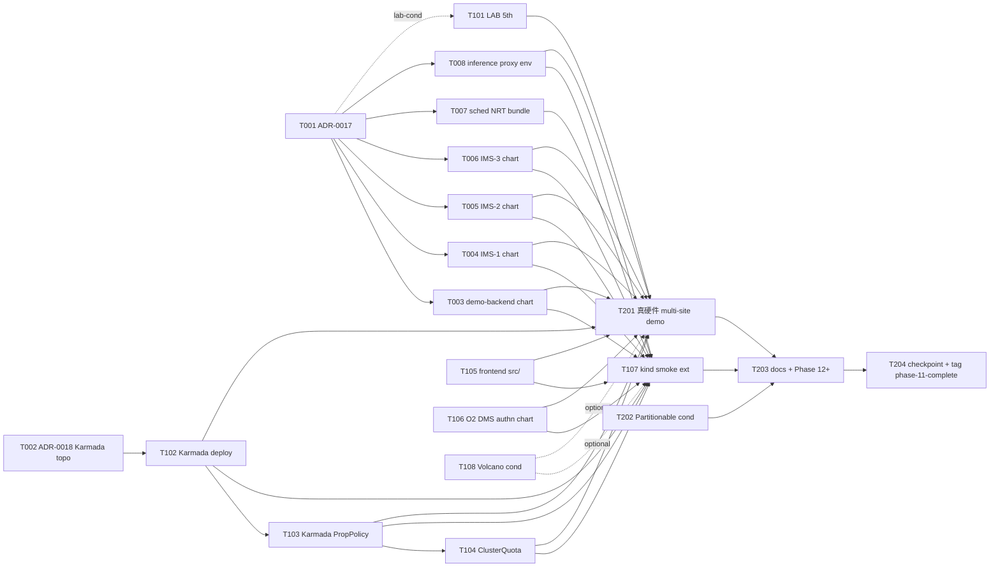

# Phase 11 Plan — M5 真生产化 foundation closer · chart packaging spine 闭环 + Karmada propagation 第一波 production-grade + Frontend src/ extension + LAB 5th attempt + 真 multi-cluster / multi-site demo 打磨

> **Goal**: Phase 11 opens the **M5 真生产化 foundation** milestone (arch
> §1.3 phase roadmap successor to M4 工程化对外 closed by Phase 10) along
> three co-equal主线 + 三条子线: **主线 1 = chart packaging spine 闭环**
> (Phase 10 6 module substrate landed without charts via P10-T-006 +
> T007 + T008 + T101 scope adaptation 1 → Phase 11 chart packaging +
> cmd/main.go controller-runtime wire 全 land 5 new chart + 4 cmd/main.go
> binary wire + 1 chart-only inference-operator env wire + 1 sched-plugin
> NRT bundle · closes Phase 10 chart-packaging gap surfaced via 3 deferred
> groups per checkpoint-phase10.md §4 Scope adaptation 1); **主线 2 =
> Karmada propagation 第一波 production-grade**(Phase 10 T103 + T104 ship
> substrate(authn validator interfaces + token-bucket rate algorithm) but
> Karmada control-plane deploy + PropagationPolicy + cross-cluster
> informer aggregation deferred → Phase 11 真 host cluster + 2 member kind
> cluster Karmada chart deploy + PropagationPolicy 第一波 land · 含
> ClusterQuota CRD cross-cluster usage 累计 per ADR-0014 §7 (b)+(c));
> **主线 3 = Frontend src/ Workload page extension 完整**(Phase 10 T105
> chat+ADR self-RFC ships `docs/api-contract.yaml` 3 GET fields substrate
> · frontend src/ + backend handler deferred → Phase 11 frontend React/TS
> source 端 ECharts + AntD 完整 surface 3 indicators (O2 DMS exposed
> badge + Quota usage progress bar + scaleHistory ECharts timeline) +
> backend handler bridge for 3 fields response)。子线 1 = Phase 10
> deferred items 全部 close(P10-fix-002 scheduler-plugin NRT CRD bundle +
> numaAffinity.enabled default flip back true via T007 · P10-T-106
> ProxyImage env var injection via T008 · P10-T-108 Volcano gang-
> scheduling 2nd attempt conditional via T108 · P10-T-202 Partitionable
> Devices conditional re-eval at W3 entry via T202)· 子线 2 = ADR-0011 §3
> lab gating 5th attempt(T101 Source.RealAscend body · ADR-0016 §2
> Decision B trigger 1 W1 entry meeting re-eval window — default-defer
> policy 是否 翻转 / 维持 / M5+ milestone reset)· 子线 3 = 真 multi-
> cluster / multi-site demo 打磨(T201 master-demo-multi-site.sh
> extension to P10-T-201 single-cluster master-demo · 加 Karmada
> propagation 端到端 + 2 member cluster 真切换 + Quota cross-cluster
> aggregation 演示 + cache singleton multi-instance failover 演示 ·
> synthetic ring fallback path 同 ADR-0016 §2 Decision C 模式 if T101 仍
> deferred)。kind smoke Phase 11 extension(T107)validates 全链 end-to-
> end including multi-cluster propagation。

> **Duration**: ~5-6 weeks calendar (W1 foundation 8 tasks: 2 ADRs + 4
> new chart packaging tasks (demo-backend + IMS-1 + IMS-2 + IMS-3) +
> sched-plugin NRT CRD bundle + inference-operator chart env wire; W2
> polish + LAB-conditional + Karmada deploy + decision-gated + frontend
> + smoke 8 tasks: LAB 5th + Karmada control deploy + Karmada
> PropagationPolicy + ClusterQuota CRD + Frontend src/ + O2 DMS authn
> chart + kind smoke + Volcano conditional; W3 closer 4 tasks: 真
> multi-site demo 打磨 + Partitionable Devices conditional + docs 大整理
> + Phase 12+ 前瞻 + checkpoint+tag).

> **Phase 11 uncertainty profile**: medium-high — chart packaging × 5
> modules cross-cutting risk(demo-backend + 3 IMS + inference-operator
> chart edit · each chart 含 Chart.yaml + values.yaml + 5-8 templates +
> 1 Dockerfile + envtest harness · 单 chart 估 1-1.5d · 总 5-7.5d ·
> 共享 lib chart 抽象不在 Phase 11 scope · 各 chart 独立)+ Karmada
> deployment ops cost surface(host cluster + 2 member kind cluster +
> Karmada chart deploy + PropagationPolicy 测试 + cross-cluster informer
> 路径 真 fan-out · Phase 10 仅 single Karmada control + 1 member kind ·
> Phase 11 真 2 member 是 ops cost surface)+ LAB 5th attempt(4 prior
> defer history · default-defer policy 与 M5 milestone naming 联动
> escalation · W1 entry meeting decision point per ADR-0016 §2 Decision B
> trigger 1)+ Frontend src/ project scope mid-discovery(Phase 6 frontend
> src/ 现有 8 pages · Workload page 是 1 page · 加 3 indicators 估
> 1-1.5d · 但 React/TS DOM + ECharts 调用 + AntD 组件 + react-query
> state 真集成 cost surface 可能 偏移估算)+ chart packaging × Karmada
> PropagationPolicy interaction(每 chart 是否需 PropagationPolicy +
> ClusterPropagationPolicy 区分 · MS CRD + ms-instance resource
> propagation 路径 · 测试 cost)+ 6th lab carry posture(若 T101 仍
> defer · 是否 Phase 12+ default-flip · M5+ milestone reset · ADR-0016 §2
> Decision B 3 triggers 跨度)。

> **Prereq**: Phase 10 tag `phase-10-complete` (HEAD of dev post-CI gate
> · last commit of any P10-fix-NNN series per memory
> `feedback_post_tag_ci_gate.md` · 2026-05-21 post `phase-10-complete`
> tag at `04cc009` + P10-fix-001 `7203587` + P10-fix-002 `3729bb3` +
> retroactive devlog `6b8a9db`). ADR-0011 (NPU 动态切分 + Source 接口
> + lab gating policy · 4 prior carry count + 5th attempt at T101),
> ADR-0015 (demo-backend cache strategy · §3.3 singleton substrate
> landed via P10-T-006 · T003 chart packaging 落地), ADR-0016 (lab
> onboarding + Phase 11+ outlook · §2 Decision B 3 re-eval triggers ·
> §3 Stream 1-8 enumeration source-of-truth · §4 Open questions (a) (b)
> (c) decided in T001 ADR-0017 · §3 Stream 1 multi-site + Stream 4 P99
> SLA + Stream 5 OIDC IdP 完整 = Spine A 真生产化 source-of-truth),
> ADR-0003 v2 (IMS 3 controller body landed via P10-T-007 + T008 + T101
> · chart deferred → Phase 11 T004 + T005 + T006), ADR-0010 (scheduler-
> plugin baseline + NumaAffinity wrap · §3 known-issues #12 RESOLVED at
> P10-T-005 · §7 Volcano 2nd defer at P10-T-108 → T108 W2 entry 2nd
> attempt re-eval), ADR-0013 (O2 DMS Adapter · §6 authn validator
> substrate landed via P10-T-103 · chart wiring deferred → Phase 11
> T106 · Karmada propagation deferred → T102+T103), ADR-0014 (Multi-
> tenant Quota · §7 (b) ClusterQuota deferred → T104 · §7 (c) Karmada
> cross-cluster Quota deferred → T103+T104), `docs/checkpoint-phase10.md`
> §6 Phase 11+ handoff brief (9 chart packaging primary work + 8
> candidate streams · most-actionable 排序 = Phase 11 task chain primary
> reference), `docs/research/k8s-partitionable-devices-spike.md` (KEP-
> 4815 status · Phase 11 W3 T202 entry re-WebFetch), `docs/research/
> volcano-gang-scheduling-spike.md` (路径 A · T108 W2 entry 2nd attempt
> decision input), arch §1.3 Phase 路线图 (M5 真生产化 foundation =
> Phase 11), arch §13 review-table (Phase 10 rows landed · Phase 11
> row 待 T204 promote). Root CLAUDE.md §14 (devlog + module DESIGN.md)
> applies; `docs/agent-coordination.md` §0a.10-12 (plan/execute split +
> strict-per-task verify + push protocol) applies to every Phase 11
> task. Per memory `feedback_plan_vs_execute_session_split.md`, this
> plan commits + stops; T001 execution is a separate session.

---

## 1. Scope summary

Phase 11 closes all 9 Phase 10 checkpoint §6 chart packaging primary
work items + opens 4 net-new Spine A 真生产化 foundation streams + 4
stay deferred to Phase 12+ per arch §13 carry-forward conditions.
ADR-0016 §3 Stream 1-8 enumeration:Phase 11 advances Stream 1 (multi-
site) foundation + Stream 5 (OIDC IdP) wiring foundation · defers
Stream 2 + 3 + 4 + 6 + 7 + 8 to Phase 12+ per most-actionable +
uncertainty trade-off。

| Stream                                                                          | Phase 10 state                                                                                                                                                       | Phase 11 delivery                                                                                                                                                                                                                                                                            |
|---------------------------------------------------------------------------------|----------------------------------------------------------------------------------------------------------------------------------------------------------------------|----------------------------------------------------------------------------------------------------------------------------------------------------------------------------------------------------------------------------------------------------------------------------------------------|
| **chart packaging spine 闭环**(checkpoint-phase10 §6 #1-#5 · Spine A 主线 1)| 6 module substrate landed without charts(demo-backend cache singleton + 3 IMS controller body + inference-operator EffectiveProxyImage helper)· scope adaptation 1 surfaced via P10-T-006+T007+T008+T101 devlogs | T003 demo-backend chart + cmd/main.go controller-runtime leader-elect wire · T004 IMS-1 chart + cmd/main.go ctrl.Reconciler wire · T005 IMS-2 chart + cmd/main.go · T006 IMS-3 chart + cmd/main.go(含 Redfish/IPMI client + Secret 解析)· T008 inference-operator chart DEFAULT_PROXY_IMAGE env wire     |
| **scheduler-plugin NRT CRD bundle**(P10-fix-002 carry · 子线 1)              | NumaAffinity wrap substrate landed at P10-T-005 · `numaAffinity.enabled: true` default 引发 phase6 install fail · P10-fix-002 revert default false · NRT CRD bundling deferred Phase 11+ | T007 NRT CRD bundle as subchart(noderesourcetopology-api)或 vendored CRD YAML + numaAffinity.enabled default true 重新 ON · phase10/assert.sh T107-A1 runtime enable verify 恢复                                                                                                       |
| **Karmada propagation 第一波 production-grade**(ADR-0013 §6 + ADR-0014 §7 carry · Spine A 主线 2 · Stream 1 foundation)| Phase 10 T103 + T104 ship substrate(authn validator + token-bucket)· Karmada propagation control-plane + PropagationPolicy deferred Phase 11+                  | T002 ADR-0018 Karmada control-plane deployment topology(host + 2 member kind cluster minimum)· T102 Karmada control-plane chart deploy + member cluster bootstrap + cluster register · T103 Karmada PropagationPolicy 第一波 + cross-cluster informer aggregation(O2 DMS + Quota propagation)· T104 Quota ClusterQuota CRD + Karmada cross-cluster usage 累计 |
| **Frontend src/ Workload page extension 完整**(P10-T-105 substrate carry · Spine A 主线 3)| api-contract.yaml 3 GET fields landed via P10-T-105 chat+ADR self-RFC · frontend src/ + backend handler deferred Phase 11+                                       | T105 frontend src/ React/TS Workload page extension · 3 indicators surface(O2 DMS exposed badge + Quota usage progress bar + scaleHistory ECharts timeline)· backend handler bridge for 3 fields response · 1-2 sanity tests                                                                |
| **inference-operator chart DEFAULT_PROXY_IMAGE env wire**(P10-T-106 substrate carry · 子线 1)| EffectiveProxyImage helper substrate + `defaults.proxyImage` chart values field landed via P10-T-106 · cmd/main.go controller.DefaultProxyImage env 注入 deferred | T008 inference-operator chart template add env var injection `DEFAULT_PROXY_IMAGE` from chart values · cmd/main.go `os.Getenv("DEFAULT_PROXY_IMAGE")` 设 controller.DefaultProxyImage at startup                                                                                       |
| **O2 DMS authn chart wiring**(P10-T-103 substrate carry · Stream 5 foundation)   | 3 Validator interface impls(Placeholder/OIDC/TokenReview)+ middleware substrate landed · chart wiring 未 land · OIDC issuer config + K8s SA secret 部署位置未定        | T106 O2 DMS authn chart wiring · OIDC issuer config Secret + K8s SA TokenReview client-go wire + chart values `oidc.issuerUrl` + `oidc.audience` + `tokenReview.serviceAccountName` 引入 + middleware Wire in cmd/main.go                                                                  |
| **真 multi-cluster / multi-site demo 打磨**(P10-T-201 single-cluster master-demo 延伸 · Spine A 主线 2 surface)| Phase 10 T201 master-demo.sh 12-step orchestrator ships synthetic ring fallback path(per ADR-0016 §2 Decision C)· 80% landed deliverable · 单 kind cluster only       | T201 master-demo-multi-site.sh extension · Karmada control + 2 member kind cluster 拓扑 + Karmada propagation 端到端 + Quota cross-cluster aggregation 演示 + cache singleton multi-instance failover 演示 + synthetic ring fallback path 同 ADR-0016 §2 Decision C if T101 仍 deferred                |
| **LAB 5th attempt + 5th carry posture**(ADR-0011 §3 carry tally + ADR-0016 §2 Decision B trigger 1 · 子线 2)| 4 prior defer history(P7-T-101 1st · P8-T-105 2nd · P9-T-106 3rd · P10-T-102 4th)· ADR-0016 §2 Decision B 3 re-eval triggers codified · trigger 1 W1 entry             | T101 [LAB-CONDITIONAL · 5th attempt] Source.RealAscend body(W1 entry meeting decision · default-defer 维持 5th carry · or land if lab signal · ADR-0011 §3 carry tally 5th entry · ADR-0016 §2 Decision B re-eval per trigger 1)                                                            |
| **kind smoke E2E Phase 11 extension**(子线 3 validates 全链)                | Phase 10 phase10/ folder ships 2 active asserts + 3+ SKIPPED conditionals · chart packaging items SKIPPED                                                          | T107 install + assert.sh 加 10+ assertions covering: (a) demo-backend chart + Lease leader-elect (b) IMS-1/2/3 chart install (c) scheduler-plugin NRT bundle + NumaAffinity enabled (d) inference-operator chart + DEFAULT_PROXY_IMAGE env injection (e) Karmada propagation chain (f) Quota cluster-scope aggregation (g) frontend src/ smoke (h) Volcano conditional (i) Partitionable Devices conditional |
| **Volcano gang-scheduling 2nd attempt**(P10-T-108 2nd defer carry · 子线 1 conditional)| P10-T-108 2nd defer per default policy(no training-job demo signal · Phase 11+ carry per ADR-0010 §7)                                                            | T108 [DECISION-GATED · 2nd attempt or 3rd defer] · 若 W2 entry user signal "Phase 11 training-job demo 需要 gang" → install Volcano v1.10.x+ via独立 helm + ADR-0010 §7 status flip · 否则 default = 3rd defer Phase 12+(同 lab gating spirit)               |
| **Partitionable Devices Beta re-eval**(P10-T-202 defer carry · 子线 1 conditional)| P10-T-202 defer per K8s 1.34 baseline not unlocking · KEP-4815 Beta only in 1.36                                                                                  | T202 [DECISION-GATED · re-eval at W3 entry] · 若 Phase 11 W3 baseline bumps 1.34 → 1.36 AND KEP-4815 GA per re-WebFetch → land partition-aware allocator + ADR-0009 §4 path A migration · 否则 defer Phase 12+(doc-only refresh)                                                          |
| **项目级 docs 大整理 + Phase 12+ 前瞻**(M5 closer 子线 3 · NEW Phase 11)      | docs sprawl 16 ADR + 17 phase docs + 10 module DESIGN.md · arch §13 review-table Phase 11 row 待 promote · Go code v1 schema migration cohort 待 plan                | T203 docs 大整理: arch §13 promote Phase 11 rows "landed" + Phase 12+ candidate streams enumeration + Go code v1 schema migration cohort plan(per P10-fix-001 carry · v1beta1 → v1 ResourceSlice schema · cross 5 modules + lister regen + envtest update)+ M5 真生产化 foundation narrative + ADR cross-ref audit + devlog index update + Phase 1-11 timeline narrative |

**Out of scope (Phase 12+)**:
- **Live migration of HCCL ranks / per-Pod RDMA bandwidth quota** — CNI-
  level gaps per `docs/cni-hccl-research.md` §5 · Phase 8 重启切片
  sidesteps · Phase 12+ if at all per ADR-0016 §3 Stream 2
- **Real fabric switch integration**(SONiC / Cumulus / Arista API)—
  真硬件 switch SDK Phase 12+ on real switching gear · per ADR-0016 §3
  Stream 3
- **vLLM PD 分离 production-grade SLA**(P99 latency + multi-tenant
  isolation guarantees)— need user SLO input · Phase 12+ if production
  deployment signal · per ADR-0016 §3 Stream 4
- **完整 OIDC IdP 部署**(Keycloak / Dex)— Phase 11 ships OIDC client
  + TokenReview chart wiring substrate only(T106)· 甲方 IdP signal
  未到 · 完整 IdP deployment Phase 12+ · per ADR-0016 §3 Stream 5 part 2
- **K8s 1.34 → 1.36 baseline bump**(Stream 6 trigger condition ·
  Partitionable Devices GA prereq)— P10-T-003 lockstep bumped to
  1.34.3 · Phase 11 W3 T202 entry re-WebFetch · 若 KEP-4815 仍 Beta +
  1.36 not GA → defer Phase 12+ · per ADR-0016 §3 Stream 6
- **O2 IMS R1 v05.00+ spec migration**(if breaking)— Phase 10 T103 W1
  evaluated v05.00 not released · v04.00 baseline retained · Phase 12+
  if v05.00 release + breaking · per ADR-0016 §3 Stream 8
- **Go code v1 ResourceSlice schema cohort migration**(per P10-fix-001
  carry)— 5 modules cross-cutting · lister regen + envtest update ·
  Phase 12+ cohort task per T203 plan(per K8s 1.35/1.36 forward ·
  v1beta1 deprecated in 1.35 + 1.36 可能 remove · 全栈 v1 client
  migration prereq for ≥1.36 baseline)
- **HCCL live migration kernel/driver support** — depends on Huawei
  vendor roadmap · Phase 12+ if signal aligned · per ADR-0016 §3
  Stream 2
- **Karmada control-plane HA + 真 多机房 multi-site deployment**(>2
  member cluster · 跨真物理机房 / 跨 region)— Phase 11 ships Karmada
  control + 2 member kind cluster minimum(单机模拟 multi-site)· 真
  多机房 Phase 12+

---

## 2. Task package overview (20 main + 4 Frontend UX sub-track = 24 tasks)

```
W1 Foundation (8 tasks · 2 ADRs + 4 new chart packaging + 1 NRT CRD bundle + 1 chart env wire)
├── P11-T-001  ADR-0017 — Phase 11 entry decisions(per ADR-0016 §4 Open questions (a)+(b)+(c) decision · Spine A 真生产化 foundation + M5 真生产化 foundation milestone naming + lab gating default-defer 5th attempt + chart packaging spine 优先级)
├── P11-T-002  ADR-0018 — Karmada control-plane deployment topology(host cluster + 2 member kind cluster minimum · Karmada chart deploy outline · namespace + RBAC · per ADR-0016 §3 Stream 1 foundation)
├── P11-T-003  demo-backend helm chart 创建 + cmd/main.go controller-runtime leader-elect wire(per checkpoint-phase10 §6 #1 · ADR-0015 §3.3 singleton substrate · Lease leader-elect callbacks + replicaCount 2 default + Lease RBAC + readinessProbe)
├── P11-T-004  IMS-1 node-lifecycle-operator helm chart + cmd/main.go ctrl.Reconciler wire(per checkpoint-phase10 §6 #2 · P10-T-007 controller body 已 land · chart + Dockerfile + RBAC + envtest 同期 land)
├── P11-T-005  IMS-2 software-mgmt-operator helm chart + cmd/main.go(per checkpoint-phase10 §6 #3 · 同 T004 pattern · P10-T-008 controller body 已 land)
├── P11-T-006  IMS-3 bare-metal-provisioning-operator helm chart + cmd/main.go(per checkpoint-phase10 §6 #4 · 同 T004 pattern · 含 Redfish/IPMI client + Secret 解析 username/password · P10-T-101 controller body 已 land)
├── P11-T-007  scheduler-plugin NRT CRD bundle + numaAffinity.enabled default flip back true(P10-fix-002 carry close · noderesourcetopology-api subchart 或 vendored CRD YAML · phase10/assert.sh T107-A1 runtime enable verify 恢复)
└── P11-T-008  inference-operator chart DEFAULT_PROXY_IMAGE env wire(per checkpoint-phase10 §6 #5 · P10-T-106 substrate · chart template add env var injection + cmd/main.go `os.Getenv` 设 `controller.DefaultProxyImage` at startup)

W2 Polish + LAB-conditional + Karmada deploy + Karmada propagation + Frontend + smoke + Volcano (8 tasks)
├── P11-T-101  [LAB-CONDITIONAL · 5th attempt] Source.RealAscend body(P10-T-102 carry · ADR-0011 §3 carry tally 5th entry · ADR-0016 §2 Decision B trigger 1 W1 entry meeting re-eval window · 与 T001 ADR-0017 §2 Decision C lab gating posture 联动)
├── P11-T-102  Karmada control-plane chart deploy + 2 member kind cluster bootstrap(per T002 ADR-0018 · Karmada chart deploy + cluster register + RBAC + cross-cluster informer wiring foundation)
├── P11-T-103  Karmada PropagationPolicy 第一波 + cross-cluster informer aggregation(O2 DMS + Quota propagation per ADR-0013 §6 + ADR-0014 §7 · ms-instance / pool resource Propagation · cross-cluster informer 路径 fan-out)
├── P11-T-104  Quota ClusterQuota CRD + Karmada cross-cluster usage 累计(per ADR-0014 §7 (b)+(c) · ClusterQuota cluster-scope · Karmada cross-cluster usage view aggregation · admission webhook extension)
├── P11-T-105  Frontend src/ Workload page extension(per P10-T-105 api-contract substrate · React/TS Workload page + 3 indicators(O2 DMS exposed badge + Quota usage progress bar + scaleHistory ECharts timeline)+ backend handler bridge for 3 fields response)
├── P11-T-106  O2 DMS authn chart wiring(per P10-T-103 substrate · OIDC issuer config Secret + K8s SA TokenReview chart values + middleware Wire in cmd/main.go · Stream 5 foundation · OIDC client only · 完整 IdP 部署 Phase 12+)
├── P11-T-107  kind smoke E2E Phase 11 extension(phase11/ folder · 10+ assertions covering chart packaging + Karmada propagation + frontend src/ smoke + Volcano conditional + Partitionable Devices conditional)
└── P11-T-108  [DECISION-GATED · 2nd attempt] Volcano gang-scheduling install body(P10-T-108 2nd defer carry · W2 entry decision · default = 3rd defer Phase 12+ · same gating model as lab carry policy)

W3 Closer + Milestone Closer (4 tasks)
├── P11-T-201  真硬件 multi-cluster / multi-site demo 打磨(master-demo-multi-site.sh extension to P10-T-201 · Karmada propagation 端到端 + 2 member cluster 真切换 + Quota cross-cluster aggregation 演示 + cache singleton multi-instance failover 演示 · synthetic ring fallback path if T101 仍 deferred per ADR-0016 §2 Decision C)
├── P11-T-202  [DECISION-GATED · re-eval at W3 entry] Partitionable Devices Beta + partition-aware allocator(P10-T-202 carry · gated on K8s 1.36+ baseline + KEP-4815 GA confirmation · re-WebFetch at W3 entry)
├── P11-T-203  项目级 docs 大整理 + Phase 12+ 前瞻 + Go code v1 schema migration cohort plan(arch §13 review-table promote Phase 11 rows + Phase 12+ candidate streams enumeration · Go code v1 schema cohort plan per P10-fix-001 carry · M5 真生产化 foundation narrative · ADR cross-ref audit · devlog index)
└── P11-T-204  Phase 11 checkpoint + tag phase-11-complete + M5 真生产化 foundation milestone CLOSER announcement
```

Mermaid:



**Subagent parallelisation candidates** (per §0a.11 strict-verify — ONE
subagent at a time, main agent verifies before next is dispatched;
parallelisation is OPPORTUNISTIC across natural module boundaries
when user gives explicit "batch" cue):
- T001 + T002 (2 docs-only ADRs) standalone — no code dependency · 不同
  文档可 parallel if user 显式 batch
- T003 / T004 / T005 / T006 / T008 (5 chart packaging · 4 不同 module
  new chart + 1 chart existing-chart edit) — different modules · 不交叉
  · 各 chart 独立 chart skeleton · 可 parallel if user 显式 batch ·
  default serial main agent verify per §0a.11
- T007 (scheduler-plugin NRT bundle · operators 同模块 P10-T-005 wrap
  body 已 land) standalone subchart + values · 可 parallel with chart
  packaging tasks if user batch
- T101 (LAB-CONDITIONAL · 5th attempt) MUST main-agent serial(lab
  signal 涉及 user chat + ADR-0011 §3 carry tally 5th entry update ·
  不能 subagent · 与 T001 §2 Decision C lab gating posture 联动)
- T102 (Karmada control-plane deploy) MUST serial after T002 ADR-0018
  + T007 (sched plugin NRT bundle 与 cluster baseline 联动)· cross-
  module ops 工作 · main agent serial
- T103 (Karmada PropagationPolicy) MUST serial after T102(Karmada
  control-plane wire 依赖)· cross-module(O2 DMS + Quota + Karmada
  control)· serial main agent
- T104 (Quota ClusterQuota CRD) MUST serial after T103(Karmada
  control-plane wire 依赖)· cross-module(inference-operator + Karmada
  + admission webhook)· serial main agent
- T105 (Frontend src/) standalone frontend module · 可 parallel with
  T103/T104 if user batch · React/TS DOM + ECharts 调用 + AntD 组件
  独立
- T106 (O2 DMS authn chart) standalone · 可 parallel with T105 if user
  batch
- T107 (kind smoke ext) MUST 在 T002-T108 都 land 后 run(全
  assertions 来源都得到 · serial)
- T108 (DECISION-GATED Volcano) standalone 模块 · 但同 T101 lab-cond
  spirit · main agent serial
- T201 (真 multi-site demo 打磨) MUST 在 T101 + T102-T106 + T008 都 ready
  后 run · cross-module integration · serial main agent
- T202 (DECISION-GATED Partitionable Devices) gated on W3 entry
  re-WebFetch · cross-module if landed · serial main agent
- T203 / T204 docs-only · serial main agent

**Decision-gated tracks**:

- **T108 Volcano gang-scheduling 2nd attempt** (W2 entry decision · user
  signal · same gating model as P10-T-108 / lab carry):
  - User signal "Phase 11 training-job demo 需要 gang" → install
    Volcano binary 路径 A · ADR-0010 §7 status flip · 1-2d 工作量
  - User signal "Phase 11 仍只 inference / multi-cluster · 不引入训练"
    → 3rd defer Phase 12+ · 路径 C · 0d 工作量
  - 无明确信号 (default) → 3rd defer Phase 12+ · 同 Phase 9/10 default
    policy · T203 docs note "policy posture 重评 trigger 与 lab gating
    similar — 3 consecutive defer 后 default 翻转?"
  - T108 deferred → T107 kind smoke Volcano section skipped · 无下游
    cascade

- **T202 Partitionable Devices Beta re-eval** (W3 entry decision · K8s
  baseline + KEP-4815 GA cascade):
  - W3 entry re-WebFetch confirms K8s 1.36+ released + KEP-4815 GA →
    Phase 11 W3 bump baseline 1.34 → 1.36 + partition-aware allocator
    + npu-dra-driver §4 path A migration + 2 sanity tests + ADR-0009 §4
    status flip(此路径需 W3 entry 增 baseline bump 三件套 part 1+2+3
    rerun · cross 7+ modules · large W3 scope · default reject if
    KEP-4815 still Beta or 1.36 not GA)
  - 否则 defer Phase 12+ · doc-only refresh in T203 · cascade Stream 6
    posture

**LAB-conditional track (T101 · 5th attempt)**:
- Triggered ONLY when user signals "lab access available" at W1 entry
  meeting in chat — same gating as P7-T-101 / P8-T-105 / P9-T-106 /
  P10-T-102 per ADR-0011 §3 default policy(5th attempt · 5th carry
  tally update)
- Phase 11 ships without this if lab not available → T101 moves to
  Phase 12+ backlog(5th carry · ADR-0011 §3 carry tally update + 显
  著 forward note in checkpoint-phase11.md indicating lab-gating policy
  posture re-eval needed per ADR-0016 §2 Decision B trigger 1 already
  fired at W1 entry · trigger 3 M5+ milestone reset 可能在 Phase 12+
  起草时触发)
- T101 deferred → T201 真硬件 multi-site demo 打磨 fallback path:
  synthetic ring fixture 继续演示 multi-cluster + multi-pool flow ·
  但不挂 "真硬件" 标签 · arch §1.3 Phase 11 row 实质 deliverable
  80% landed(20% 缺真硬件 stamp)· checkpoint § Phase 11 row 标
  "with synthetic ring fallback + Karmada multi-cluster propagation 真
  2 member cluster"
- T001 ADR-0017 §2 Decision C 显式 codify 5th carry posture(default-
  defer 维持 vs flip to default-light-up vs M5+ milestone reset trigger
  3)

**§0a.5 chat+ADR self-RFC pattern continues** — Phase 11 introduces
2 ADR additions(ADR-0017 entry decisions · ADR-0018 Karmada deployment
topology)+ several existing-ADR small edits(ADR-0011 §3 lab gating
count update via T101 devlog · ADR-0013 §6 status flip via T103/T106 ·
ADR-0014 §7 status flip via T103/T104 · ADR-0003 v2 IMS chart status
flip via T004+T005+T006 · ADR-0009 §4 partition-aware allocator status
via T202 · ADR-0010 §3 NumaAffinity NRT bundle flip via T007 · ADR-
0010 §7 Volcano status flip via T108 if landed · ADR-0015 §3.3 chart
status flip via T003 · ADR-0016 §2 Decision B trigger 1 fire via T101
W1 entry meeting). T105 frontend src/ does NOT need self-RFC(api-
contract.yaml 不动 · 仅 frontend src/ + backend handler 落地)。

---

## 3. W1 task packages

### P11-T-001 ADR-0017 — Phase 11 entry decisions

Owner: docs (no code).

**Allowed Paths**:
- `docs/adr/0017-phase-11-entry-decisions.md` (new — §1 Context(Phase
  10 closer + M4 milestone closed · ADR-0016 §4 Open questions (a) (b)
  (c) carried forward to T001 decision · checkpoint-phase10 §6 Phase
  11+ handoff brief 9 chart packaging primary work + 8 candidate
  streams)· §2 Decision A: Phase 11 spine = chart packaging spine
  闭环 + Karmada propagation 第一波 production-grade + Frontend src/
  extension(Spine A 真生产化 foundation subset · 不含 完整 OIDC IdP
  部署 + P99 SLA + 真多机房 + Stream 2-4/6-8 · 留 Phase 12+ multi-
  phase 拆)· §2 Decision B: milestone = **M5 真生产化 foundation**
  (foundation 明示 不 over-promise · Phase 11 不 close 完整 production
  hardening · 留 Phase 12+ 继续 production hardening)· §2 Decision C:
  lab gating policy posture = default-defer 维持 5th attempt(ADR-
  0011 §3 default policy unchanged · ADR-0016 §2 Decision B trigger 1
  W1 entry re-eval fires at Phase 11 W1 entry meeting · trigger 3 M5+
  milestone reset 触发条件保留为 Phase 12+ 起草 if 5th 仍 defer)·
  §2 Decision D: chart packaging spine 优先级排序(T003 demo-backend
  first · T004/T005/T006 3 IMS chart parallel-eligible · T007 sched-
  plugin NRT bundle 独立 sub-chart 工作 · T008 inference-operator chart
  edit 最简单 last)· §3 Phase 11 scope detailed enumeration(20 tasks
  per §2 task package overview cross-ref)· §4 Open questions:
  (a) Karmada control-plane HA posture(Phase 11 ships single Karmada
  control + 2 member · Phase 12+ HA · or stagger?)· (b) Frontend src/
  Workload page extension 是否需要 i18n 引入(Phase 6 frontend 已 ship
  i18n basics · T105 3 indicators 是否做 i18n 还是 hard-code en-US)·
  (c) demo-backend chart Lease leader-elect Pod 数(Phase 10 ADR-0015
  §3.3 default 2 · Phase 11 chart values default 仍 2 · 在 Phase 12+
  production 是否 3+?)· §5 引用(ADR-0011 §3 / ADR-0015 §3.3 / ADR-
  0016 §2-§4 / checkpoint-phase10 §6 / arch §1.3 Phase 11 row / arch
  §13 review-table))
- `docs/architecture.md` (small edit — §13 review-table Phase 11 row
  "M5 真生产化 foundation" 加 "in flight via T001-T204"; §1.3 phase
  roadmap unchanged; §5.1 演示后端 §3.2 数据源抽象 cross-ref ADR-0017
  §2 Decision D chart packaging spine 优先级)
- `docs/devlog/phase-11-t001.md`

Acceptance:
- ADR §1 Context: cites Phase 10 closer + M4 milestone + ADR-0016 §4
  Open questions + checkpoint-phase10 §6 Phase 11+ handoff brief
- §2 Decision A: spine = chart packaging spine + Karmada propagation
  第一波 + Frontend src/ · 不含 P99 SLA / 完整 IdP / 真多机房
- §2 Decision B: milestone = M5 真生产化 foundation(foundation 明示)
- §2 Decision C: lab gating default-defer 维持 5th attempt + ADR-0016
  §2 Decision B trigger 1 已 fire at W1 entry · trigger 3 保留 Phase 12+
- §2 Decision D: chart packaging spine 优先级排序(T003 first · T004-
  T006 parallel-eligible · T007/T008 独立)
- §3 Phase 11 scope detailed enumeration: 20 tasks cross-ref §2 task
  package overview
- §4 Open questions: 3 open(Karmada HA · Frontend i18n · Lease Pod 数)
- §5 引用 full list

Dependencies: none beyond `phase-10-complete`.

Estimated effort: 0.5d.

---

### P11-T-002 ADR-0018 — Karmada control-plane deployment topology

Owner: docs (no code).

**Allowed Paths**:
- `docs/adr/0018-karmada-deployment-topology.md` (new — §1 Context
  (Phase 10 T103 + T104 ship substrate · Karmada propagation 控制
  plane + PropagationPolicy + cross-cluster informer aggregation
  deferred Phase 11+ · ADR-0016 §3 Stream 1 multi-site foundation
  source-of-truth · checkpoint-phase10 §6 #7 Karmada propagation 第一波
  primary work)· §2 Decision A: Phase 11 topology = 1 host cluster
  (Karmada control-plane)+ 2 member kind cluster minimum · 单机模拟
  multi-site · 不引入真物理 multi-site(Phase 12+ if signal)· §2
  Decision B: Karmada chart = upstream Karmada operator chart(
  github.com/karmada-io/karmada/charts)+ 自研 PropagationPolicy
  selector templates · Karmada control-plane namespace `karmada-system`
  · §2 Decision C: member cluster bootstrap = `kind create cluster
  --name=member1` + `--name=member2` · Karmada `karmadactl join`
  for each member · cluster role 默认 push mode(per Karmada doc)·
  §2 Decision D: cross-cluster informer aggregation = Karmada control-
  plane uses lifted-informer pattern · O2 DMS Adapter / Quota
  ClusterQuota informer 各自跨 cluster aggregation · §3 Phase 11
  delivery scope(T102 chart deploy + T103 PropagationPolicy 第一波 +
  T104 ClusterQuota cross-cluster aggregation)· §4 Open questions:
  (a) Karmada control-plane HA(Phase 11 ships single control plane ·
  Phase 12+ HA?)· (b) PropagationPolicy granularity(per-CRD vs
  per-resource selector)· (c) cross-cluster RBAC + Secret 跨 cluster
  传递(Phase 11 ships static · Phase 12+ Vault/external secret)·
  §5 引用(ADR-0013 §6 / ADR-0014 §7 / ADR-0016 §3 Stream 1 /
  checkpoint-phase10 §6 #7 / arch §9.3 Karmada propagation /
  `docs/research/karmada-multi-site-spike.md` if exists · 不存在则
  T002 起手 spike 一次记 ADR §1.2 substantiation)
- `docs/architecture.md` (small edit — §9.3 Karmada propagation row
  cross-ref ADR-0018 + §13 review-table Phase 11 Karmada row "in
  flight via T002/T102/T103/T104")
- `docs/adr/0013-o2-dms-adapter.md` (small edit — §6 forward note
  Karmada propagation cross-ref ADR-0018 §2 Decision B)
- `docs/adr/0014-multi-tenant-quota.md` (small edit — §7 forward note
  Karmada cross-cluster Quota cross-ref ADR-0018 §2 Decision D)
- `docs/devlog/phase-11-t002.md`

Acceptance:
- ADR §1 Context: cites ADR-0016 §3 Stream 1 + checkpoint-phase10 §6 #7
- §2 Decision A: topology 1 host + 2 member kind cluster minimum
- §2 Decision B: Karmada chart = upstream + PropagationPolicy selector
  自研 templates
- §2 Decision C: member cluster bootstrap = kind + karmadactl join
- §2 Decision D: cross-cluster informer aggregation pattern
- §3 Phase 11 delivery scope: T102+T103+T104 cross-ref
- §4 Open questions: 3 open
- §5 引用 full list
- ADR-0013 + ADR-0014 cross-ref update
- arch §9.3 + §13 cross-ref

Dependencies: none beyond `phase-10-complete`. T002 can run in parallel
with T001 per §0a.11 (docs-only · main agent verifies separately).

Estimated effort: 0.5d.

---

### P11-T-003 demo-backend helm chart 创建 + cmd/main.go controller-runtime leader-elect wire

Owner: backend (cross-module — backend module ownership · 不动 operators).

**Allowed Paths**:
- `deploy/helm-charts/demo-backend/Chart.yaml` (new)
- `deploy/helm-charts/demo-backend/values.yaml` (new)
- `deploy/helm-charts/demo-backend/templates/_helpers.tpl` (new)
- `deploy/helm-charts/demo-backend/templates/deployment.yaml` (new)
- `deploy/helm-charts/demo-backend/templates/service.yaml` (new)
- `deploy/helm-charts/demo-backend/templates/configmap.yaml` (new)
- `deploy/helm-charts/demo-backend/templates/serviceaccount.yaml` (new)
- `deploy/helm-charts/demo-backend/templates/rbac.yaml` (new — Lease
  RBAC for leader-elect)
- `deploy/helm-charts/demo-backend/templates/servicemonitor.yaml` (new
  — Prometheus scrape per ADR-0015 §3.3 3 metrics)
- `deploy/helm-charts/demo-backend/.helmignore` (new)
- `backend/cmd/main.go` (existing edit — controller-runtime leader-
  elect wire · 调 `pkg/cache/singleton.Singleton.OnLeaseAcquired` /
  `OnLeaseLost` callbacks per ADR-0015 §3.3 Decision B · LeaseDuration
  15s + RenewDeadline 10s + RetryPeriod 2s defaults)
- `backend/Dockerfile` (existing edit — confirm multi-stage + COPY
  binary path · 无重大改动)
- `backend/docs/cache.md` (new section §3 — chart wiring + Lease RBAC
  + leader-elect Pod lifecycle)
- `docs/architecture.md` (small edit — §5.1 演示后端 cache section
  add chart packaging note)
- `docs/adr/0015-demo-backend-cache-strategy.md` (small edit — §3.3
  status flip "Phase 11 T003 chart packaging landed")
- `docs/devlog/phase-11-t003.md`

Acceptance:
- `helm lint --strict deploy/helm-charts/demo-backend/` clean
- `helm install demo-backend deploy/helm-charts/demo-backend --dry-run
  --debug` validates(server-side dry-run)
- `helm template` output 验证:Lease RBAC YAML 含 `coordination.k8s.io/
  leases` resource verbs `get` + `create` + `update` + `delete`
- `helm template` output 验证:Service ClusterIP / NodePort flag from
  values.yaml · deployment replicaCount default = 2 + readinessProbe
  on `/healthz` + livenessProbe on `/livez`
- `helm template` output 验证:ServiceMonitor 3 metrics scraping
  (`demo_backend_lease_holder` + `demo_backend_lease_renewals_total` +
  `demo_backend_cache_hit_ratio` per ADR-0015 §3.3 Decision D)
- `kind create cluster` + `helm install` smoke:demo-backend
  deployment Ready · Lease appears in `coordination.k8s.io/leases ·
  ocloud-system ns` · 1 Pod = leader · 1 Pod = follower(replicaCount
  2 default)
- backend/cmd/main.go: controller-runtime manager wired · Lease leader-
  elect started + callbacks 触发 OnLeaseAcquired / OnLeaseLost cache
  state machine · degraded read-only mode 路径 covered
- ADR-0015 §3.3 status: `Phase 11 W1 chart packaging landed at T003`
- backend/docs/cache.md §3 new chart wiring + lifecycle docs

Dependencies: `phase-10-complete` + P10-T-006 demo-backend cache
singleton substrate landed.

Estimated effort: 1-1.5d.

---

### P11-T-004 IMS-1 node-lifecycle-operator helm chart + cmd/main.go ctrl.Reconciler wire

Owner: operators (cross-module — node-lifecycle-operator only ·
controller-runtime ctrl.Reconciler wire path).

**Allowed Paths**:
- `deploy/helm-charts/node-lifecycle-operator/Chart.yaml` (new)
- `deploy/helm-charts/node-lifecycle-operator/values.yaml` (new)
- `deploy/helm-charts/node-lifecycle-operator/templates/*.yaml` (new
  — _helpers.tpl + deployment + service + configmap + serviceaccount +
  rbac + crd-install-hook · CRD 走 chart hook 模式 同 inference-
  operator existing pattern)
- `deploy/helm-charts/node-lifecycle-operator/crds/` (new — copy from
  `operators/node-lifecycle-operator/config/crd/bases/*.yaml`)
- `deploy/helm-charts/node-lifecycle-operator/.helmignore` (new)
- `operators/node-lifecycle-operator/cmd/main.go` (new — controller-
  runtime manager + leader-election + ctrl.Reconciler register · 调
  P10-T-007 substrate `ReconcileOnce` + `state.NextState` pattern ·
  ~80-100 lines pure-Go wire-up)
- `operators/node-lifecycle-operator/Dockerfile` (new — multi-stage Go
  build · 同 inference-operator pattern)
- `operators/node-lifecycle-operator/DESIGN.md` (existing edit — §3
  chart wiring + lifecycle + leader-election section · §7 cross-ref
  T004 commit)
- `docs/architecture.md` (small edit — §5.9 node-lifecycle-operator
  row chart status flip "landed")
- `docs/adr/0003-ims-services-phasing.md` (small edit — §IMS-1 row
  status `controller body + chart LANDED at T004` flip)
- `docs/devlog/phase-11-t004.md`

Acceptance:
- `helm lint --strict deploy/helm-charts/node-lifecycle-operator/` clean
- `helm template` output 验证:CRD bundle install hook(`helm.sh/hook:
  pre-install,pre-upgrade` weight `-5`)· ServiceAccount + RBAC
  ClusterRole(NodeLifecyclePolicy + Node read + Node patch)+
  ClusterRoleBinding(per CRD scope)
- `helm install --dry-run` 通 + `kind` smoke `helm install` Pod Ready
  + Reconcile loop 触发 on Node 添加 / 删除 event
- cmd/main.go: controller-runtime manager + leader-election + 1
  Reconciler(NodeLifecyclePolicyReconciler) + 注册 source.Kind for
  watched Node + source.Kind for NodeLifecyclePolicy
- ADR-0003 v2 §IMS-1 status: `chart LANDED at T004`
- DESIGN.md §3 chart wiring section + §7 cross-ref

Dependencies: `phase-10-complete` + P10-T-007 node-lifecycle-operator
controller body landed.

Estimated effort: 1-1.5d.

---

### P11-T-005 IMS-2 software-mgmt-operator helm chart + cmd/main.go ctrl.Reconciler wire

Owner: operators (cross-module — software-mgmt-operator only).

**Allowed Paths**:
- `deploy/helm-charts/software-mgmt-operator/Chart.yaml` (new)
- `deploy/helm-charts/software-mgmt-operator/values.yaml` (new)
- `deploy/helm-charts/software-mgmt-operator/templates/*.yaml` (new
  — 同 T004 pattern · CRD bundle install hook + ServiceAccount + RBAC
  ClusterRole(SoftwarePackage 读写 + Node patch for rollout)+
  ClusterRoleBinding)
- `deploy/helm-charts/software-mgmt-operator/crds/` (new — copy from
  `operators/software-mgmt-operator/config/crd/bases/*.yaml`)
- `deploy/helm-charts/software-mgmt-operator/.helmignore` (new)
- `operators/software-mgmt-operator/cmd/main.go` (new — controller-
  runtime manager + leader-election + ctrl.Reconciler register · 调
  P10-T-008 substrate `ReconcileOnce` + rollout strategy machinery ·
  ~80-100 lines)
- `operators/software-mgmt-operator/Dockerfile` (new — multi-stage Go
  build)
- `operators/software-mgmt-operator/DESIGN.md` (existing edit — §3
  chart wiring + lifecycle + leader-election section · §7 cross-ref
  T005 commit)
- `docs/architecture.md` (small edit — §5.10 software-mgmt-operator
  row chart status flip "landed")
- `docs/adr/0003-ims-services-phasing.md` (small edit — §IMS-2 row
  status flip "chart LANDED at T005")
- `docs/devlog/phase-11-t005.md`

Acceptance:
- `helm lint --strict deploy/helm-charts/software-mgmt-operator/` clean
- `helm template` output 验证:CRD bundle install hook + RBAC + 3
  rollout strategy templates(Sequential / Parallel / Canary per
  P10-T-008 substrate)
- `helm install --dry-run` 通 + `kind` smoke `helm install` Pod Ready
  + Reconcile loop 触发 on SoftwarePackage 添加事件
- cmd/main.go: controller-runtime manager + leader-election + 1
  Reconciler(SoftwarePackageReconciler) + 注册 source.Kind for
  SoftwarePackage + Node watch
- ADR-0003 v2 §IMS-2 status: `chart LANDED at T005`
- DESIGN.md §3 chart wiring section + §7 cross-ref

Dependencies: `phase-10-complete` + P10-T-008 software-mgmt-operator
controller body landed.

Estimated effort: 1-1.5d.

---

### P11-T-006 IMS-3 bare-metal-provisioning-operator helm chart + cmd/main.go ctrl.Reconciler wire

Owner: operators (cross-module — bare-metal-provisioning-operator only
· Redfish/IPMI client + Secret 解析).

**Allowed Paths**:
- `deploy/helm-charts/bare-metal-provisioning-operator/Chart.yaml` (new)
- `deploy/helm-charts/bare-metal-provisioning-operator/values.yaml`
  (new — 含 Redfish endpoint + IPMI host/port + Secret reference 模板)
- `deploy/helm-charts/bare-metal-provisioning-operator/templates/*.yaml`
  (new — 同 T004 pattern + ConfigMap for Redfish/IPMI Endpoint + Secret
  reference docs)
- `deploy/helm-charts/bare-metal-provisioning-operator/crds/` (new —
  copy from operators config)
- `deploy/helm-charts/bare-metal-provisioning-operator/.helmignore` (new)
- `operators/bare-metal-provisioning-operator/cmd/main.go` (new —
  controller-runtime manager + leader-election + ctrl.Reconciler
  register · 调 P10-T-101 substrate 7-state provisioning machine +
  Redfish/IPMI client init · ~100-130 lines including Secret unmarshal
  for username/password)
- `operators/bare-metal-provisioning-operator/Dockerfile` (new —
  multi-stage Go build)
- `operators/bare-metal-provisioning-operator/internal/client/redfish.go`
  (new or existing edit — stubbed Redfish client interface · 真
  Redfish client SDK 调用 Phase 12+ · Phase 11 ship stub interface +
  in-memory mock impl · 同 Phase 10 P10-T-101 17 unit tests test
  fixture pattern)
- `operators/bare-metal-provisioning-operator/internal/client/ipmi.go`
  (new or existing edit — stubbed IPMI client interface · 同 redfish
  pattern)
- `operators/bare-metal-provisioning-operator/DESIGN.md` (existing edit
  — §3 chart wiring + Redfish/IPMI Secret 解析 section · §7 cross-ref
  T006 commit)
- `docs/architecture.md` (small edit — §5.11 bare-metal-provisioning-
  operator row chart status flip "landed")
- `docs/adr/0003-ims-services-phasing.md` (small edit — §IMS-3 row
  status flip "chart LANDED at T006" · 3 IMS chart 全部 land 完整 IMS
  spine production-readiness · arch §1.3 Phase 11 row close-out
  signal)
- `docs/devlog/phase-11-t006.md`

Acceptance:
- `helm lint --strict deploy/helm-charts/bare-metal-provisioning-operator/`
  clean
- `helm template` output 验证:CRD bundle install hook + RBAC
  ClusterRole(BareMetalNode 读写 + Secret read for credentials)+
  ClusterRoleBinding
- `helm template` values.yaml 验证:Redfish endpoint URL + IPMI
  host/port + Secret reference path docs
- `helm install --dry-run` 通 + `kind` smoke `helm install` Pod Ready
  + Reconcile loop 触发 on BareMetalNode 添加事件
- cmd/main.go: controller-runtime manager + leader-election + 1
  Reconciler(BareMetalNodeReconciler) + Redfish/IPMI client interface
  wired via stubs · Secret unmarshal for username/password
- redfish.go / ipmi.go: stubbed client interface · in-memory mock impl
  · 真 Redfish/IPMI SDK 调用 Phase 12+ · Phase 11 ship stub for chart
  packaging closure
- ADR-0003 v2 §IMS-3 status: `chart LANDED at T006` + 3 IMS chart 全部
  land 信号
- DESIGN.md §3 chart wiring + Secret 解析 section + §7 cross-ref

Dependencies: `phase-10-complete` + P10-T-101 bare-metal-provisioning-
operator controller body landed.

Estimated effort: 1.5-2d (Redfish/IPMI stub + Secret 解析 比 T004/T005
多 0.3-0.5d work).

---

### P11-T-007 scheduler-plugin NRT CRD bundle + numaAffinity.enabled default flip back true

Owner: operators (cross-module — scheduler-plugin chart + maybe NRT
subchart vendor).

**Decision needed at task entry (T007 start)**:
- NRT CRD bundle approach choice — re-WebFetch + decide between:
  - **Approach A**: Subchart dependency on upstream
    `noderesourcetopology-api` chart(github.com/k8stopologyawareschedwg/
    noderesourcetopology-api · if available as helm chart)
  - **Approach B**: Vendored CRD YAML(从 upstream
    noderesourcetopology-api releases 拷 CRD YAML 入 chart `crds/`
    folder · 同 inference-operator pattern)
  - **Default (recommended)**: Approach B(vendored CRD YAML)— 不引
    入 subchart 依赖 · 独立 release cadence · chart 自管 · 与 Phase 11
    其他 chart 同模式
- 若 upstream subchart 可用 + 与 Karmada 同 cluster install 兼容 →
  Approach A reasonable;否则 Approach B safer。

**Allowed Paths**:
- `deploy/helm-charts/scheduler-plugin/Chart.yaml` (existing edit —
  若 Approach A 加 dependencies + 若 Approach B 不动)
- `deploy/helm-charts/scheduler-plugin/values.yaml` (existing edit —
  `numaAffinity.enabled: true` revert from P10-fix-002 false →
  default true now)
- `deploy/helm-charts/scheduler-plugin/crds/noderesourcetopologies.yaml`
  (new if Approach B — vendored CRD YAML from upstream)
- `deploy/helm-charts/scheduler-plugin/templates/numaaffinity-rbac.yaml`
  (new or existing edit — NRT read RBAC ClusterRole)
- `deploy/helm-charts/scheduler-plugin/templates/configmap.yaml`
  (existing edit — NumaAffinity ConfigMap re-enable if was opted out)
- `tests/e2e/kind/phase10/assert.sh` (existing edit — T107-A1 runtime
  enable verify 恢复 · `numaAffinity` substrate ConfigMap present + 
  `nrt.New` plugin registered + 检验 scheduler pod Ready)
- `tests/e2e/kind/phase10/install.sh` (existing edit — comments reflect
  default enabled state · idempotent)
- `tests/e2e/kind/phase11/install.sh` (new — Phase 11 specific install
  + NRT CRD bundle verify)
- `tests/e2e/kind/phase11/assert.sh` (new — Phase 11 NRT bundle
  assertion · scheduler-plugin pod start successfully · NumaAffinity
  plugin registered without `nrt.New` error)
- `docs/adr/0010-scheduler-plugin.md` (small edit — §3 NumaAffinity
  status flip "Phase 11 T007 NRT bundle + default enable RESOLVED
  fully" · §1 NRT CRD bundle approach selected · cross-ref P10-fix-002
  carry close)
- `docs/devlog/phase-11-t007.md`

Acceptance:
- `helm lint --strict deploy/helm-charts/scheduler-plugin/` clean
- `helm template` output 验证:`numaAffinity.enabled: true` default
  + NRT CRD bundle YAML present(crds/ folder if Approach B · or
  subchart dep if Approach A)
- `kind` smoke `helm install scheduler-plugin` 通 — Pod Ready ·
  `nrt.New` plugin registered without error · NumaAffinity ConfigMap
  present
- phase10/assert.sh T107-A1 runtime enable verify PASS(NumaAffinity
  ConfigMap present)
- phase11/assert.sh: scheduler-plugin pod start success(no `nrt.New`
  error)+ NodeResourceTopology CRD installed
- ADR-0010 §3 status: `NumaAffinity NRT bundle + default enable
  RESOLVED at T007`(known-issues #12 fully closed cycle: P10-T-005
  wrap substrate → P10-fix-002 default flip false → P11-T-007 NRT
  bundle + default flip true)

Dependencies: `phase-10-complete` + P10-fix-002 default flip false
landed.

Estimated effort: 1-1.5d (Approach A) · 0.8-1d (Approach B
recommended).

---

### P11-T-008 inference-operator chart DEFAULT_PROXY_IMAGE env wire

Owner: operators (cross-module — inference-operator chart existing edit
+ cmd/main.go startup hook).

**Allowed Paths**:
- `deploy/helm-charts/inference-operator/templates/deployment.yaml`
  (existing edit — add env var `DEFAULT_PROXY_IMAGE` from
  `{{ .Values.defaults.proxyImage }}` · P10-T-106 chart values field
  已 land · 此 task wire 到 deployment env)
- `operators/inference-operator/cmd/main.go` (existing edit — add at
  startup before manager.Start: `if v := os.Getenv("DEFAULT_PROXY_
  IMAGE"); v != "" { controller.DefaultProxyImage = v }` · 同
  EffectiveProxyImage helper consume path · ~3-5 lines)
- `operators/inference-operator/internal/controller/proxy_image_test.go`
  (existing edit — add 1 integration test: env var injection path ·
  setenv → main.go startup hook → controller.DefaultProxyImage updated
  · EffectiveProxyImage helper returns chart-injected value)
- `docs/architecture.md` (small edit — §5.2 inference-operator row
  cross-ref T008 ProxyImage env wire完整 close 信号)
- `docs/devlog/phase-11-t008.md`

Acceptance:
- `helm template inference-operator` 验证:deployment.yaml env var
  `DEFAULT_PROXY_IMAGE` mapped to `.Values.defaults.proxyImage`(若
  chart values 设 · 否则 env var not set · 同 P10-T-106 EffectiveProxy
  Image helper fallback path)
- `helm install --dry-run` 通 + `kind` smoke `helm install
  inference-operator --set defaults.proxyImage=test/proxy:v1` 验证
  · `kubectl exec` 入 manager Pod · `env | grep DEFAULT_PROXY_IMAGE`
  shows `test/proxy:v1`
- cmd/main.go: startup hook 5 lines · `os.Getenv("DEFAULT_PROXY_IMAGE")`
  非空 → `controller.DefaultProxyImage = v` · 否则 fallback to default
- proxy_image_test.go: 1 integration test env injection path · setenv
  + main.go startup logic 同等 · EffectiveProxyImage returns injected
  value(non-default · proves wire 通)
- arch §5.2 cross-ref T008 完整 close 信号

Dependencies: `phase-10-complete` + P10-T-106 EffectiveProxyImage
helper + chart values field landed.

Estimated effort: 0.5d.

---

## 4. W2 task packages

### P11-T-101 [LAB-CONDITIONAL · 5th attempt] Source.RealAscend body

Owner: operators (npu-dra-driver only · same scope as P9-T-106 / P10-T-102
Allowed Paths · per ADR-0011 §3 lab gating policy).

**Decision needed at W1 entry meeting (T101 gating trigger 1 per ADR-0016
§2 Decision B trigger 1 fires)**:
- User signal "lab access available · 在 W1-WX 起 N 天 · CANN X / driver
  Y / silicon: Ascend 910B Z 板 · access window N 天" → 派 T101 subagent
  · brief 以 `[LAB-CONDITIONAL]` 开头 · same gating model as P9-T-106 /
  P10-T-102
- 用户 signal "lab access deferred / Phase 11 窗口内不可得" → skip + 落
  deferred devlog + ADR-0011 §3 carry tally 5th entry + ADR-0016 §2
  Decision B trigger 1 re-eval outcome record
- 无明确信号(default · 同 P7+P8+P9+P10)→ skip + 落 deferred devlog
  + ADR-0011 §3 carry tally 5th entry · ADR-0016 §2 Decision B trigger
  1 已 fire at W1 entry · trigger 3 M5+ milestone reset 触发条件
  evaluated · T001 ADR-0017 §2 Decision C 选项决定(default-defer 维持
  · 或 flip default-light-up · 或 M5+ milestone reset)

**Allowed Paths**(if lab-conditional path · per ADR-0011 §3 + P9-T-106 +
P10-T-102):
- `operators/npu-dra-driver/internal/source/real_ascend.go` (body)
- `operators/npu-dra-driver/internal/source/real_ascend_test.go` (unit
  tests)
- `tests/lab/phase11/install.sh` + `assert.sh` (new — 5+ hard-asserts
  on real silicon)
- `docs/cann-driver-matrix.md` (verification stamp · CANN X / driver Y
  / kernel Z 当日实测)
- `docs/adr/0011-npu-dynamic-slicing-and-source-interface.md` (§3 carry
  tally 表 5th entry update + Outcome 列填 "landed at SHA" 或
  "deferred to Phase 12+ · 5th defer · trigger 3 M5+ milestone reset
  recommended" per ADR-0016 §2 Decision B 联动)
- `docs/devlog/phase-11-t101.md`

**If deferred-path Allowed Paths**(default · same as Phase 10 T102
deferred path):
- `docs/adr/0011-npu-dynamic-slicing-and-source-interface.md` (§3 carry
  tally 5th entry)
- `docs/devlog/phase-11-t101.md` (deferred devlog · 4-line rationale +
  ADR-0016 §2 Decision B trigger 1 re-eval outcome + trigger 3 milestone
  reset recommendation if applicable)
- `docs/adr/0017-phase-11-entry-decisions.md` (small edit if T001 已
  Accepted — §2 Decision C update with W1 entry outcome stamp)

Acceptance (if lab-conditional landed):
- `npu-smi` real-binary call replace stubbed parser
- `ResourceSlice` attribute populate from real silicon
- PD-pair real placement hard-assertion(per ADR-0011 §3 acceptance +
  P10-T-102 spec)
- cann-driver-matrix verification stamp
- `[LAB-CONDITIONAL]` smoke pass on real silicon
  (`tests/lab/phase11/install.sh + assert.sh`)
- ADR-0011 §3 carry tally 5th entry "landed at SHA" + ADR-0016 §2
  Decision B trigger 1 outcome record

Acceptance (if deferred):
- devlog 4-line rationale + ADR-0011 §3 carry tally 5th entry
  "deferred Phase 12+" + ADR-0016 §2 Decision B trigger 1 outcome
  record + trigger 3 M5+ milestone reset recommendation(if 5th carry
  + Phase 11 W3 T201 fallback path land 80% deliverable then milestone
  reset rationale strengthened)
- T001 ADR-0017 §2 Decision C stamp updated

Dependencies: `phase-10-complete` + T001 ADR-0017 §2 Decision C lab
gating posture(W1 entry meeting decision).

Estimated effort: lab-cond landed = 1-2d · deferred = 0.2d.

---

### P11-T-102 Karmada control-plane chart deploy + 2 member kind cluster bootstrap

Owner: deploy (cross-module — deploy/karmada/ ops infrastructure ·
Karmada chart deploy + member cluster bootstrap script).

**Allowed Paths**:
- `deploy/karmada/install.sh` (new — kind create cluster host + member1
  + member2 · install Karmada operator chart · karmadactl join member
  cluster · namespace karmada-system)
- `deploy/karmada/values.yaml` (new — Karmada operator chart values
  override · enable propagation + override · per ADR-0018 §2 Decision B)
- `deploy/karmada/uninstall.sh` (new — cleanup script · `karmadactl
  unjoin` + `kind delete cluster` × 3)
- `deploy/karmada/README.md` (new — usage docs · host + 2 member
  topology + Karmada chart deploy notes + 已知 limitations)
- `tests/e2e/kind/karmada/install.sh` (new — Karmada control-plane
  install in kind smoke CI · gated on env flag `KARMADA_ENABLED=1` ·
  default off to keep CI fast · enable in phase11/ folder)
- `tests/e2e/kind/karmada/assert.sh` (new — Karmada control-plane Pod
  Ready + 2 member cluster Registered + `karmadactl get clusters`
  shows 2 Ready)
- `docs/architecture.md` (small edit — §9.3 Karmada propagation row
  cross-ref T102 chart deploy + 2 member cluster bootstrap)
- `docs/adr/0018-karmada-deployment-topology.md` (small edit — §2
  Decision B Karmada chart status flip "Phase 11 T102 chart deploy
  LANDED")
- `docs/devlog/phase-11-t102.md`

Acceptance:
- `deploy/karmada/install.sh` 真 run:host cluster + member1 + member2
  kind cluster 创建 · Karmada operator chart install in host · 2
  member registered via karmadactl join · `karmadactl get clusters`
  shows 2 Ready
- `deploy/karmada/uninstall.sh` 真 run:cleanup 3 cluster + Karmada
  state · idempotent
- `tests/e2e/kind/karmada/install.sh + assert.sh` 通(env-gated:
  `KARMADA_ENABLED=1`)
- ADR-0018 §2 Decision B status: `Karmada chart deploy LANDED at T102`
- arch §9.3 cross-ref + Phase 11 row status

Dependencies: `phase-10-complete` + T002 ADR-0018 Karmada deployment
topology landed + T007 sched-plugin NRT bundle landed(Karmada control
host cluster 与 NRT bundle 同 host install · 不冲突 verify).

Estimated effort: 1.5-2d.

---

### P11-T-103 Karmada PropagationPolicy 第一波 + cross-cluster informer aggregation

Owner: operators (cross-module — o2-dms-adapter + inference-operator +
deploy ops · PropagationPolicy templates + cross-cluster informer
wiring foundation).

**Allowed Paths**:
- `deploy/karmada/propagationpolicies/` (new folder — PropagationPolicy
  templates for O2 DMS + Quota + ms-instance / pool resources)
- `deploy/karmada/propagationpolicies/o2-dms.yaml` (new —
  PropagationPolicy for O2 DMS Adapter Deployment + Service · target
  both member1 + member2)
- `deploy/karmada/propagationpolicies/quota-resources.yaml` (new —
  PropagationPolicy for Quota CR + admission webhook config)
- `deploy/karmada/propagationpolicies/ms-instance.yaml` (new —
  PropagationPolicy for ModelService CRs + ClusterPropagationPolicy
  for CRD definitions · cluster-scope CRD goes ClusterPropagationPolicy)
- `operators/o2-dms-adapter/internal/cross_cluster/informer_aggregator.go`
  (new — cross-cluster informer aggregation pattern · 引 Karmada
  lifted-informer pattern · per ADR-0018 §2 Decision D · aggregates
  member1 + member2 ms-instance / pool / quota CRs)
- `operators/o2-dms-adapter/internal/cross_cluster/informer_aggregator_test.go`
  (new — 2-3 unit tests · fake clientset + Karmada lifted-informer
  mock · aggregate logic verify)
- `operators/inference-operator/internal/quota/cross_cluster_aggregator.go`
  (new — same pattern for Quota usage · aggregate member1 + member2
  usage view · 此文件 T104 ClusterQuota CRD 引)
- `docs/architecture.md` (small edit — §9.3 Karmada propagation row
  cross-ref T103 PropagationPolicy + cross-cluster informer)
- `docs/adr/0013-o2-dms-adapter.md` (small edit — §6 forward note
  Karmada propagation status flip "Phase 11 T103 LANDED")
- `docs/adr/0018-karmada-deployment-topology.md` (small edit — §2
  Decision D cross-cluster informer aggregation status flip "Phase 11
  T103 LANDED")
- `operators/o2-dms-adapter/DESIGN.md` (existing edit — §3 cross-cluster
  informer aggregation section + §6 wire diagram update)
- `docs/devlog/phase-11-t103.md`

Acceptance:
- `deploy/karmada/propagationpolicies/` folder · 3 YAML templates ·
  `kubectl apply -k` 通 on host cluster · PropagationPolicy + ClusterP
  ropagationPolicy 都 valid spec
- `karmadactl get propagationpolicies` shows 3 policies Active
- `kubectl create ms-instance test-ms` on host → PropagationPolicy
  triggers propagate to member1 + member2 · member1 + member2 Karmada
  client shows ms-instance synchronized
- informer_aggregator.go: 2-3 unit tests · fake clientset + Karmada
  lifted-informer mock · aggregate from 2 member views to 1 host view
  · 验证 deduplication + sort + ordering
- ADR-0013 §6 status: `Karmada propagation LANDED at T103`
- ADR-0018 §2 Decision D status: `cross-cluster informer LANDED at T103`
- arch §9.3 cross-ref

Dependencies: `phase-10-complete` + T102 Karmada control-plane chart
deploy landed + P10-T-103 O2 DMS authn substrate landed.

Estimated effort: 1.5-2d.

---

### P11-T-104 Quota ClusterQuota CRD + Karmada cross-cluster usage 累计

Owner: operators (inference-operator · ClusterQuota CRD + admission
webhook + cross-cluster usage aggregation).

**Allowed Paths**:
- `operators/inference-operator/api/v1alpha1/clusterquota_types.go` (new
  — `ClusterQuota` CRD types · cluster-scope · same spec model as
  namespace-scope Quota CRD per P9-T-104 but spec.scope = cluster ·
  per ADR-0014 §7 (b))
- `operators/inference-operator/config/crd/bases/inference.ocloud.edge.example.com_clusterquotas.yaml`
  (new — generated CRD YAML · `make manifests`)
- `operators/inference-operator/internal/controller/clusterquota_controller.go`
  (new — ClusterQuota Reconcile loop · aggregates member1 + member2
  usage via cross_cluster_aggregator.go from T103)
- `operators/inference-operator/internal/controller/clusterquota_controller_test.go`
  (new — 4-6 unit tests · ClusterQuota Reconcile + cross-cluster
  aggregation logic verify)
- `operators/inference-operator/internal/webhook/clusterquota_webhook.go`
  (new — ClusterQuota admission webhook · cross-cluster enforcement ·
  per ADR-0014 §7 (b) admission path)
- `operators/inference-operator/internal/webhook/clusterquota_webhook_test.go`
  (new — 2-3 unit tests · admission decision verify)
- `deploy/helm-charts/inference-operator/templates/clusterquota_crd.yaml`
  (new or existing edit — ClusterQuota CRD install hook)
- `deploy/helm-charts/inference-operator/templates/clusterquota_webhook.yaml`
  (new — ClusterQuota admission webhook config)
- `deploy/karmada/propagationpolicies/clusterquota.yaml` (new —
  ClusterPropagationPolicy for ClusterQuota CRD definitions)
- `docs/architecture.md` (small edit — §6 Quota section ClusterQuota
  cross-ref T104)
- `docs/adr/0014-multi-tenant-quota.md` (small edit — §7 (b) + (c)
  status flip "Phase 11 T104 LANDED")
- `operators/inference-operator/DESIGN.md` (existing edit — §8 Quota
  controller ClusterQuota section + cross-cluster aggregation cross-ref
  T103/T104)
- `docs/devlog/phase-11-t104.md`

Acceptance:
- `make manifests` regenerate CRD YAML · ClusterQuota CRD valid spec
- ClusterQuota Reconcile: aggregate usage from member1 + member2 via
  cross_cluster_aggregator(T103 substrate)+ enforce cluster-scope
  cap · 4-6 unit tests cover happy path + over-limit + member-down
  failure + multi-tenant boundary
- ClusterQuota admission webhook: reject Pod admission if cluster-scope
  usage exceeds cap · 2-3 unit tests cover admit + reject paths
- `helm template inference-operator` validates new ClusterQuota CRD +
  webhook config templates
- `kind` smoke `helm install inference-operator` 通 + ClusterQuota CR
  applied · Reconcile loop 触发 · admission webhook 注册
- ADR-0014 §7 (b) + (c) status: `ClusterQuota + cross-cluster
  aggregation LANDED at T104`
- arch §6 cross-ref + Phase 11 row status

Dependencies: `phase-10-complete` + T103 Karmada PropagationPolicy +
cross-cluster informer aggregation landed.

Estimated effort: 1.5-2d.

---

### P11-T-105 Frontend src/ Workload page extension (3 indicators surface + backend handler bridge)

Owner: frontend (cross-module — frontend src/ + backend handler · per
P10-T-105 api-contract substrate).

**Allowed Paths**:
- `frontend/src/pages/Workload/` (existing edit — 3 indicators surface
  · React/TS components · ECharts + AntD)
- `frontend/src/pages/Workload/index.tsx` (existing edit — Workload
  page extension · add 3 indicators rendering)
- `frontend/src/pages/Workload/indicators/O2DMSExposedBadge.tsx` (new
  — AntD Badge component · conditional render if `ms.o2DmsExposed
  === true`)
- `frontend/src/pages/Workload/indicators/QuotaUsageProgressBar.tsx`
  (new — AntD Progress component · color-coded based on usage % ·
  green < 70% / yellow 70-90% / red > 90%)
- `frontend/src/pages/Workload/indicators/ScaleHistoryTimeline.tsx`
  (new — ECharts timeline chart · ms.scaleHistory[].timestamp + scale
  factor · timeline + tooltip)
- `frontend/src/pages/Workload/indicators/__tests__/` (new — 1-2
  sanity Vitest tests per indicator · 3 indicators × 1 test = 3 total)
- `frontend/src/api/workload.ts` (existing edit — add 3 GET fields to
  query types · per `docs/api-contract.yaml` substrate)
- `backend/internal/handlers/workload.go` (existing edit — add 3 GET
  fields to handler response · per `docs/api-contract.yaml`)
- `backend/internal/handlers/workload_test.go` (existing edit — add
  2-3 unit tests for 3 new fields response · happy path + edge cases)
- `docs/architecture.md` (small edit — §7 frontend Workload page row
  3 indicators 完整 cross-ref T105)
- `frontend/docs/workload-page.md` (existing edit or new — 3 indicators
  components docs · rendering rules + i18n posture per T001 ADR-0017
  §4 (b) Open question outcome)
- `docs/devlog/phase-11-t105.md`

Acceptance:
- `npm run build` clean · TypeScript compile pass
- `npm run test` Vitest pass · 3 indicator tests + workload handler
  tests
- `npm run dev` 启动 + 加 mock ms (`o2DmsExposed: true · quota.used /
  quota.cap = 0.85 · scaleHistory: [N entries]`)· 3 indicators
  render correctly · `O2 DMS exposed` badge visible · Progress bar
  yellow color (85% > 70% < 90%)· ECharts timeline shows N scale
  events
- backend handler test: 2-3 unit tests verify 3 GET fields response
  (happy + edge cases · missing field → null per api-contract spec)
- arch §7 cross-ref + Phase 11 row status
- frontend/docs/workload-page.md: 3 indicators components rendering
  rules + i18n posture

Dependencies: `phase-10-complete` + P10-T-105 api-contract substrate
landed + T001 ADR-0017 §4 (b) i18n posture decided.

Estimated effort: 1-1.5d (3 indicators × 0.3-0.5d each).

---

### P11-T-106 O2 DMS authn chart wiring (OIDC client + K8s SA TokenReview · Stream 5 foundation)

Owner: operators (o2-dms-adapter chart + cmd/main.go middleware Wire).

**Allowed Paths**:
- `deploy/helm-charts/o2-dms-adapter/values.yaml` (existing edit — add
  `authn.oidc.issuerUrl` + `authn.oidc.audience` + `authn.tokenReview.
  serviceAccountName` + `authn.mode` (oidc / tokenReview / placeholder
  default))
- `deploy/helm-charts/o2-dms-adapter/templates/secret.yaml` (new —
  Secret template for OIDC client secret · optional · 仅当 `authn.mode
  = oidc`)
- `deploy/helm-charts/o2-dms-adapter/templates/configmap.yaml`
  (existing edit — add OIDC issuer config + TokenReview SA config)
- `deploy/helm-charts/o2-dms-adapter/templates/serviceaccount.yaml`
  (existing edit — add TokenReview RBAC if `authn.mode = tokenReview`)
- `deploy/helm-charts/o2-dms-adapter/templates/rbac.yaml` (existing
  edit — TokenReview ClusterRole reference for K8s SA validator)
- `operators/o2-dms-adapter/cmd/main.go` (existing edit — middleware
  Wire · read `authn.mode` from env / chart values · instantiate
  Validator(Placeholder / OIDC / TokenReview)+ wire to middleware ·
  per P10-T-103 substrate · ~20-30 lines wire-up)
- `operators/o2-dms-adapter/internal/auth/middleware_wire_test.go`
  (new — 2-3 integration tests · 3 modes (placeholder / oidc /
  tokenReview)wire path verify · happy + mode-switch + invalid mode)
- `docs/architecture.md` (small edit — §9.2 O2 DMS authn row authn
  chart wiring cross-ref T106 · Stream 5 foundation note)
- `docs/adr/0013-o2-dms-adapter.md` (small edit — §6 authn forward
  note status flip "Phase 11 T106 authn chart wiring LANDED" · IdP
  完整部署 Phase 12+ carry note)
- `operators/o2-dms-adapter/DESIGN.md` (existing edit — §4 authn
  section · 3 modes wire + chart values + lifecycle docs · §7
  cross-ref T106)
- `docs/devlog/phase-11-t106.md`

Acceptance:
- `helm lint --strict deploy/helm-charts/o2-dms-adapter/` clean
- `helm template` output 验证:3 authn modes chart values templates
  correctly serialize · Secret + ConfigMap + ServiceAccount + RBAC
  combinations 对各 mode
- cmd/main.go middleware Wire: reads `authn.mode` + instantiate
  Validator + wire to middleware · per P10-T-103 Validator interface
- 2-3 integration tests cover 3 modes wire path
- `kind` smoke `helm install o2-dms-adapter --set authn.mode=
  tokenReview` 通 · Pod Ready · middleware 拒绝 unauth request +
  接受 valid SA token
- ADR-0013 §6 authn status: `chart wiring LANDED at T106 · IdP 完整
  部署 Phase 12+ carry note`
- arch §9.2 cross-ref + Phase 11 row status

Dependencies: `phase-10-complete` + P10-T-103 O2 DMS authn substrate
landed.

Estimated effort: 1-1.5d.

---

### P11-T-107 kind smoke E2E Phase 11 extension

Owner: deploy (cross-module — tests/e2e/kind/phase11/ folder · 10+
assertions covering W1+W2 deliverables).

**Allowed Paths**:
- `tests/e2e/kind/phase11/install.sh` (new — installs Phase 11
  deliverables in order: T003 demo-backend chart + T004-T006 IMS
  charts + T007 sched-plugin NRT bundle + T008 inference-operator
  chart proxy env + T102 Karmada (env-gated)+ T103-T104 PropagationP
  olicy + ClusterQuota + T106 O2 DMS authn chart)
- `tests/e2e/kind/phase11/assert.sh` (new — 10+ assertions)
- `tests/e2e/kind/phase11/fixtures/` (new — sample CRs for each
  assertion · ms-instance + pool + ClusterQuota + sample PropagationP
  olicy)
- `.github/workflows/e2e-kind.yml` (existing edit — add phase11/ step
  to workflow · serial after phase10/ · env `KARMADA_ENABLED=1` for
  multi-cluster assertions)
- `docs/devlog/phase-11-t107.md`

Acceptance:
- 10+ assertions covering:
  - (a) demo-backend chart Lease leader-elect: `coordination.k8s.io/
    leases · ocloud-system demo-backend-lock` Holder Identity rotation
  - (b) IMS-1 + IMS-2 + IMS-3 chart install: 3 charts Pod Ready · 3
    CRD installed · 3 ClusterRole + ClusterRoleBinding present
  - (c) scheduler-plugin NRT bundle: NodeResourceTopology CRD
    installed + scheduler-plugin Pod Ready(no `nrt.New` error)+
    NumaAffinity ConfigMap present
  - (d) inference-operator chart DEFAULT_PROXY_IMAGE env injection:
    `kubectl exec` manager Pod · `env | grep DEFAULT_PROXY_IMAGE` 非空
    (chart values 已 inject)
  - (e) Karmada control + 2 member registered (env-gated): `karmadactl
    get clusters` shows 2 Ready
  - (f) PropagationPolicy 第一波: create ms-instance on host →
    propagate to member1 + member2 · synchronized
  - (g) ClusterQuota CRD: cluster-scope ClusterQuota Reconcile +
    cross-cluster usage aggregation · enforcement valid
  - (h) Frontend src/ smoke: `npm run build` clean + `npm run test`
    pass · 3 indicators components rendering(test fixture mock)
  - (i) O2 DMS authn chart wiring: `helm install --set authn.mode=
    tokenReview` 通 · valid SA token accepted + invalid rejected
  - (j) Volcano (conditional): if T108 landed → PodGroup atomicity
    + sample training-job gang assertion · else SKIPPED
  - (k) Partitionable Devices (conditional): if T202 landed → KEP-4815
    partition-aware allocator assertion · else SKIPPED
- workflow run dev HEAD post-T107 commit · phase11/ step PASS

Dependencies: `phase-10-complete` + all W1 chart packaging tasks land +
T102-T106 W2 polish tasks land (T101 LAB-cond + T108 Volcano cond +
T202 Partitionable Devices cond are optional dependencies · assertion
skipped if deferred).

Estimated effort: 1-1.5d.

---

### P11-T-108 [DECISION-GATED · 2nd attempt] Volcano gang-scheduling install body

Owner: operators (cross-module — scheduler-plugin / sched-extender
namespace + Volcano helm install).

**Decision needed at W2 entry meeting (T108 gating trigger)**:
- User signal "Phase 11 training-job demo 需要 gang" → install Volcano
  v1.10.x+ via 独立 helm + PodGroup atomicity + `schedulerName=volcano`
  opt-in + ADR-0010 §7 status flip · 1-2d 工作量
- User signal "Phase 11 仍只 inference / multi-cluster · 不引入训练"
  → 3rd defer Phase 12+ · 路径 C · 0d 工作量(devlog only · 3-line
  rationale)
- 无明确信号(default · 同 Phase 9 P9-T-101 / Phase 10 P10-T-108)
  → 3rd defer Phase 12+ · doc-only refresh · 同 lab gating spirit ·
  T203 docs note "policy posture re-eval similar trigger to lab gating
  · 3 consecutive defer 后 default policy 翻转 candidate"

**Allowed Paths** (if landed):
- `deploy/volcano/install.sh` (new — Volcano v1.10.x+ helm install
  script)
- `deploy/volcano/values.yaml` (new — Volcano chart values override)
- `tests/e2e/kind/phase11/volcano/install.sh` + `assert.sh` (new —
  PodGroup atomicity + sample training-job gang assertion)
- `docs/adr/0010-scheduler-plugin.md` (small edit — §7 Volcano status
  flip "Phase 11 T108 install LANDED" + cross-ref)
- `docs/devlog/phase-11-t108.md`

**Allowed Paths** (if deferred · default):
- `docs/adr/0010-scheduler-plugin.md` (small edit — §7 Volcano status
  "Phase 11 T108 3rd defer Phase 12+ · default policy re-eval
  trigger similar to lab gating")
- `docs/devlog/phase-11-t108.md` (deferred devlog · 3-line rationale)

Acceptance (if landed):
- `deploy/volcano/install.sh` 真 run + Volcano helm chart install in
  kind cluster · Pod Ready + PodGroup CRD installed
- `kubectl apply -f sample-training-pg.yaml`: PodGroup atomicity ·
  3 Pod gang-scheduled · `schedulerName=volcano` opt-in path verify
- phase11/volcano/assert.sh PASS
- ADR-0010 §7 status: `Volcano install LANDED at T108`

Acceptance (if deferred):
- devlog 3-line rationale + ADR-0010 §7 carry tally 3rd defer entry +
  T203 docs note re-eval policy trigger similarity to lab gating

Dependencies: `phase-10-complete` + T002 ADR-0018 Karmada deploy(若
landed · Volcano + Karmada 同 cluster compatibility verify)+ W2 entry
meeting decision outcome.

Estimated effort: landed = 1-2d · deferred = 0.2d.

---

## 5. W3 closer task packages

### P11-T-201 真硬件 multi-cluster / multi-site demo 打磨 · master-demo-multi-site.sh

Owner: deploy (cross-module — tests/e2e/demo/ master script extension to
P10-T-201 single-cluster master-demo · 多 cluster orchestration).

**Allowed Paths**:
- `tests/e2e/demo/master-demo-multi-site.sh` (new — extension to P10-T-201
  master-demo.sh · 12-step orchestrator extended to include Karmada
  cluster bootstrap + propagation 演示 + cross-cluster Quota
  aggregation + cache singleton multi-instance failover)
- `tests/e2e/demo/synthetic-multi-site-fallback.sh` (new — fallback path
  per ADR-0016 §2 Decision C · if T101 LAB 5th defer · Karmada host + 2
  member kind cluster + synthetic ring fixture continue演示)
- `tests/e2e/demo/fixtures/` (existing edit — multi-site fixture
  additions · 2 member cluster CR samples · Karmada PropagationPolicy
  fixtures · ClusterQuota fixture · scaleHistory fixture)
- `tests/e2e/demo/README.md` (existing edit — multi-site demo orchestration
  docs · 路径 P (T101 landed real hardware) vs 路径 F (T101 deferred ·
  synthetic fallback))
- `docs/architecture.md` (small edit — §1.3 Phase 11 row deliverable
  cross-ref T201 master-demo-multi-site.sh)
- `docs/devlog/phase-11-t201.md`

Acceptance:
- master-demo-multi-site.sh 真 run on local laptop(假设 docker + kind +
  helm + karmadactl pre-installed):
  - Step 1-3: kind create cluster host + member1 + member2(同 deploy/
    karmada/install.sh)
  - Step 4-6: helm install Karmada operator chart + member cluster
    bootstrap + cluster register
  - Step 7-9: helm install 6 chart(demo-backend + IMS-1/2/3 +
    scheduler-plugin NRT bundle + inference-operator + o2-dms-adapter)
    on host cluster + propagate to member1 + member2 via PropagationPolicy
  - Step 10: apply sample ClusterQuota + sample ms-instance · Karmada
    propagate to 2 member · cross-cluster usage aggregation verify
  - Step 11: cache singleton multi-instance failover demo(kill leader
    Pod → follower Pod promote to leader < 15s · cache state
    preserved via Lease coordinator)
  - Step 12: kubectl + npu-smi output 演示 multi-cluster overview · 路径
    P 用真硬件 npu-smi · 路径 F 用 synthetic ring fixture output
- synthetic-multi-site-fallback.sh 真 run:同 master-demo-multi-site.sh
  but T101 LAB 5th defer 路径 · synthetic ring fixture continue · arch
  §1.3 Phase 11 row 实质 deliverable accounting 80% landed(20% 缺真
  硬件 stamp)
- checkpoint § Phase 11 row 标 "with synthetic ring fallback + Karmada
  multi-cluster propagation 真 2 member cluster"(F 路径)or "with
  real Ascend hardware + Karmada multi-cluster propagation"(P 路径)
- arch §1.3 Phase 11 row 实质 deliverable accounting per ADR-0016 §2
  Decision C model

Dependencies: `phase-10-complete` + T102 + T103 + T104 + T105 + T106 +
T003-T008 all W1 chart packaging tasks land + T101 (if landed) +
T107 kind smoke ext.

Estimated effort: 1.5-2d.

---

### P11-T-202 [DECISION-GATED · re-eval at W3 entry] Partitionable Devices Beta + partition-aware allocator

Owner: operators (npu-dra-driver only · ADR-0009 §4 path A migration).

**Decision needed at W3 entry meeting (T202 re-eval per ADR-0016 §3
Stream 6 trigger)**:
- Re-WebFetch upstream condition table:
  - K8s 1.36 released cleanly? (re-WebFetch kubernetes/sig-release tracker)
  - kindest/node v1.36.x stable? (re-WebFetch kind release notes)
  - sched-plugins v0.36.x GA? (re-WebFetch scheduler-plugins releases)
  - KEP-4815 Partitionable Devices Beta still tracked GA? (re-WebFetch
    sig-node KEP tracker)
- Decision branches:
  - **Land path**: K8s 1.36+ released + kindest/node v1.36.x stable +
    sched-plugins v0.36.x GA + KEP-4815 GA confirmed → 此路径需 W3
    增 baseline bump 三件套 part 1+2+3 rerun · cross 7+ modules · large
    W3 scope · default reject if conditions not all met → 3rd defer
    Phase 12+
  - **Defer path** (default · same as P10-T-202): conditions not all
    met → doc-only refresh in T203 + Stream 6 carry forward

**Allowed Paths** (if landed):
- `operators/npu-dra-driver/internal/allocator/partition_aware.go` (new
  — partition-aware allocator per ADR-0009 §4 path A migration · 调
  K8s 1.36+ Partitionable Devices API)
- `operators/npu-dra-driver/internal/allocator/partition_aware_test.go`
  (new — 2-3 sanity unit tests)
- (+ K8s baseline bump 三件套 if not done earlier in Phase 11 W1: bump
  go.mod + kindest/node + chart kubeVersion + framework migration ·
  cross-module · large scope · default not in W3)
- `docs/adr/0009-npu-dra-driver.md` (small edit — §4 status flip "Phase
  11 T202 path A migration LANDED")
- `docs/devlog/phase-11-t202.md`

**Allowed Paths** (if deferred · default):
- `docs/adr/0009-npu-dra-driver.md` (small edit — §4 carry tally update
  "Phase 11 T202 3rd defer Phase 12+")
- `docs/devlog/phase-11-t202.md` (deferred devlog · 4-line rationale +
  W3 entry re-WebFetch outcome record + Stream 6 carry forward note)

Acceptance (if landed):
- partition-aware allocator code · ADR-0009 §4 path A migration verified
- 2-3 sanity tests pass
- (K8s baseline bump 三件套 verify if done · same acceptance as Phase 10
  P10-T-003+T004+T005)
- ADR-0009 §4 status: `partition-aware allocator LANDED at T202`

Acceptance (if deferred):
- devlog 4-line rationale + W3 entry re-WebFetch outcome record +
  ADR-0009 §4 carry tally update + Stream 6 carry forward note in T203

Dependencies: `phase-10-complete` + W3 entry decision + (if landed)
K8s 1.36+ baseline bump prereq.

Estimated effort: landed = 3-5d (含 baseline bump rerun)· deferred =
0.2d.

---

### P11-T-203 项目级 docs 大整理 + Phase 12+ 前瞻 + Go code v1 schema migration cohort plan

Owner: docs (no code · cross-cutting docs update + Phase 12+ planning).

**Allowed Paths**:
- `docs/architecture.md` (large edit — §13 review-table promote Phase
  11 rows "in flight" → "landed" · §1.3 Phase 路线图 M5 真生产化
  foundation status flip + Phase 12+ row enumeration · §14.1 风险表
  update (lab gating posture · v1 schema migration · Karmada control HA
  · etc) · cross-ref ADR-0017 / ADR-0018 / Phase 11 task chain)
- `README.md` (small edit — current-phase pointer M5 真生产化 foundation
  complete narrative · Phase 12+ candidate streams enumeration)
- `docs/devlog/index.md` (new or existing edit — devlog index update ·
  Phase 1-11 timeline · Phase 11 19 devlogs (T001-T204) cross-ref)
- `docs/migrations/v1-resourceslice-schema.md` (new — Go code v1
  schema migration cohort plan · per P10-fix-001 carry · §1 Scope
  (5 modules cross-cutting: npu-dra-driver + scheduler-plugin + pool-
  operator + inference-operator + o2-dms-adapter)· §2 Migration
  approach (per-module lister regen via `client-go/listers/resource/v1`
  + envtest update + transition: keep typed Go client at v1beta1
  alongside v1 for 1 phase · then flip to v1-only)· §3 Risks (K8s 1.34
  vs 1.35 vs 1.36 schema diff · v1 GA breaking field rename evaluation
  · per ADR-0009 cross-ref)· §4 Phase 12+ execution sequence (single-
  module first → cohort migration · 估 5-7d cohort total))
- `docs/phase12-outlook.md` (new — Phase 12+ candidate streams
  enumeration · expand checkpoint-phase10 §6 Phase 11+ handoff brief
  for Phase 11 close-out · Stream 2-4 + 6-8 + Karmada HA + IdP 完整
  + multi-site real + v1 cohort migration · 10+ candidate streams)
- `docs/adr/0017-phase-11-entry-decisions.md` (small edit — §2 Decision
  C lab gating posture W3 close-out outcome stamp)
- `docs/adr/0011-npu-dynamic-slicing-and-source-interface.md` (small
  edit — §3 carry tally 5th entry final outcome + Phase 12+ posture
  recommendation per T203 closeout)
- (其他 ADR cross-ref audit · 17 ADR + 18 phase docs · 不增不减仅 status
  + cross-ref 校对)
- `docs/devlog/phase-11-t203.md`

Acceptance:
- arch §13 review-table Phase 11 rows promote "landed" status
- arch §1.3 Phase 路线图 M5 真生产化 foundation 完整 narrative + Phase
  12+ row 列出
- README current-phase pointer M5 真生产化 foundation complete narrative
- devlog index update · Phase 1-11 timeline · Phase 11 19 devlogs
  cross-ref(T001-T204)
- v1-resourceslice-schema.md migration cohort plan §1-§4 complete · 5
  modules + per-module path enumeration + risk + Phase 12+ execution
  sequence
- phase12-outlook.md candidate streams enumeration · 10+ streams + arch
  §13 forward row
- ADR-0017 §2 Decision C W3 close-out outcome stamp
- ADR-0011 §3 carry tally 5th entry final outcome
- 17 ADR cross-ref audit · all status verified

Dependencies: `phase-10-complete` + all Phase 11 task chain land
(T001-T108 + T201 + T202 outcome decided).

Estimated effort: 1.5-2d (cross-cutting docs update + Phase 12+
planning).

---

### P11-T-204 Phase 11 checkpoint + tag phase-11-complete + M5 真生产化 foundation milestone CLOSER announcement

Owner: docs (no code · checkpoint doc + git tag).

**Allowed Paths**:
- `docs/checkpoint-phase11.md` (new — Phase 11 checkpoint §1-§7 ·
  含: §1 Deliverables 20/20 task tally · §2 ADR forward note + status
  updates landed in Phase 11(ADR-0017 + ADR-0018 + 5+ small edit
  ADR cross-ref · per T203 audit)· §3 Test posture summary
  (per-module test counts · 5 chart helm lint clean · kind smoke
  phase11 PASS · master-demo-multi-site live-run outcome)· §4 Scope
  adaptations(若有 path-vs-reality 偏移)· §5 Verification + post-tag
  CI gate expectations · §6 Phase 12+ handoff brief(Stream 2-4 +
  6-8 + Karmada HA + IdP 完整 + multi-site real + v1 cohort migration
  + lab gating posture 5th carry outcome recommendation)· §7 CI gate
  post-tag)
- `docs/devlog/phase-11-t204.md` (本 task · §2 commit chain enumerated)
- `git tag phase-11-complete`(at this commit · per
  `feedback_push_at_phase_tag_only.md` push 后 trigger CI gate per
  `feedback_post_tag_ci_gate.md`)

Acceptance:
- `docs/checkpoint-phase11.md` §1-§7 全 complete · 20/20 task statuses
  + ADR updates + test posture + scope adaptations + Phase 12+ handoff
- `docs/devlog/phase-11-t204.md` 本 task · 19 devlogs list · commit
  chain enumeration
- `git tag phase-11-complete` at T204 commit · CI gate immediately
  follows per `feedback_post_tag_ci_gate.md`:
  - 单次 `git push origin dev && git push origin phase-11-complete`
    (per `feedback_push_at_phase_tag_only.md` 累积 N commit + tag 一次
    push)
  - watch GitHub Actions workflow runs on dev HEAD post-tag
  - 修 all ❌ via P11-fix-NNN series(同 P7-fix / P8-fix / P9-fix /
    P10-fix 模式 · 直接 push dev)
  - dev HEAD 全绿 → Phase 11 真完成 → M5 真生产化 foundation
    milestone CLOSER announcement 真 land

Dependencies: `phase-10-complete` + T203 docs 大整理 land + all Phase
11 task chain commits.

Estimated effort: 0.5-1d(checkpoint doc + tag attach + CI gate
monitor 起手 · fix-NNN series 独立 task pattern · 不计入此 estimated).

---

## 5.5 Track-2 — Frontend UX sub-track (P11-T-F01..F04 · parallel · conditional)

**Background**: Phase 10 demo verify (2026-05-22) surfaced 3 categories
of POC-vs-design-ideal UX gaps not in Phase 11 main scope (T001-T204):

1. **Topology page (`/overview`)** — ReactFlow + dagre 24-NPU flat
   layout · 与 `frontend/CLAUDE.md §7` "封装 G6" contract 偏离 · 无
   compound graph (cluster → worker → NPU 嵌套)· 单集群 28-node 已显
   散乱 · 大规模 / Karmada multi-site 不可扩
2. **Deploy page (`/deploy`)** — preset card wraps generic ResourceCard
   · 无 deploy-专属 visual(NPU dot · 状态机 animate · hover/select
   动效)
3. **D6 NUMA+HCCS deep-comparison surface 缺失** — events.json 推
   payload 但 UI 无专题 visualization · workload-business dashboard
   No-data(backend 未 emit `workload_*` metric)

**Track-2 decision basis**: per "长期最优 > 短期 expedient" 原则
(2026-05-22 user feedback) · 不在 ReactFlow 上 hack patch · 切回 G6 +
配套 UX 升级 + backend metric emission 一次到位。`frontend/CLAUDE.md §7`
早已 mandate G6 · `@antv/g6:^5.1.1` 已在 deps · `G6POC.tsx` 164-line
baseline 已存在(早期评估留)。

**Track-2 ownership**: frontend agent (F01-F03) + backend agent (F04) ·
parallel to W1-W3 main scope · lands when capacity allows during Phase
11 window · **carry to Phase 12 first slot if not all 4 landed by
`phase-11-complete` tag**(per `feedback_strict_per_task_verify.md`
单 task 串行模式 · 不阻塞 main scope close)。

**Track-2 task overview**:

| Task ID | Title | Owner | Est. | Independent? |
|---|---|---|---|---|
| P11-T-F01 | TopologyGraph G6 5.x 重写 + compound graph + 7 feature parity | frontend | 5-7d | yes |
| P11-T-F02 | Deploy preset card 重设计(NPU dot + 动效 + 状态机) | frontend | 2d | yes |
| P11-T-F03 | D6 NUMA+HCCS 对比专题 panel | frontend (+ backend small) | 2-3d | F04 desirable |
| P11-T-F04 | Backend `workload_*` histogram + counter emit | backend | 3-4d | yes |

Total estimated effort: **12-16d frontend + 3-4d backend** · 与 W1-W3
chart packaging spine 工作 parallel · 不抢 main 工期。

---

### P11-T-F01 TopologyGraph G6 5.x 重写 + compound graph 嵌套 + 7 feature parity

Owner: frontend.

**Allowed Paths**:
- `frontend/src/components/TopologyGraph/TopologyGraph.tsx`(existing
  delete + rewrite · 当前 ReactFlow + dagre 550 行 全部替换 G6 5.x)
- `frontend/src/components/TopologyGraph/G6POC.tsx`(existing edit ·
  promote 部分 baseline 作为 production · or delete after merge)
- `frontend/src/components/TopologyGraph/ReactFlowPOC.tsx`(delete ·
  ReactFlow 路径 EOL)
- `frontend/src/components/TopologyGraph/POCPage.tsx`(delete · POC
  对比 route 不再需要)
- `frontend/src/components/TopologyGraph/__tests__/`(rewrite ·
  layoutWithDagre vitest 全删 · 新增 G6 5.x layout + compound graph
  parent-child 结构 asserts + 7 feature parity asserts)
- `frontend/package.json`(existing edit · remove `@xyflow/react` +
  `dagre` deps · 保留 `@antv/g6` · pnpm-lock regen)
- `frontend/src/pages/Overview/TopologyView.tsx`(small edit · API
  contract 保持 · `onNodeClick` / `onNodeDoubleClick` / `expandedNPUs`
  / `showFabric` / `showWorkloads` props 一致 不变)
- `frontend/docs/topology-component.md`(new · G6 5.x compound graph
  rendering rules · collapse/expand state machine · per-edge-type
  routing · 4 toggle combo visual matrix)
- `docs/devlog/phase-11-tf01.md`

Acceptance:
- Compound graph: cluster (outer container) → 3 worker (mid container)
  → 8 NPU per worker (children at NPU rank) · slice nodes are NPU's
  children when `expandedNPUs` contains parent NPU id
- 7 feature parity (each via dedicated Vitest):
  1. dbl-click NPU 展开 / 收起 slice 子树
  2. `showFabric` toggle adds fabric switch top-level + inter-group
     fabric-link edges
  3. `showWorkloads` toggle adds workload + pod nodes · binds-to +
     contains + pd-pair edges
  4. PD pair 跨 worker edge (qwen-8b-pd prefill@worker-a-01 ↔
     decode@worker-a-02)· 橙色虚线 + arrow + "PD" label · 跨 group
     边正确 routing 不绕远
  5. selection sync: tree click → graph highlight · group (worker
     container) + child (NPU) 双层选中视觉
  6. 4 toggle combo (off-off / fabric / workload / both) 全 28-125
     node visual case 渲染正确 · 无 overlap / 无 edge spaghetti
  7. set-a-small fixture 28 nodes 27 edges first render < 200ms ·
     both toggle on 125 nodes 108 edges first render < 500ms
- `frontend/CLAUDE.md §7` "封装 G6" contract violation 移除
- side-by-side visual diff: G6 render vs `docs/demo-runbook.html`
  Overview mock · 直观度 ≥ 80% match (qualitative · user screenshot
  diff acceptance)
- `pnpm run lint`, `pnpm run typecheck`, `pnpm run test` 全绿
- `frontend/docs/topology-component.md` 完整 + 4 toggle combo screenshot
  matrix

Dependencies: `phase-10-complete`. Independent of W1-W3 main scope.

Estimated effort: **5-7d**(G6 5.x compound graph 学习 1d · 7 feature
parity 重实现 3-4d · test rewrite 1d · 4 toggle combo visual verify +
docs 0.5-1d).

---

### P11-T-F02 Deploy preset card 重设计(NPU dot visual + hover/select 动效 + 部署状态机视觉化)

Owner: frontend.

**Allowed Paths**:
- `frontend/src/pages/Deploy/PresetGrid.tsx`(existing edit · 改成调用
  新 DeployPresetCard 而非 ResourceCard generic)
- `frontend/src/pages/Deploy/DeployPresetCard.tsx`(new · deploy 专属
  card component · NPU dot 8 个可视化 + alloc 高亮 + hover scale +
  selected pulse + deploy success 1.5s green flash)
- `frontend/src/pages/Deploy/styles.module.css`(existing edit · 加
  hover / select / success animation CSS tokens · cubic-bezier 200ms)
- `frontend/src/pages/Deploy/index.tsx`(small edit · wire
  DeployPresetCard + deploy 成功 callback trigger flash animation)
- `frontend/src/pages/Deploy/__tests__/DeployPresetCard.test.tsx`(new
  · 3-4 test: NPU dot 高亮数量 = preset.npuCount · hover state class ·
  selected state class · success animation triggered on deploy 201)
- `docs/devlog/phase-11-tf02.md`

Acceptance:
- 4 preset card (pi-3b / qwen-8b-pd / deepseek-20b / qwen-14b) 每个含:
  - 模型名 + 模型规模 + runtime (mindie / vllm) tag
  - **8 NPU dot 可视化**:8 个 8px×8px 圆角方块 · 前 `preset.npuCount`
    个亮主色 · 其余灰
  - vRAM / CPU 数字 + 单位
- Interaction:
  - hover: `transform: scale(1.03) + box-shadow elevate` · 200ms cubic-bezier
  - selected (click): border-color primary + `animate: pulse-glow 600ms once`
  - deploy 201 success: card brief `flash: success 1.5s` (green tint
    overlay 然后 fade)
- side-by-side visual: 4 card 视觉 ≥ 90% match `docs/demo-runbook.html`
  Deploy mock
- `pnpm run lint`, `pnpm run typecheck`, `pnpm run test` 全绿

Dependencies: `phase-10-complete`. 完全独立.

Estimated effort: **2d**.

---

### P11-T-F03 D6 NUMA+HCCS 对比专题 panel(Workloads 内 Drawer + backend D6 aggregator endpoint)

Owner: frontend (+ small backend bridge).

**Allowed Paths**:
- `frontend/src/pages/Workloads/D6ComparisonPanel.tsx`(new · Drawer
  组件 · 三组对比柱状图 ECharts · TTFT / ITL / TPS · animated grow on
  open)
- `frontend/src/pages/Workloads/index.tsx`(small edit · 顶栏 add
  button "D6 NUMA+HCCS 对比" trigger Drawer 弹出 D6ComparisonPanel)
- `frontend/src/services/d6.ts`(new · react-query hook fetch D6 metric
  · `/api/v1/d6/comparison` · cache 30s · prefers F04-emitted prom data)
- `frontend/src/pages/Workloads/__tests__/D6ComparisonPanel.test.tsx`(new)
- `backend/internal/handlers/d6.go`(new · D6 GET endpoint · 聚合
  events.json `d6-affinity-*` + `d6-non-affinity-*` stage payloads ·
  returns `{affinity:{ttft,itl,tps}, crossNuma:{ttft,itl,tps},
  delta:{ttftPct, itlPct, tpsPct}}`)
- `backend/internal/handlers/d6_test.go`(new)
- `backend/internal/routing/api.go`(small edit · register
  `/api/v1/d6/comparison`)
- `docs/api-contract.yaml`(small edit · 加 `/api/v1/d6/comparison`
  schema · RFC if breaking)
- `frontend/docs/d6-comparison.md`(new · panel rendering rules +
  ECharts config + i18n posture)
- `docs/devlog/phase-11-tf03.md`

Acceptance:
- D6 panel 触发后 surface 4 数字 highlight + 3 双柱图:
  - TTFT: affinity ≈ 50ms · cross-numa ≈ 89ms · `+78%` red badge
  - ITL: affinity ≈ 14ms · cross-numa ≈ 25ms · `+79%` red badge
  - TPS: affinity ≈ 1050 tok/s · cross-numa ≈ 630 tok/s · `-40%` red
    badge
- ECharts 双柱图 animated bar grow 600ms cubic-bezier on panel open
- 3 行讲解 talking points 渲染 panel 底部(spec D6 source · 同模型 ·
  同节点 · 同 NPU 代际 · 只差 NUMA · HCCS group 共址 matters)
- backend `GET /api/v1/d6/comparison` returns aggregated D6 payload ·
  unit tests 覆盖 happy + missing-data fallback (events.json absent
  或 D6 events 未 fire 时 return `{error: "not-yet-available"}`)
- prefer F04-emitted prom `workload_ttft_ms_bucket{affinity=...}` if
  F04 lands · fallback events.json static payload
- `pnpm run lint`, `pnpm run typecheck`, `pnpm run test`, `go test ./...` 全绿

Dependencies: F04 desirable (provides real prom backing) · 否则
events.json fallback (still demo-grade). Independent of W1-W3.

Estimated effort: **2-3d**.

---

### P11-T-F04 Backend emit `workload_*` histogram + counter(unblock workload-business / workload-resource dashboards)

Owner: backend.

**Allowed Paths**:
- `backend/internal/metrics/workload.go`(new · register 3 counter
  families:`workload_requests_total{workload,status}` ·
  `workload_input_tokens_total{workload}` ·
  `workload_output_tokens_total{workload}` · 3 histogram families:
  `workload_ttft_ms_bucket` · `workload_itl_ms_bucket` ·
  `workload_e2e_ms_bucket` · labels `{workload, affinity, le}`)
- `backend/internal/datasource/mock/workload_emitter.go`(new · mock
  goroutine emit synthetic workload metric per workload in fixture ·
  10-15s tick · 不同 workload type 不同分布:inference workload TTFT
  base 50/89ms per affinity label · benchmark TPS 高 · training emit
  少)
- `backend/internal/datasource/mock/workload_emitter_test.go`(new)
- `backend/cmd/demo-backend/main.go`(small edit · wire workload_emitter
  goroutine + graceful shutdown)
- `backend/configs/config.dev.yaml`(small edit · 加
  `metrics.workload.emitter.enabled: true` + `tickInterval: 10s`)
- `deploy/dev/grafana/dashboards/workload-business.json`(existing
  edit · 描述前缀 "⚠ Demo state (P11-fix-002)" 删除 · panels 有数据)
- `deploy/dev/grafana/dashboards/workload-resource.json`(existing
  edit · description 调整 · `ascend_npu_slice_util_percent` panel 仍
  由 P11-fix-002 提供 · `container_*` panel 保留 ⚠ cAdvisor 依赖 marker)
- `docs/devlog/phase-11-tf04.md`

Acceptance:
- 6 metric families exposed at backend `/metrics`:
  - `workload_requests_total{workload,status}` · counter
  - `workload_input_tokens_total{workload}` · counter
  - `workload_output_tokens_total{workload}` · counter
  - `workload_ttft_ms_bucket{workload,affinity,le}` · histogram
  - `workload_itl_ms_bucket{workload,affinity,le}` · histogram
  - `workload_e2e_ms_bucket{workload,affinity,le}` · histogram
- prom scrape ingest > 12 workload series per non-histogram family ·
  histograms emit > 60 series per family (12 workload × 5+ le bucket)
- workload-business dashboard 全 panel render real time series ·
  TTFT p50/p90/p99 different per workload · affinity vs non delta
  visible
- D6 affinity vs cross-numa metric emit match events.json payload
  numerical ranges (TTFT 50 / 89 ms · TPS 1050 / 630 tok/s · ±10%
  tolerance)
- backend test: histogram emit unit test + emitter goroutine lifecycle
  test (start + tick + graceful shutdown)
- workload-business dashboard description "⚠ Demo state (P11-fix-002)"
  前缀 删除 · workload-resource dashboard 仅 `container_*` 部分仍标注
  cAdvisor 依赖
- `go test ./internal/metrics/... ./internal/datasource/mock/...` 全绿

Dependencies: `phase-10-complete`. Independent of W1-W3.

Estimated effort: **3-4d**.

---

## 6. Phase 11 DoD

Phase 11 is considered complete (`phase-11-complete` tag lands · per
memory `feedback_post_tag_ci_gate.md` post-tag CI gate must turn green
before phase truly closes · per `feedback_push_at_phase_tag_only.md`
累积 N commit + tag 一次 push) when every checkbox below passes.
Verification is a mix of `go test` / `helm lint` / `kubectl --dry-run`
/ kind smoke E2E + lab smoke (conditional on T101 inclusion) +
DECISION-conditional Volcano + Partitionable Devices outcomes +
master-demo-multi-site live-run.

### W1 Foundation

- [ ] `docs/adr/0017-phase-11-entry-decisions.md` landed with Phase 11
      spine = chart packaging + Karmada propagation 第一波 + Frontend
      src/ + M5 真生产化 foundation milestone naming + lab gating
      default-defer 5th attempt + chart packaging spine 优先级 + 3
      Open questions
- [ ] `docs/adr/0018-karmada-deployment-topology.md` landed with 1 host
      + 2 member kind cluster topology + Karmada chart deploy approach
      + cross-cluster informer aggregation pattern + 3 Open questions
- [ ] demo-backend chart packaging landed (T003): helm chart + cmd/main.go
      controller-runtime leader-elect wire + Lease RBAC + ServiceMonitor
      + 3 Prometheus metrics scraping · ADR-0015 §3.3 status flip
- [ ] IMS-1 node-lifecycle-operator chart packaging landed (T004): helm
      chart + cmd/main.go ctrl.Reconciler wire + CRD bundle install hook
      + RBAC ClusterRole · ADR-0003 §IMS-1 status flip
- [ ] IMS-2 software-mgmt-operator chart packaging landed (T005): helm
      chart + cmd/main.go + 3 rollout strategy templates · ADR-0003
      §IMS-2 status flip
- [ ] IMS-3 bare-metal-provisioning-operator chart packaging landed
      (T006): helm chart + cmd/main.go + Redfish/IPMI client stub +
      Secret unmarshal · ADR-0003 §IMS-3 status flip + 3 IMS chart 全部
      land signal
- [ ] scheduler-plugin NRT CRD bundle landed (T007): NRT CRD bundle
      (subchart or vendored YAML) + numaAffinity.enabled default flip
      back true · ADR-0010 §3 status flip "NRT bundle + default enable
      RESOLVED"
- [ ] inference-operator chart DEFAULT_PROXY_IMAGE env wire landed
      (T008): chart template env var injection + cmd/main.go os.Getenv
      startup hook + 1 integration test

### W2 Polish + LAB-conditional + Karmada deploy + Karmada propagation + Frontend + smoke + Volcano

- [ ] [LAB-CONDITIONAL] Source.RealAscend body (T101): EITHER lab-impl
      with real npu-smi parse + ResourceSlice attribute populate +
      PD-pair real placement + cann-driver-matrix verification stamp +
      ADR-0011 §3 "5th carry → landed" OR 5th defer with 4-line
      rationale per ADR-0011 §3 default + ADR-0016 §2 Decision B
      trigger 1 outcome record
- [ ] Karmada control-plane chart deploy + 2 member kind cluster
      bootstrap landed (T102): deploy/karmada/install.sh + 2 member
      registered via karmadactl join · ADR-0018 §2 Decision B status
      flip
- [ ] Karmada PropagationPolicy 第一波 + cross-cluster informer
      aggregation landed (T103): 3 PropagationPolicy templates + cross-
      cluster informer aggregator pattern · ADR-0013 §6 + ADR-0018
      §2 Decision D status flip
- [ ] Quota ClusterQuota CRD + Karmada cross-cluster usage 累计 landed
      (T104): ClusterQuota CRD + Reconcile + admission webhook + cross-
      cluster aggregator · ADR-0014 §7 (b)+(c) status flip
- [ ] Frontend src/ Workload page extension landed (T105): 3 indicators
      surface(O2 DMS exposed badge + Quota usage progress bar + scale
      History ECharts timeline)+ backend handler bridge for 3 fields
      response · arch §7 cross-ref
- [ ] O2 DMS authn chart wiring landed (T106): 3 authn modes chart
      wiring + cmd/main.go middleware Wire · ADR-0013 §6 status flip
      "authn chart wiring LANDED"
- [ ] kind smoke E2E Phase 11 sub-job (T107): 10+ assertions covering
      W1+W2 landed outcomes · workflow step PASS
- [ ] [DECISION-GATED] Volcano gang-scheduling install body (T108):
      EITHER full install + ADR-0010 §7 status flip OR 3rd defer Phase
      12+ + 3-line rationale + T203 docs note re-eval policy trigger

### W3 Closer + Milestone Closer

- [ ] 真硬件 multi-cluster / multi-site demo 打磨 (T201): master-demo-
      multi-site.sh + synthetic-multi-site-fallback.sh + multi-site
      fixture additions · arch §1.3 Phase 11 row 实质 deliverable
      LANDED(P 或 F 路径 per ADR-0016 §2 Decision C)
- [ ] [DECISION-GATED] Partitionable Devices Beta + partition-aware
      allocator (T202): EITHER land with K8s 1.36+ baseline bump +
      partition-aware allocator + ADR-0009 §4 status flip OR defer
      Phase 12+ with W3 entry re-WebFetch outcome record
- [ ] 项目级 docs 大整理 + Phase 12+ 前瞻 + Go code v1 schema
      migration cohort plan (T203): arch §13 promote Phase 11 rows
      "landed" + Phase 12+ candidate streams enumeration + v1 cohort
      plan + README current-phase + ADR cross-ref audit + devlog index
- [ ] `phase-11-complete` tag lands on the merge commit of T204
- [ ] `docs/checkpoint-phase11.md` documents every commit SHA + tests
      pass status + W2 gating outcomes (DECISION + LAB + DECISION
      Partitionable) + known issues final status + Phase 12+ seed brief
- [ ] post-tag CI gate per memory `feedback_post_tag_ci_gate.md`:
      watch GitHub Actions dev HEAD post-tag · fix all ❌
      (P11-fix-NNN series if needed · 同 P7-fix / P8-fix / P9-fix /
      P10-fix 模式 · 直接 push dev) · dev HEAD 全绿 → Phase 11 真完成
      → M5 真生产化 foundation milestone complete

### Track-2 Frontend UX sub-track (conditional · carry to Phase 12 if not all 4 land by tag)

- [ ] **F01 TopologyGraph G6 5.x 重写** landed · 7 feature parity verified
      · compound graph 嵌套 visible · `frontend/CLAUDE.md §7` "封装 G6"
      contract 兑现 · ReactFlow + dagre deps 移除 · `pnpm-lock.yaml` regen
- [ ] **F02 Deploy preset card 重设计** landed · 4 card visual + 3
      interaction states (hover / select / success-flash) match
      `docs/demo-runbook.html` Deploy mock ≥ 90%
- [ ] **F03 D6 NUMA+HCCS 对比专题 panel** landed · TTFT/ITL/TPS 三组
      双柱图 + 3 delta badge · backend `/api/v1/d6/comparison`
      endpoint tested · prom-backed if F04 lands else events.json fallback
- [ ] **F04 Backend `workload_*` emit** landed · 6 metric families
      (3 counter + 3 histogram) at `/metrics` · workload-business
      dashboard 全 panel real series · workload-resource
      `ascend_npu_slice_util_percent` panel 有数据(`container_*` 仍 ⚠
      cAdvisor 依赖 · 描述保留 partial marker)
- [ ] **(if any of F01-F04 不 land by `phase-11-complete` tag)** carry
      to Phase 12 first slot · 不阻塞 main scope DoD · 在
      `docs/checkpoint-phase11.md` §F-Track 区域 记录 each task
      land / defer 状态 + carry rationale

### Out of scope (carried forward to Phase 12+)

- [ ] **Live migration of HCCL ranks / per-Pod RDMA bandwidth quota** —
      CNI-level gaps per `docs/cni-hccl-research.md` §5 · Phase 12+ if
      at all per ADR-0016 §3 Stream 2
- [ ] **Real fabric switch integration**(SONiC / Cumulus / Arista API)
      — 真硬件 switch SDK Phase 12+ on real switching gear · per
      ADR-0016 §3 Stream 3
- [ ] **vLLM PD 分离 production-grade SLA**(P99 latency + multi-tenant
      isolation guarantees)— need user SLO input · Phase 12+ if
      production deployment signal · per ADR-0016 §3 Stream 4
- [ ] **完整 OIDC IdP 部署**(Keycloak / Dex)— Phase 11 ships OIDC
      client + TokenReview chart wiring substrate only · 甲方 IdP
      signal 未到 · 完整 IdP Phase 12+ · per ADR-0016 §3 Stream 5 part 2
- [ ] **K8s 1.34 → 1.36 baseline bump + Partitionable Devices GA
      cascade** — Phase 11 W3 T202 entry re-WebFetch · 若 KEP-4815 仍
      Beta + 1.36 not GA → defer Phase 12+ · per ADR-0016 §3 Stream 6
- [ ] **O2 IMS R1 v05.00+ spec migration**(if breaking)— Phase 10
      T103 W1 evaluated v05.00 not released · v04.00 baseline retained
      · Phase 12+ if v05.00 release + breaking · per ADR-0016 §3 Stream 8
- [ ] **Go code v1 ResourceSlice schema cohort migration**(per P10-fix-
      001 carry)— 5 modules cross-cutting · v1-resourceslice-schema.md
      cohort plan land via T203 · execution Phase 12+
- [ ] **Karmada control-plane HA + 真 多机房 multi-site deployment**
      (>2 member cluster · 跨真物理机房 / 跨 region)— Phase 11 ships
      Karmada control + 2 member kind cluster minimum(单机模拟 multi-
      site)· 真 多机房 Phase 12+
- [ ] **Frontend UX Track-2 任一 task carry**(if F01-F04 not all
      landed by `phase-11-complete` tag)— Track-2 sub-track is
      explicitly conditional(post Phase 10 demo verify 2026-05-22 ·
      "长期最优 > 短期 expedient" 决策原则)· carry to Phase 12 first
      slot · 不阻塞 main scope close · per `feedback_strict_per_task_
      verify.md` 单 task 串行 + 严格 verify 模式 · 不为赶进度短期 hack

---

## 7. Phase 10 → Phase 11 handoff brief

### What Phase 10 leaves to Phase 11

**13 net-new substrates landed (Phase 10 W1-W3 task chain)**:
- ADR-0015 demo-backend cache strategy + ADR-0016 lab onboarding +
  Phase 11+ outlook(2 ADRs · ADR-0017 + ADR-0018 in Phase 11 W1 builds
  on these)
- K8s 1.32 → 1.34.3 baseline bump 三件套(P10-T-003 + T004 + T005 ·
  Phase 11 chart packaging works on 1.34 baseline · 不需要 Phase 11 W1
  rerun unless T202 land force 1.36 bump in W3)
- demo-backend cache singleton substrate (P10-T-006 · Lease + Singleton
  state machine + 3 Prometheus metrics · Phase 11 T003 chart packaging
  wire-up)
- IMS-1/2/3 controller body (P10-T-007 + T008 + T101 · 3 pure-Go
  Reconcile pattern substrates · Phase 11 T004-T006 chart packaging +
  cmd/main.go ctrl.Reconciler wire)
- O2 DMS authn substrate (P10-T-103 · 3 Validator interfaces + middleware
  · Phase 11 T106 chart wiring + cmd/main.go middleware Wire)
- Quota token-bucket rate algorithm (P10-T-104 · Phase 11 T104
  ClusterQuota CRD extension uses this)
- api-contract.yaml 3 GET fields (P10-T-105 · Phase 11 T105 frontend
  src/ + backend handler bridge)
- inference-operator EffectiveProxyImage helper + chart values field
  (P10-T-106 · Phase 11 T008 env var injection wire)
- Phase 5-10 kind smoke 12-step master-demo orchestrator (P10-T-201 ·
  Phase 11 T201 multi-site extension)

**Phase 11 chart packaging gap (closed by Phase 11 W1)**:
- demo-backend chart (T003) · IMS-1 chart (T004) · IMS-2 chart (T005)
  · IMS-3 chart (T006) · scheduler-plugin NRT CRD bundle (T007) ·
  inference-operator chart DEFAULT_PROXY_IMAGE env wire (T008)

**Phase 11 Karmada propagation gap (closed by Phase 11 W2)**:
- ADR-0018 Karmada deployment topology (T002) · Karmada control deploy
  (T102) · PropagationPolicy 第一波 + cross-cluster informer aggregator
  (T103) · ClusterQuota CRD cross-cluster (T104)

**Phase 11 Frontend src/ gap (closed by Phase 11 W2 T105)**:
- React/TS source 端 3 indicators · backend handler bridge

**Phase 10 deferred items carry forward to Phase 11**:
- LAB Source.RealAscend body (P10-T-102 4th defer · Phase 11 T101 5th
  attempt · ADR-0016 §2 Decision B trigger 1 fires at W1 entry)
- Volcano gang-scheduling install (P10-T-108 2nd defer · Phase 11 T108
  2nd attempt · default 3rd defer Phase 12+)
- Partitionable Devices Beta (P10-T-202 defer · Phase 11 T202 re-eval
  at W3 entry)
- scheduler-plugin NRT CRD bundle (P10-fix-002 carry · Phase 11 T007
  closes)

**Phase 10 → Phase 11 outstanding decisions(T001 ADR-0017 codifies)**:
- (a) Lab gating posture re-evaluation per ADR-0016 §2 Decision B
  trigger 1(W1 entry meeting fires · ADR-0017 §2 Decision C codifies)
- (b) Phase 11+ scope primary spine selection per ADR-0016 §4(b)
  (ADR-0017 §2 Decision A 选 Spine A 真生产化 foundation subset)
- (c) Phase 11+ milestone naming per ADR-0016 §4(c)(ADR-0017 §2
  Decision B 选 M5 真生产化 foundation)
- (d) Chart packaging spine 优先级排序(ADR-0017 §2 Decision D 选 T003
  first · T004-T006 parallel-eligible · T007/T008 独立)

### What Phase 11 ships(M5 真生产化 foundation milestone closer)

**主线 1 chart packaging spine 闭环**:
- 6 new helm chart + 4 cmd/main.go controller-runtime wire(demo-backend
  + 3 IMS + scheduler-plugin NRT bundle + inference-operator chart edit)
- closes Phase 10 chart-packaging gap surfaced via 3 scope adaptations

**主线 2 Karmada propagation 第一波 production-grade**:
- 1 host cluster + 2 member kind cluster minimum · Karmada chart deploy
  + PropagationPolicy 第一波 + cross-cluster informer aggregation +
  ClusterQuota CRD cross-cluster usage 累计
- foundation for Phase 12+ multi-site real deployment

**主线 3 Frontend src/ Workload page extension 完整**:
- React/TS 3 indicators surface + backend handler bridge
- closes Phase 10 frontend src/ deferred gap

**子线 1 Phase 10 deferred items 全部 close**:
- scheduler-plugin NRT CRD bundle + numaAffinity default enable (T007)
- inference-operator chart DEFAULT_PROXY_IMAGE env wire (T008)
- Volcano gang-scheduling 2nd attempt conditional (T108)
- Partitionable Devices conditional re-eval (T202)

**子线 2 ADR-0011 §3 lab gating 5th attempt outcome**:
- T101 [LAB-CONDITIONAL · 5th attempt] · default-defer 维持 5th carry
  per ADR-0011 §3 default policy + ADR-0016 §2 Decision B trigger 1
  outcome record(or land if W1 entry lab signal)

**子线 3 真 multi-cluster / multi-site demo 打磨**:
- master-demo-multi-site.sh extension · 含 Karmada propagation 端到端 +
  2 member cluster 真切换 + Quota cross-cluster aggregation + cache
  singleton multi-instance failover 演示 + synthetic ring fallback
  path 同 ADR-0016 §2 Decision C if T101 仍 deferred

### Risks

1. **Chart packaging × 5 modules cross-cutting cost**(W1 8 tasks ·
   单 chart 估 1-1.5d · 5 chart 估 5-7.5d · 共享 lib chart 抽象不在
   Phase 11 scope · 各 chart 独立)Mitigation: T003 demo-backend chart
   先 land 作为 baseline pattern · T004-T006 IMS charts 抄 T003
   pattern + 小 tweaks · T007 NRT bundle 独立 sub-chart 工作 · T008
   chart edit 最简单 last。若 W1 chart packaging 单 chart 超 1.5d ·
   main agent escalate via chat · 拆 chart 子件(values + templates
   + RBAC 拆 3 子 task)or 5th chart 顺延 W2 入口。
2. **Karmada deployment ops cost surface**(W2 T102 chart deploy + 2
   member kind cluster bootstrap + Karmada chart values + member
   register + cross-cluster informer aggregation)· Phase 10 仅 single
   Karmada control + 1 member kind · Phase 11 真 2 member ops cost
   surface 是 new。Mitigation: ADR-0018 (T002 W1) 显式定 topology +
   chart deploy approach + cross-cluster informer pattern · 不留 W2
   时再 ad-hoc decide。`deploy/karmada/install.sh` 真 run 本地 laptop
   验证 idempotent before W3 T201 master-demo-multi-site integration。
3. **LAB 5th attempt + 5th carry escalation**(4 prior defer history ·
   5th carry → trigger 3 M5+ milestone reset 触发条件 evaluated · 与
   M5 真生产化 foundation milestone naming 联动)Mitigation: T001
   ADR-0017 §2 Decision C 显式 codify 5th carry posture choices
   (default-defer 维持 vs flip default-light-up vs M5+ milestone
   reset trigger)· W1 entry meeting 用户 decision feedback into
   ADR-0017 §2 Decision C stamp。若 5th carry materialised + milestone
   reset 重 evaluated · T203 docs 大整理时显式记 Phase 12+ posture
   recommendation。
4. **Frontend src/ React/TS DOM + ECharts 调用 + AntD 组件 + react-
   query state 真集成 cost surface**(估 1-1.5d · 实际 cost surface
   可能 偏移)Mitigation: T105 拆 3 indicators 独立 子件 + 1 backend
   handler bridge · 单 indicator 0.3-0.5d · 渐进 verify · 若 cost
   surface > 1.5d → escalate · 拆 indicator → 单 task per indicator。
5. **Karmada PropagationPolicy × chart 多 module interaction**(T103
   PropagationPolicy 第一波 + cross-cluster informer · 每 chart 是否
   需 PropagationPolicy + ClusterPropagationPolicy 区分 · MS CRD +
   ms-instance resource propagation 路径 · 测试 cost)Mitigation:
   T103 起手 ADR-0018 §2 Decision B PropagationPolicy template scope
   + selector model · Phase 11 ships 3 PropagationPolicy template ·
   不试图 cover all module 全 propagation · IMS-1/2/3 chart propagation
   留 Phase 12+ if signal。
6. **Volcano 3rd defer policy posture**(若 T108 仍 defer · 3rd
   consecutive defer 后 default policy 翻转 candidate · 同 lab
   gating spirit 但 cycle 不同)Mitigation: T203 docs 显式记 policy
   posture re-eval trigger similar to lab gating(2 distinct lab cycle
   triggered ADR-0016 §2 Decision B · Volcano cycle 同 codify in T203
   note · 若 用户 in Phase 12+ entry meeting signal "Volcano 仍不
   需要 · default policy 翻转 acceptance")。
7. **Partitionable Devices W3 entry re-WebFetch cascade**(若 K8s 1.36+
   released + KEP-4815 GA + W3 增 baseline bump 三件套 rerun · cross
   7+ modules · large W3 scope)Mitigation: ADR-0016 §3 Stream 6
   default reject if conditions not all met → T203 doc-only refresh
   · 不试图 W3 内 absorb baseline bump 三件套 rerun · 若 conditions
   met + 用户 Phase 11 W3 signal 派 T202 实地 land · 工作量 outside
   T202 acceptance 内 (3-5d) · 影响 W3 calendar。

### Coordination handoff

- **Subagent dispatch model (§0a.11 strict-verify, carried forward)**:
  one subagent at a time; main agent runs `go vet` / `go test` /
  `helm lint --strict` / `kubectl --dry-run=server` / live binary
  smoke before next subagent starts. Verification per task, not
  batched. §0a.11 governs.
- **devlog convention**: every T001..T204 commit's footer line
  `Devlog: docs/devlog/phase-11-tNNN.md` (per root CLAUDE.md §14).
- **Module DESIGN.md convention**: T004 + T005 + T006 + T007 + T008
  + T102 + T103 + T104 + T106 ship updates to module DESIGN.md
  (operators/<module>/DESIGN.md · backend/docs/cache.md · frontend/docs/
  workload-page.md per CLAUDE.md §14.2 forward note + scaffold pattern
  转 chart packaging substrate). 详 per task Allowed Paths。
- **§0a.5 chat+ADR self-RFC**: Phase 11 lands 2 new ADRs (ADR-0017
  entry decisions · ADR-0018 Karmada deployment topology) + edits to
  ADR-0011 §3 + ADR-0013 §6 + ADR-0014 §7 + ADR-0003 v2 + ADR-0009 §4
  + ADR-0010 §3 + §7 + ADR-0015 §3.3 + ADR-0016 §2 Decision B trigger
  1 + 3 outcome stamps. T105 frontend src/ extension does NOT need
  self-RFC(api-contract.yaml 不动 · 仅 frontend src/ + backend handler
  落地)。
- **DECISION-conditional tasks (T108 + T202)**: subagent brief MUST
  include "[DECISION-GATED]" prefix; W2 entry meeting decides T108
  (Volcano user signal) + W3 entry meeting decides T202 (T003 baseline
  cascade + KEP-4815 GA re-WebFetch); main agent records the decision
  immediately + ships deferred-path doc updates as 0.1-0.3d if
  deferred · or full path per Allowed Paths if proceeded.
- **LAB-conditional tasks (T101)**: same pattern as P7-T-101 / P8-T-105
  / P9-T-106 / P10-T-102 carried forward (now 5th attempt); subagent
  brief MUST include "[LAB-CONDITIONAL]" prefix; if user signals lab
  unavailable, main agent records the 5th defer immediately + proceeds
  with T102+ standard order. Checkpoint records the deferral as "T101
  deferred to Phase 12+ (lab access not available in Phase 11 window ·
  5th consecutive defer · M5+ milestone reset trigger evaluated per
  ADR-0016 §2 Decision B trigger 3)".
- **Cross-module integration exercised by Phase 11 demo**:
  NPUVerticalScaler (P8) → ModelService annotation patch → deployment_
  builder (P9) → Pod label → claim_controller (P8) → Engine.Decompose
  → AllocateBundle → N allocations + audit. Quota admission (P9
  namespace-scope → P10 cluster-scope via T104) · Karmada propagation
  (T102/T103/T104). O2 DMS Adapter (P9 scaffold + body · P10 authn
  substrate · P11 chart wiring via T106) exposes the chain through NB
  endpoints. Cache singleton (T003 chart) backs demo-backend cross-
  instance consistency for multi-pool 演示 + multi-site failover. T107
  kind smoke proves end-to-end without lab; T201 master-demo-multi-site
  proves end-to-end with optional lab (T101 conditional) + multi-cluster
  propagation.
- **post-tag CI gate (per memory `feedback_post_tag_ci_gate.md`)**:
  T204 `phase-11-complete` tag push triggers GitHub Actions on dev
  HEAD · main agent watches all jobs · 修 all ❌ via P11-fix-NNN
  series · push directly to dev (同 P7-fix / P8-fix / P9-fix / P10-fix
  模式) · dev HEAD 全绿 → Phase 11 真完成 → M5 真生产化 foundation
  milestone CLOSER announcement 真 land.

---

## Phase 11 actual landing

> **T204 fills (date TBD)** — Phase 11 lands as `phase-11-complete`
> at T204 commit · M5 真生产化 foundation milestone CLOSER announcement.

**Outcomes**:
- (T204 fills · DECISION/LAB gating outcomes · chart packaging spine
  6 chart land · Karmada propagation 第一波 + 2 member cluster + Cluster
  Quota cross-cluster · Frontend src/ 3 indicators land · O2 DMS authn
  chart wire · Volcano conditional outcome · Partitionable Devices
  conditional outcome · 真 multi-site demo P/F path · Phase 12+ carry
  list)

**Test posture summary**:
- (T204 fills · per-module test counts + kind smoke phase11 + master-
  demo-multi-site live-run outcome)

See `docs/checkpoint-phase11.md` for the full deliverables table, test
counts per surface, DoD reconciliation, gating outcomes, deferral
rationales, M5 真生产化 foundation milestone CLOSER announcement, and
Phase 12+ handoff brief.

**Phase 11 commit chain** (20 commits since this plan commit · T204
fills with chain enumeration):
- (T204 fills · `<sha>` P11-T-001 ADR-0017 · ... · this commit · P11-T-204
  checkpoint + tag phase-11-complete)

---

**END of Phase 11 plan**


