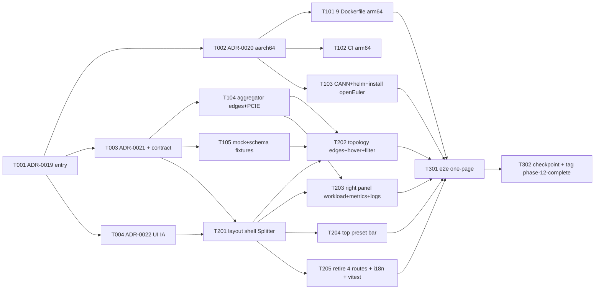

# Phase 12 Plan — 平台真实化(aarch64 鲲鹏 + openEuler)+ 拓扑数据全保真 + 前端 one-page workspace 重构

> **Goal**: Phase 12 opens a **new spine** (per `docs/phase12-candidate-streams.md`
> §Spine candidates — Phase 12 entry meeting picks spine, not bound to
> Spine A) along **three co-equal tracks**, all triggered by two user
> decisions at the Phase 12 entry meeting (2026-06-01 chat):
> - **Track A · 平台真实化**: 真实目标平台从 amd64-only 翻转为 **aarch64 鲲鹏
>   (Kunpeng)+ openEuler** —— 反转 ADR-0001 §13("不支持 ARM/鲲鹏")·
>   级联 Dockerfile multi-arch + CI arm64 + CANN driver matrix aarch64 +
>   helm arch 亲和 + install.sh openEuler + mock `arch/os`。**这是华为 Atlas
>   800 的原生配置(Kunpeng 920 host + 昇腾 910B),让样机贴近真实部署形态。**
> - **Track B · 拓扑数据全保真**: 走 §0a.5 chat+ADR self-RFC 扩 `docs/api-
>   contract.yaml` —— 补 ① NPU PCIE 带宽 ② node↔node `network` 边 + 带宽
>   ③ npu↔npu `hccs` 边 + 带宽 ④ 非 NPU workload→node 边 ⑤ edge
>   `bandwidth/utilization` 属性(供前端 hover)· 后端 `aggregator/topology.go`
>   emit + mock fixtures 补值。(当前 aggregator 仅 emit `contains/fabric-link/
>   binds-to/pd-pair`;`hccs`/`network` 枚举在契约里但未 emit · PCIE/workload→
>   node 完全缺失。)
> - **Track C · 前端 one-page workspace**: 把现有 3 栏 Overview 升级为吸收
>   `/workloads`+`/deploy`+`/metrics`+`/logs` 四页的单页工作台 —— 删左栏导航 ·
>   资源树 + 右信息栏 **可隐藏 + 可拖拽**(AntD `Splitter`)· 拓扑绿色互通连线 +
>   edge hover 带宽 + PCIE/HCCS 渲染 + workload→node 连线 + focus/isolate 过滤 ·
>   右栏吸收 workload/pod 信息 + 指标 section(资源=硬件 / 负载=业务 grafana
>   iframe)+ 日志 section(仅负载 · 可选容器)+ 显示开关 · 顶栏预置应用 bar
>   (hover 详情 + deploy)· 继续用 ReactFlow(F01 charter 的 G6 5.x 重写不在
>   本 phase scope)。
>
> **Milestone**: 留 P12-T-001 ADR-0019 entry decisions codify。working name
> **M6 平台真实化 + 操作台一体化**(per ADR-0017 §2 Decision B forward note
> "M6 在此基础加 production hardening cohort" 的 *naming reset* 变体 —— Phase
> 12 重定向到 UI + 平台真实化 spine · 原 production-hardening cohort(Karmada
> HA / 完整 OIDC IdP / Vault / vLLM PD SLA)**顺延 Phase 13+** · 即
> candidate-streams §Spine D 多 milestone 拆的变体)。
>
> **Duration**: ~5-6 weeks calendar(W1 foundation 4 docs/contract gate tasks ·
> W2 Track A 平台化 3 + Track B 后端/mock 2 并行 · W3-W4 Track C 前端 5 ·
> Closer 2)。
>
> **Phase 12 uncertainty profile**: high —— (a) **跨模块面最广的一个 phase**
> (frontend + backend + configs + deploy + operators×9 Dockerfile + docs · 6
> 模块全动)· (b) **两处 reverse/RFC**(ADR-0001 §13 反转 + api-contract 扩展)·
> 都走 main-agent serial · (c) **contract gate 串行依赖**:Track B 契约(T003)
> 未 land 前端无法 gen types · ADR-0020 平台 target 未记前先做 Dockerfile 不
> 合规 · (d) **前端重构 mid-discovery**:删 4 页 / Splitter 布局 / 自定义
> ReactFlow edge hover / focus 过滤 / 右栏 3 类 section 状态机 —— React DOM 真
> 集成 cost 可能偏移估算 · (e) **真硬件 arm64 验证 gap**:CI 仅交叉编译校验 ·
> 真 aarch64 集群运行验证仍 lab-gated(Track A carry · 与 ADR-0011 §3 lab
> gating 联动 · 见 §7)。
>
> **Prereq**: Phase 11 tag `phase-11-complete`(HEAD of dev post-CI gate · last
> P11-fix-NNN per memory `feedback_post_tag_ci_gate.md`)。ADR-0001(Phase 0 关键
> 决策 · §13 "不支持 ARM/鲲鹏" = Track A 反转目标)· ADR-0004(inter-node
> fabric topology · switch + fabric-link · NetworkLink BandwidthGbps/Medium/
> Utilization/RTT 已有 = Track B network 边复用源)· ADR-0005(pod-in-topology
> fusion · workload/pod 节点 + binds-to/pd-pair 边 = Track C 拓扑基础 + Track B
> workload→node 边补充点)· ADR-0006(wire-type enum regen · TopologyNode/Edge
> 联合类型已 native = Track C 类型安全前提)· ADR-0013/0014(O2 DMS / Quota ·
> Workload schema 3 indicator P11-T-105 已 land = 右栏 workload 信息源)·
> ADR-0015(demo-backend cache)· ADR-0017/0018(Phase 11 entry / Karmada)·
> `docs/phase12-candidate-streams.md`(spine candidates + 3 active carry tracks +
> production-hardening cohort → Phase 13+)· `docs/demo-runbook.html`(Step 1 拓扑
> SVG = 视觉北极星)· `docs/checkpoint-phase11.md` §6 Phase 12+ handoff brief ·
> arch §1.3 phase 路线图 + §13 review-table。Root CLAUDE.md §14(devlog + 模块
> DESIGN.md)applies · `docs/agent-coordination.md` §0a.5(chat+ADR self-RFC)+
> §0a.10-12(plan/execute split + strict-per-task verify + push 协议)applies。
> Per memory `feedback_plan_vs_execute_session_split.md`,**this plan commits +
> stops**;P12-T-001 执行是 separate session。

---

## 1. Scope summary

Phase 12 交付 3 track · 16 task。Track A 反转平台 target · Track B 扩契约 +
后端拓扑数据 · Track C 前端 one-page 重构吸收 4 页。

| Track / 主题 | Phase 11 现状 | Phase 12 delivery |
|---|---|---|
| **A · 平台真实化 aarch64 + openEuler**(反转 ADR-0001 §13) | amd64-only 硬约束(ADR-0001 §13)· Dockerfile 无 GOARCH(默认 host amd64)· CI 全 ubuntu-22.04 `make build` · mock `arch: amd64` · install.sh Ubuntu 22.04 | ADR-0019 entry + ADR-0020 平台 target supersede · 9 Dockerfile **multi-arch** buildx `linux/amd64,linux/arm64`(arm64=部署 target · amd64 保留本机 dev/CI · 不破 `make dev-up` 渲染验证)+ GOARCH · CI arm64 交叉编译(追加 · 不替换 amd64)· CANN matrix aarch64 行 · helm `nodeAffinity kubernetes.io/arch=arm64` · install.sh/single-node openEuler · root+project CLAUDE.md §2/§5 改写 |
| **B · 拓扑数据全保真**(api-contract RFC) | aggregator 仅 emit `contains/fabric-link/binds-to/pd-pair` · `hccs`/`network` 枚举存在但不 emit · 无 PCIE · 非 NPU workload 无 node 边 · NetworkLink 已带 BandwidthGbps/Medium/Util/RTT(仅 fabric-link 用) | ADR-0021 + api-contract 扩:NPU `pcieBandwidthGBps` · `network`(node↔node)边 · `hccs`(npu↔npu)边 · workload→node 边 · edge `bandwidthGBps/utilization/medium` 属性 · aggregator emit 上述 · mock set-a/b/c + schema.json 补值 · 前端 gen:types |
| **C · 前端 one-page workspace**(吸收 4 页) | 5 路由(overview/workloads/deploy/metrics/logs)· AntSider 5 项菜单 · Overview 固定 grid `240px 1fr 320px` · DetailPanel 仅 cluster/node/npu/slice · Metrics/Logs 独立页 · Deploy 独立页 · ReactFlow 渲 contains/fabric/binds/pd 边 | ADR-0022 + frontend DESIGN · 删 nav 菜单 + 路由收敛 · AntD `Splitter` 可隐藏可拖拽左树+右栏 · 拓扑绿色 network 连线 + edge hover tooltip(自定义 ReactFlow edge)+ PCIE/HCCS 渲染 + workload→node 连线 + focus/isolate 过滤 · 右栏吸收 workload/pod + 指标 section(硬件/业务 grafana toggle)+ 日志 section(负载/容器 toggle)· 顶栏 preset bar(hover 详情)· 退役 4 页 + i18n + Vitest + Playwright |

**Out of scope(Phase 13+)**:
- **Production-hardening cohort**(Karmada control-plane HA + 完整 OIDC IdP
  Keycloak/Dex + ClusterQuota webhook B 完整 + Vault Secret cross-cluster +
  vLLM PD 分离 P99 SLA)—— candidate-streams §Spine A · 顺延 Phase 13+(M6
  naming reset 后的真 production-hardening milestone)。
- **真 aarch64 集群运行验证**(真鲲鹏 920 + 昇腾 910B lab)—— Phase 12 仅交叉
  编译 + helm template 校验 · 真硬件运行验证 lab-gated(Track A carry · ADR-
  0011 §3 lab gating 联动 · 见 §7)。
- **G6 5.x 拓扑重写**(Frontend UX Track-2 F01)—— Phase 12 继续 ReactFlow ·
  G6 charter 留后续(@antv/g6 5.1 dep 已在 package.json · 但不启用)。
- **3 active carry tracks**(Track A lab 6th / Track B Volcano 4th / Track C
  Partitionable Devices 3rd)—— 全维持 default-defer(per candidate-streams ·
  Phase 12 scope 与真硬件/训练/K8s 1.36 无 direct dependency)。
- **Go v1 ResourceSlice schema migration cohort** —— 与 K8s 1.36 baseline bump
  同期 · 除非 Track C(Partitionable)flip · 否则 defer(per candidate-streams)。

---

## 2. Task package overview(16 tasks · 4 W1 + 5 W2 + 5 W3 + 2 Closer)

```
W1 Foundation(4 tasks · docs/contract gate · 全 main-agent serial)
├── P12-T-001  ADR-0019 Phase 12 entry decisions(spine = 平台真实化 + one-page UI · milestone M6 naming reset · production-hardening → Phase 13+ · 3 carry tracks 维持 defer · scope A/B/C)
├── P12-T-002  ADR-0020 aarch64 鲲鹏 + openEuler target(supersede ADR-0001 §13 · root+project CLAUDE.md §2/§5 改写 · arch §13 cascade outline)
├── P12-T-003  ADR-0021 + api-contract.yaml 拓扑全保真扩展(PCIE + network/hccs/workload→node 边 + edge 带宽属性 · 前端 gen:types · 共享契约)
└── P12-T-004  ADR-0022 + frontend/docs/one-page-workspace.md(one-page UI IA · 布局 region · 右栏 section 状态机 · 路由退役策略)

W2 Track A 平台化 ∥ Track B 后端数据(不同模块 · 可并行 if user batch · default serial)
├── P12-T-101  [Track A] 9 Dockerfile multi-arch(backend + 7 operator + exporter · buildx --platform linux/arm64 + GOARCH)
├── P12-T-102  [Track A] CI arm64 交叉编译矩阵 + build-images buildx(若 kind-smoke workflow 存在)
├── P12-T-103  [Track A] CANN matrix aarch64 + helm charts arch 亲和 + install.sh/single-node openEuler
├── P12-T-104  [Track B] backend aggregator emit network/hccs/workload→node 边 + PCIE + 带宽属性 + model/handler
└── P12-T-105  [Track B] mock-data set-a/b/c arch/os + PCIE/HCCS/node 互联带宽 fixtures + schema.json(共享 schema · main-agent serial)

W3 Track C 前端 one-page(依赖 T003 契约 landed · gen:types 通)
├── P12-T-201  Layout shell:删 AntSider nav 菜单 + App.tsx 路由收敛 + AntD Splitter 可隐藏可拖拽左树+右栏(替换 grid)
├── P12-T-202  拓扑增强:绿色 network 连线 + edge hover 带宽 tooltip(自定义 edge)+ PCIE/HCCS 渲染 + workload→node 连线 + focus/isolate 过滤
├── P12-T-203  右栏:DetailPanel 吸收 workload/pod + 指标 section(资源硬件 / 负载业务 grafana toggle)+ 日志 section(负载 · 容器选择 toggle)
├── P12-T-204  顶栏预置应用 bar(PresetGrid/DeployWizard fold + hover 详情 + deploy)
└── P12-T-205  退役 /workloads /deploy /metrics /logs 路由 + i18n cleanup + Vitest 更新(3 状态 + 关键交互)

Closer(2 tasks)
├── P12-T-301  Playwright e2e one-page flow 重写 + kind smoke arch 校验(若适用)
└── P12-T-302  docs 大整理 + checkpoint-phase12 + tag phase-12-complete + M6 milestone announcement
```



**Subagent parallelisation candidates**(per §0a.11 strict-verify — ONE
subagent at a time · main agent verifies before next · 仅 user 显式 "batch"
cue 时机会性并行 across module boundaries):
- T001-T004 docs/contract — **全 main-agent serial**(2 个含共享契约/CLAUDE
  改写 · T003 api-contract + T002 root CLAUDE.md 跨模块)。T001 是其余 gate。
- T101 / T102 / T103(Track A · deploy+docs+configs)与 T104 / T105(Track B ·
  backend+configs)**跨模块 · 可 parallel if user batch**;但 T105 + T103 都碰
  `configs/`(T105 mock-data + schema · T103 install.sh 不碰 mock)· 注意
  schema.json 是共享契约 → T105 main-agent serial。
- T201(frontend layout)必 land 后 T202/T203/T204/T205 才有 shell 挂载 ·
  T202-T205 同 `frontend/**` 模块 · default serial · 可机会性并行 if user batch
  (各自子目录:T202 components/TopologyGraph + Overview/TopologyView · T203
  Overview/DetailPanel + GrafanaPanel + LogViewer · T204 顶栏 + Deploy fold ·
  T205 路由 + i18n)。
- T202/T203 依赖 T104 后端边/数据 landed(gen:types 后新 schema 可用)。
- T301 e2e 必在 T101-T205 都 land 后 run(全链)· T302 docs-only。

**Decision-gated / carry tracks**(per candidate-streams · 全维持 default-defer
· 见 §7):本 phase **无 W-entry decision gate**(与 Phase 11 T101/T108/T202 不
同)—— 3 active carry tracks 与 Phase 12 scope 无 direct dependency · ADR-0019
codify "维持 default-defer · 不在 Phase 12 spine"。**唯一 conditional** = Track
A 真 aarch64 lab 运行验证(若 lab signal materialise at any W entry → 加真硬件
smoke · 否则交叉编译 + helm template 校验交付 · 真硬件 stamp 留 Phase 13+ ·
同 ADR-0011 §3 lab gating spirit)。

**§0a.5 chat+ADR self-RFC**:Phase 12 引入 4 ADR(0019 entry · 0020 平台
target supersede ADR-0001 §13 · 0021 拓扑契约扩展 = 本 phase 唯一 api-contract
RFC · 0022 one-page UI IA)+ 多个 existing-ADR 小编辑(ADR-0001 §13 status
"superseded by ADR-0020" · ADR-0004 §X network 边 cross-ref · ADR-0005 §X
workload→node 边 cross-ref · ADR-0011 §3 lab gating Track A 真 aarch64 carry
note)。共享契约改动(api-contract.yaml T003 · schema.json T105)**只能
main-agent 串行**(per root CLAUDE.md §11 + §6)。

---

## 3. W1 task packages(Foundation · docs/contract gate)

### P12-T-001 ADR-0019 — Phase 12 entry decisions

Owner: docs (no code).

**Allowed Paths**:
- `docs/adr/0019-phase-12-entry-decisions.md` (new — §1 Context(Phase 11
  closer + candidate-streams spine 留 entry decide + 2026-06-01 用户两决策:
  真实目标平台 + 全保真)· §2 Decision A: spine = **平台真实化(aarch64+
  openEuler)+ 拓扑全保真 + 前端 one-page workspace**(非 Spine A · candidate-
  streams §Spine D naming reset 变体)· §2 Decision B: milestone = **M6 平台真实化
  + 操作台一体化**(production-hardening cohort 顺延 Phase 13+)· §2 Decision C:
  3 active carry tracks(lab 6th / Volcano 4th / Partitionable 3rd)维持
  default-defer · 与 Phase 12 scope 无 direct dependency · §2 Decision D: 3
  track 优先级 + contract gate 串行(T003 契约先 land)· §3 scope enumeration
  (16 task cross-ref §2)· §4 Open questions:(a) 真 aarch64 lab 验证 posture
  (Phase 12 交叉编译 vs Phase 13+ 真硬件)·(b) 退役 4 页是否保留 deep-link
  fallback ·(c) Splitter 折叠态默认(左树展开/右栏收起?)· §5 引用)
- `docs/architecture.md` (small edit — §13 review-table Phase 12 row "in flight
  via P12-T-001..T302" · §1.3 phase 路线图 M6 naming)
- `docs/devlog/phase-12-t001.md`

Acceptance:
- ADR §1 Context cites candidate-streams + 2026-06-01 两决策
- §2 Decision A-D: spine / milestone / carry-defer / track 优先级 + contract gate
- §3 16-task scope cross-ref §2
- §4 3 Open questions
- arch §13 row + §1.3 M6 naming

Dependencies: `phase-11-complete`.

Estimated effort: 0.5d.

---

### P12-T-002 ADR-0020 — aarch64 鲲鹏 + openEuler target platform(supersede ADR-0001 §13)

Owner: docs (cross-module — root + project CLAUDE.md 改写).

**Allowed Paths**:
- `docs/adr/0020-aarch64-openeuler-target.md` (new — §1 Context(ADR-0001 §13
  amd64-only 简化决策 · 用户 2026-06-01 翻转为真实目标平台 · 华为 Atlas 800 =
  Kunpeng 920 host + 昇腾 910B + openEuler 原生配置 rationale)· §2 Decision A:
  target = **linux/arm64(aarch64 Kunpeng)+ openEuler 节点 OS** · §2 Decision B:
  容器镜像 = multi-arch buildx(`--platform linux/arm64` · CGO 关闭 Go 静态二进制
  跨编译 · base distroless/static + golang-alpine 均 multi-arch · 无需换 base)·
  §2 Decision C: CANN driver = aarch64 包(cann-driver-matrix 加 aarch64 行)·
  §2 Decision D: helm 调度 = `nodeAffinity kubernetes.io/arch=arm64` · 节点 OS
  openEuler(install.sh / single-node / mock `os`)· §3 cascade scope(T101
  Dockerfile · T102 CI · T103 CANN/helm/install · T105 mock arch/os)· §4 Open
  questions(真硬件验证 lab-gated · amd64 是否保留双架构 fallback · openEuler
  base 镜像是否后续引入)· §5 引用 ADR-0001 §13)
- `docs/adr/0001-phase0-key-decisions.md` (small edit — §13 status flip
  "**SUPERSEDED by ADR-0020 (2026-06-01)** · amd64-only 翻转为 aarch64 Kunpeng +
  openEuler 真实目标平台")
- `CLAUDE.md` (root project CLAUDE.md — §2 项目快照 "目标硬件" 改 aarch64 鲲鹏 +
  昇腾 910B · §5 技术栈基线 "目标硬件" 改写 + 删 "不支持 ARM/鲲鹏" 行)
- `docs/architecture.md` (small edit — 目标硬件 / 部署形态 章节 arch 改写)
- `docs/devlog/phase-12-t002.md`

Acceptance:
- ADR §2 Decision A-D: arm64+openEuler target · multi-arch buildx · CANN aarch64
  · helm arch 亲和
- ADR-0001 §13 status: SUPERSEDED by ADR-0020 stamp
- root CLAUDE.md §2/§5 "目标硬件" 改 aarch64 鲲鹏 · 删 "不支持 ARM/鲲鹏"
- arch 目标硬件章节改写
- `grep -ri "不支持.*鲲鹏\|amd64.*only\|仅.*amd64" docs/ CLAUDE.md` 余项全部
  带 "superseded" / "历史" 标注(横向扫 · P4)

Dependencies: T001.

Estimated effort: 1d (含 grep 全仓库 amd64/鲲鹏 横向扫 + 改写).

---

### P12-T-003 ADR-0021 + api-contract.yaml — 拓扑数据全保真扩展(RFC · 共享契约)

Owner: docs + contract (**main-agent serial · 共享契约 per root CLAUDE.md §11**).

**Allowed Paths**:
- `docs/adr/0021-topology-fidelity-extension.md` (new — §1 Context(用户全保真
  决策 · 当前 aggregator 仅 emit contains/fabric-link/binds-to/pd-pair · hccs/
  network 枚举存在但不 emit · PCIE/workload→node 缺失)· §2 Decision A: NPU 加
  `pcieBandwidthGBps` 字段(host↔NPU PCIe Gen4/5 带宽)· §2 Decision B: emit
  `network` 边(node↔node 互通 · attributes `bandwidthGBps/medium/utilization`)·
  §2 Decision C: emit `hccs` 边(npu↔npu intra-node · attributes
  `bandwidthGBps`)· §2 Decision D: emit workload→node 边(非 NPU workload ·
  edge type 复用 `binds-to` 或新 `runs-on` · 决策记此)· §2 Decision E: fabric-
  link/network/hccs 边统一带 `bandwidthGBps/utilization` 属性供前端 hover · §3
  契约 diff 清单 · §4 Open questions(带宽是否 depth-gated · workload→node edge
  type 命名)· §5 引用 ADR-0004/0005)
- `docs/api-contract.yaml` (edit — TopologyEdge.type 加 `runs-on`(若 Decision D
  选新 type)· TopologyNode npu attributes 文档加 `pcieBandwidthGBps` · TopologyEdge
  attributes 文档加 `bandwidthGBps/medium/utilization` · 描述更新 hccs/network 边
  语义)
- `frontend/src/services/types.ts` (regen — `pnpm run gen:types` 输出 · CI drift
  check gate · 本 task 只 regen 不手改)
- `docs/architecture.md` (small edit — 拓扑数据模型章节 cross-ref ADR-0021)
- `docs/devlog/phase-12-t003.md`

Acceptance:
- ADR §2 Decision A-E codified
- api-contract.yaml: PCIE 字段 + 带宽属性 + 边语义 doc 更新
- `swagger-cli validate docs/api-contract.yaml` clean(CI validate-contract 对齐)
- `cd frontend && pnpm run gen:types && git diff --quiet src/services/types.ts`
  → 提交后 CI gen:types drift check 通(types.ts 与契约同步)
- arch 拓扑章节 cross-ref

Dependencies: T001.

Estimated effort: 1-1.5d.

---

### P12-T-004 ADR-0022 + frontend/docs/one-page-workspace.md — one-page UI IA

Owner: docs + frontend (DESIGN doc · no runtime code).

**Allowed Paths**:
- `docs/adr/0022-one-page-workspace-ui.md` (new — §1 Context(用户 one-page
  spec 2026-06-01 · demo-runbook.html Step 1 拓扑视觉北极星 · 现有 3 栏 Overview
  基础)· §2 Decision A: IA = 单页工作台 region(顶栏 preset bar · 左 资源树侧栏
  可隐藏可拖拽 · 中 拓扑画布 · 右 信息栏可隐藏可拖拽)· §2 Decision B: 渲染器
  保持 ReactFlow(非 G6 · F01 charter 留后续)· §2 Decision C: 右栏 dispatch =
  selection type(资源 → 硬件指标 + 无日志 / 负载 → 业务指标 + 日志容器选择)·
  §2 Decision D: 4 页退役策略(逻辑 fold 入 panel/bar · 路由保留 deep-link or
  删 · per T001 §4 Open question b)· §3 component map(改/新/退役)· §4 Open
  questions(Splitter 折叠默认 · focus 过滤交互手势 · 移动端 fallback)· §5 引用)
- `frontend/docs/one-page-workspace.md` (new — 模块 DESIGN per root CLAUDE.md
  §14.2:架构概览 region + 数据流(store/react-query)· 右栏 section 状态机
  (resource vs workload × metrics/logs toggle)· 拓扑 edge 渲染契约(network 绿
  + hover)· focus/isolate 算法 · Splitter 持久化(Zustand)· 扩展点 · 集成示例)
- `docs/devlog/phase-12-t004.md`

Acceptance:
- ADR §2 Decision A-D: IA region · ReactFlow · 右栏 dispatch · 退役策略
- frontend DESIGN.md 6 section(per §14.2)
- §3 component map 列改/新/退役 文件清单(与 T201-T205 Allowed Paths 一致)

Dependencies: T001.

Estimated effort: 1d.

---

## 4. W2 task packages(Track A 平台化 ∥ Track B 后端数据)

### P12-T-101 [Track A] 9 Dockerfile multi-arch(arm64)

Owner: deploy + backend + operators + exporters(cross-module · 仅 Dockerfile).

**Allowed Paths**:
- `backend/Dockerfile`
- `operators/{pool-operator,inference-operator,npu-dra-driver,scheduler-plugin,o2-dms-adapter,node-lifecycle-operator,software-mgmt-operator,bare-metal-provisioning-operator}/Dockerfile`(注:8 operator 目录 · 实际有 Dockerfile 的按现状 · scaffold 无 Dockerfile 的跳过并注)
- `exporters/ascend-npu-exporter-plus/Dockerfile`
- `docs/devlog/phase-12-t101.md`

实现(per ADR-0020 §2 Decision B):
- build stage 加 `ARG TARGETARCH` + `GOARCH=${TARGETARCH}`(buildx 注入)·
  CGO_ENABLED=0 已是静态跨编译 · 无需换 base(golang-alpine / distroless
  multi-arch)
- 注 `# multi-arch: docker buildx build --platform linux/amd64,linux/arm64 (per ADR-0020 · arm64=部署 target · amd64 保留本机 dev/CI/dev-up · 不破渲染验证)`

Acceptance:
- 每个 Dockerfile `docker buildx build --platform linux/amd64,linux/arm64 -t test .`
  本地通(双架构)· 默认 `docker build`(host amd64)+ `make dev-up` 本机栈照常
  (本机渲染验证不依赖 arm64)· 或 CI cross-compile 校验(见 T102)
- `GOARCH=arm64 GOOS=linux go build ./...` 各 Go 模块通(交叉编译无 CGO 依赖)
- 横向扫(P4):`grep -rl "GOARCH=amd64\|--platform linux/amd64" .` 余项全部带
  双架构 or arm64 注释

Dependencies: T002(ADR-0020 + ADR-0001 §13 superseded landed)。

Estimated effort: 1d.

---

### P12-T-102 [Track A] CI arm64 交叉编译矩阵

Owner: deploy(`.github/**`).

**Allowed Paths**:
- `.github/workflows/ci.yml` (edit — backend/operators build matrix 加 arm64
  交叉编译 step:`GOARCH=arm64 go build ./...` · frontend build arch 无关不动)
- `.github/workflows/*.yml`(若有 kind-smoke / build-images workflow — 加
  buildx `--platform linux/arm64` · 按现状 · 无则注 deferred)
- `docs/devlog/phase-12-t102.md`

Acceptance:
- ci.yml backend job: `GOARCH=arm64 go build ./...` step 加入(amd64 + arm64 双
  校验或 matrix arch)
- operators / ims-scaffold / o2-dms-adapter / exporter build 同加 arm64 cross
- `act` 或 syntactic `yamllint` 通 · CI 改动不破现有 job
- 若无 build-images workflow → devlog 注 "buildx multi-arch push 留 Track A 真
  CI/CD pipeline(Phase 13+ · 与真集群验证同期)"

Dependencies: T101.

Estimated effort: 0.5-1d.

---

### P12-T-103 [Track A] CANN matrix aarch64 + helm arch 亲和 + install.sh openEuler

Owner: deploy + docs(`deploy/**` `scripts/**` `docs/cann-driver-matrix.md`).

**Allowed Paths**:
- `docs/cann-driver-matrix.md` (edit — 加 aarch64 CANN 包行 · openEuler 兼容矩阵)
- `deploy/helm-charts/*/values.yaml` + `deploy/helm-charts/*/templates/deployment.yaml`
  (edit — `nodeAffinity`/`nodeSelector kubernetes.io/arch: arm64` · 各 chart ·
  per ADR-0020 §2 Decision D · 横向扫全 chart 一致)
- `scripts/install.sh` (edit — Ubuntu 22.04 → openEuler · 包管理 apt → dnf/yum ·
  arch 检测)
- `deploy/single-node/README.md` (edit — openEuler 部署说明)
- `deploy/dev/*`(若 docker-compose 平台相关 — 按需 · 默认不动)
- `docs/devlog/phase-12-t103.md`

Acceptance:
- cann-driver-matrix aarch64 行 + openEuler 兼容标注
- 全 helm chart `helm template` 渲出 `kubernetes.io/arch: arm64` 亲和 ·
  `helm lint --strict` clean
- install.sh openEuler 包管理路径(dnf)· `bash -n scripts/install.sh` 通
- 横向扫(P4):`grep -rl "ubuntu\|apt-get\|amd64" deploy/ scripts/` 余项全部
  openEuler/arm64 或带注释

Dependencies: T002.

Estimated effort: 1.5d.

---

### P12-T-104 [Track B] backend aggregator — network/hccs/workload→node 边 + PCIE + 带宽属性

Owner: backend(`backend/**`).

**Allowed Paths**:
- `backend/pkg/aggregator/topology.go` (edit — emit:① `network` 边(node↔node ·
  attributes bandwidthGBps/medium/utilization · 源 NetworkLink node-to-node 项
  或 mock 新字段)② `hccs` 边(同 node 内 npu↔npu · 同 HCCSGroup · attributes
  bandwidthGBps)③ workload→node 边(IncludeWorkloads 且 pod 无 slice binding 时 ·
  per ADR-0021 §2 Decision D)④ npu 节点 attributes 加 pcieBandwidthGBps · 复用
  fabric-link NetworkLink 带宽属性 stamp 到 edge attributes)
- `backend/pkg/aggregator/topology_test.go` (edit — network/hccs/workload→node
  边 + PCIE + 带宽属性 断言 · 每新边类型 1 happy + 1 edge case)
- `backend/pkg/model/*.go`(edit — 若 NPU model 加 pcieBandwidthGBps 字段 · 与
  api-contract 一致)
- `backend/pkg/datasource/mock/*.go`(edit — mock source 读 fixtures 新字段 ·
  与 T105 mock 数据对齐)
- `docs/devlog/phase-12-t104.md`

Acceptance:
- `go test ./pkg/aggregator/...` 通 · network/hccs/workload→node 边 + PCIE +
  带宽属性 断言 PASS
- emit 的边 type ∈ 契约枚举(T003 landed)· attributes 含 bandwidthGBps
- `make test && make lint`(backend)通 · 覆盖率核心包 ≥70% 维持
- IncludeWorkloads=false 时 network/hccs 仍可 emit(节点间/节点内硬件拓扑 ·
  depth=npu+)· workload→node 仅 IncludeWorkloads=true(zero-regression 对齐
  现有 fabric/workload 分支独立性)

Dependencies: T003(契约 landed)。

Estimated effort: 2d.

---

### P12-T-105 [Track B] mock-data arch/os + 带宽 fixtures + schema.json(共享 schema · serial)

Owner: configs(**main-agent serial · schema.json 共享契约**).

**Allowed Paths**:
- `configs/mock-data/schema.json` (edit — $defs 加 npu.pcieBandwidthGBps ·
  NetworkLink/edge bandwidthGBps/medium/utilization · node↔node link · 共享
  schema)
- `configs/mock-data/set-a-small/{nodes,*}.json` (edit — arch: arm64 · os:
  openEuler · NPU pcieBandwidthGBps · node 互联 network link 带宽 · hccs 带宽)
- `configs/mock-data/set-b-multi-ring/*.json` (edit — 同 · 多 ring HCCS 带宽)
- `configs/mock-data/set-c-stress/*.json` (edit — 同 · 高密度)
- `configs/mock-data/generator/*.go`(edit — preset 生成器 arch/os + 带宽字段)
- `docs/devlog/phase-12-t105.md`

Acceptance:
- 全 set-* `arch: arm64` + `os: openEuler`(替换 amd64 · 横向扫 P4)
- NPU pcieBandwidthGBps + node↔node network 带宽 + npu↔npu hccs 带宽 fixtures
- `ajv validate --spec=draft2020 --strict=false -s schema.json -d set-*/*.json`
  通(CI validate-mockdata 对齐)
- generator 产出与 schema 一致 · `grep -rl "amd64" configs/mock-data/` 余 0

Dependencies: T003(契约 · schema 对齐)。

Estimated effort: 1.5d.

---

## 5. W3 task packages(Track C 前端 one-page · 依赖 T003 gen:types)

### P12-T-201 Layout shell — 删 nav + Splitter 可隐藏可拖拽

Owner: frontend(`frontend/**`).

**Allowed Paths**:
- `frontend/src/components/Layout/index.tsx` (edit — 删/简化 AntSider(nav 菜单
  移除)· Header 保留 brand + 语言 + 折叠按钮(改控制资源树/右栏))
- `frontend/src/components/Layout/Sider.tsx` (edit/删 — 5 项菜单移除 · 或退化为
  brand-only · 路由导航不再需要)
- `frontend/src/App.tsx` (edit — 路由收敛:`/` = one-page workspace · /workloads
  等暂保留 redirect or 删 per T004 Decision D · POC 路由清理)
- `frontend/src/pages/Overview/index.tsx` (edit — 改用 AntD `Splitter` 包左树 +
  中拓扑 + 右栏 · 可拖拽 + 可隐藏(collapsible panel))
- `frontend/src/pages/Overview/styles.module.css` (edit — 替换固定 grid 为
  Splitter 容器样式 · 全高)
- `frontend/src/store/index.ts` + `frontend/src/store/topologyStore.ts` (edit —
  panel 折叠态 + 宽度持久化 state)
- `frontend/src/i18n/{zh-CN,en-US}.json` (edit — 删 menu.* 多余 key · 加 panel
  toggle key)
- `frontend/src/components/Layout/*.test.tsx` + `frontend/tests/*`(edit — 适配)
- `docs/devlog/phase-12-t201.md`

Acceptance:
- AntD `Splitter`(antd ^5.21 已具备)渲出左树 + 中拓扑 + 右栏 · 可拖拽改宽 ·
  左树/右栏可隐藏(toggle)· 宽度/折叠态持久化(Zustand)
- nav 菜单移除 · `/` 直达 one-page workspace
- `pnpm typecheck && pnpm lint && pnpm test` 通
- 三状态(loading/error/empty)维持(frontend CLAUDE §4.8)

Dependencies: T004(UI IA)。

Estimated effort: 2d.

---

### P12-T-202 拓扑增强 — 绿色 network 连线 + edge hover 带宽 + PCIE/HCCS + workload→node + focus 过滤

Owner: frontend(`frontend/**`).

**Allowed Paths**:
- `frontend/src/components/TopologyGraph/TopologyGraph.tsx` (edit — edgeRenderingFor
  加 `network` 绿色 + `hccs` 样式 + workload→node 边渲染 · 自定义 edge 组件支持
  hover tooltip 显 bandwidthGBps/medium/utilization · PCIE 在 npu 节点/contains
  边呈现)
- `frontend/src/components/TopologyGraph/*.tsx`(新自定义 edge 组件 · 如
  `BandwidthEdge.tsx`)
- `frontend/src/pages/Overview/TopologyView.tsx` (edit — 传 focus 选中 + 过滤)
- `frontend/src/store/topologyStore.ts` (edit — focus/isolate selected resource
  state · 过滤无关节点/负载)
- `frontend/src/services/cluster.ts`(edit — 若需 depth/flag 调整取新边)
- `frontend/src/i18n/{zh-CN,en-US}.json` (edit — edge tooltip / focus key)
- `frontend/src/components/TopologyGraph/*.test.tsx`(edit/new)
- `docs/devlog/phase-12-t202.md`

实现(per 用户 spec 主体 ①②③):
- ① node↔node `network` 边绿色 + hover tooltip(bandwidth)· 节点内 PCIE(host↔
  NPU)+ npu↔npu HCCS 带宽渲染 + hover
- ② workload→所用 NPU 切片连线(binds-to 已有)· 非 NPU workload→node 边(新)
- ③ focus/isolate:选资源(cluster/node/npu)→ 只显其及下属 + 相关负载 · 隐藏
  无关(扩展现有 expandedNPUs 过滤机制)

Acceptance:
- network 边绿色渲染 · hover 显带宽(自定义 edge tooltip)· PCIE/HCCS 带宽可见
- 非 NPU workload 连到 node · NPU workload 连到 slice
- focus 选中资源 → 无关节点/负载隐藏 · 清除恢复
- `pnpm typecheck && pnpm lint && pnpm test` 通 · 关键交互单测

Dependencies: T201 + T104(后端边 emit)+ T003(gen:types)。

Estimated effort: 2.5d.

---

### P12-T-203 右栏 — 吸收 workload/pod + 指标 section + 日志 section

Owner: frontend(`frontend/**`).

**Allowed Paths**:
- `frontend/src/pages/Overview/DetailPanel.tsx` (edit — 加 workload/pod dispatch
  分支(并入 WorkloadDetailDrawer 内容)· 资源/负载分流)
- `frontend/src/pages/Overview/*.tsx`(新 section 组件:MetricsSection / LogsSection)
- `frontend/src/components/GrafanaPanel/*` (edit — 右栏内嵌 · 资源→硬件
  dashboard(node-detail/npu-detail)· 负载→业务 dashboard(workload-business/
  workload-resource)· per dashboard 映射)
- `frontend/src/components/LogViewer/*` + `frontend/src/hooks/useLogsWS.ts`
  (edit — 右栏内嵌 · 仅 workload · 容器选择(同现 Logs 页逻辑))
- `frontend/src/services/{workload,logs}.ts`(edit — 复用)
- `frontend/src/store/topologyStore.ts` (edit — metrics/logs section toggle state)
- `frontend/src/i18n/{zh-CN,en-US}.json` (edit — section key)
- `frontend/src/pages/Overview/*.test.tsx`(edit/new)
- `docs/devlog/phase-12-t203.md`

实现(per 用户 spec 右栏 2/3 + 3.1/3.2):
- 右栏支持 workload 信息(不只资源)
- 指标 + 日志不单独成页 · 右栏内 section + 显示开关(避免干扰)
- 3.1 资源无日志 · 负载有日志(容器可选 · 同现 Logs 逻辑)
- 3.2 资源指标=硬件 grafana · 负载指标=业务 grafana · iframe

Acceptance:
- 选资源 → 右栏硬件指标 section(toggle)· 无日志 section
- 选负载 → 右栏业务指标 + 日志 section(容器选择)· toggle 控制显示
- grafana iframe 按选中类型切 dashboard(GrafanaPanel urlBuilder 复用)
- `pnpm typecheck && pnpm lint && pnpm test` 通

Dependencies: T201 + T104。

Estimated effort: 2.5d.

---

### P12-T-204 顶栏预置应用 bar

Owner: frontend(`frontend/**`).

**Allowed Paths**:
- `frontend/src/components/Layout/index.tsx` (edit — Header 下加 preset bar 区)
- `frontend/src/components/PresetBar/*`(新 — 复用 Deploy/PresetGrid 逻辑 · 基础
  信息 + hover 详情(/presets/{id})+ click → deploy wizard)
- `frontend/src/pages/Deploy/{PresetGrid,DeployWizard}.tsx` (edit — 抽复用 ·
  fold 入 PresetBar)
- `frontend/src/services/preset.ts`(复用)
- `frontend/src/i18n/{zh-CN,en-US}.json` (edit)
- `frontend/src/components/PresetBar/*.test.tsx`(new)
- `docs/devlog/phase-12-t204.md`

Acceptance(per 用户 spec 顶栏):
- 顶栏 preset bar 显基础信息 · hover 显详情(同现 Deploy 页逻辑)
- click preset → deploy wizard(auto/manual · POST /deploy 201)
- `pnpm typecheck && pnpm lint && pnpm test` 通

Dependencies: T201。

Estimated effort: 1.5d.

---

### P12-T-205 退役 4 页路由 + i18n cleanup + Vitest

Owner: frontend(`frontend/**`).

**Allowed Paths**:
- `frontend/src/App.tsx` (edit — 删 /workloads /deploy /metrics /logs 路由(或
  redirect → / · per T004 Decision D)· POC 路由清理)
- `frontend/src/pages/{Workloads,Deploy,Metrics,Logs}/`(删/退役 · 逻辑已 fold
  入 panel/bar · 保留复用组件(WorkloadTable/PresetGrid/DeployWizard/
  DashboardTabs)若被 panel 引用)
- `frontend/src/i18n/{zh-CN,en-US}.json` (edit — 清退役页 key)
- `frontend/tests/*`(edit — 删退役页测试 · 加 one-page 测试)
- `frontend/src/components/*`(按引用调整)
- `docs/devlog/phase-12-t205.md`

Acceptance:
- 4 路由退役(删 or redirect)· 复用组件保留 · 无死引用
- `pnpm typecheck && pnpm lint && pnpm test && pnpm build` 全通(无 unused/死码)
- i18n 无孤儿 key(横向扫 P4)

Dependencies: T202 + T203 + T204(逻辑都已 fold)。

Estimated effort: 1d.

---

## 6. Closer task packages

### P12-T-301 Playwright e2e one-page flow + kind smoke arch 校验

Owner: frontend/deploy(`tests/e2e/**` `frontend/tests/**`).

**Allowed Paths**:
- `tests/e2e/tests/*.spec.ts` (edit — 5-page specs 重写为 one-page workspace
  flow:树选择 → 拓扑 focus → 右栏资源/负载 + 指标/日志 toggle → 顶栏 preset
  deploy)
- `tests/e2e/*`(配置按需)
- `tests/e2e/kind/*`(若 arch 相关 smoke — 加 arm64 nodeAffinity 校验 · 按现状)
- `docs/devlog/phase-12-t301.md`

Acceptance:
- e2e 主流程 spec 覆盖 one-page workspace(无 5-page 路由跳转)
- `npx playwright test`(或 syntactic + CI gate)· 主流程通
- kind smoke(若适用)arm64 nodeAffinity 渲染校验
- 渲染基线:Preview/Chrome MCP 截 one-page workspace 关键态(资源选中 / 负载
  选中 / focus 过滤 / preset hover)存 `docs/screenshots/phase12/` · Phase 12
  render-verify 留痕 + demo-runbook 更新输入

Dependencies: T101 + T103 + T202 + T203 + T204 + T205。

Estimated effort: 1.5d.

---

### P12-T-302 docs 大整理 + checkpoint-phase12 + tag

Owner: docs(no code).

**Allowed Paths**:
- `docs/checkpoint-phase12.md` (new — 16-task deliverable table + 3 track 摘要 +
  ADR forward notes(0019-0022 + 0001 §13 superseded)+ test posture + scope
  adaptations + Phase 13+ handoff(production-hardening cohort + 真 aarch64 lab
  carry + 3 active carry tracks))
- `docs/architecture.md` (edit — §13 review-table Phase 12 row promote "landed
  phase-12-complete" · §1.3 M6 milestone · 目标硬件/前端章节最终态)
- `README.md` (edit — 当前阶段 / 上一阶段 / 下一阶段 line update · 目标硬件
  aarch64 鲲鹏 + openEuler · one-page workspace)
- `docs/phase12-candidate-streams.md` (edit — Phase 12 spine 落定 stamp · 顺延
  项更新)
- `docs/devlog/phase-12-t302.md`
- (devlog index / arch §13 cross-ref)

Acceptance:
- checkpoint 16/16 status + 3 track 摘要 + ADR forward notes
- arch §13 Phase 12 row "landed" + 目标硬件最终态
- README 三阶段 line + 目标硬件改写
- `git tag phase-12-complete <commit>`(per memory `feedback_push_at_phase_tag_
  only.md`:全链一次 push 触发 CI gate · 然后 P12-fix-NNN 修 ❌ 直到 dev 全绿)

Dependencies: T301(全链 land)。

Estimated effort: 1d.

---

## 7. Carry tracks + Phase 13+ handoff(per candidate-streams)

**3 active carry tracks 全维持 default-defer**(Phase 12 scope 与其无 direct
dependency · ADR-0019 §2 Decision C codify):
- **Track A · lab gating 6th carry**(ADR-0011 §3)—— Phase 12 Track A 平台化是
  *构建 target* 反转(交叉编译 + helm template 校验)· **真 aarch64 鲲鹏 + 昇腾
  910B 集群运行验证仍 lab-gated** · 若 lab signal materialise → 加真硬件 smoke ·
  否则 6th carry · 真硬件 stamp 留 Phase 13+(与 production-hardening cohort 或
  M5+ 真硬件 milestone 联动)。
- **Track B · Volcano 4th carry**(ADR-0010)—— 无训练 demo signal · 维持 defer。
- **Track C · Partitionable Devices 3rd carry**(ADR-0009)—— K8s 1.34 baseline
  不 unlock · KEP-4815 仍 Beta · 维持 defer。

**Phase 13+ handoff**:
- **Production-hardening cohort**(原 candidate-streams §Spine A · M6 真
  production-hardening)：Karmada control HA + 完整 OIDC IdP + ClusterQuota
  webhook B 完整 + Vault Secret + vLLM PD P99 SLA。
- **真 aarch64 集群验证 + 真硬件 stamp**(Track A carry closer)。
- **Go v1 ResourceSlice schema migration cohort**(per P10-fix-001 carry · 与 K8s
  1.36 baseline bump 同期)。
- **G6 5.x 拓扑重写**(Frontend UX Track-2 F01 charter · 若 ReactFlow 在大基数
  set-c-stress 下渲染瓶颈 materialise)。

---

## 8. 本地运行 & 刷新验证(render verify · 与 CPU 架构解耦)

> 用户要求(2026-06-01):虽按真实平台(aarch64)开发 · **同样要能本机验证渲染
> 效果**。Phase 11 closer 只跑 typecheck(`pnpm test` 都未跑)· 无 render-verify
> 步骤 → 渲染从未真正过目(P3 "dry-run/typecheck ≠ functional")。Phase 12 起
> 把"刷新验证"作为 Track C 每 task 的 acceptance 一等公民。

**关键原则 · 渲染验证不依赖 aarch64**:Track A 的 aarch64/openEuler 是 ① mock
数据展示门面 + ② 生产部署产物 target —— **二者都不影响本机渲染验证**。前端浏览器
渲染 + 后端 mock 数据都与开发机 CPU 架构无关;开发机(amd64 Windows/Mac/Linux)
照常跑 dev stack 看效果。Dockerfile 做 **multi-arch(amd64+arm64)** 而非 arm64-
only · 所以 `make dev-up` 本机 amd64 镜像照常构建运行。

**路径 A · 双进程(最快 · 看 UI/拓扑/资源树/右栏/日志/顶栏 · 无 Grafana 指标)**:
```
# 终端 1 — mock 后端(:8080)
cd backend && make build && ./bin/demo-backend.exe -c configs/config.dev.yaml
# 终端 2 — 前端 dev(:3000 · Vite HMR 改 .tsx 即时热刷)
cd frontend && pnpm install && pnpm dev
# 浏览器开 http://localhost:3000
```
- 后端 `enableCORS: true`(config.dev.yaml)+ 前端 runtime.ts 默认
  apiBaseURL=`:8080` → 跨域直连 · 无需 vite proxy
- 损失:右栏指标 section 的 Grafana iframe 空白(无 Grafana)· 其余全可验
- **刷新**:改 `.tsx`→Vite HMR 即时;改 mock 数据(`configs/mock-data`)→重启
  后端;改契约(`api-contract.yaml`)→`pnpm gen:types` 再起前端

**路径 B · 完整栈(含 Grafana 指标 iframe · docker-compose)**:
```
make dev-up      # backend + frontend + prometheus + grafana + node-exporter
# 前端 :3000 · 后端 :8080 · Grafana :3001(admin/admin)· Prometheus :9090
make dev-logs    # 跟日志   |   make dev-down    # 停
```
- 验证 §spec 3.2 指标 section(资源→硬件 node/npu dashboard · 负载→业务
  workload dashboard)**必走路径 B**(Grafana :3001)
- multi-arch Dockerfile 在 amd64 开发机构建 amd64 layer · 无 emulation

**Agent 端自动刷新验证 — 截图机制(2026-06-01 实测教训)**:
- **结构验证用 `preview_snapshot`**(无障碍树 · 不依赖渲染稳定态 · 任何模式任何
  页都可靠)—— 验文案/元素/层级首选。
- **像素截图用 Playwright**(`tests/e2e/` 已装 playwright-core · 自控
  `waitForSelector` + `page.screenshot()` · 不等 network-idle)—— **这是前后对比
  像素图的可靠机制**。
- **Preview MCP `preview_screenshot` 在本 app 不稳定**:dev 模式 Vite HMR WS +
  Overview 拓扑 WS 让页面常驻活跃连接 → network-idle 永不达 → 截图超时(实测
  5 次 1 成 · 即使生产 preview 的 WS-free 页也时好时坏)。**不**作为 render-verify
  主路径;偶发可用但不可依赖。
- **每个 Track C task(T201-T205)acceptance 必含 ≥1 张 render-verify 截图**(对应
  可见效果:T201 三栏可拖拽/隐藏 · T202 绿色互通连线 + edge hover 带宽 + focus
  过滤 · T203 右栏 workload 信息 + 指标/日志 section toggle · T204 顶栏 preset
  hover · T205 退役后单页仍完整渲染)· 由 Playwright 截 · 存
  `docs/screenshots/phase12/after-*.png`;**Phase 12 前基线** `before-*.png` 同法
  在 T001 起手前由 Playwright 一次性截全(见 §8 末)。

**Phase 12 前/后对比基线**:执行 session 起手(T001 前)跑一次 Playwright 基线脚本
截当前 5 页(overview/workloads/deploy/metrics/logs)+ 关键 DATA 点(bundle 体积 /
路由数 / 节点树规模)存 `docs/screenshots/phase12/before-*` + checkpoint 对比表;
Track C 各 task 截 `after-*` → T302 checkpoint 出前后对比。

**真 aarch64 运行验证(区别于上述渲染验证 · lab-gated)**:真鲲鹏 920 + 昇腾
910B 集群 `helm install` + Pod Ready + 真 NPU 拓扑 —— 留 Phase 13+(Track A
carry · §7)。Phase 12 的 arm64 仅 = 交叉编译通过 + buildx 双架构镜像 + helm
template arch 亲和渲染校验(**不**含真硬件运行)。

---

## 9. CI gate + post-tag expectations

详 per-task devlog `Verification` 段。本 plan 落地后(执行 session):
1. 每 task 严格 verify(per memory `feedback_strict_per_task_verify.md`)·
   commit + 停 · 按 plan 顺序连续推进 · 不主动 push(per `feedback_push_at_
   phase_tag_only.md`)
2. 全链(16 task + fix + checkpoint + tag)攒本地 · `git tag phase-12-complete`
   落定时一次 push 触发 CI gate
3. Watch GitHub Actions on dev HEAD post-tag · 修 all ❌ via P12-fix-NNN series
   (per memory `feedback_post_tag_ci_gate.md`)· 直到 dev HEAD 全绿 → Phase 12
   真完成 → M6 milestone announcement land
4. **Phase 12 特有 CI 关注点**:(a) gen:types drift check(T003 契约改 →
   types.ts 必同步)(b) validate-mockdata(T105 schema + set-* arch/os)(c)
   validate-contract(T003 swagger-cli)(d) backend test(T104 新边断言)(e)
   frontend lint/test/build(Track C 全)(f) arm64 cross-compile(T102 若加)

---

**END of Phase 12 plan**
