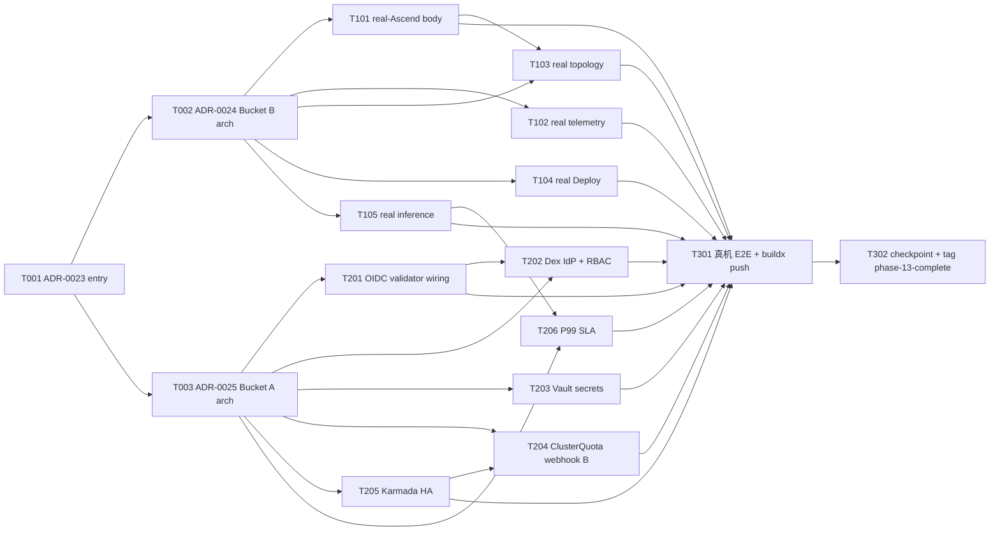

# Phase 13 Plan — 真生产化收口(real 版完整化 + 真硬件点亮)· 项目收官

> **Goal**: Phase 13 是**项目收官 phase**。Phase 12 已交付 **demo / real 两版架构分离**
> (config + deploy profile · 见 `docs/checkpoint-phase12.md` §6 + `3765f5c`)· **demo 版完整**。
> 本 phase 的唯一目标 = **把 real(生产)版剩余的 stub / mock / ErrNotImplemented 缺口全部填成真体**,
> 让 demo / real 隔离彻底闭合,项目 deliverable 完整交付。**两桶同时 IN-scope**(2026-06-02
> 用户两决策):
> - **Bucket B · 真硬件 body(lab 已就位 · 本阶段点亮)**: 真硬件 lab 已可访问 →
>   翻转 ADR-0011 §3 连续 6 phase 的 lab-gating default-defer →
>   real-Ascend Source body(npu-smi/DCMI · 解析器 `npusmi/parse.go` 已写+测)·
>   后端真拓扑聚合(`GetTopology` 替换 `ErrCapabilityUnavailable`)· 真 `Deploy()` 体 ·
>   真 PCIE/HCCS/network/utilization telemetry(替换 simulator fixture)·
>   真 CANN + vllm-ascend PD 分离推理 · real profile topology/deploy 解锁。
> - **Bucket A · 生产硬化(纯软件 · 完成 real 版的 §5 验收清单)**: OIDC/RBAC(替换静态
>   token · authn Validator 接口 P10-T-103 已 ship)· Vault/external-secrets(替换静态
>   secret)· ClusterQuota admission webhook B 真强制 + 跨集群 usage reconcile(schema
>   P11-T-104 已落)· Karmada control-plane HA(承 P11-T-102 bootstrap)· vLLM PD P99
>   SLA harness。**每个 task 1:1 对应 `docs/build-and-production-validation.md` §5
>   生产硬化验收清单 / §4.4 真机特有验证 / `deploy/profiles/real/README.md` 的一个具体
>   gap** —— 不为完整性堆 padding,每个 task 关一个文档化缺口。
>
> **Milestone**: **M7 真生产化收口**(final milestone)。**项目 deliverable 在
> `phase-13-complete` 完整交付 · 不规划 Phase 14**。candidate-streams 把 production-
> hardening cohort 描述为 "~3-4 phase" 是 *workload* 视角;用户 2026-06-02 明确以
> *deliverable* 视角收口 —— "demo 已完成,剩余生产化隔离完成就可以"。4 个 active
> carry(Volcano / Partitionable Devices / Go v1 ResourceSlice migration / G6 5.x 重写)
> **显式移出项目核心交付物**,降级为 "信号触发的可选扩展 · 不 gating 收口 · 不构成 Phase 14"
> (见 §7)。
>
> **Duration**: ~6-8 weeks calendar(W1 foundation 3 ADR · W2 Bucket B 真硬件 body 5 ·
> W3 Bucket A 生产硬化 6 · Closer 2)· 16 task。
>
> **Phase 13 uncertainty profile**: high —— **最弱环 = 真硬件集成 surface 的未知**
> (P5):synthetic fixture(set-a/b/c · parse_test.go)按*预期* npu-smi / DCMI 格式建模,
> 真 910B 硅片的驱动版本 / CANN 兼容性 / npu-smi 输出变体可能偏离 fixture → 估算偏移
> 风险集中在 T101-T105。**Fallback**(P3 诚实 · 不重开 Phase 14):若某一具体真硬件集成
> 点 block(如某 DCMI 字段在 lab 驱动版本缺失)→ 交付该 body + 把*那一个*验证点标
> lab-driver-gated,项目仍按 "软件完整 + best-effort 真机验证" 收口 · 不因单点 surface
> 而开新 phase。次弱环 = 两处*甲方输入*(OIDC IdP 选型 / P99 SLO 阈值)→ 用 Dex 参考
> IdP + 文档化 default SLO + 标注 swap point 兜底,不 block 收口。
>
> **Prereq**: `phase-12-complete`(dev HEAD post-CI gate · `f0ce285`)· demo/real profile
> 分离(`3765f5c` · `deploy/profiles/{demo,real}/` 各 4 values)· real-Ascend stub
> (`operators/npu-dra-driver/internal/source/realascend/realascend.go` · `npusmi/parse.go`
> 已写+测)· authn Validator 接口(`operators/o2-dms-adapter/internal/authn/authn.go` ·
> P10-T-103)· ClusterQuota schema(`operators/inference-operator/api/v1alpha1/
> clusterquota_types.go` · P11-T-104)· Karmada bootstrap(`deploy/karmada/` · P11-T-102/
> T103 · 4 propagation policy)· ADR-0011 §2 §3(Source 接口 + lab gating policy =
> Bucket B 翻转目标)· ADR-0016 §2 Decision B(lab posture re-eval triggers)· ADR-0013/
> 0014(O2 DMS authn + 多租户 Quota)· ADR-0018(Karmada 拓扑)· `docs/build-and-
> production-validation.md`(§4.4 真机验证 + §5 生产硬化验收清单 = 本 phase 的逐项 DoD)·
> `docs/checkpoint-phase12.md` §6(Phase 13+ handoff brief)· `docs/devlog/phase-13-
> kickoff-handover.md`(本 phase 入口)· `docs/phase12-candidate-streams.md`(production-
> hardening cohort source-of-truth)。Root CLAUDE.md §14(devlog + 模块 DESIGN.md)
> applies · `docs/agent-coordination.md` §0a.5(chat+ADR self-RFC)+ §0a.10-12(plan/
> execute split + strict-per-task verify + push 协议)applies。
> Per memory `feedback_plan_vs_execute_session_split.md`,**this plan commits + stops**;
> P13-T-001 执行是 separate session。

---

## 1. Scope summary

Phase 13 交付 2 桶 · 16 task。**Bucket B** 点亮真硬件,把 real 版的 4 处运行时缺口
(NPU 分配 / topology / deploy / telemetry / 推理)填成真体;**Bucket A** 完成 real 版的
§5 生产硬化验收清单(authn / secret / quota / HA / SLA)。**demo 版 = 长期一等功能验证台 · 本 phase 不动**
(Phase 12 deliverable · 持续承担功能/CI/演示快速验证 · 非用完即冻)。

| 桶 / 主题 | 当前 real 版状态(verified) | Phase 13 delivery | §5/§4.4 DoD |
|---|---|---|---|
| **B1 · 真 NPU 发现/分配**(real-Ascend) | `realascend.go:75-92` List/Watch/QueryTopology 全返回 `ErrNotImplemented` · `npusmi/parse.go` 解析器已写+测 · helm `sourceType: real-ascend` 已选但 stub | T101 填 3 method 真体(npu-smi info + DCMI · 复用 parse.go) | §4.4(1)(2) 真 NPU 发现 + 真切片 |
| **B2 · 真 telemetry** | `exporters/.../collector/sources/{dcmi,npu_smi,cgroup}.go` 存在但 stub · simulator.go 为当前 live 源 | T102 填 DCMI/npu-smi 真读 · simulator off path | §4.4(3) 真 PCIE/HCCS/network/util |
| **B3 · 真拓扑聚合** | backend `{k8s,crd,configmap}/source.go` `GetTopology` 返回 `ErrCapabilityUnavailable` · `config.real.yaml:61` `topology: mock` | T103 k8s/crd `GetTopology` 真体(ResourceSlice attr + NPUPool.status.hccsTopology) | §4.4(3) 真拓扑替换 fixture |
| **B4 · 真 Deploy()** | backend `Deploy()` 返回 `ErrCapabilityUnavailable` · `config.real.yaml:68` `deploy: mock` | T104 k8s source 真 `Deploy()/DeleteDeploy()`(apply Deployment+Service+RBAC) | real README deploy gap |
| **B5 · 真推理** | `inference-operator` deployment_builder 有 PD 形状 · 无真 vllm-ascend image / model mount | T105 真 CANN + vllm-ascend PD 分离 image + model mount + PD Router 真 endpoint | §4.4(4) 真推理 |
| **A1 · OIDC/RBAC** | authn `OIDCValidator`/`K8sTokenReviewValidator` 接口 ship 但未配置即 `ErrInvalidToken` · o2-dms `main.go` 未 wire middleware · backend prometheus 静态 Bearer | T201 填 validator 真体(JWKS+JWT / TokenReview)+ wire middleware + backend SA token · T202 Dex 参考 IdP + RBAC manifest | §5 认证授权 |
| **A2 · Secret 管理** | `config.real.yaml` 硬编码 URL · install.sh 静态拷贝 · 无 Vault | T203 external-secrets + Vault 注入 · helm secret ref · install.sh vault client | §5 Secret 管理 |
| **A3 · 多租户配额强制** | ClusterQuota schema + `RecomputeTotal()` 已落 · webhook B 仅 namespace 级 · scaler 无 ClusterQuota 读路径 | T204 webhook B 读 `ClusterQuota.status.usage.Total` 强制 + NPUVerticalScaler scale-rate + quota tick + Karmada PerCluster populate | §5 多租户配额强制 |
| **A4 · Karmada 多站点 HA** | `deploy/karmada/` bootstrap 单 control-plane + 2 member(P11-T-102)· 无 HA topology | T205 control-plane 3-replica + 外置 etcd + propagation 加固 + cross-cluster RBAC | §5 Karmada 多站点 HA |
| **A5 · 推理 SLA** | scaler 无 P99 latency 采集 · 无压测 harness | T206 vLLM PD load-test harness + P99 测量(真硬件)+ default SLO doc + scaler latency feedback | §5 推理 SLA |

**Out of scope(显式移出项目核心交付物 · §7 详 · 非 Phase 14)**:
- **4 active carry**(Volcano gang-scheduling / Partitionable Devices KEP-4815 / Go v1
  ResourceSlice schema migration / Frontend G6 5.x 重写)—— 均**不属 real 版完整化**,降级
  为信号触发的可选扩展 · 不 gating `phase-13-complete` 收口。
- **Frontend** —— demo 版 one-page workspace(Phase 12)即 real 版前端 · 前端展示门面与
  数据源真实化解耦(后端切真源 · 前端零改动)· Phase 13 **前端不动**(除非真数据 surface
  渲染 bug → 小 fix)。

---

## 2. Task package overview(16 tasks · 3 W1 + 5 W2 + 6 W3 + 2 Closer)

```
W1 Foundation(3 task · docs/ADR · 全 main-agent serial · entry gate)
├── P13-T-001  ADR-0023 Phase 13 entry decisions(spine = real 版完整化 + 真硬件点亮 →
│              项目收口 · M7 final milestone · 不规划 Phase 14 · lab-gating 翻转 ·
│              bucket A/B scope map · 4 carry 移出核心交付 · demo=长期功能验证台)
├── P13-T-002  ADR-0024 真硬件 lab 激活 + Bucket B 架构(Source.RealAscend 真体 + 真
│              topology/deploy/telemetry/inference · supersede ADR-0011 §3 lab-gating
│              default-defer · 承 ADR-0016 §2 Decision B re-eval triggers)
└── P13-T-003  ADR-0025 生产硬化架构(Bucket A:OIDC/RBAC authz model + Vault secret +
               ClusterQuota 真强制 + Karmada HA + P99 SLA · → build-doc §5 清单逐项 close)

W2 Bucket B · 真硬件 body(5 task · operators+backend+exporters · 跨模块 · 可 parallel if user batch)
├── P13-T-101  [B1] real-Ascend Source 真体(realascend.go List/Watch/QueryTopology ·
│              npu-smi info + DCMI · 复用 npusmi/parse.go)+ npu-dra-driver real profile
├── P13-T-102  [B2] 真 NPU telemetry(exporter dcmi.go/npu_smi.go/cgroup.go 真读 ·
│              simulator off)+ ascend-npu-exporter-plus real profile
├── P13-T-103  [B3] backend 真拓扑聚合(k8s/crd GetTopology 真体 · 替换 ErrCapabilityUnavailable)+ demo-backend real profile topology→real
├── P13-T-104  [B4] backend 真 Deploy()/DeleteDeploy()(k8s source apply)+ demo-backend real profile deploy→real
└── P13-T-105  [B5] 真 CANN + vllm-ascend PD 分离推理(deployment_builder 真 image + model mount + PD Router 真 endpoint)+ inference real profile

W3 Bucket A · 生产硬化(6 task · operators+deploy+backend · 跨模块 · 可 parallel if user batch)
├── P13-T-201  [A1] OIDC/TokenReview validator 真体 + middleware wiring(authn.go +
│              o2-dms main.go + backend prometheus SA token)
├── P13-T-202  [A1] Dex 参考 IdP 部署 + RBAC manifest + helm authz wiring
├── P13-T-203  [A2] Vault/external-secrets(替换静态 secret · helm secret ref · install.sh)
├── P13-T-204  [A3] ClusterQuota webhook B 真强制 + 跨集群 usage reconcile(quota_admission +
│              NPUVerticalScaler scale-rate + quota tick + Karmada PerCluster populate)
├── P13-T-205  [A4] Karmada control-plane HA(3-replica + 外置 etcd + propagation 加固 + cross-cluster RBAC)
└── P13-T-206  [A5] vLLM PD P99 SLA harness(load-test + P99 测量真硬件 + default SLO doc + scaler latency feedback)

Closer(2 task)
├── P13-T-301  真机端到端 E2E(real arm64 集群 helm install real profile · build-doc §4.4
│              5 项真机验证 · Pod Ready + 真 NPU 拓扑 + 真 telemetry + 真推理)+ buildx
│              镜像 push registry(deferred Track A CI piece)+ e2e-kind arm64(若适用)
└── P13-T-302  docs 收官 + checkpoint-phase13 + build-doc §4.4/§5 🔴→🟢 stamp + tag
               phase-13-complete + 项目收官 announcement(M7 final · 无 Phase 14)
```



**Subagent parallelisation candidates**(per §0a.11 strict-verify — default ONE subagent
at a time · main agent verifies before next · 仅 user 显式 "batch" cue 时机会性并行 across
module boundaries):
- **T001-T003 docs/ADR** — 全 main-agent serial(T001 是 T002/T003 gate)。
- **Bucket B(T101 npu-dra-driver · T102 exporters · T103/T104 backend · T105 inference-
  operator)** 跨 4 模块 · **可 parallel if user batch**;T103 软依赖 T101(真 ResourceSlice
  attr 是 T103 真拓扑的数据源 · 但 T103 可对 expected schema 先开发)。
- **Bucket A(T201/T204 operators · T202/T203/T205 deploy · T201 backend 片)** 跨模块 ·
  **可 parallel if user batch**;T202 依赖 T201(validator 真体 land 后 IdP/RBAC 才有
  consumer)· T204 软依赖 T205(cross-cluster usage populate 需 Karmada HA path)。
- **T206 依赖 T105**(真推理 land 后才能压测量 P99)。
- **T301 真机 E2E 必在 T101-T206 全 land 后 run**(全链真机)· **T302 docs-only**。

**§0a.5 chat+ADR self-RFC**:Phase 13 引入 3 ADR(0023 entry · 0024 Bucket B 真硬件激活
supersede ADR-0011 §3 · 0025 Bucket A 生产硬化架构)。**共享契约预计零 YAML 改动**——
real 版填的是*既有契约*的真体(topology 边 / DeployRequest/Response / ClusterQuota schema
均 Phase 11/12 已落)· 故**无 api-contract.yaml / schema.json / pool-operator CRD RFC**。
若 T204 发现 `ClusterQuotaStatus.Usage` 需补字段 → 走 §0a.5 chat+ADR + main-agent serial
(ClusterQuota types 在 inference-operator · 非 pool-operator 强串行集 · 但 CRD 字段变更仍
走 ADR)。

**Lab posture 翻转(本 phase 唯一 decision-gated 已决)**:ADR-0011 §3 lab-gating 连续
6 phase(P7-P12)default-defer · **2026-06-02 用户 lab-ready 信号 → 翻转 light-up**(ADR-
0016 §2 Decision B trigger "ad-hoc lab access materialise" 兑现)· ADR-0024 codify。Bucket
B 不再是 carry · 是本 phase deliverable。

---

## 3. W1 task packages(Foundation · docs/ADR · 全 main-agent serial)

### P13-T-001 ADR-0023 — Phase 13 entry decisions(项目收官)

Owner: docs (no code).

**Allowed Paths**:
- `docs/adr/0023-phase-13-entry-decisions.md` (new — §1 Context(Phase 12 closer demo/real
  profile 分离 land · demo 完整 · 2026-06-02 用户两决策:收官视角 "demo 已完成,剩余生产化
  隔离完成就可以" + 真硬件 lab 已就位)· §2 Decision A: spine = **real 版完整化 + 真硬件
  点亮 → 项目收口**(填平所有 stub/mock/ErrNotImplemented · 非跨 phase production-hardening
  marathon)· §2 Decision B: milestone = **M7 真生产化收口**(final · project deliverable
  在 phase-13-complete 完整交付 · **不规划 Phase 14** · candidate-streams "~3-4 phase" 是
  workload 视角 · 用户以 deliverable 视角收口)· §2 Decision C: **lab-gating 翻转**(ADR-
  0011 §3 6-phase default-defer → light-up · Bucket B 进 scope · 详 ADR-0024)· §2 Decision
  D: Bucket A scope = build-doc §5 生产硬化验收清单逐项(右-sized reference-grade · 详 ADR-
  0025)· §2 Decision E: **demo 版 = 长期一等功能验证台**(Phase 12 deliverable · 本 phase 不动 ·
  持续承担功能/CI/演示快速验证 · real 版填真体 · clean demo/real 隔离 = 收口判据)· §2 Decision F: **4 carry 移出核心交付物**
  (Volcano / Partitionable / Go v1 migration / G6 · 信号触发可选扩展 · 不 gating 收口 ·
  不构成 Phase 14)· §3 16-task scope cross-ref §2 · §4 Open questions(a 甲方 IdP 选型 →
  Dex 兜底 · b P99 SLO 阈值 → default SLO 兜底 · c 真硬件单点 block 的 fallback posture)·
  §5 引用)
- `docs/architecture.md` (small edit — §1.3 phase 路线图加 **M7 真生产化收口 / Phase 13**
  row · §13 review-table Phase 13 row "in flight via P13-T-001..T302" · §7 路线图 M7
  "Phase 13+" → "Phase 13" final)
- `README.md` (small edit — §7 路线图 M7 row "Phase 13+" → "Phase 13"(final · 去 "+"))
- `docs/devlog/phase-13-t001.md`

Acceptance:
- ADR §2 Decision A-F: spine / M7 final / lab 翻转 / Bucket A scope / demo 验证台 / carry 移出
- §3 16-task scope cross-ref §2 · §4 3 Open questions + fallback posture
- arch §1.3 M7 row + §13 Phase 13 row · README §7 M7 final
- ADR 明确 codify "**不规划 Phase 14**" + carry 非 phase

Dependencies: `phase-12-complete`.

Estimated effort: 0.5d.

---

### P13-T-002 ADR-0024 — 真硬件 lab 激活 + Bucket B 架构(supersede ADR-0011 §3 lab-gating)

Owner: docs (no code).

**Allowed Paths**:
- `docs/adr/0024-real-hardware-activation.md` (new — §1 Context(ADR-0011 §3 lab-gating
  连续 6 phase default-defer · 2026-06-02 lab-ready 信号 · ADR-0016 §2 Decision B trigger
  兑现)· §2 Decision A: **lab-gating policy 翻转**——`real-ascend` Source 从 stub →
  真体 · `npusmi/parse.go` 已写+测为 substrate · §2 Decision B: real-Ascend body =
  `npu-smi info`(inventory)+ `npu-smi info -t topo`(HCCS ring · 走 parse.go)+ DCMI
  health watch · §2 Decision C: backend 真拓扑 = k8s source 读 ResourceSlice
  `npu.huawei.com/hccs_ring`+`numa_node` attr · crd source 读 `NPUPool.status.hccsTopology`
  (Phase 6 P6-T-003)· §2 Decision D: 真 telemetry = exporter DCMI/npu-smi source 替换
  simulator(`simulator.enabled=false`)· §2 Decision E: 真 Deploy() = k8s source apply
  Deployment+Service · §2 Decision F: 真推理 = vllm-ascend/MindIE image + model mount ·
  §2 Decision G: **demo/real decoupling-seam invariant**(build-doc §0.1 "不 fork 代码" 的
  enforcement 形式)—— real 专属逻辑只在 `Source` 接口缝**以下**(Source 实现内);缝**以上**
  共享层(aggregator / handler / 前端)profile 无关 · 只消费 Source 返回形状 · 禁 `if real {}`
  分支 · 保证 demo/real 相互验证/工作不影响(开发解耦的充要条件)· §3 真机集成风险 + fallback(单点 block → body 交付 + 该验证点 lab-driver-gated · 不开
  phase)· §4 Open questions(lab K8s 版本 → 决定 Go v1 ResourceSlice migration 是否随
  T101 · driver/CANN 版本 pin)· §5 引用 ADR-0011 §2 §3 + ADR-0016 §2)
- `docs/adr/0011-npu-dynamic-slicing-and-source-interface.md` (small edit — §3 lab gating
  status flip "**lab activated by ADR-0024 (2026-06-02 · Phase 13)** · 6-phase default-defer
  期结束 · real-ascend body land")
- `docs/architecture.md` (small edit — 真硬件对接章节 + Source 接口章节 cross-ref ADR-0024)
- `docs/devlog/phase-13-t002.md`

Acceptance:
- ADR §2 Decision A-G: lab 翻转 + 5 真体架构(Source/topology/telemetry/deploy/inference)+ decoupling-seam invariant
- ADR-0011 §3 status: lab activated by ADR-0024 stamp
- §3 真机集成风险 + 单点 fallback posture(不重开 phase)
- §4 lab K8s 版本 entry-check → Go v1 migration 条件(见 §7)

Dependencies: T001.

Estimated effort: 1d.

---

### P13-T-003 ADR-0025 — 生产硬化架构(Bucket A · → build-doc §5 清单 close)

Owner: docs (no code).

**Allowed Paths**:
- `docs/adr/0025-production-hardening-architecture.md` (new — §1 Context(build-doc §5
  生产硬化验收清单 6 项 · real README "仍 lab-gated" 列表 · ADR-0013/0014/0018 forward
  note)· §2 Decision A: **authz model** = o2-dms `K8sTokenReviewValidator`(in-cluster
  SA)主路径 + `OIDCValidator`(外部 IdP)· Dex 参考 IdP(甲方 swap point)· backend
  prometheus 静态 Bearer → SA token · K8s RBAC manifest · §2 Decision B: **secret** =
  external-secrets-operator + Vault backend · 替换静态 token / install.sh 静态拷贝 ·
  §2 Decision C: **quota 真强制** = webhook B 读 `ClusterQuota.status.usage.Total` 强制 +
  NPUVerticalScaler scale-rate check + quota controller tick + Karmada `PerCluster` populate
  · §2 Decision D: **Karmada HA** = control-plane 3-replica + 外置 etcd · §2 Decision E:
  **P99 SLA** = load-test harness + P99 测量(真硬件)+ **文档化 default SLO**(甲方 swap)+
  scaler latency feedback · §3 right-sizing 声明(reference-grade · 非 gold-plated:Dex 非
  full IAM · external-secrets 非多区 Vault 集群 · 3-replica 非 full DR · P99 harness 非甲方
  SLO 合同)· §4 Open questions(IdP/SLO 甲方依赖 → default 兜底 · cert split 留 incident-
  driven)· §5 引用 ADR-0013/0014/0018)
- `docs/architecture.md` (small edit — §6 多租户/Quota 章节 + authz 章节 cross-ref ADR-0025)
- `docs/devlog/phase-13-t003.md`

Acceptance:
- ADR §2 Decision A-E: authz / secret / quota / HA / SLA 架构
- §3 right-sizing 声明(每项 reference-grade 边界 · 防 P3 gold-plating)
- 每 Decision 1:1 map build-doc §5 清单一项

Dependencies: T001.

Estimated effort: 1d.

---

## 4. W2 task packages(Bucket B · 真硬件 body · 跨模块)

### P13-T-101 [B1] real-Ascend Source 真体

Owner: operators(`operators/npu-dra-driver/**`).

**Allowed Paths**:
- `operators/npu-dra-driver/internal/source/realascend/realascend.go` (edit — `List()`:
  shell `npu-smi info` 解析 device inventory(model/memory/HBM BW)→ `[]source.NodeDevices`·
  `QueryTopology()`: `npu-smi info -t topo` → `npusmi.ParseTopoMatrix()` → `*source.
  HCCSTopology`(ring + NUMA)· `Watch()`: DCMI health poll loop(或 closed channel 若 lab
  驱动不支持)· `New()` 加 config validation(npu-smi binary 存在 / hostPath mount))
- `operators/npu-dra-driver/internal/source/realascend/*.go`(新 exec/dcmi helper · 如
  `exec.go` shell-out wrapper · `dcmi.go` DCMI binding · 按需)
- `operators/npu-dra-driver/internal/source/realascend/realascend_test.go` (new/edit —
  table-test 喂 captured npu-smi 输出 fixture · assert inventory + topology · DCMI mock)
- `operators/npu-dra-driver/internal/source/realascend/npusmi/*`(只读复用 · parse.go 已写+
  测 · 若 lab 输出变体需扩 parser → edit + 补 test)
- `deploy/profiles/real/npu-dra-driver.values.yaml` (edit — 确认 `sourceType: real-ascend`
  + `--enable-publisher`/`--enable-claim-controller` real allocator · 去 stub 注释)
- `docs/devlog/phase-13-t101.md`

Acceptance:
- `List/QueryTopology/Watch` 不再返回 `ErrNotImplemented` · 喂 captured npu-smi fixture
  table-test PASS · `go test ./internal/source/realascend/...` 通
- `go build` + `go vet` + 覆盖率维持 · `GOARCH=arm64 go build ./...` 交叉编译通(ADR-0020)
- real profile sourceType=real-ascend · publisher/claim-controller real path
- **真机 verify**(§8):lab 节点 `npu-smi info` 真跑 → ResourceSlice device 数/属性 = 真 910B
  (build-doc §4.4(1))· 若 lab 驱动输出偏离 fixture → 扩 parser + 记 devlog
- 横向扫(P4):`grep -rn "ErrNotImplemented" operators/npu-dra-driver/internal/source/realascend/`
  余 0(或仅注释)

Dependencies: T002.

Estimated effort: 2.5d.

---

### P13-T-102 [B2] 真 NPU telemetry(exporter)

Owner: exporters(`exporters/ascend-npu-exporter-plus/**`).

**Allowed Paths**:
- `exporters/ascend-npu-exporter-plus/internal/collector/sources/dcmi.go` (edit — DCMI
  `libdcmi.so` binding 真读:utilization% / memory / HBM BW / temp / power · 或 cgo/exec
  per lab 可行)
- `exporters/ascend-npu-exporter-plus/internal/collector/sources/npu_smi.go` (edit —
  `npu-smi info -i <id>` 真读 fallback)
- `exporters/ascend-npu-exporter-plus/internal/collector/sources/cgroup.go` (edit —
  workload cgroup 真读 · per-container NPU 占用)
- `exporters/ascend-npu-exporter-plus/internal/collector/sources/sources.go`(edit — source
  selector mock/simulator/real 分流)
- `exporters/ascend-npu-exporter-plus/internal/collector/{npu,slice,workload}.go`(edit —
  consume 真 source · PCIE/HCCS/network 带宽 stamp)
- `exporters/ascend-npu-exporter-plus/internal/collector/sources/*_test.go`(edit/new —
  captured DCMI/npu-smi fixture table-test)
- `deploy/profiles/real/ascend-npu-exporter-plus.values.yaml` (edit — `simulator.enabled=
  false` + DCMI socket/hostPath mount)
- `docs/devlog/phase-13-t102.md`

Acceptance:
- DCMI/npu-smi source 真读 · `simulator.enabled=false` path · captured fixture test PASS
- `go test ./...` + `go build` + `GOARCH=arm64` 交叉编译通
- real profile simulator off · DCMI mount 配置
- **真机 verify**(§8):lab `curl :PORT/metrics | grep ascend_npu_` → 真 utilization/HBM/
  PCIE/HCCS 序列(非 simulator 正弦 · build-doc §4.4(3))
- 横向扫:PCIE/HCCS/network/utilization 不再来自 simulator fixture(real profile path)

Dependencies: T002 · 软依赖 T101(DCMI/npu-smi 同节点访问模式对齐)。

Estimated effort: 2.5d.

---

### P13-T-103 [B3] backend 真拓扑聚合

Owner: backend(`backend/**`).

**Allowed Paths**:
- `backend/pkg/datasource/k8s/source.go` (edit — `GetTopology()` 替换 `ErrCapabilityUnavailable`:
  list ResourceSlice → 读 `npu.huawei.com/hccs_ring`+`numa_node` attr → build ring map →
  `*model.Topology`(含真 HCCS/PCIE 边))
- `backend/pkg/datasource/crd/source.go` (edit — `GetTopology()` 读 `NPUPool.status.
  hccsTopology` 聚合 by node)
- `backend/pkg/aggregator/topology.go` (edit — `IncludeFabric=true` 时 append `hccs`/
  `network` 边 · 复用 Phase 12 edge type enum · **缝上共享层 · 必 profile 无关**(ADR-0024
  §2 Decision G):只消费 Source 返回的 ring/fabric 形状 · 对 mock 夹具与真 HCCS 走**同一段
  代码** · 禁 `if real {}` · 真带宽/utilization 由 Source 提供 · 非此处分支)
- `backend/pkg/aggregator/topology_test.go` (edit — 真拓扑 path 断言 · ring/numa fixture)
- `backend/pkg/model/*.go`(edit — 若需补真拓扑 DTO 字段 · 与既有契约一致 · 无契约改动)
- `backend/configs/config.real.yaml` (edit — `topology: mock` → `topology: k8s`(或 crd)·
  去 "PHASE-13: GetTopology = ErrCapabilityUnavailable" 注释)
- `deploy/profiles/real/demo-backend.values.yaml` (edit — topology mapping → real source)
- `docs/devlog/phase-13-t103.md`

Acceptance:
- k8s/crd `GetTopology` 不再返回 `ErrCapabilityUnavailable` · ring/numa fixture test PASS
- `make test && make lint`(backend)通 · 覆盖率核心包 ≥70% 维持 · `GOARCH=arm64` 通
- config.real.yaml topology 非 mock · real profile topology→real
- **缝上 profile 无关守恒**(ADR-0024 §2 Decision G):aggregator 无 `if real {}` 分支 · grep
  `topology.go` 无 profile 条件 · demo profile(mock 源)`/api/v1/topology` 回归不破
- **真机 verify · 对接 stamp**(§8):lab real profile 起 backend → `/api/v1/topology` 返回真
  HCCS ring(与 `npu-smi info -t topo` 一致 · build-doc §4.4(3))· 只验对接 · 功能正确性由 demo 持续保

Dependencies: T002 · 软依赖 T101(真 ResourceSlice attr 由 real-Ascend publisher 产出)。

Estimated effort: 2d.

---

### P13-T-104 [B4] backend 真 Deploy()/DeleteDeploy()

Owner: backend(`backend/**`).

**Allowed Paths**:
- `backend/pkg/datasource/k8s/source.go` (edit — `Deploy(ctx, *DeployRequest)`:apply
  Deployment+Service(+ 必要 RBAC)via client-go · 返回 `*DeployResponse`(deployID+status)·
  `DeleteDeploy(ctx, deployID)`:删除 owned 资源)
- `backend/pkg/datasource/k8s/*.go`(edit — deploy helper · label/owner-ref 约定)
- `backend/pkg/datasource/k8s/*_test.go`(edit/new — fake clientset apply 断言)
- `backend/configs/config.real.yaml` (edit — `deploy: mock` → `deploy: k8s` · 去注释)
- `deploy/profiles/real/demo-backend.values.yaml` (edit — deploy mapping → real · backend
  ServiceAccount RBAC(create deploy/svc 权限))
- `docs/devlog/phase-13-t104.md`

Acceptance:
- `Deploy`/`DeleteDeploy` 不再返回 `ErrCapabilityUnavailable` · fake clientset test:
  POST /deploy → Deployment+Service materialise · DELETE → 清理
- `make test && make lint` + `GOARCH=arm64` 通 · config.real.yaml deploy 非 mock
- **真机 verify**(§8):lab real profile `POST /api/v1/deploy` → `kubectl get deploy,svc`
  真 materialise · `DELETE` 真清理(real README deploy gap close)

Dependencies: T002.

Estimated effort: 2d.

---

### P13-T-105 [B5] 真 CANN + vllm-ascend PD 分离推理

Owner: operators(`operators/inference-operator/**`).

**Allowed Paths**:
- `operators/inference-operator/internal/controller/deployment_builder.go` (edit — Prefill/
  Decode Deployment 注真 vllm-ascend/MindIE image + model weights volume mount + CANN env
  (ASCEND_RT_VISIBLE_DEVICES / npu resource request)· 替换 mock/placeholder image)
- `operators/inference-operator/internal/webhook/pd_router.go`(edit — PD Router 注真 PD
  endpoint(prefill→decode KV cache 传输路径)· slice-binding 注解真 NPU)
- `operators/inference-operator/internal/controller/*_test.go`(edit — 真 image/mount 断言)
- `operators/inference-operator/config/samples/*.yaml`(edit — Qwen 8B PD ModelService 真样例)
- `deploy/profiles/real/inference-operator.values.yaml` (edit — 真 image registry + model
  mount path + CANN runtime)
- `docs/devlog/phase-13-t105.md`

Acceptance:
- deployment_builder 产真 vllm-ascend PD Deployment(非 mock image)· Prefill+Decode 两
  Deployment + slice-binding 注解 · `go test ./...` + `GOARCH=arm64` 通
- real profile 真 image + model mount
- **真机 verify**(§8):lab apply Qwen 8B PD ModelService → Prefill/Decode Pod Ready on
  真 910B · 推理请求返回(build-doc §4.4(4))

Dependencies: T002 · 软依赖 T101(真 NPU 分配)。

Estimated effort: 3d.

---

## 5. W3 task packages(Bucket A · 生产硬化 · 跨模块)

### P13-T-201 [A1] OIDC/TokenReview validator 真体 + middleware wiring

Owner: operators + backend(`operators/o2-dms-adapter/**` + `backend/pkg/datasource/prometheus/**`).

**Allowed Paths**:
- `operators/o2-dms-adapter/internal/authn/authn.go` (edit — `OIDCValidator.Validate()`:
  JWKS fetch(IssuerURL)+ JWT 签名/claims(aud/iss/exp/AllowedClaims)验证 · `K8sToken
  ReviewValidator.Validate()`:构造 `authentication.k8s.io/v1.TokenReview` + 调 K8s API ·
  去 `ErrInvalidToken` 未配置短路)
- `operators/o2-dms-adapter/internal/authn/authn_test.go` (edit — JWKS mock server + fake
  TokenReview clientset 断言 · 有效/过期/错 aud 三态)
- `operators/o2-dms-adapter/cmd/main.go` (edit — wire `Middleware(validator)` 到 chi router ·
  config 选 validator(K8sTokenReview 主路径 / OIDC 外部 IdP)· 替换 `PlaceholderBearerValidator`)
- `backend/pkg/datasource/prometheus/source.go` + `backend/pkg/datasource/prometheus/metrics.go`
  (edit — 静态 Bearer → in-cluster ServiceAccount token(`/var/run/secrets/...` mount · 自动
  rotate))
- `docs/devlog/phase-13-t201.md`

Acceptance:
- OIDC/TokenReview `Validate()` 真体 · authn_test 三态 PASS · `go test ./...` + `GOARCH=arm64` 通
- o2-dms main.go 不再用 PlaceholderBearer · middleware 挂 chi router
- backend prometheus 用 SA token(非静态 Bearer)
- 横向扫(P4):`grep -rn "PlaceholderBearer\|静态.*[Tt]oken\|Bearer \"+s.bearer" operators/o2-dms-adapter backend/` 余项全部 superseded/注释
- **verify**:`helm template` o2-dms + backend → SA token mount + RBAC 渲出

Dependencies: T003.

Estimated effort: 2.5d.

---

### P13-T-202 [A1] Dex 参考 IdP 部署 + RBAC manifest

Owner: deploy(`deploy/**`).

**Allowed Paths**:
- `deploy/helm-charts/*/templates/rbac.yaml`(edit/new — 各组件最小权限 Role/ClusterRole +
  Binding · backend deploy/svc create · scaler quota read · 横向扫全 chart 一致)
- `deploy/idp/`(new — Dex 参考部署 manifest/chart + values · OIDC issuer config · o2-dms/
  backend audience)
- `deploy/profiles/real/*.values.yaml`(edit — authz enabled + IdP issuerURL + audience wiring)
- `deploy/karmada/policies/*.yaml`(edit — cross-cluster RBAC propagation 若需)
- `docs/devlog/phase-13-t202.md`
- `deploy/idp/README.md`(new — Dex = 参考 IdP · 甲方 swap point 说明)

Acceptance:
- Dex 部署 manifest `helm template`/`kubectl apply --dry-run=server` clean
- 各 chart RBAC 最小权限渲出 · `helm lint --strict` clean
- real profile authz enabled + IdP wiring
- README 明确 Dex = 参考实现 · 甲方 IdP swap point(ADR-0025 §4(a))
- **verify**:dry-run apply Dex + RBAC · o2-dms 拿 Dex token 过 OIDCValidator(集成点 T301 真机)

Dependencies: T003 + T201。

Estimated effort: 1.5d.

---

### P13-T-203 [A2] Vault / external-secrets

Owner: deploy(`deploy/**` `scripts/**` + `backend/configs/**` config-only).

**Allowed Paths**:
- `deploy/helm-charts/*/templates/*secret*.yaml` + `.../externalsecret.yaml`(new/edit —
  ExternalSecret CR 指向 Vault path · 替换 inline secret/明文)
- `deploy/secrets/`(new — external-secrets-operator install + Vault SecretStore + README)
- `scripts/install.sh` (edit — external-secrets-operator install + Vault client/approle
  setup 分支 · 去静态拷贝)
- `backend/configs/config.real.yaml` (edit — 硬编码 URL/token → secret ref(env from
  Secret · external-secrets 注入))
- `deploy/profiles/real/*.values.yaml`(edit — secret ref wiring)
- `docs/devlog/phase-13-t203.md`
- `deploy/secrets/README.md`(new — Vault = 参考 backend · 甲方 swap)

Acceptance:
- ExternalSecret + SecretStore manifest `helm template`/dry-run clean
- config.real.yaml 无硬编码 secret(env-from-Secret)· install.sh `bash -n` 通
- 横向扫(P4):`grep -rn "Bearer [A-Za-z0-9]\|password:\|token: \"" deploy/ backend/configs/config.real.yaml configs/`
  余项全部 secret ref / 注释 / demo-only
- **verify**:dry-run external-secrets · 静态 secret 消除(real profile)

Dependencies: T003.

Estimated effort: 2d.

---

### P13-T-204 [A3] ClusterQuota webhook B 真强制 + 跨集群 usage reconcile

Owner: operators(`operators/inference-operator/**`).

**Allowed Paths**:
- `operators/inference-operator/internal/webhook/quota_admission.go` (edit — 加
  `ValidateClusterQuota()` path:读 cluster-scoped `ClusterQuota` → 校验 `status.usage.
  Total.CurrentSliceAllocations >= spec.enforcement.MaxSliceAllocations` → 拒/放 · webhook B
  scale-rate(maxScaleEventsPerWindow)真强制 · fail-open 兜底)
- `operators/inference-operator/internal/controller/npuverticalscaler_controller.go` (edit —
  scale action 前读 `ClusterQuota.status.usage.Total` · 校验 scale 不超 cluster cap)
- `operators/inference-operator/internal/controller/clusterquota_controller.go`(new/edit —
  tick reconcile:聚合 namespace usage → `ClusterQuotaStatus.Usage` · Karmada `PerCluster`
  populate(aggregated-apiserver / member cluster usage 累计)· `RecomputeTotal()`)
- `operators/inference-operator/internal/{webhook,controller}/*_test.go`(edit — over-cap 拒 +
  under-cap 放 + cross-cluster sum + fail-open envtest)
- `operators/inference-operator/config/rbac/*.yaml`(edit — ClusterQuota read/status 权限)
- `docs/devlog/phase-13-t204.md`

Acceptance:
- webhook B 读 ClusterQuota.status.usage 真强制 · scaler scale-rate check · envtest over/
  under-cap + cross-cluster + fail-open PASS · `make test` + `GOARCH=arm64` 通
- quota controller tick populate PerCluster + RecomputeTotal
- **verify**:envtest apply ClusterQuota + over-cap NPUSliceAllocation → admission 拒 ·
  scaler 读 cluster cap(build-doc §5 多租户配额强制 close)

Dependencies: T003 · 软依赖 T205(Karmada cross-cluster usage populate path)。

Estimated effort: 2.5d.

---

### P13-T-205 [A4] Karmada control-plane HA

Owner: deploy(`deploy/karmada/**`).

**Allowed Paths**:
- `deploy/karmada/values.yaml` (edit — control-plane(apiserver/scheduler/controller-manager)
  `replicas: 3` + 外置 etcd 集群 endpoints(或 HA etcd statefulset)+ anti-affinity)
- `deploy/karmada/install.sh` (edit — HA topology bootstrap · 外置 etcd 起 · LB front 控面)
- `deploy/karmada/policies/*.yaml`(edit — propagation 加固:replica scheduling + failover +
  cross-cluster RBAC propagation)
- `deploy/karmada/README.md`(edit — HA topology 说明 + 外置 etcd 前置)
- `docs/devlog/phase-13-t205.md`

Acceptance:
- values.yaml control-plane 3-replica + 外置 etcd · `bash -n install.sh` 通
- propagation policy + cross-cluster RBAC 渲出
- **verify**:kind 多集群 install.sh(HA path)· `kubectl -n karmada-system get deploy`
  → 3 replica · 或 dry-run 渲染校验(真多机房 LB 留真机/lab)
- 真物理 multi-region LB 留 lab(ADR-0018 §2 · build-doc §5 Karmada HA 主体 close · LB
  bind 真网络 lab-gated)

Dependencies: T003。

Estimated effort: 2d.

---

### P13-T-206 [A5] vLLM PD P99 SLA harness

Owner: operators + tests(`operators/inference-operator/**` + `tests/**`).

**Allowed Paths**:
- `operators/inference-operator/internal/controller/npuverticalscaler_controller.go`(edit —
  P99 latency query(Prometheus / PD Router metric)→ scale feedback(busy/idle slice 调整))
- `operators/inference-operator/internal/metrics/*.go`(new/edit — P99 latency collector ·
  PD Router request 直方图)
- `tests/sla/`(new — load-test harness:并发请求 Qwen 8B PD · 测 P99 · 对 default SLO 断言)
- `tests/sla/README.md`(new — default SLO 文档 + 甲方 swap point)
- `docs/devlog/phase-13-t206.md`
- `deploy/grafana-dashboards/*.json`(edit — P99 SLA panel 若需)

Acceptance:
- P99 latency collector + scaler feedback · load-test harness 跑(synthetic / 真硬件)
- default SLO 文档化(甲方 swap · ADR-0025 §4(b))
- `go test` + `GOARCH=arm64` 通
- **真机 verify**(§8):lab Qwen 8B PD 真推理 load-test → P99 测量 + 对 default SLO 报告
  (build-doc §5 推理 SLA · 达标判据用 default SLO · 甲方阈值 swap)

Dependencies: T003 + T105(真推理才能压测)。

Estimated effort: 2.5d.

---

## 6. Closer task packages

### P13-T-301 真机端到端 E2E + buildx 镜像 push

Owner: deploy + tests(`tests/**` `.github/**` `deploy/**`).

**Allowed Paths**:
- `tests/e2e/real/`(new — 真 arm64 集群 E2E:helm install real profile → build-doc §4.4
  5 项真机**对接 stamp**(真 NPU 发现 / 真切片 / 真拓扑 telemetry / 真推理 / HCCS 亲和放置 ·
  验真源读对 + 输出同形 · 功能逻辑已由 demo/fixture 持续保)· 断言脚本)
- `tests/e2e/kind/*`(edit — 若 arm64 kind smoke 适用 · arm64 nodeAffinity + real-ish path)
- `.github/workflows/*.yml`(edit — buildx multi-arch **镜像 push registry** job(Phase 12
  T102 deferred 的 Track A piece · `--platform linux/amd64,linux/arm64 --push`)· 真机
  E2E 为 lab-gated manual workflow / 文档化 runbook · 非 PR-blocking)
- `deploy/profiles/real/README.md`(edit — mock-data ConfigMap gap close(topology/deploy
  转真源后 gap 自然消解)· 真机部署 runbook)
- `docs/devlog/phase-13-t301.md`

Acceptance:
- 真 arm64 lab 集群 `scripts/install.sh --profile real --all-phase-4` → 全组件 Pod Ready
- build-doc §4.4 5 项真机**对接 stamp**逐条通(真 NPU 数 / 真切片 / 真 telemetry / 真推理 / HCCS · 验对接非重验功能)
- buildx `--platform linux/amd64,linux/arm64 --push` job land(真集群可拉 arm64 镜像)
- real README mock-data gap close · 真机 runbook 落地
- **真机 verify** 留痕:lab 集群 `kubectl get all -A` + 关键断言输出存 devlog / checkpoint

Dependencies: T101 + T102 + T103 + T104 + T105 + T201 + T202 + T203 + T204 + T205 + T206。

Estimated effort: 2.5d.

---

### P13-T-302 docs 收官 + checkpoint-phase13 + tag + 项目收官 announcement

Owner: docs(no code).

**Allowed Paths**:
- `docs/checkpoint-phase13.md` (new — 16-task deliverable table + 2 桶摘要(Bucket B 真硬件
  body 5 + Bucket A 生产硬化 6)+ ADR forward notes(0023-0025 + 0011 §3 lab activated)+
  真机 verify posture + scope adaptations + **项目收官声明**(M7 final · real 版完整 · demo/
  real 隔离闭合 · 4 carry 移出核心交付 · 无 Phase 14)+ 残留(甲方 IdP/SLO swap point ·
  真物理 multi-region LB lab-gated · 任何真硬件单点 fallback 记录))
- `docs/build-and-production-validation.md` (edit — §4.4 🔴 真机验证段 → 🟢 已验证 stamp
  (lab 实测结果)· §5 生产硬化验收清单 6 项 `[ ]` → `[x]`(逐项 land cross-ref task)·
  §0 现状边界更新 "real 版完整 · phase-13-complete")
- `docs/architecture.md` (edit — §1.3 + §7 M7 row "landed phase-13-complete" · §13 review-
  table Phase 13 row promote landed · 真硬件章节最终态)
- `README.md` (edit — 当前阶段 = Phase 13 complete M7 真生产化收口(项目收官)· 上一阶段
  Phase 12 · **下一阶段 = 无核心 phase · 可选扩展见 candidate-streams**(去 "Phase 13+
  production-hardening" 顺延语 · 改收官语)· 目标硬件/真生产化最终态)
- `deploy/profiles/real/README.md`(edit — 真接 vs mock 表全 ✅ · 去 "仍 Phase-13" 段)
- `docs/phase12-candidate-streams.md` (edit — production-hardening cohort land stamp · 4
  carry 标 "项目核心交付外 · 信号触发可选扩展")
- `docs/devlog/phase-13-t302.md`

Acceptance:
- checkpoint 16/16 + 2 桶摘要 + ADR forward + **项目收官声明**(无 Phase 14)
- build-doc §4.4/§5 🔴→🟢/`[x]` 逐项 stamp(cross-ref task)
- arch §1.3/§7/§13 Phase 13 landed + M7 final · README 收官语 · real README 全 ✅
- `git tag phase-13-complete <commit>`(per memory `feedback_push_at_phase_tag_only.md`:
  全链一次 push 触发 CI gate · 然后 P13-fix-NNN 修 ❌ 直到 dev 全绿 → 项目收官)

Dependencies: T301(全链 land)。

Estimated effort: 1d.

---

## 7. 项目收口 + carries 终态(per 用户 2026-06-02 收官决策)

**M7 真生产化收口 = final milestone**。`phase-13-complete` = 项目 deliverable 完整交付:
demo 版(Phase 12)+ real 版(Phase 13)两版完整 · demo/real 隔离闭合 · build-doc §4.4/§5
全 🟢。**不规划 Phase 14**。

**4 active carry 显式移出项目核心交付物**(信号触发的可选扩展 · 不 gating 收口 · **不构成
后续 phase**):

| Carry | 当前状态 | 为何不在 real 版完整化内 | 触发条件(若未来做) |
|---|---|---|---|
| **Volcano gang-scheduling** | 4th carry(ADR-0010 · chart smoke path ready) | 训练 gang-schedule ≠ 推理 real 版完整化 · 生态扩展 | 训练 demo signal materialise |
| **Partitionable Devices**(KEP-4815) | 3rd carry(ADR-0009 · K8s 1.34 baseline) | 上游 KEP 仍 Beta · 非 GA · 现自研 DRA 切分已满足 real 版 | KEP-4815 GA + K8s 1.36+ baseline |
| **Go v1 ResourceSlice migration** | P10-fix-001 carry(5 module v1beta1) | K8s 1.34+ v1beta1 shim 仍 work · 兼容性维护 ≠ 功能缺口 | **lab 集群 K8s ≥1.36**(T002 entry-check · 若 lab 即 1.36+ → 随 T101 一并迁;否则 shim 保留 · 不开 phase) |
| **Frontend G6 5.x 重写** | F01 charter(ReactFlow 续用) | demo 前端即 real 前端 · 无渲染瓶颈 materialise | ReactFlow set-c-stress 大基数渲染瓶颈 |

**残留 swap point**(非缺口 · 文档化兜底 · 甲方接入即用):
- **OIDC IdP 选型**:Dex 参考 IdP land(T202)· 甲方 IdP 选定后 swap issuerURL/audience(ADR-0025 §4(a))。
- **P99 SLO 阈值**:default SLO land + 真硬件 P99 测量(T206)· 甲方 SLO 输入后改阈值(ADR-0025 §4(b))。
- **真物理 multi-region LB**:Karmada HA 主体 land(T205)· 真机房 L4 LB bind 真网络 lab-gated(ADR-0018 §2)。

---

## 8. 真机验证 posture(lab 已点亮 · 验证分工:demo 验功能 / 真机验对接)

> **验证分工**(2026-06-03 用户校准):**功能正确性由 demo 持续验**(快 · 无硬件 · CI 常驻 ·
> 长期一等功能验证台);**真机只验「对接」**—— real Source 是否正确读真 npu-smi/DCMI/CANN +
> 输出与 `Source` 接口同形 + 补充测试。真机**不重验整条功能栈** → lab 依赖面收窄。这是 ADR-0011
> §3 连续 6 phase lab-gating 后**首次**能做真硬件对接验证 —— 本 phase 核心价值兑现 + 收口判据。

**双层 verify**(每 task 都要):
1. **离线层 = 功能验证(开发机 · CPU 架构无关 · 不依赖 lab)**:`go build`/`go vet`/`go test`
   (captured fixture table-test · **功能正确性在此层定**)+ `GOARCH=arm64 go build ./...` 交叉
   编译(ADR-0020)+ `helm lint/template` dry-run + **demo profile 仍起回归**。
2. **真机层 = 对接 stamp(lab arm64 集群 · 真 910B · 窄范围)**:Bucket B 每 task 在 lab 实测
   对应 §4.4 项的**对接点**(T101 真 NPU 数/属性读出 · T102 真 metrics 序列拉到 · T103 真
   HCCS ring 解析一致 · T104 真 deploy materialise · T105 真推理 Pod Ready · T206 真 P99)·
   Bucket A 在 lab 集成验(T201 真 token 过 validator · T204 真 admission 拒 over-cap · T205
   真 HA 3-replica)· **验「真源读对 + 输出同形」· 非重验功能逻辑**。

**真机集成 fallback**(P3 诚实 · P5 最弱环 · 不重开 phase):若某真硬件点在 lab 驱动/CANN
版本下 block(如某 DCMI 字段缺失 · npu-smi 输出变体)→ **交付该 body + captured-fixture
test 通 + 把那一个真机验证点标 lab-driver-gated**(记 devlog + checkpoint §残留)· 项目仍按
"软件完整 + best-effort 真机验证" 收口。**单点 surface 不 gating 收口 · 不开 Phase 14**。

**lab 接入前置**(T002 entry 确认):lab K8s 版本(决定 Go v1 ResourceSlice migration 是否随
T101 · §7)· Ascend driver + CANN 版本 pin · DCMI socket/hostPath mount 路径 · `huawei.com/
Ascend910B` 容量标签。

**demo = 长期一等功能验证台(回归不破)**:demo 版(`--profile demo` / `make dev-up`)在开发机
amd64 照常起栈(Phase 12 multi-arch Dockerfile · amd64 layer 本机构建)· 长期承担功能/CI/演示
快速验证 · real 版切真源**不影响 demo 工作**(隔离活在 `Source` 接口缝 · ADR-0024 §2 Decision G ·
real 逻辑留缝下 / 缝上共享层 profile 无关)· 每 Bucket B task 离线层必含 "demo profile 仍起" 回归点。

---

## 9. CI gate + post-tag expectations

详 per-task devlog `Verification` 段。本 plan 落地后(执行 session):
1. 每 task 严格 verify(per memory `feedback_strict_per_task_verify.md`)· commit + 停 ·
   按 plan 顺序连续推进 · 不主动 push(per `feedback_push_at_phase_tag_only.md`)
2. 全链(16 task + fix + checkpoint + tag)攒本地 · `git tag phase-13-complete` 落定时一次
   push 触发 CI gate
3. Watch GitHub Actions on dev HEAD post-tag · 修 all ❌ via P13-fix-NNN series(per memory
   `feedback_post_tag_ci_gate.md`)· 直到 dev HEAD 全绿 → Phase 13 真完成 → **M7 项目收官
   announcement land**
4. **Phase 13 特有 CI 关注点**:(a) backend test(T103/T104 真 source path · fake clientset)
   (b) operators test(T101 realascend captured-fixture · T204 envtest quota · T105 builder)
   (c) `cross-compile-arm64` matrix(ci.yml:331 已存 · 新增 realascend/exporter 真体后
   arm64 交叉编译仍须绿 · CGO 注意:DCMI 若引 cgo `libdcmi.so` → arm64 交叉编译需
   build-tag 隔离 · 真体走 build-tag · 交叉编译走 stub-tag · **T101/T102 spec 必含
   build-tag 隔离防 arm64 CI 断**)(d) validate-contract(预计无契约改 · 若 T204 补
   ClusterQuota 字段则 gen 同步)(e) lint(golangci · 全模块)(f) e2e-kind(amd64 smoke
   仍绿 · 真机 E2E 是 lab-gated manual · 非 PR gate)
5. **CGO/arm64 交叉编译红线**(P4 横向 · 本 phase 最易踩):真硬件 body 若引 cgo(DCMI
   `libdcmi.so` binding)→ 默认 `CGO_ENABLED=0 GOARCH=arm64` 交叉编译会断 · **必须 build-tag
   隔离**(`//go:build dcmi` 真体 vs 默认 stub)· 让 `cross-compile-arm64` job 编 stub-tag ·
   真体在 lab 节点本地编(`CGO_ENABLED=1` on arm64 鲲鹏)· T101/T102/T002 ADR 必 codify
   此隔离。

---

**END of Phase 13 plan** · 项目收官 phase · real 版完整化 + 真硬件点亮 · M7 final · 无 Phase 14。
