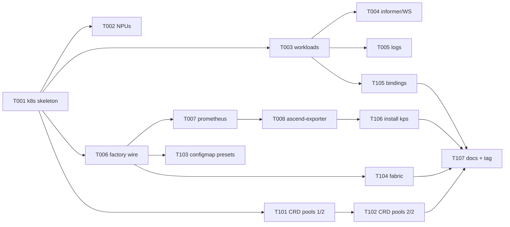

# Phase 2 Plan — Real datasources (K8s / Prometheus / CRD / ConfigMap)

> **Goal**: switch the demo backend from `mock.Source` to real K8s +
> Prometheus + CRD + ConfigMap sources. Validate the Phase 1 P1-T-303
> swap contract — frontend stays untouched, datasource path is yaml
> only.
>
> **Duration**: ~2 weeks (W1 foundation + W2 polish + verification).
>
> **Prereq**: Phase 1 tag `phase-1-complete`. All 6 known-issues
> engineering-resolved (commits `c8a9bc1` → `cb6da64` on dev).

---

## 1. Scope summary

Phase 2 replaces five datasources without touching the frontend:

| Source        | Phase 1 (mock)          | Phase 2 (real)                                     |
|---------------|-------------------------|----------------------------------------------------|
| `mock.Source` | reads `set-a-small/`    | retained for E2E + local dev                       |
| `k8s.Source`  | placeholder import only | client-go informer-driven; clusters/nodes/NPUs/workloads/logs |
| `prometheus.Source` | not present       | promhttp client; QueryMetric against real Prometheus |
| `crd.Source`  | not present             | NPUPool / NodePool / NPUSlicePool / ClusterPool reads |
| `configmap.Source` | not present        | preset catalog read from ConfigMaps                |

Out of scope (Phase 3+):
- The `inference-operator` + NPU DRA driver controllers (architecture.md §10.3 + §10.4)
- ascend-npu-exporter-plus (self-built exporter; community version is enough for Phase 2)
- Karmada multi-site federation (Phase 9+)

---

## 2. Task package overview (15 tasks)

```
W1 Foundation (8 tasks)
├── P2-T-001  k8s.Source skeleton + ListClusters + ListNodes
├── P2-T-002  k8s.Source ListNPUs (Ascend Device Plugin annotations)
├── P2-T-003  k8s.Source ListWorkloads + GetWorkloadDetail
├── P2-T-004  k8s.Source informer + StreamEvents (WS feed)
├── P2-T-005  k8s.Source GetWorkloadLogs + StreamWorkloadLogs (kubelet)
├── P2-T-006  factory.go + main.go wire k8s source + config schema
├── P2-T-007  prometheus.Source skeleton + QueryMetric
└── P2-T-008  ascend-npu-exporter wiring (community version + scrape config)

W2 CRD + ConfigMap + fabric + polish (7 tasks)
├── P2-T-101  crd.Source: NPUPool + NodePool + ClusterPool reads
├── P2-T-102  crd.Source: NPUSlicePool reads + slice ↔ NPU resolution
├── P2-T-103  configmap.Source: preset catalog
├── P2-T-104  fabric discovery (static config / LLDP probe) → ADR-0007
├── P2-T-105  scheduler-annotation → Pod.Bindings (ADR-0005 follow-up)
├── P2-T-106  install.sh extends to install kube-prometheus-stack
└── P2-T-107  Phase 2 docs + checkpoint + tag phase-2-complete
```

Mermaid:



---

## 3. W1 task packages

### P2-T-001 k8s.Source skeleton + ListClusters + ListNodes

| Meta | |
|---|---|
| Module | backend |
| Priority | P0 |
| Depends on | Phase 1 complete |
| Estimated | 1d |

**Allowed Paths**:
- `backend/pkg/datasource/k8s/source.go` (new)
- `backend/pkg/datasource/k8s/cluster.go` (new)
- `backend/pkg/datasource/k8s/node.go` (new)
- `backend/pkg/datasource/k8s/source_test.go` (new)
- `backend/pkg/datasource/k8s/cluster_test.go` (new)
- `backend/pkg/datasource/k8s/node_test.go` (new)
- `backend/pkg/datasource/k8s/placeholder.go` (delete)

**Acceptance**:
- `k8s.NewSource(kubeconfigPath)` constructs a `*Source` satisfying `datasource.Source`
- `Capabilities()` returns `{Clusters: true, Nodes: true}`, all others false (yet)
- `ListClusters` returns a single cluster aggregated from the apiserver's `kubernetes.default` service info + cluster-info ConfigMap
- `ListNodes` lists all nodes; `GetNodeDetail` returns one
- Unit tests use `k8s.io/client-go/kubernetes/fake` with seeded objects
- Other Source methods return `datasource.ErrCapabilityUnavailable` (new sentinel)
- `go test ./pkg/datasource/k8s/... -timeout 30s` passes

### P2-T-002 k8s.Source ListNPUs (Ascend Device Plugin annotations)

| Meta | |
|---|---|
| Module | backend |
| Priority | P0 |
| Depends on | P2-T-001 |
| Estimated | 1d |

**Allowed Paths**:
- `backend/pkg/datasource/k8s/npu.go` (new) + `_test.go`
- `backend/pkg/datasource/k8s/source.go` (extend Capabilities)

**Acceptance**:
- `ListNPUs(nodeName)` reads NPU info from node annotations / `huawei.com/Ascend910` resource declarations
- Mapping: `huawei.com/Ascend910` capacity → NPU count; node labels → model / HCCS group / NUMA layout
- Unit tests: fake clientset with realistic Ascend Device Plugin labels (research/ascend-device-plugin.md)
- `Capabilities().NPUs = true` after this task

### P2-T-003 k8s.Source ListWorkloads + GetWorkloadDetail

| Meta | |
|---|---|
| Module | backend |
| Priority | P0 |
| Depends on | P2-T-001 |
| Estimated | 1d |

**Allowed Paths**:
- `backend/pkg/datasource/k8s/workload.go` (new) + `_test.go`

**Acceptance**:
- `ListWorkloads(filter)` lists Deployments + StatefulSets + Jobs across namespaces
- `GetWorkloadDetail(ns, name)` aggregates pods/containers/relations
- `relations[].type = pd-pair` derived from workload labels
  (`huawei.com/inference-role = prefill|decode` + shared `huawei.com/pd-pair-id` label)
- Unit tests cover the 3 kinds + the PD-pair derivation

### P2-T-004 k8s.Source informer + StreamEvents

| Meta | |
|---|---|
| Module | backend |
| Priority | P0 |
| Depends on | P2-T-003 |
| Estimated | 1.5d |

**Allowed Paths**:
- `backend/pkg/datasource/k8s/informer.go` (new) + `_test.go`
- `backend/pkg/datasource/k8s/source.go` (StreamEvents wiring)

**Acceptance**:
- Shared informer factory; add/update/delete handlers emit
  `*model.WSMessage` matching the WSMessage.type enum
  (workload.created / workload.deleted / workload.statusChanged /
  topology.update / npu.statusChanged)
- `StreamEvents` returns a channel keyed off the informer's resync
- ctx cancel cleans up watches; no goroutine leaks (test with goleak)

### P2-T-005 k8s.Source GetWorkloadLogs + StreamWorkloadLogs

| Meta | |
|---|---|
| Module | backend |
| Priority | P1 |
| Depends on | P2-T-003 |
| Estimated | 0.5d |

**Allowed Paths**:
- `backend/pkg/datasource/k8s/logs.go` (new) + `_test.go`

**Acceptance**:
- `GetWorkloadLogs` opens `corev1.Pod.GetLogs(ns, name, opts)` against the
  first pod of the workload; honors `container` / `tail` / `since`
- `StreamWorkloadLogs` opens a follow stream and pipes lines into the
  channel; ctx cancel closes the upstream watch
- Unit tests use the fake RESTClient with canned log bodies

### P2-T-006 Factory + main.go wire k8s source + config schema

| Meta | |
|---|---|
| Module | backend |
| Priority | P0 |
| Depends on | P2-T-001 (others wave) |
| Estimated | 0.5d |

**Allowed Paths**:
- `backend/cmd/demo-backend/main.go`
- `backend/pkg/datasource/factory.go` (small change — surface k8s source)
- `backend/configs/config.example.yaml` (k8s block enabled examples)

**Acceptance**:
- main.go instantiates `k8s.Source` from `cfg.Datasources["k8s"]` when enabled
- Operator can swap `mapping.clusters` from `mock` → `k8s` and restart
- factory_test.go gains a case asserting the swap resolves to k8s

### P2-T-007 prometheus.Source skeleton + QueryMetric

| Meta | |
|---|---|
| Module | backend |
| Priority | P0 |
| Depends on | P2-T-006 |
| Estimated | 1d |

**Allowed Paths**:
- `backend/pkg/datasource/prometheus/` (new directory)
- `backend/pkg/datasource/factory.go`
- `backend/configs/config.example.yaml` (prometheus block)

**Acceptance**:
- HTTP client against `cfg.Datasources["prometheus"].url`
- `QueryMetric(templateID, vars, range)` calls `/api/v1/query_range`
  using the same `metrics_templates.json` whitelist (P1-T-204 reused as data)
- 404 / 503 / timeout → wrapped to model.MetricError
- Unit tests against `httptest.NewServer` with canned PromQL responses

### P2-T-008 ascend-npu-exporter wiring (community)

| Meta | |
|---|---|
| Module | deploy |
| Priority | P1 |
| Depends on | P2-T-007 |
| Estimated | 0.5d |

**Allowed Paths**:
- `deploy/helm-charts/` (new chart for exporter + ServiceMonitor)
- `deploy/dev/docker-compose.yaml` (add exporter container for local dev)
- `docs/research/ascend-device-plugin.md` (annotate Phase 2 status)

**Acceptance**:
- helm `helm install ascend-npu-exporter` brings up the exporter
- Prometheus picks up the ServiceMonitor; metrics visible
- Existing 5 dashboards (P1-T-209) display NPU panels with real data
  (verified against a 1-node K3s + 1 simulated NPU)

---

## 4. W2 task packages

### P2-T-101 crd.Source: NPUPool + NodePool + ClusterPool reads

| Meta | |
|---|---|
| Module | backend |
| Priority | P1 |
| Depends on | P2-T-001, P1-T-003 (CRD types) |
| Estimated | 1d |

**Allowed Paths**:
- `backend/pkg/datasource/crd/` (new directory)

**Acceptance**:
- Dynamic client lists each CRD kind via discovery client
- Maps CRD objects → `model.NPUPool` / `model.NodePool` etc.
- 3 unit cases per kind (happy / missing CRD / malformed object)

### P2-T-102 crd.Source: NPUSlicePool + slice ↔ NPU resolution

| Meta | |
|---|---|
| Module | backend |
| Priority | P1 |
| Depends on | P2-T-101 |
| Estimated | 0.5d |

**Acceptance**:
- `ListNPUSlicePools` returns the slice pool + a NPU id → slices map
- Aggregator (`pkg/aggregator/topology.go`) takes this map as
  alternative to the mock-fixture slice flat array

### P2-T-103 configmap.Source: preset catalog

| Meta | |
|---|---|
| Module | backend |
| Priority | P1 |
| Depends on | P2-T-006 |
| Estimated | 0.5d |

**Allowed Paths**:
- `backend/pkg/datasource/configmap/` (new)

**Acceptance**:
- Reads `ConfigMap` named `ocloud-presets` from a configured namespace
- Each key in `data:` is a preset YAML/JSON manifest
- Watch-based refresh (ConfigMap change → cache invalidation)

### P2-T-104 Fabric discovery → ADR-0007

| Meta | |
|---|---|
| Module | backend |
| Priority | P2 |
| Depends on | P2-T-001 |
| Estimated | 1d |

**Allowed Paths**:
- `backend/pkg/datasource/fabric/` (new, sub-source consumed by aggregator)
- `docs/adr/0007-fabric-discovery.md` (new)

**Acceptance**:
- ADR-0007 chooses one of: static-config / LLDP probe / SONiC API
  (per architecture.md §13 "Phase 2 fabric discovery 选型")
- Stub source for the chosen path; produces switches + links matching
  the schema
- Phase 2 ships static-config; LLDP/SONiC deferred

### P2-T-105 Scheduler-annotation → Pod.Bindings

| Meta | |
|---|---|
| Module | backend |
| Priority | P1 |
| Depends on | P2-T-003 |
| Estimated | 0.5d |

**Acceptance**:
- Pod annotation `npu.huawei.com/slice-bindings = [{sliceId, role, indexInPod}, …]`
  (JSON-encoded) is parsed by `k8s.Source.GetWorkloadDetail` → `Pod.Bindings`
- Documented in ADR-0005 §"Phase 2 — Bindings"
- Unit cases: present / missing / malformed annotation

### P2-T-106 install.sh extends to install kube-prometheus-stack

| Meta | |
|---|---|
| Module | deploy |
| Priority | P1 |
| Depends on | P2-T-007 |
| Estimated | 0.5d |

**Acceptance**:
- `./scripts/install.sh --with-prometheus` flag installs
  `kube-prometheus-stack` helm chart instead of the docker-compose
  Grafana
- Idempotent / re-runnable

### P2-T-107 Phase 2 docs + checkpoint + tag

| Meta | |
|---|---|
| Module | docs |
| Priority | P0 |
| Depends on | all W1+W2 done |
| Estimated | 0.5d |

**Acceptance**:
- `docs/demo.md` gains a "Phase 2 real-K8s demo" appendix
- `docs/checkpoint-phase2.md` (new) summarizes deliverables
- `docs/known-issues.md` updated (probably new entries about real-K8s
  rough edges)
- README "current phase" updated to Phase 2 complete
- `git tag phase-2-complete`

---

## 5. Phase 2 DoD

**Must Have**:
- [ ] Operator can swap `datasources.mock` → `datasources.k8s` via config and the same frontend works against a real K3s + KubeEdge demo cluster
- [ ] All 5 pages render against real data (cluster + nodes + NPUs + workloads + logs + metrics)
- [ ] Prometheus serves real NPU metrics; Grafana panels display them
- [ ] CRD-backed pools render in the Workloads / Metrics pages
- [ ] OpenAPI contract v1.0 unchanged (ADR-0006's regen was the last contract churn)
- [ ] go test + pnpm test + Playwright E2E all green
- [ ] `phase-2-complete` tag landed

**Should Have**:
- [ ] FPS run against set-c-stress through real K8s data (closes known-issues #4 measurement gap)
- [ ] Fabric discovery via at least one non-static method (LLDP or SONiC)
- [ ] ascend-npu-exporter-plus first cut (Phase 2+ technically; deferred if scope tight)

**Could Have**:
- [ ] inference-operator (PD-Router) controller wired against real CRDs
- [ ] Per-resource cache tuning + LRU eviction policy

---

## 6. Phase 1 → Phase 2 handoff brief

```
项目: D:/code/ai-edge
分支: dev (HEAD `cb6da64` post-issue-4)
Tags: phase-1-complete + all 6 known-issues resolved (engineering)

Backend datasource interface (Source) is the load-bearing primitive.
Phase 1 implemented mock.Source; Phase 2 plugs in k8s/prometheus/crd/
configmap behind the same interface.

P2-T-001 is the foundational task — k8s.Source skeleton + ListClusters
+ ListNodes against a real apiserver (or fake clientset in unit tests).
All subsequent tasks build on its kubeconfig wiring + Capabilities pattern.

Tools needed in addition to Phase 1 toolchain:
- A K3s or KubeEdge local cluster (or `kind` quickstart)
- helm v3 (for kube-prometheus-stack / ascend-npu-exporter)
- A kubeconfig pointing at the above

For unit tests only, `k8s.io/client-go/kubernetes/fake` + the existing
test patterns suffice.

Estimated total: ~2 weeks. W1 = foundation; W2 = CRDs + fabric + docs.

Recommended first session: P2-T-001 + P2-T-002 (k8s clusters/nodes/NPUs)
through to unit-test green, no real cluster yet.
```

---

**END of Phase 2 Plan v0.1**
