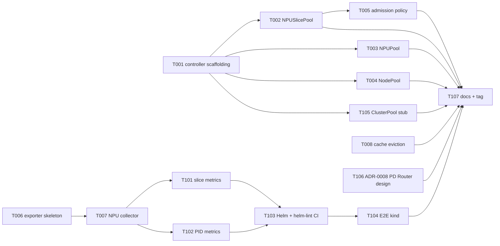

# Phase 3 Plan — Pool controllers + ascend-npu-exporter-plus

> **Goal**: Phase 3 introduces the project's first three control loops:
> pool-operator Reconcile (the M2 milestone "池化与发现" headline), the
> self-built `ascend-npu-exporter-plus` (replaces the community chart
> from P2-T-008 + retires the dev stub from known-issue #9), and a PD
> Router admission webhook **design ADR** (impl deferred to Phase 5
> alongside inference-operator). Plus pay down three Phase 2 known-
> issues (#7 helm-lint CI · #8 real-cluster E2E · #9 dev stub
> retirement).
>
> **Duration**: ~2.5 weeks (W1 foundation 8 tasks + W2 polish 7 tasks).
>
> **Prereq**: Phase 2 tag `phase-2-complete` (HEAD of dev). Phase 1
> known-issues #1-#6 engineering-resolved; Phase 2 known-issues #7-#9
> accepted for Phase 3.

---

## 1. Scope summary

Phase 3 stands up the first three control loops without revving the
OpenAPI contract or touching the frontend:

| Stream                         | Phase 2 state                                      | Phase 3 delivery                                          |
|--------------------------------|----------------------------------------------------|-----------------------------------------------------------|
| `pool-operator` controllers    | Kubebuilder scaffold + CRD types only (no `internal/controller/`) | 4 Reconcile loops (NPUSlicePool/NPUPool/NodePool/ClusterPool) + ValidatingAdmissionPolicy skeleton |
| Ascend metrics                 | Community `ascend-npu-exporter` v6.0.0 chart + dev stub serving static metrics (#9) | Self-built `ascend-npu-exporter-plus` with NPU + slice + PID-level series; community chart retired |
| Demo backend cache             | Phase 1 `pkg/cache/lru.go` LRU primitive (no eviction policy) | Per-resource TTL + observable eviction counts (Phase 2 Could Have) |
| Real-cluster E2E               | Fake clientset + Playwright against mock backend (#8) | GitHub Actions `e2e-kind` smoke job (closes #8)           |
| Helm lint                      | python-yaml validation on Windows authoring host (#7) | GitHub Actions `helm-lint` job on Linux runner (closes #7) |
| PD Router (mutation path)      | Annotation parser only (P2-T-105 read path)        | ADR-0008 design — impl deferred to Phase 5                |
| Multi-tenancy                  | by-convention `ocloud-system` namespace (arch §6.7) | ValidatingAdmissionPolicy skeleton enforcing the convention |

Out of scope (Phase 4-9):
- **DRA migration** `ascend-device-plugin v1` → Ascend DRA driver
  (arch §1.3 / §3.4 v2 — Phase 4, gated on K8s 1.34 GA + KubeEdge
  DRA support)
- **inference-operator** controller + ModelService CRD wiring
  (arch §10.4 — Phase 5)
- **PD Router webhook implementation** (Phase 5, alongside
  inference-operator)
- **NPUSliceAllocation / Quota CRD** (arch §6.8 TODO — Phase 5)
- **Karmada multi-site federation + full RBAC/auth model**
  (arch §13 — Phase 9)
- **Fabric discovery via LLDP / SONiC API** (ADR-0007 — operator action
  on real switching gear)

---

## 2. Task package overview (15 tasks)

```
W1 Foundation (8 tasks)
├── P3-T-001  pool-operator controller scaffolding (manager + utils + envtest)
├── P3-T-002  pool-operator NPUSlicePool Reconcile (status + finalizer)
├── P3-T-003  pool-operator NPUPool Reconcile (selector → NPU set)
├── P3-T-004  pool-operator NodePool Reconcile (selector → node set)
├── P3-T-005  pool-operator ValidatingAdmissionPolicy skeleton (multi-tenancy §6.7)
├── P3-T-006  ascend-npu-exporter-plus skeleton (registry + cmd + Dockerfile)
├── P3-T-007  ascend-npu-exporter-plus NPU-level collector (util/mem/HBM-bw)
└── P3-T-008  demo-backend per-resource LRU + eviction policy + observability

W2 Polish + control + tests (7 tasks)
├── P3-T-101  ascend-npu-exporter-plus slice-level metrics
├── P3-T-102  ascend-npu-exporter-plus PID-level workload correlation
├── P3-T-103  ascend-npu-exporter-plus Helm chart + retire community chart + helm-lint CI (#7)
├── P3-T-104  Real-cluster E2E kind smoke job (closes #8)
├── P3-T-105  pool-operator ClusterPool placeholder Reconcile (Phase 9 forward note)
├── P3-T-106  ADR-0008 PD Router admission webhook design (RFC only)
└── P3-T-107  Phase 3 docs + checkpoint + tag phase-3-complete
```

Mermaid:



---

## 3. W1 task packages

### P3-T-001 pool-operator controller scaffolding

| Meta | |
|---|---|
| Module | operators |
| Priority | P0 |
| Depends on | phase-2-complete |
| Estimated | 0.5d |

**Allowed Paths**:
- `operators/pool-operator/internal/controller/controller.go` (new — package doc + shared types)
- `operators/pool-operator/internal/controller/utils.go` (new — status condition helpers + owner-ref helpers)
- `operators/pool-operator/internal/controller/utils_test.go` (new)
- `operators/pool-operator/internal/controller/suite_test.go` (new — envtest harness)
- `operators/pool-operator/cmd/main.go` (extend — register the four Reconcilers behind feature flags)
- `operators/pool-operator/Makefile` (extend — `make test` invokes envtest; `make manager` builds cmd)

**Acceptance**:
- `internal/controller/` directory created with Kubebuilder v4 layout
  conventions (matches `PROJECT` `layout: go.kubebuilder.io/v4`)
- `cmd/main.go` wires manager flags `--health-probe-bind-address=:8081
  --metrics-bind-address=:8082` and registers the four controller
  shells (with empty Reconcile bodies, gated by `--enable-controllers`
  bitmask defaulting to `none` for safety)
- `internal/controller/utils.go` exposes `SetCondition`, `RemoveCondition`,
  `MakeOwnerRef`, `RequeueAfter` helpers shared by all four
  Reconcilers
- `make test` runs the envtest suite skeleton green (no controllers
  active yet — just manager start/stop)
- `make manager` produces `bin/manager` binary

### P3-T-002 pool-operator NPUSlicePool Reconcile

| Meta | |
|---|---|
| Module | operators |
| Priority | P0 |
| Depends on | P3-T-001 |
| Estimated | 1d |

**Allowed Paths**:
- `operators/pool-operator/internal/controller/npuslicepool_controller.go` (new)
- `operators/pool-operator/internal/controller/npuslicepool_controller_test.go` (new)
- `operators/pool-operator/cmd/main.go` (small change — flip `NPUSlicePool` controller on by default)

**Acceptance**:
- Reconcile reads `spec.npuPoolRef` and the parent NPUPool's owned NPUs
  (via label-selector resolved against the cluster's `Node` list +
  `huawei.com/Ascend910` capacity)
- For `Strategy: FixedTemplate`: `status.totalSlices = sum(template_count
  × npu_count)` per template entry
- For `Strategy: Dynamic`: `status.totalSlices = floor(NPU_aicore /
  spec.dynamicSlicing.minAICore) × npu_count` (capacity upper bound)
- `status.availableSlices = totalSlices - allocatedSlices` (allocated
  starts at 0; Phase 5 `NPUSliceAllocation` CRD will increment it)
- Finalizer `pool.ocloud.edge.example.com/npuslicepool-cleanup` added on
  creation; on deletion, releases any owner refs from child slice
  objects (placeholder — no slice CRD yet, so just removes finalizer
  after a no-op pass)
- `status.conditions[].type` populates `Ready` / `Progressing` /
  `Degraded` per the K8s API convention
- envtest cases: happy path (FixedTemplate) · happy path (Dynamic) ·
  missing NPUPoolRef · malformed template · finalizer add/remove
  lifecycle
- `go test ./internal/controller/... -timeout 60s -run NPUSlicePool`
  passes

### P3-T-003 pool-operator NPUPool Reconcile

| Meta | |
|---|---|
| Module | operators |
| Priority | P0 |
| Depends on | P3-T-001 |
| Estimated | 1d |

**Allowed Paths**:
- `operators/pool-operator/internal/controller/npupool_controller.go` (new) + `_test.go`
- `operators/pool-operator/cmd/main.go` (small change — flip `NPUPool` controller on)

**Acceptance**:
- Reconcile reads `spec.selector` and lists nodes matching the label
  selector; for each node, sums `huawei.com/Ascend910` resource
  capacity into `status.totalNPUs`
- `status.healthyNPUs` derived from node `Ready` condition AND
  Ascend Device Plugin's `huawei.com/Ascend910-Health=Healthy` label
  (per `docs/research/ascend-device-plugin.md`)
- `status.allocatedNPUs` derived from sum of `huawei.com/Ascend910`
  requests across all Pods scheduled to the matched nodes
- `status.hccsTopology` populated with a placeholder
  `{Topology: "unknown", Discovered: false}` — real HCCS topology
  arrives in Phase 6 (scheduler plugin)
- envtest cases: happy path (3 nodes / 24 NPUs) · empty selector · no
  matching nodes · partial health · pod-allocation sum
- Capabilities-style sentinel: status `Ready=False, Reason=NoNPUFound`
  when total = 0 so dashboards can highlight degraded pools

### P3-T-004 pool-operator NodePool Reconcile

| Meta | |
|---|---|
| Module | operators |
| Priority | P0 |
| Depends on | P3-T-001 |
| Estimated | 1d |

**Allowed Paths**:
- `operators/pool-operator/internal/controller/nodepool_controller.go` (new) + `_test.go`
- `operators/pool-operator/cmd/main.go` (small change — flip `NodePool` controller on)

**Acceptance**:
- Reconcile reads `spec.selector` and `spec.role` (`edge` | `core`);
  lists matching nodes
- `status.nodes` populated with `[]string` of node names
- `status.totalCPU` and `status.totalMemory` aggregated via
  `resource.Quantity` arithmetic over `node.status.capacity.cpu` /
  `node.status.capacity.memory`
- `status.conditions` reports `Ready` if ≥1 node matched else `Ready=False`
  with `Reason=NoNodeMatched`
- envtest cases: happy path · empty selector · role filter mismatch ·
  mixed-arch (amd64 + simulated arm64 — arm64 should be excluded
  per arch §1.2 hardware target)

### P3-T-005 pool-operator ValidatingAdmissionPolicy skeleton

| Meta | |
|---|---|
| Module | operators |
| Priority | P1 |
| Depends on | P3-T-002 |
| Estimated | 0.5d |

**Allowed Paths**:
- `operators/pool-operator/config/admission/validating-admission-policy.yaml` (new)
- `operators/pool-operator/config/admission/validating-admission-policy-binding.yaml` (new)
- `operators/pool-operator/config/admission/kustomization.yaml` (new)
- `operators/pool-operator/config/default/kustomization.yaml` (extend — pull in admission overlay)
- `operators/pool-operator/test/e2e/admission_test.go` (new)
- `docs/architecture.md` (small edit — mark §6.7 "Phase 3 修复" status to "skeleton landed")

**Acceptance**:
- `ValidatingAdmissionPolicy` rejects `NPUSlicePool` CRs whose
  `metadata.namespace != "ocloud-system"` unless they carry label
  `npu.huawei.com/multi-tenancy-bypass=true` (the bypass label is the
  Phase 3 escape hatch — full RBAC arrives Phase 9 per arch §13 review
  table)
- Binding scopes the policy to `MatchResources: NPUSlicePool` only
- e2e test: applying `NPUSlicePool` to `default` namespace fails with
  message `"NPUSlicePool must be created in ocloud-system namespace
  (multi-tenancy gap, see architecture.md §6.7); set label
  npu.huawei.com/multi-tenancy-bypass=true to opt out for Phase 3"`
- Applying to `ocloud-system` namespace succeeds
- Applying with the bypass label to any namespace succeeds
- Policy fail mode = `Fail` (closed by default)

### P3-T-006 ascend-npu-exporter-plus skeleton

| Meta | |
|---|---|
| Module | exporters |
| Priority | P0 |
| Depends on | phase-2-complete |
| Estimated | 0.5d |

**Allowed Paths**:
- `exporters/ascend-npu-exporter-plus/go.mod` (new)
- `exporters/ascend-npu-exporter-plus/go.sum` (new)
- `exporters/ascend-npu-exporter-plus/cmd/exporter-plus/main.go` (new)
- `exporters/ascend-npu-exporter-plus/internal/registry/registry.go` (new) + `_test.go`
- `exporters/ascend-npu-exporter-plus/internal/server/server.go` (new) + `_test.go`
- `exporters/ascend-npu-exporter-plus/Dockerfile` (new)
- `exporters/ascend-npu-exporter-plus/Makefile` (new)
- `exporters/ascend-npu-exporter-plus/README.md` (new)
- `exporters/CLAUDE.md` (new — module ownership doc analogous to
  `backend/CLAUDE.md`)

**Acceptance**:
- `make build` produces `bin/exporter-plus` (Linux amd64; arm64
  excluded per arch §1.2 hardware target)
- `./exporter-plus --listen=:9100 --simulator=path` (default
  `--simulator=""` triggers real DCMI in Phase 4+; Phase 3 always
  uses simulator) brings up an HTTP server exposing `/metrics`
- `/metrics` emits at minimum `exporter_build_info{version,commit,
  go_version}` and `exporter_collect_duration_seconds` histogram
- Multi-stage `Dockerfile` produces an image < 50 MB based on `distroless/static`
- `Makefile` targets: `build` / `test` / `docker-build` / `lint`
- `exporters/CLAUDE.md` documents the Allowed Paths boundary
  (`exporters/**`), the Phase 3 thesis, and the Phase 4 promise
  (replace simulator with DCMI)
- `go test ./...` passes

### P3-T-007 ascend-npu-exporter-plus NPU-level collector

| Meta | |
|---|---|
| Module | exporters |
| Priority | P0 |
| Depends on | P3-T-006 |
| Estimated | 1.5d |

**Allowed Paths**:
- `exporters/ascend-npu-exporter-plus/internal/collector/npu.go` (new) + `_test.go`
- `exporters/ascend-npu-exporter-plus/internal/collector/sources/dcmi.go` (new — stub interface; real impl Phase 4)
- `exporters/ascend-npu-exporter-plus/internal/collector/sources/npu_smi.go` (new — stub interface; real impl Phase 4)
- `exporters/ascend-npu-exporter-plus/internal/collector/sources/simulator.go` (new) + `_test.go`
- `exporters/ascend-npu-exporter-plus/internal/collector/sources/sources.go` (new — `Source` interface)
- `exporters/ascend-npu-exporter-plus/testdata/simulator-set-a-small.json` (new — mirrors `configs/mock-data/set-a-small/` NPU IDs so dashboards align)
- `exporters/ascend-npu-exporter-plus/cmd/exporter-plus/main.go` (extend — register NPU collector)

**Acceptance**:
- `Source` interface exposes `ReadNPUs(ctx) ([]NPUSample, error)` with
  fields `{ID, NodeName, AICore, MemoryUsedBytes, MemoryTotalBytes,
  HBMBandwidthBytesPerSecond, Healthy}`
- Three metric families emitted per NPU:
  - `ascend_npu_utilization_percent{npu_id,node,model}` (gauge, 0-100)
  - `ascend_npu_memory_used_bytes{npu_id,node}` (gauge)
  - `ascend_npu_hbm_bandwidth_bytes_per_second{npu_id,node}` (gauge)
- Simulator source reads `testdata/simulator-set-a-small.json` and
  replays values with a sine-wave perturbation (so dashboards show
  movement, not flat lines — closes the spirit of known-issue #9)
- `dcmi.go` and `npu_smi.go` are stubs that return
  `ErrSourceNotAvailable` so callers select simulator in Phase 3
- Unit tests cover: happy path (3 NPUs from simulator) · simulator file
  missing · malformed JSON · perturbation stays within ±10% of seed
- `helm test` (added in T103) scrapes the running pod and asserts
  metric families are non-empty

### P3-T-008 demo-backend per-resource LRU + eviction policy

| Meta | |
|---|---|
| Module | backend |
| Priority | P1 |
| Depends on | phase-2-complete |
| Estimated | 1d |

**Allowed Paths**:
- `backend/pkg/cache/lru.go` (extend — add per-key TTL + eviction
  notifier hook; preserve existing API surface so factory + handlers
  stay green)
- `backend/pkg/cache/lru_test.go` (extend)
- `backend/pkg/cache/eviction.go` (new — prometheus counter +
  observability)
- `backend/pkg/cache/eviction_test.go` (new)
- `backend/pkg/api/metrics.go` (extend — expose
  `demo_backend_cache_evictions_total{resource}` and
  `demo_backend_cache_size{resource}`)
- `backend/configs/config.example.yaml` (extend — `cache:` block with
  per-resource TTL knobs)
- `backend/pkg/config/config.go` (extend — bind the new YAML block)

**Acceptance**:
- New `cache.New(opts)` accepts `{MaxEntries, TTL, OnEvict}` per
  resource kind; existing call sites in `pkg/aggregator/` continue to
  compile unchanged (default opts preserve Phase 1 behavior)
- TTL eviction observable: write key → wait TTL → next read sees miss
- Capacity eviction observable: write `MaxEntries + 1` keys → first key
  evicted (LRU)
- Eviction counter increments per resource label; visible at
  `/api/v1/metrics` (the existing self-metrics endpoint) and at
  `/metrics` (Prometheus-format)
- YAML schema:
  ```yaml
  cache:
    defaults:
      max_entries: 1024
      ttl: 5m
    per_resource:
      topology: { max_entries: 64, ttl: 30s }
      workloads: { max_entries: 256, ttl: 1m }
  ```
- `go test ./pkg/cache/... -timeout 30s` passes
- Existing `factory_test.go` cases stay green

---

## 4. W2 task packages

### P3-T-101 ascend-npu-exporter-plus slice-level metrics

| Meta | |
|---|---|
| Module | exporters |
| Priority | P0 |
| Depends on | P3-T-007 |
| Estimated | 1d |

**Allowed Paths**:
- `exporters/ascend-npu-exporter-plus/internal/collector/slice.go` (new) + `_test.go`
- `exporters/ascend-npu-exporter-plus/internal/collector/sources/simulator.go` (extend — emit slice records)
- `exporters/ascend-npu-exporter-plus/testdata/simulator-set-a-small.json` (extend — slice block matches `configs/mock-data/set-a-small/npuSlices.json`)
- `exporters/ascend-npu-exporter-plus/cmd/exporter-plus/main.go` (small change — register slice collector)

**Acceptance**:
- New metric families:
  - `ascend_slice_aicore_count{slice_id,npu_id,node,template}` (gauge)
  - `ascend_slice_memory_used_bytes{slice_id,npu_id,node}` (gauge)
  - `ascend_slice_allocated_to_pod{slice_id,npu_id,namespace,pod}`
    (gauge, value=1 when allocated, missing when free — matches
    `kube_pod_info` shape so PromQL joins work)
- Simulator emits slices for the 24 NPUs in set-a-small, respecting the
  `vir04` / `vir08` template names from the mock data
- Slices not allocated to a pod do not emit `ascend_slice_allocated_to_pod`
  (allows `count()` queries to give live allocation rate)
- Unit tests: happy path (12 slices, 4 allocated, 8 free) · slice without
  NPU ref · template name validation
- Existing T007 NPU-level metrics unchanged

### P3-T-102 ascend-npu-exporter-plus PID-level workload correlation

| Meta | |
|---|---|
| Module | exporters |
| Priority | P1 |
| Depends on | P3-T-007 |
| Estimated | 1d |

**Allowed Paths**:
- `exporters/ascend-npu-exporter-plus/internal/collector/workload.go` (new) + `_test.go`
- `exporters/ascend-npu-exporter-plus/internal/collector/sources/cgroup.go` (new — `/proc/[pid]/cgroup` reader with simulator override) + `_test.go`
- `exporters/ascend-npu-exporter-plus/testdata/simulator-cgroup-fs/` (new — synthetic /proc tree for tests)
- `exporters/ascend-npu-exporter-plus/cmd/exporter-plus/main.go` (small change — register workload collector behind `--enable-workload-correlation` flag, default off)

**Acceptance**:
- Reads `/proc/[pid]/cgroup` (cgroup v2 path `/proc/[pid]/cgroup` →
  `kubepods/kubepods.slice/.../<containerID>`) → derives `{namespace,
  pod, container}` via containerd identity convention
- New metric families:
  - `ascend_workload_npu_seconds_total{namespace,pod,container,npu_id}`
    (counter — sum of per-slice utilization × wall-clock seconds)
  - `ascend_workload_active_slices{namespace,pod,container}` (gauge)
- Simulator fs at `testdata/simulator-cgroup-fs/` mirrors a 3-pod
  kubepods tree (1 PD prefill + 1 PD decode + 1 single) for tests
- Unit tests: happy path · missing /proc entries · malformed cgroup
  line · containerd vs cri-o path detection
- Feature flag default OFF so production rollouts stay opt-in until
  Phase 5 inference-operator depends on these series

### P3-T-103 ascend-npu-exporter-plus Helm + retire community chart + helm-lint CI

| Meta | |
|---|---|
| Module | deploy |
| Priority | P0 |
| Depends on | P3-T-101, P3-T-102 |
| Estimated | 1d |

**Allowed Paths**:
- `deploy/helm-charts/ascend-npu-exporter-plus/Chart.yaml` (new)
- `deploy/helm-charts/ascend-npu-exporter-plus/values.yaml` (new)
- `deploy/helm-charts/ascend-npu-exporter-plus/templates/daemonset.yaml` (new)
- `deploy/helm-charts/ascend-npu-exporter-plus/templates/service.yaml` (new)
- `deploy/helm-charts/ascend-npu-exporter-plus/templates/servicemonitor.yaml` (new)
- `deploy/helm-charts/ascend-npu-exporter-plus/templates/_helpers.tpl` (new)
- `deploy/helm-charts/ascend-npu-exporter-plus/templates/tests/test-scrape.yaml` (new — `helm test` hook)
- `deploy/helm-charts/ascend-npu-exporter-plus/README.md` (new)
- `deploy/helm-charts/ascend-npu-exporter/` (delete — community chart retired)
- `scripts/install.sh` (extend — `--with-prometheus` now installs
  `ascend-npu-exporter-plus` instead of the community chart)
- `deploy/dev/docker-compose.yaml` (extend — replaces ascend-exporter
  dev stub with the new image; closes #9)
- `deploy/dev/ascend-exporter-stub/` (delete — dev stub retired)
- `.github/workflows/helm-lint.yml` (new — closes #7)
- `docs/known-issues.md` (small edit — mark #7 and #9 as RESOLVED)

**Acceptance**:
- `helm install ascend-npu-exporter-plus ./deploy/helm-charts/ascend-npu-exporter-plus`
  brings up a DaemonSet on every node carrying the
  `huawei.com/Ascend910` label
- ServiceMonitor scraped by kube-prometheus-stack; metrics visible
  after one scrape interval
- The five Phase 1 dashboards (P1-T-209) display NPU panels with
  non-flat lines (the simulator perturbation from T007 satisfies
  this on a Phase 3 dev host without real silicon)
- `helm test ascend-npu-exporter-plus` runs the scrape probe: passes
  iff metric families from T007/T101 are non-empty
- `scripts/install.sh --with-prometheus` is idempotent and no longer
  references the community chart
- GitHub Actions `helm-lint` job runs `helm lint` + `helm template`
  on every PR touching `deploy/helm-charts/**`; fails build on lint
  errors
- `docs/known-issues.md` entries #7 and #9 carry `**RESOLVED**` status
  with a one-line resolution note pointing at this task

### P3-T-104 Real-cluster E2E kind smoke job

| Meta | |
|---|---|
| Module | deploy |
| Priority | P0 |
| Depends on | P3-T-103 |
| Estimated | 1.5d |

**Allowed Paths**:
- `.github/workflows/e2e-kind.yml` (new — closes #8)
- `tests/e2e/kind/kind-config.yaml` (new — 1 control-plane + 2 worker nodes, fake `huawei.com/Ascend910` extended resource)
- `tests/e2e/kind/install.sh` (new — bootstraps kind cluster, installs pool-operator + exporter-plus + demo-backend)
- `tests/e2e/kind/seed-resources.sh` (new — applies a minimal NPUPool + NPUSlicePool + 1 mock workload)
- `tests/e2e/playwright.config.kind.ts` (new — separate config so mock-backed Phase 1 suite stays unaffected)
- `tests/e2e/specs/kind-smoke.spec.ts` (new — 3 smoke cases)
- `docs/known-issues.md` (small edit — mark #8 as RESOLVED)

**Acceptance**:
- `.github/workflows/e2e-kind.yml` runs on PR + dev push, with
  `kind` action and a `setup-helm` step; wall-clock budget < 15 min
- Workflow stages:
  1. `kind create cluster --config tests/e2e/kind/kind-config.yaml`
  2. `helm install` for cert-manager · pool-operator · ascend-npu-exporter-plus · demo-backend
  3. `tests/e2e/kind/seed-resources.sh` applies seed CRDs (NPUPool +
     NPUSlicePool)
  4. Wait until `NPUSlicePool.status.totalSlices > 0` (proves Reconcile
     loops from T002-T004 fired)
  5. `npx playwright test --config tests/e2e/playwright.config.kind.ts`
- Three Playwright smoke cases:
  - Overview page loads, topology shows ≥1 cluster + ≥1 NPUSlicePool
  - Workloads page loads, the seeded mock workload appears
  - Metrics page loads, exporter-plus metric `ascend_npu_utilization_percent`
    returns a value > 0
- Existing Phase 1 mock-backed Playwright suite (`playwright.config.ts`)
  remains green and runs in a separate workflow job (does not regress)
- `docs/known-issues.md` #8 carries `**RESOLVED**` status

### P3-T-105 pool-operator ClusterPool placeholder Reconcile

| Meta | |
|---|---|
| Module | operators |
| Priority | P2 |
| Depends on | P3-T-001 |
| Estimated | 0.5d |

**Allowed Paths**:
- `operators/pool-operator/internal/controller/clusterpool_controller.go` (new) + `_test.go`
- `operators/pool-operator/cmd/main.go` (small change — flip
  `ClusterPool` controller on, but with phase-deferred semantics)

**Acceptance**:
- Reconcile sets `status.conditions[Type=PhaseDeferred]=True` with
  `Reason=WaitingForKarmada` and `Message="ClusterPool Reconcile is a
  Phase 9 deliverable; Phase 3 only verifies CRD acceptance and emits
  this condition so dashboards can render the state. See architecture
  §13 review-table Phase 9 entry."`
- No watches on Karmada APIs (would crash on clusters without
  Karmada installed); controller is a pure passive observer
- envtest case: CR created → after one Reconcile pass, condition
  present and Status field unchanged across subsequent reconciles
  (idempotent)
- `kubectl describe clusterpool foo` shows the condition with the
  Phase 9 forward reference

### P3-T-106 ADR-0008 PD Router admission webhook design

| Meta | |
|---|---|
| Module | docs |
| Priority | P1 |
| Depends on | phase-2-complete |
| Estimated | 0.5d |

**Allowed Paths**:
- `docs/adr/0008-pd-router-webhook.md` (new — follows ADR-0007 format)
- `docs/architecture.md` (small edit — §13 review table gains a
  `Phase 5 | PD Router webhook impl per ADR-0008 | Phase 5 入口检查` row)

**Acceptance**:
- ADR-0008 status: `Accepted (design only — implementation Phase 5)`
- Captures the mutation-path question raised in checkpoint-phase2.md §6
  candidate #3
- Options table compares at minimum:
  - K8s native mutating admission webhook (recommended)
  - Controller-side mutation (re-write Pod after creation)
  - OPA Gatekeeper assign-image-based mutation
  - Sidecar approach
- Decision section justifies mutating webhook, points to the
  `npu.huawei.com/slice-bindings` annotation shape already parsed by
  P2-T-105 (`backend/pkg/datasource/k8s/...` and `model.Pod.Bindings`
  from ADR-0006)
- Phase 5 implementation notes spell out: cert-manager dependency,
  failurePolicy=Fail behavior under inference-operator outage,
  ordering vs Volcano gang scheduling, idempotency contract
- Cross-references: ADR-0002 (no-KServe), ADR-0005 (Pod-in-topology),
  P2-T-105 read path

### P3-T-107 Phase 3 docs + checkpoint + tag

| Meta | |
|---|---|
| Module | docs |
| Priority | P0 |
| Depends on | all W1 + W2 done |
| Estimated | 0.5d |

**Allowed Paths**:
- `docs/checkpoint-phase3.md` (new — same shape as `checkpoint-phase2.md`)
- `docs/demo.md` (extend — "Phase 3 pool-operator + exporter-plus demo" appendix)
- `docs/known-issues.md` (extend — Phase 3 entries if any; finalize
  RESOLVED markers for #7/#8/#9)
- `README.md` (small edit — "current phase" → Phase 3 complete; bump
  tag list)

**Acceptance**:
- `docs/checkpoint-phase3.md` lists 15/15 task completion table with
  commit shas, the capabilities matrix (Capability × Source for the
  four pool controllers + exporter-plus), DoD reconciliation against
  this plan §5, and a Phase 3 → Phase 4 handoff brief
- Handoff brief mentions: Phase 4 = DRA migration (arch §1.3 / §3.4 v2
  / ADR-0001 §7); start with `npu-dra-driver/` scaffold + the
  ADR-0001 v3 revision tracking K8s 1.34/1.36 DRA GA status
- `docs/demo.md` Phase 3 appendix walks through: kind setup → apply
  NPUPool → watch status populate → install exporter-plus → see live
  Grafana panels
- README "current phase" line: `Phase 3 complete — pool controllers
  + ascend-npu-exporter-plus + first ADR for PD Router webhook
  (impl Phase 5)`
- `git tag phase-3-complete` lands on the merge commit of this PR

---

## 5. Phase 3 DoD

**Must Have**:
- [ ] `kubectl apply` of an `NPUSlicePool` / `NPUPool` / `NodePool` CR
      causes status fields to populate within 30s (envtest + manual
      verification on kind in CI via T104)
- [ ] All 4 pool kinds (NPUSlicePool / NPUPool / NodePool / ClusterPool
      placeholder) have green controller unit tests (envtest), and the
      manager binary starts cleanly with all four registered
- [ ] `ValidatingAdmissionPolicy` rejects NPUSlicePool outside
      `ocloud-system` namespace (without bypass label)
- [ ] `ascend-npu-exporter-plus` Helm install on kind + simulated NPU
      shows non-flat metrics on the five Phase 1 dashboards (T103 + T104)
- [ ] Community `ascend-npu-exporter` chart and `deploy/dev/ascend-exporter-stub/`
      removed; `scripts/install.sh --with-prometheus` references the
      new chart only
- [ ] CI: `helm-lint` job runs on every PR touching
      `deploy/helm-charts/**`
- [ ] CI: `e2e-kind` job runs on every PR (smoke only; full suite
      Phase 4+)
- [ ] ADR-0008 landed with options table + decision + Phase 5
      implementation notes
- [ ] `phase-3-complete` tag landed on dev

**Should Have**:
- [ ] LRU cache eviction count observable at `/metrics` and the
      internal `/api/v1/metrics`
- [ ] Per-resource TTL configurable via `configs/config.yaml`
- [ ] PID-level workload metrics emit when `--enable-workload-correlation`
      flag is set (default off; opt-in for Phase 5 PD Router consumers)
- [ ] `docs/known-issues.md` #7, #8, #9 all carry `**RESOLVED**` status

**Could Have**:
- [ ] inference-operator scaffold (defer — Phase 5 per arch §10.4)
- [ ] PD Router webhook impl (defer — Phase 5 per ADR-0008)
- [ ] DRA migration first cut (defer — Phase 4 per arch §1.3)
- [ ] LLDP / SONiC fabric discovery (defer — operator action on real
      switching gear per ADR-0007)

---

## 6. Phase 2 → Phase 3 handoff brief

```
项目: D:/code/ai-edge
分支: dev (HEAD @ phase-2-complete tag)
Tags: phase-0-baseline, phase-1-complete, w1..w3-complete,
      phase-2-complete

Phase 2 landed 5 real datasources behind `datasource.Source`; the
operator now swaps mock ↔ k8s/prometheus/crd/configmap via yaml +
restart. Phase 3 introduces the first three control loops:

1. pool-operator Reconcile (NPUSlicePool/NPUPool/NodePool + ClusterPool
   placeholder) — the M2 milestone "池化与发现" headline from
   architecture.md §1.3. Today's state: PROJECT + Makefile + cmd/main.go
   + api/v1alpha1/*_types.go exist, no internal/controller/.
2. ascend-npu-exporter-plus (replaces community chart from P2-T-008
   and the dev stub from known-issue #9). New top-level
   exporters/ascend-npu-exporter-plus/ module; first non-backend Go
   binary in the repo.
3. ADR-0008 PD Router admission webhook design — RFC only, impl
   Phase 5 alongside inference-operator.

Plus pays down 3 known-issues: #7 helm-lint CI, #8 real-cluster E2E,
#9 dev stub retirement.

P3-T-001 is the foundational task — pool-operator controller
scaffolding (manager wiring + envtest harness + shared utils). All
four Reconcile tasks (T002-T005, T105) build on it. T006 is the
parallel foundation for the exporter stream.

Tools needed in addition to Phase 2 toolchain:
- kubectl 1.30+ (ValidatingAdmissionPolicy GA in 1.30)
- envtest binaries (Kubebuilder v4 ships these via
  `make envtest`)
- kind v0.24+ (for T104 CI; local dev optional)
- cert-manager (T104 install for webhook cert provisioning, even
  though Phase 3 webhook is ADR-only — kind setup pre-installs
  to ease Phase 5 land)

For unit tests only, envtest + the existing `k8s.io/client-go/kubernetes/fake`
patterns suffice. No real Ascend hardware needed in Phase 3
(simulator source covers the path).

Estimated total: ~13 working-days (~2.5 weeks calendar).
W1 = foundations (4 controller shells + 2 exporter foundations + cache);
W2 = polish (slice/PID metrics + Helm/CI + E2E + ClusterPool stub +
ADR + docs).

Recommended first session: P3-T-001 (controller scaffolding) +
P3-T-006 (exporter skeleton) in parallel — they share no files and
unlock the rest of the dependency graph.
```

---

**END of Phase 3 Plan v0.1**
