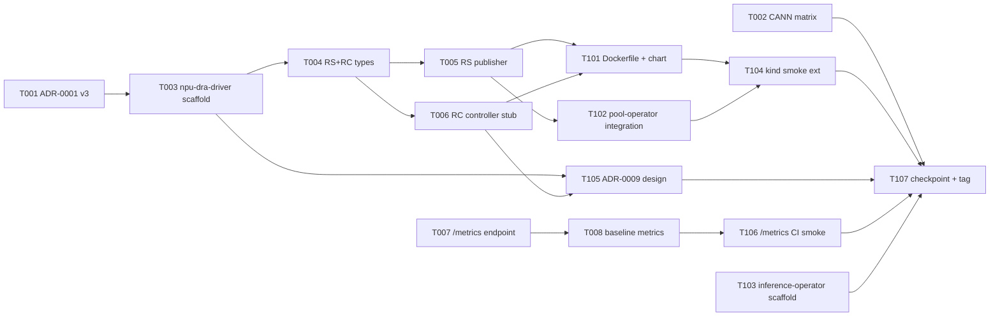

# Phase 4 Plan — npu-dra-driver scaffold + ADR-0001 v3 + CANN matrix + backend /metrics + inference-operator scaffold

> **Goal**: Phase 4 continues the M2 milestone (池化与发现) one layer
> deeper — **device discovery + DRA scaffolding**. The headline is a
> self-built `operators/npu-dra-driver/` (Kubebuilder v4, simulator-
> first, fork-spirit of `kubernetes-sigs/dra-example-driver` v0.2.1)
> together with **ADR-0001 v3** codifying the corrected DRA gating
> (KubeEdge ≤ v1.22 has zero DRA support — the real edge-path
> blocker — and no official Ascend DRA driver exists). Plus a
> **CANN 8.1 / Ascend driver ≥ 24.x compatibility matrix** doc as
> the architecture §13 Phase 4 entry gate, the **backend `/metrics`
> Prometheus self-endpoint** (T008b carry-over from Phase 3), and
> an **`operators/inference-operator/` scaffold** (ModelService CRD
> types only, controller body deferred to Phase 5 per ADR-0008).
>
> **Duration**: ~3 weeks calendar (W1 foundation 8 tasks + W2 polish
> 7 tasks; Phase 4 is the deepest hardware-adjacent phase to date —
> npu-dra-driver scaffold + ResourceSlice publisher + pool-operator
> integration each carry ramp-up).
>
> **Prereq**: Phase 3 tag `phase-3-complete` (HEAD of dev = `1c1ddce`).
> Phase 3 known-issues #7-#9 all RESOLVED; Phase 3 net-new operator-
> cosmetic Windows worktree leftover is accepted (not a numbered
> issue). ADR-0001 v2 (2026-05-17) read for the v3 baseline.

---

## 1. Scope summary

Phase 4 lays down DRA scaffolding + backend self-observability +
inference-operator entry-readiness, without revving the OpenAPI
contract or touching the frontend:

| Stream                              | Phase 3 state                                                       | Phase 4 delivery                                                                                                            |
|-------------------------------------|---------------------------------------------------------------------|-----------------------------------------------------------------------------------------------------------------------------|
| `npu-dra-driver`                    | does not exist                                                      | Kubebuilder v4 scaffold + Ascend ResourceSlice/ResourceClaim types + simulator-first ResourceSlice publisher + ResourceClaim controller skeleton + Dockerfile + Helm chart |
| ADR-0001 (DRA migration rationale)  | v2 (KubeEdge gap as real gating, 2026-05-17)                        | v3 (K8s 1.34/1.36 GA status + dual-path roadmap explicit + Phase 7 Partitionable Devices forward note)                       |
| CANN / Ascend driver compatibility  | scattered across arch §3.4 + RFC-003 supplements                    | dedicated `docs/cann-driver-matrix.md` (kernel × CANN × driver × vllm-ascend rows)                                          |
| Backend self-observability          | `/api/v1/metrics/*` (frontend-facing); `/metrics` Prometheus absent | `prometheus/client_golang` dep + `/metrics` route + baseline collectors (cache eviction + dispatch counters) + e2e-kind smoke |
| pool-operator ↔ DRA integration     | NPUSlicePool status reads Pod allocation only                       | NPUSlicePool status additionally reflects ResourceSlice publication state (cross-controller awareness smoke)                 |
| `inference-operator`                | does not exist                                                      | Kubebuilder scaffold + ModelService CRD types (no controller body; Phase 5 entry-ready per ADR-0008)                         |
| Real-cluster kind smoke E2E         | covers pool-operator + exporter-plus only (P3-T-104)                | extended to deploy npu-dra-driver + verify ResourceSlice publication via `kubectl get resourceslices`                         |

Out of scope (Phase 5+):
- **PD Router admission webhook implementation** (Phase 5 per ADR-0008
  — Phase 4 only scaffolds the inference-operator project, no
  controller / webhook code)
- **inference-operator controller body + ModelService reconciliation**
  (Phase 5)
- **ResourceClaim real allocation logic** (Phase 5 — Phase 4 controller
  is a logging skeleton only)
- **NPUSliceAllocation / Quota CRD** (arch §6.8 — Phase 5)
- **Ascend hardware driver integration / CANN runtime calls** (Phase 7
  real-cluster phase)
- **HCCS topology-aware scheduling** (Phase 6 — scheduler-plugins
  NUMA + HCCS)
- **Karmada multi-site federation + full RBAC / auth model** (Phase 9)
- **Fabric discovery via LLDP / SONiC API** (ADR-0007 — operator-side
  work on real switching gear)
- **Standard-K8s 1.34+ DRA spike on real cluster** (Phase 4.5 / Phase 5
  dependent on lab access to a KubeEdge-free K8s cluster)

---

## 2. Task package overview (15 tasks)

```
W1 Foundation (8 tasks)
├── P4-T-001  ADR-0001 v3 (K8s 1.34/1.36 GA + KubeEdge readiness + dual-path)
├── P4-T-002  CANN 8.1 / Ascend driver ≥ 24.x compatibility matrix doc
├── P4-T-003  operators/npu-dra-driver/ Kubebuilder v4 scaffold (PROJECT + cmd + Makefile)
├── P4-T-004  npu-dra-driver Ascend ResourceSlice + ResourceClaim types (api/v1alpha1)
├── P4-T-005  Simulator-first ResourceSlice publisher (reads configs/mock-data/set-a-small)
├── P4-T-006  ResourceClaim controller skeleton (allocation request logging stub)
├── P4-T-007  Backend prometheus/client_golang dep + /metrics route (T008b carry-over)
└── P4-T-008  Backend baseline metrics collectors (cache eviction + dispatch counters)

W2 Polish + integration + checkpoint (7 tasks)
├── P4-T-101  npu-dra-driver Dockerfile + Helm chart skeleton (deploy/helm-charts/)
├── P4-T-102  pool-operator NPUSlicePool ↔ ResourceSlice cross-controller awareness smoke
├── P4-T-103  operators/inference-operator/ Kubebuilder scaffold + ModelService CRD types
├── P4-T-104  kind smoke E2E extension (deploy npu-dra-driver + ResourceSlice visibility)
├── P4-T-105  ADR-0009 npu-dra-driver design (slice ↔ ResourceClaim semantics + KubeEdge gap)
├── P4-T-106  Backend /metrics CI smoke + docs (curl /metrics regression in e2e-kind)
└── P4-T-107  Phase 4 docs + checkpoint + tag phase-4-complete
```

Mermaid:



---

## 3. W1 task packages

### P4-T-001 ADR-0001 v3 revision (DRA gating updated)

| Meta | |
|---|---|
| Module | docs |
| Priority | P0 |
| Depends on | phase-3-complete |
| Estimated | 0.5d |

**Allowed Paths**:
- `docs/adr/0001-phase0-key-decisions.md` (extend — append v3 §5 + §7
  revision blocks; keep v1 and v2 verbatim as historical record)
- `docs/architecture.md` (small edit — §3.4 RFC-003 cross-reference to
  ADR-0001 v3; §13 review-table Phase 4 row points at v3)

**Acceptance**:
- §5 v3 sub-section appended (v1 and v2 preserved verbatim for the
  audit trail)
- v3 records, in this order:
  1. DRA GA in K8s 1.34 (2025-09-01); current upstream K8s 1.36
     (2026-05-07)
  2. KubeEdge v1.22 (latest as of 2026-04-12) **has no DRA support**
     (depends on K8s 1.31.x) — this is the **primary edge-path
     blocker**, not K8s GA timing
  3. No official Ascend DRA driver exists as of 2026-05 (vendor gap)
  4. `kubernetes-sigs/dra-example-driver` v0.2.1 (2026-01-09)
     available as the fork-spirit starting point for self-research
  5. **Dual-path roadmap explicit**:
     - **Edge path (KubeEdge)** → Ascend Device Plugin v1 (unchanged
       from Phase 3); upgrade gated on KubeEdge DRA readiness
     - **Standard-K8s small-cluster path** → optional DRA spike based
       on the Phase 4 npu-dra-driver scaffold → real allocation logic
       arrives Phase 5+
  6. Phase 7 Partitionable Devices GA forward note (est. K8s 1.37 per
     SIG-node roadmap)
- §7 ("DRA driver scaffold plan") updated: implementation now points
  at Phase 4 delivery via P4-T-003+ (operators/npu-dra-driver/)
- Architecture §3.4 RFC-003 cross-reference rendered as
  `参见 ADR-0001 v3 §5(双轨路径)`
- §13 review-table Phase 4 row gains the link `ADR-0001 v3`

### P4-T-002 CANN 8.1 / Ascend driver ≥ 24.x compatibility matrix doc

| Meta | |
|---|---|
| Module | docs |
| Priority | P0 |
| Depends on | phase-3-complete |
| Estimated | 0.5d |

**Allowed Paths**:
- `docs/cann-driver-matrix.md` (new)
- `docs/architecture.md` (small edit — §3.4 NPU/AI runtime section
  gains a `参见 docs/cann-driver-matrix.md` pointer; §13 review-table
  2026-05-18 row marked "matrix doc landed (P4-T-002)")

**Acceptance**:
- Matrix table with columns:
  `host kernel × Ascend driver × CANN × MindIE Turbo × vllm-ascend × kubelet × verdict`
- Rows cover at minimum:
  - Recommended Phase 4 baseline: kernel 5.10 / driver 24.1.RC3 /
    CANN 8.1.RC1 / MindIE Turbo 2.0.RC1 / vllm-ascend 0.11.0 /
    kubelet 1.30 → ✅ pass (Phase 7 entry gate)
  - Minimum supported floor: kernel 5.4 / driver 23.0.0 / CANN 7.0 →
    ⚠️ warn (frontend may render but device-discovery TBD)
  - Known-bad row: kernel 6.x mainline / driver 24.0 / CANN 8.0 →
    ❌ fail (Ascend driver lacks 6.x KMD as of 2026-05)
- Each row cites at least one upstream URL (Ascend community
  release notes / vllm-ascend GitHub release / CANN download page)
  with a `[verified YYYY-MM-DD]` stamp
- "Verification procedure" sub-section spells out the manual steps a
  Phase 7 operator runs on real 910B hardware (npu-smi info / cann
  install validator / mindie-turbo health-check) — Phase 4 cannot
  execute these but the procedure is documented so Phase 7 inherits a
  ready checklist
- "Phase 4 simulator scope" sub-section explicitly notes that all
  Phase 4 work (T003-T006) runs against synthetic NPU set in
  `configs/mock-data/set-a-small/` — no driver / CANN binaries
  required for the scaffold itself
- `docs/architecture.md` §13 review-table 2026-05-18 row updated to
  `matrix doc landed (P4-T-002); real-hw verification deferred Phase 7`

### P4-T-003 operators/npu-dra-driver/ Kubebuilder v4 scaffold

| Meta | |
|---|---|
| Module | operators |
| Priority | P0 |
| Depends on | P4-T-001 |
| Estimated | 1d |

**Allowed Paths**:
- `operators/npu-dra-driver/PROJECT` (new — Kubebuilder v4 layout)
- `operators/npu-dra-driver/Makefile` (new — mirror pool-operator
  Makefile with envtest / manager / docker-build targets)
- `operators/npu-dra-driver/Dockerfile` (new — scaffold only; real
  image build is P4-T-101)
- `operators/npu-dra-driver/cmd/main.go` (new — manager wiring,
  empty controller registry behind feature flags)
- `operators/npu-dra-driver/go.mod` (new — `k8s.io/api v0.30.x`,
  `controller-runtime v0.18.x`, matches pool-operator versions)
- `operators/npu-dra-driver/go.sum` (new — generated)
- `operators/npu-dra-driver/hack/boilerplate.go.txt` (new — Apache 2.0
  header, mirrors pool-operator/hack/)
- `operators/npu-dra-driver/.gitignore` (new — bin/ vendor/ etc.)
- `operators/npu-dra-driver/README.md` (new — scaffold-stage
  getting-started, 1 screen)
- `operators/CLAUDE.md` (extend — register npu-dra-driver as the
  second Kubebuilder project in the operators module)

**Acceptance**:
- `PROJECT` declares `layout: go.kubebuilder.io/v4`,
  `domain: ocloud.edge.example.com`, `repo:
  github.com/tech88-art/O-Cloud/operators/npu-dra-driver`,
  `projectName: npu-dra-driver`
- `make manager` produces `operators/npu-dra-driver/bin/manager`
  (binary starts cleanly with no controllers registered yet — Reconcile
  bodies arrive in T005/T006)
- `make test` runs the envtest harness skeleton green (no Reconcilers
  active yet — just manager start/stop)
- `cmd/main.go` mirrors pool-operator pattern:
  `--health-probe-bind-address=:8081 --metrics-bind-address=:8082`
  defaults; future `--enable-publisher` / `--enable-claim-controller`
  flags reserved (declared but no-op so dependent tasks land cleanly)
- Layout mirrors `kubernetes-sigs/dra-example-driver` v0.2.1 in
  spirit (api/, internal/controller/, cmd/) but uses Ocloud module
  path and Apache 2.0 boilerplate (matching project license)
- `operators/CLAUDE.md` gains a short paragraph noting Phase 4
  introduced this scaffold, with the Phase 4 plan §3 P4-T-003 link

### P4-T-004 npu-dra-driver Ascend ResourceSlice + ResourceClaim types

| Meta | |
|---|---|
| Module | operators |
| Priority | P0 |
| Depends on | P4-T-003 |
| Estimated | 1d |

**Allowed Paths**:
- `operators/npu-dra-driver/api/v1alpha1/types.go` (new — package doc
  + group/version registration)
- `operators/npu-dra-driver/api/v1alpha1/resourceslice_types.go` (new
  — Ocloud-specific ResourceSlice payload helpers; uses upstream
  `resource.k8s.io/v1beta1.ResourceSlice` as the authoritative type
  and adds Ocloud `Device.Attributes` shape for Ascend semantics)
- `operators/npu-dra-driver/api/v1alpha1/resourceclaim_types.go` (new
  — claim spec helpers and Ocloud annotation contract)
- `operators/npu-dra-driver/api/v1alpha1/zz_generated.deepcopy.go` (new
  — generated)
- `operators/npu-dra-driver/api/v1alpha1/types_test.go` (new —
  serialization round-trip + attribute validators)
- `operators/npu-dra-driver/PROJECT` (small edit — register
  `api/v1alpha1/` resource entry per Kubebuilder convention)

**Acceptance**:
- Ocloud Device attribute schema documented inline (package doc):
  - `npu.huawei.com/index` (int — physical NPU index 0..7)
  - `npu.huawei.com/health` (string — Healthy / Unhealthy /
    Unknown, mirrors Ascend Device Plugin label)
  - `npu.huawei.com/slice-strategy` (string — FixedTemplate /
    Dynamic; mirrors NPUSlicePool CRD)
  - `npu.huawei.com/ai-cores` (int — slice AI-core count for
    Dynamic; 1..max per Ascend 910B chip topology)
  - `npu.huawei.com/numa-node` (int — host NUMA, sourced from
    Ascend Device Plugin labels)
  - `npu.huawei.com/hccs-ring` (int — Phase 6 placeholder; default 0
    until scheduler-plugins lands)
- `Device.Capacity["npu.huawei.com/slice-aicore"]` declares
  per-device slice capacity; pool-operator NPUSlicePool Reconcile
  reads this as the upper bound (cross-controller integration in
  T102)
- ResourceClaim Ocloud annotations documented:
  `ocloud.edge.example.com/model-service-ref` (string — for
  Phase 5 inference-operator); `ocloud.edge.example.com/preferred-pool`
  (string — soft pool affinity)
- DeepCopy regen passes (`make generate` clean diff)
- `go test ./api/v1alpha1/... -run TestRoundTrip` passes (5 cases:
  empty / single-device / multi-device / Dynamic strategy / unknown
  attribute warn-not-error)
- No public symbol exported from `internal/` (Phase 4 internal
  packages stay encapsulated)

### P4-T-005 Simulator-first ResourceSlice publisher

| Meta | |
|---|---|
| Module | operators |
| Priority | P0 |
| Depends on | P4-T-004 |
| Estimated | 1.5d |

**Allowed Paths**:
- `operators/npu-dra-driver/internal/publisher/publisher.go` (new —
  ResourceSlice publication loop)
- `operators/npu-dra-driver/internal/publisher/source_simulator.go` (new
  — reads `configs/mock-data/set-a-small/npus.json` payload)
- `operators/npu-dra-driver/internal/publisher/source.go` (new —
  `Source` interface; simulator + future real-Ascend impl)
- `operators/npu-dra-driver/internal/publisher/publisher_test.go` (new)
- `operators/npu-dra-driver/internal/publisher/source_simulator_test.go`
  (new)
- `operators/npu-dra-driver/cmd/main.go` (small edit — wire
  `--enable-publisher` flag and `--mock-data-path` flag to the
  simulator source)
- `configs/mock-data/set-a-small/npus.json` (small extend — add the
  `numaNode` + `hccsRing` fields if missing; do **not** touch other
  set-a-small files)

**Acceptance**:
- `Source` interface: `List(ctx) ([]Device, error)`,
  `Watch(ctx) <-chan Event` where Device is the Ocloud Ascend device
  shape from T004
- Simulator implementation reads `configs/mock-data/set-a-small/npus.json`
  on startup and emits one ResourceSlice per discovered node
  (driver name `npu.ocloud.edge.example.com`, pool name matches
  the discovered node hostname)
- Publish loop is reconcile-style: list → diff → upsert → delete
  stale → requeue every 30s; idempotent across restarts
- Owner refs left blank (Phase 4 publisher is a node-level publisher,
  not owned by any CR; Phase 5 may add ownership when inference-operator
  consumes claims)
- envtest cases:
  - Happy path: 2-node mock JSON → 2 ResourceSlices published, each
    with 8 devices
  - Empty file → no slices, no panic, condition log emits
  - Mock-data file unreadable (permissions) → publisher returns error
    and Reconcile schedules retry with exponential backoff
  - File update mid-flight (atomic rename) → publisher picks up
    change on next tick
  - Stale slice cleanup: device disappears from mock-data → matching
    ResourceSlice deleted
- `go test ./internal/publisher/... -timeout 60s` passes
- Kind smoke (manual, Phase 4 dev loop): `kubectl get resourceslices`
  after `make deploy` shows the 16-device set (T104 wires this into
  CI)

### P4-T-006 ResourceClaim controller skeleton

| Meta | |
|---|---|
| Module | operators |
| Priority | P0 |
| Depends on | P4-T-004 |
| Estimated | 1d |

**Allowed Paths**:
- `operators/npu-dra-driver/internal/controller/claim_controller.go`
  (new — minimal Reconcile that logs allocation requests)
- `operators/npu-dra-driver/internal/controller/claim_controller_test.go`
  (new — envtest with `resource.k8s.io/v1beta1` ResourceClaim fixture)
- `operators/npu-dra-driver/internal/controller/suite_test.go` (new —
  shared envtest harness; mirrors pool-operator/internal/controller/suite_test.go
  shape)
- `operators/npu-dra-driver/internal/controller/utils.go` (new — shared
  helpers; condition setters identical to pool-operator/internal/controller/utils.go
  exports but lives in this module to avoid cross-module imports)
- `operators/npu-dra-driver/cmd/main.go` (small edit — wire
  `--enable-claim-controller` flag)

**Acceptance**:
- Reconciles `ResourceClaim` objects whose `spec.devices.deviceClassName`
  references the npu-dra-driver class (class registration itself is a
  Phase 5 task; T006 just filters by name prefix and logs the request
  to stdout + emits a Kubernetes Event on the ResourceClaim)
- On reconcile, sets `status.conditions[Type=AllocationDeferred]=True`
  with `Reason=Phase4Skeleton` and
  `Message="ResourceClaim received by npu-dra-driver; allocation logic
  is a Phase 5 deliverable per ADR-0001 v3 §7. See docs/phase4-plan.md
  §3 P4-T-006 and docs/adr/0009-npu-dra-driver.md for the design."`
- No actual claim allocation (no `status.allocation` writes, no Pod
  binding) — Phase 5 lands the real allocation path
- envtest cases:
  - Happy path: ResourceClaim created → condition observed within
    one Reconcile pass
  - Idempotent: condition unchanged across 3 subsequent reconciles
  - Unrelated claim (different driver name): controller ignores
    (no condition added, no event emitted)
  - Deletion: ResourceClaim deleted → controller logs cleanup, no
    finalizer (Phase 4 has nothing to clean up)
- `go test ./internal/controller/... -timeout 60s` passes
- Manager binary registers the controller behind `--enable-claim-controller`
  (default off; T101 helm chart flips it on)

### P4-T-007 Backend prometheus/client_golang dep + /metrics route

| Meta | |
|---|---|
| Module | backend |
| Priority | P0 |
| Depends on | phase-3-complete |
| Estimated | 0.5d |

**Allowed Paths**:
- `backend/go.mod` (extend — add `github.com/prometheus/client_golang v1.20.x`)
- `backend/go.sum` (extend — generated)
- `backend/internal/server/server.go` (small edit — mount `/metrics`
  on the gin engine **outside** the `/api/v1` group, to avoid auth
  middleware coverage when Phase 9 RBAC arrives)
- `backend/internal/server/metrics.go` (new — registry creation helper;
  exposes `MetricsRegistry()` for downstream collectors)
- `backend/internal/server/metrics_test.go` (new — httptest verifies
  `GET /metrics` returns 200 with `text/plain` content-type and the
  default `go_*` + `process_*` collectors present)
- `backend/cmd/server/main.go` (small edit — initialize the metrics
  registry before router construction; pass it into `server.New`)

**Acceptance**:
- `prometheus/client_golang` lands as a direct dependency (verifiable
  via `go list -m github.com/prometheus/client_golang`)
- `curl http://localhost:8080/metrics` returns 200 with at least the
  default `go_gc_*`, `go_memstats_*`, `process_*` series populated
  (Prometheus default collectors registered by the helper)
- `/metrics` lives at the gin engine root, **not** under `/api/v1` (so
  Prometheus scrapes do not require frontend auth — verified by
  reviewing `server.go` route registration order)
- Path collision check: existing `/api/v1/metrics/query`,
  `/api/v1/metrics/templates`, `/api/v1/metrics/grafana-url` routes
  unaffected (T007 only adds the root `/metrics`, no overlap)
- `go test ./internal/server/... -run Metrics -timeout 30s` passes
- Manual smoke documented in PR description: `go run ./cmd/server
  --config configs/config.yaml` then `curl localhost:8080/metrics |
  head -20` — paste the output snippet

### P4-T-008 Backend baseline metrics collectors

| Meta | |
|---|---|
| Module | backend |
| Priority | P1 |
| Depends on | P4-T-007 |
| Estimated | 0.5d |

**Allowed Paths**:
- `backend/internal/server/metrics.go` (extend — register the baseline
  collectors)
- `backend/pkg/cache/lru.go` (small edit — emit eviction counter
  increments via an injected `prometheus.Counter`; keep the existing
  `EvictionCount()` method for backward-compat consumers)
- `backend/pkg/cache/lru_test.go` (extend — counter increment is
  observable through `testutil.ToFloat64`)
- `backend/internal/dispatch/dispatch.go` (small edit — emit dispatch
  call counter)
- `backend/internal/dispatch/dispatch_test.go` (extend — counter
  observable)
- `backend/cmd/server/main.go` (small edit — pass the metrics
  registry into the cache and dispatch packages on initialization)

**Acceptance**:
- Three new metric families exported on `/metrics`:
  - `ocloud_backend_cache_eviction_total{resource="<kind>"}` (counter)
  - `ocloud_backend_cache_hits_total{resource="<kind>"}` (counter)
  - `ocloud_backend_dispatch_calls_total{datasource="<source>", endpoint="<path>"}` (counter)
- Help text on each metric is informative (`HELP` line spells out
  what's being measured, in English)
- `cache.LRU` accepts an optional `*prometheus.CounterVec` (nil-safe
  — passing nil retains Phase 3 behaviour, no panic); `metrics_test.go`
  exercises both nil and non-nil paths
- Dispatch counter increments for every `Source.Get` / `Source.List`
  call regardless of cache hit; cache-hit / cache-miss is observable
  via the cache_hits_total counter
- `go test ./pkg/cache/... ./internal/dispatch/... -timeout 30s` passes
- `curl localhost:8080/metrics | grep ocloud_backend_` after a manual
  exercise loop returns ≥3 non-zero series (paste output in PR)

---

## 4. W2 task packages

### P4-T-101 npu-dra-driver Dockerfile + Helm chart skeleton

| Meta | |
|---|---|
| Module | operators+deploy |
| Priority | P0 |
| Depends on | P4-T-005, P4-T-006 |
| Estimated | 1d |

**Allowed Paths**:
- `operators/npu-dra-driver/Dockerfile` (extend — full multi-stage
  build replacing the T003 scaffold stub; Go builder + distroless
  runtime, mirrors `operators/pool-operator/Dockerfile`)
- `operators/npu-dra-driver/Makefile` (small edit — `make docker-build`
  + `make docker-push` targets with `IMG` variable)
- `deploy/helm-charts/npu-dra-driver/Chart.yaml` (new — `apiVersion: v2`,
  `appVersion: 0.1.0`, `version: 0.1.0`)
- `deploy/helm-charts/npu-dra-driver/values.yaml` (new — image repo
  + tag, enable-publisher / enable-claim-controller toggles default
  true, resource limits)
- `deploy/helm-charts/npu-dra-driver/templates/deployment.yaml` (new
  — manager Deployment with leader election, mounts mock-data
  ConfigMap)
- `deploy/helm-charts/npu-dra-driver/templates/configmap.yaml` (new
  — embeds `configs/mock-data/set-a-small/npus.json` as a ConfigMap
  via `Files.Get` so the simulator works in a kind cluster without
  a host bind-mount)
- `deploy/helm-charts/npu-dra-driver/templates/rbac.yaml` (new —
  ClusterRole + binding for `resource.k8s.io` group)
- `deploy/helm-charts/npu-dra-driver/templates/serviceaccount.yaml` (new)
- `deploy/helm-charts/npu-dra-driver/templates/_helpers.tpl` (new —
  mirrors ascend-npu-exporter-plus chart pattern)
- `deploy/helm-charts/npu-dra-driver/.helmignore` (new)
- `deploy/helm-charts/npu-dra-driver/README.md` (new — chart-level
  getting-started)

**Acceptance**:
- `docker build -t npu-dra-driver:v0.1.0 .` from
  `operators/npu-dra-driver/` produces a runnable image (linux/amd64
  only — arm64 explicitly out of scope per arch §1.2)
- `helm lint deploy/helm-charts/npu-dra-driver/` passes (existing
  helm-lint CI from P3-T-103 covers this once the chart lands in
  `deploy/helm-charts/`)
- `helm template deploy/helm-charts/npu-dra-driver/ | kubectl apply
  --dry-run=client -f -` succeeds on a kind cluster with no validation
  errors
- ClusterRole grants `resource.k8s.io/v1beta1` Resource{Slices,Claims}
  verbs: `get list watch create update patch delete` for Slices,
  `get list watch update patch` for Claims (claim status updates only;
  no delete — Phase 4 controller doesn't own claim lifecycle)
- ConfigMap mount path passed via `--mock-data-path=/etc/npu-dra-driver/mock/npus.json`
  to the manager (default in `values.yaml`)
- README documents the simulator-first nature and the Phase 5
  upgrade path to real Ascend driver

### P4-T-102 pool-operator NPUSlicePool ↔ ResourceSlice cross-controller awareness smoke

| Meta | |
|---|---|
| Module | operators |
| Priority | P1 |
| Depends on | P4-T-005 |
| Estimated | 0.5d |

**Allowed Paths**:
- `operators/pool-operator/internal/controller/npuslicepool_controller.go`
  (small edit — additionally list `resource.k8s.io/v1beta1.ResourceSlice`
  objects whose driverName == `npu.ocloud.edge.example.com` and
  populate a new status field `status.resourceSlicesObserved`)
- `operators/pool-operator/api/v1alpha1/npuslicepool_types.go` (small
  edit — add `ResourceSlicesObserved int32` to `NPUSlicePoolStatus`)
- `operators/pool-operator/api/v1alpha1/zz_generated.deepcopy.go`
  (extend — regen)
- `operators/pool-operator/config/crd/bases/npu.huawei.com_npuslicepools.yaml`
  (small edit — regen via `make manifests`)
- `operators/pool-operator/internal/controller/npuslicepool_controller_test.go`
  (extend — new envtest case: ResourceSlice fixture present → status
  observed; absent → field stays 0)
- `operators/pool-operator/go.mod` (small edit — bump
  `k8s.io/api` minor if needed for `resource/v1beta1` import)
- `operators/pool-operator/cmd/main.go` (small edit — register the
  ResourceSlice watch on the Reconciler)

**Acceptance**:
- New status field `status.resourceSlicesObserved int32` populated
  by NPUSlicePool Reconcile from the live ResourceSlice list
- Cross-watch is filtered by driverName to avoid noise from unrelated
  drivers (future Phase 5 inference-operator may add its own)
- Envtest cases:
  - Happy path: 1 NPUSlicePool + 2 matching ResourceSlices → status
    reads 2
  - No slices: status reads 0 (not nil), no panic
  - Multiple drivers: only `npu.ocloud.edge.example.com` slices
    counted
- CRD manifest regen lands cleanly (no spurious diffs in
  `config/crd/bases/`)
- pool-operator manager binary still builds; no new flags required

### P4-T-103 operators/inference-operator/ Kubebuilder scaffold + ModelService CRD types

| Meta | |
|---|---|
| Module | operators |
| Priority | P1 |
| Depends on | phase-3-complete |
| Estimated | 1d |

**Allowed Paths**:
- `operators/inference-operator/PROJECT` (new — Kubebuilder v4 layout,
  domain `ocloud.edge.example.com`)
- `operators/inference-operator/Makefile` (new — mirrors npu-dra-driver
  Makefile from T003)
- `operators/inference-operator/Dockerfile` (new — scaffold-stage,
  not built in CI until Phase 5)
- `operators/inference-operator/cmd/main.go` (new — manager wiring,
  empty controller registry; explicit comment
  `// Phase 5: register ModelService controller; Phase 4 ships types only`)
- `operators/inference-operator/api/v1alpha1/modelservice_types.go`
  (new — ModelService spec + status types per ADR-0008 PD-pair shape)
- `operators/inference-operator/api/v1alpha1/groupversion_info.go` (new)
- `operators/inference-operator/api/v1alpha1/zz_generated.deepcopy.go`
  (new — generated)
- `operators/inference-operator/go.mod` (new)
- `operators/inference-operator/go.sum` (new)
- `operators/inference-operator/hack/boilerplate.go.txt` (new)
- `operators/inference-operator/.gitignore` (new)
- `operators/inference-operator/config/crd/bases/inference.ocloud.edge.example.com_modelservices.yaml`
  (new — generated via `make manifests`)
- `operators/inference-operator/README.md` (new — getting-started,
  explicitly states "controller body is Phase 5; this is scaffold
  only")
- `operators/CLAUDE.md` (extend — register inference-operator as the
  third Kubebuilder project)

**Acceptance**:
- ModelService spec captures, at minimum:
  - `spec.model.image` (string — vllm-ascend container image
    reference)
  - `spec.model.modelPath` (string — model weights path in image or
    PVC)
  - `spec.pdPair.prefill.replicas` (int32 — Prefill pod count per
    ADR-0008)
  - `spec.pdPair.decode.replicas` (int32 — Decode pod count)
  - `spec.pdPair.routerLabel` (string — label key the Phase 5 PD
    Router webhook will read)
  - `spec.npuSlicePoolRef` (LocalObjectReference — binds to a
    pool-operator NPUSlicePool)
- ModelService status placeholder:
  - `status.conditions` (standard K8s conditions array)
  - `status.phase` (string — pending / provisioning / ready / failed;
    Phase 4 controller is absent so phase stays pending)
- `make manager` produces `bin/manager` binary that **starts and
  exits cleanly** (no controllers registered yet, manager runs the
  health probes and idles — verifies the scaffold is complete)
- `make generate` and `make manifests` produce clean diffs (deepcopy +
  CRD manifest)
- `make test` runs the envtest suite skeleton green (no controllers
  active — just manager start/stop)
- README explicit Phase 5 forward references: "Phase 5 lands the
  ModelService controller per ADR-0008 + ADR-0009 dependency on
  npu-dra-driver allocation"
- `operators/CLAUDE.md` updated to list 3 sub-projects:
  pool-operator (Phase 3), npu-dra-driver (Phase 4), inference-operator
  (Phase 4 scaffold + Phase 5 controller)

### P4-T-104 kind smoke E2E extension (npu-dra-driver + ResourceSlice visibility)

| Meta | |
|---|---|
| Module | deploy |
| Priority | P0 |
| Depends on | P4-T-101, P4-T-102 |
| Estimated | 1d |

**Allowed Paths**:
- `.github/workflows/e2e-kind.yml` (extend — additional install
  step for the npu-dra-driver helm chart; additional assertion step
  for ResourceSlice publication)
- `scripts/install.sh` (small edit — `--with-dra-driver` flag
  installs the new chart; default off to preserve Phase 3 behaviour)
- `scripts/install.sh` (small edit — `--all-phase-4` aggregate flag
  installs pool-operator + ascend-npu-exporter-plus + npu-dra-driver)
- `test/e2e/dra_publish_test.sh` (new — POSIX shell script that runs
  `kubectl get resourceslices -o json | jq` assertions; matches the
  pattern of existing `test/e2e/exporter_metrics_test.sh` from
  P3-T-104 if it exists)
- `deploy/helm-charts/npu-dra-driver/values.yaml` (small edit if
  needed — CI-specific overrides isolated in a values-ci.yaml if the
  approach mirrors Phase 3)
- `docs/known-issues.md` (extend — if Phase 4 surfaces any net-new
  CI / kind issues, log them)

**Acceptance**:
- CI job `e2e-kind` (existing from P3-T-104) gains 3 new steps:
  1. `scripts/install.sh --with-dra-driver` (helm install via the
     new chart)
  2. Wait-for-ready: poll
     `kubectl rollout status deployment/npu-dra-driver` with 120s
     timeout
  3. Assert: `bash test/e2e/dra_publish_test.sh` — runs
     `kubectl get resourceslices -o json` and verifies:
     - At least 1 ResourceSlice present
     - `driver` field equals `npu.ocloud.edge.example.com`
     - At least 8 devices in the `spec.devices` array (mirroring the
       set-a-small/npus.json content)
     - At least one device has the `npu.huawei.com/index` attribute
- Job still passes the existing pool-operator + exporter assertions
  (Phase 3 P3-T-104 baseline preserved)
- Job stays a **smoke** test (no full functional E2E — that's Phase 5+
  responsibility); total runtime ≤ 8 minutes on GitHub Actions
  ubuntu-latest runner
- README "Phase 4 complete" line cross-references the kind smoke
  badge once the job is green

### P4-T-105 ADR-0009 npu-dra-driver design

| Meta | |
|---|---|
| Module | docs |
| Priority | P1 |
| Depends on | P4-T-003, P4-T-006 |
| Estimated | 0.5d |

**Allowed Paths**:
- `docs/adr/0009-npu-dra-driver.md` (new — follows ADR-0008 format)
- `docs/architecture.md` (small edit — §3.4 cross-reference to
  ADR-0009; §13 review-table gains a `Phase 5 | npu-dra-driver
  allocation logic per ADR-0009 | Phase 5 入口检查` row)

**Acceptance**:
- ADR-0009 status: `Accepted (design + scaffold landed; allocation
  logic Phase 5)`
- Captures, at minimum:
  - Problem statement: why self-research vs MindCluster (refers back
    to ADR-0001 §7 rationale)
  - Slice ↔ ResourceClaim semantic mapping table:
    - NPUSlicePool (Phase 3 CRD) ↔ DeviceClass (K8s 1.34+ DRA
      `resource.k8s.io/v1beta1.DeviceClass`)
    - NPU slice (logical) ↔ Device (ResourceSlice entry)
    - Slice allocation request ↔ ResourceClaim
  - KubeEdge gap section: explicitly says the edge path cannot use
    DRA until KubeEdge ≥ vX.Y (TBD, awaiting upstream); cites the
    ADR-0001 v3 dual-path
  - Partitionable Devices forward note: K8s 1.37 GA expected; once
    available, npu-dra-driver will adopt to express slice topology
    natively (instead of the current per-slice ResourceSlice entries)
  - Phase 5 implementation notes: real allocation algorithm
    (greedy / best-fit / topology-aware), HCCS-ring affinity hooks
    (deferred to Phase 6 scheduler-plugins), interaction with
    NPUSliceAllocation CRD (Phase 5 arch §6.8)
- Cross-references: ADR-0001 v3 (dual-path), ADR-0008 (PD Router
  webhook — consumer of claim allocation), ADR-0007 (fabric
  discovery), arch §3.4 NPU/AI runtime

### P4-T-106 Backend /metrics CI smoke + docs

| Meta | |
|---|---|
| Module | backend+deploy |
| Priority | P1 |
| Depends on | P4-T-008 |
| Estimated | 0.5d |

**Allowed Paths**:
- `.github/workflows/e2e-kind.yml` (small edit — additional assert
  step for backend `/metrics`)
- `test/e2e/backend_metrics_test.sh` (new — shell script that runs
  `curl -fsS http://localhost:8080/metrics | grep ocloud_backend_`)
- `backend/README.md` (extend — "Observability" section documenting
  the new `/metrics` endpoint, the three baseline metric families,
  and how to point Prometheus at it)
- `docs/architecture.md` (small edit — §8 (monitoring) gains the
  backend self-metrics endpoint in the diagram or text)
- `deploy/helm-charts/backend/values.yaml` (small edit if a backend
  chart exists — enable `/metrics` annotation
  `prometheus.io/scrape: "true"` on the backend Service so the
  Prometheus stack from P3-T-103 picks it up; if no backend chart
  exists yet, skip and note in PR description)

**Acceptance**:
- CI job `e2e-kind` (extended in T104) gains an extra assertion step
  invoking `bash test/e2e/backend_metrics_test.sh`
- Script asserts: `GET /metrics` returns 200, body contains at least
  one of `ocloud_backend_cache_eviction_total`,
  `ocloud_backend_cache_hits_total`,
  `ocloud_backend_dispatch_calls_total`
- backend README "Observability" section spells out:
  - The endpoint URL: `GET /metrics`
  - The three counter families and their label schemas
  - Cache vs dispatch counter semantics (cache reads counted via
    cache_hits / dispatch reads counted via dispatch_calls;
    miss-and-dispatch increments both)
  - Prometheus scrape config snippet (5 lines, copy-pasteable)
- `docs/architecture.md` §8 diagram or note explicitly shows
  `demo-backend → Prometheus (/metrics)` arrow so the architecture
  picture stays accurate

### P4-T-107 Phase 4 docs + checkpoint + tag

| Meta | |
|---|---|
| Module | docs |
| Priority | P0 |
| Depends on | all W1 + W2 done |
| Estimated | 0.5d |

**Allowed Paths**:
- `docs/checkpoint-phase4.md` (new — same shape as `checkpoint-phase3.md`)
- `docs/demo.md` (extend — "Phase 4 npu-dra-driver + backend metrics
  demo" appendix)
- `docs/known-issues.md` (extend — Phase 4 entries if any; finalize
  RESOLVED markers for any Phase 3 inheritance items if applicable)
- `README.md` (small edit — "current phase" → Phase 4 complete;
  bump tag list)

**Acceptance**:
- `docs/checkpoint-phase4.md` lists 15/15 task completion table with
  commit shas, a capabilities matrix (Capability × Source for
  npu-dra-driver publisher + claim controller + backend /metrics +
  inference-operator scaffold), DoD reconciliation against this plan
  §5, and a Phase 4 → Phase 5 handoff brief
- Handoff brief mentions: Phase 5 = PD Router webhook impl (ADR-0008)
  + inference-operator controller body + NPUSliceAllocation /
  Quota CRD + ResourceClaim allocation logic (ADR-0009); start with
  PD Router webhook scaffold alongside inference-operator controller
  package init
- `docs/demo.md` Phase 4 appendix walks through: kind setup →
  scripts/install.sh --all-phase-4 → kubectl get resourceslices →
  curl backend /metrics → see new collectors populate
- README "current phase" line: `Phase 4 complete — npu-dra-driver
  scaffold + ADR-0001 v3 + CANN matrix + backend /metrics
  + inference-operator scaffold (controller body Phase 5)`
- `git tag phase-4-complete` lands on the merge commit of this PR

---

## 5. Phase 4 DoD

**Must Have**:
- [ ] ADR-0001 v3 published, KubeEdge DRA gap recorded as the
      primary edge-path blocker (not K8s GA timing), with dual-path
      roadmap explicit (edge: Device Plugin v1; small-cluster:
      optional DRA spike)
- [ ] `docs/cann-driver-matrix.md` landed (kernel × CANN × driver ×
      vllm-ascend rows), Phase 4 simulator scope disclaimer present,
      Phase 7 real-hw verification procedure documented
- [ ] `operators/npu-dra-driver/` Kubebuilder v4 scaffold builds
      (`make manager` produces binary; `make test` green on the
      envtest harness)
- [ ] Simulator-first ResourceSlice publisher reads
      `configs/mock-data/set-a-small/npus.json` and publishes
      synthetic `resource.k8s.io/v1beta1` ResourceSlices in a kind
      cluster (verified by `kubectl get resourceslices` showing
      driver `npu.ocloud.edge.example.com` and ≥ 8 devices)
- [ ] ResourceClaim controller skeleton compiles, registers, logs
      requests, and emits the `AllocationDeferred=True / Phase4Skeleton`
      condition (no real binding required)
- [ ] Backend `/metrics` endpoint accessible (`curl
      localhost:8080/metrics` returns 200 with at least the default
      `go_*` + `process_*` collectors and the three baseline
      `ocloud_backend_*` counters)
- [ ] kind smoke E2E (extension of P3-T-104) passes with
      npu-dra-driver deployed alongside pool-operator and the
      backend `/metrics` assertion
- [ ] `phase-4-complete` tag lands on the merge commit of P4-T-107

**Should Have**:
- [ ] pool-operator NPUSlicePool `status.resourceSlicesObserved`
      reflects ResourceSlice publication state (cross-controller
      observability smoke green in envtest + kind)
- [ ] `operators/inference-operator/` Kubebuilder scaffold + ModelService
      CRD types landed (manager binary builds + idles cleanly; CRD
      `kubectl apply` succeeds; Phase 5 entry-ready)
- [ ] ADR-0009 npu-dra-driver design landed with slice ↔ ResourceClaim
      semantic mapping table, KubeEdge gap section, and Phase 7
      Partitionable Devices forward note
- [ ] Backend `/metrics` CI smoke wired into the e2e-kind workflow
- [ ] Backend README "Observability" section documents the new
      `/metrics` endpoint + the three counter families with
      copy-pasteable Prometheus scrape config
- [ ] `docs/known-issues.md` Phase 4 entries (if any net-new surface
      during W2 integration; otherwise the empty-list state is OK)

**Could Have**:
- [ ] Real-cluster K8s 1.34+ DRA spike — defer to Phase 4.5 / Phase 5
      pending lab access to a KubeEdge-free K8s 1.34+ cluster (arch §1.3)
- [ ] ResourceClaim real allocation logic — defer to Phase 5 (pairs
      with inference-operator controller body + ADR-0008 webhook impl,
      per ADR-0009 §"Phase 5 implementation notes")
- [ ] Ascend hardware driver integration / CANN runtime calls —
      defer to Phase 7 (real-cluster phase per arch §1.3); the Phase 4
      simulator path is the contract until then
- [ ] HCCS topology-aware claim allocation — defer to Phase 6
      (scheduler-plugins NUMA + HCCS)
- [ ] Karmada multi-site federation — defer to Phase 9 per arch §13

---

## 6. Phase 3 → Phase 4 handoff brief

```
项目: D:/code/ai-edge
分支: dev (HEAD @ phase-3-complete tag)
Tags: phase-0-baseline, phase-1-complete, w1..w3-complete,
      phase-2-complete, phase-3-complete

Phase 3 landed the M2 milestone "池化与发现" headline: four pool
CRD controllers (NPUSlicePool / NPUPool / NodePool / ClusterPool
placeholder) populate status from real Node + Pod state, plus a
self-built ascend-npu-exporter-plus with NPU + slice + PID-level
collectors, plus a multi-tenancy VAP skeleton, plus ADR-0008
designing the Phase 5 PD Router webhook.

Phase 4 candidate scope (architecture.md §13 + ADR-0001 v2):

1. NPU DRA driver scaffold (npu-dra-driver/) — clone
   kubernetes-sigs/dra-example-driver, adapt for Ascend semantics
   (slice = ResourceClaim, NPUSlicePool = ResourceClass equivalent).
   DRA GA'd in K8s 1.34 (2025-09); Phase 4 gating factor is no
   official Ascend DRA driver + KubeEdge ≤ v1.22 lacks DRA support
   (edge path stays on Device Plugin v1; standard K8s small-cluster
   path can spike DRA). Update ADR-0001 to v3 tracking K8s 1.34/1.36
   GA status + KubeEdge readiness.
2. NPU device discovery + reporting — the Ascend Device Plugin v1
   already labels nodes; Phase 4 layers `ResourceSlice` publication
   so the DRA driver can advertise per-NPU + per-slice resources.
3. CANN 8.1 / Ascend driver ≥ 24.x compatibility — verify on real
   hardware matrix (architecture.md §13 review-table 2026-05-18 row).
4. Backend `/metrics` Prometheus self-endpoint + cache eviction
   counter exposure — the T008b / T103 follow-up deferred from
   Phase 3 (backend gains prometheus/client_golang dep, mounts
   /metrics on the gin router outside /api/v1).

Recommended first Phase 4 session: scaffold npu-dra-driver/ from
dra-example-driver + a placeholder ResourceSlice publisher that
mirrors the synthetic NPU set in configs/mock-data/set-a-small/
(parallels the T006 exporter skeleton's Phase 3 thesis: simulator-
first, real-driver later). DRA driver ↔ pool-operator integration
lands once Phase 4 scaffold is green.

Tools needed in addition to Phase 3 toolchain:
- K8s 1.34+ cluster (DRA GA) for the DRA spike path
- kubebuilder v4 (already in use by pool-operator) for the new
  npu-dra-driver project
- ascend-device-plugin v6.0+ (compatible with the cluster K8s
  version) for the labels/health flow that T003 NPUPool Reconcile
  already consumes

Estimated total: ~3 weeks calendar (Phase 4 is the deepest
hardware-adjacent Phase to date; DRA driver + ResourceSlice publisher
+ pool-operator integration each carry meaningful ramp-up).
```

This brief is the seed for the Phase 4 plan above. The plan refines
the four candidate items into 15 concrete task packages (W1 = 8
scaffolds + entry-gate docs; W2 = 7 integration + docs + checkpoint),
adds `operators/inference-operator/` scaffold (Phase 5 entry-ready)
and ADR-0009 (npu-dra-driver design) as Should-Have, and re-confirms
the simulator-first stance (real Ascend hardware verification stays
on the Phase 7 horizon per ADR-0001 v3).

---

**END of Phase 4 plan**
