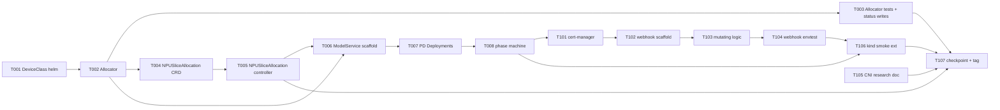

# Phase 5 Plan — Real claim allocation + NPUSliceAllocation CRD + inference-operator controller body + PD Router webhook

> **Goal**: Phase 5 closes the loop from `ModelService` to running
> vllm-ascend Pods with NPU slice bindings. Three controllers + one
> webhook + one new CRD light up on top of the Phase 4 scaffolds:
> (1) **npu-dra-driver real allocation** replaces the Phase 4
> `AllocationDeferred` annotation path with `status.devices[]` writes
> per ADR-0009 §5; (2) the new **NPUSliceAllocation CRD** materialises
> arch §6.8's Pool↔Pod abstraction (Phase 9 quota entry point);
> (3) the **inference-operator controller body** reads ModelService,
> creates ResourceClaims, spawns Prefill+Decode Deployments, tracks
> Phase=Ready; (4) the **PD Router mutating admission webhook** lives
> in the same inference-operator binary and stamps the
> `npu.huawei.com/slice-bindings` annotation onto Pods (ADR-0008
> implementation). A **CNI + HCCL networking research doc** seeds
> Phase 6 scheduler-plugin work.
>
> **Duration**: ~3-4 weeks calendar (W1 foundation 8 tasks: allocator +
> NPUSliceAllocation + inference-operator controller body; W2 polish 7
> tasks: webhook + CNI research + kind smoke + checkpoint). Phase 5 is
> the largest delta phase to date — allocator algorithm is the longest
> pole; webhook + cert-manager wiring is the highest infrastructure
> risk.
>
> **Prereq**: Phase 4 tag `phase-4-complete` (HEAD of dev = `803b429`).
> Phase 4 supplementary devlog + module DESIGN.md commits (`2b5f222` +
> `89bd850`) are not part of the Phase 4 tag content but ride on top of
> dev. ADR-0001 v3, ADR-0008 (design), ADR-0009 (design + scaffold)
> read for Phase 5 baseline. operators/CLAUDE.md §14 module DESIGN.md
> convention applies — new modules MUST land a DESIGN.md alongside the
> controller body task that ships their first reconciler.

---

## 1. Scope summary

Phase 5 lifts every Phase 4 "deferred to Phase 5" item without revving
the OpenAPI contract or touching the frontend. Backend integration is
limited to the kind-smoke E2E (the new CRDs do not surface through
`/api/v1/*` until Phase 6 introduces the workload-rendering refresh).

| Stream                                  | Phase 4 state                                                                                 | Phase 5 delivery                                                                                                                                                                                                |
|-----------------------------------------|-----------------------------------------------------------------------------------------------|-----------------------------------------------------------------------------------------------------------------------------------------------------------------------------------------------------------------|
| `npu-dra-driver` claim allocation       | T006 records `AllocationDeferred=Phase4Skeleton` via metadata.annotations (no real allocation) | Greedy first-fit allocator writes `status.devices[]` per ADR-0009 §5 + DeviceClass registration via helm chart + Phase 4 annotation path retired                                                                |
| `NPUSliceAllocation` CRD (arch §6.8)    | placeholder — schema TODO                                                                     | New CRD `NPUSliceAllocation` (cluster-scoped, owner-ref per claim allocation, audit log entry) + controller that creates one per successful claim allocation + reverse-lookup index for Phase 6 scheduler-plugin |
| `inference-operator` controller body    | T103 ships ModelService CRD types + manager scaffold; zero Reconciler                         | Reconcile resolves `npuSlicePoolRef` → creates N ResourceClaims via npu-dra-driver → spawns Prefill + Decode Deployments → tracks `phase=Pending→Provisioning→Ready/Failed`                                     |
| PD Router admission webhook (ADR-0008)  | design only (Phase 3 P3-T-106)                                                                | Mutating webhook implementation in inference-operator binary: cert-manager dependency + Certificate CRD + `Handle` injects `npu.huawei.com/slice-bindings` annotation                                           |
| CNI + HCCL networking compatibility     | not addressed                                                                                 | `docs/cni-hccl-research.md` mapping CNI plugins (Calico / Cilium / Flannel) × HCCL transports (RDMA / RoCE / IPoIB) seeds Phase 6 scheduler-plugin design                                                        |
| Real-cluster kind smoke E2E             | Phase 4 deploys npu-dra-driver + asserts ResourceSlice visibility                             | Extended to deploy cert-manager → inference-operator → create ModelService → assert Prefill + Decode Pods materialised with `slice-bindings` annotation                                                         |
| pool-operator integration               | T102 reads `status.resourceSlicesObserved` (Phase 4 cross-watch smoke)                        | NPUSlicePool `status.allocatedSlices` reflects real NPUSliceAllocation entries (Phase 4 left this at 0 since no allocations happened)                                                                           |

Out of scope (Phase 6+):
- **HCCS topology-aware allocation** (scheduler-plugin NUMA + HCCS —
  Phase 5 allocator records hccs-ring as a hint annotation only;
  Phase 6 scheduler-plugin scores affinity)
- **Real Ascend hardware integration / CANN runtime calls** (Phase 7
  real-cluster phase; npu-dra-driver `Source.RealAscend` impl deferred)
- **vllm-ascend `disaggregated_prefill_v1` real proxy_server adoption**
  (Phase 5 ships ModelService → Deployment mapping; the upstream PD
  proxy/router subprocess is wired as a Container env-var or sidecar
  in a later iteration once vllm-ascend v0.12+ stabilises)
- **Standard-K8s 1.34+ DRA spike on real cluster** (Phase 7 lab
  access required)
- **Karmada multi-site federation + full RBAC / multi-tenant quota
  model** (Phase 9 — NPUSliceAllocation owner-ref machinery is the
  Phase 5 substrate Phase 9 quota controller reads)
- **Fabric discovery via LLDP / SONiC API** (ADR-0007 — operator-side
  work on real switching gear)
- **MindIE Turbo backend toggle in vllm-ascend Pods** (Phase 6 — runs
  through container env var; Phase 5 ships the Deployment with the
  vllm-ascend `--quantization` flag passthrough only)
- **Workload-rendering frontend integration** — Phase 5 backend
  `/api/v1/workloads` does NOT yet read NPUSliceAllocation; Phase 6
  workload refresh adds it.

---

## 2. Task package overview (15 tasks)

```
W1 Foundation (8 tasks — allocator + NPUSliceAllocation + inference-operator scaffold)
├── P5-T-001  npu-dra-driver DeviceClass helm template registration (per ADR-0009 §5 step 1)
├── P5-T-002  npu-dra-driver Claim controller real allocator (greedy first-fit, ADR-0009 §6)
├── P5-T-003  Allocator tests (5 envtest cases) + status.devices[] writes + Phase 4 annotation path retired
├── P5-T-004  NPUSliceAllocation CRD types + groupversion_info + scheme (operators/npu-dra-driver/api/v1alpha2 or new operator?)
├── P5-T-005  NPUSliceAllocation controller (create per successful claim allocation; owner-ref + reverse-lookup index)
├── P5-T-006  inference-operator ModelService controller scaffold (Reconcile + finalizer + NPUSlicePoolRef resolution)
├── P5-T-007  inference-operator Prefill+Decode Deployment materialisation (one Deployment per side)
└── P5-T-008  inference-operator phase machine (Pending → Provisioning → Ready / Failed + conditions)

W2 Polish + webhook + CNI research + checkpoint (7 tasks)
├── P5-T-101  cert-manager helm dep + Certificate CRD wiring for inference-operator webhook TLS
├── P5-T-102  PD Router admission webhook scaffold (admission.Handler boilerplate; failurePolicy=Fail)
├── P5-T-103  PD Router mutating logic + slice-bindings annotation injection (ADR-0008 implementation)
├── P5-T-104  PD Router envtest cases (4 cases: ModelService Pod / non-MS Pod ignored / no slice available / cert failure)
├── P5-T-105  docs/cni-hccl-research.md — CNI × HCCL transport compatibility matrix (Phase 6 scheduler-plugin seed)
├── P5-T-106  kind smoke E2E extension (cert-manager + inference-operator + ModelService → PD pods + annotation)
└── P5-T-107  Phase 5 docs + checkpoint + tag phase-5-complete
```

Mermaid:



Subagent parallelisation candidates (per the v2 strict-verify rule —
ONE subagent at a time, main agent verifies before next is dispatched):
- T001 (helm-only) parallel with T002 (Go-only) — different paths
- T004 (CRD types only) standalone — no dependency on T002 runtime
- T105 (research doc, no code) standalone — no dependency on
  anything

---

## 3. W1 task packages

### P5-T-001 npu-dra-driver DeviceClass helm template registration

Owner: deploy / operators (helm chart edit + manager flag passthrough).

**Allowed Paths**:
- `deploy/helm-charts/npu-dra-driver/templates/deviceclass.yaml` (new — DeviceClass CR with optional sub-class variants)
- `deploy/helm-charts/npu-dra-driver/values.yaml` (small edit — toggle `deviceClass.create` + `deviceClass.subClasses` enabling /whole and /dynamic registration)
- `deploy/helm-charts/npu-dra-driver/templates/rbac.yaml` (small edit — verify `deviceclasses` write verbs already granted from Phase 4 T101; if missing, extend)
- `deploy/helm-charts/npu-dra-driver/README.md` (small edit — DeviceClass section + Phase 5 invariants)

Acceptance:
- `helm template ... | grep "kind: DeviceClass"` shows the rendered DeviceClass when `deviceClass.create=true` (default true)
- Bare class `npu.ocloud.edge.example.com` matches all NPU ResourceSlices (no selector)
- When `deviceClass.subClasses.whole=true`, an additional `/whole` class is rendered with a selector matching `npu.huawei.com/slice-strategy=FixedTemplate`
- When `deviceClass.subClasses.dynamic=true`, an additional `.dynamic` class is rendered with a selector matching `npu.huawei.com/slice-strategy=Dynamic`
- `helm lint --strict` passes
- `kubectl apply --dry-run=client -f -` succeeds on rendered output

Dependencies: none beyond `phase-4-complete`.

Estimated effort: 0.5d.

---

### P5-T-002 npu-dra-driver Claim controller real allocator (greedy first-fit)

Owner: operators/npu-dra-driver (controller body upgrade).

**Allowed Paths**:
- `operators/npu-dra-driver/internal/controller/claim_controller.go` (rewrite — replace Phase 4 annotation path with real allocation logic + status.devices[] writes)
- `operators/npu-dra-driver/internal/allocator/allocator.go` (new — pluggable Allocator interface + greedy first-fit impl per ADR-0009 §6)
- `operators/npu-dra-driver/internal/allocator/greedy.go` (new — greedy first-fit, deterministic by slice name + device index)
- `operators/npu-dra-driver/internal/allocator/available.go` (new — `computeAvailable(slices, allocations)` reads NPUSliceAllocation list to know what's free)
- `operators/npu-dra-driver/internal/controller/claim_controller_test.go` (rewrite — Phase 4 annotation tests retired, allocator tests added in T003)
- `operators/npu-dra-driver/api/v1alpha1/resourceclaim_types.go` (small edit — annotation consts marked deprecated, no longer set by controller; consts kept for Phase 4→5 migration parsing)

Acceptance:
- `Allocator` interface: `Allocate(ctx, claim, slices, allocations) (*Allocation, error)` returns the chosen slice + device + AICores
- Greedy first-fit deterministic: same input → same output across runs (sort by slice.Name then device index)
- ResourceClaim with class `npu.ocloud.edge.example.com` (bare) matches any device with `Available >= request.cores`
- ResourceClaim with sub-class `/whole` only matches devices where `slice-strategy=FixedTemplate`
- ResourceClaim with sub-class `.dynamic` only matches devices where `slice-strategy=Dynamic`
- On successful allocation: controller writes `status.devices[]` AllocatedDeviceStatus entry (driver + pool + device + conditions Type=Ready Status=True)
- On allocation failure (no device): controller leaves `status.devices` empty + writes `Allocation` field unset; next reconcile retries
- Phase 4 annotation path retired (controller no longer sets the 4 `ocloud.edge.example.com/allocation-deferred*` annotations); existing claims carrying those annotations are tolerated (parser strips on first reconcile)
- `go test ./internal/allocator/... -timeout 60s` passes (unit tests for `computeAvailable` + greedy + best-fit variant)

Dependencies: T001 (DeviceClass must exist for sub-class selectors).

Estimated effort: 1.5d.

---

### P5-T-003 Allocator tests + status.devices[] writes + Phase 4 annotation retired

Owner: operators/npu-dra-driver (test coverage extension).

**Allowed Paths**:
- `operators/npu-dra-driver/internal/controller/claim_controller_test.go` (rewrite — 5 new test cases covering Phase 5 allocator)
- `operators/npu-dra-driver/internal/allocator/allocator_test.go` (new — table-driven tests for greedy + best-fit on synthetic ResourceSlice fixtures)
- `operators/npu-dra-driver/internal/allocator/available_test.go` (new — `computeAvailable` reads NPUSliceAllocation list)
- `operators/npu-dra-driver/DESIGN.md` (small edit — §"Phase 5 allocator algorithm" section added; Phase 4 annotation path marked DEPRECATED)

Acceptance:
- Claim controller envtest cases (5 minimum):
  - Happy path: claim with bare driver class → allocator picks first available device → `status.devices[]` has 1 entry
  - Sub-class `/whole`: only FixedTemplate devices considered (synthetic fixture has both types; assert dynamic devices NOT picked)
  - Sub-class `.dynamic`: only Dynamic devices considered
  - No available device: `status.devices` empty + reconcile returns Requeue=true (retry on next tick)
  - Phase 4 annotation migration: pre-existing claim with `ocloud.edge.example.com/allocation-deferred=true` annotation → controller strips annotation + allocates normally
- Allocator unit tests (5 minimum):
  - Greedy deterministic across 3 runs with shuffled input slices
  - Best-fit picks smallest-slack candidate
  - Empty slice list → ErrNoAvailableDevice
  - All slices full → ErrNoAvailableDevice
  - Single slice + multi-device → picks lowest-index device
- `operators/npu-dra-driver/DESIGN.md` §"Phase 5 allocator algorithm" documents greedy first-fit invariants + the Phase 4→5 migration semantics

Dependencies: T002 (allocator impl must exist).

Estimated effort: 1d.

---

### P5-T-004 NPUSliceAllocation CRD types + groupversion + scheme

Owner: operators/npu-dra-driver (new typed API surface).

**Decision needed at task entry**: where does NPUSliceAllocation live?
- Option A: `operators/npu-dra-driver/api/v1alpha1/` (same module as DriverName const; tight cohesion with claim controller)
- Option B: `operators/pool-operator/api/v1alpha1/` (alongside NPUSlicePool; reflects "arch §6.8 Pool↔Pod abstraction" framing)
- Option C: new `operators/allocation-operator/` (most modular; matches Phase 9 quota controller forward path)

**Recommendation**: A (npu-dra-driver/api/v1alpha1). Cluster-scoped CRD,
owned by the claim controller that creates it. Phase 9 quota
controller can read from any module. Same CLAUDE.md `module path 不交
叉依赖` rule applies — pool-operator does NOT import npu-dra-driver
types; instead it uses the standard upstream Watches pattern on the
CRD via dynamic client (Phase 9 work).

**Allowed Paths** (assuming A):
- `operators/npu-dra-driver/api/v1alpha1/npusliceallocation_types.go` (new — CRD spec + status + scheme registration)
- `operators/npu-dra-driver/api/v1alpha1/zz_generated.deepcopy.go` (regen via controller-gen)
- `operators/npu-dra-driver/config/crd/bases/npu.ocloud.edge.example.com_npusliceallocations.yaml` (regen via controller-gen)
- `operators/npu-dra-driver/PROJECT` (small edit — add NPUSliceAllocation resource entry)
- `operators/npu-dra-driver/cmd/main.go` (small edit — no controller registration here yet; T005 lands it)

Acceptance:
- `kubebuilder:object:root=true`, `kubebuilder:resource:scope=Cluster,shortName=npua`, `kubebuilder:subresource:status`
- Spec fields (minimum):
  - `claimRef corev1.ObjectReference` — owning ResourceClaim
  - `sliceRef SliceReference` (typed struct: driver / pool / device name)
  - `nodeName string`
  - `aiCores int32` — allocated AI-core count
- Status fields:
  - `phase string` — Allocated / Released / Orphaned
  - `conditions []metav1.Condition`
- printcolumns: claimRef.name / sliceRef.device / nodeName / aiCores / phase / age
- `make manifests` regen produces clean YAML; `kubectl apply --dry-run=client -f config/crd/bases/...` succeeds
- DeepCopy regen clean (zero non-trivial drift)
- 3 round-trip test cases in `npusliceallocation_types_test.go` (similar pattern to T004 in Phase 4)

Dependencies: T001 (DeviceClass), T002 (allocator decides when to create — but T005 does the actual create call; T004 only ships the types).

Estimated effort: 0.5d.

---

### P5-T-005 NPUSliceAllocation controller (create per successful claim allocation)

Owner: operators/npu-dra-driver (new Reconciler in internal/controller).

**Allowed Paths**:
- `operators/npu-dra-driver/internal/controller/allocation_controller.go` (new — reconciles NPUSliceAllocation; creates it from claim_controller on successful allocate; tracks lifecycle)
- `operators/npu-dra-driver/internal/controller/allocation_controller_test.go` (new — envtest cases)
- `operators/npu-dra-driver/internal/controller/claim_controller.go` (small edit — on successful allocation, create NPUSliceAllocation owner-ref'd to the ResourceClaim)
- `operators/npu-dra-driver/cmd/main.go` (small edit — register AllocationReconciler when --enable-allocation-controller flag is set; default ON in Phase 5)
- `deploy/helm-charts/npu-dra-driver/values.yaml` (small edit — `allocationController.enabled` toggle; default true)
- `deploy/helm-charts/npu-dra-driver/templates/deployment.yaml` (small edit — wire --enable-allocation-controller per the toggle)
- `deploy/helm-charts/npu-dra-driver/templates/rbac.yaml` (small edit — npusliceallocations get/list/watch/create/update/patch/delete)
- `operators/npu-dra-driver/DESIGN.md` (small edit — §"NPUSliceAllocation lifecycle")

Acceptance:
- Controller registers an OwnerReference on each NPUSliceAllocation pointing back at the owning ResourceClaim (so claim delete → cascade delete via GC)
- On NPUSliceAllocation create: status.phase=Allocated + Available condition True
- On owning ResourceClaim delete: GC removes NPUSliceAllocation; the next AllocationReconciler pass observes the absence (no error)
- Orphan detection: NPUSliceAllocation whose owner-ref points at a non-existent claim (race + GC lag) → phase=Orphaned after 30s grace
- envtest cases (4 minimum):
  - Happy: claim allocate → NPUSliceAllocation created with owner-ref + phase=Allocated
  - Cascade delete: delete claim → NPUSliceAllocation gone after GC pass
  - Multi-claim: 3 claims allocated on different devices → 3 NPUSliceAllocations distinct
  - Orphan: NPUSliceAllocation with stale ownerRef → phase=Orphaned after 30s
- `go test ./internal/controller/... -timeout 90s` passes (envtest binary required; CI gates)

Dependencies: T002 (claim controller creates NPUSliceAllocation), T004 (CRD types).

Estimated effort: 1d.

---

### P5-T-006 inference-operator ModelService controller scaffold

Owner: operators/inference-operator (first Reconciler in internal/controller).

**Allowed Paths**:
- `operators/inference-operator/internal/controller/modelservice_controller.go` (new — Reconcile entry + finalizer + NPUSlicePoolRef resolution)
- `operators/inference-operator/internal/controller/suite_test.go` (new — shared envtest harness mirror of npu-dra-driver pattern)
- `operators/inference-operator/internal/controller/utils.go` (new — SetCondition / RemoveCondition mirror)
- `operators/inference-operator/cmd/main.go` (small edit — register ModelServiceReconciler when --enable-modelservice-controller flag set; default true in Phase 5)
- `operators/inference-operator/go.mod` (tidy as imports land)
- `operators/inference-operator/DESIGN.md` (new — module DESIGN.md per CLAUDE.md §14 convention)
- `deploy/helm-charts/inference-operator/` (new chart — Phase 4 deferred this; W2 fully wires the chart, but T006 lands the chart skeleton mirroring npu-dra-driver Phase 4 T101 pattern: Chart.yaml + values.yaml + serviceaccount.yaml + rbac.yaml + deployment.yaml + _helpers.tpl + README.md + .helmignore)

Acceptance:
- Reconcile flow: Get ModelService → add finalizer (first pass requeue) → resolve `spec.npuSlicePoolRef` (must exist in same namespace) → set status.phase=Provisioning → return (Deployments + Claims arrive at T007)
- Finalizer `inference.ocloud.edge.example.com/modelservice-cleanup` blocks deletion until owned resources gone
- pool-not-found: status.phase=Failed + Type=PoolUnresolved condition False reason=NPUSlicePoolNotFound
- pool-found-but-not-ready: phase stays Provisioning + a "WaitingForPool" event
- `make manager` builds; `make test` envtest covers happy-path + pool-not-found + finalizer-add+drain (3 cases)
- helm chart `helm lint --strict` passes
- DESIGN.md documents Phase 5 controller architecture (data flow + finalizer states + cross-reference to ADR-0008)

Dependencies: T001 (claim allocator + DeviceClass — T006 creates claims pointing at the class but claims may stay Pending until T002 finishes); T004 + T005 (NPUSliceAllocation visible to ModelService phase machine).

Estimated effort: 1.5d.

---

### P5-T-007 inference-operator Prefill+Decode Deployment materialisation

Owner: operators/inference-operator (controller body extension).

**Allowed Paths**:
- `operators/inference-operator/internal/controller/modelservice_controller.go` (extend — Reconcile creates two Deployments per ModelService: one for Prefill, one for Decode)
- `operators/inference-operator/internal/controller/deployment_builder.go` (new — pure-function builders that turn ModelService + side enum into a *appsv1.Deployment)
- `operators/inference-operator/internal/controller/claim_builder.go` (new — pure-function builders that produce a ResourceClaim per replica with the right DeviceClassName + preferred-pool annotation pointing at the resolved NPUSlicePool)
- `operators/inference-operator/internal/controller/modelservice_controller_test.go` (extend — 5 cases: prefill-only / decode-only / both / replica-count change / image change)
- `operators/inference-operator/DESIGN.md` (extend — §"Deployment + Claim materialisation")

Acceptance:
- Each Deployment carries the `inference.ocloud.edge.example.com/pd-role=prefill|decode` label (per `spec.pdPair.routerLabel` value — default convention)
- Per-replica ResourceClaims created (one ResourceClaim per Pod replica): claim spec.devices.requests[0].deviceClassName = `npu.ocloud.edge.example.com`; annotation `ocloud.edge.example.com/preferred-pool=<spec.npuSlicePoolRef.name>` + `ocloud.edge.example.com/model-service-ref=<ns>/<name>`
- Pod template references the claim via `pod.spec.resourceClaims[].source.resourceClaimName` (DRA standard)
- Deployment OwnerRef points at ModelService (cascade delete on ModelService remove)
- replica-count change: existing Deployment scaled in-place (no recreate); claim count adjusted (creates new claims / deletes stale claims)
- image change: rolling update via standard Deployment strategy
- envtest cases pass; `go test ./internal/controller/... -timeout 120s` clean

Dependencies: T006 (Reconcile scaffold), T002 (allocator must be live for claims to actually bind — but the test relies only on claims being created, not allocated).

Estimated effort: 1.5d.

---

### P5-T-008 inference-operator phase machine (Pending → Provisioning → Ready / Failed)

Owner: operators/inference-operator (status + conditions wiring).

**Allowed Paths**:
- `operators/inference-operator/internal/controller/modelservice_controller.go` (extend — phase machine + condition writes)
- `operators/inference-operator/internal/controller/phases.go` (new — Phase transition rules; readiness aggregation from Deployment + Claim status)
- `operators/inference-operator/internal/controller/phases_test.go` (new — table-driven transition tests)
- `operators/inference-operator/DESIGN.md` (extend — phase diagram + transition rules)

Acceptance:
- Phase=Pending: created but Reconcile hasn't run; should immediately advance to Provisioning on first reconcile
- Phase=Provisioning: deployments/claims being created OR not yet ready
- Phase=Ready: prefill.readyReplicas == prefill.replicas AND decode.readyReplicas == decode.replicas AND all per-replica claims have AllocatedDeviceStatus with Type=Ready (read via owner-ref → claim) — full PD-pair healthy
- Phase=Failed: pool-not-found / image-pull-error / allocation-permanently-unavailable (NPUSliceAllocation orphaned for >5min) — terminal-ish but auto-recovers if spec edit fixes the cause
- Conditions emitted (minimum):
  - Type=Available Status=True when Ready
  - Type=ProgressDeadline Status=False when stuck Provisioning > 10min
  - Type=AllocationReady Status=True when all per-replica claims have NPUSliceAllocation
- envtest cases (5 minimum): Pending→Provisioning / Provisioning→Ready / Provisioning→Failed (pool-not-found) / Ready→Provisioning (replica scale-up) / Ready→Failed (image pull error simulated via fake client)

Dependencies: T007 (deployments + claims must exist for readiness aggregation).

Estimated effort: 1d.

---

## 4. W2 task packages

### P5-T-101 cert-manager helm dep + Certificate CRD wiring

Owner: deploy (inference-operator chart extension).

**Allowed Paths**:
- `deploy/helm-charts/inference-operator/Chart.yaml` (extend — `dependencies: [cert-manager v1.16+]` subchart entry; alternatively document pre-install requirement)
- `deploy/helm-charts/inference-operator/templates/certificate.yaml` (new — Certificate CR pointing at a cert-manager Issuer; annotation `cert-manager.io/inject-ca-from` on the future MutatingWebhookConfiguration)
- `deploy/helm-charts/inference-operator/templates/issuer.yaml` (new — self-signed Issuer; production deployments override via values)
- `deploy/helm-charts/inference-operator/values.yaml` (small edit — `certManager.enabled` toggle + `certManager.namespace` override; default true; default namespace `cert-manager`)
- `deploy/helm-charts/inference-operator/README.md` (small edit — cert-manager prerequisites)
- `docs/known-issues.md` (small edit — add expected `helm install` ordering: cert-manager first → inference-operator second; document the 30-90s wait for Issuer Ready)

Acceptance:
- `helm template --set certManager.enabled=true ...` renders Certificate + Issuer; `helm template --set certManager.enabled=false ...` renders neither (operators bringing their own cert wiring)
- `helm lint --strict` passes
- Pre-install ordering documented in README

Dependencies: T008 (inference-operator binary ready; webhook arrives T102 but cert plumbing prepares the chart).

Estimated effort: 0.5d.

---

### P5-T-102 PD Router admission webhook scaffold

Owner: operators/inference-operator (webhook package init).

**Allowed Paths**:
- `operators/inference-operator/internal/webhook/pd_router.go` (new — admission.Handler boilerplate; Handle returns admission.Allowed for now; logs the request)
- `operators/inference-operator/internal/webhook/pd_router_test.go` (new — admission.Request fixture + Handle returns Allowed)
- `operators/inference-operator/cmd/main.go` (small edit — register webhook via `mgr.GetWebhookServer().Register("/mutate-pod", &webhook.Admission{Handler: ...})` when --enable-pd-router-webhook flag set; default true in Phase 5)
- `deploy/helm-charts/inference-operator/templates/mutatingwebhookconfiguration.yaml` (new — failurePolicy=Fail; admissionReviewVersions=[v1]; matchPolicy=Equivalent; objectSelector matches Pods carrying `inference.ocloud.edge.example.com/model-service` label written by T007)
- `deploy/helm-charts/inference-operator/values.yaml` (small edit — `pdRouter.enabled` + `pdRouter.failurePolicy` toggles)
- `operators/inference-operator/DESIGN.md` (extend — §"PD Router webhook" section)

Acceptance:
- `make manager` builds with webhook code linked
- `helm template` renders MutatingWebhookConfiguration with the Certificate's caBundle injected (via `cert-manager.io/inject-ca-from` annotation)
- Unit test: admission.Request for a Pod NOT matching the objectSelector → handler not invoked (Phase 5 envtest deferred to T104)
- failurePolicy=Fail per ADR-0008 §"Fail-closed default" — production deployments override via values.yaml to Ignore during initial rollout

Dependencies: T101 (cert wiring), T008 (inference-operator binary).

Estimated effort: 0.5d.

---

### P5-T-103 PD Router mutating logic + slice-bindings annotation injection

Owner: operators/inference-operator (webhook implementation).

**Allowed Paths**:
- `operators/inference-operator/internal/webhook/pd_router.go` (rewrite — Handle reads Pod labels → looks up ModelService → reads its NPUSliceAllocation list → builds `npu.huawei.com/slice-bindings` annotation value → returns patch)
- `operators/inference-operator/internal/webhook/slice_binding.go` (new — slice-binding annotation value builder; reuses npu-dra-driver's SliceReference type via the dynamic client OR re-declares the typed struct here to avoid cross-module import)
- `operators/inference-operator/internal/webhook/pd_router_test.go` (extend — 4 cases: happy path / non-MS Pod ignored / pool empty (no slices) / Allocation phase=Orphaned → fail-closed)
- `operators/inference-operator/DESIGN.md` (extend — slice-binding annotation schema + Phase 6 scheduler-plugin consumer pointer)

Acceptance:
- Annotation value: comma-separated list of `<node>/<slice>/<device>:<aiCores>` entries; one entry per Pod replica's ResourceClaim (looked up by name via the model-service label)
- Pod missing the `model-service` label → handler returns Allowed without patch (objectSelector should pre-filter, but defense in depth)
- All claims allocated → annotation has N entries (N = total claims for this Pod replica)
- One or more claims not allocated yet → handler returns Allowed without patch (Pod will be re-evaluated on its next event; webhook is best-effort enrichment, not blocking)
- All claims Orphaned (phase=Orphaned for >5min per T005) → handler returns Denied with reason `NoAvailableNPUSlices` (production override toggle in values.yaml)
- ADR-0008 §"Fail-closed default" honored

Dependencies: T005 (NPUSliceAllocation queryable), T007 (claims labelled with model-service ref).

Estimated effort: 1d.

---

### P5-T-104 PD Router envtest cases

Owner: operators/inference-operator (E2E webhook test coverage).

**Allowed Paths**:
- `operators/inference-operator/internal/webhook/pd_router_envtest_test.go` (new — kind cluster + cert-manager + ModelService → Pod creation observed → annotation asserted)
- `operators/inference-operator/internal/webhook/testdata/*.yaml` (new — fixture ModelService + NPUSlicePool + Node objects)

Acceptance:
- 4 envtest cases (or kind-based integration tests):
  - Happy: ModelService created → Prefill Pod created → annotation injected with N entries
  - Non-MS Pod: pod created in same namespace without model-service label → no annotation
  - Empty pool: ModelService points at NPUSlicePool with 0 slices → Prefill Pod gets no annotation + ModelService phase=Provisioning
  - Cert failure: simulate Certificate Not Ready → webhook server returns TLS error → with failurePolicy=Fail Pod create blocked; with failurePolicy=Ignore Pod created without annotation (both paths exercised)
- `go test ./internal/webhook/... -timeout 180s` passes

Dependencies: T103 (mutating logic must work), T101 (cert-manager wiring).

Estimated effort: 1d.

---

### P5-T-105 docs/cni-hccl-research.md — CNI × HCCL transport compatibility

Owner: docs (research; no code).

**Allowed Paths**:
- `docs/cni-hccl-research.md` (new — research doc seeded by arch §13 Phase 5+ row)
- `docs/architecture.md` (small edit — §13 review-table row "NPU pod 网络考量" marked "research doc landed (P5-T-105); selection deferred to Phase 6 scheduler-plugin entry")

Acceptance:
- Matrix table: CNI (Calico / Cilium / Flannel / Multus + sub-options) × HCCL transport (RDMA / RoCE v2 / IPoIB) × verdict (Recommended / Caveats / Not supported)
- Each row cites at least one upstream reference (NVIDIA Network Operator docs / Calico RDMA support / Cilium IPv6+RoCE)
- "Phase 5 simulator scope" sub-section: confirms Phase 5 manager + webhook do not depend on any specific CNI (in-cluster K8s service routing only)
- "Phase 6 entry recommendation" sub-section: top-2 CNI candidates for the scheduler-plugin work
- "Known gaps" sub-section: any HCCL feature unsupported across all candidates (e.g. requires SR-IOV-only) explicitly listed

Dependencies: none (research doc; sequence at any point).

Estimated effort: 0.5d.

---

### P5-T-106 kind smoke E2E extension

Owner: deploy / .github/workflows (CI extension).

**Allowed Paths**:
- `.github/workflows/e2e-kind.yml` (extend — Phase 5 sub-job that installs cert-manager → inference-operator → creates a ModelService against the Phase 4 set-a-small NPU pool → asserts Prefill/Decode Pods created with `slice-bindings` annotation)
- `tests/e2e/kind/phase5/install.sh` (new — bash script that orchestrates cert-manager + inference-operator helm installs + waits for Certificate Ready)
- `tests/e2e/kind/phase5/assert.sh` (new — bash script that creates a ModelService + waits for phase=Provisioning → asserts Pod count + annotation presence)
- `tests/e2e/kind/phase5/fixtures/modelservice-sample.yaml` (new — minimal ModelService for the smoke)

Acceptance:
- e2e-kind workflow green from PR (sub-job runs against ubuntu-latest with kind 0.23+, K8s 1.31)
- Pre-checks: cert-manager Issuer Ready within 90s; inference-operator Deployment Available within 60s
- Smoke: ModelService phase=Provisioning within 30s; Prefill Pod + Decode Pod each created within 60s; both Pods carry `npu.huawei.com/slice-bindings` annotation (value non-empty); claim allocation visible via `kubectl get resourceclaims -A | grep ms-` (count == replicas)
- Failure modes captured: timeout on Certificate Ready → workflow fails fast with "cert-manager not Ready in 90s — check kind cluster size or pre-pull cert-manager images"
- Workflow uses GitHub Actions cache for kind + helm + image pulls (Phase 4 T104 already wires this)

Dependencies: T101 + T103 + T008 (all webhook + controller pieces must work).

Estimated effort: 1d.

---

### P5-T-107 Phase 5 docs + checkpoint + tag

Owner: docs (sealing the phase).

**Allowed Paths**:
- `docs/checkpoint-phase5.md` (new — mirrors checkpoint-phase4.md structure: status table per task + tests inventory + known issues + Phase 6 seed brief)
- `docs/architecture.md` (small edit — §13 review-table Phase 5 rows promoted from "Phase 5 candidate" to "Phase 5 landed at SHA"; Phase 6 candidates retained)
- `docs/known-issues.md` (small edit — any Phase 5 net-new issues numbered + closed-or-deferred)
- `docs/phase5-plan.md` (this file — small edit at end: "Phase 5 actual lands as `phase-5-complete` at commit <SHA>; T107 ran <date>")
- `README.md` (small edit — current-phase pointer to phase-5-complete; Phase 4 → Phase 5 narrative)
- git tag `phase-5-complete` at the merge commit of T107

Acceptance:
- All 14 W1+W2 tasks have a row in checkpoint-phase5.md showing commit SHA + tests pass status
- Phase 6 seed: at least 3 candidate workstreams enumerated (HCCS scheduler-plugin / Workload-rendering frontend / multi-tenancy RBAC entry) with effort estimate + risks
- README.md current-phase line points at phase-5-complete
- Tag `phase-5-complete` lands on the merge commit; `git tag -l 'phase-*'` shows it alongside the existing 4 tags

Dependencies: all prior Phase 5 tasks.

Estimated effort: 0.5d.

---

## 5. Phase 5 DoD

Phase 5 is considered complete (`phase-5-complete` tag lands) when
every checkbox below passes. Verification is a mix of `go test` /
`helm lint` / `kubectl --dry-run` and the e2e-kind workflow.

### W1 Foundation
- [ ] `deploy/helm-charts/npu-dra-driver/templates/deviceclass.yaml`
  renders + `kubectl apply --dry-run=client` clean; bare class
  matches all NPU slices; sub-class selectors match strategy
- [ ] `operators/npu-dra-driver/internal/allocator/` greedy first-fit
  + best-fit unit tests pass; allocator is deterministic
- [ ] Claim controller writes `status.devices[]` AllocatedDeviceStatus
  on successful allocate; Phase 4 annotation path retired (annotations
  no longer set; pre-existing annotations stripped on first reconcile)
- [ ] `operators/npu-dra-driver/api/v1alpha1/npusliceallocation_types.go`
  + CRD manifest landed; round-trip tests pass
- [ ] NPUSliceAllocation controller creates one per successful claim
  allocation; cascade delete via owner-ref works; orphan detection
  fires phase=Orphaned after 30s grace
- [ ] inference-operator ModelService Reconciler resolves
  npuSlicePoolRef; finalizer adds + drains correctly; pool-not-found
  yields phase=Failed + AllocationReady=False
- [ ] inference-operator creates Prefill + Decode Deployments + N
  per-replica ResourceClaims with correct DeviceClassName + preferred-
  pool annotation; replica scale + image change reconcile cleanly
- [ ] inference-operator phase machine drives Pending → Provisioning
  → Ready / Failed with the documented condition set

### W2 Polish + integration
- [ ] cert-manager dependency wired into inference-operator helm chart
  + Certificate + Issuer rendered when enabled; pre-install ordering
  documented
- [ ] PD Router mutating admission webhook handler returns Allowed/
  Patched/Denied per ADR-0008 §"Fail-closed default" semantics
- [ ] PD Router writes `npu.huawei.com/slice-bindings` annotation
  with comma-separated `<node>/<slice>/<device>:<aiCores>` value
- [ ] PD Router envtest cases pass: happy / non-MS Pod / empty pool /
  cert failure (failurePolicy=Fail vs Ignore both exercised)
- [ ] `docs/cni-hccl-research.md` landed with CNI × HCCL transport
  matrix + Phase 6 entry recommendation
- [ ] kind smoke E2E extension: cert-manager + inference-operator
  install → ModelService create → Prefill+Decode Pods up with
  `slice-bindings` annotation populated; workflow green
- [ ] `phase-5-complete` tag lands on the merge commit of T107
- [ ] `docs/checkpoint-phase5.md` documents every commit SHA + tests
  pass status + known issues + Phase 6 seed

### Out of scope (carried forward)
- [ ] HCCS topology-aware allocation — defer to Phase 6 scheduler-
  plugin (allocator records hccs-ring hint only)
- [ ] Real Ascend hardware integration / CANN runtime calls — defer
  to Phase 7 real-cluster phase
- [ ] vllm-ascend `disaggregated_prefill_v1` real proxy_server
  adoption — defer to Phase 6 once vllm-ascend v0.12+ stabilises
- [ ] Standard-K8s 1.34+ DRA spike on real cluster — defer to Phase 7
- [ ] Karmada multi-site federation + multi-tenant quota controller —
  defer to Phase 9 (NPUSliceAllocation is the substrate Phase 9 reads)
- [ ] Workload-rendering frontend integration — defer to Phase 6
- [ ] Fabric discovery via LLDP / SONiC API — defer per ADR-0007

---

## 6. Phase 4 → Phase 5 handoff brief

### What Phase 4 leaves to Phase 5

1. **npu-dra-driver scaffold + simulator publisher + claim controller
   skeleton** — Phase 4 ships the bones. Phase 5 hangs real allocator
   logic on the claim controller; the publisher stays unchanged
   (Phase 4 simulator-first design holds through Phase 5; Phase 7
   swaps Source.RealAscend in).
2. **inference-operator scaffold + ModelService CRD types** — Phase 4
   ships zero controllers + ModelService types only. Phase 5 lands
   the Reconciler body + PD Router webhook in the same binary
   (ADR-0008 design pinned).
3. **ADR-0009 §5 Phase 5 implementation outline** — 6 items mapped
   1:1 onto P5-T-001..P5-T-005. Allocator algorithm choice is the
   only entry decision (greedy first-fit recommended; best-fit
   available as a feature flag).
4. **arch §6.8 NPUSliceAllocation placeholder** — Phase 4 left the
   schema TODO; Phase 5 P5-T-004 ships it.
5. **CANN / driver matrix** — Phase 4's `docs/cann-driver-matrix.md`
   covers Phase 4 simulator scope; Phase 5 + Phase 6 stay in simulator
   mode (real-hw verification deferred Phase 7).

### Phase 5 entry meeting agenda

Before P5-T-001 starts, the meeting confirms:

1. **Allocator algorithm choice**: greedy first-fit (recommended) vs
   best-fit (feature-flag fallback). Topology-aware deferred Phase 6.
2. **NPUSliceAllocation home**: `operators/npu-dra-driver/api/v1alpha1`
   (recommended) vs new `operators/allocation-operator/`. The former
   is the default unless multi-tenant Phase 9 work needs strict
   module decoupling earlier.
3. **PD Router failurePolicy default**: Fail (recommended per
   ADR-0008) vs Ignore (production phased-rollout option). Phase 5
   ships both via values.yaml override.
4. **cert-manager rollout strategy**: subchart dependency vs pre-
   install requirement. Subchart binds the version; pre-install
   leaves the operator to manage cert-manager themselves.
5. **CI envtest envelope**: setup-envtest binaries + kind 0.23+ +
   K8s 1.31 fixture; the Phase 4 helm-lint workflow extends to lint
   `inference-operator` chart in addition to `npu-dra-driver` and
   `ascend-npu-exporter-plus`.

### Phase 5 risks (top 3)

1. **Webhook TLS sequencing fragility**: cert-manager → Issuer Ready
   → Certificate Ready → MutatingWebhookConfiguration applied is a
   ~30-90s sequence in kind clusters. Helm `--wait` + post-install
   verification reduces risk; mitigation if recurring is to ship a
   `helmfile.yaml` orchestrating the order.
2. **NPUSliceAllocation orphan/race**: Claim deletion → owner-ref
   GC → NPUSliceAllocation gone is async. Phase 5 orphan detection
   has a 30s grace; if the kind cluster is slow this can flake e2e
   tests. Mitigation: bump grace to 60s in CI; document in known-
   issues for Phase 6 review.
3. **vllm-ascend image pull**: kind smoke pulls a real-ish vllm-
   ascend image (or a stand-in busybox with PD-role labels?) —
   real image is ~5GB. Mitigation: use a busybox stand-in image with
   the right labels/env for Phase 5 smoke; real image E2E lands
   Phase 7 lab phase.

### Coordination handoff

- **Subagent dispatch model (v2 strict-verify, 2026-05-19)**: one
  subagent at a time; main agent runs `go vet` / `go test` /
  `helm lint --strict` / `kubectl --dry-run` / live binary smoke
  before next subagent starts. Verification per task, not batched.
- **devlog convention**: every T001..T107 commit's footer line
  `Devlog: docs/devlog/phase-5-tNNN.md` (per root CLAUDE.md §14).
- **Module DESIGN.md convention**: T002+T005+T006 all touch
  controller bodies that need DESIGN.md updates; same task commit
  carries the DESIGN.md edit.

---

**END of Phase 5 plan**
