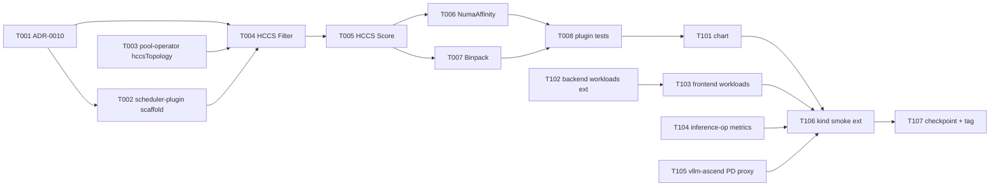

# Phase 6 Plan — HCCS / NUMA scheduler-plugin + Workloads frontend refresh + inference-operator metrics + vllm-ascend PD proxy adoption

> **Goal**: Phase 6 closes the M3 milestone for **topology-aware
> placement** of PD-pair Pods. The headline deliverable is a self-built
> `operators/scheduler-plugin/` (kube-scheduler-plugins framework) that
> filters + scores nodes by NUMA + HCCS-ring affinity, driven off the
> `npu.huawei.com/numa_node` / `npu.huawei.com/hccs_ring` attributes
> Phase 4-5 publishes onto ResourceSlices and the NPUSliceAllocation
> reverse-lookup index Phase 5 ships. Alongside the plugin: pool-
> operator fills `NPUPool.status.hccsTopology` (currently nil — arch §6.3),
> the workload-rendering frontend learns about NPUSliceAllocation rows
> (Phase 5 checkpoint §7 carry-over), the inference-operator publishes
> Prometheus counters for phase transitions + webhook decisions, and
> the ModelService PD-pair Deployments adopt vllm-ascend
> `disaggregated_prefill_v1` proxy_server in place of the Phase 5
> busybox stand-in (gated on vllm-ascend v0.12+ stability). ADR-0010
> records both the scheduler-plugin design and the Phase 6 CNI
> selection (Cilium + Multus + SR-IOV primary per
> `docs/cni-hccl-research.md` §4).
>
> **Duration**: ~3-4 weeks calendar (W1 foundation 8 tasks: ADR +
> scheduler-plugin scaffold + filter + score + plugin args + tests;
> W2 polish 7 tasks: chart + backend/frontend workload refresh +
> inference-operator metrics + vllm-ascend proxy adoption + kind smoke
> + checkpoint). Phase 6 is the deepest scheduler-framework phase to
> date — `kube-scheduler` plugin embedding is the longest pole; the
> backend↔frontend workload refresh runs in parallel.
>
> **Prereq**: Phase 5 tag `phase-5-complete` (HEAD of dev = `608f77a`,
> last commit of the P5-T-127 CI fix series). ADR-0008 (PD Router),
> ADR-0009 (npu-dra-driver), and `docs/cni-hccl-research.md` are the
> baseline reading for the Phase 6 entry decision. operators/CLAUDE.md
> §3 (sub-project conventions; no cross-module Go imports) applies to
> the new `operators/scheduler-plugin/` sub-project; root CLAUDE.md
> §14.2 (module DESIGN.md) applies — the scaffold task ships only the
> manager skeleton, the controller-body equivalent (Filter+Score
> wiring) lands DESIGN.md alongside the first plugin task.

---

## 1. Scope summary

Phase 6 lifts every Phase 5 "Out of scope · carried forward to Phase 6"
item except the Phase 7+ ones (real Ascend silicon, Standard-K8s 1.34+
DRA spike, Karmada multi-site, fabric LLDP). Backend and frontend
contracts both extend; the OpenAPI surface grows by one new optional
field on `Workload` (`sliceBindings[]`) — the contract change goes
through the standard RFC flow before T102 lands code.

| Stream                                  | Phase 5 state                                                                                                                              | Phase 6 delivery                                                                                                                                                                                                |
|-----------------------------------------|--------------------------------------------------------------------------------------------------------------------------------------------|-----------------------------------------------------------------------------------------------------------------------------------------------------------------------------------------------------------------|
| `scheduler-plugin` sub-project          | does not exist                                                                                                                              | new `operators/scheduler-plugin/` (kube-scheduler-plugins framework v0.31+) sub-project: `cmd/main.go` runs kube-scheduler with custom plugins compiled in; Dockerfile + Makefile + go.mod; first `helm-charts/scheduler-plugin/` |
| HCCS topology data path                 | npu-dra-driver publishes `npu.huawei.com/numa_node` + `npu.huawei.com/hccs_ring` ResourceSlice attributes from mock JSON (set-a-small has distinct rings) | pool-operator reads ResourceSlices + populates `NPUPool.status.hccsTopology` (arch §6.3 `HCCSTopologyInfo` struct) with ring-id → node/device map; scheduler-plugin reads either source |
| HCCSTopologyPlugin Filter               | does not exist                                                                                                                              | filters Nodes whose ResourceSlices cannot satisfy the Pod's HCCS-ring co-location request (read from Pod's `npu.huawei.com/preferred-hccs-ring` annotation that the inference-operator stamps; absent → permissive filter) |
| HCCSTopologyPlugin Score                | does not exist                                                                                                                              | scores Nodes by HCCS-ring co-location preference: Pods of the same ModelService (`inference.ocloud.edge.example.com/model-service` label) prefer co-location on the same ring; cross-ring placement degrades the score linearly |
| NumaAffinityPlugin                      | does not exist                                                                                                                              | wires upstream `sigs.k8s.io/scheduler-plugins/pkg/noderesourcetopology` Filter+Score; arg-tunable via `KubeSchedulerConfiguration` (default `weight=2`)                                                          |
| BinpackPlugin                           | does not exist                                                                                                                              | community Volcano-style binpack Score (least-fragmented Pod placement); default off, opt-in via plugin args                                                                                                     |
| inference-operator metrics              | none                                                                                                                                       | Prometheus counters for ModelService phase transitions / PD Router webhook decisions (Allowed/Patched/Denied) / claim allocation picks; exposed on `:8081/metrics` (separate port from webhook 9443)            |
| Backend `/api/v1/workloads` extension   | returns Deployments + Pods only                                                                                                            | extended with optional `sliceBindings[]` derived from NPUSliceAllocation rows for the workload's Pods; gated behind `?includeSliceBindings=true` query parameter (no-op when CRD source not configured)         |
| Frontend Workloads page                 | renders Deployments + Pods                                                                                                                 | adds PD-pair grouping (by `pd-role` label) + per-replica slice-binding badges (node/pool/device/ai-cores) when `sliceBindings[]` populated; new column "HCCS ring" if present                                    |
| vllm-ascend PD proxy_server adoption    | PD-pair Deployments run busybox stand-in (Phase 5 deferred)                                                                                | inference-operator deployment_builder swaps in vllm-ascend `disaggregated_prefill_v1/proxy_server` (env-var + sidecar pattern); ModelService `spec.model.image` + `spec.pdPair.proxyImage` exposed; busybox kept as feature-flag fallback |
| ADR-0010                                | does not exist                                                                                                                              | ADR-0010 records HCCSTopologyPlugin design semantics + Phase 6 CNI selection (Cilium primary, Calico fallback per `docs/cni-hccl-research.md` §4)                                                              |
| Real-cluster kind smoke E2E             | install cert-manager + inference-operator + ModelService → asserts slice-bindings annotation on PD Pods                                    | extended with scheduler-plugin install + multi-ring ModelService creation + asserts Prefill/Decode Pods land on co-located HCCS-ring nodes (per the scoring) + counters scraped from `/metrics`                  |

**Out of scope (Phase 7+)**:
- **Real Ascend hardware integration** — npu-dra-driver `Source.RealAscend`
  + CANN runtime calls deferred to Phase 7 lab phase
- **Standard-K8s 1.34+ DRA spike on real cluster** — Phase 7 lab access
- **NPU 动态切分 (dynamic NPU slicing)** — Phase 7 (突破硬模板)
- **Karmada multi-site federation + multi-tenant quota controller** —
  Phase 9 (NPUSliceAllocation is the substrate Phase 9 reads; Phase 6
  exposes the reverse-lookup index but does not add tenancy controls)
- **Fabric discovery via LLDP / SONiC API** — defer per ADR-0007 to
  Phase 7+ on real switching gear; Phase 6 reads only the static labels
  populated by deployment tooling
- **Live migration of HCCL ranks / per-Pod RDMA bandwidth quota** —
  CNI gaps per `docs/cni-hccl-research.md` §5; not solvable at Phase 6
- **MindIE Turbo backend toggle in vllm-ascend Pods** — runs as a
  container env var configurable per ModelService once vllm-ascend
  v0.12+ documents the flag; Phase 6 leaves the env passthrough open
  but does not default it
- **busy-idle vertical scaling controller** — Phase 8
- **O2 DMS adapter** — Phase 9

---

## 2. Task package overview (15 tasks)

```
W1 Foundation (8 tasks — ADR + plugin scaffold + topology data + filter/score/numa/binpack + tests)
├── P6-T-001  ADR-0010 — scheduler-plugin design (HCCSTopology semantics + CNI selection)
├── P6-T-002  operators/scheduler-plugin/ scaffold (kube-scheduler-plugins framework + go.mod + Makefile + Dockerfile)
├── P6-T-003  pool-operator NPUPool.status.hccsTopology populated (reads npu-dra-driver ResourceSlice attributes)
├── P6-T-004  HCCSTopologyPlugin Filter logic (ResourceSlice attribute lookup + Pod annotation read)
├── P6-T-005  HCCSTopologyPlugin Score logic (same-ring co-location preference + cross-ring linear degradation)
├── P6-T-006  NumaAffinityPlugin wiring (upstream noderesourcetopology Filter+Score; KubeSchedulerConfiguration args)
├── P6-T-007  BinpackPlugin wiring (community binpack Score; opt-in via plugin args; default off)
└── P6-T-008  scheduler-plugin unit + envtest (Filter/Score table-driven cases; multi-ring fixture)

W2 Polish + integration + checkpoint (7 tasks)
├── P6-T-101  scheduler-plugin Dockerfile + Helm chart + KubeSchedulerConfiguration ConfigMap
├── P6-T-102  Backend /api/v1/workloads sliceBindings[] extension (RFC + handler + crd source + tests)
├── P6-T-103  Frontend Workloads page refresh (PD-pair grouping + slice-binding badges + HCCS ring column)
├── P6-T-104  inference-operator Prometheus metrics exposition (phase transitions + webhook decisions + allocator picks)
├── P6-T-105  vllm-ascend disaggregated_prefill_v1 proxy_server adoption (deployment_builder + values.yaml + fallback flag)
├── P6-T-106  kind smoke E2E extension (scheduler-plugin install + multi-ring placement assertion + /metrics scrape)
└── P6-T-107  Phase 6 docs + checkpoint + tag phase-6-complete
```

Mermaid:



Subagent parallelisation candidates (per the v2 strict-verify rule —
ONE subagent at a time, main agent verifies before next is dispatched):
- T001 (docs-only) standalone — no code dependency
- T003 (pool-operator-only) parallel with T002 (new sub-project Go-only)
- T102 (backend-only) parallel with T104 (operators/inference-operator-only)
- T105 (operators/inference-operator deployment_builder edit) standalone

---

## 3. W1 task packages

### P6-T-001 ADR-0010 — scheduler-plugin design (HCCSTopology + CNI selection)

Owner: docs (no code).

**Allowed Paths**:
- `docs/adr/0010-scheduler-plugin.md` (new — HCCSTopologyPlugin Filter+Score semantics; NumaAffinity reuse rationale; Binpack opt-in; CNI selection)
- `docs/architecture.md` (small edit — §5.6 references ADR-0010; §13 review-table Phase 5+ CNI row marked "selected per ADR-0010"; §13 Phase 6 row marked "in flight")
- `docs/cni-hccl-research.md` (small edit — Phase 6 entry recommendation §4 referenced from ADR-0010 §5)

Acceptance:
- ADR §1 Context: cites Phase 5 checkpoint §7 + ADR-0009 §6.2 forward note on topology-aware scoring
- §2 Decision: HCCSTopologyPlugin = Filter + Score; NumaAffinityPlugin = upstream reuse; BinpackPlugin = opt-in via args; CNI = Cilium + Multus + SR-IOV primary, Calico + Multus + SR-IOV fallback (per `cni-hccl-research.md` §4)
- §3 Consequences: scheduler-plugin shipped as a separate kube-scheduler binary (NOT default-scheduler patch); operators choose to enable via KubeSchedulerConfiguration; CNI choice does not lock the plugin (CNI-portable per `cni-hccl-research.md` §4 final paragraph)
- §4 Plugin args schema: `HCCSTopologyArgs{ Weight int32; PreferAnnotation string; FailIfMissing bool }`; `NumaAffinityArgs{ Weight int32 }`; `BinpackArgs{ Weight int32; Enabled bool }`
- §5 ResourceSlice attribute contract: Filter reads `npu.huawei.com/hccs_ring` (int) + `npu.huawei.com/numa_node` (int) from ResourceSlice device entries; Pod annotation `npu.huawei.com/preferred-hccs-ring` (optional comma-separated int list) gates strict filtering
- §6 Forward notes: real-hardware ring discovery (Phase 7 via `npu-smi info -t topo` per arch §13 Phase 6 row); per-Pod RDMA quota (Phase 9)

Dependencies: none beyond `phase-5-complete`.

Estimated effort: 0.5d.

---

### P6-T-002 operators/scheduler-plugin/ scaffold (kube-scheduler-plugins framework)

Owner: operators (new sub-project, mirror of npu-dra-driver Phase 4 scaffold pattern).

**Decision needed at task entry**:
- Framework version: `sigs.k8s.io/scheduler-plugins v0.31.x` (matches K8s 1.31 — current dev branch baseline) vs `v0.32.x` (newer, may pull k8s.io/kubernetes/1.32+ which is what Phase 5 e2e-kind moved to)
- **Recommendation**: v0.31.x; bump aligned with whatever K8s minor the kind smoke targets (currently 1.32 per P5-T-114 `kind-config.yaml`). Confirm at task entry by reading the latest sched-plugins release notes.

**Allowed Paths**:
- `operators/scheduler-plugin/` (NEW directory tree — mirrors npu-dra-driver Phase 4 T003 layout):
  - `cmd/main.go` (entrypoint that calls `app.NewSchedulerCommand` with HCCSTopology + NumaAffinity + Binpack registered)
  - `internal/plugins/hccs/` (placeholder pkg directory — body lands T004/T005)
  - `internal/plugins/numa/` (placeholder — body lands T006)
  - `internal/plugins/binpack/` (placeholder — body lands T007)
  - `go.mod` + `go.sum` (sigs.k8s.io/scheduler-plugins, k8s.io/kubernetes, controller-runtime — separate go.mod per operators/CLAUDE.md §1 no-cross-import rule)
  - `Makefile` (build / test / docker / fmt / vet / lint targets)
  - `Dockerfile` (multi-stage build; FROM gcr.io/distroless/static)
  - `PROJECT` (NOT a Kubebuilder file — scheduler-plugins doesn't use Kubebuilder; a small metadata file documenting the sub-project)
  - `README.md` (module overview + Phase 6 task list + framework refs)
- `operators/CLAUDE.md` (small edit — §1 module map adds scheduler-plugin row + §3.3 sub-project layout reference)

Acceptance:
- `cd operators/scheduler-plugin && make build` compiles a binary `bin/kube-scheduler` (the renamed kube-scheduler with custom plugins linked in; the binary is still named `kube-scheduler` because that's the convention DaemonSet wraps in chart later)
- `bin/kube-scheduler --help` prints upstream kube-scheduler flags + custom plugin args registered
- `make test` runs `go test ./...` clean (empty plugin pkgs return 0 tests but build clean)
- `make lint` runs `go vet ./... && gofumpt -l .` clean
- `make docker` builds a docker image tagged `scheduler-plugin:dev`
- README documents the four-plugin layout + "Phase 6 controller body lands T004-T007"
- operators/CLAUDE.md §1 module map row added; cross-reference to new module DESIGN.md "deferred to T004 controller-body task" (per root CLAUDE.md §14.2)

Dependencies: T001 (ADR fixes framework version + plugin args schema).

Estimated effort: 1d.

---

### P6-T-003 pool-operator NPUPool.status.hccsTopology populated

Owner: operators/pool-operator (controller body extension).

**Allowed Paths**:
- `operators/pool-operator/api/v1alpha1/npupool_types.go` (small edit — confirm `HCCSTopology *HCCSTopologyInfo` field exists per arch §6.3; add nested struct fields if absent)
- `operators/pool-operator/api/v1alpha1/shared_types.go` (small edit — `HCCSTopologyInfo` type if not already defined: `{ Rings []HCCSRingInfo; ObservedSlices int }` where `HCCSRingInfo{ Ring int32; NodeName string; DeviceNames []string }`)
- `operators/pool-operator/internal/controller/npupool_controller.go` (small edit — extend Reconcile to list ResourceSlices labelled `npu.ocloud.edge.example.com/managed-by=npu-dra-driver` for the NPUPool's selector-matching nodes; aggregate attributes into HCCSTopology)
- `operators/pool-operator/internal/controller/npupool_controller_test.go` (extend — 3 new cases: empty ResourceSlices / multi-ring fixture / mixed-status filter)
- `operators/pool-operator/config/crd/bases/...npupools.yaml` (regen via `make manifests`)
- `operators/pool-operator/DESIGN.md` (small edit — §"HCCS topology aggregation" added; cross-reference to ADR-0010 §5)

Acceptance:
- Reconcile lists ResourceSlices via `unstructured.UnstructuredList{GroupVersionKind: resource.k8s.io/v1beta1.ResourceSliceList}` (no cross-module Go import — operators/CLAUDE.md §1)
- For each slice belonging to a node in the NPUPool selector match, extract `npu.huawei.com/hccs_ring` + device name from `spec.devices[]`; group by ring; assemble `HCCSTopologyInfo`
- Empty pool (no nodes match) → `status.hccsTopology = nil`
- Pool with N nodes × M rings → `status.hccsTopology.Rings` has M entries, sorted by ring id, each carrying the per-node device list
- 3 envtest cases pass (`go test ./internal/controller/... -timeout 60s`)
- `make manifests` regen produces clean YAML
- DESIGN.md §"HCCS topology aggregation" documents the lookup chain + cross-reference to ADR-0010

Dependencies: none beyond `phase-5-complete` (ResourceSlice attribute publication already lives in npu-dra-driver Phase 4-5).

Estimated effort: 1d.

---

### P6-T-004 HCCSTopologyPlugin Filter logic

Owner: operators/scheduler-plugin (first plugin body).

**Allowed Paths**:
- `operators/scheduler-plugin/internal/plugins/hccs/filter.go` (new — `HCCSTopology` struct implements `framework.FilterPlugin`)
- `operators/scheduler-plugin/internal/plugins/hccs/args.go` (new — `HCCSTopologyArgs` matching ADR-0010 §4 schema; `+k8s:deepcopy-gen` markers; registered with kube-scheduler's runtime via `RegisterPluginArgs`)
- `operators/scheduler-plugin/internal/plugins/hccs/filter_test.go` (new — table-driven cases)
- `operators/scheduler-plugin/internal/plugins/hccs/types.go` (new — shared ResourceSlice-attribute lookup helpers; reads slices from the scheduler framework's `SharedInformerFactory` cache, NOT from the API server directly per scheduler-plugin convention)
- `operators/scheduler-plugin/cmd/main.go` (small edit — register `hccs.New` plugin factory)
- `operators/scheduler-plugin/DESIGN.md` (new — module DESIGN.md per CLAUDE.md §14.2 convention; §"HCCSTopologyPlugin Filter" section first)

Acceptance:
- `Filter(ctx, cycleState, pod, nodeInfo) *framework.Status` signature implemented
- Pod missing `npu.huawei.com/preferred-hccs-ring` annotation → returns `nil` (Success — permissive, do not filter)
- Pod carrying a comma-separated ring list (e.g. `"0,1"`) → node passes IFF at least one ResourceSlice on the node has matching `npu.huawei.com/hccs_ring` attribute AND a Device entry with `Available >= request.cores` AND health!=Unhealthy/Unknown
- Pod requesting a ring NOT present on the node → returns `framework.NewStatus(framework.UnschedulableAndUnresolvable, "no HCCS ring N on this node")`
- Args parsing: `Weight` validates [0..100]; `PreferAnnotation` defaults to `npu.huawei.com/preferred-hccs-ring`; `FailIfMissing` default false (controls whether absent annotation → soft-pass or hard-fail)
- 6 envtest cases (annotation present-match / present-no-match / absent + permissive / absent + FailIfMissing / multi-ring + partial match / unhealthy device skipped)
- `go test ./internal/plugins/hccs/... -timeout 60s` clean

Dependencies: T001 (args schema), T002 (scaffold), T003 (ResourceSlice attribute path verified via pool-operator integration — confirmation only, no Go import).

Estimated effort: 1.5d.

---

### P6-T-005 HCCSTopologyPlugin Score logic

Owner: operators/scheduler-plugin (Score side of HCCS plugin).

**Allowed Paths**:
- `operators/scheduler-plugin/internal/plugins/hccs/score.go` (new — implements `framework.ScorePlugin` + `framework.ScoreExtensions`)
- `operators/scheduler-plugin/internal/plugins/hccs/score_test.go` (new — table-driven cases)
- `operators/scheduler-plugin/internal/plugins/hccs/colocation.go` (new — reads NPUSliceAllocation list via dynamic client to know where sibling Pods of the same ModelService already live; cache via lister; not via direct GET per scheduler-plugin convention)
- `operators/scheduler-plugin/DESIGN.md` (extend — §"HCCSTopologyPlugin Score")

Acceptance:
- `Score(ctx, cycleState, pod, nodeName) (int64, *framework.Status)` signature implemented
- Scoring rules:
  - Pod NOT carrying `inference.ocloud.edge.example.com/model-service` label → returns score=50 (neutral) on every node
  - Pod carrying the label → look up sibling Pods (same label value) already Allocated via NPUSliceAllocation; compute the "preferred ring set" = union of rings already allocated to siblings
  - Node has at least one device on a ring ∈ preferred set → score=100
  - Node has device on adjacent ring (configurable adjacency map in Args; default empty = no adjacency) → score=70
  - Node has device on disjoint ring → score=30
  - Node has no candidate devices → score=0
- `NormalizeScore(ctx, pod, scores) *framework.Status` returns Success (kube-scheduler framework auto-normalizes to [0..100] when ScoreExtensions absent; we explicitly opt out)
- Args: `Weight` from T004's shared `HCCSTopologyArgs` (Filter + Score share the same args)
- 5 envtest cases (no MS label / MS label with 0 siblings / MS label with 1 sibling on ring 0 / MS label with 2 siblings on rings 0+1 / MS label with sibling on adjacent ring per adjacency map)
- `go test ./internal/plugins/hccs/... -timeout 60s` clean (combined T004+T005)

Dependencies: T004 (Filter + shared args), T003 (NPUSliceAllocation reverse-lookup path verified — read via `dynamic.DynamicInformerFactory`).

Estimated effort: 1d.

---

### P6-T-006 NumaAffinityPlugin wiring (upstream noderesourcetopology)

Owner: operators/scheduler-plugin (plugin reuse + args).

**Allowed Paths**:
- `operators/scheduler-plugin/internal/plugins/numa/numa.go` (new — thin wrapper around `sigs.k8s.io/scheduler-plugins/pkg/noderesourcetopology` Filter + Score; passes through to upstream impl)
- `operators/scheduler-plugin/internal/plugins/numa/args.go` (new — `NumaAffinityArgs{ Weight int32 }`)
- `operators/scheduler-plugin/internal/plugins/numa/numa_test.go` (new — single sanity test that wrapper registers cleanly)
- `operators/scheduler-plugin/cmd/main.go` (extend — register `numa.New` factory)
- `operators/scheduler-plugin/go.mod` (tidy as new dependency lands)
- `operators/scheduler-plugin/DESIGN.md` (extend — §"NumaAffinityPlugin")

Acceptance:
- Upstream NodeResourceTopology Filter + Score reused without modification (wrap, don't fork)
- Plugin factory registered as `NumaAffinity` (not `NodeResourceTopologyMatch` — local rebrand for chart readability)
- Args Weight default 2 per ADR-0010 §4
- Sanity test asserts plugin name + factory registration
- `go test ./internal/plugins/numa/...` clean
- DESIGN.md documents the upstream package version + rebrand rationale

Dependencies: T005 (plugin args pattern established by T004/T005).

Estimated effort: 0.5d.

---

### P6-T-007 BinpackPlugin wiring (community binpack Score; opt-in)

Owner: operators/scheduler-plugin (plugin reuse or thin-impl).

**Decision needed at task entry**:
- Use community `volcano.sh/scheduler-plugins/pkg/binpack`? (External dep)
- Or copy-paste a 50-LOC binpack Score impl (sum requested / available across CPU + memory + NPU)? (Internal)
- **Recommendation**: internal thin impl. Volcano binpack pulls volcano-specific scheduling-cycle state we don't need; the 50 LOC option avoids dep bloat.

**Allowed Paths**:
- `operators/scheduler-plugin/internal/plugins/binpack/binpack.go` (new — `Binpack` struct implements `framework.ScorePlugin`; Score returns weighted sum across CPU/Memory/`npu.ocloud.edge.example.com/devices` extended-resource)
- `operators/scheduler-plugin/internal/plugins/binpack/args.go` (new — `BinpackArgs{ Weight int32; Enabled bool; ResourceWeights map[string]int64 }`)
- `operators/scheduler-plugin/internal/plugins/binpack/binpack_test.go` (new — table-driven cases)
- `operators/scheduler-plugin/cmd/main.go` (extend — register `binpack.New` factory)
- `operators/scheduler-plugin/DESIGN.md` (extend — §"BinpackPlugin")

Acceptance:
- Score formula: `score = sum(resource_weight[r] * requested[r] / allocatable[r])` for each requested resource r; if Args.Enabled=false → return 0 on every node (no-op)
- Default ResourceWeights: `{cpu: 1, memory: 1, npu.ocloud.edge.example.com/devices: 5}` (NPU weighted heavier so binpack prefers consolidating on already-loaded NPU nodes)
- 4 envtest cases: disabled / single-resource / multi-resource / empty allocatable (skip node)
- `go test ./internal/plugins/binpack/... -timeout 30s` clean

Dependencies: T005 (plugin args pattern).

Estimated effort: 0.5d.

---

### P6-T-008 scheduler-plugin unit + envtest cases

Owner: operators/scheduler-plugin (cross-plugin integration test).

**Allowed Paths**:
- `operators/scheduler-plugin/internal/integration/integration_test.go` (new — kube-scheduler framework integration test that drives all 3 plugins together against a synthetic Pod + ResourceSlice fixture)
- `operators/scheduler-plugin/internal/integration/fixtures/` (new — testdata: 2 nodes × 4 NPUs × 2 HCCS rings, mirrors set-a-small structure)
- `operators/scheduler-plugin/internal/integration/README.md` (small — describes the fixture)
- `operators/scheduler-plugin/Makefile` (small edit — `make envtest` target wiring envtest binaries)
- `operators/scheduler-plugin/DESIGN.md` (extend — §"Integration test posture")

Acceptance:
- Integration test:
  - 1 cluster, 2 nodes (worker-a / worker-b), 4 NPUs each
  - HCCS rings: worker-a has rings {0,1}; worker-b has rings {2,3}
  - Pod 1 (no MS label) → permissive Filter, neutral Score, lands on either node per upstream default scheduler tiebreaker
  - Pod 2 (MS label, no siblings) → neutral co-location Score (50 on both)
  - Pod 3 (MS label, sibling already on worker-a:ring=0) → Score 100 for worker-a, lower for worker-b
  - Pod 4 (preferred-hccs-ring=5 annotation, no node has ring 5) → all nodes filtered with UnschedulableAndUnresolvable
- 5 cases pass `go test ./internal/integration/... -timeout 180s`
- Makefile `make envtest` target runs the same suite locally with `setup-envtest` binaries

Dependencies: T004 + T005 + T006 + T007 (all plugins must register before integration).

Estimated effort: 1d.

---

## 4. W2 task packages

### P6-T-101 scheduler-plugin Dockerfile + Helm chart + KubeSchedulerConfiguration

Owner: deploy (new chart).

**Allowed Paths**:
- `deploy/helm-charts/scheduler-plugin/` (new chart — Chart.yaml + values.yaml + templates/{deployment,rbac,serviceaccount,configmap,_helpers.tpl}.yaml + README.md + .helmignore)
- `deploy/helm-charts/scheduler-plugin/templates/configmap.yaml` (new — embeds the rendered `KubeSchedulerConfiguration` YAML with profiles + plugin args; values.yaml drives `hccsTopology.weight` / `numaAffinity.weight` / `binpack.enabled` etc.)
- `deploy/helm-charts/scheduler-plugin/templates/deployment.yaml` (new — Deployment runs the custom kube-scheduler binary; mounts ConfigMap; `--config=/etc/scheduler/config.yaml` flag; leader election via standard kube-scheduler flags pointing at a Lease in `kube-system`)
- `deploy/helm-charts/scheduler-plugin/templates/rbac.yaml` (new — ClusterRole covers: nodes/pods/bindings/leases get/list/watch/create/update + resourceclaims/resourceslices/npusliceallocations read)
- `deploy/helm-charts/scheduler-plugin/README.md` (new — install instructions + chart values reference + Phase 6 invariants)
- `operators/scheduler-plugin/Dockerfile` (small edit if needed — confirm multi-stage build emits the right binary path the chart references)
- `docs/known-issues.md` (small edit — entry #11 "scheduler-plugin runs as a second kube-scheduler; production must enforce schedulerName on Pods that want HCCS-aware placement")

Acceptance:
- `helm lint --strict deploy/helm-charts/scheduler-plugin/` passes
- `helm template ...` renders ServiceAccount + ClusterRole + ClusterRoleBinding + ConfigMap (KubeSchedulerConfiguration) + Deployment + (optional) ServiceMonitor
- ConfigMap embeds a valid KubeSchedulerConfiguration with profile `npu-scheduler` enabling: HCCSTopology (Filter+Score), NumaAffinity (Filter+Score), Binpack (Score, disabled by default), and disabling NodeResourcesFit's Score (because our binpack/NUMA replace it when enabled)
- Pods opting in via `spec.schedulerName=npu-scheduler` get scheduled by this binary; default-scheduler unaffected for other Pods
- Phase 5 inference-operator deployment_builder NOT changed in T101 — T105 wires the schedulerName once the chart is verified

Dependencies: T008 (binary works end-to-end).

Estimated effort: 1d.

---

### P6-T-102 Backend /api/v1/workloads sliceBindings[] extension (RFC + handler + crd source)

Owner: backend (datasource + handler + model + RFC).

**RFC required**: this is a `docs/api-contract.yaml` change — start with an issue titled `RFC: Workload.sliceBindings[] field` per root CLAUDE.md §8. Recommend extending `Workload` with optional `sliceBindings: array of { node, pool, device, aiCores }` populated only when the workload's Pods carry the `npu.huawei.com/slice-bindings` annotation Phase 5 PD Router stamps.

**Allowed Paths**:
- `docs/api-contract.yaml` (small edit, RFC-gated — adds `Workload.sliceBindings` optional array + `SliceBinding` schema; `?includeSliceBindings=true` query parameter on `/api/v1/workloads` and `/api/v1/workloads/{ns}/{name}`)
- `backend/pkg/api/workload.go` (extend — read query param + pass through to datasource)
- `backend/pkg/datasource/source.go` (small edit — `ListWorkloads` / `GetWorkloadDetail` accept a `WorkloadFilter{ IncludeSliceBindings bool }` field)
- `backend/pkg/datasource/mock/workload.go` (small edit — when filter.IncludeSliceBindings, populate from a new `slice-bindings.json` or compute from existing slice fixture)
- `backend/pkg/datasource/crd/workload.go` (small edit — when filter.IncludeSliceBindings, list NPUSliceAllocations by Pod labels and join; uses dynamic client per existing crd source pattern)
- `backend/pkg/model/workload.go` (small edit — `SliceBinding` DTO + `Workload.SliceBindings []SliceBinding` field)
- `backend/pkg/api/workload_test.go` (extend — 3 cases: opt-in mock / opt-out (no field) / crd source with annotation parsing)
- `backend/pkg/datasource/crd/workload_test.go` (extend — 2 cases: empty allocations / multi-allocation join)
- `configs/mock-data/set-a-small/workloads.json` (small edit — add `sliceBindings` field on PD-pair workloads to drive frontend demo)

Acceptance:
- RFC issue opened + approved by coordinator before code lands
- `/api/v1/workloads?includeSliceBindings=true` returns sliceBindings array; default-off keeps response shape unchanged
- Mock source populates from JSON fixture; CRD source joins via NPUSliceAllocation list
- 5 new handler + source tests pass; existing tests unchanged (default-off path)
- `make test` clean in backend/

Dependencies: RFC merged + T101 (chart provides the scheduler that makes the labels meaningful — but T102 doesn't strictly need the scheduler running, it just reads existing annotations Phase 5 PD Router already stamps).

Estimated effort: 1d (excluding RFC review wait).

---

### P6-T-103 Frontend Workloads page refresh (PD-pair grouping + slice badges)

Owner: frontend (page + component update).

**Allowed Paths**:
- `frontend/src/api/workload.ts` (small edit — opt-in query param `includeSliceBindings=true` on detail fetch)
- `frontend/src/pages/Workloads/WorkloadList.tsx` (small edit — new "HCCS Ring" optional column + grouping by `pd-role` label when both prefill+decode present)
- `frontend/src/pages/Workloads/WorkloadDetail.tsx` (small edit — per-replica slice-binding badges; one badge per binding in the `node/pool/device:cores` shape PD Router writes)
- `frontend/src/components/SliceBindingBadge.tsx` (new — badge component; AntD Tag-based)
- `frontend/src/components/PDPairCard.tsx` (new — groups prefill + decode replicas under a single card with side-by-side counts)
- `frontend/src/types/workload.ts` (small edit — TS types mirror the new `Workload.sliceBindings` field)
- `frontend/src/locales/en/workload.json` + `frontend/src/locales/zh/workload.json` (small edits — new strings: "HCCS Ring" / "Slice Bindings" / "PD Pair")
- `frontend/src/pages/Workloads/__tests__/WorkloadDetail.test.tsx` (extend — 3 cases: prefill-only / PD-pair grouped / detail with sliceBindings)
- `frontend/src/pages/Workloads/__tests__/WorkloadList.test.tsx` (extend — column visibility test)

Acceptance:
- Vitest + RTL tests all pass (`pnpm test` in frontend/)
- Workloads list shows new column when ANY visible workload has sliceBindings populated; column hidden when none do (cleaner default)
- Workloads detail shows PDPairCard when both prefill+decode counts > 0 for the same model-service; otherwise renders standard Deployment view
- Each badge renders as `node-a/pool-x/device-3 (32 cores)`; hover tooltip exposes raw annotation value
- i18n strings present in both en + zh locales
- coverage ≥ 50% per backend/CLAUDE.md §9 (Phase 1 floor, no regression)

Dependencies: T102 (backend extension shipped).

Estimated effort: 1d.

---

### P6-T-104 inference-operator Prometheus metrics exposition

Owner: operators/inference-operator (metrics package).

**Allowed Paths**:
- `operators/inference-operator/internal/metrics/metrics.go` (new — Prometheus collectors: `inference_modelservice_phase_transitions_total{from,to}` counter; `inference_pdrouter_decisions_total{decision}` counter [Allowed/Patched/Denied]; `inference_modelservice_reconcile_duration_seconds` histogram; `inference_allocator_picks_total{strategy}` counter)
- `operators/inference-operator/internal/metrics/metrics_test.go` (new — collector registration + Inc verification per metric)
- `operators/inference-operator/internal/controller/modelservice_controller.go` (small edit — call `metrics.RecordPhaseTransition(from, to)` from phase machine + `metrics.RecordReconcileDuration` via `prometheus.NewTimer`)
- `operators/inference-operator/internal/webhook/pd_router.go` (small edit — `metrics.RecordWebhookDecision("allowed"/"patched"/"denied")` at end of Handle)
- `operators/inference-operator/cmd/main.go` (small edit — expose `:8081/metrics` via standard `controller-runtime` metrics server; ensure port differs from webhook 9443 + health probes)
- `deploy/helm-charts/inference-operator/templates/service.yaml` (small edit — expose port 8081 metrics)
- `deploy/helm-charts/inference-operator/templates/servicemonitor.yaml` (new — opt-in via `metrics.serviceMonitor.enabled` default false; for Prometheus operator detection)
- `deploy/helm-charts/inference-operator/values.yaml` (small edit — `metrics.enabled` toggle + `metrics.serviceMonitor.enabled` toggle)
- `operators/inference-operator/DESIGN.md` (extend — §"Metrics exposition")

Acceptance:
- 4 Prometheus collectors registered; `curl :8081/metrics` shows them with HELP + TYPE lines
- Phase transition counter increments once per state change (verified by reconcile test simulating Pending → Provisioning → Ready)
- Webhook decision counter increments per request (verified by 3 webhook tests covering allow/patch/deny)
- Allocator picks counter increments per `Allocator.Allocate` call site instrumented in npu-dra-driver? **NO** — inference-operator does NOT call npu-dra-driver allocator. The "allocator picks" counter is dropped from this task; npu-dra-driver gets its own metrics in a follow-up Phase 7+. Update: scope reduced to 3 collectors (phase transitions + webhook decisions + reconcile duration).
- `helm template` renders ServiceMonitor only when enabled
- `make test` in operators/inference-operator/ clean

Dependencies: none beyond `phase-5-complete` (metrics is additive to existing controller body).

Estimated effort: 1d.

---

### P6-T-105 vllm-ascend disaggregated_prefill_v1 proxy_server adoption

Owner: operators/inference-operator (deployment_builder + values.yaml).

**Gating decision needed at task entry**:
- Is `vllm-ascend v0.12+` GA at the start of W2? Check upstream release notes
- If YES: T105 wires the proxy_server pattern as default; keeps busybox-stand-in as `pdPair.fallbackImage` feature flag for CI environments without vllm-ascend image pull access
- If NO: T105 ships only the env-var passthrough + sidecar template skeleton; default value still busybox; full adoption deferred to a Phase 7 follow-up task. Document the decision in DESIGN.md + ADR-0010 update

**Allowed Paths**:
- `operators/inference-operator/internal/controller/deployment_builder.go` (small edit — sidecar container template for proxy_server when `spec.pdPair.proxyImage != ""`; env-vars passthrough for `VLLM_PD_PROXY_*` settings)
- `operators/inference-operator/api/v1alpha1/modelservice_types.go` (small edit — `PDPairSpec.ProxyImage string` optional field; `PDPairSpec.FallbackImage string` optional; godoc + +kubebuilder marker)
- `operators/inference-operator/internal/controller/deployment_builder_test.go` (extend — 4 new cases: proxy default off / proxy enabled / fallback set / both empty defaults to vllm-ascend image from spec.model)
- `operators/inference-operator/config/crd/bases/...modelservices.yaml` (regen via `make manifests`)
- `operators/inference-operator/config/samples/modelservice_sample.yaml` (small edit — sample showing proxyImage field)
- `tests/e2e/kind/phase5/fixtures/modelservice-sample.yaml` (small edit — kind smoke fixture uses fallbackImage=busybox by default for kind env; T106 verifies)
- `operators/inference-operator/DESIGN.md` (extend — §"PD proxy_server sidecar pattern")

Acceptance:
- `spec.pdPair.proxyImage` field landed; CRD applies cleanly
- Deployment template renders a sidecar container when proxyImage set; container args inject `--prefill-host` / `--decode-host` derived from the PD pair Service
- Default behavior (proxyImage empty) → no sidecar, busybox or whatever spec.model.image specifies (matches Phase 5 behavior)
- fallbackImage takes precedence over spec.model.image only when the cluster cannot pull spec.model.image (no-pull detection deferred to a future polish task; T105 just exposes the field)
- 4 new builder tests pass
- DESIGN.md documents the env-var contract + sidecar lifecycle
- ADR-0010 updated only if the gating decision was "NO vllm-ascend GA" — to capture the deferral
- kind smoke fixture (T106) explicitly sets fallbackImage=busybox to bypass image pull cost

Dependencies: none beyond `phase-5-complete`.

Estimated effort: 1d.

---

### P6-T-106 kind smoke E2E extension (scheduler-plugin + multi-ring placement + /metrics scrape)

Owner: deploy / .github/workflows (CI extension).

**Allowed Paths**:
- `.github/workflows/e2e-kind.yml` (extend — Phase 6 sub-job installs scheduler-plugin chart + creates multi-ring NPUPool fixture + creates ModelService with both PD sides + asserts Pods land on co-located rings + scrapes /metrics from inference-operator)
- `tests/e2e/kind/phase6/install.sh` (new — bash script orchestrating scheduler-plugin install + leader election sanity check)
- `tests/e2e/kind/phase6/assert.sh` (new — bash script asserting: scheduler-plugin Deployment Available + ModelService phase=Provisioning → Pods placed on co-located HCCS ring nodes + `curl inference-operator:8081/metrics` exposes the 3 Phase 6 collectors)
- `tests/e2e/kind/phase6/fixtures/multi-ring-npupool.yaml` (new — minimal 2-node NPUPool with rings split 0,1 vs 2,3)
- `tests/e2e/kind/phase6/fixtures/modelservice-multiring.yaml` (new — ModelService with 2 prefill + 2 decode replicas, preferred-hccs-ring annotation)

Acceptance:
- e2e-kind workflow green from PR (Phase 5 sub-job remains green; Phase 6 sub-job adds new assertions)
- Pre-checks: scheduler-plugin Deployment Available within 60s; KubeSchedulerConfiguration ConfigMap reachable
- Smoke: ModelService creates → assert all Prefill Pods land on the same HCCS ring (per Score) + all Decode Pods land on a different ring (or same, whichever Score prefers per the annotation) + `curl inference-operator:8081/metrics | grep inference_pdrouter_decisions_total` shows non-zero patched count
- Failure modes: scheduler-plugin Deployment NotReady within 60s → workflow fails fast
- Multi-ring placement: the assertion script reads Pod's `spec.nodeName` and joins against the fixture's node→ring map; both Prefill nodes must share at least one HCCS ring

Dependencies: T101 + T103 + T104 + T105 (all polish pieces).

Estimated effort: 1d.

---

### P6-T-107 Phase 6 docs + checkpoint + tag phase-6-complete

Owner: docs (sealing the phase).

**Allowed Paths**:
- `docs/checkpoint-phase6.md` (new — mirrors checkpoint-phase5.md structure: status table per task + tests inventory + known issues + Phase 7 seed brief)
- `docs/architecture.md` (small edit — §5.6 review-table Phase 6 row promoted from "Phase 6 candidate" → "Phase 6 landed at SHA"; §13 review-table Phase 7 rows retained as candidates)
- `docs/known-issues.md` (small edit — any Phase 6 net-new issues numbered + closed-or-deferred)
- `docs/phase6-plan.md` (this file — small edit at end: "Phase 6 actual lands as `phase-6-complete` at commit <SHA>; T107 ran <date>")
- `README.md` (small edit — current-phase pointer to phase-6-complete; Phase 5 → Phase 6 narrative)
- git tag `phase-6-complete` at the merge commit of T107

Acceptance:
- All 14 W1+W2 tasks have a row in checkpoint-phase6.md showing commit SHA + tests pass status
- Phase 7 seed: at least 3 candidate workstreams enumerated (Real Ascend hardware integration / NPU dynamic slicing / Standard-K8s 1.34+ DRA spike) with effort estimate + risks
- README.md current-phase line points at phase-6-complete
- Tag `phase-6-complete` lands on the merge commit; `git tag -l 'phase-*'` shows it alongside the existing 5 tags

Dependencies: all prior Phase 6 tasks.

Estimated effort: 0.5d.

---

## 5. Phase 6 DoD

Phase 6 is considered complete (`phase-6-complete` tag lands) when
every checkbox below passes. Verification is a mix of `go test` /
`helm lint` / `kubectl --dry-run` / `pnpm test` and the e2e-kind
workflow.

### W1 Foundation
- [ ] `docs/adr/0010-scheduler-plugin.md` landed with HCCSTopology
      semantics + CNI selection (Cilium primary, Calico fallback)
- [ ] `operators/scheduler-plugin/` sub-project scaffold compiles +
      `make build/test/lint` clean; module DESIGN.md deferred to T004
- [ ] `operators/pool-operator/` NPUPool.status.hccsTopology populated
      from ResourceSlice attributes; 3 envtest cases pass
- [ ] HCCSTopologyPlugin Filter returns correct admission decisions
      for present/absent annotation + ring-match/no-match fixtures
      (6 envtest cases)
- [ ] HCCSTopologyPlugin Score ranks nodes by co-location preference
      using NPUSliceAllocation reverse-lookup (5 envtest cases)
- [ ] NumaAffinityPlugin wraps upstream `noderesourcetopology` without
      modification; sanity test asserts factory registration
- [ ] BinpackPlugin internal thin impl + 4 cases pass; disabled by
      default per ADR-0010 §4
- [ ] scheduler-plugin integration test: 4 Pods × 2-node × 2-ring
      fixture exercises Filter + Score + Numa + Binpack together (5
      cases pass via `setup-envtest`)

### W2 Polish + integration
- [ ] scheduler-plugin Helm chart `helm lint --strict` passes;
      KubeSchedulerConfiguration ConfigMap renders with valid profile +
      plugin args; rbac.yaml covers nodes/pods/bindings/leases +
      resourceslices/npusliceallocations
- [ ] Backend `/api/v1/workloads?includeSliceBindings=true` returns
      sliceBindings array; default-off path unchanged; mock + crd
      sources both implement; RFC approved + merged before code
- [ ] Frontend Workloads page renders PD-pair grouping + slice-binding
      badges + HCCS ring column; Vitest + RTL pass; i18n complete
- [ ] inference-operator publishes 3 Prometheus collectors on `:8081/
      metrics`; ServiceMonitor template opt-in; helm lint pass; counter
      Inc verified per metric
- [ ] vllm-ascend `disaggregated_prefill_v1` proxy_server sidecar
      pattern wired into ModelService deployment_builder; fallbackImage
      retained as feature flag; 4 builder tests pass; ADR-0010 updated
      if vllm-ascend gating decision was "defer"
- [ ] kind smoke E2E Phase 6 sub-job: scheduler-plugin install +
      multi-ring ModelService placement + `/metrics` scrape — all green
- [ ] `phase-6-complete` tag lands on the merge commit of T107
- [ ] `docs/checkpoint-phase6.md` documents every commit SHA + tests
      pass status + known issues + Phase 7 seed

### Out of scope (carried forward)
- [ ] Real Ascend hardware integration + CANN runtime calls — defer
      to Phase 7 real-cluster phase
- [ ] NPU 动态切分 (突破硬模板) — Phase 7
- [ ] Standard-K8s 1.34+ DRA spike on real cluster — Phase 7 lab access
- [ ] Karmada multi-site federation + multi-tenant quota controller —
      Phase 9 (NPUSliceAllocation is the substrate; Phase 6 exposes the
      reverse-lookup index but does not add tenancy controls)
- [ ] Fabric discovery via LLDP / SONiC API — defer per ADR-0007 to
      Phase 7+ on real switching gear
- [ ] Live migration of HCCL ranks / per-Pod RDMA bandwidth quota —
      CNI-level gaps per `docs/cni-hccl-research.md` §5
- [ ] Busy-idle vertical scaling controller — Phase 8
- [ ] O2 DMS adapter — Phase 9

---

## 6. Phase 5 → Phase 6 handoff brief

### What Phase 5 leaves to Phase 6

1. **HCCS topology data path is half-built** — npu-dra-driver Phase 4-5
   publishes `npu.huawei.com/numa_node` + `npu.huawei.com/hccs_ring`
   attributes from mock JSON (set-a-small has rings 0/1/2/3 across
   3 nodes × 24 NPUs). Phase 6 T003 closes the loop on the pool-
   operator side by aggregating attributes into
   `NPUPool.status.hccsTopology` per arch §6.3.
2. **NPUSliceAllocation reverse-lookup index exists** — Phase 5 T004 +
   T005 ship the audit CRD; npu-dra-driver/DESIGN.md §6.3.4 explicitly
   calls out the index as a Phase 6 scheduler-plugin substrate.
3. **CNI selection deferred to Phase 6 entry** — arch §13 Phase 5+
   row + cni-hccl-research.md §4 recommend Cilium + Multus + SR-IOV
   as the primary; Phase 6 T001 ADR-0010 makes it official.
4. **vllm-ascend PD proxy_server adoption explicitly carried over** —
   phase5-plan.md §5 "Out of scope" lists it; Phase 6 T105 picks it up.
5. **inference-operator metrics gap** — Phase 5 controller body +
   webhook have ZERO Prometheus metrics; Phase 6 T104 fills the gap
   with 3 collectors.
6. **Frontend Workloads page is unchanged since Phase 1** — Phase 5
   PD Router writes `npu.huawei.com/slice-bindings` annotation on
   Pods but no UI surfaces the data; Phase 6 T102 + T103 add it.

### Phase 6 entry meeting agenda

Before P6-T-001 starts, the meeting confirms:

1. **scheduler-plugins framework version**: v0.31.x (matches kind
   smoke K8s 1.32 baseline post-P5-T-114) vs v0.32.x (newer). T002
   pins the choice based on latest release notes at task entry.
2. **HCCSTopologyArgs.FailIfMissing default**: false (permissive —
   absent annotation → no filter) vs true (strict — absent → fail).
   T001 ADR records the default false; production deployments toggle.
3. **Binpack default state**: disabled (opt-in via args) per ADR-0010
   §4. Phase 6 ships off; operators flip on after observing the
   NodeResourcesFit baseline behavior.
4. **CNI selection in ADR-0010**: Cilium primary (per cni-hccl-research
   §4) vs Calico fallback. ADR-0010 records both; deploy chart values
   default to Cilium-compatible Pod annotations.
5. **vllm-ascend v0.12+ availability**: check at T105 entry; gates
   whether T105 ships full adoption or just the env-var skeleton.

### Phase 6 risks (top 3)

1. **scheduler-plugins API stability**: the upstream framework's
   plugin API has changed between v0.30 and v0.31; cmd/main.go
   entrypoint conventions evolve. Mitigation: T002 pins a specific
   release tag + Makefile encodes `go install sigs.k8s.io/scheduler-
   plugins/cmd/...@vX.Y` to fetch the matching helper tools; we wrap
   instead of fork to keep upgrade path open.
2. **Multi-scheduler operational complexity**: running a second
   kube-scheduler (`schedulerName: npu-scheduler`) alongside the
   default scheduler doubles the moving parts. Mitigation: T101 chart
   defaults to leader election in `kube-system` namespace; known-issues
   #11 explicitly documents the per-Pod schedulerName requirement;
   Phase 5 PD Router already labels MS Pods, so the mutating-webhook
   approach to setting schedulerName is open as a future polish.
3. **vllm-ascend image pull cost in kind smoke**: the real vllm-ascend
   image is ~5GB; pulling per-CI-run blows the GitHub Actions budget.
   Mitigation: T106 explicitly sets `fallbackImage=busybox` in the
   kind smoke fixture; real image E2E lands in Phase 7 lab phase.
   T105 makes the toggle a first-class field.

### Coordination handoff

- **Subagent dispatch model (v2 strict-verify, 2026-05-19)**: one
  subagent at a time; main agent runs `go vet` / `go test` /
  `helm lint --strict` / `kubectl --dry-run` / live binary smoke
  before next subagent starts. Verification per task, not batched.
- **devlog convention**: every T001..T107 commit's footer line
  `Devlog: docs/devlog/phase-6-tNNN.md` (per root CLAUDE.md §14).
- **Module DESIGN.md convention**: T004 ships the first
  `operators/scheduler-plugin/DESIGN.md` (per CLAUDE.md §14.2 — the
  controller-body equivalent task); T003 + T104 + T105 extend
  existing DESIGN.md files in pool-operator + inference-operator.

---

**END of Phase 6 plan**
