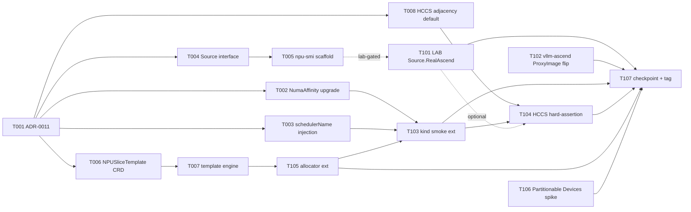

# Phase 7 Plan — NPU 动态切分 + Source.RealAscend abstraction + NumaAffinity upgrade + schedulerName injection + lab-conditional real-hardware track

> **Goal**: Phase 7 closes the M3 milestone with **NPU 动态切分**
> (突破硬模板) as the roadmap headline (arch §1.3) plus four adjacent
> unblock workstreams Phase 6 explicitly carried forward: NumaAffinity
> upstream wrap upgrade (sched-plugins v0.32.x), inference-operator
> `schedulerName=npu-scheduler` auto-injection (closes known-issues
> #11), npu-dra-driver `Source` interface abstraction (preps
> Phase 10 real-hardware integration without committing to lab access),
> and HCCS Adjacency map default for the 910B 8-card topology. The
> NPU 动态切分 path commits to the **multi-template combination
> fallback** per arch §13 Phase 7 risk row — driver-layer breakthrough
> from the 昇腾 team is an opportunistic upside, not a Phase 7
> deliverable. A **lab-conditional W2 sub-track** lights up
> `Source.RealAscend` end-to-end against real silicon if and only if
> lab access materialises during the phase window; if not, the W2
> sub-track ships as a stub + driver-matrix conformance check in CI
> and the real silicon assertions defer to Phase 10 ("真实硬件对接 +
> 演示打磨" per arch §1.3).
>
> **Duration**: ~4-6 weeks calendar (W1 foundation 8 tasks: ADR-0011 +
> Source interface + npu-smi/DCMI binding scaffold + NPUSliceTemplate
> CRD + template engine + NumaAffinity upgrade + schedulerName
> injection + HCCS adjacency default; W2 polish + lab-conditional
> 7 tasks: vllm-ascend ProxyImage default flip + dynamic-slice-aware
> allocator + kind smoke extension + HCCS placement hard-assertion +
> [LAB-GATED] real-hardware integration + Partitionable Devices spike
> + checkpoint). **Phase 7 is the highest-uncertainty phase to date**
> — lab access timing is the dominant risk; driver-layer breakthrough
> for true dynamic slicing is the second-biggest unknown; sched-plugins
> v0.32.x release timing is the third.
>
> **Prereq**: Phase 6 tag `phase-6-complete` (HEAD of dev = `4b5acbe`,
> last commit of the P6 post-tag polish series: T102 backend
> sliceBindings + T103 frontend sliceBindings rendering both landed
> the same day as the tag via the §0a.5 chat+ADR self-RFC pattern).
> ADR-0009 (npu-dra-driver §4 Partitionable Devices forward + §6.4
> migration table) and ADR-0010 (scheduler-plugin §7 Phase 7+ forward
> notes) are the baseline reading. `docs/cann-driver-matrix.md` is
> the entry gate for any lab-conditional task (T101 + T104). Root
> CLAUDE.md §14 (devlog + module DESIGN.md) applies; agent-coordination
> §0a.10-12 (plan/execute split + strict-per-task verify + push
> protocol) applies to every Phase 7 task.

---

## 1. Scope summary

Phase 7 lifts five of the seven items Phase 6 carried forward
(checkpoint-phase6.md §7); two stay deferred:

| Stream                                                       | Phase 6 state                                                                                                                                                              | Phase 7 delivery                                                                                                                                                                                                                                            |
|--------------------------------------------------------------|----------------------------------------------------------------------------------------------------------------------------------------------------------------------------|-------------------------------------------------------------------------------------------------------------------------------------------------------------------------------------------------------------------------------------------------------------|
| NPU 动态切分 (突破硬模板)                                    | Phase 4-6 publishes whole-NPU `Device` entries; allocator picks at NPU granularity per ADR-0009 §6                                                                          | NEW `NPUSliceTemplate` CRD captures user-defined slice composition (e.g. `vir04+vir08+ai-core-shard-N`); template engine validates composition vs ADR-0011 fallback rules; allocator extension picks per-template (preserves whole-NPU path)                |
| NumaAffinity scheduler-plugin                                | T006 placeholder ships (upstream sched-plugins v0.31.8 references `framework.GVK` removed in K8s 1.32); chart toggle `numaAffinity.enabled` defaults false                  | T002 flips placeholder body to `return nrt.New(...)` once sched-plugins v0.32.x is GA; chart toggle defaults true; KubeSchedulerConfiguration profile registers NumaAffinity Filter+Score per ADR-0010 §4                                                    |
| inference-operator scheduler routing                         | Pods use default-scheduler unless operators hand-stamp `spec.schedulerName=npu-scheduler` (known-issues #11)                                                                | deployment_builder auto-stamps `spec.schedulerName=npu-scheduler` on PD-pair Pod templates; opt-out via `ModelService.spec.schedulerOverride` field; CI assertion downgrades from warning to failure                                                         |
| npu-dra-driver Source abstraction                            | Single-implementation hard-coded `mockJSONSource` reads `configs/mock-data/set-a-small/`; real-hardware path conceptual only per ADR-0009 §"Source.RealAscend forward note" | New `Source` interface (List / Watch / QueryTopology); `MockJSONSource` keeps current behavior; `RealAscendSource` stub compiles + registers via factory; lab-conditional T101 lights up the real impl                                                       |
| HCCS Adjacency map for 910B 8-card                           | ADR-0010 §256 ships empty default; Score degrades to "same ring 100 · other 30" binary                                                                                     | T008 ships 910B 8-card ring-of-rings adjacency (`0↔1↔2↔3↔0`) as chart values default per ADR-0010 §256; runtime configurable via Args                                                                                                                        |
| vllm-ascend `disaggregated_prefill_v1` proxy                 | T105 ships schema substrate + sidecar template + busybox fallback; default off                                                                                              | T102 flips `ProxyImage` default to vllm-ascend v0.12+ image IF GA at W2 entry; updates env-var contract docs + CI fixture; fallback flag retained for kind smoke                                                                                             |
| Phase 6 kind smoke HCCS placement assertion                  | T106 ships soft assertion (kind has no real HCCS topology)                                                                                                                  | T104 introduces synthetic ring topology fixture (set-b-multi-ring) + hard assertion that prefill Pods land on the configured ring; lab-conditional T101 adds a real-cluster smoke for the same assertion                                                     |
| Standard-K8s 1.37+ Partitionable Devices (KEP-4815)          | ADR-0009 §4 forward note (Alpha 1.35 / Beta 1.36 / GA est 1.37)                                                                                                              | T106 research spike: confirm KEP-4815 status against upstream SIG-node tracker; ADR-0009 forward note refresh (no code change); decision matrix for Phase 8/10 publisher migration cost                                                                      |
| **[LAB-GATED] Real Ascend hardware integration**             | npu-dra-driver `Source.RealAscend` body absent; `docs/cann-driver-matrix.md` shipped (P4-T-002) but no real silicon verification                                            | T101 lights up Source.RealAscend on real 910B silicon: `npu-smi info -t topo` parsing → HCCS ring extraction → ResourceSlice attribute population → real ModelService deployment → PD-pair Pod placement assertion. **Lab-conditional**; ships as stub if not |

**Out of scope (Phase 8+)**:
- **Busy-idle vertical scaling controller** — Phase 8 (uses Phase 7
  NPUSliceTemplate substrate; vertical resize via "重启切片" pattern
  per arch §1.3 + §13)
- **Karmada multi-site federation + multi-tenant quota controller** —
  Phase 9 (NPUSliceAllocation owner-ref is the Phase 5 substrate;
  Phase 7 does not add tenancy controls or RBAC scoping)
- **O2 DMS adapter (K8s Profile)** — Phase 9 per arch §1.3
- **Live migration of HCCL ranks / per-Pod RDMA bandwidth quota** —
  CNI-level gaps per `docs/cni-hccl-research.md` §5; SR-IOV VF
  partitioning is Phase 9 multi-tenancy entry per ADR-0010 §230
- **Cross-node HCCL gang-scheduling integration (Volcano PodGroup)** —
  Phase 8+ training-job scenario per ADR-0010 §231; Phase 7 推理
  PD-pair workload does not need gang
- **真实硬件对接 + 演示打磨 (full real-hardware demo polish)** —
  Phase 10 per arch §1.3; Phase 7 T101 is a single-modelservice end-
  to-end smoke, not the full multi-pool / multi-tenant lab演示
- **Fabric discovery via LLDP / SONiC API** — defer per ADR-0007 +
  ADR-0010 §229 to Phase 7+ on real switching gear; Phase 7 reads
  only the static node labels deployment tooling populates
- **MindIE Turbo backend toggle in vllm-ascend Pods** — env var
  passthrough already exists since Phase 5; Phase 7 does not default
  enable per phase6-plan §"Out of scope"

---

## 2. Task package overview (15 tasks)

```
W1 Foundation (8 tasks — ADR + Source abstraction + dynamic-slicing CRD + template engine + adjacent polish)
├── P7-T-001  ADR-0011 — NPU 动态切分 design (multi-template fallback + Source interface + lab gating policy)
├── P7-T-002  NumaAffinity upstream wrap upgrade (sched-plugins v0.32.x check + flip placeholder)
├── P7-T-003  inference-operator deployment_builder schedulerName=npu-scheduler injection (resolves known-issues #11)
├── P7-T-004  npu-dra-driver Source interface refactor (MockJSON keeps behavior + RealAscend stub + factory pattern)
├── P7-T-005  npu-smi / DCMI Go binding scaffold (interface + fixture-based unit tests; no real binary call)
├── P7-T-006  NPUSliceTemplate CRD types (composition schema + scheme + round-trip tests)
├── P7-T-007  动态切分 template engine scaffold (composition validation + fallback decomposition into existing fixed templates)
└── P7-T-008  HCCS Adjacency map default for 910B 8-card (chart values + Args binding + adjacency_test.go)

W2 Polish + lab-conditional + checkpoint (7 tasks)
├── P7-T-101  [LAB-GATED] Source.RealAscend impl on real 910B silicon + driver-matrix conformance + end-to-end smoke
├── P7-T-102  vllm-ascend v0.12+ ProxyImage default flip (gated on upstream GA + image-pull access; else doc-only)
├── P7-T-103  kind smoke E2E Phase 7 extension (NumaAffinity active + schedulerName auto-injected + multi-template fallback path)
├── P7-T-104  HCCS placement hard-assertion (synthetic ring topology fixture set-b-multi-ring; kind smoke hard fail on misplacement)
├── P7-T-105  Allocator dynamic-slice extension (NPUSliceTemplate-aware allocate path; whole-NPU path preserved as default)
├── P7-T-106  Standard-K8s 1.37+ Partitionable Devices spike (research + ADR-0009 §4 forward note refresh + Phase 8/10 cost matrix)
└── P7-T-107  Phase 7 docs + checkpoint + tag phase-7-complete
```

Mermaid:



Subagent parallelisation candidates (per §0a.11 strict-verify — ONE
subagent at a time, main agent verifies before next is dispatched;
parallelisation is OPPORTUNISTIC across natural module boundaries
when user gives explicit "batch" cue):
- T001 (docs-only) standalone — no code dependency
- T002 (scheduler-plugin numa pkg) parallel-eligible with T003 (inference-operator deployment_builder)
- T004 (npu-dra-driver Source pkg) parallel-eligible with T006 (NPUSliceTemplate CRD types in npu-dra-driver api/v1alpha1) — same module so coordinate
- T008 (scheduler-plugin hccs args) standalone after T001
- T102 (operators/inference-operator deployment_builder edit) standalone
- T106 (docs-only spike) standalone

Lab-gated track (T101 + T104 lab-real-cluster):
- Triggered ONLY when user signals "lab access available" mid-W2 in chat
- Phase 7 ships without these if lab not available → both move to Phase 10 backlog
- T104 kind-smoke synthetic ring fixture ships REGARDLESS of lab — provides
  hard-assertion baseline in CI even without real silicon

---

## 3. W1 task packages

### P7-T-001 ADR-0011 — NPU 动态切分 design + Source interface + lab gating policy

Owner: docs (no code).

**Allowed Paths**:
- `docs/adr/0011-npu-dynamic-slicing-and-source-interface.md` (new — NPU 动态切分 design + multi-template fallback + Source interface contract + lab gating policy)
- `docs/architecture.md` (small edit — §13 review-table Phase 7 row promoted from "candidate" → "in flight via ADR-0011"; §3.4 NPU runtime row adds NPUSliceTemplate forward ref)
- `docs/adr/0009-npu-dra-driver.md` (small edit — §4 Partitionable Devices forward note cross-references ADR-0011 §"Source interface"; §6.4 migration table cross-references ADR-0011 §"Dynamic slice composition")
- `docs/adr/0010-scheduler-plugin.md` (small edit — §7 Phase 7+ forward note "Real hardware HCCS ring discovery" cross-references ADR-0011 §"Lab gating policy")

Acceptance:
- ADR §1 Context: cites Phase 6 checkpoint §7 forward brief + ADR-0009 §"Source.RealAscend forward note" + arch §13 Phase 7 row + lab access timing as the dominant Phase 7 risk
- §2 Decision A (NPU 动态切分): commit to **multi-template combination fallback** as the Phase 7 deliverable; driver-layer breakthrough from 昇腾 team is opportunistic upside; NPUSliceTemplate CRD captures composition; template engine decomposes composition into the existing fixed-template set + records validation
- §2 Decision B (Source interface): introduce `Source` Go interface in `operators/npu-dra-driver/internal/source/`; implementations: `MockJSONSource` (existing behavior renamed) + `RealAscendSource` (stub in W1, real impl in T101 lab-conditional); factory selects by `--source-type` flag (default `mock-json`)
- §2 Decision C (Lab gating policy): T101 + T104 (real-cluster) ship IFF user signals lab access available during W2 entry meeting; absence → both defer to Phase 10 backlog without blocking Phase 7 tag
- §3 Consequences: allocator path unchanged for whole-NPU claims (Phase 5 contract preserved); NPUSliceTemplate is opt-in via Pod label `npu.huawei.com/slice-template=<name>` (absent → whole-NPU path); Source interface introduces one indirection layer (factory + interface) — micro-benchmark target ≤ 5% reconcile-loop overhead
- §4 NPUSliceTemplate schema: `apiVersion: npu.ocloud.edge.example.com/v1alpha1`, `kind: NPUSliceTemplate`, `spec.composition []TemplatePart{Type: enum[whole/vir04/vir08/vir16/dynamic-shard]; Count: int32; AICoreRequest: int32}`, `spec.fallbackStrategy: enum[fixed-template-combination/refuse]` default `fixed-template-combination`; status conditions: `Validated`, `Allocatable`, `FallbackAppliedReason`
- §5 Source interface contract: `type Source interface { List(ctx) ([]Device, error); Watch(ctx) (<-chan SourceEvent, error); QueryTopology(ctx, nodeName) (*HCCSTopology, error) }`; MockJSONSource preserves Phase 4-6 behavior bit-for-bit (no JSON schema change); RealAscendSource stub returns ErrNotImplemented in W1
- §6 Lab gating policy: Phase 7 entry meeting decides T101/T104 inclusion based on lab access calendar; lab-gated tasks include "[LAB-GATED]" prefix in subagent brief; CI does NOT block on absence; checkpoint §7 records actual outcome ("lab access materialised at W2-D3" vs "lab access deferred → T101+T104 moved to Phase 10")
- §7 Forward notes: per-partition Device emit (KEP-4815 GA est. K8s 1.37) replaces NPUSliceTemplate decomposition with native K8s partition semantics; Phase 8 vertical scaling reads NPUSliceTemplate.status to determine "重启切片" trigger; Phase 10 demo polish uses real silicon T101 results to validate adjacency map (T008 default may need adjustment)

Dependencies: none beyond `phase-6-complete`.

Estimated effort: 0.5d.

---

### P7-T-002 NumaAffinity upstream wrap upgrade (sched-plugins v0.32.x)

Owner: operators/scheduler-plugin (plugin body completion).

**Decision needed at task entry**:
- Confirm `sigs.k8s.io/scheduler-plugins v0.32.x` is GA at task entry time. Check upstream release tracker.
- If YES → flip T006 placeholder to real wrap; chart toggle default `numaAffinity.enabled=true`
- If NO (still v0.31.x latest as of 2026-05-20 baseline) → T002 ships as doc-only update + checkpoint flag for Phase 8 re-attempt; placeholder unchanged

**Allowed Paths** (upgrade path — v0.32.x available):
- `operators/scheduler-plugin/internal/plugins/numa/plugin.go` (small edit — flip placeholder return to `return noderesourcetopology.New(plArgs, h)` per sched-plugins v0.32.x signature)
- `operators/scheduler-plugin/internal/plugins/numa/args.go` (small edit — confirm `NumaAffinityArgs` matches upstream `noderesourcetopology.NodeResourceTopologyMatchArgs` schema)
- `operators/scheduler-plugin/internal/plugins/numa/plugin_test.go` (extend — 3 sanity cases: New produces non-nil plugin; Filter accepts well-formed NodeResourceTopology; default Args weight=2)
- `operators/scheduler-plugin/go.mod` + `go.sum` (regen with `go mod tidy` after v0.32.x bump)
- `operators/scheduler-plugin/cmd/main.go` (small edit if registration signature changed)
- `deploy/helm-charts/scheduler-plugin/values.yaml` (small edit — `numaAffinity.enabled: true` default flip)
- `deploy/helm-charts/scheduler-plugin/templates/configmap.yaml` (small edit — KubeSchedulerConfiguration profile registers NumaAffinity Filter+Score active per ADR-0010 §4)
- `operators/scheduler-plugin/DESIGN.md` (extend — §"NumaAffinityPlugin" body replaces "deferred" note with real impl description + upstream pkg version)
- `docs/known-issues.md` (small edit — close T006 deferral entry if exists)

**Allowed Paths** (doc-only fallback — v0.32.x still not GA):
- `operators/scheduler-plugin/DESIGN.md` (small edit — refresh "deferred to sched-plugins v0.32.x" note with date check)
- `docs/known-issues.md` (small edit — re-affirm T006 deferral; flag Phase 8 re-attempt)
- ADR-0010 (small edit if needed — §3 deferral note refresh)

Acceptance (upgrade path):
- `go build ./...` clean across `operators/scheduler-plugin/`
- `go test ./internal/plugins/numa/...` 3 sanity cases pass
- `helm lint --strict deploy/helm-charts/scheduler-plugin/` 0 fail
- `helm template ...` renders KubeSchedulerConfiguration with `NumaAffinity: enabled: true` in the active plugin list
- `bin/kube-scheduler --help` lists `NumaAffinity` factory registered
- Phase 6 T006 deferral entry in known-issues.md closed

Acceptance (doc-only fallback):
- DESIGN.md + known-issues.md reflect latest v0.32.x check date
- No code change; T002 commit message documents the gating-decision outcome
- Phase 7 plan §5 DoD updated to note T002 status

Dependencies: T001 (ADR-0011 records the decision policy).

Estimated effort: 0.5d (upgrade) / 0.25d (doc-only).

---

### P7-T-003 inference-operator deployment_builder schedulerName=npu-scheduler injection

Owner: operators/inference-operator (deployment_builder + types).

**Allowed Paths**:
- `operators/inference-operator/internal/controller/deployment_builder.go` (small edit — `buildPodSpec` stamps `spec.schedulerName = "npu-scheduler"` unless `ms.Spec.SchedulerOverride != ""`)
- `operators/inference-operator/api/v1alpha1/modelservice_types.go` (small edit — `ModelServiceSpec.SchedulerOverride *string` optional field; godoc + kubebuilder marker `+optional`)
- `operators/inference-operator/internal/controller/deployment_builder_test.go` (extend — 3 new cases: default → npu-scheduler / override set → uses override / empty override pointer → defaults npu-scheduler)
- `operators/inference-operator/config/crd/bases/...modelservices.yaml` (regen via `make manifests`)
- `operators/inference-operator/config/samples/modelservice_sample.yaml` (small edit — sample shows schedulerOverride absent + comment explaining default)
- `operators/inference-operator/DESIGN.md` (extend — §"Scheduler routing" added; cross-reference to ADR-0010 §6.1 schedulerName opt-in pattern)
- `docs/known-issues.md` (small edit — entry #11 status changed from "open" → "resolved via P7-T-003"; cross-reference commit SHA after merge)
- `tests/e2e/kind/phase6/fixtures/modelservice-multiring.yaml` (small edit IF needed — verify fixture doesn't pin schedulerOverride such that T103 multi-ring placement is exercised under npu-scheduler)

Acceptance:
- `go build ./...` + `go test ./...` clean in operators/inference-operator/
- 3 new builder tests pass
- `make manifests` regen produces clean CRD YAML with `schedulerOverride` field present
- `kubectl apply --dry-run=server -f config/samples/modelservice_sample.yaml` passes against a fresh cluster
- known-issues #11 status updated; commit SHA back-referenced
- DESIGN.md §"Scheduler routing" cross-references ADR-0010 §6.1
- Phase 6 T106 kind smoke `assert_scheduler_name` check (currently warning) flips to FAIL on absence in T103 update (deferred to T103, but T003 enables it)

Dependencies: T001 (ADR-0011 records the routing policy).

Estimated effort: 0.5d.

---

### P7-T-004 npu-dra-driver Source interface refactor

Owner: operators/npu-dra-driver (driver runtime refactor).

**Allowed Paths**:
- `operators/npu-dra-driver/internal/source/source.go` (new — `Source` interface definition + `SourceEvent` struct + `ErrNotImplemented` sentinel)
- `operators/npu-dra-driver/internal/source/mockjson/mockjson.go` (new — `MockJSONSource` impl wrapping the existing Phase 4-6 JSON-reading logic; behavior bit-for-bit preserved)
- `operators/npu-dra-driver/internal/source/mockjson/mockjson_test.go` (new — 4 cases: List from set-a-small / Watch emits events / QueryTopology returns rings / empty config returns empty list)
- `operators/npu-dra-driver/internal/source/realascend/realascend.go` (new — `RealAscendSource` stub; all methods return `ErrNotImplemented`; documented as T101 lab-conditional)
- `operators/npu-dra-driver/internal/source/realascend/realascend_test.go` (new — 1 case asserting stub returns ErrNotImplemented for List/Watch/QueryTopology)
- `operators/npu-dra-driver/internal/source/factory.go` (new — `NewSource(sourceType string, cfg Config) (Source, error)` with cases `mock-json` / `real-ascend`)
- `operators/npu-dra-driver/cmd/main.go` (small edit — add `--source-type` flag default `mock-json`; wire factory result into existing publisher loop)
- `operators/npu-dra-driver/internal/publisher/*.go` (small edits — consume `Source` interface instead of hard-coded JSON reader; preserve emit cadence + ResourceSlice writer behavior)
- `operators/npu-dra-driver/DESIGN.md` (extend — §"Source interface architecture" added; mock-json vs real-ascend dispatch diagram; lab-gating note cross-references ADR-0011 §6)
- `deploy/helm-charts/npu-dra-driver/values.yaml` (small edit — `sourceType: "mock-json"` default + comment "Phase 7 + lab access → set 'real-ascend' per ADR-0011")
- `deploy/helm-charts/npu-dra-driver/templates/daemonset.yaml` (small edit — pass `--source-type={{ .Values.sourceType }}` to container args)

Acceptance:
- `go build ./...` + `go test ./...` clean in operators/npu-dra-driver/
- 4 mockjson tests + 1 realascend stub test pass
- Existing publisher integration tests (Phase 4-5 fixtures) pass unchanged → MockJSONSource bit-for-bit behavior preserved
- `helm lint --strict deploy/helm-charts/npu-dra-driver/` 0 fail
- `helm template ...` shows `--source-type=mock-json` on DaemonSet container
- DESIGN.md §"Source interface architecture" complete with factory dispatch + Phase 4-6 → Phase 7 migration diff
- Micro-benchmark target verified: reconcile-loop overhead ≤ 5% vs Phase 6 baseline (timed via `go test -bench` on publisher loop; numbers recorded in DESIGN.md if not already)

Dependencies: T001 (ADR-0011 records the Source interface contract).

Estimated effort: 1.5d.

---

### P7-T-005 npu-smi / DCMI Go binding scaffold

Owner: operators/npu-dra-driver (RealAscendSource subordinate package; no real binary calls).

**Allowed Paths**:
- `operators/npu-dra-driver/internal/source/realascend/npusmi/client.go` (new — `Client` interface: `QueryTopo(ctx) ([]TopoEntry, error)` + `QueryDeviceInfo(ctx, devID int) (*DeviceInfo, error)` + `QueryHealth(ctx, devID int) (HealthState, error)`)
- `operators/npu-dra-driver/internal/source/realascend/npusmi/fake.go` (new — `FakeClient` impl returning canned data from `testdata/npu-smi-topo-fixture.txt`; used by tests + dry-run mode)
- `operators/npu-dra-driver/internal/source/realascend/npusmi/exec.go` (new — `ExecClient` impl shelling out to `npu-smi` binary; **shells out only when `--source-real-ascend-mode=exec`** flag set; T005 ships this disabled by default + T101 lights up)
- `operators/npu-dra-driver/internal/source/realascend/npusmi/parse.go` (new — `npu-smi info -t topo` text parser; outputs `[]TopoEntry{NodeID, DeviceID, Ring, NumaNode, Health}`)
- `operators/npu-dra-driver/internal/source/realascend/npusmi/parse_test.go` (new — 5 cases: empty output / 8-card 910B fixture / 16-card 910B-pro fixture / unhealthy device entries / malformed line skip)
- `operators/npu-dra-driver/internal/source/realascend/npusmi/testdata/npu-smi-topo-fixture-8card.txt` (new — captured sample output for 910B 8-card; sanitized of any hostname/serial info)
- `operators/npu-dra-driver/internal/source/realascend/npusmi/testdata/npu-smi-topo-fixture-16card.txt` (new — captured 16-card sample if available, else synthetic per ADR-0011)
- `operators/npu-dra-driver/DESIGN.md` (extend — §"npu-smi parser contract" added; lab-conditional T101 cross-reference)

Acceptance:
- `go build ./...` + `go test ./internal/source/realascend/npusmi/...` 5 parser cases pass
- FakeClient passes interface check (compile-time assertion)
- ExecClient compiles but is NOT exercised in CI (would require real binary)
- Parser handles 8-card and 16-card fixtures equivalently
- DESIGN.md §"npu-smi parser contract" documents the text format expected + Phase 7 lab smoke (T101) wires ExecClient if `--source-real-ascend-mode=exec`
- Zero dependency on actual npu-smi binary in CI / unit tests

Dependencies: T004 (Source interface + RealAscendSource stub exist).

Estimated effort: 1d.

---

### P7-T-006 NPUSliceTemplate CRD types + scheme + round-trip tests

Owner: operators/npu-dra-driver (api/v1alpha1 CRD types extension).

**Allowed Paths**:
- `operators/npu-dra-driver/api/v1alpha1/npuslicetemplate_types.go` (new — `NPUSliceTemplate` Kind: cluster-scoped CRD; Spec.Composition []TemplatePart{Type enum, Count int32, AICoreRequest int32}; Spec.FallbackStrategy enum; Status conditions: Validated / Allocatable / FallbackAppliedReason)
- `operators/npu-dra-driver/api/v1alpha1/npuslicetemplate_types_test.go` (new — 4 round-trip cases: JSON marshal/unmarshal / DeepCopy / empty Status / fallback strategy enum validation)
- `operators/npu-dra-driver/api/v1alpha1/zz_generated.deepcopy.go` (regen via `make generate`)
- `operators/npu-dra-driver/config/crd/bases/npu.ocloud.edge.example.com_npuslicetemplates.yaml` (regen via `make manifests`)
- `operators/npu-dra-driver/config/samples/npuslicetemplate_qwen_pd.yaml` (new — sample: Qwen 8B PD-pair composition; 1× vir04 (prefill) + 1× vir08 (decode) on same NPU)
- `operators/npu-dra-driver/config/samples/npuslicetemplate_deepseek_20b.yaml` (new — sample: DeepSeek 20B; 1× whole NPU per replica; fallbackStrategy=refuse to demonstrate strict mode)
- `operators/npu-dra-driver/DESIGN.md` (extend — §"NPUSliceTemplate CRD" added; composition semantics + fallback strategy + cross-reference to ADR-0011 §4)
- `deploy/helm-charts/npu-dra-driver/templates/crds/` (regen — bundle the new CRD per Phase 5 chart-bundles-CRD pattern)

Acceptance:
- `go build ./...` + `go test ./api/v1alpha1/...` 4 round-trip cases pass
- `make generate` regen produces clean DeepCopy code
- `make manifests` regen produces clean CRD YAML; OpenAPI v3 schema includes all spec fields + status conditions
- `kubectl apply --dry-run=server -f config/samples/npuslicetemplate_qwen_pd.yaml` passes against fresh cluster
- `helm lint --strict deploy/helm-charts/npu-dra-driver/` 0 fail; CRD bundled per Phase 5 convention
- DESIGN.md §"NPUSliceTemplate CRD" documents composition validation rules + status condition lifecycle

Dependencies: T001 (ADR-0011 records the CRD schema).

Estimated effort: 1d.

---

### P7-T-007 动态切分 template engine scaffold

Owner: operators/npu-dra-driver (template composition + decomposition logic).

**Allowed Paths**:
- `operators/npu-dra-driver/internal/template/engine.go` (new — `Engine` struct: `Validate(spec NPUSliceTemplateSpec) error` + `Decompose(spec NPUSliceTemplateSpec) (FixedTemplateBundle, error)`; FallbackStrategy=fixed-template-combination → maps composition to existing vir04/vir08/whole template requests)
- `operators/npu-dra-driver/internal/template/engine_test.go` (new — 6 cases: empty composition / whole-NPU-only / single vir04 / vir04+vir08 mixed / fallbackStrategy=refuse rejects non-existing composition / fallbackStrategy=fixed-template-combination decomposes)
- `operators/npu-dra-driver/internal/template/types.go` (new — `FixedTemplateBundle{Items []TemplateItem{Template string; Count int}}` — output of Decompose, input to allocator T105)
- `operators/npu-dra-driver/internal/controller/npuslicetemplate_controller.go` (new — reconciler watches NPUSliceTemplate; runs Engine.Validate + Engine.Decompose; writes status.conditions[Validated], status.conditions[Allocatable], status.fallbackAppliedReason)
- `operators/npu-dra-driver/internal/controller/npuslicetemplate_controller_test.go` (new — 3 envtest cases: empty composition / valid composition / refuse strategy with incompatible composition)
- `operators/npu-dra-driver/cmd/main.go` (small edit — register NPUSliceTemplate controller in the manager)
- `operators/npu-dra-driver/internal/controller/suite_test.go` (small edit — register NPUSliceTemplate scheme in envtest setup)
- `operators/npu-dra-driver/DESIGN.md` (extend — §"Template engine + composition decomposition" added; flow diagram from NPUSliceTemplate → FixedTemplateBundle → Allocator)

Acceptance:
- `go build ./...` + `go test ./internal/template/...` 6 engine cases pass
- `go test ./internal/controller/... -run NPUSliceTemplate` 3 envtest cases pass (or compile-clean stub if envtest binaries unavailable per P3 local-env honesty)
- DESIGN.md §"Template engine + composition decomposition" complete with state-machine + flow diagram
- Decomposition behavior verified for the Phase 7 sample compositions (Qwen 8B PD + DeepSeek 20B) — both decompose into valid existing fixed-template combinations
- `make manifests` clean

Dependencies: T006 (NPUSliceTemplate types).

Estimated effort: 1.5d.

---

### P7-T-008 HCCS Adjacency map default for 910B 8-card

Owner: operators/scheduler-plugin (hccs args binding + chart values).

**Allowed Paths**:
- `operators/scheduler-plugin/internal/plugins/hccs/adjacency.go` (new — `DefaultAdjacency910B8Card()` returns the ring-of-rings map `{0: {1, 3}, 1: {0, 2}, 2: {1, 3}, 3: {2, 0}}` per ADR-0010 §256 expected topology; `BuildAdjacency(spec map[string][]string) (map[int32][]int32, error)` parses args)
- `operators/scheduler-plugin/internal/plugins/hccs/adjacency_test.go` (new — 4 cases: default map ring-closure / custom map parse / empty map → no adjacency / malformed → error)
- `operators/scheduler-plugin/internal/plugins/hccs/args.go` (small edit — extend `HCCSTopologyArgs.Adjacency map[string][]string` with default builder applied when empty; preserve user-override behavior)
- `operators/scheduler-plugin/internal/plugins/hccs/score.go` (small edit IF needed — confirm Score reads via `args.Adjacency` post-default-fill)
- `operators/scheduler-plugin/internal/plugins/hccs/score_test.go` (extend — 2 new cases: default-adjacency same-ring score 100 + adjacent-ring score 70 / explicit empty Adjacency falls back to binary 100/30)
- `deploy/helm-charts/scheduler-plugin/values.yaml` (small edit — `hccsTopology.adjacency` default key listing ring-of-rings 910B 8-card mapping + comment "Phase 7 default per ADR-0010 §256; tune per real hardware topology")
- `deploy/helm-charts/scheduler-plugin/templates/configmap.yaml` (small edit — KubeSchedulerConfiguration plugin args includes `adjacency` field when set in values)
- `operators/scheduler-plugin/DESIGN.md` (extend — §"HCCS Adjacency map" added; default 910B 8-card topology + customization guidance)
- `docs/adr/0010-scheduler-plugin.md` (small edit — §256 risk row "HCCS Adjacency map empty default" status updated → "Phase 7 T008 default for 910B 8-card; per-hardware customization via Args")

Acceptance:
- `go build ./...` + `go test ./internal/plugins/hccs/...` cases pass (existing 26 + 4 adjacency + 2 score-with-adjacency = 32 total)
- `helm lint --strict deploy/helm-charts/scheduler-plugin/` 0 fail
- `helm template --set hccsTopology.adjacency=null ...` renders KubeSchedulerConfiguration with empty adjacency → score falls back to binary
- `helm template ...` (default) renders adjacency-with-ring-of-rings + score uses 100/70/30/0 grading per ADR-0010 §5
- ADR-0010 §256 risk row status updated
- DESIGN.md §"HCCS Adjacency map" cross-references ADR-0010 §256 closure

Dependencies: T001 (ADR-0011 references), can run parallel with T002-T007.

Estimated effort: 0.5d.

---

## 4. W2 task packages

### P7-T-101 [LAB-GATED] Source.RealAscend impl on real 910B silicon + driver-matrix conformance + end-to-end smoke

Owner: operators/npu-dra-driver (RealAscendSource body) + deploy (lab smoke harness).

**Lab gating decision required at W2 entry**:
- User signals lab access available within Phase 7 window → T101 proceeds
- User signals lab access deferred → T101 status changed to "deferred to Phase 10"; checkpoint records the decision; stub ships from W1 (T004 + T005)

**Allowed Paths** (when lab access available):
- `operators/npu-dra-driver/internal/source/realascend/realascend.go` (extend — flip stub → real impl using npusmi.Client; List queries device inventory; Watch polls health changes via DCMI; QueryTopology runs `npu-smi info -t topo` via ExecClient)
- `operators/npu-dra-driver/internal/source/realascend/realascend_test.go` (extend — replace stub assertion with FakeClient-driven unit tests; 5 cases mirror MockJSONSource coverage)
- `operators/npu-dra-driver/internal/source/realascend/npusmi/exec.go` (small edit — production-ready exec wrapper; context-aware timeout + non-zero exit handling)
- `operators/npu-dra-driver/Dockerfile` (small edit — include `npu-smi` binary path expectation in DESIGN.md note; container still distroless but mounts host `/usr/local/Ascend/driver/tools/npu-smi`)
- `deploy/helm-charts/npu-dra-driver/templates/daemonset.yaml` (small edit — hostPath mount for npu-smi binary path + privileged: true on the DRA driver container per Ascend documentation; **flagged on `values.sourceType=real-ascend`** ONLY)
- `tests/lab/phase7/install.sh` (new — bash script: kind cluster NOT used; assumes user provides kubeconfig pointing at real lab cluster; deploys CRDs + scheduler-plugin + npu-dra-driver with `sourceType=real-ascend`)
- `tests/lab/phase7/assert.sh` (new — bash script: asserts ResourceSlice published with real `npu.huawei.com/hccs_ring` values + at least 1 ring observed; deploys 1 ModelService → PD-pair Pod placement assertion against real silicon)
- `tests/lab/phase7/README.md` (new — lab smoke runbook + driver-matrix conformance checklist per `docs/cann-driver-matrix.md`)
- `docs/cann-driver-matrix.md` (small edit — annotate "Phase 7 T101 verified on driver X / CANN Y" against the matrix entry actually exercised in lab)

Acceptance (lab path):
- Lab cluster running with CANN 8.1 + Ascend driver ≥ 24.x per matrix gate
- `helm install` of npu-dra-driver with `sourceType=real-ascend` lands DaemonSet running with hostPath mount
- ResourceSlice list shows real `npu.huawei.com/hccs_ring` + `npu.huawei.com/numa_node` attributes (NOT mock JSON fixture values)
- One ModelService creates → PD-pair Pods schedule via scheduler-plugin → Pods reach Ready state on real silicon
- `tests/lab/phase7/assert.sh` exits 0
- `docs/cann-driver-matrix.md` annotated with verified row
- DESIGN.md §"Source.RealAscend impl" completes the W1 stub note

Acceptance (deferred path — lab access not available):
- T101 status = "deferred to Phase 10"
- Checkpoint §"DoD reconciliation" records the deferral with the lab-access-timing context
- T004 + T005 stub artifacts unchanged; npu-dra-driver chart `sourceType=real-ascend` value still emits warning-not-error if selected (so a future Phase 10 session can light it up)

Dependencies: T004 + T005 (interface + npu-smi scaffold).

Estimated effort: 2d (lab) / 0d (deferred).

---

### P7-T-102 vllm-ascend v0.12+ ProxyImage default flip

Owner: operators/inference-operator (deployment_builder + values default).

**Gating decision needed at W2 entry**:
- Check upstream `vllm-project/vllm-ascend` release tracker
- v0.12+ GA + image pull access from CI environment (or fallback image cached) → T102 proceeds full
- v0.12+ NOT GA → T102 ships as env-var contract doc-only update; default stays empty (Phase 6 T105 behavior)
- v0.12+ GA but image too large for CI → T102 ships default flip + CI fixture pins fallbackImage explicitly

**Allowed Paths** (full flip):
- `operators/inference-operator/api/v1alpha1/modelservice_types.go` (small edit — `PDPairSpec.ProxyImage` godoc updated with v0.12+ default value comment; +kubebuilder marker default annotation IF allowed by controller-runtime version)
- `deploy/helm-charts/inference-operator/values.yaml` (small edit — `defaults.proxyImage: "quay.io/vllm-project/vllm-ascend:v0.12.X"` with X = actual release)
- `operators/inference-operator/internal/controller/deployment_builder.go` (small edit — `buildPDPairContainers` picks `effectiveProxyImage = ms.Spec.PDPair.ProxyImage || chart.Defaults.ProxyImage`)
- `operators/inference-operator/internal/controller/deployment_builder_test.go` (extend — 2 new cases: chart default applied / explicit spec override wins)
- `operators/inference-operator/DESIGN.md` (extend — §"PD proxy_server sidecar pattern" body updated with v0.12+ env-var contract; cross-reference ADR-0010 §"vllm-ascend gating")
- `tests/e2e/kind/phase6/fixtures/modelservice-multiring.yaml` (small edit — fallbackImage=busybox explicit to bypass image pull cost; preserves Phase 6 T106 behavior)
- `docs/adr/0010-scheduler-plugin.md` (small edit IF needed — §"vllm-ascend gating" updated v0.12 status)
- `README.md` (small edit — current-phase narrative carries ProxyImage default fact)

**Allowed Paths** (doc-only fallback):
- `operators/inference-operator/DESIGN.md` (small edit — refresh "vllm-ascend v0.12 still not GA" with date check)
- `docs/adr/0010-scheduler-plugin.md` (small edit IF needed — §"vllm-ascend gating" deferral refresh)
- T102 commit message documents the gating-decision outcome

Acceptance (full flip):
- `go build ./...` + `go test ./...` clean in operators/inference-operator/
- 2 new builder tests pass
- `helm lint --strict deploy/helm-charts/inference-operator/` 0 fail
- `helm template ...` shows `defaults.proxyImage=quay.io/...v0.12.X` in the rendered config
- kind smoke (Phase 6 T106 sub-job + Phase 7 T103) continues to pass (fallbackImage=busybox bypasses real pull)
- DESIGN.md updated

Acceptance (doc-only fallback):
- DESIGN.md + ADR refresh dates current
- No code change; T102 commit documents the deferral
- Phase 7 DoD §5 reflects T102 status

Dependencies: none beyond `phase-6-complete`.

Estimated effort: 0.5d (full) / 0.25d (doc-only).

---

### P7-T-103 kind smoke E2E Phase 7 extension

Owner: deploy / .github/workflows (CI extension).

**Allowed Paths**:
- `.github/workflows/e2e-kind.yml` (extend — Phase 7 sub-job augments Phase 6 sub-job: scheduler-plugin chart with `numaAffinity.enabled=true` post-T002; inference-operator deployment_builder asserts auto-stamped schedulerName; NPUSliceTemplate apply → status.conditions[Allocatable]=True path; multi-template fallback assertion)
- `tests/e2e/kind/phase7/install.sh` (new — bash script: builds on Phase 6 install with NumaAffinity + NPUSliceTemplate apply + multi-template fallback fixture)
- `tests/e2e/kind/phase7/assert.sh` (new — bash script:
  - `kubectl get pod` shows `.spec.schedulerName=npu-scheduler` on every PD-pair Pod (hard fail if absent)
  - `kubectl get npuslicetemplate qwen-8b-pd-pair -o jsonpath` shows Validated=True + Allocatable=True
  - scheduler-plugin Deployment exposes Numa+HCCS+Binpack profile (helm template grep)
  - `kubectl get pod -l app=prefill -o jsonpath={.items[*].spec.nodeName}` joined against synthetic ring map shows same-ring placement)
- `tests/e2e/kind/phase7/fixtures/npuslicetemplate-qwen-pd.yaml` (new — sample composition per ADR-0011)
- `tests/e2e/kind/phase7/fixtures/modelservice-with-template.yaml` (new — ModelService referencing the template)
- `tests/e2e/kind/phase7/fixtures/multi-ring-nodes.yaml` (new — kind nodes labelled with synthetic HCCS ring IDs; bridges the kind-no-real-HCCS gap)

Acceptance:
- e2e-kind workflow green; Phase 7 sub-job adds 3 new assertions over Phase 6:
  - schedulerName auto-injection (resolves known-issues #11) — hard fail on absence
  - NumaAffinity active in profile (post-T002) — assert via `kubectl get configmap -o jsonpath` grep
  - NPUSliceTemplate.status.Allocatable=True after engine reconcile — wait + assert
- Multi-ring placement hard-asserted via synthetic ring map (preparation for T104)
- Phase 6 T106 sub-job remains green (additive only)

Dependencies: T002 (NumaAffinity if upgrade path) + T003 (schedulerName) + T005 + T007 (template engine reconciler) + T008 (adjacency default).

Estimated effort: 1d.

---

### P7-T-104 HCCS placement hard-assertion via synthetic ring topology fixture

Owner: deploy (CI fixture + assertion logic).

**Allowed Paths**:
- `configs/mock-data/set-b-multi-ring/` (new fixture set — 2 nodes × 8 NPUs split across 2 HCCS rings each, designed to exercise the scoring tier 100/70/30/0)
- `configs/mock-data/set-b-multi-ring/schema.json` (cross-reference set-a-small + new node-ring map)
- `configs/mock-data/set-b-multi-ring/nodes.json` + `npupools.json` + `slices.json` (per existing mock-data schema convention)
- `tests/e2e/kind/phase7/fixtures/multi-ring-nodes.yaml` (small edit IF T103 already created — wire to set-b-multi-ring publisher)
- `tests/e2e/kind/phase7/assert.sh` (extend — placement hard-assertion downgrades the Phase 6 T106 "soft" check to hard fail on misplacement; reads ring map from `set-b-multi-ring/topology.json`)
- `operators/npu-dra-driver/internal/source/mockjson/mockjson_test.go` (extend — 1 new case: set-b-multi-ring load + topology query returns rings 0..3 per fixture)
- `docs/known-issues.md` (small edit — entry referencing "kind smoke placement assertion soft" closed; cross-reference T104 commit SHA)

Acceptance:
- New mock data set lints clean per `configs/mock-data/schema.json` rules
- Phase 7 T103 sub-job consumes set-b-multi-ring fixture; placement assertion fires
- 1 new mockjson unit test passes
- Known-issues entry status updated to "resolved via T104"
- Placement assertion in kind smoke: prefill Pods placed on ring-0 nodes (per ADR-0010 §5 score tier 100) — workflow fails if any prefill Pod lands on ring-2/3 nodes

Dependencies: T103 (kind smoke harness extended).

Estimated effort: 0.5d.

---

### P7-T-105 Allocator dynamic-slice extension

Owner: operators/npu-dra-driver (allocator path).

**Allowed Paths**:
- `operators/npu-dra-driver/internal/allocator/allocator.go` (small edit — `Allocate(claim, bundle FixedTemplateBundle)` path added; whole-NPU path preserved when bundle is nil)
- `operators/npu-dra-driver/internal/allocator/allocator_test.go` (extend — 4 new cases: bundle nil → whole-NPU path / bundle with single vir04 → fits in NPU with available cores / bundle vir04+vir08 → both fit / bundle requests > available → returns Unallocatable error)
- `operators/npu-dra-driver/internal/controller/resourceclaim_controller.go` (small edit — when Pod carries `npu.huawei.com/slice-template=<name>` label, look up NPUSliceTemplate → Decompose → pass bundle to Allocator; absent → existing whole-NPU path)
- `operators/npu-dra-driver/internal/controller/resourceclaim_controller_test.go` (extend — 3 envtest cases: template-labelled claim / unlabelled claim / template-not-found)
- `operators/npu-dra-driver/DESIGN.md` (extend — §"Allocator: NPUSliceTemplate-aware path" added; flow diagram from ResourceClaim → Pod label → Template → Bundle → Allocator)

Acceptance:
- `go build ./...` + `go test ./internal/allocator/...` 4 new + existing cases pass
- envtest cases compile clean; run when envtest available (P3 local-env honesty)
- DESIGN.md updated with the slice-template label contract
- Whole-NPU path verified unchanged: existing Phase 5 allocator tests pass unchanged

Dependencies: T006 (CRD types) + T007 (engine + Decompose).

Estimated effort: 1d.

---

### P7-T-106 Standard-K8s 1.37+ Partitionable Devices spike

Owner: docs (research only; no code).

**Allowed Paths**:
- `docs/research/k8s-partitionable-devices-spike.md` (new — research summary: KEP-4815 status check against upstream SIG-node tracker as of Phase 7 W2 entry; current K8s minor version landscape; Alpha/Beta/GA timeline; npu-dra-driver migration cost estimate)
- `docs/adr/0009-npu-dra-driver.md` (small edit — §4 forward note refreshed with the spike date + KEP-4815 status as of W2; §6.4 migration table preserves Phase 7 → Phase 8/10 cost matrix; explicit forward marker for the migration task)
- `docs/architecture.md` (small edit — §13 review-table Phase 8 row updated with "Partitionable Devices migration spike landed via P7-T-106; impl when KEP-4815 GA")

Acceptance:
- Spike doc enumerates: (a) latest KEP-4815 status [Alpha/Beta/GA] (b) upstream merged PRs since Phase 4 baseline (c) breaking-change risk for npu-dra-driver publisher (d) estimated effort for Phase 8/10 migration (e) Phase 7 NPUSliceTemplate path vs Partitionable Devices path coexistence
- ADR-0009 + architecture §13 cross-references updated
- NO code change; spike is doc-only research

Dependencies: none beyond W1; can run any time in W2.

Estimated effort: 0.5d.

---

### P7-T-107 Phase 7 docs + checkpoint + tag phase-7-complete

Owner: docs (sealing the phase).

**Allowed Paths**:
- `docs/checkpoint-phase7.md` (new — mirrors checkpoint-phase6.md structure: status table per task + tests inventory + lab-gating outcome + known issues + Phase 8 seed brief)
- `docs/architecture.md` (small edit — §13 review-table Phase 7 row promoted from "in flight via ADR-0011" → "Phase 7 landed at SHA"; Phase 8 row preserved as candidate; §1.3 phase-roadmap table no edits)
- `docs/known-issues.md` (small edit — any Phase 7 net-new issues numbered + closed-or-deferred)
- `docs/phase7-plan.md` (this file — small edit at end: "Phase 7 actual lands as `phase-7-complete` at commit <SHA>; T107 ran <date>")
- `README.md` (small edit — current-phase pointer to phase-7-complete; Phase 6 → Phase 7 narrative; lab-gating outcome surfaced)
- git tag `phase-7-complete` at the merge commit of T107

Acceptance:
- All W1+W2 tasks have a row in checkpoint-phase7.md showing commit SHA + tests pass status + lab-gated outcome where applicable
- Phase 8 seed: at least 3 candidate workstreams enumerated:
  - Busy-idle vertical scaling controller (reads NPUSliceTemplate substrate)
  - Partitionable Devices migration (when KEP-4815 GA — per T106 spike)
  - Volcano gang-scheduling integration for cross-node HCCL training jobs (per ADR-0010 §231)
- README.md current-phase line points at phase-7-complete; lab-gating outcome (T101 landed vs deferred to Phase 10) explicit
- Tag `phase-7-complete` lands on the merge commit; `git tag -l 'phase-*'` shows it alongside the existing 6 tags

Dependencies: all prior Phase 7 tasks.

Estimated effort: 0.5d.

---

## 5. Phase 7 DoD

Phase 7 is considered complete (`phase-7-complete` tag lands) when
every checkbox below passes. Verification is a mix of `go test` /
`helm lint` / `kubectl --dry-run` / kind smoke E2E + lab smoke
(conditional on T101 inclusion).

### W1 Foundation
- [ ] `docs/adr/0011-npu-dynamic-slicing-and-source-interface.md`
      landed with NPU 动态切分 fallback strategy + Source interface
      contract + lab gating policy
- [ ] NumaAffinity scheduler-plugin upgrade (T002): full upgrade if
      sched-plugins v0.32.x available — placeholder body flipped to
      `noderesourcetopology.New(...)` + chart toggle default true +
      3 sanity tests pass; OR doc-only deferral if not GA with
      checkpoint note
- [ ] inference-operator deployment_builder auto-stamps
      `spec.schedulerName=npu-scheduler` on PD-pair Pods; opt-out via
      `ModelService.spec.schedulerOverride`; 3 new builder tests pass;
      known-issues #11 closed
- [ ] npu-dra-driver Source interface refactor: `MockJSONSource`
      preserves Phase 4-6 behavior bit-for-bit; `RealAscendSource`
      stub compiles + registers via factory; chart toggle
      `sourceType=mock-json` default; reconcile overhead ≤ 5% vs Phase 6
- [ ] npu-smi / DCMI Go binding scaffold: parser handles 8-card +
      16-card fixtures; FakeClient + ExecClient interfaces; 5 parser
      tests pass; zero real-binary CI dependency
- [ ] NPUSliceTemplate CRD landed: types + scheme + 4 round-trip tests
      pass; `make manifests` clean; samples for Qwen 8B PD + DeepSeek
      20B; chart bundles CRD
- [ ] Template engine + composition decomposition: `Engine.Validate` +
      `Engine.Decompose` cover the Phase 7 sample compositions; 6
      engine tests + 3 envtest reconciler cases pass
- [ ] HCCS Adjacency map default for 910B 8-card: chart values default
      + Args binding + adjacency_test.go (4 cases + 2 score
      integration); ADR-0010 §256 risk row status updated

### W2 Polish + lab-conditional
- [ ] vllm-ascend ProxyImage default flip (T102): full flip if v0.12+
      GA + image-pull access; OR doc-only deferral with rationale
- [ ] kind smoke E2E Phase 7 sub-job (T103): schedulerName
      auto-injection assertion hard / NumaAffinity active in profile
      / NPUSliceTemplate Allocatable=True / multi-template fallback
      path exercised
- [ ] HCCS placement hard-assertion (T104): set-b-multi-ring fixture
      drives mock-data publisher; kind smoke fails on misplacement;
      known-issues "soft assertion" entry closed
- [ ] Allocator dynamic-slice extension (T105): NPUSliceTemplate-aware
      Allocate path landed; whole-NPU path preserved; 4 allocator
      tests + 3 envtest cases pass
- [ ] [LAB-GATED] Source.RealAscend impl (T101): if lab access materialised
      → real-cluster smoke green + driver-matrix conformance noted;
      if deferred → status reflects "deferred to Phase 10" with rationale
- [ ] Partitionable Devices spike (T106) landed: KEP-4815 status
      checked + Phase 8/10 migration cost matrix documented
- [ ] `phase-7-complete` tag lands on the merge commit of T107
- [ ] `docs/checkpoint-phase7.md` documents every commit SHA + tests
      pass status + lab-gating outcome + known issues + Phase 8 seed

### Out of scope (carried forward to Phase 8+)
- [ ] Busy-idle vertical scaling controller — Phase 8 (uses
      NPUSliceTemplate substrate)
- [ ] Partitionable Devices (KEP-4815) actual migration — Phase 8 or
      Phase 10 when GA per T106 spike outcome
- [ ] Volcano gang-scheduling integration — Phase 8+ training-job
      scenario per ADR-0010 §231
- [ ] Karmada multi-site federation + multi-tenant quota controller —
      Phase 9
- [ ] O2 DMS adapter — Phase 9
- [ ] Live migration of HCCL ranks / per-Pod RDMA bandwidth quota —
      CNI-level gaps per `docs/cni-hccl-research.md` §5
- [ ] 真实硬件对接 + 演示打磨 (full real-hardware demo polish) —
      Phase 10 per arch §1.3 (T101 is a single-modelservice smoke,
      not the full demo polish)
- [ ] Fabric discovery via LLDP / SONiC API — defer per ADR-0007 +
      ADR-0010 §229 to Phase 7+ on real switching gear

---

## 6. Phase 6 → Phase 7 handoff brief

### What Phase 6 leaves to Phase 7

1. **NumaAffinity scheduler-plugin placeholder** — T006 ships a
   placeholder body because upstream sched-plugins v0.31.8 references
   `framework.GVK` which K8s 1.32 removed. Phase 7 T002 flips the
   placeholder to a real wrap once v0.32.x is GA; chart toggle
   defaults shift accordingly.
2. **known-issues #11 (schedulerName opt-in)** — Phase 6 T101 chart
   ships scheduler-plugin as a SECOND scheduler; Pods must hand-stamp
   `spec.schedulerName=npu-scheduler`. Phase 7 T003 auto-stamps from
   inference-operator deployment_builder.
3. **HCCS placement assertion in kind smoke is soft** — Phase 6 T106
   downgrades the assertion because kind has no real HCCS topology.
   Phase 7 T103 + T104 introduce a synthetic ring topology fixture
   (set-b-multi-ring) that lets the assertion go hard in CI without
   real silicon.
4. **vllm-ascend `disaggregated_prefill_v1` schema substrate** —
   Phase 6 T105 ships the schema + sidecar template + busybox
   fallback; default off. Phase 7 T102 flips the default when v0.12+
   is GA.
5. **HCCS Adjacency map empty default** — ADR-0010 §256 risk row
   notes Phase 6 ships empty map; Phase 7 T008 ships the 910B 8-card
   ring-of-rings default + per-hardware customization via Args.
6. **Source.RealAscend forward note in ADR-0009** — Phase 6 npu-dra-
   driver path is mock-JSON only. Phase 7 T004 introduces the Source
   interface abstraction; T005 ships the npu-smi parser scaffold;
   T101 (lab-conditional) lights up real silicon end-to-end.
7. **NPU 动态切分 design slot** — arch §13 Phase 7 row flags the
   driver-layer cooperation risk + multi-template combination
   fallback. Phase 7 T001 ADR-0011 commits to the fallback as the
   default deliverable; T006 + T007 + T105 implement it.

### Phase 7 entry meeting agenda

Before P7-T-001 starts, the meeting confirms:

1. **Lab access calendar**: when does the 910B silicon lab become
   available within Phase 7 calendar window? This decides T101 +
   T104-real-cluster inclusion. Default = deferred to Phase 10 if
   no concrete date.
2. **sched-plugins v0.32.x GA status**: check upstream tracker; T002
   path branches on this. Doc-only fallback acceptable.
3. **vllm-ascend v0.12+ GA status**: check `vllm-project/vllm-ascend`
   release page; T102 path branches.
4. **NPUSliceTemplate fallback strategy default**:
   `fixed-template-combination` per ADR-0011 §4 (recommended) vs
   `refuse` (strict mode). Phase 7 ships former as default; latter
   available as opt-in via Spec field.
5. **HCCS Adjacency 910B 8-card topology confirmation**: ADR-0010
   §256 notes the expected ring-of-rings shape `0↔1↔2↔3↔0`. If
   T101 lab access available, T008 default validated against real
   topology; if not, ships per ADR-0011 expected shape + Phase 10
   re-verification.
6. **Subagent dispatch model**: §0a.11 strict-verify continues —
   one subagent at a time, main agent verifies, no batching unless
   user explicitly says so. §0a.10 plan/execute session split is
   honored: this plan-only session commits + stops; execute session
   reads fresh.

### Phase 7 risks (top 3)

1. **Lab access timing**: dominates Phase 7 calendar uncertainty.
   Mitigation: W1 is 100% lab-independent; W2 splits into
   lab-conditional (T101 + T104-real-cluster) and lab-independent
   (T102 + T103 + T104-synthetic + T105 + T106) tracks. Phase 7
   tag lands regardless of lab outcome — checkpoint records the
   actual outcome.
2. **NPU 动态切分 driver-layer cooperation absence**: arch §13
   risk table flags the fallback "多模板组合" as the conservative
   commitment. Mitigation: ADR-0011 commits to the fallback as the
   Phase 7 deliverable; driver-layer breakthrough from the 昇腾
   team during the phase window is opportunistic upside, not a
   blocker; T006 + T007 + T105 implement the fallback path.
3. **sched-plugins v0.32.x release timing**: T002 NumaAffinity
   upgrade gates on this. Mitigation: T002 has explicit doc-only
   fallback that ships the deferral cleanly; Phase 8 re-attempts
   the upgrade when v0.32.x is available. NumaAffinity stays
   placeholder in chart configuration.

### Coordination handoff

- **Subagent dispatch model (v2 strict-verify, 2026-05-19)**: one
  subagent at a time; main agent runs `go vet` / `go test` /
  `helm lint --strict` / `kubectl --dry-run=server` / live binary
  smoke before next subagent starts. Verification per task, not
  batched. §0a.11 governs.
- **devlog convention**: every T001..T107 commit's footer line
  `Devlog: docs/devlog/phase-7-tNNN.md` (per root CLAUDE.md §14).
- **Module DESIGN.md convention**: T004 extends
  `operators/npu-dra-driver/DESIGN.md` with §"Source interface
  architecture"; T007 extends with §"Template engine"; T002 +
  T008 extend `operators/scheduler-plugin/DESIGN.md`; T003 + T102
  extend `operators/inference-operator/DESIGN.md`. No new module
  DESIGN.md needs to land in Phase 7 (Source/Template/Allocator are
  all within npu-dra-driver; HCCS adjacency is within scheduler-
  plugin).
- **§0a.5 chat+ADR self-RFC**: Phase 7 introduces no `docs/api-
  contract.yaml` changes (the new NPUSliceTemplate CRD is in
  npu-dra-driver; not surfaced through `/api/v1/*` until Phase 8
  or later). If a frontend Workloads page extension surfaces during
  Phase 7 W2 (e.g. "show NPUSliceTemplate associated with workload"),
  it follows the same Phase 6 T102/T103 chat+ADR self-RFC pattern.
- **Lab-conditional tasks (T101 + T104-real-cluster)**: subagent
  brief MUST include "[LAB-GATED]" prefix; if user signals lab
  unavailable, main agent records the deferral immediately and
  proceeds with T102+T103+T104-synthetic+T105+T106 in the standard
  order. No worktree is created for deferred tasks; checkpoint
  records the deferral as "T101 deferred to Phase 10 (lab access
  not available in Phase 7 window)".

---

## Phase 7 actual landing

Phase 7 lands as `phase-7-complete` at the T107 commit (this commit
chain head); T107 ran 2026-05-20 (same day as Phase 7 plan committed +
T001 started · single execute session pattern per §0a.10).

**Lab-gating outcome**: T101 deferred to Phase 10 per ADR-0011 §3
default policy (no lab access signal received during W2 entry; default
= defer + run other W2 tasks).

**W2 gating outcomes**:
- T002 NumaAffinity upgrade: **doc-only deferral** (sched-plugins
  v0.32.7 IS GA but K8s 1.32 baseline pin can't absorb transitive
  apimachinery v0.32.7+ packages along import chain · known-issues #12
  · Phase 8 baseline bump candidate)
- T102 vllm-ascend ProxyImage default flip: **doc-only refresh** (v0.12+
  GA confirmed · v0.18.0 latest · CI image-pull access from GHA runners
  + `quay.io/vllm-project/vllm-ascend` exact tag convention unverified ·
  chart default stays empty · Phase 10 demo polish re-verifies)

**Test posture summary**: go test PASS across all 11 npu-dra-driver
packages + scheduler-plugin (32 hccs cases · 2 numa placeholder · 9
binpack · 5 integration) + inference-operator (3 packages · 45+ tests
including 4 new TestEffectiveSchedulerName); helm lint clean across
all 3 charts; kind smoke E2E Phase 7 sub-job ships (next CI run
validates); lab smoke deferred (T101 not landed).

See `docs/checkpoint-phase7.md` for the full deliverables table,
test counts per surface, DoD reconciliation, lab-gating outcome,
deferral rationale, and Phase 8 handoff brief.

---

**END of Phase 7 plan**
