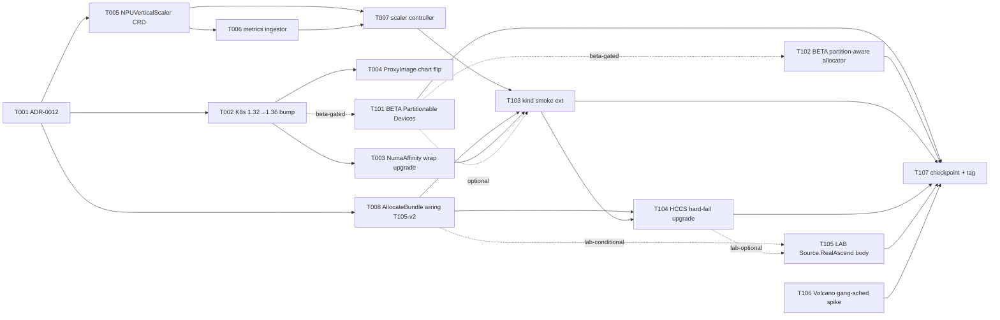

# Phase 8 Plan — Busy-idle 垂直伸缩 (重启切片 pattern) + K8s baseline bump triangle unblock + Phase 7 deferred wiring

> **Goal**: Phase 8 closes the M3 → M4 transition with **busy-idle
> 垂直伸缩 controller** (arch §13 Phase 8 row headline · 重启切片
> pattern per ADR-0011 §1 substrate) as the deliverable spine, plus a
> single coordinated **K8s baseline bump 1.32 → 1.36+** that
> unblocks three Phase 7 doc-only / re-deferred items in one stroke
> (NumaAffinity wrap · ProxyImage chart default flip · Partitionable
> Devices Beta enablement per `docs/research/k8s-partitionable-devices-spike.md`),
> wires the Phase 7 deferred `AllocateBundle` controller path
> (P7-T-105 deferred body · per devlog phase-7-t105.md), and
> upgrades the kind-smoke HCCS placement assertion from Phase 7
> soft-warning to hard-fail (T104-v2 · once controller wiring stamps
> `preferred-hccs-ring` annotation). Vertical scaling for NPU is by
> 调研 conclusion **NOT** an "online resize" — NPU vendor stack does
> not expose live re-partitioning without state loss — so the controller
> realises scaling by deleting + re-creating slice bundles via the
> Phase 7 NPUSliceTemplate substrate (重启切片). Partitionable Devices
> migration is conditional on KEP-4815 status at W2 entry (Beta
> confirmed 1.36 · GA timing unconfirmed); the W2 sub-track ships full
> partition-aware allocator if KEP-4815 is judged production-ready
> at W2 entry, else doc-only refresh + Phase 10 carry-over.
>
> **Duration**: ~3-4 weeks calendar (W1 foundation 8 tasks: ADR-0012
> busy-idle design + K8s baseline bump + NumaAffinity wrap upgrade +
> ProxyImage chart default flip + NPUVerticalScaler CRD + busy-idle
> metrics ingestor + scaling controller body + AllocateBundle controller
> wiring; W2 polish + partition-conditional + lab-conditional 7 tasks:
> Partitionable Devices Beta enable + partition-aware allocator + kind
> smoke ext + HCCS placement hard-fail upgrade + lab Source.RealAscend
> body + Phase 9 spike + checkpoint). **Phase 8 uncertainty profile**:
> moderately less than Phase 7 — single baseline-bump task carries the
> "transitive dep drift" risk that gated Phase 7 T002/T102 (known-issues
> #12 + phase-7-t102 devlog); KEP-4815 GA timing is the second
> uncertainty; lab access remains a soft third per ADR-0011 §3 default
> policy (no lab signal → Phase 10 carry).
>
> **Prereq**: Phase 7 tag `phase-7-complete` (HEAD of dev = `538f094`,
> last commit of the P7-fix-001..004 post-tag CI gate series per
> memory `feedback_post_tag_ci_gate.md`). ADR-0009 (npu-dra-driver §4
> Partitionable Devices forward + §6.4 migration table · refreshed by
> P7-T-106), ADR-0010 (scheduler-plugin §3 NumaAffinity T006 status
> + §7 Phase 7+ forward notes), ADR-0011 (NPU 动态切分 + Source 接口
> + lab gating · landed P7-T-001), and `docs/research/k8s-partitionable-
> devices-spike.md` (KEP-4815 status + migration cost matrix) are the
> baseline reading. `docs/cann-driver-matrix.md` remains the entry gate
> for any lab-conditional task (T105). Root CLAUDE.md §14 (devlog +
> module DESIGN.md) applies; agent-coordination §0a.10-12 (plan/execute
> split + strict-per-task verify + push protocol) applies to every
> Phase 8 task.

---

## 1. Scope summary

Phase 8 lifts four of the items Phase 7 carried forward
(checkpoint-phase7.md §6 + arch §13 Phase 8 row); three stay deferred
to Phase 9-10:

| Stream                                                              | Phase 7 state                                                                                                                                                              | Phase 8 delivery                                                                                                                                                                                                                                                       |
|---------------------------------------------------------------------|----------------------------------------------------------------------------------------------------------------------------------------------------------------------------|------------------------------------------------------------------------------------------------------------------------------------------------------------------------------------------------------------------------------------------------------------------------|
| **Busy-idle 垂直伸缩 controller (arch §13 Phase 8 row HEADLINE)**   | NPUSliceTemplate substrate landed (P7-T-006/T007); AllocateBundle free function landed (P7-T-105) but controller wiring deferred; no scaling controller exists             | NEW `NPUVerticalScaler` CRD (target → ModelService · metric → NPU util · scaleSlice → busy/idle NPUSliceTemplate ref · cooldown · history); controller reconciles target ModelService.spec.template.sliceTemplate ref + triggers inference-operator rolling restart    |
| **K8s baseline bump 1.32 → 1.36+** (triangle unblock)               | All modules pinned to K8s 1.32 baseline (ADR-0010 §1); 3 Phase 7 items doc-only / re-deferred                                                                              | T002 single coordinated bump across all go.mod files + kindest/node image + apimachinery transitive deps + chart `kubeVersion` ranges; downstream T003+T004+T101 (Partitionable Devices) light up post-bump                                                            |
| **NumaAffinity wrap upgrade** (known-issues #12 closer)             | Phase 6 T006 placeholder + Phase 7 T002 doc-only re-deferral (apimachinery v0.32.7+ packages missing on 1.32 baseline)                                                      | T003 flips placeholder body to `noderesourcetopology.New(plArgs, h)` once baseline bump (T002) is in; chart toggle `numaAffinity.enabled` defaults true; KubeSchedulerConfiguration profile registers NumaAffinity Filter+Score; 3 sanity tests pass                    |
| **vllm-ascend ProxyImage chart default flip** (T102-v2)             | Phase 7 T102 doc-only refresh (v0.12+ GA confirmed but CI image-pull access from GHA runners unverified · `quay.io/vllm-project/vllm-ascend` exact tag convention unverified) | T004 verifies CI image-pull post-bump + confirms image tag convention + flips chart default `defaults.proxyImage` from empty to v0.18.0 (or latest pinned at W1 entry); busybox fallback retained; operators opt out via explicit `ms.Spec.PDPair.ProxyImage`           |
| **AllocateBundle controller wiring** (T105-v2)                      | Phase 7 T105 ships `AllocateBundle` free function + 4 unit tests; controller wiring (Pod label → NPUSliceTemplate lookup → Engine.Decompose → AllocateBundle → N allocations) deferred to Phase 10 / T105-v2 per M4 scope reduction | T008 wires claim_controller to read Pod label `npu.huawei.com/slice-template=<name>` → `client.Get NPUSliceTemplate` → `template.Engine.Decompose` → `allocator.AllocateBundle` → write N allocations into ResourceClaim.Status + N NPUSliceAllocation audit objects; 3 envtest cases ship |
| **HCCS placement hard-fail upgrade** (T104-v2)                      | Phase 7 T104 ships set-b-multi-ring fixture + ResourceSlice 4-ring assert; PD-pair placement assertion downgraded to soft warning (kind has no real HCCS · no controller wiring) | T104 upgrades to hard-fail once T008 controller wiring stamps `preferred-hccs-ring=<ringID>` annotation on PD-pair Pods (synthetic ring fixture validates placement matches annotation); lab smoke (T105) verifies on real silicon if lab signal materialises             |
| **Standard-K8s 1.36 Partitionable Devices Beta enable**             | KEP-4815 Beta confirmed at 1.36 (P7-T-106 spike); GA timing unconfirmed; npu-dra-driver publisher emits whole-NPU only                                                      | T101 (BETA-GATED) enables Partitionable Devices feature gate post-bump; AscendDevice extends with partition fields; mockjson partition fixture lands; publisher emits whole + partition entries; OR doc-only refresh if Beta judged not production-ready at W2 entry |
| **Partition-aware Allocator** (per spike §3 HIGH risk row)          | Phase 7 allocator: greedy first-fit on whole NPUs (Phase 5 baseline) + AllocateBundle bundle path (Phase 7 T105)                                                            | T102 (BETA-GATED) ships partition-aware Allocate path that chooses among (whole NPU candidates) + (partition candidates) with shared-NPU sibling preference for HCCS locality; ships only if T101 lights up Partitionable Devices Beta; else doc-only carry to Phase 10 |
| **[LAB-CONDITIONAL] Real Ascend hardware integration**              | Phase 7 T101 deferred to Phase 10 per ADR-0011 §3 default policy (no lab signal at W2 entry)                                                                                | T105 (LAB-CONDITIONAL) re-attempts Source.RealAscend body on real 910B silicon: npu-smi parser real-binary call + ResourceSlice attribute population + real ModelService deployment + PD-pair placement hard-assertion via T104-v2 annotation; defers to Phase 10 if no lab signal |

**Out of scope (Phase 9+)**:
- **Karmada multi-site federation + multi-tenant quota controller** —
  Phase 9 (NPUSliceAllocation owner-ref is the Phase 5 substrate;
  Phase 8 does not add tenancy controls or RBAC scoping). Phase 8
  busy-idle controller is single-tenant; multi-tenant fair scaling
  policy is Phase 9
- **O2 DMS adapter (K8s Profile)** — Phase 9 per arch §1.3
- **Live migration of HCCL ranks / per-Pod RDMA bandwidth quota** —
  CNI-level gaps per `docs/cni-hccl-research.md` §5; "重启切片"
  pattern (Phase 8) sidesteps this by accepting brief outage during
  vertical resize · live migration is Phase 9+ if at all
- **Cross-node HCCL gang-scheduling integration (Volcano PodGroup)** —
  T106 ships spike-only (research + ADR-0010 §231 forward note refresh)
  · implementation Phase 9 training-job scenario
- **真实硬件对接 + 演示打磨 (full real-hardware demo polish)** —
  Phase 10 per arch §1.3; Phase 8 T105 is a single-modelservice + PD-pair
  end-to-end smoke (same scope as Phase 7 T101 had it landed), not the
  full multi-pool / multi-tenant lab演示
- **Fabric discovery via LLDP / SONiC API** — defer per ADR-0007 +
  ADR-0010 §229 to Phase 9+ on real switching gear
- **MindIE Turbo backend toggle in vllm-ascend Pods** — env var
  passthrough already exists since Phase 5; Phase 8 does not default
  enable per phase7-plan §"Out of scope"
- **Horizontal scaling (replica count via HPA)** — out of Phase 8 scope
  per arch §13 Phase 8 row 调研结论 (vertical = "重启切片"; horizontal
  is HPA off-the-shelf; demo focus is the vertical path because that's
  the novel NPU substrate)

---

## 2. Task package overview (15 tasks)

```
W1 Foundation (8 tasks · ADR + baseline bump + 3 post-bump unblocks + busy-idle substrate + T105-v2 wiring)
├── P8-T-001  ADR-0012 — Busy-idle 垂直伸缩 design (重启切片 pattern + NPUVerticalScaler CRD shape + scaling triggers + cooldown policy + integration with NPUSliceTemplate + AllocateBundle)
├── P8-T-002  K8s baseline bump 1.32 → 1.36 (go.mod across all modules + kindest/node + sched-plugins v0.36.x + apimachinery v0.36.x + chart kubeVersion ranges)
├── P8-T-003  NumaAffinity upstream wrap upgrade (post-T002 · plugin body flip + chart toggle default true + 3 sanity tests · closes known-issues #12)
├── P8-T-004  vllm-ascend ProxyImage chart default flip post-bump (T102-v2 · CI image-pull verify + v0.18.0 tag pin + busybox fallback retained)
├── P8-T-005  NPUVerticalScaler CRD types (target + metric + scaleSlice + cooldown spec + status conditions + 4 round-trip tests + 2 samples)
├── P8-T-006  Busy-idle metrics ingestor (Prometheus client reading exporter-plus npu_utilization_percent + inference-operator request rate gauge + sliding window)
├── P8-T-007  NPUVerticalScaler controller (Reconcile body: 重启切片 pattern — patch target ModelService.spec.template.sliceTemplate ref + signal rolling restart)
└── P8-T-008  AllocateBundle controller wiring (T105-v2 · claim_controller reads Pod slice-template label → Engine.Decompose → AllocateBundle → N allocations + audit · 3 envtest cases)

W2 Polish + partition-conditional + lab-conditional + checkpoint (7 tasks)
├── P8-T-101  [BETA-GATED] Partitionable Devices Beta enable (1.36 feature gate + AscendDevice partition fields + mockjson partition fixture + publisher emit)
├── P8-T-102  [BETA-GATED] Partition-aware allocator (Allocate path picks among whole + partition candidates · shared-NPU sibling preference for HCCS locality)
├── P8-T-103  kind smoke E2E Phase 8 extension (NPUVerticalScaler Reconcile loop assertion + NumaAffinity active + slice-template label E2E + partition discovery if T101)
├── P8-T-104  HCCS placement hard-fail upgrade (T104-v2 · preferred-hccs-ring annotation from T008 wiring · kind smoke flips warning → hard fail with synthetic ring fixture)
├── P8-T-105  [LAB-CONDITIONAL] Source.RealAscend body (Phase 7 T101 carry · npu-smi real-binary call + ResourceSlice attribute + PD-pair placement on real 910B)
├── P8-T-106  Volcano gang-scheduling integration spike (research + ADR-0010 §231 forward note refresh + Phase 9 cost matrix)
└── P8-T-107  Phase 8 docs + checkpoint + tag phase-8-complete
```

Mermaid:



Subagent parallelisation candidates (per §0a.11 strict-verify — ONE
subagent at a time, main agent verifies before next is dispatched;
parallelisation is OPPORTUNISTIC across natural module boundaries
when user gives explicit "batch" cue):
- T001 (docs-only) standalone — no code dependency
- T003 (scheduler-plugin numa pkg) parallel-eligible with T004
  (inference-operator chart) post-T002 — different modules
- T005 (npu-dra-driver api/v1alpha1 CRD) parallel-eligible with T008
  (npu-dra-driver internal/controller wiring) — same module so
  coordinate; OR T005 parallel-eligible with T006 (new operators/
  vertical-scaler module package) — different modules
- T106 (docs-only spike) standalone

Beta-gated track (T101 + T102 partition-aware):
- Triggered ONLY when KEP-4815 1.36 Beta is judged production-ready
  at W2 entry — re-WebFetch upstream issue + spike doc §6 checklist
- Phase 8 ships without these if Beta judged not stable → both move
  to Phase 10 backlog + doc-only refresh
- T102 partition-aware allocator depends on T101; if T101 deferred,
  T102 auto-deferred

Lab-conditional track (T105):
- Triggered ONLY when user signals "lab access available" mid-W2
  in chat — same gating as Phase 7 T101 per ADR-0011 §3
- Phase 8 ships without this if lab not available → T105 moves to
  Phase 10 backlog (same as Phase 7 T101 outcome)

---

## 3. W1 task packages

### P8-T-001 ADR-0012 — Busy-idle 垂直伸缩 design + NPUVerticalScaler CRD shape + 重启切片 pattern

Owner: docs (no code).

**Allowed Paths**:
- `docs/adr/0012-busy-idle-vertical-scaler.md` (new — busy-idle 垂直伸缩 design + NPUVerticalScaler CRD shape + 重启切片 pattern + scaling trigger + cooldown policy + integration with NPUSliceTemplate (ADR-0011) + integration with AllocateBundle (P7-T-105/T008-v2 wiring))
- `docs/architecture.md` (small edit — §13 review-table Phase 8 row promoted from "candidate" → "in flight via ADR-0012"; §3.4 NPU runtime row adds NPUVerticalScaler forward ref; §1.3 phase roadmap unchanged)
- `docs/adr/0011-npu-dynamic-slicing-and-source-interface.md` (small edit — §1 後果 row "Phase 8 vertical scaling reads NPUSliceTemplate.status to determine 重启切片 trigger" cross-references ADR-0012 §"Scaling decision flow")
- `docs/adr/0009-npu-dra-driver.md` (small edit — §4 forward note adds ADR-0012 cross-ref under "Phase 8 partition path"; §6.4 migration table adds vertical-scaler integration row)
- `docs/adr/0010-scheduler-plugin.md` (small edit — §7 Phase 7+ forward note adds ADR-0012 cross-ref under "Phase 8 busy-idle reconcile loop")

Acceptance:
- ADR §1 Context: cites Phase 7 checkpoint §6 + ADR-0011 §1 後果 + arch §13 Phase 8 row + 调研结论 (NPU vendor stack does not expose live re-partitioning; 重启切片 pattern is the conservative commitment; horizontal HPA scaling out of scope)
- §2 Decision A (Scaling pattern): commit to **重启切片 pattern** as the Phase 8 deliverable — controller observes busy-idle metrics → decides scale target template → patches target ModelService.spec to reference new NPUSliceTemplate → inference-operator rolling restart picks up new spec → claim_controller (T008 wiring) re-allocates per new template; transient outage during rollout is accepted (single-tenant Phase 8 scope; multi-tenant fair scaling Phase 9)
- §2 Decision B (NPUVerticalScaler CRD shape): `spec.target` references ModelService (apiVersion + kind + name + namespace); `spec.metric` polymorphic (Phase 8 W1: NPUUtilization with busyThreshold + idleThreshold + windowSeconds; Phase 9 candidate: custom Prometheus query); `spec.scaleSlice` maps busy/idle to NPUSliceTemplate refs; `spec.cooldownSeconds` prevents oscillation; `status.conditions` (Active, ScalingInProgress, CooldownActive); `status.scaleHistory` rolling window of N events
- §2 Decision C (Scaling decision flow): controller reads metrics (T006) → computes window average → compares to threshold → decides target template → patches ModelService (atomic) → records ScaleEvent in status → enters cooldown → on cooldown expiry re-enables → does NOT delete the NPUSliceAllocation directly (let inference-operator + claim_controller do that via rolling-restart Pod recreation)
- §3 Consequences: vertical scaling realised via spec patch + Pod restart, NOT live re-partition; brief outage during rollout (~30s typical) accepted; cooldown prevents flapping; Phase 9 fair scaling policy will read NPUVerticalScaler.status to coordinate multi-tenant; partition path (KEP-4815) coexists — partition-aware Allocate (T102) still selects partition vs whole-NPU at re-allocation time
- §4 CRD schema: `apiVersion: inference.ocloud.edge.example.com/v1alpha1`, `kind: NPUVerticalScaler` (co-located with ModelService api group · same operators/inference-operator binary owns reconcile loop · no new helm chart needed); **namespace-scoped** (colocated with target ModelService); finalizer name `npuverticalscaler.inference.ocloud.edge.example.com/finalizer`; printer columns Target / CurrentTemplate / LastScaleTime / Status
- §5 Scaling mutation model: NPUVerticalScaler controller **patches** target `ModelService.spec.template.sliceTemplate` ref directly (mirror K8s HPA pattern that patches Deployment.spec.replicas); stamps annotation `ocloud.edge.example.com/vertical-scaler-managed=<scaler-name>` on ModelService as GitOps hint (operators should configure GitOps tool to ignore the sliceTemplate field on annotated ModelServices · documented in ADR-0012 §5); inference-operator ModelService controller observes spec change + drives rolling restart (existing reconcile loop); claim_controller (T008 wiring) re-allocates per new template at Pod recreation
- §6 Open questions: (a) replica count interaction — NPUVerticalScaler patches template not replica count; HPA can coexist if operator deploys both (different fields); (b) metric source — Prometheus default; allow direct exporter-plus scrape as Phase 9 fallback; (c) multi-replica rolling restart — accept brief partial-capacity during rollout; (d) GitOps reconciliation conflict — documented annotation hint + recommend operators configure ignoreDifferences for `.spec.template.sliceTemplate` on annotated ModelServices
- §7 Forward notes: Phase 9 multi-tenant fair scaling reads NPUVerticalScaler.status + Quota CRD; Phase 10 demo polish validates real-silicon rollout time; partition-aware allocator (T102) hooks into Allocate path for re-allocation; Phase 9 custom-metric (Prometheus PromQL) extension lands as `spec.metric.type=PrometheusQuery` opt-in (Phase 8 ships only NPUUtilization built-in metric)

Dependencies: none beyond `phase-7-complete`.

Estimated effort: 0.5d.

---

### P8-T-002 K8s baseline bump 1.32 → 1.36 (single coordinated bump)

Owner: operators + deploy (cross-module · main-agent串行 per §0a.11).

**Decision needed at task entry**:
- Re-WebFetch https://github.com/kubernetes/enhancements/issues/4815 + check upstream `kindest/node` release tracker for 1.36 image availability + check `sigs.k8s.io/scheduler-plugins` release tracker for v0.36.x GA at task entry time
- Target choices:
  - **1.36** (recommended): Beta features available via feature gate; minimal drift from 1.32; kindest/node 1.36 GA at Phase 7 W2 entry per spike §6
  - **1.37** (if GA at task entry): unlocks Partitionable Devices GA candidate per spike §1 (but GA timing unconfirmed — re-check)
  - **1.38** (if 1.37 still Alpha): defer Partitionable Devices to Phase 10 + bump only to 1.36 for NumaAffinity + ProxyImage triangle
- Default decision: **1.36** unless re-WebFetch shows 1.37 GA confirmed at task entry

**Allowed Paths**:
- `go.mod` + `go.sum` (root or per-module — repo layout decides; bump K8s + sched-plugins + apimachinery + controller-runtime + kubebuilder libs in lockstep)
- `operators/npu-dra-driver/go.mod` + `go.sum`
- `operators/inference-operator/go.mod` + `go.sum`
- `operators/scheduler-plugin/go.mod` + `go.sum`
- `operators/pool-operator/go.mod` + `go.sum`
- `exporters/ascend-npu-exporter-plus/go.mod` + `go.sum`
- `backend/go.mod` + `go.sum`
- `tests/e2e/kind/kind-config.yaml` (kindest/node image bump v1.32.x → v1.36.x)
- `tests/e2e/kind/phase{5,6,7}/install.sh` (kubectl version pin if any · validate post-bump)
- `deploy/helm-charts/*/Chart.yaml` (kubeVersion range bump · scheduler-plugin + npu-dra-driver + inference-operator + ascend-npu-exporter-plus)
- `.github/workflows/e2e-kind.yml` (kindest/node image bump in matrix)
- `.github/workflows/ci.yml` or similar (Go version + kubectl version pins)
- `Makefile` (if Go version or kubectl version referenced)
- `docs/adr/0010-scheduler-plugin.md` (small edit — §1 baseline bump note + §3 NumaAffinity T006 status refresh "post-bump unblocked at Phase 8 T002")
- `docs/known-issues.md` (small edit — #12 NumaAffinity entry resolution note "RESOLVED via T002/T003 baseline bump")
- `docs/devlog/phase-8-t002.md`

**Forbidden Paths**:
- `docs/api-contract.yaml` (no API change in baseline bump)
- `configs/mock-data/**` (no mock data schema change)
- Source code outside `go.mod` / `go.sum` updates (any source change must be a SEPARATE post-bump task — T003/T004 handle the API drift adapters; if the bump itself surfaces unavoidable code change, escalate via chat — do NOT bundle code change into T002)

Acceptance:
- All go.mod files updated to K8s 1.36+ in lockstep (no version skew between modules)
- `go mod tidy` clean in every module — no spurious indirect deps
- `go build ./...` clean in every module
- `go vet ./...` clean in every module
- `go test ./...` PASS in every module (no test regression — if a test fails due to apimachinery API drift, document the failure + escalate; do NOT bundle the fix into T002)
- `helm lint --strict` clean across all charts post-kubeVersion bump
- `helm template` renders cleanly against 1.36 schema
- kind smoke installs against kindest/node v1.36.x without error
- All Phase 5/6/7 kind smoke E2E phases re-run + PASS against 1.36 (no regression on existing assertions)
- Devlog enumerates: target K8s minor decision + transitive dep changes + any temporary workaround for surfaced API drift
- ADR-0010 §1 + §3 status refresh + known-issues #12 marked RESOLVED with cross-ref to this commit

Dependencies: none beyond `phase-7-complete`. ADR-0012 (T001) lands first per natural order but T002 is technically independent of ADR-0012.

Estimated effort: 1-2d (1d if no transitive dep drift surfaces; 2d if apimachinery / controller-runtime drift surfaces requires adapter shims). Escalate via chat if breaching 2d budget.

---

### P8-T-003 NumaAffinity upstream wrap upgrade (post-T002 · known-issues #12 closer)

Owner: operators/scheduler-plugin (plugin body completion · post-baseline-bump).

**Allowed Paths**:
- `operators/scheduler-plugin/internal/plugins/numa/plugin.go` (flip placeholder body from `Name() string` only to full `New() Plugin` factory + `Filter` + `Score` wrapping `noderesourcetopology.New(ctx, plArgs, h)` per sched-plugins v0.36.x signature)
- `operators/scheduler-plugin/internal/plugins/numa/args.go` (new — parseArgs structure for NumaAffinityArgs mirror hccs/args.go; pre-construct upstream `NodeResourceTopologyMatchArgs` with `LeastAllocated` strategy + cpu/memory weight=1 defaults)
- `operators/scheduler-plugin/internal/plugins/numa/plugin_test.go` (3 sanity tests — Name + Filter no-op when args nil + Score returns 0 when nodeResourceTopology absent · per phase7-plan §3 T002 acceptance pattern carried forward)
- `operators/scheduler-plugin/internal/plugins/numa/args_test.go` (1 args parse test)
- `operators/scheduler-plugin/cmd/main.go` (register NumaAffinity Filter+Score via `Register(numa.Name, numa.New)`)
- `deploy/helm-charts/scheduler-plugin/values.yaml` (chart toggle `numaAffinity.enabled` default flip false → true)
- `deploy/helm-charts/scheduler-plugin/templates/configmap-scheduler-config.yaml` (add NumaAffinity Filter + Score to `npu-scheduler` profile when enabled)
- `operators/scheduler-plugin/DESIGN.md` (small edit — §5.2 NumaAffinity status flip from "placeholder · deferred Phase 7 T002 doc-only" → "v0.36.x wrap landed Phase 8 T003")
- `docs/adr/0010-scheduler-plugin.md` (small edit — §3 T006 status refresh + §1 NumaAffinity row resolved)
- `docs/known-issues.md` (small edit — #12 entry flips OPEN → RESOLVED with commit SHA)
- `docs/devlog/phase-8-t003.md`

**Forbidden Paths**:
- `go.mod` (baseline bump done by T002 · T003 only uses post-bump APIs)
- Other modules (T003 scoped to scheduler-plugin)

Acceptance:
- `go build ./operators/scheduler-plugin/...` clean
- `go test ./operators/scheduler-plugin/internal/plugins/numa/...` PASS — 3 sanity tests + 1 args parse test = 4 cases
- `go test ./operators/scheduler-plugin/internal/plugins/hccs/...` PASS unchanged (no regression on Phase 7 32 hccs cases)
- `go test ./operators/scheduler-plugin/internal/plugins/binpack/...` PASS unchanged (no regression on Phase 6 9 binpack cases)
- `helm lint --strict deploy/helm-charts/scheduler-plugin/` clean
- `helm template deploy/helm-charts/scheduler-plugin/ --set numaAffinity.enabled=true` shows NumaAffinity registered in profile filter + score lists
- ADR-0010 §3 + DESIGN.md §5.2 + known-issues #12 reflect resolution

Dependencies: T002 (baseline bump must land first for v0.36.x NRT package availability).

Estimated effort: 1d.

---

### P8-T-004 vllm-ascend ProxyImage chart default flip post-bump (T102-v2)

Owner: operators/inference-operator (chart default flip · post-baseline-bump validates image-pull access).

**Decision needed at task entry**:
- Verify `quay.io/vllm-project/vllm-ascend` image tag convention (Phase 7 T102 noted unverified) — pull image once locally + record actual tag pattern
- Verify CI image-pull from GHA runner is workable (~5GB image · check disk budget + pull time · Phase 7 T102 noted unverified)
- Decision branches:
  - **Full flip** (recommended if both verifications pass): chart default `defaults.proxyImage` set to pinned `quay.io/vllm-project/vllm-ascend:v0.18.0` (or whichever GA tag at T004 entry); busybox fallback retained for offline CI; operators opt out via `ms.Spec.PDPair.ProxyImage` explicit override
  - **Doc-only refresh** (fallback): document the precise blocker + carry to Phase 10 demo polish; chart default stays empty (Phase 7 state preserved)

**Allowed Paths** (full flip path):
- `deploy/helm-charts/inference-operator/values.yaml` (flip `defaults.proxyImage` from empty to pinned tag)
- `deploy/helm-charts/inference-operator/templates/*.yaml` (no template change expected — value injection path already exists from P7-T-102)
- `operators/inference-operator/internal/controller/deployment_builder.go` (small edit if needed — verify `effectiveProxyImage` fallback chain still works with non-empty default)
- `operators/inference-operator/internal/controller/deployment_builder_test.go` (add 1 test case — chart default proxyImage propagates when ModelService.Spec.PDPair.ProxyImage empty)
- `operators/inference-operator/DESIGN.md` (small edit — §5.0.1 ProxyImage status flip + §5.0 godoc cross-ref)
- `tests/e2e/kind/phase{5,6,7,8}/install.sh` (validate image-pull works in CI; if disk budget issue, document the alternative path)
- `.github/workflows/e2e-kind.yml` (if image-pull fails in CI, add image cache mount + retry policy)
- `docs/devlog/phase-8-t004.md`

**Allowed Paths** (doc-only fallback path):
- `operators/inference-operator/DESIGN.md` (small edit — §5.0.1 carry-forward to Phase 10)
- `deploy/helm-charts/inference-operator/values.yaml` (no change — confirm default stays empty)
- `docs/devlog/phase-8-t004.md` (records doc-only fallback rationale)
- `docs/known-issues.md` (small edit — adds entry "vllm-ascend ProxyImage chart default flip carried to Phase 10")

Acceptance (full flip):
- Chart `helm template` renders Pod spec with proxyImage pinned tag
- `go test ./operators/inference-operator/internal/controller/...` PASS — 4 effectiveSchedulerName tests + new 1 effectiveProxyImage test
- kind smoke pulls image successfully (timeboxed 5 min in CI)
- PD-pair Pod runs proxy_server entrypoint (not busybox sleep) — validate via Pod log assertion in kind smoke
- DESIGN.md §5.0.1 updated

Acceptance (doc-only fallback):
- Devlog enumerates: (a) verification attempt outcome (b) precise blocker (c) Phase 10 carry-forward rationale (d) chart default unchanged confirmation
- DESIGN.md §5.0.1 reflects carry-forward
- No source code change; busybox fallback path preserved

Dependencies: T002 (baseline bump · CI image cache may behave differently across kindest/node versions).

Estimated effort: 0.5d (full flip) or 0.3d (doc-only fallback).

---

### P8-T-005 NPUVerticalScaler CRD types + scheme + samples

Owner: operators/inference-operator (api/v1alpha1 extension · co-located with ModelService per ADR-0012 §4).

**Allowed Paths**:
- `operators/inference-operator/api/v1alpha1/npuverticalscaler_types.go` (new — NPUVerticalScaler + NPUVerticalScalerSpec + NPUVerticalScalerStatus + nested types per ADR-0012 §4)
- `operators/inference-operator/api/v1alpha1/groupversion_info.go` (small edit — `SchemeBuilder.Register(&NPUVerticalScaler{}, &NPUVerticalScalerList{})`)
- `operators/inference-operator/api/v1alpha1/zz_generated.deepcopy.go` (regenerated via `make generate`)
- `operators/inference-operator/api/v1alpha1/npuverticalscaler_types_test.go` (new — 4 round-trip + DeepCopy + omitempty + enum-pin cases · mirror Phase 7 NPUSliceTemplate test pattern)
- `operators/inference-operator/config/crd/bases/inference.ocloud.edge.example.com_npuverticalscalers.yaml` (generated via `make manifests`)
- `operators/inference-operator/config/samples/inference_v1alpha1_npuverticalscaler.yaml` (new — 1 sample targeting Qwen-PD ModelService with busy/idle template refs)
- `deploy/helm-charts/inference-operator/crds/npuverticalscaler.yaml` (chart bundle · generated)
- `operators/inference-operator/PROJECT` (small edit if kubebuilder PROJECT tracks resources)
- `docs/devlog/phase-8-t005.md`

**Forbidden Paths**:
- `operators/inference-operator/internal/controller/` (controller body lands in T007 · not in T005 scope)
- `operators/inference-operator/internal/metrics/` (metrics ingestor lands in T006)

Acceptance:
- Types compile: `go build ./operators/inference-operator/api/...` clean
- DeepCopy regenerates clean (no stale `zz_generated.deepcopy.go` drift)
- Round-trip tests pass: `go test ./operators/inference-operator/api/v1alpha1/... -run TestNPUVerticalScaler` 4 cases
- `make manifests` clean (CRD yaml regenerates idempotently)
- Sample applies clean against cluster with stubbed admission: `kubectl --dry-run=client apply -f config/samples/inference_v1alpha1_npuverticalscaler.yaml`
- Phase 5/6/7 inference-operator tests preserved: `go test ./operators/inference-operator/...` no regression on existing 45+ tests (controller/builder/webhook/etc)
- CRD schema fields per ADR-0012 §4:
  - `spec.target` { apiVersion, kind="ModelService", name, namespace } — typed CrossNamespaceObjectReference shape
  - `spec.metric` { type=enum["NPUUtilization"], busyThreshold int32 (0-100), idleThreshold int32 (0-100), windowSeconds int32 (default 300) }
  - `spec.scaleSlice` { busyTemplateName string (NPUSliceTemplate ref), idleTemplateName string (NPUSliceTemplate ref) }
  - `spec.cooldownSeconds` int32 (default 600)
  - `status.conditions` []metav1.Condition (Active, ScalingInProgress, CooldownActive)
  - `status.observedTarget` { name, namespace, currentTemplate string }
  - `status.lastScaleTime` *metav1.Time
  - `status.scaleHistory` []ScaleEvent (rolling window of N=10 events with time + fromTemplate + toTemplate + trigger reason)
- Printer columns kubebuilder markers: Target / CurrentTemplate / LastScaleTime / Status

Dependencies: T001 (ADR-0012 schema decision).

Estimated effort: 0.5d.

---

### P8-T-006 Busy-idle metrics ingestor

Owner: operators/inference-operator (new internal/metrics package · standalone, ingestor for T007 controller).

**Allowed Paths**:
- `operators/inference-operator/internal/metrics/ingestor.go` (new — Ingestor interface + PrometheusIngestor impl + Window aggregator)
- `operators/inference-operator/internal/metrics/ingestor_test.go` (new — 5 cases: stub Prometheus server + window average + threshold transitions + nil-data fallback + error path)
- `operators/inference-operator/internal/metrics/fake_ingestor.go` (new — FakeIngestor for use in controller tests · returns canned values per call)
- `operators/inference-operator/internal/metrics/types.go` (new — MetricSample + WindowedAverage + IngestorOpts shapes)
- `operators/inference-operator/cmd/main.go` (small edit — wire PrometheusIngestor instantiation from chart `metrics.prometheusURL` value · default `http://prometheus.observability:9090`)
- `deploy/helm-charts/inference-operator/values.yaml` (small edit — add `metrics.prometheusURL` default + `metrics.scrapeIntervalSeconds` default 30)
- `deploy/helm-charts/inference-operator/templates/deployment.yaml` (small edit — env vars for ingestor config from values)
- `operators/inference-operator/DESIGN.md` (extends with new section §6 "Busy-idle metrics ingestor" — architecture + PromQL query shape + fallback semantics + Phase 9 custom-query extension point)
- `docs/devlog/phase-8-t006.md`

**Forbidden Paths**:
- `operators/inference-operator/internal/controller/npuverticalscaler_controller.go` (controller body lands in T007)
- Cross-module Prometheus scrape (uses standard `github.com/prometheus/client_golang` for HTTP query — no exporter-plus modification)

Acceptance:
- `go build ./operators/inference-operator/internal/metrics/...` clean
- `go test ./operators/inference-operator/internal/metrics/...` PASS — 5 ingestor cases
- PromQL query shape documented: `avg_over_time(ascend_npu_utilization_percent{namespace="$ns", model_service="$ms"}[$window])` — captures namespace + ModelService label scoping
- FakeIngestor implements `Ingestor` interface (verified by `var _ Ingestor = (*FakeIngestor)(nil)` line)
- chart `helm template` renders deployment with `metrics.prometheusURL` env propagated
- DESIGN.md §6 lands with PromQL query + window aggregation + fallback behaviour (returns IngestorResult{NoData: true} on Prometheus unreachable · controller treats NoData as "no scaling decision this tick")

Dependencies: T002 (baseline bump · prometheus client library compat).

Estimated effort: 1d.

---

### P8-T-007 NPUVerticalScaler controller (重启切片 Reconcile body)

Owner: operators/inference-operator (controller body · consumes T005 CRD + T006 ingestor + ADR-0012 mutation model).

**Allowed Paths**:
- `operators/inference-operator/internal/controller/npuverticalscaler_controller.go` (new — Reconcile + helpers: decideTargetTemplate, patchModelServiceTemplate, recordScaleEvent, enterCooldown, observeStatus)
- `operators/inference-operator/internal/controller/npuverticalscaler_controller_test.go` (new — 6 cases: nil metrics no-op + busy threshold cross → patch + idle threshold cross → patch + cooldown active blocks scaling + scaleHistory window rotates + conflict on ModelService patch retries)
- `operators/inference-operator/internal/controller/utils.go` (small edit if shared helpers needed for patching — e.g., `mergePatchModelService(ctx, c, ms, spec)`)
- `operators/inference-operator/cmd/main.go` (small edit — register NPUVerticalScalerReconciler with manager + wire Ingestor dependency)
- `operators/inference-operator/internal/controller/suite_test.go` (small edit — register NPUVerticalScaler CRD into envtest scheme)
- `deploy/helm-charts/inference-operator/templates/rbac.yaml` (small edit — RBAC for NPUVerticalScaler verbs get/list/watch/update/patch on inference.ocloud.edge.example.com/npuverticalscalers + RBAC for ModelService verb patch on inference.ocloud.edge.example.com/modelservices)
- `operators/inference-operator/DESIGN.md` (extends with new section §7 "NPUVerticalScaler controller" — Reconcile flow diagram + 重启切片 mutation model + cooldown state machine + ScaleEvent rolling-window contract)
- `docs/devlog/phase-8-t007.md`

**Forbidden Paths**:
- `operators/inference-operator/api/v1alpha1/` (CRD types frozen by T005)
- `operators/inference-operator/internal/metrics/` (ingestor frozen by T006 · controller depends-on-not-modifies)
- `operators/npu-dra-driver/**` (AllocateBundle wiring lands in T008 · cross-module if at all)

Acceptance:
- `go build ./operators/inference-operator/...` clean
- `go test ./operators/inference-operator/internal/controller/... -run TestNPUVerticalScaler` PASS — 6 cases
- Reconcile loop behaviour (per ADR-0012 §5 mutation model):
  1. Get NPUVerticalScaler → if !Active → return
  2. Get target ModelService → if not found → status.Active=False reason TargetNotFound
  3. Query Ingestor (T006) for window-averaged metric → if NoData → return + requeue 30s
  4. Compute decision: > busyThreshold → target=busyTemplateName · < idleThreshold → target=idleTemplateName · else → stay current
  5. If current template = decision → return (no-op)
  6. If in cooldown (lastScaleTime + cooldownSeconds > now) → set CooldownActive=True · return + requeue cooldown remainder
  7. Else: patch ModelService.spec.template.sliceTemplate = decision (atomic Patch via merge strategy); stamp annotation `ocloud.edge.example.com/vertical-scaler-managed=<scaler-name>`; append ScaleEvent to status.scaleHistory (max 10 entries · oldest evicted); set lastScaleTime=now; set ScalingInProgress=True
  8. Set status.observedTarget.currentTemplate from inspection of target ModelService after patch
- Phase 5/6/7 modelservice_controller tests preserved: `go test ./operators/inference-operator/internal/controller/...` no regression on 18 deployment_builder + 18 modelservice_controller + 4 schedulerName tests
- DESIGN.md §7 lands with Reconcile flow + state machine diagram
- envtest cases compile clean; run when envtest available (P3 local-env honesty)

Dependencies: T005 (CRD types) + T006 (Ingestor interface · FakeIngestor for tests).

Estimated effort: 1.5d.

---

### P8-T-008 AllocateBundle controller wiring (T105-v2 · Phase 7 deferred)

Owner: operators/npu-dra-driver (claim controller body extension · realises Phase 7 T105 deferred wiring).

**Allowed Paths**:
- `operators/npu-dra-driver/internal/controller/claim_controller.go` (extend Reconcile body — when `ResourceClaim` references Pod with label `npu.huawei.com/slice-template=<name>`, dispatch the bundle path: `client.Get NPUSliceTemplate{name} → template.Engine.Decompose → allocator.AllocateBundle → write N allocations into ResourceClaim.Status.Allocation.Devices + emit N NPUSliceAllocation audit objects via existing audit.Emitter pattern`)
- `operators/npu-dra-driver/internal/controller/claim_controller_test.go` (extend with 3 envtest cases · adds to Phase 5/6 cases: bundle path single-template + multi-template-decompose + over-capacity rollback · runs in envtest when available)
- `operators/npu-dra-driver/internal/controller/utils.go` (small edit if shared helper for label lookup `getSliceTemplateLabel(pod *corev1.Pod) string`)
- `operators/npu-dra-driver/internal/allocator/bundle.go` (small edit if Reconcile-side cancellation context needs threading — T105 free function may not have ctx-aware path)
- `operators/npu-dra-driver/internal/controller/suite_test.go` (small edit if NPUSliceTemplate fixture seeding needs scheme registration adjustment)
- `operators/npu-dra-driver/DESIGN.md` (extends §3 "Allocator" with new sub-section §3.10.1 "Controller wiring (Phase 8 T008)" — Pod label lookup contract + ResourceClaim status write contract + audit emit contract + rollback semantics on partial-failure)
- `docs/devlog/phase-8-t008.md`

**Forbidden Paths**:
- `operators/npu-dra-driver/internal/template/` (engine frozen by Phase 7 T007)
- `operators/npu-dra-driver/internal/allocator/bundle.go` (T105 free function frozen unless ctx threading needs · escalate via chat if signature change required)
- `operators/npu-dra-driver/api/v1alpha1/` (no CRD change in T008)

Acceptance:
- `go build ./operators/npu-dra-driver/...` clean
- `go test ./operators/npu-dra-driver/internal/controller/...` PASS — 3 new envtest cases + existing 3+ Phase 5/6/7 reconciler cases preserved (no regression on NPUSliceTemplate reconciler · no regression on ResourceClaim happy path · no regression on allocation_controller cases)
- `go test ./operators/npu-dra-driver/internal/allocator/...` PASS — Phase 7 4 bundle cases preserved
- Bundle path observable: when Pod has label `npu.huawei.com/slice-template=qwen-pd`, ResourceClaim.Status.Allocation.Devices contains N AscendDevice refs matching Engine.Decompose output of `qwen-pd` template
- Whole-NPU path preserved: when Pod has no slice-template label, Phase 5 greedy first-fit path used (zero regression on whole-NPU claim tests)
- Audit emit: N NPUSliceAllocation objects emitted per claim with owner-ref → ResourceClaim · per Phase 5 audit.Emitter pattern
- Rollback: when AllocateBundle fails mid-bundle, claim_controller writes ResourceClaim.Status with no Allocation field set + records Event "BundleAllocationFailed" + cleans up partial audit objects · per Phase 7 T105 all-or-nothing contract
- preferred-hccs-ring annotation stamping: claim_controller annotates the Pod with `npu.huawei.com/preferred-hccs-ring=<ringID>` derived from selected NPU's ResourceSlice attribute (foundation for T104 hard-fail upgrade)
- envtest cases compile clean; run when envtest available (P3 local-env honesty)
- DESIGN.md §3.10.1 lands with wiring contract + label lookup + status write + audit emit

Dependencies: T002 (baseline bump · client-go behaviour change risk) + T005/T007 indirectly (Phase 8 demo uses NPUVerticalScaler → ModelService → inference-operator deployment_builder → Pod with slice-template label → T008 wiring · but T008 itself doesn't depend on T005/T007 code).

Estimated effort: 1.5d.

---

## 4. W2 task packages

### P8-T-101 [BETA-GATED] Partitionable Devices Beta enable

Owner: operators/npu-dra-driver (Source + publisher extension · gated on KEP-4815 1.36 Beta readiness assessment at W2 entry).

**Decision needed at task entry (W2 D1)**:
- Re-WebFetch https://github.com/kubernetes/enhancements/issues/4815 + check current Stage label (still `stage/beta`? has GA milestone landed?)
- Check kindest/node v1.36.x + v1.37.x release status + Partitionable Devices feature gate name + default-enabled flag
- Run `gh issue list -R kubernetes/enhancements -L 50 --search "4815"` to enumerate merged PRs since Phase 7 P7-T-106 spike date (2026-05-20)
- Decision branches:
  - **Full enable** (recommended if Beta stable + upstream PRs landed cleanly): proceed with T101 body — AscendDevice partition field extension + mockjson partition fixture + publisher emit partition + opt-in via chart flag `partitionableDevices.enabled=true` (default false until Phase 9 production-ready signal)
  - **Doc-only refresh** (fallback if Beta judged not production-ready): refresh `docs/research/k8s-partitionable-devices-spike.md` §1-§3 + carry to Phase 10; T101 marked deferred; T102 auto-deferred
- Default decision: **Doc-only refresh** unless re-WebFetch + PR audit shows Beta judged production-ready (conservative per P3 + ADR-0011 §3 lab gating policy spirit)

**Allowed Paths** (full enable path):
- `operators/npu-dra-driver/api/v1alpha1/ascenddevice_types.go` (small edit — add optional `Partition *PartitionRef` field on AscendDevice with parent NPU ref + partition index + AI-core count)
- `operators/npu-dra-driver/api/v1alpha1/zz_generated.deepcopy.go` (regenerated)
- `operators/npu-dra-driver/internal/source/mockjson/source.go` (small edit — accept partition field in JSON fixture + emit partition AscendDevice entries alongside whole-NPU entries)
- `operators/npu-dra-driver/internal/source/testdata/set-c-partition/cluster.json` (new mockjson fixture with 2 NPUs × 4 partitions each = 8 partition devices + 2 whole-NPU devices)
- `operators/npu-dra-driver/internal/source/mockjson/source_test.go` (extend with 2 partition fixture cases)
- `operators/npu-dra-driver/internal/publisher/publisher.go` (small edit — `buildSlice()` projects partition AscendDevice entries with `resourceapi.Device.Parent` reference to whole-NPU per KEP-4815 schema · whole-NPU entry still emitted)
- `operators/npu-dra-driver/internal/publisher/publisher_test.go` (extend with 1 partition emit case)
- `deploy/helm-charts/npu-dra-driver/values.yaml` (small edit — add `partitionableDevices.enabled` default false + `partitionableDevices.featureGateName` default `DRAPartitionableDevices`)
- `deploy/helm-charts/npu-dra-driver/templates/deployment.yaml` (small edit — env var passthrough for feature gate)
- `tests/e2e/kind/phase8/install.sh` (extend with `kind create cluster --config=kind-1.36-with-partition.yaml` enabling feature gate)
- `tests/e2e/kind/kind-1.36-with-partition.yaml` (new — kindest/node v1.36.x with `featureGates: { DRAPartitionableDevices: true }`)
- `docs/adr/0009-npu-dra-driver.md` (small edit — §4 forward note status flip from "spike landed P7-T-106 · GA timing unknown" → "Beta enabled Phase 8 T101 with feature gate · GA upgrade Phase 9-10")
- `docs/research/k8s-partitionable-devices-spike.md` (small edit — §6 forward checklist marks pre-flight items DONE)
- `operators/npu-dra-driver/DESIGN.md` (extends with new section §8 "Partitionable Devices Beta integration")
- `docs/devlog/phase-8-t101.md`

**Allowed Paths** (doc-only fallback path):
- `docs/research/k8s-partitionable-devices-spike.md` (refresh §1 status table + §2 merged PRs + §6 checklist with W2 entry date)
- `docs/adr/0009-npu-dra-driver.md` (small edit — §4 forward note refresh with new status date)
- `docs/devlog/phase-8-t101.md` (records doc-only fallback rationale)
- `docs/known-issues.md` (small edit — add entry "Partitionable Devices Beta enablement carried to Phase 10")

Acceptance (full enable):
- `go build ./operators/npu-dra-driver/...` clean post-extension
- `go test ./operators/npu-dra-driver/...` PASS — 2 mockjson partition cases + 1 publisher partition case + all Phase 4-7 cases preserved
- kind smoke (T103) installs with feature gate on; ResourceSlice emitted with partition entries; whole-NPU entries also present
- ADR-0009 §4 + DESIGN.md §8 + spike doc §6 reflect Beta enable
- Note: this task does NOT change allocator behaviour — allocator extension is T102 · publisher emits partition entries but allocator continues to pick whole-NPU until T102 lands

Acceptance (doc-only fallback):
- Devlog enumerates: (a) re-WebFetch outcome (b) upstream PR audit summary (c) production-readiness gap rationale (d) Phase 10 carry-forward
- Spike doc §1 status table + §6 checklist refreshed
- ADR-0009 §4 status refreshed
- known-issues entry added

Dependencies: T002 (baseline bump to 1.36+ · prereq for any Partitionable Devices feature gate path).

Estimated effort: 1.5d (full enable) or 0.3d (doc-only fallback).

---

### P8-T-102 [BETA-GATED] Partition-aware allocator

Owner: operators/npu-dra-driver (allocator extension · HIGH risk row per spike §3 · runs only if T101 lit up full path).

**Allowed Paths** (full enable path, only if T101 landed):
- `operators/npu-dra-driver/internal/allocator/partition.go` (new — partition-aware Allocate path that chooses among (whole NPU candidates) + (partition candidates) with shared-NPU sibling preference for HCCS locality per spike §5 trade-off)
- `operators/npu-dra-driver/internal/allocator/partition_test.go` (new — 6 cases: pure-whole-fallback when no partition candidates + pure-partition path + mixed candidates with sibling-preference + over-capacity rollback + partition-affinity prefers same physical NPU + adjacency Score integration)
- `operators/npu-dra-driver/internal/allocator/types.go` (small edit if shared types need extension for partition-aware candidate enumeration)
- `operators/npu-dra-driver/internal/allocator/bundle.go` (small edit — AllocateBundle dispatch path adds partition-aware branch when ResourceClaim references partition-aware DeviceClass)
- `operators/npu-dra-driver/internal/template/engine.go` (small edit — unblock `dynamic-shard` PartType reject path · Validate now accepts dynamic-shard when partitionableDevices feature flag set)
- `operators/npu-dra-driver/internal/template/engine_test.go` (extend with 2 dynamic-shard unblock cases)
- `operators/npu-dra-driver/internal/controller/claim_controller.go` (small edit — dispatch partition-aware Allocate when ResourceClaim DeviceClass annotated `npu.ocloud.edge.example.com/allocator=partition-aware`)
- `operators/npu-dra-driver/internal/controller/claim_controller_test.go` (extend with 2 partition-aware claim envtest cases)
- `deploy/helm-charts/npu-dra-driver/values.yaml` (small edit — chart toggle `allocator.partitionAware` default false until production-ready)
- `operators/npu-dra-driver/DESIGN.md` (extends §3 "Allocator" with new sub-section §3.11 "Partition-aware Allocate")
- `docs/adr/0009-npu-dra-driver.md` (small edit — §6.4 migration table updates partition-aware allocator row from "Phase 8 candidate" → "landed at SHA")
- `docs/devlog/phase-8-t102.md`

**Allowed Paths** (doc-only fallback path, when T101 deferred):
- `docs/research/k8s-partitionable-devices-spike.md` (small edit — §3 partition-aware allocator row reflects T102 auto-deferred)
- `docs/devlog/phase-8-t102.md` (records T102 = N/A because T101 deferred · 1 line)

Acceptance (full enable):
- `go build ./operators/npu-dra-driver/...` clean
- `go test ./operators/npu-dra-driver/internal/allocator/...` PASS — 6 partition cases + Phase 5/6/7 allocator tests preserved (no regression on whole-NPU greedy or AllocateBundle)
- `go test ./operators/npu-dra-driver/internal/template/...` PASS — 2 dynamic-shard cases + Phase 7 6 engine cases preserved
- Sibling-preference observable: when ResourceClaim requests 2 partition slices and same-NPU partition pair exists → allocator picks same-NPU pair (proves HCCS locality preference) · test asserts via candidate ordering
- Whole-NPU fallback: when no partition candidates available, allocator falls back to whole-NPU greedy (Phase 5 behaviour preserved)
- DESIGN.md §3.11 + ADR-0009 §6.4 lands

Acceptance (doc-only fallback):
- Spike doc §3 reflects T102 auto-deferred
- Devlog 1-line note · no code change

Dependencies: T101 (Partitionable Devices Beta enable · partition-aware allocator requires partition entries to exist in ResourceSlice).

Estimated effort: 3-4d (full enable · HIGH risk per spike §3) or 0.1d (doc-only fallback).

---

### P8-T-103 kind smoke E2E Phase 8 extension

Owner: deploy + operators (kind smoke install.sh + assert.sh extension across phase8/ subdir · validates Phase 8 vertical scaling + NumaAffinity + Partitionable Devices if T101 lit up).

**Allowed Paths**:
- `tests/e2e/kind/phase8/install.sh` (new — installs cert-manager + pool-operator + npu-dra-driver + inference-operator + scheduler-plugin · seeds Phase 8 fixtures including NPUSliceTemplate qwen-pd-busy + qwen-pd-idle + NPUVerticalScaler + ModelService qwen-pd)
- `tests/e2e/kind/phase8/assert.sh` (new — T103-1 NPUVerticalScaler.status.conditions[Active]=True + T103-2 NumaAffinity active in npu-scheduler profile (kubectl get configmap kube-scheduler-config · grep NumaAffinity) + T103-3 ModelService.spec.template.sliceTemplate matches NPUVerticalScaler decision + T103-4 partition discovery (skip if T101 deferred) + T103-5 slice-template label E2E (Pod label → ResourceClaim → NPUSliceAllocation × N))
- `tests/e2e/kind/phase8/fixtures/npuslicetemplate-qwen-pd-busy.yaml`
- `tests/e2e/kind/phase8/fixtures/npuslicetemplate-qwen-pd-idle.yaml`
- `tests/e2e/kind/phase8/fixtures/modelservice-qwen-pd.yaml`
- `tests/e2e/kind/phase8/fixtures/npuverticalscaler-qwen.yaml`
- `tests/e2e/kind/phase8/fixtures/reseed-set-d-busy-load.json` (or use existing set-b-multi-ring + script-injected high-utilization signal · TBD per T103 entry)
- `.github/workflows/e2e-kind.yml` (small edit — add phase8 job alongside phase5/phase6/phase7 jobs)
- `docs/devlog/phase-8-t103.md`

**Forbidden Paths**:
- `operators/**` (T103 is install + assert · no source code change)

Acceptance:
- `bash -n` clean on install.sh + assert.sh
- yaml syntax clean across all fixtures (`python -c "import yaml; yaml.safe_load(...)"`)
- Workflow lints clean: `actionlint .github/workflows/e2e-kind.yml`
- Phase 5/6/7 phase{5,6,7}/install.sh + assert.sh preserved unchanged
- Phase 8 sub-job runs in next CI push (P3 local-env honesty · cannot run kind locally on Windows author box)
- assertions per ADR-0012 §5 mutation model: when busy load injected → NPUVerticalScaler patches ModelService.spec.template.sliceTemplate to busyTemplateName within 1 reconcile cycle + scaleHistory event appended
- soft warning (NOT hard fail) when T101 deferred: partition discovery assertion T103-4 skipped with `echo "[T103-4] SKIPPED — T101 deferred"`

Dependencies: T002 (baseline bump · kind 1.36+ install) + T003 (NumaAffinity active assertion needs T003 plugin body) + T007 (NPUVerticalScaler controller running) + T008 (slice-template label E2E needs claim_controller wiring).

Estimated effort: 1d.

---

### P8-T-104 HCCS placement hard-fail upgrade (T104-v2)

Owner: deploy + operators (kind smoke assertion upgrade · uses T008 wiring annotation to flip warning → hard fail).

**Allowed Paths**:
- `tests/e2e/kind/phase8/assert.sh` (small edit — upgrade T103-X (or new T104-1) from `echo "[warning] ..."` to hard `if [ "$annotation" != "$expected_ring" ]; then exit 1; fi`)
- `tests/e2e/kind/phase8/fixtures/modelservice-qwen-pd-with-ring-preference.yaml` (extend modelservice fixture to express preferred HCCS ring via NPUSliceTemplate spec OR via ModelService.spec.preferredHCCSRing field if added)
- `operators/npu-dra-driver/internal/controller/claim_controller.go` (small edit if T008 didn't fully stamp the annotation · ensures annotation `npu.huawei.com/preferred-hccs-ring=<ringID>` is written to Pod after AllocateBundle picks the actual ring)
- `operators/npu-dra-driver/internal/controller/claim_controller_test.go` (extend with 1 annotation-stamping case if not in T008)
- `operators/scheduler-plugin/internal/plugins/hccs/plugin.go` (small edit if needed to read the annotation for Filter pre-check · likely NOT needed since plugin reads ResourceClaim directly · re-validate at T104 entry)
- `docs/known-issues.md` (small edit — Phase 7 T104 soft-warning entry flips to RESOLVED)
- `docs/devlog/phase-8-t104.md`

Acceptance:
- assert.sh hard-fails when annotation absent or mismatched · proven via deliberate negative test fixture
- Phase 7 set-b-multi-ring fixture continues to PASS in phase7/ subdir (no regression)
- known-issues Phase 7 soft-warning entry flips to RESOLVED with cross-ref to T104 commit
- Lab smoke (T105 conditional) also asserts the annotation matches real silicon ring discovery

Dependencies: T008 (controller wiring annotation) + T103 (kind smoke ext baseline).

Estimated effort: 0.5d.

---

### P8-T-105 [LAB-CONDITIONAL] Source.RealAscend body (Phase 7 T101 carry)

Owner: operators/npu-dra-driver (Source.RealAscend body · lab-gated per ADR-0011 §3 default policy).

**Decision needed at task entry (W2 D1)**:
- User signals lab access available within Phase 8 W2 calendar window?
- Default = deferred to Phase 10 per ADR-0011 §3 (same as Phase 7 outcome)

**Allowed Paths** (lab-conditional · only if signal received):
- `operators/npu-dra-driver/internal/source/realascend/source.go` (extend stub to real impl — `List()` invokes `npusmi.ExecClient` to enumerate devices + parse output → `[]NodeDevices` · `Watch()` polling implementation · `QueryTopology()` parses `npu-smi info -t topo` → HCCSTopology)
- `operators/npu-dra-driver/internal/source/realascend/source_test.go` (extend with lab-conditional cases · marked `t.Skip()` when no lab env)
- `operators/npu-dra-driver/internal/source/realascend/npusmi/exec.go` (harden Phase 7 T005 ExecClient body · stdout capture · error wrapping · timeout)
- `operators/npu-dra-driver/internal/source/realascend/npusmi/exec_test.go` (extend with 2 cases for ExecClient · lab-conditional)
- `tests/e2e/lab/phase8/install.sh` (new — real-cluster install steps · cert-manager + pool-operator + npu-dra-driver with `--source-type=real-ascend` + inference-operator + scheduler-plugin)
- `tests/e2e/lab/phase8/assert.sh` (new — real-silicon assertions: npu-smi output parsed correctly + ResourceSlice attributes populated from real topology + PD-pair Pod placement matches real HCCS ring + T104-v2 annotation matches lab silicon ring)
- `deploy/helm-charts/npu-dra-driver/values.yaml` (small edit if needed — `sourceType: real-ascend` chart toggle was added in Phase 7 T004 · verify it still works)
- `docs/cann-driver-matrix.md` (small edit — Phase 8 lab smoke results: CANN version verified + driver version verified + npu-smi binary path verified)
- `operators/npu-dra-driver/DESIGN.md` (small edit — §1.2 Source.RealAscend status flip from "Phase 7 W1 stub · deferred Phase 10" → "Phase 8 lab body landed at SHA" IF signal received)
- `docs/devlog/phase-8-t105.md`

**Allowed Paths** (deferred path):
- `docs/devlog/phase-8-t105.md` (records deferral rationale · 3-line note)
- `docs/checkpoint-phase8.md` (small edit — records lab-gating outcome)

Acceptance (lab-conditional, only if signal received):
- npu-smi binary exec works on real silicon (P3 honesty — npu-smi binary path may vary across CANN versions)
- ResourceSlice on lab cluster contains devices matching `npu-smi info` enumeration
- PD-pair ModelService deployment + Pod placement on real silicon matches NPUVerticalScaler decision (rolling restart works)
- T104-v2 annotation matches lab silicon ring topology
- cann-driver-matrix updated with lab verification stamp

Acceptance (deferred path):
- Devlog 3-line note: "lab signal not received at W2 D1 · default per ADR-0011 §3 · T105 deferred to Phase 10"
- Checkpoint records the deferral cleanly · no other artefacts

Dependencies: T002 (baseline bump · client-go compat on real cluster) + T008 (controller wiring · prereq for full E2E flow). T101 + T102 (Partitionable Devices) NOT a dependency · T105 is the whole-NPU lab smoke not the partition lab smoke.

Estimated effort: 2-3d (lab-conditional · full impl + lab smoke) or 0.1d (deferred path).

---

### P8-T-106 Volcano gang-scheduling integration spike

Owner: docs (research only · per ADR-0010 §231 forward note refresh · Phase 9 deliverable cost matrix).

**Allowed Paths**:
- `docs/research/volcano-gang-scheduling-spike.md` (new — 6 sections: §1 Volcano PodGroup model + §2 inference vs training scenario mapping + §3 npu-scheduler + Volcano coexistence model (multi-scheduler form per ADR-0010 §1) + §4 Phase 9 migration cost matrix + §5 cross-node HCCL training-job scenario + §6 references)
- `docs/adr/0010-scheduler-plugin.md` (small edit — §7 forward note "Phase 8+ training-job scenario" refreshes with spike date + cross-ref)
- `docs/architecture.md` (small edit — §13 review-table Phase 9 row adds Volcano spike cross-ref)
- `docs/devlog/phase-8-t106.md`

Acceptance:
- Spike doc enumerates: (a) Volcano PodGroup CRD shape + status conditions (b) inference workload (Phase 8 demo: single-replica ModelService rolling restart) does NOT need gang · training workload (Phase 9 candidate: cross-node HCCL) DOES need gang (c) coexistence: Volcano + npu-scheduler as two separate schedulers · Pod opts in via `schedulerName: volcano` for training · `schedulerName: npu-scheduler` for inference · neither is default-scheduler (d) Phase 9 cost matrix for native PodGroup integration into npu-scheduler vs running Volcano binary as third scheduler (e) HCCS rank co-placement requirements for cross-node HCCL collectives + bandwidth + topology constraints
- ADR-0010 §7 + architecture §13 cross-references updated
- NO code change; spike is doc-only research per Phase 7 T106 precedent

Dependencies: none beyond W1; can run any time in W2.

Estimated effort: 0.5d.

---

### P8-T-107 Phase 8 docs + checkpoint + tag phase-8-complete

Owner: docs (sealing the phase).

**Allowed Paths**:
- `docs/checkpoint-phase8.md` (new — mirrors checkpoint-phase7.md structure: status table per task + tests inventory + W2 gating outcomes (T101 BETA + T105 LAB) + known issues + Phase 9 seed brief)
- `docs/architecture.md` (small edit — §13 review-table Phase 8 row promoted from "in flight via ADR-0012" → "Phase 8 landed at SHA"; Phase 9 row preserved as candidate)
- `docs/known-issues.md` (small edit — any Phase 8 net-new issues numbered + closed-or-deferred; Phase 7 #12 NumaAffinity entry verified RESOLVED via T003)
- `docs/phase8-plan.md` (this file — small edit at end: "Phase 8 actual lands as `phase-8-complete` at commit <SHA>; T107 ran <date>")
- `README.md` (small edit — current-phase pointer to phase-8-complete; Phase 7 → Phase 8 narrative; vertical scaling demo flow surfaced; BETA-gating + lab-gating outcomes explicit)
- git tag `phase-8-complete` at the merge commit of T107

Acceptance:
- All W1+W2 tasks have a row in checkpoint-phase8.md showing commit SHA + tests pass status + gating outcome where applicable (BETA-GATED T101+T102 outcome · LAB-CONDITIONAL T105 outcome)
- Phase 9 seed: at least 3 candidate workstreams enumerated:
  - Karmada multi-site federation + multi-tenant quota controller (NPUSliceAllocation owner-ref Phase 5 substrate · NPUVerticalScaler.status fair scaling Phase 8 substrate)
  - O2 DMS adapter (K8s Profile · per arch §1.3)
  - Volcano gang-scheduling integration for cross-node HCCL training jobs (per T106 spike)
- README.md current-phase line points at phase-8-complete; BETA + LAB gating outcomes explicit
- Tag `phase-8-complete` lands on the merge commit; `git tag -l 'phase-*'` shows it alongside existing 8 tags

Dependencies: all prior Phase 8 tasks.

Estimated effort: 0.5d.

---

## 5. Phase 8 DoD

Phase 8 is considered complete (`phase-8-complete` tag lands) when
every checkbox below passes. Verification is a mix of `go test` /
`helm lint` / `kubectl --dry-run` / kind smoke E2E + lab smoke
(conditional on T105 inclusion) + BETA-conditional partition assertions
(conditional on T101 inclusion).

### W1 Foundation
- [ ] `docs/adr/0012-busy-idle-vertical-scaler.md` landed with 重启切片
      pattern decision + NPUVerticalScaler CRD shape (`inference.ocloud.edge.example.com/v1alpha1`)
      + scaling mutation model (patch target ModelService.spec.template.sliceTemplate + annotation hint)
      + cooldown state machine + GitOps reconciliation guidance
- [ ] K8s baseline bump 1.32 → 1.36+ (T002): all go.mod files in
      lockstep + kindest/node bump + chart kubeVersion + all Phase 5/6/7
      kind smoke re-run PASS against new baseline + ADR-0010 §1/§3
      status refresh + known-issues #12 marked RESOLVED with cross-ref
- [ ] NumaAffinity scheduler-plugin upgrade (T003): placeholder body
      flipped to `noderesourcetopology.New(...)` post-bump + chart
      toggle `numaAffinity.enabled=true` default + 3 sanity tests +
      `helm template` shows NumaAffinity in profile · known-issues #12
      RESOLVED with commit SHA
- [ ] vllm-ascend ProxyImage chart default flip (T004): EITHER full
      flip with v0.18.0 tag pinned + busybox fallback retained + 1
      effectiveProxyImage test OR doc-only fallback with Phase 10
      carry-forward note + chart default unchanged confirmation
- [ ] NPUVerticalScaler CRD landed (T005): types + scheme + 4 round-trip
      tests + sample + chart CRD bundle + `make manifests` clean
- [ ] Busy-idle metrics ingestor (T006): PrometheusIngestor +
      WindowedAverage + FakeIngestor + 5 ingestor tests + chart values
      Prometheus URL + DESIGN.md §6
- [ ] NPUVerticalScaler controller (T007): Reconcile body per ADR-0012
      §5 mutation model + 6 controller tests + manager registration +
      RBAC for ModelService patch + DESIGN.md §7
- [ ] AllocateBundle controller wiring (T008): claim_controller reads
      slice-template label → Engine.Decompose → AllocateBundle → N
      allocations write + 3 envtest cases + Whole-NPU path preserved +
      preferred-hccs-ring annotation stamping + DESIGN.md §3.10.1

### W2 Polish + BETA-conditional + LAB-conditional
- [ ] Partitionable Devices Beta (T101): EITHER full enable with
      AscendDevice partition field + mockjson partition fixture +
      publisher emit + chart feature gate toggle + 2+1+1 new tests + kind
      smoke with featureGate on OR doc-only refresh with spike doc §1
      status table + Phase 10 carry note · known-issues entry added if
      deferred
- [ ] Partition-aware allocator (T102): EITHER full enable with
      partition.go + dynamic-shard PartType unblock + 6 partition tests
      + 2 template engine cases + 2 claim_controller envtest cases +
      DESIGN.md §3.11 OR doc-only fallback if T101 deferred (no T102
      body)
- [ ] kind smoke E2E Phase 8 sub-job (T103): install + assert.sh +
      fixtures + NPUVerticalScaler scaling assertion + NumaAffinity
      profile assertion + slice-template label E2E + partition discovery
      conditional + workflow step
- [ ] HCCS placement hard-fail upgrade (T104): annotation-based hard
      fail assertion · Phase 7 soft-warning known-issues entry RESOLVED
- [ ] [LAB-CONDITIONAL] Source.RealAscend body (T105): EITHER lab-impl
      with real npu-smi parse + ResourceSlice attribute + PD-pair real
      placement + cann-driver-matrix verification stamp OR deferred
      with 3-line rationale per ADR-0011 §3 default
- [ ] Volcano gang-scheduling integration spike (T106) landed: spike
      doc enumerates PodGroup model + inference-vs-training scope +
      coexistence model + Phase 9 cost matrix; ADR-0010 §7 cross-ref
- [ ] `phase-8-complete` tag lands on the merge commit of T107
- [ ] `docs/checkpoint-phase8.md` documents every commit SHA + tests
      pass status + W2 gating outcomes (BETA + LAB) + known issues +
      Phase 9 seed brief

### Out of scope (carried forward to Phase 9+)
- [ ] Karmada multi-site federation + multi-tenant quota controller —
      Phase 9 (reads NPUSliceAllocation Phase 5 substrate + NPUVerticalScaler
      Phase 8 status for fair scaling)
- [ ] O2 DMS adapter (K8s Profile) — Phase 9 per arch §1.3
- [ ] Volcano gang-scheduling implementation — Phase 9 (T106 spike
      lands Phase 8 · implementation Phase 9 training-job scenario)
- [ ] Custom-metric (Prometheus PromQL) extension for NPUVerticalScaler —
      Phase 9 (Phase 8 ships NPUUtilization built-in only)
- [ ] 真实硬件对接 + 演示打磨 (full real-hardware demo polish) —
      Phase 10 per arch §1.3 (T105 is single-modelservice smoke,
      not the full multi-pool / multi-tenant lab演示)
- [ ] Partitionable Devices GA migration (if 1.37+ GA after Phase 8) —
      Phase 9/10 (Phase 8 T101 may land Beta-only · GA upgrade is
      additive)
- [ ] Live migration of HCCL ranks / per-Pod RDMA bandwidth quota —
      CNI-level gaps per `docs/cni-hccl-research.md` §5 · Phase 8
      重启切片 sidesteps this · live migration Phase 9+ if at all
- [ ] Fabric discovery via LLDP / SONiC API — defer per ADR-0007 +
      ADR-0010 §229 to Phase 9+ on real switching gear

---

## 6. Phase 7 → Phase 8 handoff brief

### What Phase 7 leaves to Phase 8

1. **K8s baseline bump 1.32 → 1.36+ unblock triangle** — Phase 7
   T002 (NumaAffinity) + T102 (vllm-ascend ProxyImage) + T106 spike
   (Partitionable Devices) all converged on "Phase 8 baseline bump
   resolves three Phase 7 deferred items in one task". T002 in
   Phase 8 is the consolidated unblock task; T003 + T004 + T101 light
   up post-bump.
2. **AllocateBundle controller wiring** — Phase 7 T105 ships free
   function + 4 unit tests; controller wiring (Pod label → NPUSliceTemplate
   Get → Engine.Decompose → AllocateBundle → N allocations write) deferred
   to Phase 8 / T105-v2 per M4 scope reduction. T008 in Phase 8 wires
   the claim_controller body + 3 envtest cases. Phase 7 NPUSliceTemplate
   substrate (T006/T007) + allocator API (T105) are both prereq for
   the wiring.
3. **HCCS placement hard-fail upgrade (T104-v2)** — Phase 7 T104
   ships set-b-multi-ring fixture + ResourceSlice 4-ring assertion;
   PD-pair placement assertion downgraded to soft warning (kind has
   no real HCCS · no controller wiring). Phase 8 T008 wiring stamps
   `preferred-hccs-ring=<ringID>` annotation on Pods at allocation
   time; Phase 8 T104 flips kind smoke from warning → hard fail
   using annotation match.
4. **Source.RealAscend lab body** — Phase 7 T101 deferred to Phase 10
   per ADR-0011 §3 default policy (no lab access signal at W2 entry).
   Phase 8 T105 re-attempts at W2 entry with same gating policy:
   default = deferred to Phase 10 unless user signals lab access
   available in Phase 8 calendar window. If deferred, same as Phase 7
   outcome — moves to Phase 10 carry-over.
5. **Partitionable Devices spike (KEP-4815)** — Phase 7 T106 confirms
   Beta at 1.36 + records "GA timing unknown" + provides Phase 8/10
   cost matrix. Phase 8 W2 entry decides full enable (T101 + T102) vs
   doc-only refresh based on re-WebFetch + upstream PR audit; default
   = doc-only refresh (conservative per P3 + ADR-0011 §3 spirit).
6. **NPU 动态切分 substrate consumed by busy-idle scaling** — Phase 7
   T006/T007 ship NPUSliceTemplate + Engine; Phase 8 T005/T007
   NPUVerticalScaler controller patches ModelService.spec to reference
   different NPUSliceTemplate refs across busy/idle states. ADR-0011
   §1 後果 row already cross-refs ADR-0012 (Phase 8 cross-ref will be
   added by T001).
7. **schedulerName auto-stamp + ProxyImage substrate** — Phase 7
   T003 lands schedulerName auto-stamp; Phase 7 T102 leaves chart
   default empty; Phase 8 T004 flips chart default + retains busybox
   fallback. PD-pair Pods continue using `schedulerName=npu-scheduler`
   automatically.

### Phase 8 entry meeting agenda

Before P8-T-001 starts, the meeting confirms:

1. **K8s baseline target minor**: re-WebFetch KEP-4815 + check
   `kindest/node` release tracker + sched-plugins v0.36.x GA status.
   Default = **1.36** unless 1.37 GA confirmed at meeting time.
   Decision shapes T002 + T101 (Partitionable Devices Beta vs GA)
   scope.
2. **Partitionable Devices Beta production-readiness assessment**:
   re-WebFetch KEP-4815 + run `gh issue list -R kubernetes/enhancements
   -L 50 --search "4815"` + audit merged PRs since Phase 7 P7-T-106
   spike date (2026-05-20). Decision: **Full enable** (T101 + T102 with
   chart toggle default false) vs **Doc-only refresh** (T101 deferred +
   T102 auto-deferred). Default = doc-only refresh (conservative).
3. **Lab access calendar**: when does the 910B silicon lab become
   available within Phase 8 calendar window? Default = deferred to
   Phase 10 if no concrete date (same as Phase 7 outcome). Decides
   T105 inclusion.
4. **NPUVerticalScaler metric model**: Phase 8 ships **NPUUtilization
   built-in metric** as the only `spec.metric.type` enum value. Phase 9
   PromQL custom-query extension is forward note in ADR-0012 §7. No
   change to this default at meeting.
5. **GitOps reconciliation conflict resolution**: ADR-0012 §5 specifies
   annotation hint `ocloud.edge.example.com/vertical-scaler-managed=<scaler-name>`
   on ModelService when NPUVerticalScaler patches sliceTemplate ref.
   Document operator guidance: configure GitOps tool to ignore
   `.spec.template.sliceTemplate` on annotated ModelServices.
   Decision: confirm this is the documented contract; no alternative
   approaches considered at meeting (alternative B = status-based
   recommendation + admission controller, rejected for simplicity).
6. **Subagent dispatch model**: §0a.11 strict-verify continues — one
   subagent at a time, main agent verifies, no batching unless user
   explicitly says so. §0a.10 plan/execute session split is honored:
   this plan-only session commits + stops; execute session reads fresh.
7. **Phase 8 vs Phase 9 boundary**: confirm Phase 8 is single-tenant
   busy-idle scaling + baseline bump triangle + Phase 7 wiring carry;
   Phase 9 = multi-tenant fair scaling + Karmada + O2 DMS + Volcano +
   PromQL custom metric. Volcano spike (T106) lands Phase 8 docs-only
   per ADR-0010 §231.

### Phase 8 risks (top 3)

1. **K8s baseline bump transitive dep drift (T002)**: Phase 7 T002
   doc-only fallback root cause = `apimachinery v0.32.7+ pkg/api/{safe,
   operation,validate}` packages missing from K8s 1.32 baseline import
   chain. Phase 8 T002 lifts the whole baseline to 1.36+; this surfaces
   the FULL set of API drift that has accumulated since K8s 1.32, not
   just the apimachinery slice. Mitigation: T002 carries explicit
   "2d budget · escalate via chat if breaching" + "any source code
   change must be a SEPARATE post-bump task" Forbidden Path rule;
   T003/T004 are the explicit post-bump adapter tasks. Worst-case
   fallback: revert T002 + ship Phase 8 with NumaAffinity + ProxyImage
   + Partitionable Devices all deferred to Phase 10 (degenerates Phase
   8 to busy-idle scaling only).
2. **KEP-4815 production-readiness judgement at W2 entry (T101+T102)**:
   spike §1 confirms Beta but warns "GA timing unknown" + spike §3
   marks allocator as HIGH risk row. Phase 8 W2 entry meeting decides
   "Full enable" vs "Doc-only refresh" based on (a) upstream PR audit
   since spike date (b) Beta API stability signals (c) production
   maturity assessment. Mitigation: ADR-0011 §3 spirit applied to T101
   too — default = doc-only refresh; full enable requires positive
   signal at W2 entry. T102 auto-deferred when T101 deferred · no
   isolated work to revert.
3. **Lab access timing (T105)**: same as Phase 7 T101 risk; ADR-0011
   §3 default policy unchanged. Mitigation: T105 sub-track lab-conditional
   per ADR; lab body lands IFF signal at W2 D1; defaults defer to Phase
   10. T104-v2 hard-fail upgrade uses synthetic ring fixture as the kind
   smoke baseline (T103-controlled · independent of lab); lab smoke is
   additive verification, not blocking.

### Coordination handoff

- **Subagent dispatch model (§0a.11 strict-verify, carried forward)**:
  one subagent at a time; main agent runs `go vet` / `go test` /
  `helm lint --strict` / `kubectl --dry-run=server` / live binary
  smoke before next subagent starts. Verification per task, not
  batched. §0a.11 governs.
- **devlog convention**: every T001..T107 commit's footer line
  `Devlog: docs/devlog/phase-8-tNNN.md` (per root CLAUDE.md §14).
- **Module DESIGN.md convention**: T005 + T006 + T007 extend
  `operators/inference-operator/DESIGN.md` with new sections §6 + §7;
  T008 extends `operators/npu-dra-driver/DESIGN.md` §3.10.1; T101
  extends with §8 (if full enable); T102 extends §3.11 (if full
  enable). No new module ships in Phase 8 (NPUVerticalScaler is
  co-located with inference-operator binary per ADR-0012 §4 to avoid
  proliferation of operator modules).
- **§0a.5 chat+ADR self-RFC**: Phase 8 introduces no `docs/api-contract.yaml`
  changes (NPUVerticalScaler is in `inference.ocloud.edge.example.com/v1alpha1`
  CRD; not surfaced through `/api/v1/*` until Phase 9 or later when
  the frontend Workloads page extension may visualise scaling history).
  If a frontend extension surfaces during Phase 8 W2 (e.g. "show
  NPUVerticalScaler status on Workload page"), it follows the same
  Phase 6 T102/T103 chat+ADR self-RFC pattern.
- **BETA-conditional tasks (T101 + T102)**: subagent brief MUST include
  "[BETA-GATED]" prefix; if W2 entry meeting selects doc-only refresh,
  main agent records the deferral immediately + ships T101 as 0.3d
  spike doc refresh + T102 as 0.1d 1-line "auto-deferred" devlog note.
  No worktree is created for deferred tasks (T101 doc-only fallback
  is small enough for main-agent direct work per §0a.11 exception).
- **LAB-conditional tasks (T105)**: same pattern as Phase 7 T101
  carried forward; subagent brief MUST include "[LAB-CONDITIONAL]"
  prefix; if user signals lab unavailable, main agent records the
  deferral immediately + proceeds with T106 + T107 standard order.
  Checkpoint records the deferral as "T105 deferred to Phase 10 (lab
  access not available in Phase 8 window)".
- **Cross-module wiring exercised by Phase 8 demo**: NPUVerticalScaler
  (inference-operator) → ModelService spec patch → inference-operator
  ModelService controller → rolling-restart Deployment → Pod recreated
  with slice-template label → claim_controller (npu-dra-driver) reads
  label → Engine.Decompose → AllocateBundle → N allocations + audit.
  T008 (npu-dra-driver) and T007 (inference-operator) are the two
  ends; T103 kind smoke proves the chain end-to-end without lab.

---

## Phase 8 actual landing

Phase 8 lands as `phase-8-complete` at the T107 commit. T107 ran **2026-05-21**.

- **Lab-gating outcome**: **T105 deferred** to Phase 10 per ADR-0011 §3
  default(no lab access signal in Phase 8 W2 entry chat 2026-05-21)。
- **BETA-gating outcome**: **T101 + T102 deferred** to Phase 10
  (kindest/node v1.36 not in kind v0.31 + 用户 K8s 1.32 stay 决策双重 block)。
- **K8s baseline target**: **stay K8s 1.32**(用户 chat 2026-05-21 决策 ·
  reduces本期 risk · upstream sched-plugins v0.35+/v0.36+ 未发布 + kindest/node v1.36 不存在双重 lag)。
- **ProxyImage chart default flip outcome**: **doc-only fallback**
  (vllm-ascend 14 个月 stable 静默 + chart values.yaml 无 defaults.proxyImage
  字段 · Phase 10 真 flip 时需先 ADD value field + template wiring)。
- **Mutation model adaptation**: NPUVerticalScaler patches
  `ModelService.metadata.annotations[npu.huawei.com/slice-template]`
  + `ocloud.edge.example.com/vertical-scaler-managed=<scaler-name>` GitOps hint
  · 不 patch `spec.template.sliceTemplate`(字段 plan 假设存在但实际不存在
  in ModelService schema · 详 T007 devlog Path adaptations)。

**Test posture summary**:
- inference-operator: **51+ controller tests + 11 metrics tests + 8 api tests** (4 ModelService + 4 NPUVerticalScaler) + webhook tests preserved · `go test ./...` PASS · helm lint clean
- npu-dra-driver: **14+ controller tests** (Phase 5/6/7 baseline 11 + 3 BundlePath cases) + 4 AllocateBundle (Phase 7) + template + publisher + source preserved · `go test ./...` PASS · helm lint clean
- kind smoke phase8: `bash -n` + `yaml.safe_load` PASS on install.sh + assert.sh + 4 fixtures + workflow yaml · CI实证 carry-forward at next push
- lab smoke: deferred(no lab signal)

See `docs/checkpoint-phase8.md` for the full deliverables table, test
counts per surface, DoD reconciliation, gating outcomes, deferral
rationales, and Phase 9 handoff brief.

**Phase 8 commit chain**(13 commits since `ac08e89` plan commit):
9b89ff9 (T001) · 84c5222 (T002) · e82819d (T004) · 646f5f9 (T005) ·
b636133 (T006) · 45775bc (T007) · d0d1813 (T008) · 5bfc5ba (T103) ·
5cb461f (T104) · 988ec11 (T105) · 3a7d600 (T106) · this commit (T107) ·
plus tag `phase-8-complete`.

---

**END of Phase 8 plan**
