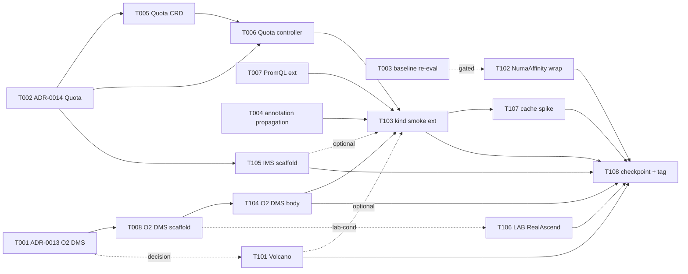

# Phase 9 Plan — M4 工程化对外 · O2 DMS Adapter + Multi-tenant Quota + Phase 8 carry-forward polish

> **Goal**: Phase 9 opens the **M4 工程化对外** milestone (arch §1.3) with
> two co-equal spines — (a) **O2 DMS Adapter** as the 北向 production
> contract per O-RAN O2 IMS R1 (arch §13 Phase 9 row HEADLINE · ADR-0013
> new) reflecting NPUSlicePool / ModelService / NPUVerticalScaler
> inventory + lifecycle through the O2 NB endpoint, and (b)
> **Multi-tenant fair scaling policy** via a new `Quota` CRD + admission
> webhook (ADR-0014 new · arch §13 review-table Phase 9 安全模型 +
> NPUSlicePool admission row) — both reading the Phase 5 NPUSliceAllocation
> substrate and Phase 8 NPUVerticalScaler.status as anchors. Phase 9
> also closes a handful of Phase 8 carry-forward items: **W1 entry
> re-evaluates K8s baseline bump** (per P8-T-002 user "stay 1.32"
> 决策 · re-WebFetch upstream + condition check + decide bump 1.34/1.35
> OR doc-only refresh + Phase 10 carry), lands the **PromQL custom
> metric extension** for NPUVerticalScaler per ADR-0012 §7 forward note
> (`spec.metric.type` 加 `PrometheusQuery` enum + Ingestor PromQL-mode
> 路径), and polishes the **deployment_builder annotation propagation**
> chain to remove the phase8/install.sh `cmd_demo_bundle_path` direct
> claim-annotation workaround (per P8-T-007/T008 carry-forward note).
> Decision-gated tracks: **Volcano binary install** (per P8-T-106 spike
> 路径 A · 1-2d) gated on Phase 9 training-job demo signal at W1
> entry, **NumaAffinity wrap upgrade** (P8-T-003 carry · closes
> known-issues #12) gated on T003 baseline-bump outcome, and the
> **IMS 7 服务剩 3 项 scaffold** per arch §13 v2 决策 (node-lifecycle /
> software-mgmt / bare-metal · api/v1alpha1 types only · controller
> bodies deferred Phase 10). Lab-conditional track: **Source.RealAscend
> body** (Phase 7 T101 + Phase 8 T105 carry · 3rd attempt) follows the
> same ADR-0011 §3 default — defer Phase 10 unless lab signal lands
> mid-W2. A docs-only **demo-backend cache pattern spike** (arch §13
> Phase 9 row · LRU → Redis/stateless evaluation) seeds the Phase 10
> implementation decision.
>
> **Duration**: ~4-5 weeks calendar (W1 foundation 8 tasks: 2 ADRs +
> baseline bump re-evaluate + deployment_builder polish + Quota CRD +
> Quota controller + PromQL extension + O2 DMS scaffold; W2 polish +
> decision-gated + IMS scaffold + lab-conditional + checkpoint 8
> tasks: Volcano conditional + NumaAffinity conditional + kind smoke
> ext + O2 DMS body + IMS 3 op scaffold + lab Source.RealAscend +
> cache spike + checkpoint).
>
> **Phase 9 uncertainty profile**: moderately higher than Phase 8 —
> multi-pronged scope (O2 DMS + Quota are independent spines · 2 ADRs
> + 2 new CRDs at W1) + 2 decision-gated tracks at W1/W2 (T003 baseline
> bump · T101 Volcano) + IMS scaffold spans 3 new operator modules (T105
> · scaffold-only mitigates risk). Lab access remains a soft 3rd per
> ADR-0011 §3 default policy carry-forward; O2 IMS R1 spec drift is the
> 4th — version lock at W1 entry (recommend R1 v04.00 unless updated).
>
> **Prereq**: Phase 8 tag `phase-8-complete` (HEAD of dev post-CI gate ·
> last commit of any P8-fix-NNN series per memory `feedback_post_tag_ci_gate.md`).
> ADR-0011 (NPU 动态切分 + Source 接口 + lab gating policy), ADR-0012
> (busy-idle 垂直伸缩 · NPUVerticalScaler CRD shape + §5 mutation model
> + §7 PromQL custom-query forward note), `docs/checkpoint-phase8.md`
> §6 Phase 9 handoff brief, `docs/research/volcano-gang-scheduling-spike.md`
> §4 cost matrix (路径 A recommended for training-job demo signal),
> `docs/research/k8s-partitionable-devices-spike.md` (KEP-4815 status ·
> Phase 8 stayed deferred · re-check W1 entry only if baseline bump
> decided in T003), and arch §1.3 Phase 路线图 (M4 工程化对外 = Phase 9
> O2 DMS + Phase 10 真实硬件对接 + 演示打磨) + arch §13 review-table
> (Phase 9 rows: O2 DMS + 多站点 cache 重构 + 安全模型 + IMS 3 项)
> are the baseline reading. Root CLAUDE.md §14 (devlog + module
> DESIGN.md) applies; `docs/agent-coordination.md` §0a.10-12 (plan/execute
> split + strict-per-task verify + push protocol) applies to every
> Phase 9 task. Per memory `feedback_plan_vs_execute_session_split.md`,
> this plan commits + stops; T001 execution is a separate session.

---

## 1. Scope summary

Phase 9 lifts seven items Phase 8 carried forward (checkpoint-phase8.md
§6 Phase 9 candidate workstreams + arch §13 Phase 9 review rows) +
opens the M4 工程化对外 spine (O2 DMS); five stay deferred to Phase 10
per arch §1.3 boundary.

| Stream                                                              | Phase 8 state                                                                                                                                                                                                                                                                                                                                                            | Phase 9 delivery                                                                                                                                                                                                                                                                                                       |
|---------------------------------------------------------------------|--------------------------------------------------------------------------------------------------------------------------------------------------------------------------------------------------------------------------------------------------------------------------------------------------------------------------------------------------------------------------|------------------------------------------------------------------------------------------------------------------------------------------------------------------------------------------------------------------------------------------------------------------------------------------------------------------------|
| **O2 DMS Adapter (arch §13 Phase 9 row HEADLINE · M4 spine)**       | architecture L5 仅预留接口 · 无 module + 无 ADR                                                                                                                                                                                                                                                                                                                          | NEW `operators/o2-dms-adapter/` module + ADR-0013 (K8s Profile · O2 IMS R1 v04.00 lock · 北向 NB shape · resource inventory reflection from Phase 3-8 substrate + lifecycle API · authn 占位 Phase 10 polish · T008 scaffold + T104 body)                                                                              |
| **Multi-tenant Quota + fair scaling (arch §13 Phase 9 安全模型 spine)** | Phase 8 NPUVerticalScaler.status.scaleHistory + status.lastScaleTime 已为 multi-tenant 提供数据 (P8-T-007) · 但无 Quota CRD + admission policy                                                                                                                                                                                                                          | NEW `Quota` CRD (`ocloud.edge.example.com/v1alpha1` · cluster + namespace scope) + ADR-0014 + admission webhook · 限定 per-namespace slice quota (max NPUSliceAllocation count) + per-namespace scaling rate cap (max scale events / window) · 读 Phase 5 NPUSliceAllocation + Phase 8 NPUVerticalScaler.status (T005+T006) |
| **K8s baseline bump 1.32 → 1.34/1.35 re-evaluate (P8-T-002 carry)** | stayed 1.32 (用户 chat 2026-05-21 决策) · sched-plugins v0.35+/v0.36+ 未发布 + kindest/node v1.36 不存在 双重 lag                                                                                                                                                                                                                                                       | T003 W1 entry re-WebFetch · 若条件 (sched-plugins v0.35+/v0.36+ released AND kindest/node v1.34+/v1.35+/v1.36+ released) 任一对齐 → 单 coordinated bump · 否则 doc-only refresh + carry Phase 10。Default = doc-only fallback per P3 conservative                                                                                                          |
| **NumaAffinity wrap upgrade (P8-T-003 carry · known-issues #12)**   | OPEN · gated on baseline bump (apimachinery v0.32.7+ packages 缺失 + sched-plugins v0.35+ 未发布)                                                                                                                                                                                                                                                                          | T102 [DECISION-GATED]: 若 T003 baseline bumped AND sched-plugins v0.35+/v0.36+ 满足 → wrap upgrade body + 3 sanity tests + chart toggle default flip + closes #12 · 否则 maintained OPEN · Phase 10 carry                                                                                                                       |
| **PromQL custom metric extension (ADR-0012 §7 forward)**             | NPUVerticalScaler.spec.metric.type = NPUUtilization built-in only · Ingestor PrometheusIngestor 通过 hardcoded PromQL `avg_over_time(ascend_npu_utilization_percent{...}[$window])`                                                                                                                                                                                       | T007: NPUVerticalScaler.spec.metric.type 加 `PrometheusQuery` enum + spec.metric.prometheusQuery string 字段 · Ingestor 加 PromQL-mode 路径 (任意 PromQL query 返回 scalar) · NPUUtilization 保留为 default · 2 test cases + ADR-0012 §7 status flip                                                                                  |
| **deployment_builder annotation propagation (P8-T-007/T008 carry)** | install.sh `cmd_demo_bundle_path` 直接给 ResourceClaim 写 `npu.huawei.com/slice-template` annotation 作 demo workaround · 因为 ModelService → Pod label propagation chain 当时未实现                                                                                                                                                                                       | T004: deployment_builder reads ModelService.metadata.annotations[`npu.huawei.com/slice-template`] (由 NPUVerticalScaler T007 写入) → propagate 到 Pod label `npu.huawei.com/slice-template=<value>` · removes install.sh `cmd_demo_bundle_path` workaround · 1-2 deployment_builder test cases + kind smoke install.sh slim down |
| **Volcano gang-scheduling 引入 (P8-T-106 spike 路径 A)**             | docs-only spike landed (P8-T-106 · `docs/research/volcano-gang-scheduling-spike.md`) · 6 sections + Phase 9 cost matrix · 路径 A 1-2d 推荐                                                                                                                                                                                                                                  | T101 [DECISION-GATED]: 若 W1 entry user signal "Phase 9 training-job demo 需要 gang" → install Volcano binary (独立 helm · v1.10.x+) + 训练 Pod opt-in via `schedulerName=volcano` + PodGroup atomicity · npu-scheduler 继续 own NPU device 级 · 默认 fallback = defer Phase 10+                                                          |
| **IMS 7 服务剩 3 项 scaffold (arch §13 v2 决策 · P9-T-IMS-{1,2,3})**  | none — Phase 9 待落 per ADR-0003 v2 Accepted (2026-05-18)                                                                                                                                                                                                                                                                                                                | T105 scaffold 3 个新 operator modules api/v1alpha1 types only: `operators/node-lifecycle-operator/` + `operators/software-mgmt-operator/` + `operators/bare-metal-provisioning-operator/` · 参考 StarlingX · controller bodies + helm + 真 reconcile loops deferred Phase 10 per CLAUDE.md §14.2 scaffold pattern              |
| **[LAB-CONDITIONAL] Source.RealAscend body (P7-T-101 + P8-T-105 carry · 3rd attempt)** | Phase 10 default per ADR-0011 §3 (no lab signal in Phase 8 W2 entry chat 2026-05-21) · 2 prior carries (P7-T-101 + P8-T-105 各 3-line devlog)                                                                                                                                                                                                                              | T106 [LAB-CONDITIONAL]: 同 gating policy · 若 W2 entry user signal "lab access available" → npu-smi real-binary call + ResourceSlice attribute populate + real ModelService deployment + PD-pair placement hard-assertion · 否则 default = 4th carry Phase 10 + 3-line devlog                                                          |
| **demo-backend cache pattern spike (arch §13 Phase 9 row)**          | LRU 进程内 cache (Phase 4 T007 实现) · 单实例 stateful · multi-site Phase 10 演示场景 需 stateless 或 Redis-backed                                                                                                                                                                                                                                                          | T107 docs-only spike: 评估 3 路径 (Redis-backed shared cache · stateless dispatch + per-request fetch · in-cluster singleton) · cost / consistency / failure-mode matrix · ADR draft outline for Phase 10 implementation 决策                                                                                                                       |

**Out of scope (Phase 10+)**:
- **Karmada multi-site federation 完整实施** — Phase 10 (Phase 9 ships
  Quota CRD substrate + O2 DMS NB · Karmada policy-controller +
  PropagationPolicy + cross-cluster RBAC deferred · arch §9.3 多站点
  row)
- **Real lab full multi-pool / multi-tenant 演示打磨** — Phase 10 per
  arch §1.3 (T106 single-modelservice + PD-pair smoke is the same
  scope as Phase 7/8 lab body had it landed · 不是 multi-pool 演示)
- **Partitionable Devices Beta + partition-aware allocator (P8-T-101+T102 carry)**
  — Phase 10 IFF Phase 9 W1 T003 decided bump · 否则 carry Phase 11+ (KEP-4815
  GA timing still unconfirmed at Phase 8 W2)
- **vllm-ascend ProxyImage chart default flip (P8-T-004 carry · known-issues #13)**
  — Phase 10 demo polish (路径 = ADD chart `defaults.proxyImage` value
  field + template wiring + docker pull verify + GHA CI image-pull
  cache mount + 1 effectiveProxyImage 单元测试)
- **Live migration of HCCL ranks / per-Pod RDMA bandwidth quota** —
  CNI-level gaps per `docs/cni-hccl-research.md` §5 · Phase 8 重启切片
  sidesteps · live migration Phase 11+ if at all
- **IMS 3 项 controller bodies + reconcile loops** — Phase 10 (T105
  scaffold-only Phase 9 per CLAUDE.md §14.2 scaffold pattern)
- **demo-backend cache implementation** — Phase 10 (T107 spike-only
  Phase 9 informs ADR + 路径 选择)
- **Karmada RBAC 联动** (arch §13 Phase 9 安全模型 row 子项) — Phase 10
  follow-on (Phase 9 ships Quota CRD + admission · Karmada cross-cluster
  RBAC 联动 deferred)
- **Fabric discovery via LLDP / SONiC API** — defer per ADR-0007 +
  ADR-0010 §229 to Phase 10+ on real switching gear
- **Demo frontend page extension for Quota visualisation / O2 DMS endpoint
  surface / NPUVerticalScaler scaleHistory display** — Phase 10 polish
  (Phase 9 backend ships substrate; frontend gradually catches up per
  Phase 6 T102/T103 chat+ADR self-RFC pattern if needed mid-W2)

---

## 2. Task package overview (16 tasks)

```
W1 Foundation (8 tasks · 2 ADRs + baseline bump re-eval + deployment_builder polish + Quota CRD + Quota controller + PromQL ext + O2 DMS scaffold)
├── P9-T-001  ADR-0013 — O2 DMS Adapter design (K8s Profile · O2 IMS R1 v04.00 lock · 北向 NB shape · resource reflection 路径 · authn placeholder Phase 10)
├── P9-T-002  ADR-0014 — Multi-tenant Quota + fair scaling design (Quota CRD shape + admission policy + enforcement scope + per-tenant rate cap algo + 与 NPUVerticalScaler 协同)
├── P9-T-003  K8s baseline bump re-evaluate (W1 entry decision · re-WebFetch upstream + condition check · single coordinated bump OR doc-only refresh + Phase 10 carry)
├── P9-T-004  deployment_builder annotation → Pod label propagation polish (P8-T-007/T008 carry · removes phase8/install.sh cmd_demo_bundle_path workaround)
├── P9-T-005  Quota CRD types + scheme + samples (cluster-scope + namespace-scope · enforcement.maxSliceAllocations + enforcement.maxScaleEventsPerWindow + status.usage + 4 round-trip tests)
├── P9-T-006  Quota controller + admission webhook body (ValidatingAdmissionWebhook on NPUSliceAllocation create + ValidatingAdmissionWebhook on NPUVerticalScaler patch-spec · enforces per ADR-0014 §5)
├── P9-T-007  PromQL custom metric extension (NPUVerticalScaler.spec.metric.type 加 PrometheusQuery enum + Ingestor PromQL-mode 路径 + 2 tests + ADR-0012 §7 status flip)
└── P9-T-008  O2 DMS Adapter scaffold (new module operators/o2-dms-adapter/ · K8s Profile NB · HTTP REST scaffold + inventory reflection stub + lifecycle endpoint stub + DESIGN.md skeleton)

W2 Polish + decision-gated + IMS scaffold + lab-conditional + checkpoint (8 tasks)
├── P9-T-101  [DECISION-GATED] Volcano binary install (per P8-T-106 spike 路径 A · install Volcano v1.10.x+ via独立 helm + 训练 Pod opt-in PodGroup atomicity · gated on W1 entry training-job demo signal)
├── P9-T-102  [DECISION-GATED] NumaAffinity wrap upgrade (P8-T-003 carry · gated on T003 baseline-bump outcome AND sched-plugins v0.35+/v0.36+ availability · closes known-issues #12 if landed)
├── P9-T-103  kind smoke E2E Phase 9 extension (Quota admission + O2 DMS endpoint live + Volcano gang conditional + NumaAffinity active conditional + IMS scaffold smoke)
├── P9-T-104  O2 DMS Adapter inventory reflection + lifecycle body (REST handlers + reads NPUSlicePool / ModelService / NPUVerticalScaler · NB endpoint · 4-6 handler tests + DESIGN.md §3)
├── P9-T-105  IMS 7 服务剩 3 项 scaffold (3 new operator modules api/v1alpha1 types only · node-lifecycle-operator + software-mgmt-operator + bare-metal-provisioning-operator · 参考 StarlingX · controller bodies → Phase 10)
├── P9-T-106  [LAB-CONDITIONAL] Source.RealAscend body (P7-T-101 + P8-T-105 carry · 3rd attempt · same gating policy as P8-T-105)
├── P9-T-107  demo-backend cache pattern spike (arch §13 Phase 9 row · LRU → Redis/stateless 3 路径 evaluation · ADR-0015 draft outline for Phase 10 决策)
└── P9-T-108  Phase 9 checkpoint + tag phase-9-complete
```

Mermaid:



**Subagent parallelisation candidates** (per §0a.11 strict-verify — ONE
subagent at a time, main agent verifies before next is dispatched;
parallelisation is OPPORTUNISTIC across natural module boundaries
when user gives explicit "batch" cue):
- T001 + T002 (docs-only ADRs) standalone — no code dependency · 不同
  文档可 parallel if user 显式 batch
- T003 (baseline bump · cross-module if full bump path) MUST main-agent
  serial per §0a.11 (cross-module 共享契约 spirit)
- T004 (inference-operator deployment_builder polish) parallel-eligible
  with T008 (new module o2-dms-adapter scaffold) — different modules
- T005 (new Quota CRD · `ocloud.edge.example.com/v1alpha1` 选址决策详
  T002 ADR) → T006 (controller) sequential same module
- T007 (NPUVerticalScaler.spec extension · inference-operator) — same
  module as T005/T006 but different file path · serial post-T005 for
  CRD generation order safety
- T105 (3 new operator modules scaffold) standalone — independent new
  modules · can run any time post-T002 ADR
- T107 (docs-only spike) standalone

**Decision-gated tracks**:

- **T003 baseline bump re-evaluate** (W1 entry decision · main agent
  re-WebFetch + condition check):
  - Conditions: sched-plugins v0.35+/v0.36+ released AND kindest/node
    v1.34+/v1.35+/v1.36+ released AND no major apimachinery API drift
    surfacing risk
  - Default = doc-only refresh + Phase 10 carry per P3 conservative ·
    re-WebFetch outcome documented in devlog
  - Decides whether T102 NumaAffinity wrap upgrade lights up at W2

- **T101 Volcano gang-scheduling** (W1 entry decision · user signal):
  - User signal "Phase 9 training-job demo 需要 gang" → install Volcano
    binary 路径 A · 1-2d 工作量 · 在 Phase 9 calendar 内可吸收
  - User signal "Phase 9 只 inference 演进 · 不引入训练" → defer Phase
    10+ · 路径 C · 0d 工作量 · T101 marked deferred
  - 无明确信号 (default) → defer Phase 10+ · 同 lab gating spirit
  - T101 deferred → T103 kind smoke Volcano gang section skipped ·
    无下游 cascade (npu-scheduler 继续 own NPU device 级)

- **T102 NumaAffinity wrap upgrade** (gated on T003 outcome):
  - T003 baseline bumped AND sched-plugins v0.35+/v0.36+ available →
    wrap upgrade body + chart toggle default flip + 3 sanity tests +
    closes known-issues #12
  - T003 doc-only refresh (default fallback) → T102 auto-deferred ·
    known-issues #12 maintained OPEN

**LAB-conditional track (T106)**:
- Triggered ONLY when user signals "lab access available" mid-W2 in
  chat — same gating as P7-T-101 + P8-T-105 per ADR-0011 §3 default
  policy
- Phase 9 ships without this if lab not available → T106 moves to
  Phase 10 backlog (4th carry · cumulative deferral count documented
  in devlog)

**§0a.5 chat+ADR self-RFC pattern continues** — Phase 9 introduces 2
ADR additions (ADR-0013 O2 DMS · ADR-0014 Quota) + 1 ADR draft outline
(ADR-0015 demo-backend cache via T107) + several existing-ADR small
edits (ADR-0011 §3 lab gating count update via T106 devlog · ADR-0012
§7 PromQL forward note status flip via T007 · ADR-0010 §7 Volcano
forward note status flip via T101 if landed · ADR-0009 §4 Partitionable
Devices forward note refresh per T003 outcome). If a `docs/api-contract.yaml`
change surfaces during Phase 9 W2 (e.g. "expose O2 DMS NB endpoint /api/v1/o2/dms/...
on demo-backend for cross-cluster preview · frontend Workload page
extension"), it follows the same Phase 6 T102/T103 chat+ADR self-RFC
pattern via §0a.5.

---

## 3. W1 task packages

### P9-T-001 ADR-0013 — O2 DMS Adapter design (K8s Profile · O2 IMS R1)

Owner: docs (no code).

**Allowed Paths**:
- `docs/adr/0013-o2-dms-adapter.md` (new — O2 DMS Adapter design + K8s Profile per O-RAN O2 IMS R1 v04.00 lock + 北向 NB shape (HTTP REST endpoint set) + resource inventory reflection 路径 (NPUSlicePool / ModelService / NPUVerticalScaler / NPUSliceAllocation) + lifecycle API (Create / Get / List / Delete on inventory primitives — mapped to underlying CRD ops) + authn/z 占位 + Phase 10 polish forward notes)
- `docs/architecture.md` (small edit — §13 review-table Phase 9 row promoted from "candidate" → "in flight via ADR-0013"; §1.3 phase roadmap unchanged; §5.0 模块划分 加 `operators/o2-dms-adapter/` 行)
- `docs/adr/0003-ims-services-phasing.md` (small edit — §1 IMS 7 services 映射表 加 "O2 DMS NB 与 IMS Core 关系" 段 cross-ref ADR-0013 + ADR-0003 v2 IMS 3 项 scaffold T105 forward ref)
- `docs/adr/0001-phase0-key-decisions.md` (small edit if needed — §对外接口 row cross-ref ADR-0013)

Acceptance:
- ADR §1 Context: cites Phase 8 checkpoint §6 Phase 9 candidate workstream #3 + arch §1.3 M4 工程化对外 Phase 9 row + arch §13 Phase 9 O2 DMS 风险行 (O-RAN O2 规范持续演进 · 锁定一个版本如 O2 IMS R1) + O-RAN ALLIANCE WG6 "O2 IMS Interface Spec R1 v04.00" 引用 (version lock 至 v04.00 unless re-WebFetch at T001 entry shows higher Released)
- §2 Decision A (Profile choice): commit to **K8s Profile** (per arch §1.3 + ADR-0001 v3 双轨 spirit) — O2 DMS adapter exposes K8s-native primitives to North-bound · 不 emit OpenStack profile · 不重新实现 Helm profile · 单 Profile keeps Phase 9 scope tractable
- §2 Decision B (NB endpoint shape): HTTP REST per O2 IMS R1 §3.1 NB 接口 contract — endpoint base path `/o2dms/v1/...` + resource collections (`deploymentManagers` · `deploymentItems` · `lifecycleOperations` · `inventory`) · OpenAPI doc generated alongside Phase 9 W2 T104 body landing · auth header place-holder (Phase 10 polish)
- §2 Decision C (Resource reflection 映射): O2 IMS R1 `deploymentItem` ←→ ocloud `ModelService` (Phase 5+) · O2 IMS R1 `infrastructureInventory` ←→ aggregated view over NPUSlicePool + Node + NPU + NPUSliceAllocation (Phase 3-5) · O2 IMS R1 `deploymentManager` ←→ K8s cluster (single-cluster Phase 9 · multi-cluster Phase 10 with Karmada) · 映射表 6-8 rows
- §2 Decision D (Implementation 方式): NEW operator module `operators/o2-dms-adapter/` · standalone binary · reads K8s 资源 via informer/lister (no direct write to CRD substrate — read-only NB in Phase 9 + lifecycle ops via underlying inference-operator/pool-operator CRD write through controller chain) · helm chart `deploy/helm-charts/o2-dms-adapter/` ships
- §3 Consequences: Phase 9 ships read + lifecycle (Create ModelService through O2 NB · Get/List inventory · Delete ModelService) · Phase 10 polish adds (a) multi-cluster via Karmada policy · (b) authn/z full implementation · (c) frontend Workload 页面 surface O2 DMS endpoint indicator · (d) RBAC 集成 per arch §13 安全模型 row
- §4 NB endpoint catalog (table form):
  - `POST /o2dms/v1/deploymentItems` — Create ModelService via O2 NB shape (validates against ModelService CRD schema + applies)
  - `GET /o2dms/v1/deploymentItems` — List ModelServices (cluster-scoped, Phase 9 single-cluster)
  - `GET /o2dms/v1/deploymentItems/{id}` — Get ModelService by O2 id
  - `DELETE /o2dms/v1/deploymentItems/{id}` — Delete ModelService (cascade to Deployment via inference-operator)
  - `GET /o2dms/v1/inventory` — Aggregated inventory (NPUSlicePool + Node + NPU + allocations)
  - `GET /o2dms/v1/deploymentManagers` — Cluster manager metadata (single entry Phase 9)
  - `GET /o2dms/v1/lifecycleOperations/{id}` — Pending / running / completed ops queue
- §5 Open questions: (a) O2 IMS R1 v05.00 release timing — re-WebFetch at T001 entry; if newer minor lands by T001 entry, evaluate impact + lock at v04.00 if breaking · (b) cross-cluster propagation — Phase 10 with Karmada; Phase 9 single-cluster is acceptable demo · (c) authn header convention — Phase 9 placeholder `Authorization: Bearer <static-token>` env-var · Phase 10 full RBAC + OIDC · (d) NB OpenAPI vs CRD OpenAPI duplication — generated alongside; CRD remains authoritative for backend storage
- §6 Forward notes: Phase 10 polish layers · Phase 11+ federation; references arch §1.3 + ADR-0003 v2 + ADR-0014 (Quota CRD admission applies to O2 NB-injected ModelServices — enforcement happens at K8s API server level, not at NB level)

Dependencies: none beyond `phase-8-complete`.

Estimated effort: 0.5d.

---

### P9-T-002 ADR-0014 — Multi-tenant Quota + fair scaling policy design

Owner: docs (no code).

**Allowed Paths**:
- `docs/adr/0014-multi-tenant-quota.md` (new — Quota CRD shape + admission policy + enforcement scope + per-tenant rate cap algo + integration with NPUVerticalScaler.status (P8-T-007) + NPUSliceAllocation (P5-T-004) + relationship to K8s ResourceQuota (orthogonal — Quota CRD is NPU-aware; K8s ResourceQuota is generic))
- `docs/architecture.md` (small edit — §6.7 multi-tenancy section 升 "Phase 9 ADR-0014 lands Quota CRD + admission" status + §13 review-table Phase 9 安全模型 row promoted from "Phase 9 启动前完整安全设计" → "in flight via ADR-0014")
- `docs/adr/0012-busy-idle-vertical-scaler.md` (small edit — §3 Consequences 加 "Phase 9 multi-tenant fair scaling reads NPUVerticalScaler.status to coordinate" cross-ref ADR-0014 §5 enforcement · §7 forward notes update flips "Phase 9 fair scaling policy" 行 status)
- `docs/adr/0009-npu-dra-driver.md` (small edit — §6.4 migration table 加 "Phase 9 Quota CRD admission validates NPUSliceAllocation create" 行 cross-ref ADR-0014)
- `docs/adr/0011-npu-dynamic-slicing-and-source-interface.md` (small edit — §1 後果 row 加 Quota CRD substrate interaction cross-ref)

Acceptance:
- ADR §1 Context: cites Phase 8 checkpoint §6 Phase 9 candidate workstream #2 + arch §6.7 multi-tenancy section + arch §13 Phase 9 安全模型 row + Phase 5 NPUSliceAllocation substrate + Phase 8 NPUVerticalScaler.status.scaleHistory data feed
- §2 Decision A (Scope unit): Quota CRD enforces at **namespace scope** (matches K8s ResourceQuota mental model) · cluster-scope Quota 可选用于 cluster-level cap · Phase 9 ships **namespace-scope only** · cluster-scope Phase 10
- §2 Decision B (Quota CRD shape): `apiVersion: ocloud.edge.example.com/v1alpha1`, `kind: Quota`, **namespace-scoped** · `spec.enforcement.maxSliceAllocations int32` · `spec.enforcement.maxScaleEventsPerWindow { count int32, windowSeconds int32 }` · `spec.enforcement.maxNPUSliceTemplateRefs []string` (whitelist · optional) · `status.usage.currentSliceAllocations int32` · `status.usage.scaleEventsInWindow int32` · `status.lastSyncTime metav1.Time` · printer columns: MaxAllocations / Used / MaxScaleEvents / ScaleEventsWindow
- §2 Decision C (Enforcement points): TWO ValidatingAdmissionWebhooks register on the Quota controller binary (separate from inference-operator binary — colocated for Phase 9 simplicity in `operators/quota-controller/` new module OR colocated with inference-operator per cost/maintenance trade-off — choose at T002 ADR · default = colocated with inference-operator binary for Phase 9 simplicity):
  - Webhook A: `NPUSliceAllocation` create → check `quota.usage.currentSliceAllocations + 1 ≤ quota.spec.enforcement.maxSliceAllocations` · reject if exceeds
  - Webhook B: `NPUVerticalScaler` patch on `spec.scaleSlice.{busy,idle}TemplateName` (Phase 8 mutation model) → check `quota.usage.scaleEventsInWindow + 1 ≤ quota.spec.enforcement.maxScaleEventsPerWindow.count` within `windowSeconds` · reject if exceeds
- §2 Decision D (Status sync): Quota controller watches NPUSliceAllocation + NPUVerticalScaler.status.scaleHistory · 60s tick syncs `status.usage` · 比 admission webhook 频率低 · admission webhook 用 in-memory cache + Get fallback to avoid stale-read on burst
- §3 Consequences: Phase 9 namespace-scope only · cluster-scope Phase 10 · Karmada cross-cluster Quota aggregation Phase 10+ · enforcement is `Deny` (Reject mode · 不 dry-run · Phase 9 stays strict) · scale event rate cap uses sliding-window count (not token-bucket — count simpler for Phase 9 demo · token-bucket Phase 10 polish if needed)
- §4 CRD schema: per §2 Decision B
- §5 Enforcement contract: full admission webhook contract (request match · failurePolicy=Fail · timeoutSeconds=5 · sideEffects=None · matchPolicy=Equivalent · cert-manager 依赖 已存在 Phase 5 P5-T-101 carry-forward · 重用同一 cert · 或独立 cert by webhook · 决策 = 重用 inference-operator webhook cert if colocated)
- §6 Open questions: (a) colocated vs new binary — default colocated · re-eval at T006 if维护成本高 · (b) cluster-scope Phase 10 path — additive (new CRD `kind: ClusterQuota` · 或 cluster-scope flag on Quota CRD) · (c) Karmada propagation Phase 10 · (d) frontend Quota usage 可视化 Phase 10+ polish if needed
- §7 Forward notes: Phase 10 cluster-scope + Karmada propagation + token-bucket option + frontend visualisation; references arch §6.7 + ADR-0011 §1 後果 row + ADR-0012 §3+§7 + ADR-0009 §6.4 + arch §13 Phase 9 安全模型 row

Dependencies: none beyond `phase-8-complete`. T002 can run in parallel with T001 per §0a.11 (docs-only · main agent verifies separately).

Estimated effort: 0.5d.

---

### P9-T-003 K8s baseline bump re-evaluate (P8-T-002 carry)

Owner: operators + deploy (cross-module · main-agent串行 per §0a.11 IF bump path · main-agent solo if doc-only).

**Decision needed at task entry (T003 start)**:
- Re-WebFetch upstream condition table:
  - `kindest/node` releases: https://github.com/kubernetes-sigs/kind/releases — check v1.34+/v1.35+/v1.36+ image tags
  - `scheduler-plugins`: https://github.com/kubernetes-sigs/scheduler-plugins/releases — check v0.35.x / v0.36.x GA tags
  - `apimachinery` v0.34.x+/v0.35.x+/v0.36.x+ — check `pkg/api/{safe,operation,validate}` package availability per known-issues #12 root cause
- Decision branches:
  - **Bump 1.34** (recommended if v1.34 kindest/node + sched-plugins v0.34.x GA both present): 单 coordinated bump · 同 P8-T-002 plan §3 模式 + T102 NumaAffinity wrap upgrade lights up at W2
  - **Bump 1.35** (recommended if v1.35 released cleanly + sched-plugins v0.35.x GA): 同上 · 1 minor 更高
  - **Bump 1.36** (recommended if v1.36 image released cleanly + sched-plugins v0.36.x GA + Partitionable Devices Beta 仍 stable per re-WebFetch): 同 P8-T-002 original target · 但 P8-T-101/T102 Partitionable Devices Beta 重新 evaluate (Phase 10 carry default per P8 conservative · 但 Phase 9 W1 entry 可重新拍板)
  - **Doc-only refresh** (fallback per P3 conservative · default unless upstream conditions clearly aligned): ADR-0010 §1 + known-issues #12 + #13 status refresh with re-WebFetch date + Phase 10 carry note · no go.mod / kindest/node change
- Default decision: **Doc-only refresh** unless re-WebFetch shows BOTH (kindest/node ≥1.34 released stable AND sched-plugins ≥v0.34.x GA released)

**Allowed Paths (bump path · same as P8-T-002 plan §3 Allowed Paths)**:
- `go.mod` + `go.sum` (root or per-module — repo layout decides)
- `operators/npu-dra-driver/go.mod` + `go.sum`
- `operators/inference-operator/go.mod` + `go.sum`
- `operators/scheduler-plugin/go.mod` + `go.sum`
- `operators/pool-operator/go.mod` + `go.sum`
- `exporters/ascend-npu-exporter-plus/go.mod` + `go.sum`
- `backend/go.mod` + `go.sum`
- `tests/e2e/kind/kind-config.yaml` (kindest/node image bump)
- `tests/e2e/kind/phase{5,6,7,8}/install.sh` (kubectl version pin if any)
- `deploy/helm-charts/*/Chart.yaml` (kubeVersion range bump)
- `.github/workflows/e2e-kind.yml` (kindest/node image bump in matrix)
- `.github/workflows/ci.yml` (Go version + kubectl pins)
- `Makefile` (if Go / kubectl version referenced)
- `docs/adr/0010-scheduler-plugin.md` (small edit — §1 baseline bump note + §3 NumaAffinity status refresh "post-bump unblocked at Phase 9 T003")
- `docs/known-issues.md` (#12 NumaAffinity entry status flip RESOLVED with commit SHA · #13 ProxyImage entry refresh)
- `docs/devlog/phase-9-t003.md`

**Allowed Paths (doc-only refresh fallback)**:
- `docs/adr/0010-scheduler-plugin.md` (small edit — §1 add 2026-XX-XX P9-T-003 update segment with re-WebFetch outcome + condition table snapshot)
- `docs/known-issues.md` (#12 entry: status header refresh with new re-eval date + Phase 10 carry note · #13 entry: refresh with new re-eval date · no resolution flip)
- `docs/devlog/phase-9-t003.md` (records re-WebFetch outcome + decision rationale + Phase 10 re-eval forward note)

**Forbidden Paths**:
- `docs/api-contract.yaml` (no API change in baseline bump)
- `configs/mock-data/**` (no mock data schema change)
- Source code outside `go.mod` / `go.sum` (any source change must be SEPARATE post-bump task — T102 NumaAffinity wrap is the explicit post-bump task in W2)

Acceptance (bump path · mirror P8-T-002 §3 acceptance):
- All go.mod files updated to target K8s minor in lockstep (no version skew)
- `go mod tidy` clean in every module
- `go build ./...` clean in every module
- `go vet ./...` clean in every module
- `go test ./...` PASS in every module (no test regression)
- `helm lint --strict` clean across all charts post-kubeVersion bump
- `helm template` renders cleanly against target schema
- kind smoke installs against new kindest/node image without error
- All Phase 5/6/7/8 kind smoke E2E phases re-run + PASS against new baseline
- Devlog enumerates: target K8s minor decision + transitive dep changes + any temporary workaround (escalate via chat if 2d budget breached)
- ADR-0010 §1 + §3 refresh + known-issues #12 RESOLVED with cross-ref + #13 status note

Acceptance (doc-only refresh path):
- ADR-0010 §1 update segment lands with re-WebFetch date + condition table snapshot
- known-issues #12 + #13 status header refresh with new re-eval date
- Devlog records re-WebFetch outcome + decision rationale
- No code change · no `go.mod` modification · CI no-op

Dependencies: T001 + T002 (ADRs land first per natural order · T003 technically independent but main agent batches W1 ADR session per §0a.10).

Estimated effort: 0.3d (doc-only fallback) or 1-2d (bump path · same P8 budget).

---

### P9-T-004 deployment_builder annotation propagation polish (P8-T-007/T008 carry)

Owner: operators/inference-operator (deployment_builder body extension · removes phase8/install.sh workaround).

**Allowed Paths**:
- `operators/inference-operator/internal/controller/deployment_builder.go` (extend — when building Pod template from ModelService, read `ms.Annotations["npu.huawei.com/slice-template"]` and propagate to Pod.Spec.Template.Labels[`npu.huawei.com/slice-template`] · honour explicit Pod label override if set on ModelService.Spec.Template.Labels)
- `operators/inference-operator/internal/controller/deployment_builder_test.go` (extend with 2 new test cases · propagation present + propagation absent + explicit label override)
- `operators/inference-operator/internal/controller/modelservice_controller_test.go` (small edit if Reconcile-level integration test needs propagation assertion · likely 1 new case)
- `tests/e2e/kind/phase8/install.sh` (small edit — remove `cmd_demo_bundle_path` direct `kubectl annotate resourceclaim` workaround · validate kind smoke still passes assert.sh thanks to natural propagation chain)
- `tests/e2e/kind/phase8/install.sh.example` or inline comment (if helpful · documenting the removal rationale and the natural chain)
- `operators/inference-operator/DESIGN.md` (small edit — §5.0.2 deployment_builder section + or new §5.0.3 "Annotation → Label propagation chain" sub-section)
- `docs/devlog/phase-9-t004.md`

**Forbidden Paths**:
- `operators/inference-operator/api/v1alpha1/` (no CRD change)
- `operators/inference-operator/internal/metrics/` (no ingestor change)
- `operators/inference-operator/internal/controller/npuverticalscaler_controller.go` (NPUVerticalScaler controller frozen by P8-T-007 · T004 reads annotation written by P8-T-007 but doesn't modify P8-T-007 path)
- `operators/npu-dra-driver/**` (T008 wiring frozen by P8-T-008 · T004 produces Pod label that P8-T-008 wiring consumes)

Acceptance:
- `go build ./operators/inference-operator/...` clean
- `go test ./operators/inference-operator/internal/controller/...` PASS — 2+1 new cases + P5/6/7/8 51+ controller tests preserved (no regression)
- Propagation observable: deployment_builder Pod template's `metadata.labels["npu.huawei.com/slice-template"]` matches ModelService.Annotations["npu.huawei.com/slice-template"] when ms has the annotation set · empty when absent
- kind smoke phase8 STILL passes assert.sh after install.sh workaround removed (4 hard + 2 SKIPPED assertions preserved · slice-template propagation chain now end-to-end natural · no manual annotate step)
- DESIGN.md §5.0.2 or §5.0.3 lands with propagation chain diagram (NPUVerticalScaler → ModelService.Annotation → Deployment Pod template label → claim_controller label lookup)

Dependencies: none beyond `phase-8-complete` (T004 doesn't depend on Phase 9 W1 other tasks · 但 main agent serial per §0a.11 within W1).

Estimated effort: 0.5d.

---

### P9-T-005 Quota CRD types + scheme + samples

Owner: operators/inference-operator (api/v1alpha1 extension · colocated per ADR-0014 §2 Decision C default) OR new module `operators/quota-controller/` (if T002 ADR chose new-binary path).

**Allowed Paths** (colocated path · default):
- `operators/inference-operator/api/v1alpha1/quota_types.go` (new — Quota + QuotaSpec + QuotaEnforcement + QuotaStatus + QuotaUsage + nested types per ADR-0014 §4)
- `operators/inference-operator/api/v1alpha1/groupversion_info.go` (small edit — `SchemeBuilder.Register(&Quota{}, &QuotaList{})`)
- `operators/inference-operator/api/v1alpha1/zz_generated.deepcopy.go` (regenerated via `make generate`)
- `operators/inference-operator/api/v1alpha1/quota_types_test.go` (new — 4 round-trip + DeepCopy + omitempty + enum-pin cases · mirror P8-T-005 NPUVerticalScaler test pattern)
- `operators/inference-operator/config/crd/bases/ocloud.edge.example.com_quotas.yaml` (generated via `make manifests`)
- `operators/inference-operator/config/samples/ocloud_v1alpha1_quota.yaml` (new — 1 sample namespace-scoped Quota targeting "default" namespace · maxSliceAllocations=8 · maxScaleEventsPerWindow{count=5, windowSeconds=3600})
- `deploy/helm-charts/inference-operator/crds/quota.yaml` (chart bundle · generated)
- `operators/inference-operator/PROJECT` (small edit if kubebuilder PROJECT tracks resources)
- `docs/devlog/phase-9-t005.md`

**Allowed Paths** (new-binary path · re-eval at T002 ADR if chosen):
- Replace `operators/inference-operator/api/v1alpha1/` paths above with `operators/quota-controller/api/v1alpha1/` paths
- Plus `operators/quota-controller/PROJECT` + scaffold per kubebuilder

**Forbidden Paths**:
- `operators/inference-operator/internal/controller/` (controller body lands in T006 · not T005 scope)
- `operators/inference-operator/internal/webhook/` (admission webhook lands in T006)

Acceptance:
- Types compile: `go build ./operators/inference-operator/api/...` clean
- DeepCopy regenerates clean (no stale `zz_generated.deepcopy.go` drift)
- Round-trip tests pass: `go test ./operators/inference-operator/api/v1alpha1/... -run TestQuota` 4 cases
- `make manifests` clean (CRD yaml regenerates idempotently)
- Sample applies clean against cluster with stubbed admission: `kubectl --dry-run=client apply -f config/samples/ocloud_v1alpha1_quota.yaml`
- P5/6/7/8 inference-operator tests preserved: `go test ./operators/inference-operator/...` no regression on existing 51+ controller + 4 ModelService api + 4 NPUVerticalScaler api + 11 metrics + 18 webhook (per Phase 8 P8-T-005+T007 inventory)
- CRD schema fields per ADR-0014 §4:
  - `spec.enforcement.maxSliceAllocations` int32 (default 0 = unbounded)
  - `spec.enforcement.maxScaleEventsPerWindow` { count int32 (default 0 = unbounded), windowSeconds int32 (default 3600) }
  - `spec.enforcement.maxNPUSliceTemplateRefs` []string (optional whitelist · default empty = all allowed)
  - `status.conditions` []metav1.Condition (Active, EnforcementOK)
  - `status.usage.currentSliceAllocations` int32
  - `status.usage.scaleEventsInWindow` int32
  - `status.lastSyncTime` *metav1.Time
- Printer columns kubebuilder markers: MaxAllocations / Used / MaxScaleEvents / ScaleEventsWindow / Status

Dependencies: T002 (ADR-0014 schema decision).

Estimated effort: 0.5d.

---

### P9-T-006 Quota controller + admission webhook body

Owner: operators/inference-operator (controller body + webhook · consumes T005 CRD + ADR-0014 §5 enforcement contract).

**Allowed Paths**:
- `operators/inference-operator/internal/controller/quota_controller.go` (new — Reconcile + helpers: syncUsageFromNPUSliceAllocations, syncUsageFromNPUVerticalScalerScaleHistory, updateStatusCondition · 60s tick reconcile to refresh status.usage)
- `operators/inference-operator/internal/controller/quota_controller_test.go` (new — 4 cases: empty namespace usage 0 + NPUSliceAllocation count sync + scale event count sync + lastSyncTime monotonic)
- `operators/inference-operator/internal/webhook/quota_admission.go` (new — ValidatingAdmissionWebhook on NPUSliceAllocation create + ValidatingAdmissionWebhook on NPUVerticalScaler patch · in-memory cache layer keyed by namespace · 5s TTL fallback to Get)
- `operators/inference-operator/internal/webhook/quota_admission_test.go` (new — 6 cases: under-quota allow + at-cap reject NPUSliceAllocation + at-cap reject NPUVerticalScaler scale event + stale cache fallback Get + template whitelist allow + template whitelist deny)
- `operators/inference-operator/cmd/main.go` (small edit — register QuotaReconciler with manager + register Quota admission webhook + 5s cache TTL config)
- `operators/inference-operator/internal/controller/suite_test.go` (small edit — register Quota CRD into envtest scheme)
- `deploy/helm-charts/inference-operator/templates/rbac.yaml` (small edit — RBAC for Quota verbs get/list/watch/update/patch on ocloud.edge.example.com/quotas + RBAC for NPUSliceAllocation read on ocloud.edge.example.com/npusliceallocations + RBAC for NPUVerticalScaler read on inference.ocloud.edge.example.com/npuverticalscalers)
- `deploy/helm-charts/inference-operator/templates/webhook.yaml` (small edit if needed — add Quota admission webhook configurations · reuse cert-manager Issuer from Phase 5 P5-T-101)
- `operators/inference-operator/DESIGN.md` (extends with new section §8 "Quota controller + admission webhook" — Reconcile flow + admission decision flow + cache TTL + cert-manager dependency)
- `docs/devlog/phase-9-t006.md`

**Forbidden Paths**:
- `operators/inference-operator/api/v1alpha1/` (CRD types frozen by T005)
- `operators/npu-dra-driver/**` (Quota webhook calls on NPUSliceAllocation but doesn't modify npu-dra-driver code · Quota webhook is decoupled from NPUSliceAllocation owner-ref creation pathway · only intercepts create event)

Acceptance:
- `go build ./operators/inference-operator/...` clean
- `go test ./operators/inference-operator/internal/controller/... -run TestQuota` PASS — 4 cases
- `go test ./operators/inference-operator/internal/webhook/... -run TestQuotaAdmission` PASS — 6 cases
- Reconcile loop behaviour (per ADR-0014 §2 Decision D · sync model):
  1. List NPUSliceAllocation in target namespace · count
  2. Get NPUVerticalScaler list · sum scaleHistory entries in window
  3. Update Quota.status.usage atomically · set lastSyncTime
  4. Requeue 60s
- Webhook decision flow (per ADR-0014 §5):
  1. NPUSliceAllocation Create → Get Quota in namespace (cache or API) → check `quota.usage.currentSliceAllocations + 1 ≤ quota.spec.enforcement.maxSliceAllocations` → 0 means unbounded
  2. NPUVerticalScaler Patch (mutation of spec.scaleSlice.*) → check `quota.usage.scaleEventsInWindow + 1 ≤ quota.spec.enforcement.maxScaleEventsPerWindow.count` within windowSeconds
  3. NPUVerticalScaler patch on template ref → check ref present in `quota.spec.enforcement.maxNPUSliceTemplateRefs` whitelist (if non-empty)
  4. Stale cache → Get fallback within 5s TTL · Get on miss · fail-open if Get returns NotFound (no quota set = unbounded)
- P5/6/7/8 modelservice_controller + npuverticalscaler_controller tests preserved: `go test ./operators/inference-operator/...` no regression
- DESIGN.md §8 lands with Reconcile flow + admission decision flow + cache TTL + cert-manager dependency
- envtest cases compile clean; run when envtest available (P3 local-env honesty)
- helm chart `helm lint --strict` clean post-RBAC + webhook configuration additions

Dependencies: T005 (Quota CRD types) + T002 (ADR-0014 enforcement contract).

Estimated effort: 1.5d.

---

### P9-T-007 PromQL custom metric extension (ADR-0012 §7 forward)

Owner: operators/inference-operator (api/v1alpha1 extension + Ingestor extension · light scope per ADR-0012 §7 forward note · ~0.5d).

**Allowed Paths**:
- `operators/inference-operator/api/v1alpha1/npuverticalscaler_types.go` (small edit — `MetricSpec.Type` enum 加 `PrometheusQuery` value + new optional `MetricSpec.PrometheusQuery string` field + validation: PrometheusQuery non-empty when Type=PrometheusQuery)
- `operators/inference-operator/api/v1alpha1/zz_generated.deepcopy.go` (regenerated)
- `operators/inference-operator/api/v1alpha1/npuverticalscaler_types_test.go` (extend — 2 new test cases: PrometheusQuery type round-trip + Type-Query consistency validation)
- `operators/inference-operator/internal/metrics/ingestor.go` (small edit — PrometheusIngestor.Ingest dispatches on metric.Type: NPUUtilization path unchanged (hardcoded PromQL) + new PrometheusQuery path (uses spec.metric.prometheusQuery verbatim))
- `operators/inference-operator/internal/metrics/ingestor_test.go` (extend — 2 new test cases: custom PromQL query stub server + invalid PromQL error path returns NoData)
- `operators/inference-operator/internal/controller/npuverticalscaler_controller_test.go` (extend — 1 case: NPUVerticalScaler with metric.Type=PrometheusQuery reconciles successfully · stubs custom query result)
- `operators/inference-operator/config/crd/bases/inference.ocloud.edge.example.com_npuverticalscalers.yaml` (regenerated via `make manifests`)
- `operators/inference-operator/config/samples/inference_v1alpha1_npuverticalscaler_promql.yaml` (new sample — Qwen-PD targeted scaler with PrometheusQuery type + custom rate-based query)
- `deploy/helm-charts/inference-operator/crds/npuverticalscaler.yaml` (regenerated · chart bundle sync)
- `operators/inference-operator/DESIGN.md` (small edit — §6 metrics section 加 §6.2 sub-section "PrometheusQuery custom-metric path" + diagram)
- `docs/adr/0012-busy-idle-vertical-scaler.md` (small edit — §4 CRD schema MetricSpec section refresh + §7 forward notes "PromQL custom-metric extension Phase 9 candidate" 行 status flip to "landed at SHA")
- `docs/devlog/phase-9-t007.md`

**Forbidden Paths**:
- `operators/inference-operator/internal/controller/quota_controller.go` (T006 owns Quota controller · T007 doesn't touch)
- `operators/inference-operator/internal/webhook/quota_admission.go` (same · T006 owns)

Acceptance:
- Types compile: `go build ./operators/inference-operator/api/...` clean
- DeepCopy regenerates clean
- Round-trip tests pass: `go test ./operators/inference-operator/api/v1alpha1/... -run TestNPUVerticalScaler` 4+2 cases
- `go test ./operators/inference-operator/internal/metrics/...` PASS — existing 11 metrics tests preserved + 2 new ingestor cases for PromQL custom path
- `go test ./operators/inference-operator/internal/controller/... -run TestNPUVerticalScaler` PASS — existing 6 + 1 new PromQL case
- `make manifests` clean · CRD schema reflects new enum value + new optional field
- ADR-0012 §4 + §7 reflect new shape + landed status with commit SHA cross-ref
- DESIGN.md §6.2 lands with custom-query diagram
- P8-T-005/T006/T007 NPUUtilization path preserved (no regression on existing 6 NPUVerticalScaler controller tests + 11 metrics tests)

Dependencies: T005 (Quota CRD comes first by W1 entry decision order · 但 T007 only depends on P8-T-005 NPUVerticalScaler types · technically parallel-eligible · main agent serial per §0a.11).

Estimated effort: 0.5d.

---

### P9-T-008 O2 DMS Adapter scaffold (new module · K8s Profile NB)

Owner: operators/o2-dms-adapter (NEW module · scaffold-level per CLAUDE.md §14.2).

**Allowed Paths**:
- `operators/o2-dms-adapter/` (NEW module · `go mod init github.com/.../o2-dms-adapter` · 仿 inference-operator scaffold)
- `operators/o2-dms-adapter/go.mod` + `go.sum`
- `operators/o2-dms-adapter/PROJECT` (kubebuilder PROJECT skeleton if used · OR custom layout if non-kubebuilder)
- `operators/o2-dms-adapter/cmd/main.go` (new — HTTP server scaffold · gin or net/http · binds 0.0.0.0:8088 default · graceful shutdown · sets up informer factory · 不 ship lifecycle ops body, that's T104)
- `operators/o2-dms-adapter/internal/api/handlers.go` (new — handler stubs per ADR-0013 §4 NB endpoint catalog · 7 endpoints · each returns 501 Not Implemented + minimal JSON envelope for T104 body to fill)
- `operators/o2-dms-adapter/internal/api/handlers_test.go` (new — 7 stub-routing test cases: each handler returns 501 with proper Content-Type + JSON envelope · proves routing wired)
- `operators/o2-dms-adapter/internal/api/routes.go` (new — chi/gin router setup · prefix `/o2dms/v1` · 7 handlers wired)
- `operators/o2-dms-adapter/internal/inventory/client.go` (new — K8s client wrapper · informer/lister for NPUSlicePool + ModelService + NPUVerticalScaler + NPUSliceAllocation · 不 ship implementation, that's T104)
- `operators/o2-dms-adapter/internal/types/o2.go` (new — O2 IMS R1 v04.00 NB types per spec table + cross-ref mappings to internal CRD shapes)
- `operators/o2-dms-adapter/Makefile` (new — `make build` / `make test` / `make image` / `make helm-lint` mirror inference-operator Makefile)
- `operators/o2-dms-adapter/Dockerfile` (new — multi-stage Go build · scratch base · runs as non-root · port 8088 EXPOSE)
- `deploy/helm-charts/o2-dms-adapter/Chart.yaml` (new chart)
- `deploy/helm-charts/o2-dms-adapter/values.yaml` (new — image repository/tag + service port + replicas default 1 + RBAC subjects)
- `deploy/helm-charts/o2-dms-adapter/templates/deployment.yaml` (new — Deployment manifest)
- `deploy/helm-charts/o2-dms-adapter/templates/service.yaml` (new — ClusterIP Service exposing port 8088)
- `deploy/helm-charts/o2-dms-adapter/templates/serviceaccount.yaml` (new)
- `deploy/helm-charts/o2-dms-adapter/templates/rbac.yaml` (new — RBAC for read on NPUSlicePool / ModelService / NPUVerticalScaler / NPUSliceAllocation + write on ModelService.create/update/delete · 仅必要)
- `operators/o2-dms-adapter/DESIGN.md` (new per CLAUDE.md §14.2 module DESIGN.md convention — 7-section structure: §1 架构概览 · §2 接口契约 (NB endpoint table) · §3 生命周期 · §4 错误处理 · §5 扩展点 (Phase 10 polish layers) · §6 集成示例 · §7 参考 ADR-0013 + arch §1.3 + ADR-0003 v2)
- `.github/workflows/ci.yml` (small edit — add o2-dms-adapter to build/test matrix)
- `Makefile` (small edit — root targets reference new o2-dms-adapter module)
- `docs/devlog/phase-9-t008.md`

**Forbidden Paths**:
- `operators/inference-operator/**` (no cross-module wiring in T008 scaffold scope)
- `operators/o2-dms-adapter/internal/api/handlers.go` BODY implementations (T104 body landing)
- `backend/**` (O2 DMS NB is independent process · not surfaced through demo-backend Phase 9 — Phase 10 polish if needed)

Acceptance:
- `go build ./operators/o2-dms-adapter/...` clean (T008 scaffold)
- `go test ./operators/o2-dms-adapter/internal/api/...` PASS — 7 stub-routing cases (each handler returns 501 with proper JSON envelope)
- `helm lint --strict deploy/helm-charts/o2-dms-adapter/` clean
- `helm template deploy/helm-charts/o2-dms-adapter/` renders Deployment + Service + ServiceAccount + ClusterRole + ClusterRoleBinding · 11 resources expected
- `docker build operators/o2-dms-adapter/` succeeds (or skip if Windows dev host lacks Docker · log "deferred to CI" with kind smoke validation in T103/T104)
- DESIGN.md §1-§7 lands with NB endpoint table (7 endpoints · same as ADR-0013 §4) + module位置 + dependency graph (informer → reflector → handler)
- CI workflow includes o2-dms-adapter build/test step · matrix expanded · no other module CI regression
- Root Makefile targets include `make o2-dms-adapter-build` + `make o2-dms-adapter-test`

Dependencies: T001 (ADR-0013 NB shape · endpoint catalog · K8s Profile choice).

Estimated effort: 1.5d.

---

## 4. W2 task packages

### P9-T-101 [DECISION-GATED] Volcano binary install (P8-T-106 spike 路径 A)

Owner: deploy + operators (helm install Volcano + opt-in chart values · gated on W1 entry training-job demo signal).

**Decision needed at task entry (W2 D1)**:
- Re-confirm W1 entry user signal:
  - "Phase 9 training-job demo 需要 gang" (positive signal) → proceed with full install path · 路径 A · 1-2d
  - "Phase 9 只 inference 演进 · 不引入训练" (negative signal) → defer Phase 10+ · 路径 C · 0d · T101 marked deferred
  - 无明确信号 (default) → defer Phase 10+ · 同 lab gating spirit
- Re-WebFetch Volcano release tracker: https://github.com/volcano-sh/volcano/releases — confirm v1.10.x (or latest stable as of W2 D1) compatible with K8s baseline (Phase 8 stay 1.32 OR Phase 9 T003 bumped 1.34/1.35/1.36)
- Default decision: **Deferred** unless positive signal at W1 entry chat

**Allowed Paths** (full install path):
- `deploy/helm-charts/volcano/` (NEW helm chart subchart or `values.yaml` overlay if installing upstream chart directly · 选择: subchart vendoring upstream `volcano/charts/volcano` v1.10.x OR direct `helm repo add volcano-sh https://volcano-sh.github.io/helm-charts`)
- `deploy/helm-charts/volcano/values.yaml` (custom overlay · disable jobflow/jobtemplate controllers (not needed Phase 9) · enable scheduler + admission webhook · queue 配置 single "default" queue)
- `tests/e2e/kind/phase9/install.sh` (extend with `cmd_install_volcano` function · helm install with overlay)
- `tests/e2e/kind/phase9/fixtures/training-job-podgroup.yaml` (new — sample PodGroup CRD with minMember=2 + minResources Ascend910:2 + labels)
- `tests/e2e/kind/phase9/fixtures/training-job-deployment.yaml` (new — sample training job Pod with `schedulerName: volcano` + `annotations.scheduling.k8s.io/group-name: phase9-demo-gang`)
- `tests/e2e/kind/phase9/assert.sh` (extend with Volcano gang-scheduling assertion: PodGroup.status.phase=Running within 60s OR Pending if cluster lacks 2 NPUs in mock fixture)
- `docs/adr/0010-scheduler-plugin.md` (small edit — §7 Volcano forward note status flip from "Phase 6 不引入 · 推理场景 PD-pair 2-4 个 Pod 不需要 gang" → "Phase 9 引入 · 训练 demo opt-in via `schedulerName=volcano` + PodGroup atomicity · npu-scheduler 继续 own NPU device 级")
- `docs/architecture.md` (small edit — §3.3 K8s 生态 表格 Volcano 行 promote · §13 Phase 9 row update with landed status)
- `operators/scheduler-plugin/DESIGN.md` (small edit — §1 Co-existence model 加 Volcano 行 + cross-ref ADR-0010 §7)
- `docs/devlog/phase-9-t101.md`

**Allowed Paths** (doc-only deferred path):
- `docs/adr/0010-scheduler-plugin.md` (small edit — §7 Volcano forward note refresh with 2026-XX-XX P9-T-101 deferred date + signal absence rationale)
- `docs/research/volcano-gang-scheduling-spike.md` (small edit — §4 Phase 9 cost matrix 加 "P9-T-101 deferred" 行 · §6 references date refresh)
- `docs/devlog/phase-9-t101.md` (records signal absence + defer Phase 10+ rationale · 3-line)
- `docs/known-issues.md` (small edit — add entry "Volcano gang-scheduling carried to Phase 10+ if training-job demo signal materialises")

Acceptance (full install):
- `helm install` Volcano chart succeeds against kind cluster (Phase 8 1.32 OR Phase 9 T003 bumped baseline)
- Volcano CRDs (`scheduling.volcano.sh/v1beta1` PodGroup + Queue + Job · etc.) installed
- Volcano scheduler binary running as separate Pod in cluster · `kubectl get pods -n volcano-system` shows scheduler + admission Pod ready
- Sample PodGroup admission accepted · sample training-job Deployment Pod opts in via `schedulerName=volcano` + annotation · Pod scheduled by Volcano scheduler (not default-scheduler · not npu-scheduler)
- kind smoke phase9/assert.sh PodGroup phase assertion passes (Running 或 Pending per resource availability · 测试 fixture 用 1 NPU 节点 + 2-NPU PodGroup → Pending acceptable · 测试 fixture 用 2-NPU 节点 → Running expected within 60s)
- ADR-0010 §7 + arch §3.3 + §13 Phase 9 row reflect landing
- DESIGN.md §1 co-existence model updated (3 schedulers: default-scheduler + npu-scheduler + volcano)

Acceptance (doc-only deferred):
- Devlog enumerates: (a) W1 entry signal absence (b) re-WebFetch outcome at T101 entry (c) Phase 10 carry-forward rationale (d) Volcano spike refresh outcome
- ADR-0010 §7 status note refreshed with new deferred date
- Spike doc §4 cost matrix + §6 references reflect deferred outcome
- known-issues entry added
- No code change · no helm install · CI no-op

Dependencies: T001 + T002 (W1 ADRs land first · T101 main agent serial per §0a.11).

Estimated effort: 1-2d (full install) or 0.3d (doc-only deferred).

---

### P9-T-102 [DECISION-GATED] NumaAffinity wrap upgrade (P8-T-003 carry · gated on T003 outcome)

Owner: operators/scheduler-plugin (plugin body completion · gated on T003 baseline-bump outcome).

**Decision needed at task entry (W2 D1)**:
- Check T003 outcome:
  - T003 doc-only refresh (default fallback) → T102 auto-deferred · known-issues #12 maintained OPEN
  - T003 bumped 1.34 + sched-plugins v0.34.x present → wrap upgrade body proceeds (limited)
  - T003 bumped 1.35 + sched-plugins v0.35.x present → wrap upgrade body proceeds (medium)
  - T003 bumped 1.36 + sched-plugins v0.36.x present → wrap upgrade body proceeds (full · same as P8 original plan T003 acceptance)
- Verify upstream `noderesourcetopology.New(...)` constructor signature post-bump · sched-plugins/pkg/api/{safe,operation,validate} packages now compile against new baseline
- Default decision: **Auto-deferred** if T003 doc-only refresh

**Allowed Paths** (full wrap path · only if T003 bumped):
- `operators/scheduler-plugin/internal/plugins/numa/plugin.go` (flip placeholder body from `Name() string` only to full `New() Plugin` factory + `Filter` + `Score` wrapping `noderesourcetopology.New(ctx, plArgs, h)` per sched-plugins v0.3X.x signature post-bump)
- `operators/scheduler-plugin/internal/plugins/numa/args.go` (new — parseArgs structure mirror hccs/args.go · pre-construct upstream `NodeResourceTopologyMatchArgs` with `LeastAllocated` strategy + cpu/memory weight=1 defaults)
- `operators/scheduler-plugin/internal/plugins/numa/plugin_test.go` (3 sanity tests — Name + Filter no-op when args nil + Score returns 0 when nodeResourceTopology absent · per P8 P8-T-003 acceptance pattern)
- `operators/scheduler-plugin/internal/plugins/numa/args_test.go` (1 args parse test)
- `operators/scheduler-plugin/cmd/main.go` (register NumaAffinity Filter+Score via `Register(numa.Name, numa.New)`)
- `deploy/helm-charts/scheduler-plugin/values.yaml` (chart toggle `numaAffinity.enabled` default flip false → true)
- `deploy/helm-charts/scheduler-plugin/templates/configmap-scheduler-config.yaml` (add NumaAffinity Filter + Score to `npu-scheduler` profile when enabled)
- `operators/scheduler-plugin/DESIGN.md` (small edit — §5.2 NumaAffinity status flip from "placeholder · deferred P7/P8 doc-only · P9 conditional" → "v0.3X.x wrap landed Phase 9 T102")
- `docs/adr/0010-scheduler-plugin.md` (small edit — §3 T006 status refresh + §1 NumaAffinity row resolved)
- `docs/known-issues.md` (#12 entry flips OPEN → RESOLVED with commit SHA)
- `docs/devlog/phase-9-t102.md`

**Allowed Paths** (auto-deferred path):
- `docs/known-issues.md` (#12 entry: status refresh — 4th carry note added + Phase 10+ carry-forward)
- `docs/devlog/phase-9-t102.md` (records T102 = N/A because T003 doc-only refresh · 1 line)

Acceptance (full wrap path):
- `go build ./operators/scheduler-plugin/...` clean
- `go test ./operators/scheduler-plugin/internal/plugins/numa/...` PASS — 3 sanity tests + 1 args parse test = 4 cases
- `go test ./operators/scheduler-plugin/internal/plugins/hccs/...` PASS unchanged (no regression on Phase 7 32 hccs cases)
- `go test ./operators/scheduler-plugin/internal/plugins/binpack/...` PASS unchanged (no regression on Phase 6 9 binpack cases)
- `helm lint --strict deploy/helm-charts/scheduler-plugin/` clean
- `helm template deploy/helm-charts/scheduler-plugin/ --set numaAffinity.enabled=true` shows NumaAffinity registered in profile filter + score lists
- ADR-0010 §3 + DESIGN.md §5.2 + known-issues #12 reflect resolution

Acceptance (auto-deferred path):
- known-issues #12 entry: 4th carry-forward note added with date + reason (T003 doc-only fallback)
- Devlog 1-line note · no code change

Dependencies: T003 (baseline bump must land first for v0.3X.x NRT package availability).

Estimated effort: 0.1d (auto-deferred) or 1d (full wrap path).

---

### P9-T-103 kind smoke E2E Phase 9 extension

Owner: deploy + operators (kind smoke extension · validates Phase 9 deliverables E2E).

**Allowed Paths**:
- `tests/e2e/kind/phase9/install.sh` (new — Phase 9-specific install script · install Quota CRD sample + O2 DMS adapter chart + apply Quota fixture + apply NPUVerticalScaler with PromQL metric type + apply ModelService with annotation + conditional Volcano install per T101 outcome + conditional NumaAffinity active per T102 outcome + IMS scaffold fixture per T105 outcome)
- `tests/e2e/kind/phase9/assert.sh` (new — assertions per Phase 9 W1+W2 deliverables: Quota admission rejects over-cap NPUSliceAllocation + O2 DMS NB endpoint returns 200 on inventory + NPUVerticalScaler PromQL metric reconcile observed + deployment_builder annotation propagation E2E no manual annotate + Volcano gang conditional + NumaAffinity conditional + IMS CRD discovery)
- `tests/e2e/kind/phase9/fixtures/quota-default.yaml` (new — namespace-scoped Quota sample)
- `tests/e2e/kind/phase9/fixtures/quota-over-cap.yaml` (new — NPUSliceAllocation manifest exceeding maxSliceAllocations · admission expected reject)
- `tests/e2e/kind/phase9/fixtures/npuverticalscaler-promql.yaml` (new — NPUVerticalScaler with metric.type=PrometheusQuery + custom query)
- `tests/e2e/kind/phase9/fixtures/modelservice-with-annotation.yaml` (new — ModelService with `annotations[npu.huawei.com/slice-template]=qwen-pd-busy` · validates T004 propagation chain)
- `tests/e2e/kind/phase9/fixtures/o2-dms-probe.yaml` (new — curl Job that POSTs to o2-dms-adapter Service + validates 200 + JSON envelope)
- `tests/e2e/kind/phase9/fixtures/training-podgroup.yaml` (conditional · only if T101 landed)
- `tests/e2e/kind/phase9/fixtures/ims-scaffold-probe.yaml` (conditional · only if T105 lands · NodeLifecycle/SoftwareMgmt/BareMetalProvisioning CRD discovery probe)
- `.github/workflows/e2e-kind.yml` (extend with `phase9` step in matrix · Cluster dumps on failure · per Phase 5/6/7/8 模式)
- `docs/devlog/phase-9-t103.md`

**Forbidden Paths**:
- `operators/inference-operator/**` (controller code frozen by W1)
- `operators/o2-dms-adapter/**` (scaffold frozen by T008 · body lands T104 · T103 only consumes installed chart)
- Other modules (T103 wires e2e fixtures + asserts; no source change)

Acceptance:
- `bash -n tests/e2e/kind/phase9/install.sh` PASS
- `bash -n tests/e2e/kind/phase9/assert.sh` PASS
- `yaml.safe_load` PASS on all fixtures + workflow yaml
- kind smoke runs E2E:
  - Quota CRD installed · admission webhook serving · Quota fixture applied · over-cap NPUSliceAllocation rejected with 4xx + matching error message
  - O2 DMS Adapter chart installed · Service ClusterIP allocated · curl Job hits `/o2dms/v1/inventory` returns 200 + valid JSON envelope (T104 body fills · scaffold T008 returns 501 · T103 assertion expects T104 SHA + body landed before T103 runs)
  - NPUVerticalScaler with PromQL custom metric reconciles · controller observes custom query result · status.observedTarget populated
  - ModelService with annotation propagates to Pod label · claim_controller (P8-T-008 wiring) reads label · ResourceClaim allocation completes per Phase 8 path (no manual annotate workaround)
  - Volcano PodGroup phase assertion (conditional T101 outcome): PodGroup.status.phase observed correctly per fixture
  - NumaAffinity active (conditional T102 outcome): KubeSchedulerConfiguration ConfigMap renders NumaAffinity in profile filter+score list
  - IMS scaffold (conditional T105 outcome): CRDs discoverable + dummy CR applies cleanly
- `.github/workflows/e2e-kind.yml` includes phase9 job + matrix expansion
- CI dry run via `act` or `gh workflow run` shows no syntax errors

Dependencies: T004 (annotation propagation) + T006 (Quota controller + admission) + T007 (PromQL extension) + T008 (O2 DMS scaffold) + T104 (O2 DMS body landed before T103 runs OR T103 stub-routing assertion only). T101/T102/T105/T106 conditional sections gate on those tasks' outcomes.

Estimated effort: 1.5d.

---

### P9-T-104 O2 DMS Adapter inventory reflection + lifecycle body

Owner: operators/o2-dms-adapter (handler body implementations · consumes T008 scaffold).

**Allowed Paths**:
- `operators/o2-dms-adapter/internal/api/handlers.go` (flip 7 handler stubs from 501 to body implementations per ADR-0013 §4 contract):
  - `POST /o2dms/v1/deploymentItems` → marshal O2 request body → translate to ModelService manifest → apply via dynamic client → return 201 + O2-shaped envelope
  - `GET /o2dms/v1/deploymentItems` → list ModelServices via informer · transform to O2 deploymentItem array · return 200
  - `GET /o2dms/v1/deploymentItems/{id}` → lookup ModelService by O2 id (uid annotation map) · return 200 + O2 envelope
  - `DELETE /o2dms/v1/deploymentItems/{id}` → cascade delete via inference-operator chain · return 204
  - `GET /o2dms/v1/inventory` → aggregate NPUSlicePool + Node + NPU + NPUSliceAllocation via informer · return 200 + O2 infrastructureInventory envelope
  - `GET /o2dms/v1/deploymentManagers` → return single-entry array (single-cluster Phase 9 · cluster id from kubeconfig context)
  - `GET /o2dms/v1/lifecycleOperations/{id}` → in-memory queue lookup · return 200 + status (Pending/Running/Completed/Failed)
- `operators/o2-dms-adapter/internal/api/handlers_test.go` (replace 7 stub-routing tests with 4-6 handler body tests per endpoint · use fake K8s client with seeded objects · 总 cases ~20-25 cases)
- `operators/o2-dms-adapter/internal/inventory/client.go` (body implementation · informer/lister setup + cache primer)
- `operators/o2-dms-adapter/internal/inventory/client_test.go` (new — 4-6 client cases · informer cache hit/miss · stale read · etc.)
- `operators/o2-dms-adapter/internal/translator/o2_to_crd.go` (new — translation logic between O2 IMS R1 NB types and internal CRD shapes · per ADR-0013 §2 Decision C mapping table)
- `operators/o2-dms-adapter/internal/translator/o2_to_crd_test.go` (new — 6-8 translation round-trip cases)
- `operators/o2-dms-adapter/cmd/main.go` (extend — wire inventory.Client into handlers · graceful shutdown extended · health/ready probes)
- `operators/o2-dms-adapter/DESIGN.md` (extend §3 生命周期 + §4 错误处理 + §6 集成示例 with body landing notes · reflect 7 endpoint body live state + sample curl commands)
- `docs/adr/0013-o2-dms-adapter.md` (small edit — §3 Consequences row "Phase 9 read + lifecycle landed at SHA <hash>" status flip · §6 forward notes Phase 10 polish layers refreshed)
- `docs/devlog/phase-9-t104.md`

**Forbidden Paths**:
- `operators/o2-dms-adapter/PROJECT` / `Dockerfile` / chart templates (T008 scaffold frozen · only handler bodies + helpers + tests in T104)
- Cross-module write to ModelService manifest fields outside the O2 mapping table contract (e.g., adding new mock fields · should escalate ADR-0013 amendment)
- `operators/inference-operator/**` (ModelService CRD owns this side · O2 adapter consumes via dynamic client)

Acceptance:
- `go build ./operators/o2-dms-adapter/...` clean
- `go test ./operators/o2-dms-adapter/internal/api/...` PASS — 20-25 handler body cases
- `go test ./operators/o2-dms-adapter/internal/inventory/...` PASS — 4-6 client cases
- `go test ./operators/o2-dms-adapter/internal/translator/...` PASS — 6-8 translation cases
- Body endpoint behaviour (per ADR-0013 §4):
  - POST deploymentItems: O2 request body translates to ModelService manifest · `dynamic.Resource(modelservice GVR).Namespace(...).Create(...)` succeeds · returns 201 + O2 envelope
  - GET inventory: informer-backed aggregation returns NPUSlicePool count + NPU count + allocation count · cache primer warms on startup
  - DELETE deploymentItems: ModelService cascade delete propagates through inference-operator + npu-dra-driver chain · returns 204
- `helm template` continues to render T008 manifest cleanly (no chart change · only Go body)
- kind smoke phase9 T103 assertion proves end-to-end (curl POST + GET inventory both return 2xx)
- DESIGN.md §3+§4+§6 extends with body landing notes
- ADR-0013 §3 status flip with SHA

Dependencies: T008 (scaffold module exists · routes wired · types defined).

Estimated effort: 2d.

---

### P9-T-105 IMS 7 服务剩 3 项 scaffold (P9-T-IMS-{1,2,3})

Owner: operators (3 new operator modules scaffold-only per CLAUDE.md §14.2 scaffold pattern · controller bodies → Phase 10).

**Allowed Paths**:
- `operators/node-lifecycle-operator/` (NEW module · scaffold)
  - `go.mod` + `go.sum`
  - `PROJECT` (kubebuilder PROJECT skeleton)
  - `api/v1alpha1/nodelifecycle_types.go` (CRD types · 参考 StarlingX node lifecycle states: Provisioning / Bootstrap / Available / DegradedAvailable / Unavailable / Locked / Unlocked / RebootRequired · ~5-7 condition types)
  - `api/v1alpha1/groupversion_info.go`
  - `api/v1alpha1/zz_generated.deepcopy.go`
  - `api/v1alpha1/nodelifecycle_types_test.go` (3 round-trip cases)
  - `config/crd/bases/ocloud.edge.example.com_nodelifecycles.yaml`
  - `config/samples/ocloud_v1alpha1_nodelifecycle.yaml`
  - `cmd/main.go` (minimal main · DOES NOT register reconciler · "deferred to Phase 10 controller body task" per scaffold pattern)
  - Note `// DESIGN.md deferred to controller-body task per CLAUDE.md §14.2 scaffold pattern` 注 in main.go
- `operators/software-mgmt-operator/` (NEW module · scaffold)
  - Same structure
  - CRD shape: `SoftwareBundle` with patches[] + rolloutPolicy + status.appliedVersion (参考 StarlingX software management)
  - 3 round-trip tests + sample
- `operators/bare-metal-provisioning-operator/` (NEW module · scaffold)
  - Same structure
  - CRD shape: `BareMetalNode` with bmc{address,credentials} + provisioning state machine + status.macAddress (参考 StarlingX bare-metal · also cluster-api/Metal3 patterns)
  - 3 round-trip tests + sample
- `Makefile` (small edit — root build/test targets reference 3 new modules)
- `.github/workflows/ci.yml` (small edit — 3 new modules added to build/test matrix)
- `docs/adr/0003-ims-services-phasing.md` (small edit — §2 v2 决策表 升 "P9-T-IMS-{1,2,3} scaffold landed at SHA · controller bodies → Phase 10" status)
- `docs/architecture.md` (small edit — §5 模块划分 加 3 个 operator 行 · §13 review-table 行更新)
- `docs/devlog/phase-9-t105.md`

**Forbidden Paths**:
- Each new module's `internal/controller/**` (controller bodies are Phase 10 follow-on · scaffold-only Phase 9)
- Each new module's helm chart `deploy/helm-charts/{node-lifecycle,software-mgmt,bare-metal-provisioning}-operator/` (Phase 10 includes helm package when body lands · scaffold Phase 9 ships api types only · no helm chart)

Acceptance:
- 3 modules' `go build ./...` clean (each scaffold)
- 3 modules' `go test ./api/v1alpha1/...` PASS — 3 round-trip cases each (9 cases total)
- `make manifests` clean for each module (CRD YAML regenerates idempotently)
- 3 modules' samples apply clean against stubbed admission: `kubectl --dry-run=client apply -f config/samples/...`
- 3 modules' main.go contains scaffold-pattern comment + doesn't register reconciler (compile + run = no-op binary)
- ADR-0003 v2 decision table reflects scaffold landed + controller body deferred
- Architecture §5 + §13 reflect 3 new module行
- Root Makefile build/test targets include 3 new modules
- CI workflow includes 3 new modules in matrix

Dependencies: T002 (ADR-0014 indirectly · Quota CRD admission webhook will eventually validate against IMS 3 项 resources Phase 10 · 但 Phase 9 scaffold not yet integrated). Technically standalone.

Estimated effort: 1d (3 modules × 0.3d each · scaffold-pattern fast).

---

### P9-T-106 [LAB-CONDITIONAL] Source.RealAscend body (P7-T-101 + P8-T-105 carry · 3rd attempt)

Owner: operators/npu-dra-driver (Source.RealAscend body · 3rd attempt at lab integration · same gating policy).

**Decision needed at task entry (W2 D1)**:
- Re-confirm W2 entry user signal: "lab access available" mid-W2 in chat?
  - Positive signal → proceed with full lab body path · same as P7-T-101 plan / P8-T-105 plan
  - Negative signal (default) → 4th carry · 3-line devlog + ADR-0011 §3 default policy
- Re-read `docs/cann-driver-matrix.md` at T106 entry for current CANN + driver baseline · verify lab silicon matches matrix's "baseline" row

**Allowed Paths** (full lab body path · only if signal positive · same shape as P8-T-105 plan):
- `operators/npu-dra-driver/internal/source/realascend/source.go` (NEW · npu-smi parser real-binary call + ResourceSlice attribute populate)
- `operators/npu-dra-driver/internal/source/realascend/source_test.go` (NEW · lab-environment-required tests · build tag `//go:build lab` per Phase 4-5 pattern)
- `operators/npu-dra-driver/internal/source/realascend/parser.go` (NEW · npu-smi output parser)
- `operators/npu-dra-driver/internal/source/realascend/parser_test.go` (NEW · canned npu-smi output 测试 fixtures · build tag-free)
- `operators/npu-dra-driver/cmd/main.go` (small edit — Source factory dispatch on env var SOURCE_TYPE=realascend)
- `operators/npu-dra-driver/DESIGN.md` (small edit — §2 Source 接口 section 加 §2.2 sub-section "RealAscend production source" · cross-ref ADR-0011 §3)
- `tests/e2e/lab/phase9/install.sh` (NEW · lab-only smoke 脚本)
- `tests/e2e/lab/phase9/assert.sh` (NEW · lab silicon-required assertions)
- `tests/e2e/lab/phase9/fixtures/real-modelservice-qwen-pd.yaml` (NEW · real ModelService with `Source: RealAscend` annotation)
- `docs/adr/0011-npu-dynamic-slicing-and-source-interface.md` (small edit — §3 lab gating count update from "2 prior carries" → "3 prior carries · landed Phase 9 SHA <hash>")
- `docs/cann-driver-matrix.md` (small edit — verification row added with lab session date + verified silicon model/CANN/driver)
- `docs/devlog/phase-9-t106.md`

**Allowed Paths** (deferred path · default):
- `docs/adr/0011-npu-dynamic-slicing-and-source-interface.md` (small edit — §3 lab gating count update from "2 prior carries" → "3 prior carries · maintained deferred at Phase 9")
- `docs/devlog/phase-9-t106.md` (records signal absence + 4th carry rationale · 3-line)
- `docs/known-issues.md` (existing entry refresh OR new entry "Source.RealAscend body 3rd defer to Phase 10")

Acceptance (full lab body path):
- `go build -tags lab ./operators/npu-dra-driver/...` clean
- `go test -tags '!lab' ./operators/npu-dra-driver/internal/source/realascend/parser_test.go` PASS (canned fixture parsing)
- `go test -tags lab ./operators/npu-dra-driver/internal/source/realascend/source_test.go` PASS in lab env (npu-smi binary present + 910B silicon)
- ResourceSlice published with real AscendDevice entries (UID + HCCS ring + bandwidth)
- ModelService deploys + PD-pair Pods schedule onto real 910B · Pod logs show real proxy_server running
- `tests/e2e/lab/phase9/install.sh + assert.sh` PASS end-to-end on lab cluster
- ADR-0011 §3 + cann-driver-matrix verified row reflect landing
- DESIGN.md §2.2 lands with real source implementation notes

Acceptance (deferred path):
- ADR-0011 §3 lab gating count refreshed (3rd defer)
- Devlog 3-line note · no code change
- known-issues entry added or refreshed

Dependencies: T001+T002 (ADRs land first per natural W1 order · T106 lab branch reads existing Source 接口 frozen Phase 7 T004 / Phase 8 substrate).

Estimated effort: 0.1d (deferred · default) or 2-3d (full lab body · 1.5d real source impl + 0.5-1d lab smoke validation).

---

### P9-T-107 demo-backend cache pattern spike (arch §13 Phase 9 row)

Owner: docs (research only · per arch §13 Phase 9 多站点 demo backend 缓存重构 行).

**Allowed Paths**:
- `docs/research/demo-backend-cache-spike.md` (NEW — 6-7 sections: §1 Phase 4 LRU 进程内 cache 现状 · §2 multi-site Phase 10 演示约束 · §3 3 路径 evaluation: §3.1 Redis-backed shared cache · §3.2 stateless dispatch + per-request fetch · §3.3 in-cluster singleton with active-active failover · §4 cost / consistency / failure-mode matrix · §5 Karmada cross-cluster cache coherence considerations · §6 ADR-0015 draft outline for Phase 10 decision · §7 references)
- `docs/adr/0001-phase0-key-decisions.md` (small edit — 缓存策略行 cross-ref new spike doc)
- `docs/architecture.md` (small edit — §13 review-table Phase 9 缓存重构 row promoted from "Phase 9 启动前 ADR + 重构路径" → "spike landed at SHA")
- `docs/devlog/phase-9-t107.md`

Acceptance:
- Spike doc enumerates: (a) Phase 4 LRU cache 现状 (eviction policy + TTL + scope per resource type) (b) multi-site Phase 10 演示约束 (cross-site consistency + low latency tail + node failure semantics) (c) 3 路径 trade-off analysis with cost table (d) Redis dependency (operational cost) vs stateless (latency cost) vs singleton (failover cost) (e) Karmada cross-cluster cache coherence considerations + recommended approach for Phase 10 (f) ADR-0015 draft outline that Phase 10 picks up directly
- ADR-0001 cross-ref updated · arch §13 行 reflects spike landed
- NO code change; spike is doc-only research per P8-T-106 / P7-T-106 precedent

Dependencies: none beyond W1; can run any time in W2.

Estimated effort: 0.5d.

---

### P9-T-108 Phase 9 docs + checkpoint + tag phase-9-complete

Owner: docs (sealing the phase).

**Allowed Paths**:
- `docs/checkpoint-phase9.md` (new — mirrors checkpoint-phase8.md structure: status table per task + tests inventory + W2 gating outcomes (T101 DECISION + T102 DECISION + T106 LAB) + known issues + Phase 10 seed brief)
- `docs/architecture.md` (small edit — §13 review-table Phase 9 row promoted from "in flight via ADR-0013/0014" → "Phase 9 landed at SHA"; Phase 10 row preserved as candidate per arch §1.3)
- `docs/known-issues.md` (small edit — any Phase 9 net-new issues numbered + closed-or-deferred; #12 NumaAffinity entry status (RESOLVED if T102 landed · OPEN if T102 deferred); #13 ProxyImage entry refresh)
- `docs/phase9-plan.md` (this file — small edit at end: "Phase 9 actual lands as `phase-9-complete` at commit <SHA>; T108 ran <date>")
- `README.md` (small edit — current-phase pointer to phase-9-complete; Phase 8 → Phase 9 narrative; O2 DMS NB + Multi-tenant Quota demo flow surfaced; DECISION + LAB gating outcomes explicit)
- git tag `phase-9-complete` at the merge commit of T108

Acceptance:
- All W1+W2 tasks have a row in checkpoint-phase9.md showing commit SHA + tests pass status + gating outcome where applicable (DECISION-GATED T101+T102 outcome · LAB-CONDITIONAL T106 outcome)
- Phase 10 seed: at least 4 candidate workstreams enumerated:
  - 真实硬件对接 + 完整 multi-pool / multi-tenant 演示打磨 (per arch §1.3 Phase 10 row)
  - IMS 3 项 controller bodies + reconcile loops + helm charts (T105 scaffold carry-forward)
  - demo-backend cache implementation per ADR-0015 (T107 spike outcome)
  - Karmada multi-site federation + cross-cluster RBAC + propagation policy (arch §13 + ADR-0014 §7 forward note)
  - Partitionable Devices Beta + partition-aware allocator (if T003 bumped 1.34/1.35/1.36 · else further deferred)
  - vllm-ascend ProxyImage chart default flip (known-issues #13 polish)
- README.md current-phase line points at phase-9-complete; DECISION + LAB gating outcomes explicit
- Tag `phase-9-complete` lands on the merge commit; `git tag -l 'phase-*'` shows it alongside existing 9 tags

Dependencies: all prior Phase 9 tasks.

Estimated effort: 0.5d.

---

## 5. Phase 9 DoD

Phase 9 is considered complete (`phase-9-complete` tag lands · per
memory `feedback_post_tag_ci_gate.md` post-tag CI gate must turn green
before phase truly closes) when every checkbox below passes. Verification
is a mix of `go test` / `helm lint` / `kubectl --dry-run` / kind smoke
E2E + lab smoke (conditional on T106 inclusion) + DECISION-conditional
Volcano + NumaAffinity outcomes.

### W1 Foundation

- [ ] `docs/adr/0013-o2-dms-adapter.md` landed with K8s Profile decision
      + O2 IMS R1 v04.00 version lock + 北向 NB endpoint catalog (7 endpoints) +
      resource reflection mapping table + new module `operators/o2-dms-adapter/`
      commitment + Phase 10 polish forward notes
- [ ] `docs/adr/0014-multi-tenant-quota.md` landed with namespace-scope
      decision + Quota CRD shape (`ocloud.edge.example.com/v1alpha1`) +
      TWO ValidatingAdmissionWebhooks (NPUSliceAllocation create +
      NPUVerticalScaler patch) + enforcement contract + cache TTL design
      + Phase 10 cluster-scope + Karmada forward notes
- [ ] K8s baseline bump re-evaluate (T003): EITHER coordinated bump
      with all go.mod files + kindest/node + Phase 5-8 kind smoke re-run
      PASS + ADR-0010 §1 + known-issues #12/#13 resolution OR doc-only
      refresh with re-WebFetch outcome documented in devlog + Phase 10
      carry note + no code change
- [ ] deployment_builder annotation propagation polish (T004): Pod label
      from ModelService annotation propagates through Deployment template +
      2+1 deployment_builder test cases + phase8/install.sh cmd_demo_bundle_path
      workaround removed + DESIGN.md §5.0.2/§5.0.3 propagation chain
- [ ] Quota CRD landed (T005): types + scheme + 4 round-trip tests +
      sample + chart CRD bundle + `make manifests` clean
- [ ] Quota controller + admission webhook (T006): Reconcile + 4 controller
      tests + 2 admission webhooks + 6 webhook tests + RBAC + cache TTL +
      DESIGN.md §8
- [ ] PromQL custom metric extension (T007): NPUVerticalScaler.spec.metric.type
      enum 加 PrometheusQuery + Ingestor PromQL-mode 路径 + 2+1 tests +
      ADR-0012 §7 status flip + DESIGN.md §6.2
- [ ] O2 DMS Adapter scaffold (T008): new module skeleton + 7 NB endpoint
      stub handlers (501) + helm chart + Dockerfile + 7 stub-routing tests +
      DESIGN.md §1-§7 + CI workflow include + Makefile build target

### W2 Polish + DECISION-gated + LAB-conditional

- [ ] [DECISION-GATED] Volcano binary install (T101): EITHER full install
      with Volcano v1.10.x+ helm + sample PodGroup + sample training-job +
      kind smoke gang assertion + ADR-0010 §7 status flip OR doc-only
      deferred with W1 entry signal absence rationale + spike doc refresh +
      Phase 10 carry note
- [ ] [DECISION-GATED] NumaAffinity wrap upgrade (T102): EITHER full wrap
      body with sched-plugins v0.3X.x post-T003-bump + 4 sanity tests +
      chart toggle flip + closes known-issues #12 OR auto-deferred with
      4th carry note (1-line devlog)
- [ ] kind smoke E2E Phase 9 sub-job (T103): install + assert.sh + fixtures +
      Quota admission rejection + O2 DMS NB inventory probe + PromQL custom
      metric scaling assertion + annotation propagation E2E no manual annotate
      + Volcano conditional + NumaAffinity conditional + IMS scaffold conditional
      + workflow step
- [ ] O2 DMS Adapter body (T104): 7 handlers flip from 501 to body + 20-25
      handler tests + 4-6 inventory client tests + 6-8 translator tests +
      DESIGN.md §3+§4+§6 extends + ADR-0013 §3 status flip
- [ ] IMS 7 服务剩 3 项 scaffold (T105): 3 new modules api/v1alpha1 types
      only + 9 round-trip tests + ADR-0003 v2 决策表 status flip + arch
      §5+§13 reflect 3 new modules + scaffold pattern comment in main.go
- [ ] [LAB-CONDITIONAL] Source.RealAscend body (T106): EITHER lab-impl
      with real npu-smi parse + ResourceSlice attribute + PD-pair real
      placement + cann-driver-matrix verification stamp + ADR-0011 §3
      "3rd carry → landed" OR 4th defer with 3-line rationale per ADR-0011
      §3 default
- [ ] demo-backend cache pattern spike (T107) landed: spike doc enumerates
      3 路径 trade-off + cost matrix + Karmada coherence considerations +
      ADR-0015 draft outline for Phase 10; arch §13 status flip
- [ ] `phase-9-complete` tag lands on the merge commit of T108
- [ ] `docs/checkpoint-phase9.md` documents every commit SHA + tests pass
      status + W2 gating outcomes (DECISION + LAB) + known issues + Phase
      10 seed brief
- [ ] post-tag CI gate per memory `feedback_post_tag_ci_gate.md`: watch
      GitHub Actions dev HEAD post-tag · fix all ❌ (P9-fix-NNN series
      if needed · 同 P7-fix / P8-fix模式 · 直接 push dev) · dev HEAD 全
      绿 → Phase 9 真完成

### Out of scope (carried forward to Phase 10+)

- [ ] **真实硬件对接 + 完整 multi-pool / multi-tenant 演示打磨** —
      Phase 10 per arch §1.3 (T106 single-modelservice + PD-pair smoke
      is the same scope as Phase 7/8 lab body had it landed · 不是 full
      多池多租 演示)
- [ ] **IMS 3 项 controller bodies + reconcile loops + helm charts** —
      Phase 10 (T105 scaffold-only Phase 9 per CLAUDE.md §14.2)
- [ ] **demo-backend cache implementation** per ADR-0015 — Phase 10
      (T107 spike-only Phase 9 informs ADR + 路径 选择 · 实现 Phase 10)
- [ ] **Karmada multi-site federation + cross-cluster RBAC + propagation
      policy** — Phase 10 (Phase 9 ships Quota CRD substrate + O2 DMS NB ·
      Karmada policy-controller deferred · arch §9.3 多站点 row)
- [ ] **Partitionable Devices Beta + partition-aware allocator** (P8-T-101
      + T102 carry) — Phase 10 IFF Phase 9 W1 T003 decided bump · 否则
      Phase 11+ if KEP-4815 GA timing eventually confirmed
- [ ] **vllm-ascend ProxyImage chart default flip** (P8-T-004 carry ·
      known-issues #13) — Phase 10 demo polish (路径 = ADD chart `defaults.proxyImage`
      value field + template wiring + docker pull verify + GHA CI image-pull
      cache mount + 1 effectiveProxyImage 单元测试)
- [ ] **Live migration of HCCL ranks / per-Pod RDMA bandwidth quota** —
      CNI-level gaps per `docs/cni-hccl-research.md` §5 · Phase 8 重启
      切片 sidesteps · live migration Phase 11+ if at all
- [ ] **Fabric discovery via LLDP / SONiC API** — defer per ADR-0007 +
      ADR-0010 §229 to Phase 10+ on real switching gear
- [ ] **Demo frontend page extension for Quota visualisation / O2 DMS
      endpoint surface / NPUVerticalScaler scaleHistory display** —
      Phase 10 polish (Phase 9 backend ships substrate · frontend
      catches up per Phase 6 T102/T103 chat+ADR self-RFC pattern if
      needed)
- [ ] **Authn/z full implementation for O2 DMS NB** (Phase 9 ships
      placeholder Bearer-token env-var) — Phase 10 (full OIDC + RBAC
      integration · per ADR-0013 §5 Open question (c) + §6 forward)
- [ ] **Cluster-scope Quota + token-bucket rate cap** (Phase 9 ships
      namespace-scope + sliding-window count) — Phase 10 (ADR-0014 §3
      Consequences + §7 forward)

---

## 6. Phase 8 → Phase 9 handoff brief

### What Phase 8 leaves to Phase 9

1. **busy-idle 垂直伸缩 substrate consumed by multi-tenant fair scaling** —
   Phase 8 P8-T-005/T007 ship NPUVerticalScaler CRD + 8-step Reconcile +
   status.scaleHistory rolling window. Phase 9 T002 ADR-0014 reads
   NPUVerticalScaler.status as the data feed for fair scaling enforcement;
   Phase 9 T006 admission webhook validates scale-event rate against
   Quota.spec.enforcement.maxScaleEventsPerWindow. Cross-ref ADR-0012 §3
   + §7 lands at T002.
2. **NPUVerticalScaler PromQL custom-query extension** — Phase 8 P8-T-005
   ships NPUUtilization built-in only · ADR-0012 §7 forward note
   commits Phase 9 to extension (`spec.metric.type=PrometheusQuery` enum +
   PromQL string field). Phase 9 T007 lands this extension in ~0.5d ·
   no API contract drift (only enum + optional field additive change).
3. **deployment_builder annotation propagation** — Phase 8 P8-T-007
   patches ModelService.annotations[`npu.huawei.com/slice-template`] ·
   P8-T-008 wires claim_controller to read Pod label (not annotation) ·
   phase8/install.sh `cmd_demo_bundle_path` direct annotate workaround
   bridges. Phase 9 T004 closes the gap by propagating annotation →
   Pod label naturally through deployment_builder · removes install.sh
   workaround.
4. **K8s baseline bump re-evaluate** — Phase 8 stayed 1.32 (user 决策) ·
   3 items 顺延 (NumaAffinity wrap T003 + Partitionable Devices T101+T102
   + ProxyImage chart flip T004). Phase 9 T003 re-evaluates upstream
   condition at W1 entry · re-WebFetch sched-plugins v0.35+/v0.36+ + kindest/node
   v1.34+/v1.35+/v1.36+ + apimachinery v0.3X.x · default fallback = doc-only
   refresh · positive condition → coordinated bump.
5. **Volcano gang-scheduling spike consumed by Phase 9 T101** — Phase 8
   P8-T-106 spike landed 6 sections + Phase 9 cost matrix + 路径 A 推
   荐. Phase 9 T101 W1 entry decision: install Volcano binary (路径 A
   · 1-2d) IF user signals "training-job demo 需要 gang" · ELSE defer
   Phase 10+.
6. **Source.RealAscend lab body carry-forward** — Phase 7 T101 deferred
   per ADR-0011 §3 default (no lab signal) · Phase 8 T105 deferred 同样
   policy (2nd defer) · Phase 9 T106 = 3rd attempt with same policy ·
   default = 4th defer · positive signal at W2 entry → full lab body.
7. **AllocateBundle controller wiring substrate** — Phase 8 P8-T-008
   wires claim_controller bundle path via annotation `npu.huawei.com/slice-template`
   + Engine.Decompose + AllocateBundle + audit. Phase 9 T004 polishes
   the propagation chain · T103 kind smoke validates end-to-end without
   workaround.

### Phase 9 entry meeting agenda

Before P9-T-001 starts, the W1 entry meeting confirms:

1. **K8s baseline bump decision**: re-WebFetch upstream tracker (sched-plugins
   v0.35+/v0.36+ + kindest/node v1.34+/v1.35+/v1.36+ + apimachinery v0.3X.x) ·
   decide bump path (1.34/1.35/1.36) or doc-only refresh. Default =
   doc-only refresh per P3 conservative · positive condition (BOTH
   kindest/node ≥1.34 stable AND sched-plugins ≥v0.34.x GA) → bump.
   Decision shapes T102 NumaAffinity wrap (gated on T003 outcome) +
   informs P8-T-101/T102 Partitionable Devices re-evaluation in Phase
   10.
2. **Volcano gang-scheduling decision**: per P8-T-106 spike §4 decision
   matrix · user signal "Phase 9 training-job demo 需要 gang" → 路径
   A (install Volcano binary · 1-2d) · OR "Phase 9 只 inference 演进"
   → 路径 C (defer Phase 10+) · 无明确信号 (default) → defer Phase 10+.
3. **Multi-tenant Quota CRD shape & implementation**: confirm ADR-0014
   §2 Decision A (namespace-scope only Phase 9) + §2 Decision C
   (colocated with inference-operator binary Phase 9) defaults · OR
   diverge if user prefers cluster-scope or new-binary path · default
   = adopt ADR defaults unless explicit chat signal.
4. **O2 DMS Adapter scope**: confirm ADR-0013 §2 Decision A (K8s Profile
   only) + §2 Decision B (NB REST endpoints `/o2dms/v1/...`) + §2
   Decision C (read + lifecycle ops · authn placeholder) defaults · OR
   diverge if user signals different shape · default = adopt ADR
   defaults.
5. **Lab access signal for Phase 9 T106**: when does the 910B silicon
   lab become available within Phase 9 calendar window? Default =
   4th defer to Phase 10 if no concrete date (same as Phase 7+8 outcome).
   Decides T106 inclusion.
6. **IMS 7 服务剩 3 项 scope**: confirm scaffold-only Phase 9 +
   controller bodies → Phase 10 per CLAUDE.md §14.2 default · OR
   user signals "include controller body for one of the 3 in Phase 9"
   → escalate ADR-0003 v2 update · default = scaffold-only.
7. **Subagent dispatch model**: §0a.11 strict-verify continues — one
   subagent at a time, main agent verifies, no batching unless user
   explicitly says so. §0a.10 plan/execute session split is honored:
   this plan-only session commits + stops; execute session reads fresh.
8. **Phase 9 vs Phase 10 boundary**: confirm Phase 9 ships O2 DMS NB
   K8s Profile (read + lifecycle) + Quota namespace-scope + Phase 8
   carry-forward polish + IMS scaffold + decision-gated tracks;
   Phase 10 = 真实硬件对接 + 多池多租 完整演示 + IMS 3 项 controller
   bodies + demo-backend cache implementation + ProxyImage chart flip
   + Partitionable Devices Beta (if T003 bumped) + cluster-scope
   Quota + Karmada multi-site + authn/z full implementation.

### Phase 9 risks (top 4)

1. **O2 IMS R1 spec drift (T001 + T008 + T104)**: O-RAN ALLIANCE WG6
   release cadence can move v04.00 → v05.00 mid-Phase. Mitigation:
   T001 ADR locks at v04.00 at task entry · T008/T104 implement against
   locked version · if v05.00 lands mid-W2, evaluate breaking change ·
   defer migration to Phase 10 polish if breaking · forward note in
   ADR-0013 §5 Open question (a).
2. **Multi-tenant Quota admission webhook performance (T006)**: cache
   TTL 5s + Get fallback may misbehave under high-burst scenarios
   (e.g., 100 NPUSliceAllocation creates / sec). Phase 9 demo is
   single-tenant + 10s of scale events / hour scale · Phase 9 burst
   not realistic. Mitigation: ADR-0014 §3 Consequences notes "Phase 9
   stays strict · token-bucket Phase 10 polish if needed" · escalate
   if T103 kind smoke surfaces unexpected admission latency.
3. **K8s baseline bump transitive dep drift (T003 · same risk as
   P8-T-002)**: positive condition path repeats P8 risk. Mitigation:
   T003 carries 2d budget · main agent escalate via chat if breaching
   · default = doc-only refresh fallback per P3 conservative posture ·
   doc-only path = 0 risk (no source change).
4. **O2 DMS Adapter scaffold + body scope creep (T008 + T104)**: new
   module is 7 endpoints with full CRUD semantics for ModelService +
   inventory aggregation + lifecycle ops queue. T008 scaffold is 1.5d
   (skeleton + 501 stubs) · T104 body is 2d (handler bodies + ~30
   tests). Risk: scope creep if O2 IMS R1 spec demands richer semantics
   not yet captured in ADR-0013 §4. Mitigation: T104 strict adherence
   to ADR-0013 §4 NB endpoint catalog · feature additions escalate
   via ADR-0013 amendment · don't bundle into T104.

### Coordination handoff

- **Subagent dispatch model (§0a.11 strict-verify, carried forward)**:
  one subagent at a time; main agent runs `go vet` / `go test` /
  `helm lint --strict` / `kubectl --dry-run=server` / live binary
  smoke before next subagent starts. Verification per task, not
  batched. §0a.11 governs.
- **devlog convention**: every T001..T108 commit's footer line
  `Devlog: docs/devlog/phase-9-tNNN.md` (per root CLAUDE.md §14).
- **Module DESIGN.md convention**: T005 + T006 + T007 extend
  `operators/inference-operator/DESIGN.md` with new section §8
  (Quota controller + admission) + §6.2 sub-section (PromQL custom-metric);
  T004 extends `operators/inference-operator/DESIGN.md` §5.0.2 or
  §5.0.3 (Annotation → Label propagation chain); T008 ships new
  `operators/o2-dms-adapter/DESIGN.md` §1-§7 per CLAUDE.md §14.2;
  T104 extends §3+§4+§6 with body landing notes; T101 (full install
  path) extends `operators/scheduler-plugin/DESIGN.md` §1
  Co-existence model; T102 (full wrap path) extends §5.2 NumaAffinity;
  T105 ships scaffold-pattern main.go comments deferring DESIGN.md
  per CLAUDE.md §14.2; T106 (full lab body path) extends
  `operators/npu-dra-driver/DESIGN.md` §2.2 RealAscend source.
- **§0a.5 chat+ADR self-RFC**: Phase 9 lands 2 new ADRs (ADR-0013 O2
  DMS · ADR-0014 Quota) + 1 ADR draft outline (ADR-0015 demo-backend
  cache via T107) + edits to ADR-0011 §3 / ADR-0012 §7 / ADR-0010 §7 /
  ADR-0009 §6.4 / ADR-0003 v2 / ADR-0001 §对外接口. No `docs/api-contract.yaml`
  changes in W1 (O2 DMS NB is independent process; not surfaced through
  /api/v1/*). If demo-backend frontend extension surfaces during W2
  (e.g. "Workload page surfaces O2 DMS endpoint indicator"), it
  follows the Phase 6 T102/T103 chat+ADR self-RFC pattern via §0a.5.
- **DECISION-conditional tasks (T101 + T102)**: subagent brief MUST
  include "[DECISION-GATED]" prefix; W1 entry meeting decides T101
  (Volcano user signal) + W2 entry meeting decides T102 (T003 outcome
  cascade); main agent records the decision immediately + ships
  deferred-path doc updates as 0.1-0.3d if deferred · or full path
  per Allowed Paths if proceeded.
- **LAB-conditional tasks (T106)**: same pattern as P7-T-101 / P8-T-105
  carried forward; subagent brief MUST include "[LAB-CONDITIONAL]"
  prefix; if user signals lab unavailable, main agent records the
  4th defer immediately + proceeds with T107 + T108 standard order.
  Checkpoint records the deferral as "T106 deferred to Phase 10
  (lab access not available in Phase 9 window · 3rd consecutive
  defer)".
- **Cross-module wiring exercised by Phase 9 demo**: NPUVerticalScaler
  (P8-T-007 carry) → ModelService annotation patch → deployment_builder
  (T004 polish) → Pod label propagated → claim_controller (P8-T-008
  wiring carry) → Engine.Decompose → AllocateBundle → N allocations +
  audit. Quota admission (T006) intercepts NPUSliceAllocation create +
  NPUVerticalScaler patch · enforces per-namespace cap. O2 DMS Adapter
  (T008 scaffold + T104 body) exposes the chain through NB endpoints.
  T103 kind smoke proves end-to-end without lab.
- **post-tag CI gate (per memory `feedback_post_tag_ci_gate.md`)**:
  T108 `phase-9-complete` tag push triggers GitHub Actions on dev HEAD ·
  main agent watches all jobs · 修 all ❌ via P9-fix-NNN series ·
  push directly to dev (同 P7-fix / P8-fix模式) · dev HEAD 全绿 →
  Phase 9 真完成 · 期间维持原 phase artifact (不动)。

---

## Phase 9 actual landing

> **T108 filled (2026-05-21)** — Phase 9 lands as `phase-9-complete` at this T108 commit.

**Outcomes**:
- **DECISION-gating T101 Volcano**: **doc-only deferred** per default policy (no training-job demo signal at W2 entry · per spike doc §4 default fallback path C)
- **DECISION-gating T102 NumaAffinity**: **auto-deferred** per T003 doc-only refresh outcome (4th carry · prerequisite expanded to "coordinated K8s baseline bump + framework migration + wrap" 三件套 Phase 10)
- **K8s baseline target T003**: **stay 1.32 doc-only refresh** (bump 1.34 attempted but K8s 1.34 scheduler framework restructuring NodeInfo + CycleState struct→interface exceeded T003 Forbidden Paths · reverted · Phase 10 carry as 三件套 task chain · 2-3d estimate)
- **Lab-gating T106**: **3rd carry Phase 10** per ADR-0011 §3 default(no lab access signal · synthetic ring fixture continues to cover CI)
- **IMS scaffold T105**: **3 modules landed scaffold-only** (api types only per CLAUDE.md §14.2 scaffold pattern · 9 test cases · controller body + helm chart Phase 10)
- **Mutation model adaptation P9-T-002-fix-001**: Quota CRD group corrected from bare `ocloud.edge.example.com/v1alpha1` (no existing CRD uses bare group) to `inference.ocloud.edge.example.com/v1alpha1` (same scheme as inference-operator binary's ModelService + NPUVerticalScaler · simpler single-group operator)

**Test posture summary**:
- inference-operator: 22 P9 new tests (4 Quota controller + 6 Quota webhook + 4 Quota types + 2 PromQL types + 2 PromQL ingestor + 4 SliceTemplateLabel propagation) · 51+ pre-existing preserved · `go test ./...` PASS clean · `helm lint --strict` clean
- o2-dms-adapter: 21 tests (13 handler body + 8 translator · client tests deferred Phase 10 polish)
- npu-dra-driver: no P9 code changes · Phase 5-8 baseline preserved
- scheduler-plugin: no P9 code changes (T102 auto-deferred) · Phase 6-8 baseline preserved
- 3 IMS operator modules: 9 round-trip tests (3 × {RoundTrip + Enum + GroupVersion}) · `go build + go test` clean per module
- kind smoke phase9: `bash -n` syntax + `yaml.safe_load` parse PASS on install.sh + assert.sh + 5 fixtures + e2e-kind.yml workflow · runtime validation via CI ubuntu runner post-tag push

See `docs/checkpoint-phase9.md` for the full deliverables table, test
counts per surface, DoD reconciliation, gating outcomes, deferral
rationales, and Phase 10 handoff brief.

**Phase 9 commit chain** (16 commits since `7017ba9` plan commit · 2026-05-21):
- `28e660e` P9-T-001 ADR-0013 O2 DMS Adapter
- `77ee142` P9-T-002 ADR-0014 Multi-tenant Quota
- `614c569` P9-T-003 K8s baseline bump → doc-only refresh
- `7e51e3b` P9-T-004 propagation polish
- `d161f78` P9-T-005 Quota CRD types + fix-001 batched
- `c2d4e43` P9-T-006 Quota controller + 2 webhooks
- `ffb72a4` P9-T-007 PromQL custom metric extension
- `de5c446` P9-T-008 O2 DMS Adapter scaffold
- `07bcf1a` P9-T-101 Volcano doc-only deferred
- `328499c` P9-T-102 NumaAffinity auto-deferred
- `ac9e336` P9-T-106 Source.RealAscend 3rd carry
- `4809659` P9-T-107 cache spike + ADR-0015 draft
- `b39f1c7` P9-T-105 IMS 3 scaffold
- `7a70b18` P9-T-104 O2 DMS body
- `01f00c6` P9-T-103 kind smoke E2E ext
- this commit · P9-T-108 checkpoint + tag phase-9-complete

---

**END of Phase 9 plan**
