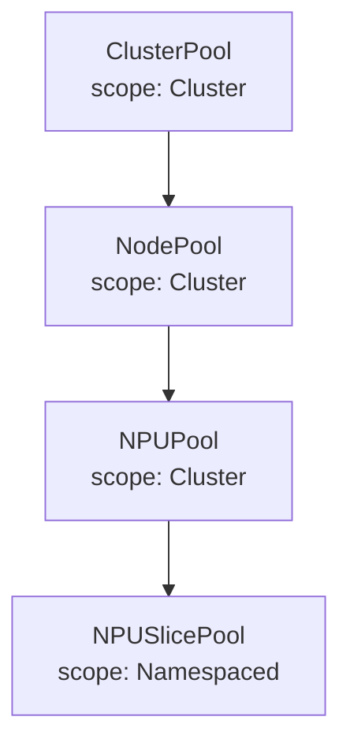

# Operators CLAUDE.md — Kubebuilder Operators 协作指南

> Operators 模块涵盖 `pool-operator`（池化 CRD，Phase 3）、`npu-dra-driver`（DRA driver scaffold，Phase 4）和 `inference-operator`（推理服务 CRD scaffold Phase 4 / controller body Phase 5）。

---

## 1. 模块定位

```
operators/
├── pool-operator/        4 级池化 CRD（ClusterPool / NodePool / NPUPool / NPUSlicePool）
├── npu-dra-driver/       Ascend NPU DRA driver(Phase 4 scaffold; allocation logic Phase 5+)
└── inference-operator/   推理服务 CRD（ModelService · scaffold Phase 4 T103 / controller Phase 5）
```

**Phase 4 W1 引入 npu-dra-driver(P4-T-003)**:Kubebuilder v4 scaffold + 预留 `--enable-publisher` / `--enable-claim-controller` flags;simulator-first(读 `configs/mock-data/set-a-small/npus.json`),不接触真实 NPU。详见 `docs/phase4-plan.md` §3 P4-T-003 与 `operators/npu-dra-driver/README.md`。三个 sub-project 共享本 CLAUDE.md 的工程约定(§3.x),但各自维护独立 `go.mod`(module path 不交叉依赖)。

**Phase 1 范围**：
- 只完成 **CRD 类型定义**（`api/v1alpha1/*.go`），**不**实现 Controller
- 配套 `make generate` 和 `make manifests` 跑通
- 输出 `config/crd/bases/` 下的 CRD YAML

**Phase 3+ 范围**：实现 Controller。

---

## 2. 模块路径所有权（OWN）

```
operators/**
```

CRD Go 类型 (`operators/pool-operator/api/v1alpha1/*.go`) 是**共享契约**——其他模块（backend datasource/crd, 前端 GO 生成的 TS 类型）会引用。

**修改 CRD 字段走 RFC**。

---

## 3. 工程约定

### 3.1 Kubebuilder 版本

固定使用：
```
kubebuilder v4+
controller-runtime v0.19+ (匹配 K8s 1.31)
```

### 3.2 域名 / Group

```
domain:  ocloud.edge.example.com
group:   ims (Infrastructure Management Services)
version: v1alpha1
```

完整 GVK 示例：
- `ims.ocloud.edge.example.com/v1alpha1/NPUSlicePool`

### 3.3 目录约定（pool-operator）

```
operators/pool-operator/
├── api/v1alpha1/
│   ├── groupversion_info.go
│   ├── clusterpool_types.go
│   ├── nodepool_types.go
│   ├── npupool_types.go
│   ├── npuslicepool_types.go
│   ├── shared_types.go              共用 struct（Quantity 等）
│   └── zz_generated.deepcopy.go     自动生成，不要手改
├── internal/controller/             Phase 3 引入
├── config/
│   ├── crd/bases/                   CRD YAML（自动生成）
│   ├── default/
│   ├── manager/
│   ├── rbac/
│   └── samples/                     YAML 示例
├── cmd/
│   └── main.go
├── Dockerfile
├── Makefile
├── PROJECT
├── go.mod
└── README.md
```

### 3.4 CRD 类型规范

每个 CRD：

```go
// +kubebuilder:object:root=true
// +kubebuilder:resource:scope=Namespaced,shortName=nsp
// +kubebuilder:subresource:status
// +kubebuilder:printcolumn:name="Strategy",type=string,JSONPath=`.spec.strategy`
// +kubebuilder:printcolumn:name="Total",type=integer,JSONPath=`.status.totalSlices`
// +kubebuilder:printcolumn:name="Available",type=integer,JSONPath=`.status.availableSlices`
// +kubebuilder:printcolumn:name="Age",type=date,JSONPath=`.metadata.creationTimestamp`
type NPUSlicePool struct {
    metav1.TypeMeta   `json:",inline"`
    metav1.ObjectMeta `json:"metadata,omitempty"`

    Spec   NPUSlicePoolSpec   `json:"spec,omitempty"`
    Status NPUSlicePoolStatus `json:"status,omitempty"`
}
```

**强制**：
- 每个字段加 `+kubebuilder` 验证（required / enum / minimum / pattern 等）
- Spec 字段必须有 godoc 注释（被 OpenAPI 用）
- 不允许 `interface{}` / `any`
- 引用外部类型用 `corev1.LocalObjectReference` 等标准类型

### 3.5 共享类型放 shared_types.go

```go
type SliceTemplate struct {
    // Name 模板名，如 "vir04"
    // +kubebuilder:validation:Required
    Name string `json:"name"`

    // AICoreCount AI Core 数量
    // +kubebuilder:validation:Required
    // +kubebuilder:validation:Minimum=1
    AICoreCount int32 `json:"aiCoreCount"`

    // MemoryMiB 显存 MiB
    // +kubebuilder:validation:Required
    MemoryMiB int32 `json:"memoryMiB"`
}
```

### 3.6 与 Mock 数据对齐

Phase 1 期间，`configs/mock-data/<set>/pools.json` 的结构必须能反序列化到这些 CRD 类型对应的 DTO（`backend/pkg/model`）。**model 与 CRD 类型字段名保持一致**（虽然 model 是独立的 DTO）。

---

## 4. 4 级 CRD 关系



引用关系用 `LocalObjectReference`（同 namespace）或自定义 `ClusterScopedReference`（跨 namespace）。

| CRD | Scope | 关键字段 |
|---|---|---|
| ClusterPool | Cluster | `clusters[]`（多站点） |
| NodePool | Cluster | `selector`, `role`（edge/core），`location` |
| NPUPool | Cluster | `nodePoolRef`, `npuModel`, `sliceStrategy` |
| NPUSlicePool | Namespaced | `npuPoolRef`, `strategy`, `fixedTemplates` 或 `dynamicSlicing` |

> ⚠️ **Phase 0 评审已知问题(2026-05-17)**:NPUSlicePool 是 Namespaced 而父池是 Cluster scoped → 多 namespace 可对同一物理 NPU 定义切片,**无 RBAC/Admission 强制隔离**。
>
> - Phase 1-2:**隔离 by convention only**,任务包要求所有 NPUSlicePool 落在 `ocloud-system` 命名空间
> - Phase 3:加 ValidatingAdmissionPolicy skeleton 防止跨 namespace 定义冲突切片
> - Phase 9:与 multi-tenancy 设计(Karmada + RBAC)一并落实
> - 详见 `docs/phase0-review.md` MUST-FIX #6

---

## 5. 开发命令

```bash
cd operators/pool-operator

make generate            # 生成 deepcopy
make manifests           # 生成 CRD YAML 到 config/crd/bases/
make build               # 编译 manager（Phase 3 起）
make test                # 单测
make lint
make install             # 装 CRD 到 kubectl 当前 context
make uninstall
make run                 # 本地跑 controller（Phase 3 起）

# Phase 1 仅需：
make generate && make manifests
```

CRD YAML 产物：`config/crd/bases/ims.ocloud.edge.example.com_npuslicepools.yaml`

---

## 6. Phase 1 验收

Phase 1 任务 P1-T-003 完成时必须：
- [ ] 4 个 CRD Go 类型定义齐全
- [ ] `make generate` 跑通
- [ ] `make manifests` 跑通
- [ ] CRD YAML 可被 `kubectl apply --dry-run=server -f config/crd/bases/` 校验
- [ ] `config/samples/` 下有每个 CRD 的示例 YAML（用于 Mock 数据生成参考）
- [ ] 字段命名与 `docs/api-contract.yaml` 的 schema 一致（不一致需 RFC）

---

## 7. 提交规则

```
feat(operators): define NPUSlicePool CRD types
feat(operators): generate manifests for v1alpha1 CRDs
docs(operators): add sample YAMLs for pool CRDs
```

---

## 8. 禁止行为

- ❌ 手改 `zz_generated.*.go`
- ❌ 不跑 `make generate / manifests` 就提交
- ❌ 引入外部 K8s API 之外的依赖（无理由）
- ❌ 修改 GroupVersion 不开 RFC
- ❌ 跨模块改文件

---

## 9. Phase 3 启动预告

Phase 3 才会在 `internal/controller/` 写 Controller。届时关注：
- Finalizer 设计
- 父子池 status 上卷
- 与 K8s DRA `ResourceSlice` 的映射
- 与 backend 的 informer 集成（backend 用 controller-runtime client 读 CRD）

不在 Phase 1 范围。

---

## 10. 常用 Prompt 模板

### 新增 / 修改 CRD 字段

```
读完 operators/CLAUDE.md 和 docs/agent-coordination.md 后，执行 P1-T-XXX。

具体：
1. 在 operators/pool-operator/api/v1alpha1/<crd>_types.go 添加字段
2. 加完整的 +kubebuilder marker（validation、printcolumn 如适用）
3. 加 godoc 注释
4. 跑 make generate && make manifests
5. 更新 config/samples/<crd>.yaml 示例
6. 如字段涉及共享契约（与 backend model 对齐），在 PR 描述里标注"契约变更"，让协调者评估是否需要 RFC

仅修改 operators/ 内的文件。
```
